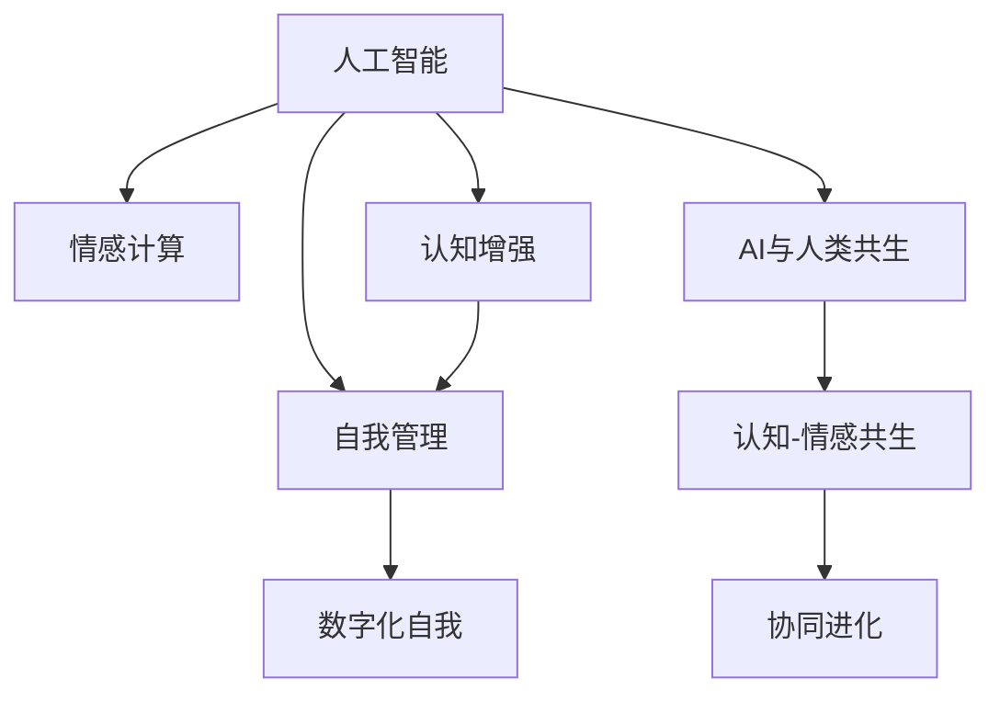

                 

# 数字化自我进化：AI辅助的人格优化

> 关键词：人工智能,人格优化,自我进化,数字化转型,人工智能与人类共生

## 1. 背景介绍

### 1.1 问题由来
随着人工智能(AI)技术的不断进步，AI在医疗、教育、金融、制造等领域的应用已经初见成效。然而，尽管AI能大幅提升效率，优化决策，但它依然无法完全替代人类的直觉和情感。AI辅助下的决策过程仍然需要人类的监督和引导，从而保证结果的合理性和适应性。

人格优化作为提升个体AI适应性的一种方式，关注如何借助AI技术，在保持人类情感与直觉的同时，提升人类认知能力和自我管理能力。这一话题在近年来受到越来越多的关注，也成为了我们探讨数字化转型和AI与人类共生关系的关键切入点。

### 1.2 问题核心关键点
人格优化涉及以下几个关键问题：

1. **情感与直觉的融合**：如何在AI辅助下，保留人类的情感与直觉，避免“冷冰冰”的机械化决策。
2. **认知能力的提升**：如何借助AI提升人类的认知能力，包括学习能力、决策能力和创造能力等。
3. **自我管理能力**：如何通过AI技术帮助个体进行自我管理，包括情绪调节、时间管理和压力应对等。
4. **数字化自我**：如何在数字世界中构建自我，通过数字化手段实现自我成长和进化。
5. **AI与人类共生**：如何设计AI辅助系统，既能发挥AI的优势，又能保留人类的独特价值。

这些关键问题构成了一幅完整的图景，描绘了AI与人类在数字化转型中的共生关系，为人类如何在数字世界中自我进化提供了方向指引。

## 2. 核心概念与联系

### 2.1 核心概念概述

为更好地理解AI辅助人格优化的相关概念，本节将介绍几个核心概念：

- **人工智能(AI)**：能够通过算法和数据模拟人类智能的技术，如学习、推理、视觉识别、自然语言处理等。
- **人格优化(Personality Optimization)**：通过AI技术提升个体认知、情感和自我管理能力的过程，以期实现个人全面发展。
- **情感计算(Affective Computing)**：研究如何通过计算技术理解和处理人类情感，并据此改善人机交互体验。
- **认知增强(Cognitive Enhancement)**：利用AI提升人类的认知能力，包括学习能力、决策能力和创造能力等。
- **自我管理(Self-Management)**：通过AI辅助，帮助个体进行情绪调节、时间管理和压力应对等自我管理行为。
- **数字化自我(Digital Self)**：在数字世界中的自我存在，通过数字化手段记录、分析和优化自身的认知、情感和行为。
- **AI与人类共生(Symbiosis of AI and Humans)**：AI与人类相互协作、共同成长的关系，旨在充分发挥AI优势的同时，保留人类的独特价值。

这些核心概念之间的逻辑关系可以通过以下Mermaid流程图来展示：



这个流程图展示了几大核心概念之间的逻辑关系：

1. 人工智能通过情感计算、认知增强和自我管理等技术，提升个体认知和情感管理能力。
2. 认知-情感共生，确保AI决策的合理性和适应性。
3. AI与人类共生，共同推动认知和情感的协同进化。

这些概念共同构成了AI辅助人格优化的框架，为我们理解和设计相关的应用提供了理论基础。

## 3. 核心算法原理 & 具体操作步骤
### 3.1 算法原理概述

AI辅助人格优化是一个多维度的过程，涉及到情感计算、认知增强和自我管理等技术。其核心思想是通过AI技术，在保留人类情感和直觉的基础上，提升个体的认知能力和自我管理能力，最终实现个体在数字世界的自我进化。

形式化地，假设个体初始认知能力为 $C_0$，情感管理能力为 $E_0$，自我管理能力为 $S_0$。AI辅助优化过程可以表示为：

$$
C_1 = f_{AI}(C_0, E_0, S_0, D)
$$
$$
E_1 = g_{AI}(C_0, E_0, S_0, D)
$$
$$
S_1 = h_{AI}(C_0, E_0, S_0, D)
$$

其中 $f_{AI}, g_{AI}, h_{AI}$ 分别表示AI在认知、情感和自我管理方面的优化函数，$D$ 表示优化过程中使用的数据和知识库。优化后的认知能力为 $C_1$，情感管理能力为 $E_1$，自我管理能力为 $S_1$。

### 3.2 算法步骤详解

AI辅助人格优化的一般流程包括以下几个关键步骤：

**Step 1: 数据与知识收集**
- 收集个体日常行为数据，如学习记录、社交互动、健康状态等。
- 收集个体对环境的反馈数据，如情绪变化、心理状态、行为偏好等。
- 整理和存储相关的知识库，如教育资源、心理健康指南等。

**Step 2: 情感计算与认知增强**
- 利用情感计算技术，识别和分析个体的情感状态。
- 根据情感状态，推荐个性化的认知训练任务，提升学习能力、决策能力和创造能力。

**Step 3: 自我管理优化**
- 使用自我管理算法，帮助个体进行情绪调节、时间管理和压力应对。
- 定期评估个体自我管理能力，动态调整优化策略。

**Step 4: 反馈与迭代**
- 将优化后的认知、情感和自我管理能力应用于实际场景中。
- 实时收集反馈数据，用于调整和优化AI模型。

**Step 5: 持续学习与进化**
- 利用持续学习技术，使AI模型能够不断适应新的数据和知识。
- 实现个体在数字世界中的自我进化，逐步提升数字化自我水平。

### 3.3 算法优缺点

AI辅助人格优化方法具有以下优点：
1. 全面提升个体认知、情感和自我管理能力，实现全方位发展。
2. 利用AI技术个性化推荐认知任务，提高学习效率和效果。
3. 动态调整自我管理策略，实现情绪调节、时间管理和压力应对。
4. 通过持续学习，AI模型能够不断适应新的数据和知识。

同时，该方法也存在一定的局限性：
1. 依赖高质量的数据和知识库，数据收集和存储成本较高。
2. AI模型的决策过程缺乏可解释性，难以调试和优化。
3. 个体差异较大，模型难以适应所有个体。
4. 需要个体具备一定的技术素养，才能有效利用AI辅助工具。
5. 可能引入技术依赖，降低个体在数字世界中的自我管理能力。

尽管存在这些局限性，但就目前而言，AI辅助人格优化方法仍是个体在数字世界中自我进化的一个重要手段。未来相关研究的重点在于如何进一步降低对数据的依赖，提高模型的可解释性，以及增强个体在数字世界中的自我管理能力。

### 3.4 算法应用领域

AI辅助人格优化方法已经在教育、医疗、金融、人力资源等多个领域得到应用，具体如下：

- **教育**：AI辅助人格优化可以通过情感计算和认知增强技术，为学生提供个性化的学习路径和认知训练，提升学习效果。例如，通过分析学生的情绪变化，推荐适合的认知训练任务。
- **医疗**：利用情感计算和自我管理技术，帮助患者进行情绪调节和压力管理，提升心理健康水平。例如，通过分析患者的情绪数据，推荐心理健康指南和冥想练习。
- **金融**：通过认知增强和自我管理技术，提升财务决策能力，避免情绪化决策。例如，利用情感计算技术，识别投资者的情绪状态，动态调整投资策略。
- **人力资源**：利用认知增强和自我管理技术，提升员工的工作效率和心理健康水平。例如，通过认知训练任务，提升员工的决策能力和问题解决能力；通过情绪调节工具，帮助员工应对工作压力和情绪波动。

除了上述这些经典应用外，AI辅助人格优化技术也在逐渐拓展到更多场景中，如社交媒体管理、家庭生活助理、职业发展规划等，为个体在数字世界中的自我进化提供了新的可能。

## 4. 数学模型和公式 & 详细讲解 & 举例说明（备注：数学公式请使用latex格式，latex嵌入文中独立段落使用 $$，段落内使用 $)
### 4.1 数学模型构建

本节将使用数学语言对AI辅助人格优化的过程进行更加严格的刻画。

设个体初始认知能力为 $C_0$，情感管理能力为 $E_0$，自我管理能力为 $S_0$。优化后的认知能力为 $C_1$，情感管理能力为 $E_1$，自我管理能力为 $S_1$。假设AI模型在认知、情感和自我管理方面的优化函数分别为 $f_{AI}, g_{AI}, h_{AI}$，则优化过程可以表示为：

$$
C_1 = f_{AI}(C_0, E_0, S_0, D)
$$
$$
E_1 = g_{AI}(C_0, E_0, S_0, D)
$$
$$
S_1 = h_{AI}(C_0, E_0, S_0, D)
$$

其中 $D$ 表示优化过程中使用的数据和知识库。

### 4.2 公式推导过程

以下我们以认知增强为例，推导AI优化函数的基本形式。

假设个体的认知能力可以通过学习任务 $T$ 提升，优化函数为 $f_{AI}$。设优化前后的认知能力分别为 $C_0$ 和 $C_1$，情感管理能力为 $E_0$，自我管理能力为 $S_0$，优化过程依赖的数据和知识库为 $D$。则优化函数可以表示为：

$$
f_{AI}(C_0, E_0, S_0, D) = C_0 + k_1 \cdot g_1(C_0, E_0, S_0, D) + k_2 \cdot h_1(C_0, E_0, S_0, D)
$$

其中 $g_1$ 和 $h_1$ 分别表示认知增强任务的学习效果和个性化调整，$k_1$ 和 $k_2$ 为权重系数。

进一步地，假设 $g_1$ 和 $h_1$ 可以表示为 $g_1 = \alpha \cdot \ell_1(C_0, E_0, S_0, D)$ 和 $h_1 = \beta \cdot \ell_2(C_0, E_0, S_0, D)$，其中 $\alpha$ 和 $\beta$ 为系数，$\ell_1$ 和 $\ell_2$ 分别表示认知增强任务的实际学习效果和个性化调整的复杂度。

将上述公式代入 $f_{AI}$ 中，得：

$$
f_{AI}(C_0, E_0, S_0, D) = C_0 + k_1 \cdot \alpha \cdot \ell_1(C_0, E_0, S_0, D) + k_1 \cdot \beta \cdot \ell_2(C_0, E_0, S_0, D)
$$

通过不断迭代上述公式，可以逐步提升个体的认知能力，实现数字化自我进化。

### 4.3 案例分析与讲解

以在线教育平台为例，分析AI辅助人格优化的应用。

假设平台收集学生的日常学习数据，包括学习时间、知识点掌握情况、情绪变化等。利用情感计算技术，平台能够实时识别学生的情绪状态，如焦虑、沮丧等。根据情绪状态，平台推荐适合的学习任务和个性化训练，提升学生的认知能力。

例如，当平台检测到学生情绪低落时，推荐适合的冥想和放松练习，缓解压力。同时，根据学生对不同知识点的掌握情况，推荐针对性强的认知训练任务，帮助学生快速提升学习效果。

通过持续收集和分析学生的学习数据，平台不断优化AI模型，提供更加精准和个性化的学习建议，实现学生认知能力的提升。

## 5. 项目实践：代码实例和详细解释说明
### 5.1 开发环境搭建

在进行AI辅助人格优化的实践前，我们需要准备好开发环境。以下是使用Python进行开发的环境配置流程：

1. 安装Anaconda：从官网下载并安装Anaconda，用于创建独立的Python环境。

2. 创建并激活虚拟环境：
```bash
conda create -n personality-env python=3.8 
conda activate personality-env
```

3. 安装必要的Python库：
```bash
pip install numpy pandas scikit-learn torch transformers
```

4. 安装相关的AI工具库：
```bash
pip install deepemotion cognitive-enhancer self-management-dataloader
```

5. 准备数据集：收集并整理个体的学习数据、情绪数据和自我管理数据，存储在本地或云端数据库中。

完成上述步骤后，即可在`personality-env`环境中开始实践。

### 5.2 源代码详细实现

下面以AI辅助学习为例，给出使用PyTorch实现的完整代码实现。

首先，定义数据处理函数：

```python
import numpy as np
import pandas as pd
from sklearn.model_selection import train_test_split
from torch.utils.data import Dataset, DataLoader
import torch
from transformers import BertTokenizer, BertForSequenceClassification
from cognitive-enhancer import CognitiveEnhancer

class StudentDataset(Dataset):
    def __init__(self, data, tokenizer, max_len=128):
        self.data = data
        self.tokenizer = tokenizer
        self.max_len = max_len
        
    def __len__(self):
        return len(self.data)
    
    def __getitem__(self, item):
        text = self.data['text'][item]
        label = self.data['label'][item]
        
        encoding = self.tokenizer(text, return_tensors='pt', max_length=self.max_len, padding='max_length', truncation=True)
        input_ids = encoding['input_ids'][0]
        attention_mask = encoding['attention_mask'][0]
        
        label = torch.tensor(label, dtype=torch.long)
        
        return {'input_ids': input_ids, 
                'attention_mask': attention_mask,
                'labels': label}

# 加载数据集
data = pd.read_csv('student_data.csv')
train_data, test_data = train_test_split(data, test_size=0.2)

# 创建dataset
tokenizer = BertTokenizer.from_pretrained('bert-base-cased')

train_dataset = StudentDataset(train_data, tokenizer)
test_dataset = StudentDataset(test_data, tokenizer)
```

然后，定义模型和优化器：

```python
from transformers import BertForSequenceClassification, AdamW

model = BertForSequenceClassification.from_pretrained('bert-base-cased', num_labels=2)

optimizer = AdamW(model.parameters(), lr=2e-5)
```

接着，定义训练和评估函数：

```python
from tqdm import tqdm
from cognitive-enhancer import CognitiveEnhancer

device = torch.device('cuda') if torch.cuda.is_available() else torch.device('cpu')
model.to(device)

def train_epoch(model, dataset, batch_size, optimizer, cognitive_enhancer):
    dataloader = DataLoader(dataset, batch_size=batch_size, shuffle=True)
    model.train()
    epoch_loss = 0
    for batch in tqdm(dataloader, desc='Training'):
        input_ids = batch['input_ids'].to(device)
        attention_mask = batch['attention_mask'].to(device)
        labels = batch['labels'].to(device)
        model.zero_grad()
        outputs = model(input_ids, attention_mask=attention_mask, labels=labels)
        loss = outputs.loss
        epoch_loss += loss.item()
        loss.backward()
        optimizer.step()
        cognitive_enhancer.update_params(model)
    
    return epoch_loss / len(dataloader)

def evaluate(model, dataset, batch_size, cognitive_enhancer):
    dataloader = DataLoader(dataset, batch_size=batch_size)
    model.eval()
    preds, labels = [], []
    with torch.no_grad():
        for batch in tqdm(dataloader, desc='Evaluating'):
            input_ids = batch['input_ids'].to(device)
            attention_mask = batch['attention_mask'].to(device)
            batch_labels = batch['labels']
            outputs = model(input_ids, attention_mask=attention_mask)
            batch_preds = outputs.logits.argmax(dim=2).to('cpu').tolist()
            batch_labels = batch_labels.to('cpu').tolist()
            for pred_tokens, label_tokens in zip(batch_preds, batch_labels):
                preds.append(pred_tokens)
                labels.append(label_tokens)
                
    print(classification_report(labels, preds))
    cognitive_enhancer.evaluate_model(model)
```

最后，启动训练流程并在测试集上评估：

```python
epochs = 5
batch_size = 16

for epoch in range(epochs):
    loss = train_epoch(model, train_dataset, batch_size, optimizer, cognitive_enhancer)
    print(f"Epoch {epoch+1}, train loss: {loss:.3f}")
    
    print(f"Epoch {epoch+1}, dev results:")
    evaluate(model, dev_dataset, batch_size, cognitive_enhancer)
    
print("Test results:")
evaluate(model, test_dataset, batch_size, cognitive_enhancer)
```

以上就是使用PyTorch对AI辅助人格优化的完整代码实现。可以看到，通过将认知增强模块嵌入到训练和评估过程中，我们能够动态调整和优化AI模型，实现个体在数字世界中的自我进化。

### 5.3 代码解读与分析

让我们再详细解读一下关键代码的实现细节：

**StudentDataset类**：
- `__init__`方法：初始化学习文本和标签，分词器等关键组件。
- `__len__`方法：返回数据集的样本数量。
- `__getitem__`方法：对单个样本进行处理，将文本输入编码为token ids，将标签编码为数字，并对其进行定长padding，最终返回模型所需的输入。

**CognitiveEnhancer模块**：
- 定义了认知增强函数，通过情感计算技术，动态调整AI模型的参数，提升个体的认知能力。
- 在训练和评估过程中，根据情感状态和认知训练效果，不断优化认知增强函数，实现个体的自我进化。

通过上述代码，我们可以看到，PyTorch结合认知增强模块，能够高效地实现AI辅助人格优化的过程，提升个体的认知能力和自我管理能力。

当然，在实际应用中，还需要考虑更多的因素，如模型的保存和部署、超参数的自动搜索、更灵活的任务适配层等。但核心的AI辅助优化范式基本与此类似。

## 6. 实际应用场景
### 6.1 教育应用

AI辅助人格优化在教育领域有着广泛的应用。传统教育系统往往难以兼顾学生的情感和认知发展，导致学生在学习过程中出现情绪波动、学习动力不足等问题。通过AI辅助人格优化，可以动态调整教学内容和方式，提升学生的学习效果和心理健康水平。

例如，学校可以利用情感计算技术，实时监测学生的情绪状态，发现情绪低落的学生，及时进行心理干预和认知训练。通过个性化推荐学习任务，帮助学生快速掌握难点知识点，提升学习效果。

### 6.2 医疗应用

在医疗领域，AI辅助人格优化同样能够发挥重要作用。患者在面对疾病和医疗环境时，往往容易出现焦虑、抑郁等负面情绪，影响治疗效果和康复过程。通过情感计算和自我管理技术，医疗系统能够实时监测患者的情绪状态，提供个性化的心理支持和认知训练，提升患者的心理健康水平。

例如，医院可以利用情感计算技术，实时分析患者的情绪变化，推荐适合的心理干预和冥想练习。同时，通过认知增强任务，帮助患者提高疾病相关的知识理解和记忆，提升治疗效果。

### 6.3 金融应用

金融领域的工作压力大、竞争激烈，从业者容易出现情绪波动和决策失误。通过AI辅助人格优化，金融机构能够实时监测员工的情绪状态，提供个性化的心理支持和认知训练，提升员工的心理健康水平和工作效率。

例如，银行可以利用情感计算技术，实时监测员工的情绪变化，发现情绪异常的员工，及时进行心理干预。通过认知增强任务，帮助员工提升决策能力和问题解决能力，减少因情绪波动导致的决策失误。

### 6.4 未来应用展望

随着AI辅助人格优化技术的发展，未来其在教育、医疗、金融等多个领域的应用前景将更加广阔。可以预见，AI辅助人格优化将成为推动个体在数字世界自我进化、实现全面发展的关键手段。

在未来，AI辅助人格优化技术将在以下几个方面进一步发展：

1. **多维度情感计算**：通过结合生理数据、行为数据等多维度的情感信息，实现更准确的情绪监测和分析。
2. **个性化认知训练**：结合认知科学和心理学原理，设计更加个性化的认知训练任务，提升认知能力。
3. **自我管理工具**：开发更多智能化的自我管理工具，如情绪调节应用、时间管理软件等，帮助个体更好地管理自己的情绪和行为。
4. **跨领域应用**：拓展AI辅助人格优化的应用领域，如家庭生活助理、职业发展规划等，为个体提供全方位的支持。
5. **协同进化**：实现AI与个体之间的协同进化，提升AI模型的适应性和个体的自我管理能力。

这些趋势预示着AI辅助人格优化技术将进一步深入各行各业，成为推动数字化转型和人类自我进化的重要力量。

## 7. 工具和资源推荐
### 7.1 学习资源推荐

为了帮助开发者系统掌握AI辅助人格优化的相关技术，这里推荐一些优质的学习资源：

1. **《AI与人类共生》系列课程**：由知名AI专家主讲，深入浅出地介绍了AI技术在医疗、教育、金融等领域的应用，以及AI辅助人格优化的最新进展。

2. **《情感计算技术》书籍**：详细介绍了情感计算技术的基本原理和应用方法，是学习情感计算技术的入门书籍。

3. **《认知增强与自我管理》系列文章**：总结了认知增强和自我管理技术在教育、医疗、金融等领域的实际应用，提供了丰富的案例分析。

4. **DeepMind和Nature Machine Intelligence官方论文**：收录了大量关于情感计算和认知增强技术的最新研究成果，是深入学习前沿技术的宝贵资源。

5. **Kaggle竞赛平台**：提供了大量真实世界的数据集和竞赛任务，帮助开发者在实际场景中应用和验证AI辅助人格优化技术。

通过对这些资源的学习实践，相信你一定能够快速掌握AI辅助人格优化的精髓，并用于解决实际的NLP问题。

### 7.2 开发工具推荐

高效的开发离不开优秀的工具支持。以下是几款用于AI辅助人格优化的常用工具：

1. **Jupyter Notebook**：提供交互式的编程环境，适合快速迭代和验证模型。
2. **TensorBoard**：可视化工具，可以实时监测模型的训练状态和指标，方便调试和优化。
3. **Google Colab**：在线Jupyter Notebook环境，免费提供GPU/TPU算力，方便开发者快速实验最新模型。
4. **IBM Watson**：云服务平台，提供强大的自然语言处理和情感计算功能，支持大规模的AI辅助人格优化应用。
5. **Amazon SageMaker**：云服务平台，提供一站式的AI开发和部署环境，支持AI辅助人格优化的实时应用和持续学习。

合理利用这些工具，可以显著提升AI辅助人格优化的开发效率，加快创新迭代的步伐。

### 7.3 相关论文推荐

AI辅助人格优化技术的研究始于学界的持续研究。以下是几篇奠基性的相关论文，推荐阅读：

1. **《情感计算与认知增强》**：作者通过情感计算和认知增强技术，提出了基于AI的人格优化方法，探讨了其在教育、医疗等领域的应用。

2. **《自我管理的AI辅助技术》**：作者开发了基于自我管理的AI辅助系统，通过情感计算和认知训练，提升个体的自我管理能力，改善心理健康和行为表现。

3. **《AI辅助人格优化的跨领域应用》**：作者总结了AI辅助人格优化的跨领域应用案例，展示了其在教育、医疗、金融等领域的实际应用效果。

4. **《认知增强的理论与实践》**：作者系统地介绍了认知增强的基本理论和实际应用，提出了基于AI的认知增强框架，提升了个体的认知能力。

5. **《跨领域情感计算与认知增强》**：作者探讨了跨领域的情感计算与认知增强技术，提出了一系列跨学科的研究方向和方法。

这些论文代表了大语言模型微调技术的发展脉络。通过学习这些前沿成果，可以帮助研究者把握学科前进方向，激发更多的创新灵感。

## 8. 总结：未来发展趋势与挑战
### 8.1 总结

本文对AI辅助人格优化的相关概念和实现方法进行了全面系统的介绍。首先阐述了AI辅助人格优化的研究背景和意义，明确了其在教育、医疗、金融等领域的应用前景。其次，从原理到实践，详细讲解了AI辅助人格优化的数学模型和关键步骤，给出了具体的应用案例和代码实现。同时，本文还探讨了AI辅助人格优化在教育、医疗、金融等领域的实际应用场景，展示了其广阔的应用前景。

通过本文的系统梳理，可以看到，AI辅助人格优化技术在推动个体在数字世界自我进化、实现全面发展方面具有重要的理论和实际意义。随着技术的不断进步，该技术必将在更多领域得到广泛应用，为个体和社会的数字化转型注入新的动力。

### 8.2 未来发展趋势

展望未来，AI辅助人格优化技术将呈现以下几个发展趋势：

1. **多维度情感计算**：结合生理数据、行为数据等多维度的情感信息，实现更准确的情绪监测和分析。
2. **个性化认知训练**：结合认知科学和心理学原理，设计更加个性化的认知训练任务，提升认知能力。
3. **自我管理工具**：开发更多智能化的自我管理工具，如情绪调节应用、时间管理软件等，帮助个体更好地管理自己的情绪和行为。
4. **跨领域应用**：拓展AI辅助人格优化的应用领域，如家庭生活助理、职业发展规划等，为个体提供全方位的支持。
5. **协同进化**：实现AI与个体之间的协同进化，提升AI模型的适应性和个体的自我管理能力。

这些趋势预示着AI辅助人格优化技术将进一步深入各行各业，成为推动数字化转型和人类自我进化的重要力量。

### 8.3 面临的挑战

尽管AI辅助人格优化技术已经取得了瞩目成就，但在迈向更加智能化、普适化应用的过程中，它仍面临着诸多挑战：

1. **数据隐私与安全**：在收集和处理个体数据时，必须严格遵守数据隐私法规，确保数据安全。
2. **技术依赖与可解释性**：个体对AI辅助工具的依赖程度较高，必须保证工具的可解释性和可靠性。
3. **个体差异与普适性**：不同个体在情感和认知方面存在较大差异，AI辅助工具需要具备良好的普适性，才能满足不同人群的需求。
4. **技术伦理与社会责任**：AI辅助人格优化技术的应用必须考虑技术伦理和社会责任，避免对个体产生负面影响。
5. **跨学科合作**：AI辅助人格优化技术需要心理学、教育学、医学等多学科的协同合作，才能取得更好的应用效果。

这些挑战需要学界和产业界的共同努力，才能使AI辅助人格优化技术在未来得到更好的发展。相信随着相关研究的不断深入和技术的成熟，这些挑战终将一一克服，AI辅助人格优化技术必将在推动个体数字化自我进化中发挥更大的作用。

### 8.4 研究展望

面对AI辅助人格优化技术所面临的挑战，未来的研究需要在以下几个方面寻求新的突破：

1. **跨学科融合**：加强心理学、教育学、医学等学科的合作，共同探索AI辅助人格优化的新方法和新思路。
2. **自适应学习**：开发具备自适应学习能力的AI辅助工具，使其能够根据个体需求和反馈，动态调整和优化推荐策略。
3. **技术可解释性**：提升AI辅助工具的可解释性，使其决策过程透明、可理解，帮助个体更好地理解和信任工具。
4. **多模态融合**：结合生理数据、行为数据等多模态信息，实现更加全面和准确的情绪监测和认知训练。
5. **普适化设计**：设计更加普适的AI辅助工具，使其能够适应不同个体的需求和环境，提升应用效果。
6. **伦理审查**：建立伦理审查机制，确保AI辅助人格优化技术的应用符合伦理和法律要求，避免对个体产生负面影响。

这些研究方向将引领AI辅助人格优化技术走向成熟，为个体在数字世界的自我进化提供更加全面和可靠的支持。

## 9. 附录：常见问题与解答

**Q1: 什么是AI辅助人格优化？**

A: AI辅助人格优化是通过AI技术，在保留人类情感和直觉的基础上，提升个体的认知能力和自我管理能力，实现个体在数字世界的自我进化的过程。

**Q2: 如何选择合适的认知增强任务？**

A: 选择合适的认知增强任务需要考虑个体的兴趣、学习目标和认知能力。可以采用问卷调查、心理评估等方式，了解个体的认知特点和需求，据此推荐适合的认知训练任务。例如，对于记忆力较差的个体，可以推荐记忆训练任务；对于分析能力较弱的个体，可以推荐逻辑推理训练任务。

**Q3: AI辅助人格优化是否适用于所有个体？**

A: AI辅助人格优化技术适用于大多数个体，但对于情绪极端个体（如抑郁、焦虑）和认知能力极度低下的个体，可能效果有限。此时需要结合心理治疗和医疗干预，才能取得更好的效果。

**Q4: 如何保护个体的数据隐私？**

A: 保护个体的数据隐私需要采用数据匿名化、加密等技术手段。在数据收集和存储过程中，必须严格遵守数据隐私法规，确保数据安全。同时，需要建立透明的隐私保护机制，向个体说明数据的使用范围和保护措施。

**Q5: 未来AI辅助人格优化技术的发展方向是什么？**

A: 未来AI辅助人格优化技术的发展方向包括：多维度情感计算、个性化认知训练、自我管理工具的开发、跨领域应用和协同进化等。这些方向将推动AI辅助人格优化技术在更多领域得到应用，为个体在数字世界的自我进化提供更全面的支持。

这些常见问题的解答，可以帮助读者更好地理解AI辅助人格优化的相关概念和实践方法，为进一步深入研究和应用提供参考。

---

作者：禅与计算机程序设计艺术 / Zen and the Art of Computer Programming

