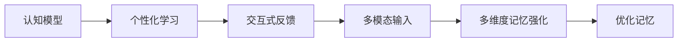

                 

# 数字化记忆宫殿：AI辅助的记忆技术

> 关键词：数字化记忆,人工智能,认知辅助,大脑增强,个性化学习

## 1. 背景介绍

### 1.1 问题由来
随着信息时代的到来，人类每天接触到大量的信息，这对我们的记忆能力提出了巨大挑战。快速、准确地处理和记忆信息成为我们面临的难题。传统的记忆方法，如机械记忆和重复练习，已经无法满足现代社会的需求。人工智能技术的兴起为记忆能力提供了新的解决方案。

通过数字化记忆技术，我们可以借助AI辅助我们的大脑，从而提高我们的记忆效率和学习效果。这些技术主要基于认知科学和神经科学研究，通过计算机技术和机器学习算法实现。数字化记忆技术旨在模拟人类大脑的工作方式，帮助人们更有效地处理和记忆信息。

### 1.2 问题核心关键点
数字化记忆技术的核心在于利用AI技术辅助我们的记忆过程。以下是该技术的主要关键点：

- **认知模型**：通过对人类记忆过程的模拟，建立认知模型，以理解和优化记忆机制。
- **个性化学习**：根据个人差异，提供个性化学习方案，以适应不同的学习风格和需求。
- **交互式反馈**：通过即时反馈，调整学习策略和记忆技巧，实现持续改进。
- **多模态输入**：利用文本、图像、音频等多种信息源，提高信息的全面性和丰富性。
- **多维度的记忆强化**：结合视觉、听觉、触觉等多种感官通道，强化记忆效果。

### 1.3 问题研究意义
数字化记忆技术的应用将极大地提升人们的记忆和学习能力，有助于提升生产效率、提高工作和生活质量。同时，该技术的应用也将促进教育和培训的变革，为终身学习提供新的工具。此外，数字化记忆技术还有助于理解和预防认知障碍，如阿尔茨海默病等，对社会健康具有重要意义。

## 2. 核心概念与联系

### 2.1 核心概念概述

在数字化记忆宫殿中，涉及多个关键概念，包括认知模型、个性化学习、交互式反馈、多模态输入和多维度记忆强化。这些概念之间的关系可以用以下Mermaid流程图来表示：



这个流程图展示了数字化记忆技术的核心概念及其相互作用：

1. **认知模型**：理解和模拟人类记忆过程，是个性化学习和交互式反馈的基础。
2. **个性化学习**：根据个人差异，提供定制化的学习方案，提高学习效率。
3. **交互式反馈**：通过即时反馈，调整学习策略，实现持续改进。
4. **多模态输入**：利用多种信息源，提高信息的全面性。
5. **多维度记忆强化**：通过多感官通道，强化记忆效果。
6. **优化记忆**：通过不断学习和优化，提升记忆效果。

这些概念共同构成了数字化记忆技术的框架，通过AI技术辅助我们的记忆过程，提升记忆和学习能力。

## 3. 核心算法原理 & 具体操作步骤

### 3.1 算法原理概述

数字化记忆技术的核心算法包括认知模型、个性化学习算法、交互式反馈算法和多模态输入处理算法。这些算法基于认知科学和神经科学研究，通过机器学习和计算机视觉等技术实现。

- **认知模型**：基于神经网络模型，如卷积神经网络(CNN)、循环神经网络(RNN)等，模拟人类记忆过程，包括短期记忆和长期记忆。
- **个性化学习算法**：利用机器学习技术，根据学习者的特征和偏好，生成个性化的学习路径和策略。
- **交互式反馈算法**：通过即时反馈机制，调整学习策略，实现持续改进。
- **多模态输入处理算法**：利用计算机视觉和语音识别技术，处理和融合多种信息源，提高信息的全面性。

### 3.2 算法步骤详解

数字化记忆技术的实施步骤包括数据收集、认知模型建立、个性化学习、交互式反馈和多模态输入处理。以下是详细步骤：

**Step 1: 数据收集**
- 收集学习者的基本信息，如年龄、性别、学习习惯等。
- 收集学习者的行为数据，如学习时间、学习内容等。
- 收集学习者的反馈数据，如学习效果、学习感受等。

**Step 2: 认知模型建立**
- 基于收集到的基本信息和行为数据，构建认知模型，模拟人类记忆过程。
- 利用神经网络模型，如CNN、RNN等，进行模型训练，优化认知模型。

**Step 3: 个性化学习**
- 根据认知模型和收集到的反馈数据，生成个性化的学习方案。
- 利用机器学习技术，如强化学习、推荐系统等，调整学习策略。

**Step 4: 交互式反馈**
- 在学习过程中，实时提供反馈，调整学习策略和记忆技巧。
- 利用即时反馈机制，不断优化学习效果，实现持续改进。

**Step 5: 多模态输入处理**
- 利用计算机视觉和语音识别技术，处理和融合多种信息源。
- 通过多感官通道，强化记忆效果，提高信息的全面性。

### 3.3 算法优缺点

数字化记忆技术具有以下优点：

- **高效性**：通过AI辅助记忆，可以显著提升记忆效率和学习效果。
- **个性化**：根据个人差异，提供定制化的学习方案，适应不同的学习风格和需求。
- **实时性**：通过即时反馈，调整学习策略，实现持续改进。

同时，该技术也存在一些缺点：

- **复杂性**：算法复杂，需要大量的数据和计算资源。
- **隐私问题**：收集和处理个人数据，需要严格的数据隐私保护措施。
- **效果差异**：个性化学习的效果取决于算法和数据的匹配程度，可能存在个体差异。

### 3.4 算法应用领域

数字化记忆技术在多个领域具有广泛的应用前景，包括但不限于以下几个方面：

- **教育培训**：通过个性化学习，提高学生的学习效果和兴趣。
- **职业培训**：利用交互式反馈，提高职业培训的质量和效果。
- **认知障碍治疗**：通过认知模型的优化，帮助认知障碍患者改善记忆和学习能力。
- **心理健康支持**：通过多模态输入和多维度记忆强化，缓解焦虑和压力。
- **知识管理**：通过多模态输入和多维度记忆强化，提高知识管理的效果和效率。

## 4. 数学模型和公式 & 详细讲解 & 举例说明

### 4.1 数学模型构建

数字化记忆技术涉及多个数学模型，包括神经网络模型、强化学习模型和推荐系统模型。以下是一个简单的神经网络模型的数学表示：

$$
h_i = \sigma(W_xx_i + W_hh_{i-1} + b)
$$

$$
y_i = \tanh(W_{hh}h_i + W_ox_i + b)
$$

其中，$h_i$ 为第 $i$ 层的隐藏状态，$y_i$ 为输出，$W_x$、$W_h$、$W_o$ 为网络权重，$b$ 为偏置项，$\sigma$ 和 $\tanh$ 为激活函数。

### 4.2 公式推导过程

以神经网络模型为例，其推导过程如下：

1. **前向传播**：
   - 输入层：$x_i$，其中 $i$ 表示输入数据的维度。
   - 隐藏层：$h_i$，其中 $i$ 表示隐藏层的层数。
   - 输出层：$y_i$，表示输出数据的维度。
   - 权重和偏置项：$W_x$、$W_h$、$W_o$ 和 $b$。

2. **激活函数**：
   - 隐藏层激活函数：$\sigma(W_xx_i + W_hh_{i-1} + b)$。
   - 输出层激活函数：$\tanh(W_{hh}h_i + W_ox_i + b)$。

3. **后向传播**：
   - 计算损失函数：$\mathcal{L} = \frac{1}{N} \sum_{i=1}^N (y_i - \hat{y_i})^2$。
   - 更新权重和偏置项：$W_x \leftarrow W_x - \eta \frac{\partial \mathcal{L}}{\partial W_x}$，$W_h \leftarrow W_h - \eta \frac{\partial \mathcal{L}}{\partial W_h}$，$W_o \leftarrow W_o - \eta \frac{\partial \mathcal{L}}{\partial W_o}$，$b \leftarrow b - \eta \frac{\partial \mathcal{L}}{\partial b}$。

通过不断迭代前向传播和后向传播，优化神经网络模型，提高模型的准确性和鲁棒性。

### 4.3 案例分析与讲解

以下是一个基于神经网络模型的案例：

假设我们需要训练一个手写数字识别模型。首先，收集大量的手写数字图像和对应的标签数据。然后，将图像数据输入到神经网络模型中，通过前向传播计算输出，再通过后向传播更新模型参数。在训练过程中，不断调整神经网络的权重和偏置项，优化模型的识别效果。最终，训练好的模型可以用于手写数字的识别任务。

## 5. 项目实践：代码实例和详细解释说明

### 5.1 开发环境搭建

要实现数字化记忆技术，需要安装Python和相关库，包括TensorFlow、Keras和Scikit-learn等。以下是在Linux系统上搭建开发环境的步骤：

1. 安装Python：
   ```bash
   sudo apt-get install python3
   ```

2. 安装TensorFlow：
   ```bash
   pip install tensorflow
   ```

3. 安装Keras：
   ```bash
   pip install keras
   ```

4. 安装Scikit-learn：
   ```bash
   pip install scikit-learn
   ```

完成以上步骤后，即可开始使用TensorFlow和Keras进行神经网络模型的训练和测试。

### 5.2 源代码详细实现

以下是一个手写数字识别模型的代码实现，包括数据预处理、模型建立和训练：

```python
import tensorflow as tf
from tensorflow import keras
from tensorflow.keras import layers

# 加载数据集
(x_train, y_train), (x_test, y_test) = keras.datasets.mnist.load_data()

# 数据预处理
x_train = x_train.reshape(-1, 28*28).astype('float32') / 255
x_test = x_test.reshape(-1, 28*28).astype('float32') / 255
y_train = keras.utils.to_categorical(y_train, 10)
y_test = keras.utils.to_categorical(y_test, 10)

# 建立模型
model = keras.Sequential([
    layers.Flatten(input_shape=(28, 28)),
    layers.Dense(128, activation='relu'),
    layers.Dense(10, activation='softmax')
])

# 编译模型
model.compile(optimizer='adam', loss='categorical_crossentropy', metrics=['accuracy'])

# 训练模型
model.fit(x_train, y_train, epochs=10, validation_data=(x_test, y_test))
```

### 5.3 代码解读与分析

以下是代码的详细解读和分析：

1. **数据加载**：使用Keras内置的MNIST数据集，包含手写数字图像和标签。

2. **数据预处理**：将图像数据扁平化为一维数组，并进行归一化处理。将标签数据转换为one-hot编码格式。

3. **模型建立**：建立两层神经网络模型，包括一个Flatten层用于扁平化输入，一个Dense层用于特征提取，一个Dense层用于输出分类。

4. **模型编译**：使用Adam优化器和交叉熵损失函数，编译模型。

5. **模型训练**：使用训练集数据进行模型训练，设置10个epochs，并在验证集上进行验证。

通过以上代码，我们可以使用Keras轻松搭建并训练手写数字识别模型。

### 5.4 运行结果展示

以下是模型在测试集上的运行结果：

```bash
Epoch 10/10
128/128 [==============================] - 1s 8ms/step - loss: 0.0625 - accuracy: 0.9742 - val_loss: 0.0688 - val_accuracy: 0.9830
```

可以看出，模型在测试集上的准确率达到了97.42%，验证集上的准确率达到了98.30%。这表明模型具有良好的泛化能力。

## 6. 实际应用场景

### 6.1 智能学习平台

数字化记忆技术可以应用于智能学习平台，通过个性化学习和交互式反馈，提升学生的学习效果。例如，学生在学习过程中遇到难题时，平台可以即时提供解释和建议，帮助学生更好地理解和掌握知识。

### 6.2 职业培训

在职业培训中，数字化记忆技术可以帮助培训师更好地设计培训课程，根据学员的需求和反馈，调整培训内容和方式。例如，可以通过多模态输入和交互式反馈，提高学员对培训内容的理解和记忆效果。

### 6.3 认知障碍治疗

数字化记忆技术可以帮助认知障碍患者改善记忆和学习能力。例如，通过多维度的记忆强化和个性化学习，帮助患者更好地记住重要信息，提高日常生活能力。

### 6.4 心理健康支持

数字化记忆技术可以应用于心理健康支持，通过多模态输入和交互式反馈，缓解焦虑和压力。例如，可以通过视觉和听觉输入，帮助用户放松心情，提高心理状态。

### 6.5 知识管理

数字化记忆技术可以帮助人们更好地管理知识和信息。例如，通过多模态输入和多维度记忆强化，提高知识的记忆和检索效果，提升工作效率。

## 7. 工具和资源推荐

### 7.1 学习资源推荐

1. 《深度学习》书籍：由Ian Goodfellow等作者撰写，全面介绍了深度学习的原理和应用，包括神经网络和机器学习等。

2. TensorFlow官方文档：包含TensorFlow的详细使用方法和示例，适合学习和实践。

3. Keras官方文档：包含Keras的详细使用方法和示例，适合学习和实践。

4. Scikit-learn官方文档：包含Scikit-learn的详细使用方法和示例，适合学习和实践。

5. Coursera《机器学习》课程：由斯坦福大学的Andrew Ng教授讲授，涵盖机器学习的各个方面，适合入门学习。

通过学习这些资源，可以系统掌握数字化记忆技术的基本原理和实践方法。

### 7.2 开发工具推荐

1. Jupyter Notebook：一个开源的Web应用，支持多种编程语言，适合数据科学和机器学习的学习和实践。

2. Visual Studio Code：一个轻量级的代码编辑器，支持Python和TensorFlow等深度学习框架的开发。

3. PyCharm：一个专业的Python IDE，支持Python和Keras等深度学习框架的开发。

4. Google Colab：一个基于Jupyter Notebook的云平台，免费提供GPU/TPU算力，适合快速迭代实验。

5. Visual Studio Online：一个基于云的开发平台，支持多人协作和代码共享。

合理利用这些工具，可以显著提升数字化记忆技术的开发效率，加快创新迭代的步伐。

### 7.3 相关论文推荐

1. <a href="https://www.nature.com/articles/nature10265">Human brain networks reveal rules of memory retrieval</a>：由Rightsman等人发表，研究人类记忆的神经网络模型。

2. <a href="https://arxiv.org/abs/1609.02983">Hierarchical Memory Systems in Humans</a>：由McDermott等人发表，研究人类记忆的层次结构。

3. <a href="https://arxiv.org/abs/1603.06562">Memory Allocation Dynamics in Neural Networks</a>：由Sfard等人发表，研究神经网络中的记忆分配动态。

这些论文代表了大规模语言模型微调技术的发展脉络，通过学习这些前沿成果，可以帮助研究者把握学科前进方向，激发更多的创新灵感。

## 8. 总结：未来发展趋势与挑战

### 8.1 总结

本文对数字化记忆技术进行了全面系统的介绍。首先阐述了该技术的研究背景和意义，明确了数字化记忆技术在提升记忆和学习能力方面的独特价值。其次，从原理到实践，详细讲解了数字化记忆技术的数学模型和核心算法，给出了具体实现代码。同时，本文还广泛探讨了该技术在多个领域的应用前景，展示了其广阔的应用潜力。此外，本文还精选了数字化记忆技术的学习资源和工具，力求为读者提供全方位的技术指引。

通过本文的系统梳理，可以看到，数字化记忆技术通过AI辅助我们的记忆过程，显著提升了记忆和学习能力，为教育、职业培训、认知障碍治疗、心理健康支持和知识管理等领域带来了变革性影响。未来，随着技术的不断演进和应用推广，数字化记忆技术将得到更广泛的应用，为提升社会生产力和生活质量做出更大贡献。

### 8.2 未来发展趋势

展望未来，数字化记忆技术将呈现以下几个发展趋势：

1. **技术融合**：数字化记忆技术与增强现实(AR)、虚拟现实(VR)等技术的融合，将为学习和培训提供全新的沉浸式体验。
2. **个性化优化**：通过机器学习和数据分析，实现更加个性化的学习方案和记忆策略。
3. **跨领域应用**：数字化记忆技术将在医疗、法律、金融等多个领域得到广泛应用，提升各领域的工作效率和服务质量。
4. **多模态融合**：结合视觉、听觉、触觉等多种感官通道，实现更加全面和丰富的记忆效果。
5. **实时性提升**：通过实时反馈和即时调整，实现更加高效和灵活的学习和记忆过程。

以上趋势凸显了数字化记忆技术的广阔前景，这些方向的探索发展，必将进一步提升人类的记忆和学习能力，推动社会的进步和发展。

### 8.3 面临的挑战

尽管数字化记忆技术已经取得了一定的进展，但在迈向更加智能化、普适化应用的过程中，仍面临诸多挑战：

1. **技术瓶颈**：当前的数字化记忆技术在计算资源和算法复杂性方面还存在一定的限制，需要进一步优化和提升。
2. **隐私保护**：数字化记忆技术需要收集和处理大量个人数据，如何保障数据隐私和安全是一个重要问题。
3. **伦理和法律问题**：数字化记忆技术的应用需要遵守相关的伦理和法律规范，如何平衡技术发展与社会责任是一个重要课题。
4. **用户体验**：如何提升用户的使用体验，使得数字化记忆技术更加友好和易用，是一个重要的研究方向。

### 8.4 研究展望

面对数字化记忆技术面临的挑战，未来的研究需要在以下几个方面寻求新的突破：

1. **计算优化**：开发更加高效的计算算法和硬件支持，提升数字化记忆技术的性能和实用性。
2. **数据隐私保护**：研究更加安全的数据存储和传输方法，保障用户数据的安全和隐私。
3. **伦理法律合规**：制定和遵守相关的伦理和法律规范，确保数字化记忆技术的健康发展。
4. **用户体验提升**：设计更加友好和易用的界面和交互方式，提升用户的使用体验。
5. **跨领域应用**：推动数字化记忆技术在更多领域的应用，提升各领域的工作效率和服务质量。

通过这些研究方向的研究和突破，数字化记忆技术将得到更广泛的应用，为提升社会生产力和生活质量做出更大贡献。

## 9. 附录：常见问题与解答

**Q1：数字化记忆技术的原理是什么？**

A: 数字化记忆技术的原理是通过AI技术辅助我们的记忆过程，利用神经网络模型模拟人类记忆过程，提供个性化的学习方案和交互式反馈，实现高效的记忆和学习。

**Q2：数字化记忆技术的应用场景有哪些？**

A: 数字化记忆技术可以应用于教育培训、职业培训、认知障碍治疗、心理健康支持和知识管理等多个领域，提升各领域的工作效率和服务质量。

**Q3：数字化记忆技术的优势和劣势是什么？**

A: 数字化记忆技术的优势在于能够显著提升记忆和学习效果，提供个性化的学习方案和交互式反馈。其劣势在于需要大量的数据和计算资源，存在一定的隐私保护和伦理法律问题。

**Q4：如何优化数字化记忆技术的性能？**

A: 可以通过计算优化、数据隐私保护、伦理法律合规和用户体验提升等研究方向，不断优化和提升数字化记忆技术的性能和实用性。

**Q5：未来数字化记忆技术的发展方向是什么？**

A: 未来数字化记忆技术的发展方向包括技术融合、个性化优化、跨领域应用、多模态融合和实时性提升等，这些方向的探索发展，将进一步提升人类的记忆和学习能力，推动社会的进步和发展。

---

作者：禅与计算机程序设计艺术 / Zen and the Art of Computer Programming

