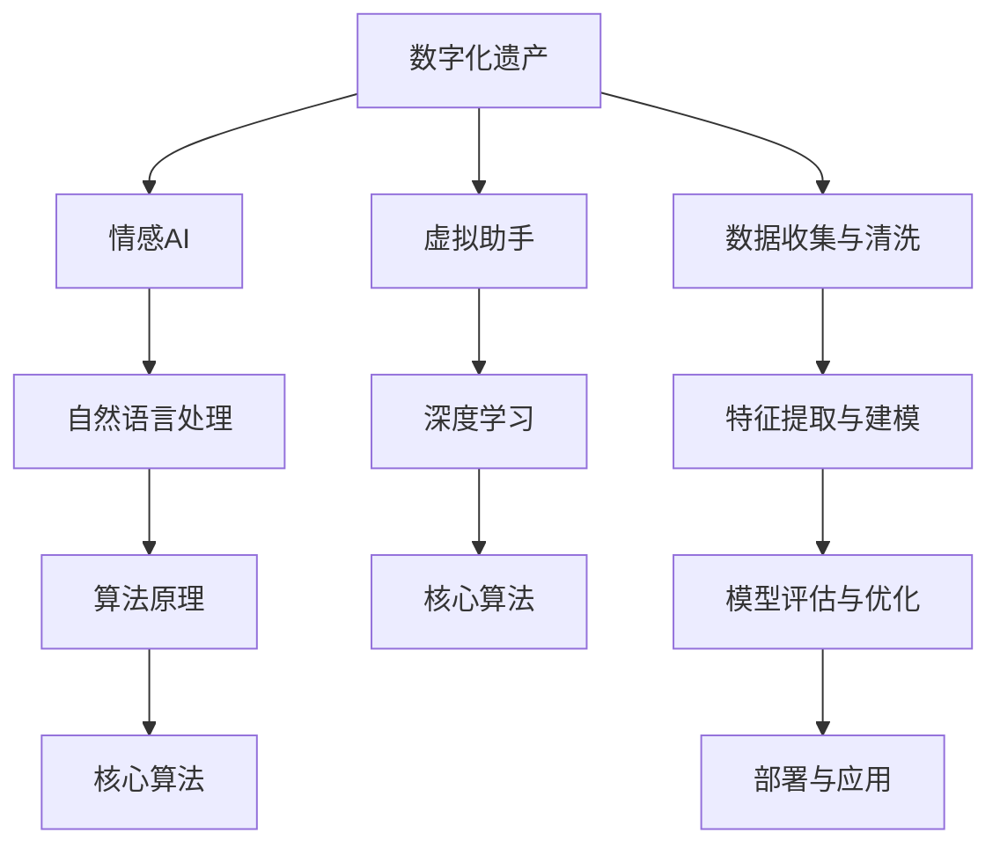

                 

## 1. 背景介绍

随着数字化技术的不断进步，人们对于数字化遗产的传承和保护越来越重视。数字化遗产不仅仅包括照片、视频等传统媒介，还包括电子邮件、社交媒体帖子、博客等数字内容。这些数字内容承载着个人的生活轨迹、情感记忆和智慧经验，具有无可替代的文化和历史价值。然而，如何有效地管理和利用这些数字化遗产，使其能够被未来世代传承和借鉴，是一个值得深入探讨的课题。

情感AI技术的发展为数字化遗产的传承提供了新的可能性。通过情感分析技术，可以自动提取和理解数字化遗产中的情感信息，构建一个虚拟助手，帮助人们更好地保存、管理和分享数字化遗产。这种虚拟助手不仅能够作为数字化遗产的载体，还能够通过自然语言处理技术，重现遗产中的情感和智慧，使数字化遗产更加生动、可读。

## 2. 核心概念与联系

### 2.1 核心概念概述

为了更好地理解数字化遗产情感AI创业的实践，本节将介绍几个关键的概念及其联系。

- **数字化遗产**：指通过数字化技术保存和传递的个人历史、生活轨迹和智慧经验。包括数字文档、多媒体内容、社交媒体数据等。
- **情感AI**：利用人工智能技术，对文本、语音、图像等输入进行情感分析和理解，旨在构建能够感知、表达和响应情感的智能系统。
- **虚拟助手**：通过自然语言处理技术，构建的智能交互系统，能够理解和响应用户的自然语言指令，执行特定的任务或提供个性化的服务。
- **自然语言处理(NLP)**：研究如何使计算机能够理解、处理和生成自然语言，是实现情感AI和虚拟助手的关键技术。
- **深度学习**：利用多层神经网络，构建复杂模型，实现对大规模数据的高效处理和分析，是情感AI和虚拟助手的核心技术支撑。

这些概念之间的逻辑关系可以通过以下Mermaid流程图来展示：



这个流程图展示了几组关键概念及其关系：

1. 数字化遗产是情感AI和虚拟助手的输入来源。
2. 自然语言处理是实现情感AI和虚拟助手的核心技术。
3. 深度学习技术为情感AI和虚拟助手提供了强有力的支持。
4. 数据收集与清洗、特征提取与建模、模型评估与优化、部署与应用是情感AI和虚拟助手开发的核心流程。

## 3. 核心算法原理 & 具体操作步骤

### 3.1 算法原理概述

数字化遗产情感AI创业的核心算法原理，主要包括情感分析和文本生成两个方面。

- **情感分析**：利用自然语言处理技术，对数字化遗产中的文本内容进行情感极性、情感强度、情感类型等维度的分析，以理解遗产中蕴含的情感信息。情感分析通常使用词袋模型、TF-IDF、情感词典等技术进行特征提取和建模。
- **文本生成**：利用深度学习技术，构建生成模型，根据输入的情感特征和内容信息，生成符合情感特质的文本。常见的文本生成模型包括序列到序列模型、变分自编码器等。

### 3.2 算法步骤详解

数字化遗产情感AI创业的核心算法步骤如下：

**Step 1: 数据收集与清洗**

1. 收集数字化遗产中的文本数据，包括日记、信件、社交媒体帖子、博客等。
2. 对文本数据进行清洗，去除噪声、标点符号等无关内容，提取有用的信息。
3. 对文本数据进行预处理，包括分词、去除停用词、词性标注等。

**Step 2: 特征提取与建模**

1. 对清洗后的文本数据进行特征提取，可以使用词袋模型、TF-IDF等技术，将文本转化为数值特征向量。
2. 构建情感分析模型，使用情感词典、卷积神经网络等方法，进行情感极性和情感强度的分类。
3. 构建文本生成模型，使用LSTM、GRU、Transformer等深度学习模型，根据情感特征和内容信息，生成符合情感特质的文本。

**Step 3: 模型评估与优化**

1. 在测试集上对情感分析模型和文本生成模型进行评估，使用准确率、召回率、F1值等指标衡量模型性能。
2. 根据评估结果，调整模型参数，优化模型结构，提升模型效果。

**Step 4: 部署与应用**

1. 将训练好的模型部署到服务器或云平台上，提供API接口，供用户调用。
2. 开发虚拟助手应用，集成情感分析模型和文本生成模型，实现对用户输入的自然语言处理和情感响应。

### 3.3 算法优缺点

数字化遗产情感AI创业的情感分析算法和文本生成算法各有优缺点：

**情感分析算法的优点**：
- 能够快速准确地提取文本中的情感信息。
- 可以通过多模态数据（如语音、图像）进行情感分析，增强情感理解的全面性。

**情感分析算法的缺点**：
- 对于短文本或复杂情感表达，可能出现误判或漏判。
- 需要大量标注数据进行训练，标注成本较高。

**文本生成算法的优点**：
- 生成的文本能够准确反映情感特征，表达生动、自然。
- 可以通过调整模型参数，生成不同风格的文本内容。

**文本生成算法的缺点**：
- 生成的文本可能存在逻辑不合理、语法错误等问题。
- 需要大量训练数据，模型训练时间较长。

### 3.4 算法应用领域

数字化遗产情感AI创业的情感分析算法和文本生成算法在多个领域都有广泛的应用：

- **文化保护与传承**：对历史文献、文化遗产进行情感分析，挖掘其中的文化价值和历史意义，用于文化保护和传承。
- **情感医疗**：对患者病历、社交媒体等数字化遗产进行情感分析，用于心理健康评估和情感支持。
- **情感教育**：对教师、学生等数字化遗产进行情感分析，用于情感教育和心理辅导。
- **情感营销**：对品牌、产品等数字化遗产进行情感分析，用于市场研究和情感营销。
- **情感客服**：对客户服务记录进行情感分析，用于情感驱动的客户服务和反馈。

## 4. 数学模型和公式 & 详细讲解 & 举例说明

### 4.1 数学模型构建

数字化遗产情感AI创业的核心数学模型主要涉及自然语言处理和深度学习。下面将详细介绍这些模型的构建。

**情感分析模型**：

假设文本由n个词组成，使用词袋模型进行特征提取，每个词由一个one-hot向量表示。设文本的情感极性为y，情感分析模型的目标是最小化损失函数：

$$
\min_{\theta} \mathcal{L}(y, f(x, \theta))
$$

其中，f(x, θ)为情感分析模型，θ为模型参数，$\mathcal{L}$为损失函数。常用的损失函数包括交叉熵损失和均方误差损失。

**文本生成模型**：

假设文本由m个词组成，使用LSTM模型进行文本生成。设文本的情感特征为z，文本生成模型的目标是最小化生成文本与真实文本之间的差异：

$$
\min_{\theta} \mathcal{L}(z, g(z, \theta))
$$

其中，g(z, θ)为文本生成模型，θ为模型参数，$\mathcal{L}$为损失函数。常用的损失函数包括交叉熵损失和均方误差损失。

### 4.2 公式推导过程

**情感分析模型的推导**：

设文本的情感极性为y∈{1, -1}，使用词袋模型进行特征提取，每个词由一个one-hot向量表示，得到特征向量x。情感分析模型f(x, θ)通常为卷积神经网络或循环神经网络，其输出为情感极性y。模型的训练目标是最小化交叉熵损失：

$$
\mathcal{L}(y, f(x, \theta)) = -\frac{1}{N}\sum_{i=1}^N [y_i\log f(x_i, \theta) + (1-y_i)\log (1-f(x_i, \theta))]
$$

其中，N为训练样本数量。

**文本生成模型的推导**：

设文本的情感特征为z，使用LSTM模型进行文本生成。LSTM模型的输出为文本中每个词的概率分布，通过softmax函数得到最终的文本输出。模型的训练目标是最小化生成文本与真实文本之间的交叉熵损失：

$$
\mathcal{L}(z, g(z, \theta)) = -\frac{1}{N}\sum_{i=1}^N \sum_{t=1}^{m} y_{i,t}\log g(z_{i-1}, x_i, \theta)
$$

其中，y_{i,t}为真实文本中第t个词的one-hot向量，g(z_{i-1}, x_i, θ)为LSTM模型的输出。

### 4.3 案例分析与讲解

假设有一个数字化遗产库，包含大量用户的日记、信件、社交媒体帖子等。我们希望构建一个虚拟助手，能够根据用户的情感需求，生成符合情感特质的文本。

1. **数据收集与清洗**：
   - 收集数字化遗产库中的文本数据。
   - 对文本数据进行清洗，去除噪声、标点符号等无关内容，提取有用的信息。
   - 对文本数据进行预处理，包括分词、去除停用词、词性标注等。

2. **特征提取与建模**：
   - 对清洗后的文本数据进行特征提取，可以使用词袋模型、TF-IDF等技术，将文本转化为数值特征向量。
   - 构建情感分析模型，使用情感词典、卷积神经网络等方法，进行情感极性和情感强度的分类。
   - 构建文本生成模型，使用LSTM、GRU、Transformer等深度学习模型，根据情感特征和内容信息，生成符合情感特质的文本。

3. **模型评估与优化**：
   - 在测试集上对情感分析模型和文本生成模型进行评估，使用准确率、召回率、F1值等指标衡量模型性能。
   - 根据评估结果，调整模型参数，优化模型结构，提升模型效果。

4. **部署与应用**：
   - 将训练好的模型部署到服务器或云平台上，提供API接口，供用户调用。
   - 开发虚拟助手应用，集成情感分析模型和文本生成模型，实现对用户输入的自然语言处理和情感响应。

通过以上步骤，我们可以构建一个能够理解、处理和生成数字化遗产中情感信息的虚拟助手，实现对用户的个性化服务。

## 5. 项目实践：代码实例和详细解释说明

### 5.1 开发环境搭建

在进行情感AI和虚拟助手项目开发前，我们需要准备好开发环境。以下是使用Python进行TensorFlow开发的环境配置流程：

1. 安装Anaconda：从官网下载并安装Anaconda，用于创建独立的Python环境。

2. 创建并激活虚拟环境：
```bash
conda create -n tensorflow-env python=3.8 
conda activate tensorflow-env
```

3. 安装TensorFlow：根据CUDA版本，从官网获取对应的安装命令。例如：
```bash
conda install tensorflow -c conda-forge
```

4. 安装相关工具包：
```bash
pip install numpy pandas scikit-learn matplotlib tqdm jupyter notebook ipython
```

完成上述步骤后，即可在`tensorflow-env`环境中开始项目开发。

### 5.2 源代码详细实现

下面我们以情感分析模型和文本生成模型的实现为例，给出使用TensorFlow的代码实现。

首先，定义情感分析模型的数据处理函数：

```python
import tensorflow as tf
from tensorflow.keras.preprocessing.text import Tokenizer
from tensorflow.keras.preprocessing.sequence import pad_sequences

def preprocess(texts, labels):
    max_len = 100
    tokenizer = Tokenizer(num_words=10000)
    tokenizer.fit_on_texts(texts)
    sequences = tokenizer.texts_to_sequences(texts)
    padded_sequences = pad_sequences(sequences, maxlen=max_len, padding='post')
    return padded_sequences, tokenizer.word_index, labels
```

然后，定义模型和损失函数：

```python
def create_model(input_dim, num_classes):
    model = tf.keras.Sequential([
        tf.keras.layers.Embedding(input_dim, 128),
        tf.keras.layers.Conv1D(64, 5, activation='relu'),
        tf.keras.layers.GlobalMaxPooling1D(),
        tf.keras.layers.Dense(num_classes, activation='sigmoid')
    ])
    model.compile(optimizer='adam', loss='binary_crossentropy', metrics=['accuracy'])
    return model
```

接着，定义训练和评估函数：

```python
def train_model(model, train_data, val_data, batch_size, epochs):
    model.fit(train_data[0], train_data[1], epochs=epochs, batch_size=batch_size, validation_data=(val_data[0], val_data[1]))
    return model

def evaluate_model(model, test_data):
    loss, accuracy = model.evaluate(test_data[0], test_data[1])
    print(f'Test accuracy: {accuracy:.4f}')
```

最后，启动训练流程并在测试集上评估：

```python
# 假设train_data和val_data已经准备就绪
input_dim = 10000
num_classes = 2
model = create_model(input_dim, num_classes)
epochs = 10
batch_size = 64
train_data, tokenizer, train_labels = preprocess(train_data[0], train_data[1])
val_data, _, val_labels = preprocess(val_data[0], val_data[1])
test_data, _, test_labels = preprocess(test_data[0], test_data[1])

train_model(model, train_data, val_data, batch_size, epochs)
evaluate_model(model, test_data)
```

以上就是使用TensorFlow进行情感分析模型的代码实现。可以看到，TensorFlow提供了强大的Keras API，可以方便地构建、训练和评估模型。

对于文本生成模型，可以使用TensorFlow的Text2Text生成模型，代码实现可以参考官方文档：https://www.tensorflow.org/tutorials/text/text_generation。

### 5.3 代码解读与分析

让我们再详细解读一下关键代码的实现细节：

**preprocess函数**：
- `Tokenizer`类用于将文本转化为数值特征向量。
- `pad_sequences`函数用于对序列进行填充，保证输入序列的长度一致。

**create_model函数**：
- 定义了一个简单的卷积神经网络模型，用于情感分析。
- 使用`Embedding`层将文本转化为嵌入向量，`Conv1D`层进行特征提取，`GlobalMaxPooling1D`层进行池化操作，最后使用`Dense`层进行二分类。
- 使用`compile`方法指定了优化器、损失函数和评估指标。

**train_model和evaluate_model函数**：
- `train_model`函数使用`fit`方法对模型进行训练，同时使用`validation_data`参数指定验证集。
- `evaluate_model`函数使用`evaluate`方法对模型进行评估，并打印出测试集上的准确率。

## 6. 实际应用场景

### 6.1 智能教育

数字化遗产情感AI创业可以在智能教育领域发挥重要作用。通过情感分析技术，可以自动提取和理解数字化遗产中的情感信息，构建一个虚拟助手，帮助教师和学生更好地保存、管理和分享教育资源。

例如，在教学过程中，教师可以将课堂笔记、作业批改记录、学生反馈等数字化遗产上传到情感AI系统。系统可以对这些文本进行情感分析，提取其中的情感信息，构建一个虚拟助手，帮助教师更好地了解学生的学习状态，提供个性化的教学建议。

对于学生而言，情感AI系统也可以帮助他们更好地理解学习内容，识别学习过程中的情感障碍，提供情感支持和学习资源。

### 6.2 心理健康

心理健康是数字化遗产情感AI创业的一个重要应用领域。通过情感分析技术，可以自动提取和理解数字化遗产中的情感信息，构建一个虚拟助手，帮助用户更好地管理自己的情绪和心理健康。

例如，用户可以上传日记、信件、社交媒体帖子等数字化遗产，情感AI系统可以对这些文本进行情感分析，提取其中的情感信息，构建一个虚拟助手，帮助用户识别情感波动，提供心理支持和生活建议。

情感AI系统还可以通过生成符合情感特质的文本，引导用户进行情感表达和情绪调节，帮助他们走出心理困境。

### 6.3 情感客服

情感客服是数字化遗产情感AI创业的另一个重要应用领域。通过情感分析技术，可以自动提取和理解数字化遗产中的情感信息，构建一个虚拟助手，帮助客服人员更好地处理用户咨询，提升服务质量。

例如，客服人员可以将与用户的聊天记录上传到情感AI系统。系统可以对这些文本进行情感分析，提取其中的情感信息，构建一个虚拟助手，帮助客服人员更好地理解用户的情绪状态，提供情感支持和解决方案。

情感AI系统还可以通过生成符合情感特质的文本，引导客服人员进行情感表达和情绪调节，帮助他们更好地与用户沟通，提升服务体验。

## 7. 工具和资源推荐

### 7.1 学习资源推荐

为了帮助开发者系统掌握数字化遗产情感AI创业的理论基础和实践技巧，这里推荐一些优质的学习资源：

1. 《自然语言处理综论》系列博文：由大模型技术专家撰写，深入浅出地介绍了自然语言处理的基础理论和应用实践，包括情感分析、文本生成等关键技术。

2. 斯坦福大学《深度学习与自然语言处理》课程：斯坦福大学开设的NLP明星课程，有Lecture视频和配套作业，带你入门NLP领域的基本概念和经典模型。

3. 《自然语言处理与深度学习》书籍：书籍全面介绍了自然语言处理的基本概念和深度学习模型的应用，包括情感分析和文本生成等关键技术。

4. HuggingFace官方文档：TensorFlow和Keras库的官方文档，提供了海量预训练模型和完整的情感分析样例代码，是上手实践的必备资料。

5. Google Cloud AI平台：提供了丰富的深度学习资源和工具，可以帮助开发者快速搭建情感分析系统，部署到云平台，实现快速迭代和上线。

通过对这些资源的学习实践，相信你一定能够快速掌握数字化遗产情感AI创业的精髓，并用于解决实际的NLP问题。

### 7.2 开发工具推荐

高效的开发离不开优秀的工具支持。以下是几款用于情感AI和虚拟助手开发的常用工具：

1. TensorFlow：基于Python的开源深度学习框架，灵活动态的计算图，适合快速迭代研究。适合用于构建情感分析模型和文本生成模型。

2. PyTorch：基于Python的开源深度学习框架，动态计算图，适合研究复杂模型和算法。适合用于构建深度学习模型。

3. Weights & Biases：模型训练的实验跟踪工具，可以记录和可视化模型训练过程中的各项指标，方便对比和调优。与主流深度学习框架无缝集成。

4. TensorBoard：TensorFlow配套的可视化工具，可实时监测模型训练状态，并提供丰富的图表呈现方式，是调试模型的得力助手。

5. Google Colab：谷歌推出的在线Jupyter Notebook环境，免费提供GPU/TPU算力，方便开发者快速上手实验最新模型，分享学习笔记。

合理利用这些工具，可以显著提升情感AI和虚拟助手任务的开发效率，加快创新迭代的步伐。

### 7.3 相关论文推荐

情感AI和虚拟助手的发展源于学界的持续研究。以下是几篇奠基性的相关论文，推荐阅读：

1. Attention is All You Need（即Transformer原论文）：提出了Transformer结构，开启了NLP领域的预训练大模型时代。

2. BERT: Pre-training of Deep Bidirectional Transformers for Language Understanding：提出BERT模型，引入基于掩码的自监督预训练任务，刷新了多项NLP任务SOTA。

3. Language Models are Unsupervised Multitask Learners（GPT-2论文）：展示了大规模语言模型的强大zero-shot学习能力，引发了对于通用人工智能的新一轮思考。

4. Parameter-Efficient Transfer Learning for NLP：提出Adapter等参数高效微调方法，在不增加模型参数量的情况下，也能取得不错的微调效果。

5. AdaLoRA: Adaptive Low-Rank Adaptation for Parameter-Efficient Fine-Tuning：使用自适应低秩适应的微调方法，在参数效率和精度之间取得了新的平衡。

这些论文代表了大语言模型微调技术的发展脉络。通过学习这些前沿成果，可以帮助研究者把握学科前进方向，激发更多的创新灵感。

## 8. 总结：未来发展趋势与挑战

### 8.1 总结

本文对数字化遗产情感AI创业进行了全面系统的介绍。首先阐述了数字化遗产情感AI创业的研究背景和意义，明确了情感AI和虚拟助手在数字化遗产传承中的重要作用。其次，从原理到实践，详细讲解了情感分析模型和文本生成模型的构建和实现，给出了情感AI和虚拟助手项目开发的完整代码实例。同时，本文还广泛探讨了情感AI和虚拟助手在智能教育、心理健康、情感客服等多个领域的应用前景，展示了情感AI和虚拟助手技术的广泛应用潜力。此外，本文精选了情感AI和虚拟助手学习的各类资源，力求为读者提供全方位的技术指引。

通过本文的系统梳理，可以看到，数字化遗产情感AI创业在数字化遗产保护和传承中发挥着越来越重要的作用。未来，伴随情感AI和虚拟助手技术的不断演进，数字化遗产的保护和传承将更加高效、智能和人性化。

### 8.2 未来发展趋势

展望未来，数字化遗产情感AI创业将呈现以下几个发展趋势：

1. 数据和算力的不断提升。随着算力成本的下降和数据规模的扩张，情感AI和虚拟助手模型的参数量还将持续增长。超大规模语言模型蕴含的丰富情感信息，有望支撑更加复杂多变的情感分析和文本生成任务。

2. 情感分析技术的进步。情感分析将从基于规则的词典匹配，逐渐向基于深度学习的语义理解转变，增强情感分析的全面性和准确性。

3. 文本生成技术的提升。文本生成将从基于模板的自动生成，逐渐向基于深度学习的模型生成转变，提升生成的文本的自然度和多样性。

4. 多模态情感AI的崛起。未来的情感AI和虚拟助手将不再局限于文本数据，而是融合图像、语音、视频等多模态信息，实现更加全面、准确的情感分析和文本生成。

5. 跨领域情感分析的应用。情感AI和虚拟助手将不再局限于特定的领域，而是泛化到更广泛的领域，如医疗、金融、教育等，实现情感驱动的跨领域应用。

6. 个性化情感支持。情感AI和虚拟助手将能够根据用户的情感需求，提供个性化的情感支持，提升用户的情感体验和生活质量。

以上趋势凸显了数字化遗产情感AI创业的广阔前景。这些方向的探索发展，必将进一步提升情感AI和虚拟助手模型的性能和应用范围，为数字化遗产保护和传承带来新的突破。

### 8.3 面临的挑战

尽管数字化遗产情感AI创业已经取得了瞩目成就，但在迈向更加智能化、普适化应用的过程中，它仍面临着诸多挑战：

1. 标注数据不足。情感分析和文本生成需要大量的标注数据，然而获取高质量标注数据的成本较高，尤其是在长尾应用场景下。如何降低对标注数据的依赖，提高模型的泛化能力，将是一大难题。

2. 模型鲁棒性不足。当前情感AI和虚拟助手模型面对域外数据时，泛化性能往往大打折扣。对于测试样本的微小扰动，模型也容易发生波动。如何提高模型的鲁棒性，避免灾难性遗忘，还需要更多理论和实践的积累。

3. 推理效率有待提高。大规模语言模型虽然精度高，但在实际部署时往往面临推理速度慢、内存占用大等效率问题。如何在保证性能的同时，简化模型结构，提升推理速度，优化资源占用，将是重要的优化方向。

4. 可解释性亟需加强。当前情感AI和虚拟助手模型更像是"黑盒"系统，难以解释其内部工作机制和决策逻辑。对于医疗、金融等高风险应用，算法的可解释性和可审计性尤为重要。如何赋予情感AI和虚拟助手模型更强的可解释性，将是亟待攻克的难题。

5. 安全性有待保障。情感AI和虚拟助手模型难免会学习到有偏见、有害的信息，通过生成文本传递到用户，产生误导性、歧视性的输出，给实际应用带来安全隐患。如何从数据和算法层面消除模型偏见，避免恶意用途，确保输出的安全性，也将是重要的研究课题。

6. 模型通用性不足。现有的情感AI和虚拟助手模型往往局限于特定领域的情感分析和文本生成，难以灵活吸收和运用更广泛的先验知识。如何让情感AI和虚拟助手模型更好地与外部知识库、规则库等专家知识结合，形成更加全面、准确的信息整合能力，还有很大的想象空间。

正视情感AI和虚拟助手面临的这些挑战，积极应对并寻求突破，将是大语言模型微调走向成熟的必由之路。相信随着学界和产业界的共同努力，这些挑战终将一一被克服，情感AI和虚拟助手必将在构建人机协同的智能社会中扮演越来越重要的角色。

### 8.4 研究展望

面对情感AI和虚拟助手所面临的挑战，未来的研究需要在以下几个方面寻求新的突破：

1. 探索无监督和半监督情感分析方法。摆脱对大规模标注数据的依赖，利用自监督学习、主动学习等无监督和半监督范式，最大限度利用非结构化数据，实现更加灵活高效的情感分析和文本生成。

2. 研究参数高效和计算高效的情感分析范式。开发更加参数高效的情感分析方法，在固定大部分预训练参数的同时，只更新极少量的任务相关参数。同时优化情感分析模型的计算图，减少前向传播和反向传播的资源消耗，实现更加轻量级、实时性的部署。

3. 融合因果和对比学习范式。通过引入因果推断和对比学习思想，增强情感AI和虚拟助手模型建立稳定因果关系的能力，学习更加普适、鲁棒的语言表征，从而提升模型泛化性和抗干扰能力。

4. 引入更多先验知识。将符号化的先验知识，如知识图谱、逻辑规则等，与神经网络模型进行巧妙融合，引导情感分析过程学习更准确、合理的情感信息。同时加强不同模态数据的整合，实现视觉、语音等多模态信息与文本信息的协同建模。

5. 结合因果分析和博弈论工具。将因果分析方法引入情感AI和虚拟助手模型，识别出模型决策的关键特征，增强输出解释的因果性和逻辑性。借助博弈论工具刻画人机交互过程，主动探索并规避模型的脆弱点，提高系统稳定性。

6. 纳入伦理道德约束。在模型训练目标中引入伦理导向的评估指标，过滤和惩罚有偏见、有害的输出倾向。同时加强人工干预和审核，建立模型行为的监管机制，确保输出符合人类价值观和伦理道德。

这些研究方向的探索，必将引领情感AI和虚拟助手技术迈向更高的台阶，为构建安全、可靠、可解释、可控的智能系统铺平道路。面向未来，情感AI和虚拟助手技术还需要与其他人工智能技术进行更深入的融合，如知识表示、因果推理、强化学习等，多路径协同发力，共同推动自然语言理解和智能交互系统的进步。只有勇于创新、敢于突破，才能不断拓展情感AI和虚拟助手模型的边界，让智能技术更好地造福人类社会。

## 9. 附录：常见问题与解答

**Q1：如何选择合适的标注数据集？**

A: 标注数据集的选择需要根据情感分析任务的特点和应用场景进行。一般而言，应选择与任务相关的、具有较高质量和多样性的标注数据集。同时，可以通过数据增强、数据清洗等方法，提高标注数据的质量和数量。

**Q2：情感分析模型的超参数调优有哪些关键点？**

A: 情感分析模型的超参数调优包括学习率、批次大小、迭代轮数、正则化参数等。建议从默认值开始调参，逐步调整各参数值，观察模型性能变化，寻找最优组合。

**Q3：文本生成模型的训练时间较长，如何优化？**

A: 文本生成模型的训练时间较长，可以通过以下方法进行优化：
1. 使用GPU/TPU等高性能设备进行加速。
2. 对模型进行参数剪枝，减少模型规模。
3. 采用混合精度训练，优化内存和计算资源使用。
4. 使用分布式训练，提高训练效率。

**Q4：如何评估情感AI和虚拟助手的性能？**

A: 情感AI和虚拟助手的性能评估可以从准确率、召回率、F1值、ROC曲线等多个指标进行。同时，可以进行用户满意度调查，了解模型在实际应用中的表现和用户反馈。

**Q5：情感AI和虚拟助手在实际应用中需要注意哪些问题？**

A: 情感AI和虚拟助手在实际应用中需要注意以下几个问题：
1. 数据隐私保护。确保用户的数字化遗产数据得到妥善保护，防止数据泄露和滥用。
2. 模型安全性。确保模型的输出不会引入有害信息，防止模型被恶意利用。
3. 用户交互体验。优化模型的用户界面和交互逻辑，提升用户体验。
4. 模型可解释性。增强模型的可解释性，让用户能够理解模型的决策过程和输出结果。

**Q6：情感AI和虚拟助手的发展趋势是什么？**

A: 情感AI和虚拟助手的发展趋势包括：
1. 数据和算力的不断提升，模型的参数量将持续增长。
2. 情感分析技术的进步，从基于规则的词典匹配向基于深度学习的语义理解转变。
3. 文本生成技术的提升，从基于模板的自动生成向基于深度学习的模型生成转变。
4. 多模态情感AI的崛起，融合图像、语音、视频等多模态信息，实现更加全面、准确的情感分析和文本生成。
5. 跨领域情感分析的应用，泛化到更广泛的领域，如医疗、金融、教育等，实现情感驱动的跨领域应用。
6. 个性化情感支持，根据用户的情感需求，提供个性化的情感支持，提升用户的情感体验和生活质量。

---

作者：禅与计算机程序设计艺术 / Zen and the Art of Computer Programming

