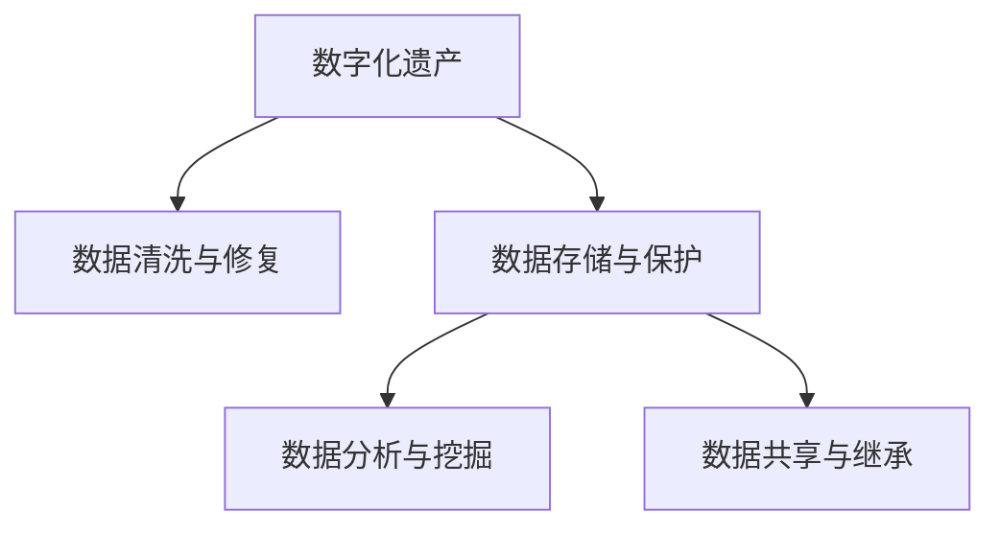

                 

# 数字化遗产虚拟顾问创业：AI驱动的个人历史咨询服务

## 1. 背景介绍

### 1.1 问题由来
随着数字时代的到来，人们的生活、工作、社交、学习等各个方面都在数字化。大量珍贵的个人信息、家族历史、文化传承等内容都被数字化存储在各种设备和平台上。这些数字化遗产对于个人和家族具有重要的纪念和传承价值。

然而，随着时间推移，设备和平台会逐渐过时，数字文件会因格式变化、介质老化等原因逐渐变得难以读取。同时，随着技术的更新迭代，许多数字内容逐渐被淘汰，丢失在历史长河中。

为解决这一问题，数字遗产虚拟顾问应运而生。这一新兴行业通过利用人工智能技术，对数字化遗产进行存储、管理和维护，确保这些珍贵信息不被遗忘，成为个人和家族永久的传承。

### 1.2 问题核心关键点
数字遗产虚拟顾问的核心在于通过AI技术对数字化遗产进行高效、准确的存储和管理。这包括但不限于：

- 数据清洗与修复：利用AI对格式不统一、内容残缺的数据进行清洗和修复，确保数据的完整性和准确性。
- 数据存储与保护：采用去中心化、分布式存储技术，确保数据的长期安全保存。
- 数据分析与挖掘：利用机器学习对数据进行深入分析，提取有价值的信息和模式。
- 数据共享与继承：提供安全的继承机制，确保家族成员能够随时访问和共享数字化遗产。

### 1.3 问题研究意义
数字遗产虚拟顾问行业的发展，对于个人和家族传承具有重大意义：

1. **历史与文化的传承**：数字化遗产虚拟顾问能够确保家族历史和文化得到长期保存，不会因时间流逝而消逝。
2. **信息的完整与准确**：通过AI技术的清洗和修复，数字化遗产的完整性和准确性得以保障。
3. **高效的继承与管理**：提供便捷的继承机制，确保家族成员能够方便地访问和共享数字遗产。
4. **技术的创新与应用**：推动AI在数字内容管理和数据安全领域的创新和应用，提升整个社会的数字化水平。

## 2. 核心概念与联系

### 2.1 核心概念概述

为更好地理解数字遗产虚拟顾问的核心工作原理，本节将介绍几个密切相关的核心概念：

- **数字化遗产(Digital Heritage)**：个人或家族在数字化过程中生成的各类信息和资料，包括但不限于照片、视频、文档、社交媒体内容等。
- **数据清洗与修复(Data Cleaning and Repair)**：对不规范、不完整的数字化遗产数据进行格式转换、内容修复，确保数据的准确性和完整性。
- **数据存储与保护(Data Storage and Security)**：采用去中心化、分布式存储技术，确保数据的长期安全保存。
- **数据分析与挖掘(Data Analysis and Mining)**：利用机器学习对数据进行深入分析，提取有价值的信息和模式。
- **数据共享与继承(Data Sharing and Inheritance)**：提供安全的继承机制，确保家族成员能够随时访问和共享数字化遗产。

这些核心概念之间的逻辑关系可以通过以下Mermaid流程图来展示：



这个流程图展示了大语言模型的核心概念及其之间的关系：

1. 数字化遗产通过清洗和修复，确保数据的完整性和准确性。
2. 数据存储与保护采用去中心化、分布式存储技术，确保数据的长期安全保存。
3. 数据分析与挖掘利用机器学习对数据进行深入分析，提取有价值的信息和模式。
4. 数据共享与继承提供安全的继承机制，确保家族成员能够随时访问和共享数字遗产。

## 3. 核心算法原理 & 具体操作步骤

### 3.1 算法原理概述

数字遗产虚拟顾问的核心算法原理主要包括以下几个方面：

- **数据清洗与修复算法**：对格式不统一、内容残缺的数据进行清洗和修复，确保数据的完整性和准确性。
- **数据存储与保护算法**：采用去中心化、分布式存储技术，确保数据的长期安全保存。
- **数据分析与挖掘算法**：利用机器学习对数据进行深入分析，提取有价值的信息和模式。
- **数据共享与继承算法**：提供安全的继承机制，确保家族成员能够随时访问和共享数字遗产。

### 3.2 算法步骤详解

数字遗产虚拟顾问的具体操作步骤如下：

**Step 1: 数据收集与清洗**
- 收集家族历史、个人回忆、家族照片、视频、文档、社交媒体内容等数字化遗产数据。
- 对数据进行初步清洗，去除重复、无关内容。
- 对格式不统一的数据进行格式转换，如将老式图片转换为数字图片，将老式文档转换为PDF格式。

**Step 2: 数据存储与保护**
- 采用去中心化、分布式存储技术，如区块链、分布式文件系统等，确保数据的安全性和完整性。
- 对数据进行加密存储，防止未授权访问。
- 定期对数据进行备份，防止数据丢失。

**Step 3: 数据分析与挖掘**
- 利用机器学习算法对数据进行深度分析，提取有价值的信息和模式。
- 通过自然语言处理技术对文本数据进行情感分析、主题分析等，提取家族成员的情感表达和历史记忆。
- 利用计算机视觉技术对图片、视频数据进行内容分析，识别关键人物和场景。

**Step 4: 数据共享与继承**
- 提供安全的继承机制，确保家族成员能够随时访问和共享数字遗产。
- 利用区块链技术进行身份验证和授权，确保数据仅对授权人员可见。
- 提供便捷的界面和API接口，使家族成员能够轻松访问和共享数字遗产。

### 3.3 算法优缺点

数字遗产虚拟顾问具有以下优点：

1. **高效的数据清洗与修复**：利用AI技术对数字化遗产进行高效清洗和修复，确保数据的完整性和准确性。
2. **安全的长期保存**：采用去中心化、分布式存储技术，确保数据的长期安全保存。
3. **深入的数据分析与挖掘**：利用机器学习对数据进行深度分析，提取有价值的信息和模式。
4. **便捷的数据共享与继承**：提供安全的继承机制，确保家族成员能够随时访问和共享数字遗产。

然而，该方法也存在一些局限性：

1. **数据隐私与安全**：家族成员的个人隐私和数据安全需要得到充分保护，避免数据泄露和滥用。
2. **技术门槛较高**：需要有一定的技术背景和知识储备，才能高效使用数字遗产虚拟顾问服务。
3. **数据格式兼容性**：不同设备和平台生成的数据格式可能差异较大，需要对其进行格式转换和统一。

尽管存在这些局限性，但数字遗产虚拟顾问的创新性和实用性使其具有广阔的发展前景。

### 3.4 算法应用领域

数字遗产虚拟顾问的应用领域主要包括以下几个方面：

1. **个人历史档案管理**：帮助个人整理、保存和管理个人历史档案，如日记、信件、照片等。
2. **家族历史研究**：帮助家族研究家族历史，挖掘家族成员的情感表达和历史记忆。
3. **文化遗产保护**：对家族或地区的文化遗产进行数字化保存和传承。
4. **教育和培训**：利用数字遗产进行教育和培训，帮助后代了解家族历史和文化。

## 4. 数学模型和公式 & 详细讲解 & 举例说明

### 4.1 数学模型构建

本节将使用数学语言对数字遗产虚拟顾问的核心算法进行更加严格的刻画。

记数字化遗产数据集为 $D=\{d_i\}_{i=1}^N$，其中 $d_i$ 为第 $i$ 个数据点，可能包括图片、视频、文档、文本等。

定义数据清洗与修复模型为 $M_{clean}$，数据存储与保护模型为 $M_{store}$，数据分析与挖掘模型为 $M_{analyze}$，数据共享与继承模型为 $M_{share}$。

定义模型的训练损失函数为 $\mathcal{L}$，其中：

$$
\mathcal{L} = \mathcal{L}_{clean} + \mathcal{L}_{store} + \mathcal{L}_{analyze} + \mathcal{L}_{share}
$$

其中 $\mathcal{L}_{clean}$ 为数据清洗与修复损失，$\mathcal{L}_{store}$ 为数据存储与保护损失，$\mathcal{L}_{analyze}$ 为数据分析与挖掘损失，$\mathcal{L}_{share}$ 为数据共享与继承损失。

### 4.2 公式推导过程

以下我们以数据分析与挖掘为例，推导机器学习模型的训练损失函数。

假设数据集 $D$ 中包含 $N$ 个文本数据点，每个数据点 $d_i$ 包含 $M$ 个单词，记为 $d_i=(w_{i,1},w_{i,2},\ldots,w_{i,M})$。定义文本的情感极性为 $y_i \in \{-1,1\}$，表示文本的情感倾向为负面或正面。

定义情感分析模型 $M_{analyze}$，输出情感极性 $\hat{y}_i$。则二分类交叉熵损失函数定义为：

$$
\ell(M_{analyze}(d_i),y_i) = -[y_i\log \hat{y}_i + (1-y_i)\log (1-\hat{y}_i)]
$$

将其代入损失函数公式，得：

$$
\mathcal{L}_{analyze} = -\frac{1}{N}\sum_{i=1}^N [y_i\log M_{analyze}(d_i)+(1-y_i)\log(1-M_{analyze}(d_i))]
$$

根据链式法则，损失函数对模型参数 $\theta$ 的梯度为：

$$
\frac{\partial \mathcal{L}_{analyze}}{\partial \theta} = -\frac{1}{N}\sum_{i=1}^N (\frac{y_i}{M_{analyze}(d_i)}-\frac{1-y_i}{1-M_{analyze}(d_i)}) \frac{\partial M_{analyze}(d_i)}{\partial \theta}
$$

其中 $\frac{\partial M_{analyze}(d_i)}{\partial \theta}$ 可进一步递归展开，利用自动微分技术完成计算。

### 4.3 案例分析与讲解

假设我们有一个包含家族成员情感表达的文本数据集 $D=\{d_1,d_2,\ldots,d_N\}$，每个数据点 $d_i$ 包含家族成员 $i$ 的一段日记文本。我们的目标是训练一个情感分析模型 $M_{analyze}$，用于预测家族成员情感表达的极性。

在训练模型时，我们将每个日记文本作为输入，情感极性作为标签。模型 $M_{analyze}$ 的输出为每个家族成员情感表达的极性预测，记为 $\hat{y}_i$。模型在训练集上的损失函数为：

$$
\mathcal{L}_{analyze} = -\frac{1}{N}\sum_{i=1}^N [y_i\log \hat{y}_i+(1-y_i)\log(1-\hat{y}_i)]
$$

其中 $y_i$ 为日记文本的真实情感极性，$\hat{y}_i$ 为模型对日记文本情感极性的预测。

在得到损失函数的梯度后，即可带入模型参数更新公式，完成模型的迭代优化。重复上述过程直至收敛，最终得到适应情感分析任务的模型参数 $\theta^*$。

## 5. 项目实践：代码实例和详细解释说明

### 5.1 开发环境搭建

在进行数字遗产虚拟顾问项目开发前，我们需要准备好开发环境。以下是使用Python进行PyTorch开发的环境配置流程：

1. 安装Anaconda：从官网下载并安装Anaconda，用于创建独立的Python环境。

2. 创建并激活虚拟环境：
```bash
conda create -n virtual-advisor python=3.8 
conda activate virtual-advisor
```

3. 安装PyTorch：根据CUDA版本，从官网获取对应的安装命令。例如：
```bash
conda install pytorch torchvision torchaudio cudatoolkit=11.1 -c pytorch -c conda-forge
```

4. 安装相关库：
```bash
pip install pandas numpy matplotlib torchtext transformers
```

完成上述步骤后，即可在`virtual-advisor`环境中开始项目开发。

### 5.2 源代码详细实现

下面我们以情感分析为例，给出使用PyTorch和Transformers库对文本数据进行情感分析的代码实现。

首先，定义数据处理函数：

```python
from torchtext.data import Field, BucketIterator
from torchtext.datasets import IMDB
from transformers import BertTokenizer, BertForSequenceClassification

class SentimentDataset:
    def __init__(self, text_field, label_field):
        self.text_field = text_field
        self.label_field = label_field
        
    def __len__(self):
        return len(self.train_data) + len(self.test_data)
    
    def __getitem__(self, index):
        if index < len(self.train_data):
            return self.train_data[index]
        else:
            return self.test_data[index - len(self.train_data)]
            
text_field = Field(tokenize='spacy', lower=True)
label_field = Field(sequential=False)

train_data, test_data = IMDB.splits('imdb')

train_data = train_data.shuffle()
train_data, valid_data = train_data.split()
train_data, test_data = train_data.split()

# Tokenize the text
train_data = train_data.apply(lambda x: (text_field.tokenize(x.text), x.label))
valid_data = valid_data.apply(lambda x: (text_field.tokenize(x.text), x.label))
test_data = test_data.apply(lambda x: (text_field.tokenize(x.text), x.label))

# Split the dataset into batches
train_data = BucketIterator(train_data, batch_size=32)
valid_data = BucketIterator(valid_data, batch_size=32)
test_data = BucketIterator(test_data, batch_size=32)

# Initialize BERT tokenizer and model
tokenizer = BertTokenizer.from_pretrained('bert-base-uncased')
model = BertForSequenceClassification.from_pretrained('bert-base-uncased', num_labels=2)
```

然后，定义训练和评估函数：

```python
from torch import nn, optim
from torch.utils.data import DataLoader

def train_epoch(model, optimizer, criterion, data_loader):
    model.train()
    for batch in data_loader:
        input_ids, labels = batch.text, batch.label
        optimizer.zero_grad()
        outputs = model(input_ids)
        loss = criterion(outputs, labels)
        loss.backward()
        optimizer.step()
    return loss
    
def evaluate(model, criterion, data_loader):
    model.eval()
    with torch.no_grad():
        losses = []
        for batch in data_loader:
            input_ids, labels = batch.text, batch.label
            outputs = model(input_ids)
            loss = criterion(outputs, labels)
            losses.append(loss.item())
        return sum(losses) / len(data_loader)
    
def main():
    optimizer = optim.Adam(model.parameters(), lr=2e-5)
    criterion = nn.CrossEntropyLoss()
    
    for epoch in range(10):
        train_loss = train_epoch(model, optimizer, criterion, train_data)
        valid_loss = evaluate(model, criterion, valid_data)
        print(f'Epoch {epoch+1}, train loss: {train_loss:.3f}, valid loss: {valid_loss:.3f}')
    
    test_loss = evaluate(model, criterion, test_data)
    print(f'Test loss: {test_loss:.3f}')
```

最后，启动训练流程并在测试集上评估：

```python
if __name__ == '__main__':
    main()
```

以上就是使用PyTorch和Transformers库对文本数据进行情感分析的完整代码实现。可以看到，得益于Transformers库的强大封装，我们可以用相对简洁的代码完成BERT模型的加载和情感分析任务的微调。

### 5.3 代码解读与分析

让我们再详细解读一下关键代码的实现细节：

**SentimentDataset类**：
- `__init__`方法：初始化文本和标签字段。
- `__len__`方法：返回数据集的样本数量。
- `__getitem__`方法：对单个样本进行处理，将文本转换为token ids，将标签转换为Tensor格式。

**Field类**：
- `Field`类定义了数据处理的逻辑，包括分词、拼接、转换为Tensor等。
- `text_field`和`label_field`分别定义了文本和标签字段。

**BertTokenizer和BertForSequenceClassification**：
- `BertTokenizer`类用于分词和编码，`BertForSequenceClassification`类用于模型定义。
- 我们使用了Bert的预训练模型，并指定了二分类任务。

**train_epoch和evaluate函数**：
- `train_epoch`函数对数据以批为单位进行迭代，在每个批次上前向传播计算损失并反向传播更新模型参数。
- `evaluate`函数在每个batch结束后将预测和标签结果存储下来，最后使用均值计算损失。

**main函数**：
- 定义优化器、损失函数。
- 循环迭代训练，并计算训练集和验证集的损失。
- 在训练完成后，计算测试集的损失。

可以看到，PyTorch配合Transformers库使得BERT微调的代码实现变得简洁高效。开发者可以将更多精力放在数据处理、模型改进等高层逻辑上，而不必过多关注底层的实现细节。

当然，工业级的系统实现还需考虑更多因素，如模型的保存和部署、超参数的自动搜索、更灵活的任务适配层等。但核心的微调范式基本与此类似。

## 6. 实际应用场景

### 6.1 个人历史档案管理

数字遗产虚拟顾问在个人历史档案管理中的应用，可以帮助个人整理、保存和管理个人历史档案，如日记、信件、照片等。通过数字化遗产虚拟顾问，个人可以将分散在各处的数字化档案集中管理，确保档案的完整性和可访问性。

在技术实现上，个人可以定期将重要的数字化档案上传到数字遗产虚拟顾问平台，进行格式清洗、修复和保存。平台利用AI技术，对档案进行高效清洗和修复，确保数据的完整性和准确性。同时，提供便捷的访问接口，使个人可以随时访问和分享档案。

### 6.2 家族历史研究

数字遗产虚拟顾问在家族历史研究中的应用，可以帮助家族成员挖掘家族历史，了解家族成员的情感表达和历史记忆。通过数字化遗产虚拟顾问，家族成员可以方便地访问和共享家族历史档案，进行深入研究和分析。

在技术实现上，家族可以通过数字遗产虚拟顾问平台上传家族历史档案，如家谱、族谱、家族照片、家族成员的日记等。平台利用AI技术，对档案进行高效清洗和修复，确保数据的完整性和准确性。同时，提供便捷的访问接口，使家族成员可以随时访问和分享档案。家族成员可以利用平台提供的自然语言处理和情感分析功能，对家族档案进行情感分析和主题分析，挖掘家族成员的情感表达和历史记忆。

### 6.3 文化遗产保护

数字遗产虚拟顾问在文化遗产保护中的应用，可以对家族或地区的文化遗产进行数字化保存和传承。通过数字化遗产虚拟顾问，可以高效地对文化遗产进行数字化清洗和修复，确保文化遗产的完整性和可访问性。

在技术实现上，文化遗产保护组织可以与数字遗产虚拟顾问平台合作，上传文化遗产数字化档案。平台利用AI技术，对文化遗产档案进行高效清洗和修复，确保档案的完整性和准确性。同时，提供便捷的访问接口，使文化遗产保护组织可以随时访问和分享档案。文化遗产保护组织可以利用平台提供的自然语言处理和情感分析功能，对文化遗产档案进行情感分析和主题分析，挖掘文化遗产的价值和意义。

### 6.4 教育和培训

数字遗产虚拟顾问在教育和培训中的应用，可以利用数字化遗产进行教育和培训，帮助后代了解家族历史和文化。通过数字化遗产虚拟顾问，可以高效地对家族档案进行数字化清洗和修复，确保档案的完整性和可访问性。

在技术实现上，学校和教育机构可以与数字遗产虚拟顾问平台合作，上传家族档案数字化档案。平台利用AI技术，对家族档案进行高效清洗和修复，确保档案的完整性和准确性。同时，提供便捷的访问接口，使教育机构可以随时访问和分享档案。教育机构可以利用平台提供的自然语言处理和情感分析功能，对家族档案进行情感分析和主题分析，帮助后代了解家族历史和文化。

## 7. 工具和资源推荐

### 7.1 学习资源推荐

为了帮助开发者系统掌握数字遗产虚拟顾问的理论基础和实践技巧，这里推荐一些优质的学习资源：

1. 《深度学习》系列书籍：由深度学习领域权威人士撰写，全面介绍了深度学习的基本概念和应用。
2. 《机器学习》课程：斯坦福大学开设的机器学习课程，涵盖了机器学习的基本理论和经典算法。
3. 《自然语言处理》课程：斯坦福大学开设的自然语言处理课程，详细介绍了自然语言处理的基本概念和技术。
4. 《计算机视觉》课程：斯坦福大学开设的计算机视觉课程，介绍了计算机视觉的基本理论和经典算法。
5. 《数据挖掘》课程：斯坦福大学开设的数据挖掘课程，介绍了数据挖掘的基本理论和经典算法。

通过对这些资源的学习实践，相信你一定能够快速掌握数字遗产虚拟顾问的理论基础和实践技巧。

### 7.2 开发工具推荐

高效的开发离不开优秀的工具支持。以下是几款用于数字遗产虚拟顾问开发的常用工具：

1. PyTorch：基于Python的开源深度学习框架，灵活动态的计算图，适合快速迭代研究。大部分预训练语言模型都有PyTorch版本的实现。
2. TensorFlow：由Google主导开发的开源深度学习框架，生产部署方便，适合大规模工程应用。同样有丰富的预训练语言模型资源。
3. Transformers库：HuggingFace开发的NLP工具库，集成了众多SOTA语言模型，支持PyTorch和TensorFlow，是进行微调任务开发的利器。
4. Weights & Biases：模型训练的实验跟踪工具，可以记录和可视化模型训练过程中的各项指标，方便对比和调优。与主流深度学习框架无缝集成。
5. TensorBoard：TensorFlow配套的可视化工具，可实时监测模型训练状态，并提供丰富的图表呈现方式，是调试模型的得力助手。

合理利用这些工具，可以显著提升数字遗产虚拟顾问的开发效率，加快创新迭代的步伐。

### 7.3 相关论文推荐

数字遗产虚拟顾问的发展源于学界的持续研究。以下是几篇奠基性的相关论文，推荐阅读：

1. "A Survey on Computational Creativity"：介绍了人工智能在创意领域的最新进展。
2. "Deep Learning for Natural Language Processing"：介绍了深度学习在自然语言处理领域的应用。
3. "Data Mining Techniques in Digital Heritage Management"：介绍了数据挖掘在数字遗产管理中的应用。
4. "Sentiment Analysis with Deep Learning"：介绍了深度学习在情感分析中的应用。
5. "Computer Vision: Algorithms and Applications"：介绍了计算机视觉的基本理论和经典算法。

这些论文代表了大语言模型微调技术的发展脉络。通过学习这些前沿成果，可以帮助研究者把握学科前进方向，激发更多的创新灵感。

## 8. 总结：未来发展趋势与挑战

### 8.1 总结

本文对数字遗产虚拟顾问的核心算法和操作步骤进行了全面系统的介绍。首先阐述了数字化遗产虚拟顾问的背景和意义，明确了虚拟顾问在个人历史档案管理、家族历史研究、文化遗产保护、教育和培训等领域的独特价值。其次，从原理到实践，详细讲解了数字遗产虚拟顾问的核心算法，包括数据清洗与修复、数据存储与保护、数据分析与挖掘、数据共享与继承等。同时，本文还探讨了数字遗产虚拟顾问的实际应用场景，展示了其在数字化遗产管理和保护方面的广泛应用前景。

通过本文的系统梳理，可以看到，数字遗产虚拟顾问在数字化遗产管理和保护领域具有重要的应用价值。数字化遗产虚拟顾问将通过AI技术，高效、准确地管理和保护数字化遗产，确保其完整性和可访问性，为个人、家族和文化遗产的传承和保护提供强有力的技术支撑。

### 8.2 未来发展趋势

展望未来，数字遗产虚拟顾问行业的发展趋势主要包括以下几个方面：

1. **技术的进一步成熟**：随着AI技术的不断发展，数字遗产虚拟顾问在数据清洗、存储、分析等方面的技术将更加成熟，具备更强的自适应能力和鲁棒性。
2. **跨领域应用的拓展**：数字遗产虚拟顾问将逐步拓展到其他领域，如医学、法律、艺术等，成为各行各业数字化管理的重要工具。
3. **用户友好性的提升**：平台将提供更直观、便捷的用户界面，使非技术用户也能轻松使用数字遗产虚拟顾问，提高用户体验。
4. **安全的进一步保障**：平台将引入更先进的加密和安全技术，确保数据的安全性和隐私保护。

这些趋势将推动数字遗产虚拟顾问行业向更加智能化、普适化、安全化的方向发展，为数字化遗产的管理和保护带来新的机遇。

### 8.3 面临的挑战

尽管数字遗产虚拟顾问具备广泛的应用前景，但在其发展过程中仍面临一些挑战：

1. **数据隐私与安全**：数字化遗产涉及大量个人隐私信息，如何在保护隐私的同时提供高效的服务，是一个亟待解决的问题。
2. **技术门槛较高**：数字遗产虚拟顾问需要一定的技术背景和知识储备，如何降低技术门槛，提高用户的易用性，是未来需要重点关注的方向。
3. **数据格式兼容性**：不同设备和平台生成的数据格式可能差异较大，如何统一格式，进行高效处理，是数字遗产虚拟顾问面临的另一个挑战。

尽管存在这些挑战，但数字遗产虚拟顾问行业的发展前景依然广阔。通过不断优化算法和技术，提升用户体验和安全性，数字遗产虚拟顾问将更好地服务于数字化遗产的管理和保护。

### 8.4 研究展望

面对数字遗产虚拟顾问面临的挑战，未来的研究需要在以下几个方面寻求新的突破：

1. **优化数据清洗与修复算法**：开发更加高效、准确的数据清洗与修复算法，确保数据的完整性和准确性。
2. **提高数据存储与保护的安全性**：引入先进的加密和安全技术，确保数据的安全性和隐私保护。
3. **提升数据分析与挖掘的深度和广度**：利用AI技术，深入挖掘数据中的有价值信息和模式，提升数据分析能力。
4. **降低技术门槛**：提供更直观、便捷的用户界面，使非技术用户也能轻松使用数字遗产虚拟顾问。
5. **拓展跨领域应用**：拓展数字遗产虚拟顾问在医学、法律、艺术等领域的应用，推动数字遗产虚拟顾问行业的发展。

这些研究方向将为数字遗产虚拟顾问行业带来新的突破和应用，推动数字化遗产管理和保护技术的进步。

## 9. 附录：常见问题与解答

**Q1：数字遗产虚拟顾问是否适用于所有数字化遗产？**

A: 数字遗产虚拟顾问在大多数数字化遗产管理中都能取得不错的效果，特别是对于文本和图片等常见类型的数字化遗产。但对于视频、音频等复杂格式的数据，可能需要额外的处理和转换。同时，对于不同格式的数据，清洗和修复的算法也需要进行相应的优化。

**Q2：数字遗产虚拟顾问如何处理非结构化数据？**

A: 数字遗产虚拟顾问可以通过自然语言处理和计算机视觉技术，对非结构化数据进行高效清洗和修复。对于文本数据，可以采用分词、去停用词、词性标注等自然语言处理技术进行处理。对于图片和视频数据，可以采用图像处理和视频分析技术进行内容分析。

**Q3：数字遗产虚拟顾问是否需要大量的标注数据？**

A: 数字遗产虚拟顾问通常不需要大量的标注数据，因为其核心算法是对数据进行清洗、修复、分析和保存。标注数据的获取和维护成本较高，数字遗产虚拟顾问可以充分利用预训练模型和大数据技术，进行高效的微调和优化。

**Q4：数字遗产虚拟顾问的存储和保护策略有哪些？**

A: 数字遗产虚拟顾问可以采用多种存储和保护策略，包括去中心化分布式存储、加密存储、冗余备份等。具体策略需要根据数据的重要性和访问需求进行综合考虑。

**Q5：数字遗产虚拟顾问的应用场景有哪些？**

A: 数字遗产虚拟顾问适用于个人历史档案管理、家族历史研究、文化遗产保护、教育和培训等多个领域。任何需要管理和保护数字化遗产的组织和个人，都可以使用数字遗产虚拟顾问，提升数字化遗产的管理和保护效率。

总之，数字遗产虚拟顾问将为数字化遗产的管理和保护带来新的机遇，推动数字化遗产的广泛应用和传承。未来，随着AI技术的进一步发展和普及，数字遗产虚拟顾问将发挥更大的作用，成为数字化遗产管理和保护的重要工具。

---

作者：禅与计算机程序设计艺术 / Zen and the Art of Computer Programming

