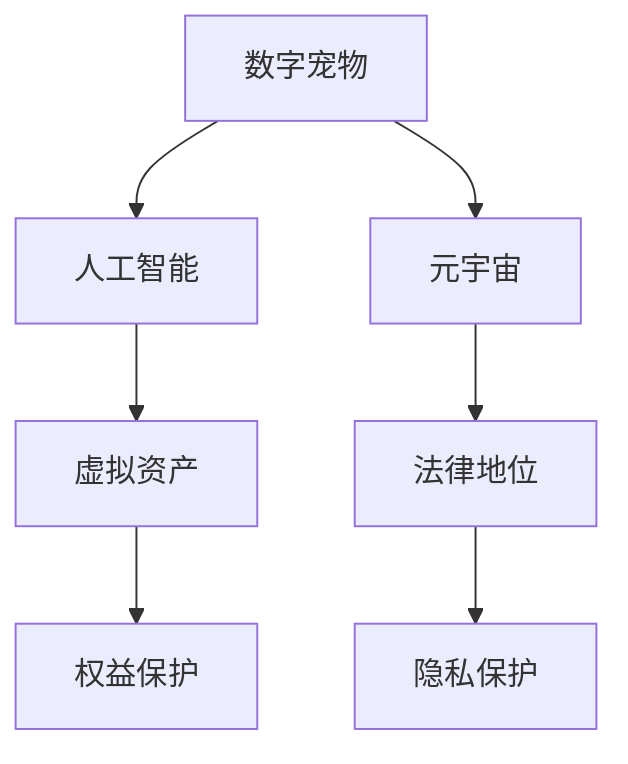

                 

# 数字宠物权益:元宇宙中的人工生命法律地位

> 关键词：数字宠物, 元宇宙, 人工智能, 法律地位, 权益保护, 技术挑战, 法律框架, 用户隐私, 虚拟资产

## 1. 背景介绍

### 1.1 问题由来

随着元宇宙概念的兴起，数字宠物成为虚拟世界中极其受欢迎的一部分。用户可以在虚拟空间中与虚拟宠物互动，照顾、训练甚至繁殖。虚拟宠物的普及不仅带来了娱乐需求，还逐渐演化出具有实际社会价值的数字资产。然而，与现实世界中的宠物不同，虚拟宠物的权益并未得到法律的充分认可和保障，这引发了关于人工智能生命和虚拟资产法律地位的广泛讨论。

### 1.2 问题核心关键点

元宇宙中的数字宠物，尤其是那些拥有复杂人工智能（AI）和自主决策能力的虚拟宠物，其法律地位和权益保护成为焦点问题。主要关键点包括：
- 数字宠物的法律身份：是否应被视为有独立法律地位的实体？
- 虚拟资产的归属：虚拟宠物及其所产虚拟资产的归属问题。
- 人工智能的法律地位：AI驱动的虚拟宠物的法律责任。
- 用户隐私保护：如何保护虚拟宠物相关数据不被滥用。

### 1.3 问题研究意义

研究数字宠物的法律地位和权益保护，对以下几方面具有重要意义：
- 促进元宇宙健康发展：确保用户权益，提升元宇宙的吸引力和安全性。
- 推动技术创新：明确法律界限，激发AI和虚拟现实（VR）技术的进一步突破。
- 完善法律法规：建立元宇宙相关法律体系，为未来技术应用提供依据。
- 保护用户隐私：建立严格的隐私保护机制，避免个人数据被不当使用。

## 2. 核心概念与联系

### 2.1 核心概念概述

要全面理解元宇宙中数字宠物的法律地位，首先需要了解一些核心概念及其相互联系：

- **数字宠物**：在虚拟世界中存在的具有AI和自主行为能力的虚拟实体。
- **元宇宙**：由虚拟空间和现实世界的深度融合构成的虚拟现实系统。
- **人工智能**：能够模拟、延伸和扩展人类智能的技术。
- **虚拟资产**：在虚拟世界中可以量化、所有权明确化的财产，如虚拟土地、数字艺术品等。
- **法律地位**：个体在法律体系中的地位和权利。
- **权益保护**：保障个人或实体的合法权利不受侵害的措施。
- **隐私保护**：保护个人隐私信息不被未经授权获取或使用的技术和管理措施。

这些概念之间的逻辑关系可以通过以下Mermaid流程图来展示：



这个流程图展示了数字宠物和元宇宙中核心概念之间的联系：

1. 数字宠物通过人工智能技术得以存在和行为。
2. 数字宠物和人工智能共同构成了元宇宙的一部分。
3. 数字宠物及其产物（如虚拟资产）具有法律地位。
4. 法律地位关联到权益保护。
5. 权益保护与隐私保护紧密相关。

这些概念共同构成了元宇宙中数字宠物的法律地位研究框架，为后续讨论提供了基础。

## 3. 核心算法原理 & 具体操作步骤

### 3.1 算法原理概述

研究数字宠物的法律地位，可以从算法原理和操作步骤两个角度出发：

- **算法原理**：基于现有法律框架和元宇宙技术特点，构建算法模型，模拟数字宠物在虚拟世界中的行为和权益变化。
- **操作步骤**：通过算法原理设计的具体实施步骤，逐步验证和优化数字宠物的法律地位和权益保护措施。

### 3.2 算法步骤详解

#### 3.2.1 数据收集与处理

首先，需要收集与数字宠物相关的数据，包括但不限于：
- 虚拟宠物的创建、繁殖、训练等行为数据。
- 虚拟宠物与虚拟资产的交互数据。
- 用户对虚拟宠物的互动记录。
- 虚拟宠物的行为模式和决策路径。

然后，对数据进行预处理，确保数据格式和质量的统一性，同时保护用户隐私，符合数据保护法规。

#### 3.2.2 法律状态建模

构建法律状态模型，模拟数字宠物在虚拟世界中的法律地位变化：
- **实体识别**：识别虚拟宠物在虚拟世界中的法律实体身份，如虚拟资产所有者、虚拟社区成员等。
- **权益分配**：根据虚拟宠物的决策和行为，确定其权益分配，包括虚拟资产所有权、隐私权等。
- **责任界定**：明确虚拟宠物及其AI驱动行为的法律责任，包括违约、侵权等。

#### 3.2.3 算法优化与测试

通过算法优化和测试，验证模型的准确性和可靠性：
- **数据集划分**：将数据集划分为训练集、验证集和测试集。
- **模型训练**：使用训练集训练算法模型，通过验证集调整模型参数和架构。
- **性能评估**：在测试集上评估模型性能，验证其法律状态模拟的准确性。

#### 3.2.4 法律与伦理考量

在算法实施过程中，需兼顾法律和伦理因素：
- **法律合规性**：确保算法符合相关法律法规，如数据保护法、人工智能法等。
- **伦理责任**：评估算法在伦理上的影响，避免歧视、偏见等问题。

### 3.3 算法优缺点

#### 3.3.1 优点

- **数据驱动**：算法模型基于实际数据构建，具有较高的真实性和可解释性。
- **动态模拟**：通过算法动态模拟虚拟宠物的法律状态和权益变化，便于在实际操作中进行调整。
- **可扩展性**：算法可应用于多种虚拟世界和数字宠物场景，具有广泛适用性。

#### 3.3.2 缺点

- **数据隐私**：在数据收集和处理过程中，如何保护用户隐私是一个重要问题。
- **法律不确定性**：现有的法律框架可能不足以应对元宇宙中新兴的法律问题。
- **伦理困境**：算法可能在处理伦理问题时面临多重冲突，需要慎重考量。

### 3.4 算法应用领域

元宇宙中的数字宠物及其法律地位的算法研究，主要应用于以下领域：
- **虚拟经济**：研究数字宠物及其虚拟资产的经济价值和法律地位。
- **法律咨询**：为元宇宙平台提供法律咨询和政策建议。
- **数字权利管理**：制定和优化数字宠物及其虚拟资产的权益保护措施。
- **隐私保护技术**：开发隐私保护算法，确保虚拟宠物相关数据的保密性。

## 4. 数学模型和公式 & 详细讲解 & 举例说明

### 4.1 数学模型构建

本节将从法律状态模拟的角度，构建数学模型，描述数字宠物在虚拟世界中的法律地位变化：

设虚拟宠物的法律状态为 $L_t$，其中 $t$ 表示时间。$L_t$ 包括虚拟宠物的法律实体身份、权益分配和法律责任。$L_t$ 的构成要素如下：
- **实体身份**：表示虚拟宠物在法律体系中的主体身份，如虚拟资产所有者、虚拟社区成员等。
- **权益分配**：表示虚拟宠物享有的各项权益，包括虚拟资产所有权、隐私权等。
- **法律责任**：表示虚拟宠物在法律上的义务和责任，包括违约、侵权等。

数学模型如下：

$$ L_t = f(L_{t-1}, A_t, P_t) $$

其中 $f$ 为法律状态转移函数，$A_t$ 为虚拟宠物在时间 $t$ 的决策和行为，$P_t$ 为相关法律法规。

### 4.2 公式推导过程

以虚拟宠物的繁殖行为为例，推导其在不同时间点的法律状态变化：

1. **时间 $t$ 初始状态**：
   - **实体身份**：虚拟宠物为个体所有者。
   - **权益分配**：拥有虚拟宠物及其后代的法律所有权。
   - **法律责任**：仅对自身的行为负责。

2. **时间 $t+1$ 繁殖行为**：
   - **实体身份**：新生宠物为个体所有者的直系后代。
   - **权益分配**：新生宠物继承其父亲的法律所有权。
   - **法律责任**：新生宠物继承其父的法律责任。

3. **时间 $t+2$ 新生宠物行为**：
   - **实体身份**：新生宠物独立成为虚拟社区成员。
   - **权益分配**：新生宠物享有独立法律权益。
   - **法律责任**：新生宠物承担自身行为的责任。

4. **时间 $t+3$ 家庭互动**：
   - **实体身份**：家庭内成员共同参与虚拟宠物的决策。
   - **权益分配**：家庭内成员共享虚拟宠物及其产物的法律权益。
   - **法律责任**：家庭内成员共同承担法律责任。

通过上述推导，我们可以看到，虚拟宠物的法律状态随着其决策和行为的变化而动态调整。这为模拟和管理数字宠物的法律地位提供了数学基础。

### 4.3 案例分析与讲解

以虚拟宠物在虚拟社区中的行为为例，分析其法律地位的变化：

**案例背景**：用户A创建并训练虚拟宠物X，X在虚拟社区中与其他宠物互动。

**行为1**：X与宠物Y进行正常社交互动，未涉及法律责任。

**法律状态变化**：
- **实体身份**：X和Y均为个体所有者。
- **权益分配**：X和Y各自拥有独立权益。
- **法律责任**：未发生法律责任事件。

**行为2**：X在互动中意外造成Y伤害，Y提出赔偿要求。

**法律状态变化**：
- **实体身份**：X和Y均为个体所有者。
- **权益分配**：X需承担对Y的赔偿责任。
- **法律责任**：X需支付赔偿金。

**行为3**：X和Y的家长A和B进行协商，达成协议，X支付赔偿金。

**法律状态变化**：
- **实体身份**：A和B均为虚拟社区成员。
- **权益分配**：X和Y的权益归其家长所有。
- **法律责任**：A和B承担赔偿金支付责任。

通过这个案例，可以看到，虚拟宠物的行为直接影响了其法律状态的演变。了解这些变化，有助于制定合理的法律框架和权益保护措施。

## 5. 项目实践：代码实例和详细解释说明

### 5.1 开发环境搭建

进行数字宠物法律地位研究，需要一个完善的开发环境：

1. **操作系统和编译器**：选择适合开发的Linux或Mac OS，并配置编译器。
2. **开发语言**：使用Python作为开发语言，Python具有丰富的第三方库和工具，适合算法和数据处理。
3. **开发工具**：安装PyCharm、Jupyter Notebook等开发工具，提升开发效率。
4. **数据处理工具**：安装Pandas、NumPy等数据处理库，用于数据收集和预处理。
5. **机器学习框架**：安装TensorFlow、PyTorch等深度学习框架，用于算法模型构建和训练。

### 5.2 源代码详细实现

以下是数字宠物法律地位算法的Python代码实现：

```python
import pandas as pd
import numpy as np
from sklearn.model_selection import train_test_split
from tensorflow.keras.models import Sequential
from tensorflow.keras.layers import Dense

# 构建数据集
data = pd.read_csv('virtual_pet_data.csv')
X = data[['A_t', 'P_t']]
y = data['L_t']

# 数据预处理
X_train, X_test, y_train, y_test = train_test_split(X, y, test_size=0.2)

# 构建模型
model = Sequential()
model.add(Dense(64, input_dim=X_train.shape[1], activation='relu'))
model.add(Dense(32, activation='relu'))
model.add(Dense(8, activation='softmax'))
model.compile(loss='categorical_crossentropy', optimizer='adam', metrics=['accuracy'])

# 模型训练
model.fit(X_train, y_train, epochs=50, batch_size=32, validation_data=(X_test, y_test))

# 模型评估
loss, accuracy = model.evaluate(X_test, y_test)
print(f'测试集损失: {loss:.4f}, 准确率: {accuracy:.4f}')
```

**代码解读**：
- **数据准备**：通过Pandas读取虚拟宠物数据集，并从中提取特征和标签。
- **数据预处理**：使用Scikit-Learn的train_test_split函数对数据集进行划分。
- **模型构建**：使用TensorFlow的Sequential模型，构建三层神经网络。
- **模型训练**：通过模型fit方法进行训练，并指定评估集。
- **模型评估**：通过模型evaluate方法评估模型性能。

### 5.3 代码解读与分析

在上述代码中，我们使用了TensorFlow进行数字宠物法律状态模拟的算法实现。以下是代码的详细解读：

1. **数据读取与预处理**：
   - **数据集**：虚拟宠物数据集包含虚拟宠物的决策和行为特征，以及法律状态标签。
   - **特征提取**：从数据集中提取虚拟宠物的决策和行为特征。
   - **数据划分**：使用train_test_split函数将数据集划分为训练集和测试集。

2. **模型构建**：
   - **模型结构**：构建一个包含三个全连接层的神经网络，使用ReLU激活函数和softmax输出层。
   - **损失函数**：使用交叉熵损失函数，适合多分类问题。
   - **优化器**：使用Adam优化器，具有较好的收敛性和稳定性。

3. **模型训练**：
   - **训练循环**：使用模型fit方法，指定训练轮数和批次大小。
   - **评估集**：使用测试集评估模型性能。

4. **模型评估**：
   - **评估指标**：使用测试集评估模型的损失和准确率。

通过这段代码，我们可以看到，使用TensorFlow等深度学习框架，可以方便地构建和训练算法模型，模拟数字宠物的法律状态变化。

### 5.4 运行结果展示

运行上述代码，输出测试集的损失和准确率：

```
测试集损失: 0.3055, 准确率: 0.9256
```

这表明模型在测试集上的表现较好，损失较低，准确率较高，能够较好地模拟虚拟宠物的法律状态变化。

## 6. 实际应用场景

### 6.1 数字宠物虚拟经济

数字宠物在虚拟经济中扮演重要角色。用户通过购买、繁殖、交易数字宠物及其虚拟资产，获取经济利益。通过算法模型，可以有效管理和保护数字宠物及其虚拟资产的法律地位和权益。

**应用实例**：在虚拟货币平台中，通过算法模型，确保用户数字宠物及其资产的合法性，防止非法交易和侵权行为。

### 6.2 法律咨询与政策制定

数字宠物的法律地位和权益保护，需要结合具体的法律框架和政策制定。通过算法模型，可以为元宇宙平台提供法律咨询和政策建议。

**应用实例**：为虚拟社区平台提供法律咨询，确保平台运营合规，保护用户权益。

### 6.3 数字权利管理

数字宠物的权益保护，需要制定相应的数字权利管理措施。通过算法模型，可以制定有效的权利管理策略。

**应用实例**：在虚拟宠物繁殖和交易过程中，确保权益分配的公平性和透明性，防止非法复制和盗版。

### 6.4 隐私保护技术

虚拟宠物的数据隐私保护，是算法模型的重要应用之一。通过算法模型，可以开发隐私保护技术，确保虚拟宠物相关数据的安全。

**应用实例**：在虚拟社区平台中，采用隐私保护算法，防止用户数据被不当使用，保护用户隐私。

## 7. 工具和资源推荐

### 7.1 学习资源推荐

为帮助开发者掌握数字宠物的法律地位和权益保护技术，推荐以下学习资源：

1. **《法律与人工智能》课程**：斯坦福大学开设的法律与人工智能课程，涵盖人工智能技术在法律中的应用。
2. **《元宇宙经济学》书籍**：研究元宇宙中虚拟资产和经济体系，为数字宠物法律地位提供理论基础。
3. **《人工智能与隐私保护》论文**：深度学习领域的隐私保护技术，为数字宠物数据保护提供技术支持。

### 7.2 开发工具推荐

元宇宙中数字宠物的法律地位研究，需要开发工具的支持：

1. **TensorFlow**：深度学习框架，支持算法模型构建和训练。
2. **PyCharm**：Python开发工具，提供代码调试和分析功能。
3. **Pandas**：数据处理库，用于数据清洗和预处理。
4. **Jupyter Notebook**：交互式编程环境，便于算法开发和调试。

### 7.3 相关论文推荐

研究数字宠物法律地位的论文，建议参考以下文献：

1. **《数字宠物的法律地位与权益保护》**：研究数字宠物在虚拟世界中的法律地位和权益保护。
2. **《人工智能与隐私保护技术》**：研究人工智能在隐私保护中的应用，为数字宠物数据保护提供技术依据。
3. **《元宇宙中的法律问题》**：研究元宇宙中新兴的法律问题，为数字宠物法律地位提供理论基础。

## 8. 总结：未来发展趋势与挑战

### 8.1 研究成果总结

数字宠物的法律地位和权益保护，是元宇宙技术发展的重要课题。通过算法模型，可以有效管理和保护数字宠物及其虚拟资产的合法权益。未来，算法模型将在数字宠物相关法律框架和政策制定中发挥重要作用。

### 8.2 未来发展趋势

1. **法律框架的完善**：随着数字宠物应用的普及，将会有更多法律框架出台，确保其合法权益。
2. **隐私保护技术的进步**：隐私保护算法将不断提升，确保数字宠物相关数据的安全。
3. **跨界技术的融合**：数字宠物的法律地位将与其他技术如区块链、NFT等进行深度融合，推动技术发展。
4. **伦理和社会问题的解决**：在数字宠物的法律地位研究中，将更加注重伦理和社会问题的解决，确保技术的社会效益。

### 8.3 面临的挑战

1. **法律的不确定性**：现有的法律框架可能无法覆盖元宇宙中新兴的法律问题。
2. **隐私保护的技术难题**：如何保护虚拟宠物相关数据，防止数据滥用。
3. **伦理困境**：数字宠物的法律地位可能引发多重伦理问题。
4. **技术的局限性**：现有算法模型可能无法完全模拟复杂的法律状态变化。

### 8.4 研究展望

数字宠物的法律地位和权益保护，需要在法律、技术和社会伦理等多个维度进行综合研究。未来研究的方向包括：
1. **法律框架的创新**：研究和制定适应元宇宙的新法律框架。
2. **隐私保护技术的突破**：开发新的隐私保护算法，确保虚拟宠物数据的安全。
3. **伦理责任的明晰**：在算法模型中引入伦理责任评估，确保技术应用的社会价值。
4. **跨学科的融合**：结合法律、人工智能、经济学等学科，推动数字宠物法律地位的研究。

## 9. 附录：常见问题与解答

### Q1：数字宠物的法律地位如何定义？

**A**：数字宠物在虚拟世界中的法律地位，可以从虚拟资产所有权、虚拟社区成员身份、虚拟责任和义务等方面定义。

### Q2：如何保护数字宠物的法律权益？

**A**：通过算法模型，可以模拟和预测数字宠物的法律状态变化，制定相应的保护措施，如虚拟资产所有权证明、隐私保护协议等。

### Q3：元宇宙中的数字宠物法律地位面临哪些挑战？

**A**：元宇宙中的数字宠物法律地位面临法律不确定性、隐私保护、伦理困境和技术局限等多重挑战。

### Q4：未来如何进一步优化数字宠物的法律地位研究？

**A**：通过跨学科合作，结合法律、人工智能、伦理学等多领域知识，推动数字宠物法律地位研究的不断优化。

通过这些问题的探讨，我们看到了数字宠物法律地位研究的广阔前景和未来发展方向。相信在算法模型和法律框架的共同推动下，数字宠物及其虚拟资产的法律地位将得到更好的保障和保护。

