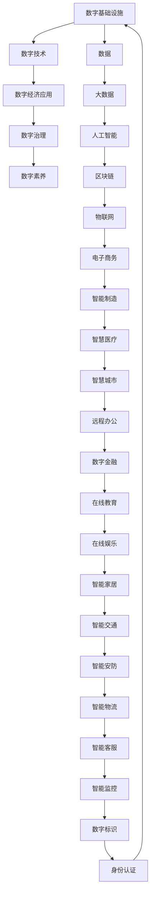

                 

# 数字经济：社会发展的助推器

## 1. 背景介绍

### 1.1 数字经济的概念
数字经济是指利用数字技术和互联网平台，通过信息和服务进行经济活动和价值创造的一种新型经济形态。数字经济覆盖了从基础技术到应用场景的各个层面，包括云计算、大数据、物联网、人工智能、区块链等先进技术，以及电子商务、在线教育、远程办公、数字金融等新兴产业。

### 1.2 数字经济的发展历程
数字经济的发展经历了从1.0到3.0的演进过程：

- 1.0时代：互联网兴起初期，以门户网站、搜索引擎、在线社区等为代表，主要解决了信息获取问题。
- 2.0时代：以电子商务、社交网络、即时通讯等为代表，实现了线上线下的连接，促进了信息传播和商品交易。
- 3.0时代：以人工智能、物联网、5G等技术为基础，推动了智能制造、智慧城市、智能医疗等领域的全面数字化转型。

当前，数字经济正在引领全球经济的深度变革，成为推动社会进步的重要引擎。

### 1.3 数字经济的现状与挑战
全球数字经济规模不断扩大，尤其是在疫情的催化下，数字化转型加速推进，企业、政府和社会对数字技术的应用需求显著提升。然而，数字经济的发展仍面临一些挑战：

- 数据安全与隐私保护问题：大数据的广泛应用带来了数据泄露和隐私侵害的风险。
- 数字鸿沟与公平性问题：不同地区和群体在数字技术的获取和使用上存在显著差异，导致数字鸿沟加剧，不公平现象凸显。
- 技术标准与互操作性问题：各行业技术标准不统一，数据格式和接口互操作性不足，限制了数字经济的协同发展。
- 伦理与法律问题：人工智能、物联网等技术的广泛应用引发了伦理和法律问题，如何规范其使用成为重要课题。

## 2. 核心概念与联系

### 2.1 核心概念概述

为了更好地理解数字经济，我们先介绍几个关键概念：

- **数字基础设施**：指支持数字经济运行的物理和虚拟基础设施，如5G网络、数据中心、云计算平台等。
- **数字技术**：包括云计算、大数据、人工智能、区块链、物联网等先进技术。
- **数字经济应用**：涵盖电子商务、智能制造、智慧医疗、智慧城市等多个领域，旨在提升社会生产力、优化资源配置、改善人民生活质量。
- **数字治理**：指通过数字技术，优化政府管理和服务，提升公共治理效率，推动数字经济发展。
- **数字素养**：指公民使用和理解数字技术的知识和技能，数字素养的高低直接影响数字经济的发展水平。

这些概念之间相互联系，共同构成了数字经济的完整框架。

### 2.2 核心概念原理和架构的 Mermaid 流程图



这个流程图展示了数字基础设施、数字技术、数字经济应用、数字治理和数字素养之间的相互关系。

## 3. 核心算法原理 & 具体操作步骤

### 3.1 算法原理概述
数字经济的核心算法原理主要涉及数据处理、机器学习和优化算法等方面。下面将详细介绍这些关键技术。

### 3.2 算法步骤详解

#### 3.2.1 数据预处理
数据预处理是数字经济的基础，主要包括数据清洗、特征提取、数据转换等步骤：

1. **数据清洗**：去除或修正数据中的噪声、错误和不完整信息，确保数据的质量。
2. **特征提取**：从原始数据中提取有意义的特征，提高模型的预测能力。
3. **数据转换**：通过标准化、归一化、编码等技术，将数据转换为适合算法处理的形式。

#### 3.2.2 机器学习算法
机器学习是数字经济的核心技术之一，包括监督学习、无监督学习和强化学习等方法：

1. **监督学习**：使用标注数据训练模型，预测新数据的标签。
2. **无监督学习**：使用未标注数据进行聚类、降维等，发现数据的潜在结构。
3. **强化学习**：通过试错的方式优化模型的决策策略，适合动态环境和复杂任务。

#### 3.2.3 优化算法
优化算法用于提高模型的性能和效率，常用的算法包括梯度下降、随机梯度下降、Adam等：

1. **梯度下降**：通过计算损失函数的梯度，不断调整模型参数，最小化损失函数。
2. **随机梯度下降**：在每次迭代中，只计算一小批数据的梯度，降低计算复杂度。
3. **Adam**：结合动量、自适应学习率等优点，加速收敛，提高训练效率。

### 3.3 算法优缺点

#### 3.3.1 优点
- **自动化**：机器学习算法能够自动化地进行数据处理和模型训练，减少人工干预。
- **高效性**：优化算法提高了模型的训练效率，加速了数据分析和决策过程。
- **泛化能力**：通过大规模数据训练，机器学习模型具备较强的泛化能力，能够适应不同的场景和任务。

#### 3.3.2 缺点
- **数据依赖**：模型的性能依赖于数据的质量和数量，数据不足可能导致模型欠拟合。
- **计算资源**：大规模数据和高维特征的训练需要大量的计算资源，对硬件设备要求较高。
- **模型复杂性**：复杂的模型结构可能增加模型的解释难度，降低模型的可解释性。

### 3.4 算法应用领域

#### 3.4.1 电子商务
数字技术在电子商务中的应用包括：

1. **推荐系统**：通过分析用户行为和历史数据，推荐个性化的商品和服务。
2. **库存管理**：通过预测市场需求和供应链情况，优化库存水平和配送路线。
3. **支付与结算**：通过区块链和加密技术，保障交易安全与信任。

#### 3.4.2 智能制造
智能制造通过数字化技术，实现生产过程的自动化和智能化，主要包括：

1. **智能生产**：通过物联网和传感器，实时监控生产设备状态，优化生产流程。
2. **预测性维护**：利用大数据和机器学习，预测设备故障和维护需求，减少停机时间。
3. **供应链优化**：通过数据驱动的决策，优化供应链各环节，提升效率和响应速度。

#### 3.4.3 智慧医疗
智慧医疗通过数字技术，提升医疗服务的效率和质量，主要包括：

1. **远程医疗**：通过视频会议和远程诊断，缓解医疗资源不足的问题。
2. **电子病历**：通过数字化记录和共享，提高医疗数据的利用率和准确性。
3. **智能诊断**：利用人工智能技术，辅助医生进行疾病诊断和医学影像分析。

## 4. 数学模型和公式 & 详细讲解 & 举例说明

### 4.1 数学模型构建

数字经济中的核心数学模型主要包括线性回归模型、决策树模型、神经网络模型等。这些模型通常用于预测和分类任务，其形式化表达如下：

- **线性回归模型**：$y = \theta_0 + \sum_{i=1}^n \theta_i x_i$
- **决策树模型**：通过划分特征空间，构建树形结构进行分类。
- **神经网络模型**：由多层神经元组成，通过前向传播和反向传播算法进行训练和预测。

### 4.2 公式推导过程

#### 4.2.1 线性回归模型
线性回归模型是最简单的预测模型，通过最小二乘法求解模型参数，推导过程如下：

1. **目标函数**：最小化残差平方和，即$\min_{\theta} \sum_{i=1}^n (y_i - \theta_0 - \sum_{i=1}^n \theta_i x_i)^2$。
2. **求解过程**：对目标函数求导，得到梯度表达式，利用梯度下降法更新模型参数。

### 4.3 案例分析与讲解

#### 4.3.1 推荐系统
推荐系统是数字经济中最具代表性的应用之一，通过机器学习模型预测用户对商品或服务的兴趣，实现个性化推荐。以协同过滤算法为例，其原理如下：

1. **用户-物品矩阵**：通过用户的历史行为数据构建用户-物品评分矩阵。
2. **相似度计算**：计算用户之间的相似度，生成用户聚类。
3. **推荐计算**：通过聚类结果和评分矩阵，计算推荐结果。

推荐系统的优点在于其高准确率和个性化，但面临数据稀疏、冷启动等问题，需要结合用户反馈和物品属性进行优化。

## 5. 项目实践：代码实例和详细解释说明

### 5.1 开发环境搭建

数字经济的开发环境搭建主要依赖于云计算和分布式计算平台，如AWS、Azure、Google Cloud等。以下是搭建开发环境的步骤：

1. **选择合适的云平台**：根据业务需求和成本预算，选择合适的云服务提供商。
2. **配置计算资源**：根据项目规模和需求，配置合适的虚拟机、存储和网络资源。
3. **安装开发工具**：安装Python、Jupyter Notebook、TensorFlow等开发工具，以及必要的依赖库。
4. **数据准备**：准备训练数据和测试数据，并进行预处理和清洗。

### 5.2 源代码详细实现

#### 5.2.1 推荐系统
以下是一个简单的协同过滤推荐系统的实现：

```python
import pandas as pd
import numpy as np
from scipy.sparse import csr_matrix
from scipy.sparse.linalg import svds

# 读取用户-物品评分矩阵
data = pd.read_csv('rating.csv', index_col='user_id', parse_dates=['timestamp'])
user_item = data.pivot_table(values='rating', index='item_id', columns='user_id', fillna=0)

# 构建用户-物品矩阵
user_item_matrix = csr_matrix(user_item)

# 计算用户聚类
U, S, V = svds(user_item_matrix, k=3)

# 计算用户向量
user_vector = np.dot(user_item_matrix.T.dot(V), np.diag(S))

# 计算推荐结果
test_item_matrix = csr_matrix(test_item)
recommendation = test_item_matrix.dot(U.T)
```

#### 5.2.2 预测性维护
以下是一个简单的预测性维护模型的实现：

```python
import pandas as pd
import numpy as np
from sklearn.ensemble import RandomForestRegressor

# 读取设备数据
data = pd.read_csv('device_data.csv')

# 数据清洗
data.dropna(inplace=True)
data = data[data['status'] == 'normal']

# 划分训练集和测试集
train_data = data[:80%]
test_data = data[80%:]

# 特征提取
features = data[['temperature', 'humidity', 'vibration']]
target = data['fail_time']

# 训练模型
model = RandomForestRegressor(n_estimators=100)
model.fit(features, target)

# 预测故障时间
predictions = model.predict(test_data[['temperature', 'humidity', 'vibration']])
```

### 5.3 代码解读与分析

#### 5.3.1 推荐系统
推荐系统是一个典型的机器学习应用，通过协同过滤算法，实现个性化推荐。代码中主要涉及用户-物品矩阵的构建、用户聚类的计算和推荐结果的生成。

#### 5.3.2 预测性维护
预测性维护是智能制造中的一个重要应用，通过预测设备故障和维护需求，减少停机时间。代码中主要涉及设备数据的清洗、特征提取和模型训练，以及故障时间的预测。

### 5.4 运行结果展示

#### 5.4.1 推荐系统
推荐系统的运行结果可以通过以下方式展示：

```python
# 显示推荐结果
print(recommendation)
```

#### 5.4.2 预测性维护
预测性维护的运行结果可以通过以下方式展示：

```python
# 显示预测结果
print(predictions)
```

## 6. 实际应用场景

### 6.1 智能制造
智能制造通过数字化技术，实现生产过程的自动化和智能化。以下是一个智能制造场景的实例：

1. **数字化工厂**：通过物联网设备和传感器，实时监控生产设备和工人状态，优化生产流程。
2. **智能仓储**：利用自动化机械臂和智能仓库管理系统，提高仓储效率和准确性。
3. **预测性维护**：利用大数据和机器学习，预测设备故障和维护需求，减少停机时间。

### 6.2 智慧医疗
智慧医疗通过数字技术，提升医疗服务的效率和质量。以下是一个智慧医疗场景的实例：

1. **远程医疗**：通过视频会议和远程诊断，缓解医疗资源不足的问题。
2. **电子病历**：通过数字化记录和共享，提高医疗数据的利用率和准确性。
3. **智能诊断**：利用人工智能技术，辅助医生进行疾病诊断和医学影像分析。

## 7. 工具和资源推荐

### 7.1 学习资源推荐

1. **Coursera**：提供大量高质量的在线课程，涵盖计算机科学、数据科学和人工智能等领域。
2. **edX**：提供来自世界顶尖大学的在线课程，涵盖各种学科和技术。
3. **Kaggle**：数据科学和机器学习的竞赛平台，提供丰富的数据集和实践机会。
4. **Google Developers**：提供全面的开发文档和教程，涵盖云计算、机器学习和大数据等领域。

### 7.2 开发工具推荐

1. **AWS SageMaker**：提供全托管的机器学习平台，支持多种机器学习框架和算法。
2. **Azure Machine Learning**：提供云上机器学习服务，支持模型训练、部署和管理。
3. **Google Cloud AI Platform**：提供云上机器学习平台，支持TensorFlow、Keras等框架。
4. **PyTorch**：开源深度学习框架，支持动态计算图和高效的模型训练。
5. **TensorFlow**：由Google主导的深度学习框架，支持分布式训练和多种模型架构。

### 7.3 相关论文推荐

1. **"Deep Learning for Healthcare" by Ian Goodfellow**：深入探讨深度学习在医疗领域的应用。
2. **"Blockchain for Business" by Don Tapscott and Alex Tapscott**：详细介绍区块链技术在商务中的应用。
3. **"The AI-First Future" by Articulate**：探讨人工智能在未来经济和社会中的重要作用。

## 8. 总结：未来发展趋势与挑战

### 8.1 研究成果总结

数字经济的发展离不开技术的创新和应用，以下总结了近年来在数字经济领域的主要研究成果：

1. **机器学习技术**：通过深度学习、强化学习等算法，提升模型的预测和决策能力。
2. **云计算和大数据**：利用云计算平台和大数据技术，实现大规模数据处理和存储。
3. **物联网和5G技术**：推动智能制造、智慧医疗等领域的数字化转型。
4. **区块链和加密技术**：保障数据安全和交易透明性，提升数字经济的可信度。

### 8.2 未来发展趋势

#### 8.2.1 技术发展趋势
数字经济将继续朝着智能化、自动化和互联化的方向发展，具体趋势如下：

1. **人工智能**：通过深度学习、自然语言处理等技术，提升智能决策和自然交互的能力。
2. **物联网**：通过连接各种设备，实现数据实时传输和自动化控制。
3. **5G网络**：提供高速、低延迟的网络环境，支持大规模数据处理和实时应用。
4. **区块链**：提供安全、透明、可信的数据共享和交易机制。

#### 8.2.2 应用场景拓展
数字经济的应用场景将不断拓展，涵盖更多领域和行业，具体包括：

1. **智能制造**：通过数字化和自动化技术，提升生产效率和产品质量。
2. **智慧医疗**：通过数字技术和人工智能，提升医疗服务的质量和可及性。
3. **数字金融**：通过区块链和加密技术，保障金融交易的安全和透明。
4. **智慧城市**：通过数字化和智能化技术，提升城市管理和服务水平。

### 8.3 面临的挑战

#### 8.3.1 数据隐私和安全
数据隐私和安全是数字经济面临的重要挑战，具体包括：

1. **数据泄露**：大规模数据处理可能带来数据泄露的风险。
2. **隐私保护**：用户隐私数据需要得到有效保护，防止滥用和泄露。

#### 8.3.2 技术标准和互操作性
技术标准和互操作性问题限制了数字经济的协同发展，具体包括：

1. **数据格式不统一**：不同系统和平台的数据格式不兼容，导致数据难以整合和共享。
2. **接口不互操作**：不同系统之间的接口互操作性不足，限制了应用的协同和集成。

#### 8.3.3 伦理和法律问题
伦理和法律问题对数字经济的发展提出了新的要求，具体包括：

1. **算法透明性**：机器学习模型的决策过程需要透明化，便于解释和监督。
2. **法律合规性**：数字经济的应用需要符合国家和地区的法律法规，避免违法和侵权行为。

### 8.4 研究展望

#### 8.4.1 技术创新
数字经济需要不断推动技术创新，具体方向包括：

1. **量子计算**：利用量子计算机加速机器学习和数据处理，提高计算效率和安全性。
2. **边缘计算**：通过分布式计算和本地处理，降低数据传输和存储成本，提高实时性。
3. **跨模态学习**：将不同模态（如视觉、语音、文本）的数据进行融合，提高模型的泛化能力和准确性。

#### 8.4.2 应用拓展
数字经济的应用场景将不断拓展，具体方向包括：

1. **智能家居**：通过数字化和智能化技术，提升家居环境和生活的便利性。
2. **智能交通**：通过数字化和智能化技术，优化交通管理和出行服务。
3. **智能安防**：通过数字化和智能化技术，提高公共安全和管理水平。

## 9. 附录：常见问题与解答

### 9.1 数字经济的定义和意义
**Q1: 什么是数字经济？**
**A:** 数字经济是指利用数字技术和互联网平台，通过信息和服务进行经济活动和价值创造的一种新型经济形态。

**Q2: 数字经济的意义是什么？**
**A:** 数字经济通过数字化和智能化技术，提升生产效率和资源配置，优化社会治理和公共服务，推动经济转型升级。

### 9.2 数字经济的关键技术
**Q3: 数字经济的关键技术有哪些？**
**A:** 数字经济的关键技术包括云计算、大数据、人工智能、区块链、物联网等，这些技术通过数据驱动和智能决策，提升了各行业的数字化水平。

**Q4: 这些技术之间是如何相互关联的？**
**A:** 这些技术通过数据共享和协同，实现了各环节的整合和优化。例如，人工智能利用大数据和物联网数据进行建模和预测，云计算提供计算和存储支持，区块链保障数据安全和透明性。

### 9.3 数字经济的应用场景
**Q5: 数字经济的应用场景有哪些？**
**A:** 数字经济的应用场景包括电子商务、智能制造、智慧医疗、智慧城市、数字金融等，涵盖了从生产到消费的全链条。

**Q6: 数字经济如何影响传统行业？**
**A:** 数字经济通过数字化和智能化技术，提升了传统行业的效率和质量，推动了产业升级和创新。

### 9.4 数字经济的未来发展
**Q7: 数字经济的未来发展趋势是什么？**
**A:** 数字经济将继续朝着智能化、自动化和互联化的方向发展，推动各行业的深度融合和协同创新。

**Q8: 数字经济面临的主要挑战是什么？**
**A:** 数字经济面临的主要挑战包括数据隐私和安全、技术标准和互操作性、伦理和法律问题等，需要多方协同解决。

---

作者：禅与计算机程序设计艺术 / Zen and the Art of Computer Programming

