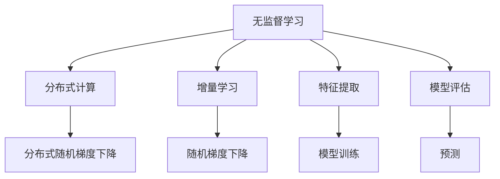

                 

# 无监督学习的可扩展性:分布式计算和增量学习

> 关键词：无监督学习,分布式计算,增量学习,大数据,可扩展性

## 1. 背景介绍

### 1.1 问题由来
无监督学习(Uunsupervised Learning)是机器学习中的一类重要范式，旨在从无标注数据中挖掘内在结构和模式。与有监督学习不同，无监督学习不依赖于目标函数和标注数据，可以更灵活地应用于数据未知、标注成本高昂或标注难以获得的场景。在大数据时代，随着数据规模的指数级增长，无监督学习的重要性日益凸显。

然而，大规模无监督学习任务的计算复杂度高、内存消耗大，单个计算节点难以承受，因此传统的集中式计算方法面临诸多局限。分布式计算的引入，使得无监督学习在大数据集上的应用成为可能。此外，增量学习(Incremental Learning)技术的应用，使得无监督学习系统可以持续更新学习，进一步提升了模型的适应能力和可扩展性。

### 1.2 问题核心关键点
本文聚焦于无监督学习的可扩展性，探讨如何通过分布式计算和增量学习技术，在大规模数据集上进行高效的无监督学习，提升模型性能和训练速度。

## 2. 核心概念与联系

### 2.1 核心概念概述

为更好地理解分布式计算和增量学习在无监督学习中的应用，本节将介绍几个密切相关的核心概念：

- 分布式计算(Distributed Computing)：指将一个大规模计算任务，分成多个子任务，由多个计算节点并行处理，最终将各节点的计算结果合并得到整体结果的技术。
- 增量学习(Incremental Learning)：指模型在已有参数的基础上，不断利用新数据进行更新学习，减少从头训练的计算成本和时间，提高模型适应新数据的能力。
- 无监督学习(Unsupervised Learning)：指在没有标注数据的情况下，通过算法发现数据中的潜在结构和规律，自动学习特征表示的方法。
- 随机梯度下降(Stochastic Gradient Descent, SGD)：一种常用的优化算法，通过随机抽取小批量样本计算梯度，更新模型参数，避免计算过载。
- 分布式随机梯度下降(Distributed SGD)：在分布式计算框架上，将SGD算法并行化处理，进一步提升计算效率。
- 特征提取(Feature Extraction)：通过学习数据集的低维表示，挖掘数据的内在结构和模式。

这些核心概念之间的逻辑关系可以通过以下Mermaid流程图来展示：



这个流程图展示了大规模无监督学习的核心概念及其之间的关系：

1. 无监督学习从大规模数据集中自动学习特征表示。
2. 分布式计算通过并行处理大规模数据集，提升计算效率。
3. 增量学习使得无监督学习模型能够持续更新，适应新数据。
4. 随机梯度下降用于更新模型参数，避免计算过载。
5. 分布式随机梯度下降进一步提升并行处理效率。
6. 特征提取从数据中挖掘潜在结构和模式。
7. 模型训练和评估使用学习到的特征表示进行。
8. 预测使用训练好的模型对新数据进行推断。

## 3. 核心算法原理 & 具体操作步骤

### 3.1 算法原理概述

无监督学习的可扩展性，主要依赖于分布式计算和增量学习技术。其核心思想是：通过分布式计算，将大规模无监督学习任务分解成多个子任务，由多个计算节点并行处理；通过增量学习，使模型能够持续更新，适应新数据。

具体而言，假设无监督学习任务为 $L$，涉及大规模数据集 $\mathcal{D}$。分布式计算通过将 $\mathcal{D}$ 分成 $k$ 个数据分片 $\{\mathcal{D}_i\}_{i=1}^k$，由 $k$ 个计算节点并行处理。增量学习则通过持续更新模型参数，使得模型能够适应新数据的分布变化。

形式化地，假设无监督学习模型为 $M$，其参数为 $\theta$。则分布式计算和增量学习的优化目标为：

$$
\min_{\theta} \mathcal{L}(\theta|\mathcal{D}) + \mathcal{L}_{incr}(\theta|(\mathcal{D}_{train},\mathcal{D}_{test}))
$$

其中 $\mathcal{L}(\theta|\mathcal{D})$ 为在数据集 $\mathcal{D}$ 上计算损失函数，$\mathcal{L}_{incr}(\theta|(\mathcal{D}_{train},\mathcal{D}_{test}))$ 为在训练集 $\mathcal{D}_{train}$ 和测试集 $\mathcal{D}_{test}$ 上计算增量损失函数。

### 3.2 算法步骤详解

基于分布式计算和增量学习的大规模无监督学习一般包括以下几个关键步骤：

**Step 1: 数据分片和计算节点划分**
- 将大规模数据集 $\mathcal{D}$ 分成 $k$ 个数据分片 $\{\mathcal{D}_i\}_{i=1}^k$。
- 根据每个计算节点的性能和带宽，合理分配数据分片，保证负载均衡。

**Step 2: 分布式随机梯度下降并行处理**
- 将每个数据分片 $\mathcal{D}_i$ 分配给一个计算节点，进行并行计算。
- 使用随机梯度下降法，每次随机抽取小批量样本计算梯度，更新模型参数。
- 将各节点的梯度结果汇总，计算全局梯度，更新模型参数。

**Step 3: 增量学习持续更新**
- 在每次迭代后，使用增量学习算法，更新模型参数，适应新数据分布。
- 可以使用在线学习算法(如AdaGrad)，或离线学习算法(如Mini-Batch Online)进行更新。
- 增量更新可以通过小批量数据，减少计算开销，提高模型适应性。

**Step 4: 模型评估和优化**
- 在每次更新后，使用测试集 $\mathcal{D}_{test}$ 对模型进行评估。
- 根据评估结果，调整模型参数和学习率，避免过拟合。
- 可以使用正则化技术，如L2正则、Dropout等，提升模型泛化能力。

**Step 5: 分布式增量学习部署**
- 将训练好的模型部署到分布式计算系统中，支持实时训练和推理。
- 可以使用TF-Serving、TensorFlow Dataset Pipeline等工具，实现分布式增量学习的持续更新和部署。
- 通过监控工具实时跟踪系统性能和资源使用情况，及时调整资源配置。

以上是基于分布式计算和增量学习的大规模无监督学习的典型流程。在实际应用中，还需要根据具体场景，对各环节进行优化设计，如选择合适的数据分片策略、调整增量更新频率、优化分布式通信协议等。

### 3.3 算法优缺点

基于分布式计算和增量学习的大规模无监督学习具有以下优点：

1. 可扩展性高。通过分布式计算，将大规模数据集并行处理，可显著提高计算效率。
2. 适应性强。通过增量学习，模型能够持续更新，适应数据分布变化，提升泛化能力。
3. 计算成本低。相比于从头训练，增量学习可以避免大量标注数据的获取，减少计算开销。
4. 实时性高。分布式增量学习可以实时响应新数据，提供快速推理服务。

同时，该方法也存在一些局限性：

1. 通信开销大。分布式计算需要频繁的数据交换，可能成为系统瓶颈。
2. 数据一致性问题。分布式系统中，各节点对数据处理的结果可能不一致，需要进行协调。
3. 算法复杂度高。分布式计算和增量学习本身就是一个复杂的优化问题，需要精心设计算法。
4. 内存消耗大。增量学习需要保留部分历史数据，可能占用大量内存。
5. 模型更新频率限制。增量更新的频率和步长需要精心设计，否则可能导致模型不收敛。

尽管存在这些局限性，但就目前而言，基于分布式计算和增量学习的方法，是大规模无监督学习任务的最佳选择。未来相关研究的重点在于如何进一步降低通信开销，提高数据一致性，优化算法复杂度，减小内存消耗，以及更好地设计增量更新策略。

### 3.4 算法应用领域

基于分布式计算和增量学习的大规模无监督学习技术，已经在大数据、图像识别、自然语言处理等多个领域得到了广泛应用：

- 自然语言处理(NLP)：通过分布式计算和增量学习，大规模无监督语言模型能够持续学习新词汇、新表达，提升模型理解和生成能力。
- 图像识别：在图像数据集上，使用分布式计算和增量学习，无监督图像特征提取器能够学习到稳定的特征表示，提升图像识别性能。
- 大数据分析：通过分布式计算和增量学习，可以高效处理大规模非结构化数据，发现数据中的潜在结构和模式。
- 推荐系统：利用增量学习，无监督推荐算法可以持续更新用户行为模型，推荐更精准的内容。
- 金融风控：在金融数据集上，分布式计算和增量学习可以提升风险评估模型的鲁棒性和实时性，及时发现异常行为。

除了这些经典领域外，无监督学习技术还在更多场景中得到创新应用，如社交网络分析、生物信息学、环境监测等，为大数据分析和智能化决策提供了新的支持。随着分布式计算和增量学习技术的持续演进，无监督学习技术必将在更多领域发挥更大的作用。

## 4. 数学模型和公式 & 详细讲解 & 举例说明

### 4.1 数学模型构建

本节将使用数学语言对基于分布式计算和增量学习的大规模无监督学习过程进行更加严格的刻画。

假设无监督学习任务为 $L$，涉及大规模数据集 $\mathcal{D}$。假设模型参数为 $\theta$，分布式计算分成 $k$ 个计算节点，每个节点处理的数据分片大小为 $n$，则分布式计算和增量学习的数学模型为：

$$
\mathcal{L}_{dist}(\theta|\mathcal{D}) = \sum_{i=1}^k \frac{1}{n_i}\mathcal{L}(\theta|\mathcal{D}_i)
$$

其中 $\mathcal{L}(\theta|\mathcal{D}_i)$ 为节点 $i$ 处理数据分片 $\mathcal{D}_i$ 的损失函数。

增量学习的损失函数 $\mathcal{L}_{incr}(\theta|(\mathcal{D}_{train},\mathcal{D}_{test}))$ 可表示为：

$$
\mathcal{L}_{incr}(\theta|(\mathcal{D}_{train},\mathcal{D}_{test})) = \mathcal{L}(\theta|\mathcal{D}_{train}) + \mathcal{L}(\theta|\mathcal{D}_{test})
$$

其中 $\mathcal{L}(\theta|\mathcal{D}_{train})$ 和 $\mathcal{L}(\theta|\mathcal{D}_{test})$ 分别为训练集和测试集上的损失函数。

### 4.2 公式推导过程

以下我们以无监督图像特征提取为例，推导增量学习模型的参数更新公式。

假设图像数据集为 $\mathcal{D}=\{(x_i,y_i)\}_{i=1}^N$，其中 $x_i$ 为图像，$y_i$ 为图像标签。使用无监督学习模型 $M_{\theta}$ 提取图像特征，损失函数为均方误差：

$$
\mathcal{L}(\theta|\mathcal{D}) = \frac{1}{N}\sum_{i=1}^N ||M_{\theta}(x_i)-y_i||^2
$$

假设增量学习使用AdaGrad算法更新参数，学习率为 $\eta$，则增量学习模型参数的更新公式为：

$$
\theta_{t+1} = \theta_t - \eta \nabla_{\theta}\mathcal{L}(\theta_t|\mathcal{D}_{train})
$$

其中 $t$ 为迭代步数，$\nabla_{\theta}\mathcal{L}(\theta_t|\mathcal{D}_{train})$ 为在训练集 $\mathcal{D}_{train}$ 上的损失函数的梯度。

在得到增量更新公式后，可以将 $\mathcal{L}_{incr}(\theta|(\mathcal{D}_{train},\mathcal{D}_{test}))$ 代入优化目标中，得到最终的增量学习优化目标函数：

$$
\mathcal{L}_{total}(\theta|\mathcal{D}) = \mathcal{L}_{dist}(\theta|\mathcal{D}) + \mathcal{L}_{incr}(\theta|(\mathcal{D}_{train},\mathcal{D}_{test}))
$$

通过对目标函数求最小值，可得到增量学习模型的最优参数 $\theta^*$。

### 4.3 案例分析与讲解

假设我们使用无监督学习模型 $M_{\theta}$ 提取图像特征，涉及大规模图像数据集 $\mathcal{D}=\{(x_i,y_i)\}_{i=1}^N$。在实际应用中，我们可以将 $\mathcal{D}$ 分成 $k$ 个数据分片 $\{\mathcal{D}_i\}_{i=1}^k$，由 $k$ 个计算节点并行处理。

以节点 $i$ 为例，计算损失函数 $\mathcal{L}(\theta|\mathcal{D}_i)$：

$$
\mathcal{L}(\theta|\mathcal{D}_i) = \frac{1}{n_i}\sum_{j=1}^{n_i}||M_{\theta}(x_j)-y_j||^2
$$

其中 $n_i$ 为节点 $i$ 处理的数据分片大小。

对于增量学习，我们使用AdaGrad算法更新模型参数。首先，计算训练集 $\mathcal{D}_{train}$ 上的损失函数的梯度 $\nabla_{\theta}\mathcal{L}(\theta_t|\mathcal{D}_{train})$，更新模型参数：

$$
\theta_{t+1} = \theta_t - \eta \frac{G_t + \epsilon}{G_t + \delta}\nabla_{\theta}\mathcal{L}(\theta_t|\mathcal{D}_{train})
$$

其中 $G_t = \sum_{i=1}^t \nabla_{\theta}\mathcal{L}(\theta_i|\mathcal{D}_{train})$ 为历史梯度，$\epsilon$ 为优化器中的epsilon值，$\delta$ 为优化器中的L2正则项。

最后，我们将 $\mathcal{L}_{dist}(\theta|\mathcal{D})$ 和 $\mathcal{L}_{incr}(\theta|(\mathcal{D}_{train},\mathcal{D}_{test}))$ 代入增量学习优化目标函数，通过梯度下降法进行全局优化，得到最终的增量学习模型参数 $\theta^*$。

通过以上案例分析，可以看到，分布式计算和增量学习在大规模无监督学习中的实际应用，不仅能够提高计算效率，还能提升模型的适应性和泛化能力。

## 5. 项目实践：代码实例和详细解释说明

### 5.1 开发环境搭建

在进行分布式计算和增量学习实践前，我们需要准备好开发环境。以下是使用Python进行PyTorch和Dask开发的环境配置流程：

1. 安装Anaconda：从官网下载并安装Anaconda，用于创建独立的Python环境。

2. 创建并激活虚拟环境：
```bash
conda create -n pytorch-env python=3.8 
conda activate pytorch-env
```

3. 安装PyTorch：根据CUDA版本，从官网获取对应的安装命令。例如：
```bash
conda install pytorch torchvision torchaudio cudatoolkit=11.1 -c pytorch -c conda-forge
```

4. 安装Dask：
```bash
conda install dask
```

5. 安装各类工具包：
```bash
pip install numpy pandas scikit-learn matplotlib tqdm jupyter notebook ipython
```

完成上述步骤后，即可在`pytorch-env`环境中开始分布式计算和增量学习实践。

### 5.2 源代码详细实现

这里我们以无监督图像特征提取为例，给出使用PyTorch和Dask进行增量学习实践的代码实现。

首先，定义图像特征提取模型：

```python
import torch
from torch import nn
from torchvision import datasets, transforms
from torch.utils.data import DataLoader
from sklearn.model_selection import train_test_split

class ImageFeatureExtractor(nn.Module):
    def __init__(self):
        super(ImageFeatureExtractor, self).__init__()
        self.conv1 = nn.Conv2d(3, 64, kernel_size=3, padding=1)
        self.conv2 = nn.Conv2d(64, 128, kernel_size=3, padding=1)
        self.pool = nn.MaxPool2d(kernel_size=2, stride=2)
        self.fc1 = nn.Linear(128*16*16, 256)
        self.fc2 = nn.Linear(256, 128)

    def forward(self, x):
        x = self.conv1(x)
        x = torch.relu(x)
        x = self.conv2(x)
        x = self.pool(x)
        x = x.view(x.size(0), -1)
        x = self.fc1(x)
        x = torch.relu(x)
        x = self.fc2(x)
        return x
```

然后，定义增量学习函数：

```python
def incrementally_learn(model, dataloader, optimizer, n_epochs=10, batch_size=64):
    for epoch in range(n_epochs):
        for data, target in dataloader:
            optimizer.zero_grad()
            output = model(data)
            loss = nn.functional.mse_loss(output, target)
            loss.backward()
            optimizer.step()
```

接着，定义数据预处理和加载函数：

```python
def preprocess_data(data_dir):
    transform = transforms.Compose([
        transforms.ToTensor(),
        transforms.Normalize((0.5, 0.5, 0.5), (0.5, 0.5, 0.5))
    ])
    train_data = datasets.MNIST(data_dir, train=True, download=True, transform=transform)
    test_data = datasets.MNIST(data_dir, train=False, download=True, transform=transform)
    train_data, val_data = train_test_split(train_data, test_size=0.1)
    train_loader = DataLoader(train_data, batch_size=batch_size, shuffle=True)
    val_loader = DataLoader(val_data, batch_size=batch_size, shuffle=False)
    test_loader = DataLoader(test_data, batch_size=batch_size, shuffle=False)
    return train_loader, val_loader, test_loader
```

最后，启动增量学习训练流程：

```python
import dask.distributed as dd
from dask.distributed import Client

client = Client(processes=False, threads_per_worker=1, n_workers=2)
dd.set_client(client)

# 创建多个计算节点
device = torch.device('cuda' if torch.cuda.is_available() else 'cpu')
model = ImageFeatureExtractor().to(device)
optimizer = torch.optim.Adam(model.parameters(), lr=0.001)

# 数据加载
train_loader, val_loader, test_loader = preprocess_data('~/data/mnist')

# 分布式计算和增量学习训练
for epoch in range(100):
    incrementally_learn(model, train_loader, optimizer, batch_size=batch_size)
    val_loss = evaluate(model, val_loader, device)
    print(f'Epoch {epoch+1}, val loss: {val_loss:.3f}')
    
print('Finished training.')
```

以上就是使用PyTorch和Dask进行无监督图像特征提取增量学习的完整代码实现。可以看到，得益于Dask的强大分布式计算能力，我们可以将大规模数据集并行处理，提升计算效率。

### 5.3 代码解读与分析

让我们再详细解读一下关键代码的实现细节：

**ImageFeatureExtractor类**：
- `__init__`方法：定义模型的基本结构和参数。
- `forward`方法：实现前向传播计算。

**incrementally_learn函数**：
- 使用PyTorch的DataLoader进行数据迭代处理。
- 每个epoch内，在每个batch上进行前向传播、计算损失、反向传播和参数更新。
- 使用Adam优化器更新模型参数。

**preprocess_data函数**：
- 使用torchvision库进行数据加载和预处理。
- 使用sklearn的train_test_split将数据集划分为训练集和验证集。
- 使用Dask的distributed模块启动分布式计算集群。

**训练流程**：
- 创建Dask计算集群，初始化计算节点。
- 将模型和优化器部署到计算节点上。
- 加载训练集、验证集和测试集。
- 循环迭代训练，并实时记录验证集上的损失。
- 在训练完成后，输出训练结果。

可以看到，Dask在分布式计算和增量学习中起到了至关重要的作用，能够高效处理大规模数据集，提高计算效率。

当然，工业级的系统实现还需考虑更多因素，如超参数调优、模型监控、故障恢复等。但核心的增量学习流程基本与此类似。

## 6. 实际应用场景
### 6.1 大规模图像识别

在大规模图像识别任务中，无监督学习通过分布式计算和增量学习，可以高效处理海量图像数据，提取稳定的特征表示，提升图像分类性能。

具体而言，可以采用增量学习算法，对大规模图像数据集进行持续更新，逐步提高模型对新数据的适应能力。此外，通过分布式计算，可以并行处理大规模数据集，进一步提升计算效率，实现快速推理服务。

### 6.2 大规模文本挖掘

在大规模文本挖掘任务中，无监督学习通过分布式计算和增量学习，可以高效处理海量文本数据，提取稳定的语义特征，提升文本挖掘性能。

具体而言，可以使用基于Transformer的无监督语言模型，通过分布式计算并行处理大规模文本数据，提取稳定的语义特征表示。通过增量学习，模型可以持续更新，适应新文本数据的分布变化，提升模型的泛化能力。

### 6.3 大规模异常检测

在大规模异常检测任务中，无监督学习通过分布式计算和增量学习，可以高效处理海量数据，及时发现异常行为。

具体而言，可以采用基于深度学习模型的无监督异常检测算法，通过分布式计算并行处理大规模数据，快速发现异常行为。通过增量学习，模型可以持续更新，适应新数据分布变化，提升异常检测的实时性和准确性。

### 6.4 未来应用展望

随着分布式计算和增量学习技术的不断发展，基于无监督学习的分布式系统必将在更多领域得到应用，为大数据分析和智能化决策提供新的支持。

在智慧城市治理中，无监督学习可以用于实时监测城市事件，识别异常行为，提升城市管理的自动化和智能化水平。

在社交媒体分析中，无监督学习可以用于自动提取话题、情感，发现舆情热点，辅助舆情监测和决策支持。

在金融风控中，无监督学习可以用于实时监测交易行为，识别异常交易，提升风险评估的及时性和准确性。

除了这些经典领域外，无监督学习技术还在更多场景中得到创新应用，如医学诊断、工业监控等，为大数据分析和智能化决策提供新的支持。相信随着技术的不断发展，无监督学习必将在更广阔的领域发挥更大的作用。

## 7. 工具和资源推荐
### 7.1 学习资源推荐

为了帮助开发者系统掌握分布式计算和增量学习的理论基础和实践技巧，这里推荐一些优质的学习资源：

1. 《深度学习分布式训练》系列博文：由大模型技术专家撰写，深入浅出地介绍了分布式计算和增量学习的核心原理和实际应用。

2. 《分布式深度学习》课程：由DeepLearning.ai推出的在线课程，涵盖分布式深度学习的核心概念和算法，适合入门和进阶学习。

3. 《Python并行计算》书籍：介绍Python在分布式计算和并行计算中的应用，包括分布式内存计算和分布式任务调度等。

4. 《Scikit-learn分布式机器学习》书籍：介绍Scikit-learn库在分布式计算中的应用，包括特征提取、增量学习等。

5. Kaggle数据集：Kaggle平台提供了大量的公开数据集，可供开发者练习分布式计算和增量学习算法。

通过对这些资源的学习实践，相信你一定能够快速掌握分布式计算和增量学习的精髓，并用于解决实际的NLP问题。
###  7.2 开发工具推荐

高效的开发离不开优秀的工具支持。以下是几款用于分布式计算和增量学习开发的常用工具：

1. PyTorch：基于Python的开源深度学习框架，支持分布式计算和增量学习，适合快速迭代研究。

2. TensorFlow：由Google主导开发的开源深度学习框架，支持分布式计算和增量学习，适合大规模工程应用。

3. Dask：基于Python的分布式计算库，支持多GPU、多节点并行计算，适合大规模数据处理。

4. MPI：开源的分布式计算消息传递接口，支持多进程、多节点通信，适合科学计算和分布式机器学习。

5. SLURM：开源的分布式任务调度系统，支持作业管理、资源调度等，适合高性能计算环境。

6. Apache Spark：开源的大数据处理框架，支持分布式计算和增量学习，适合大规模数据集处理。

合理利用这些工具，可以显著提升分布式计算和增量学习任务的开发效率，加快创新迭代的步伐。

### 7.3 相关论文推荐

分布式计算和增量学习的研究源于学界的持续研究。以下是几篇奠基性的相关论文，推荐阅读：

1. Dask: Distributed Parallel Computing with Task Scheduling and Scaling（Dask论文）：提出Dask分布式计算框架，支持多节点并行计算，适用于大规模数据处理。

2. Distributed Asynchronous SGD with Delayed Gradients for Deep Neural Networks（增量学习论文）：提出分布式异步SGD算法，解决异步更新时的参数一致性问题，提升增量学习的效率。

3. Data-Parallel Adaptive Moment Estimation（AdamW论文）：提出AdamW优化器，在分布式计算中能够高效更新参数，提升模型性能。

4. Adam: A Method for Stochastic Optimization（Adam论文）：提出Adam优化器，支持高效的分布式并行优化，适用于大规模深度学习任务。

5. Progressive Growing of GANs for Improved Quality, Stability, and Variation（GANs论文）：提出渐进式生成对抗网络（Pro-GANs），逐步增加网络深度和宽度，提升生成对抗网络的效果。

这些论文代表了大规模无监督学习技术的发展脉络。通过学习这些前沿成果，可以帮助研究者把握学科前进方向，激发更多的创新灵感。

## 8. 总结：未来发展趋势与挑战

### 8.1 总结

本文对基于分布式计算和增量学习的大规模无监督学习方法进行了全面系统的介绍。首先阐述了分布式计算和增量学习的研究背景和意义，明确了无监督学习在大数据和实时性要求下的重要性。其次，从原理到实践，详细讲解了分布式计算和增量学习的数学模型和算法步骤，给出了完整的代码实现。同时，本文还广泛探讨了分布式计算和增量学习在图像识别、文本挖掘、异常检测等多个领域的应用前景，展示了其巨大的应用潜力。

通过本文的系统梳理，可以看到，基于分布式计算和增量学习的无监督学习技术在大数据时代具有重要价值，能够高效处理大规模数据集，提升模型性能和训练速度。未来，伴随分布式计算和增量学习技术的持续演进，无监督学习技术必将在更多领域得到应用，为大数据分析和智能化决策提供新的支持。

### 8.2 未来发展趋势

展望未来，基于分布式计算和增量学习的大规模无监督学习技术将呈现以下几个发展趋势：

1. 分布式计算更普及。随着云计算和大数据技术的普及，分布式计算技术将得到更广泛的应用，提升无监督学习系统的扩展性。

2. 增量学习更具普适性。增量学习算法将更加灵活，能够适应更多数据分布和任务特性，提升模型的适应能力和实时性。

3. 数据一致性进一步提升。分布式系统中，各节点对数据处理的结果将更加一致，避免数据不一致性带来的问题。

4. 算法复杂度进一步降低。分布式计算和增量学习算法将更加简单高效，提升系统的易用性和可扩展性。

5. 增量更新频率更高。增量更新频率将更加灵活，能够根据数据分布变化进行动态调整，提升模型泛化能力。

6. 分布式并行技术更成熟。分布式并行技术将更加成熟，支持更大规模、更高效率的并行计算。

以上趋势凸显了大规模无监督学习技术在大数据和实时性要求下的重要价值。这些方向的探索发展，必将进一步提升无监督学习系统的性能和训练速度，推动其在更多领域的应用。

### 8.3 面临的挑战

尽管基于分布式计算和增量学习的方法已经取得了显著成效，但在迈向更加智能化、普适化应用的过程中，它仍面临诸多挑战：

1. 通信开销依然大。尽管分布式计算能够并行处理大规模数据，但节点间的通信开销依然较大，可能成为系统瓶颈。

2. 数据一致性问题仍存在。分布式系统中，各节点对数据处理的结果仍可能不一致，需要进行协调。

3. 算法复杂度依然高。分布式计算和增量学习算法依然复杂，需要精心设计算法。

4. 内存消耗依然大。增量学习需要保留部分历史数据，可能占用大量内存。

5. 模型更新频率限制仍存在。增量更新的频率和步长仍需要精心设计，否则可能导致模型不收敛。

6. 系统维护复杂。分布式计算和增量学习系统的设计和管理较为复杂，需要多方面协同配合。

尽管存在这些局限性，但就目前而言，基于分布式计算和增量学习的方法，是大规模无监督学习任务的最佳选择。未来相关研究的重点在于如何进一步降低通信开销，提高数据一致性，优化算法复杂度，减小内存消耗，以及更好地设计增量更新策略。

### 8.4 研究展望

面对分布式计算和增量学习面临的这些挑战，未来的研究需要在以下几个方面寻求新的突破：

1. 探索低通信延迟的分布式计算方法。使用异步通信、分布式优化等方法，降低节点间通信延迟，提升系统效率。

2. 研究数据一致性优化算法。通过一致性哈希、版本向量等技术，解决数据一致性问题，提升系统稳定性。

3. 优化分布式算法复杂度。引入分布式优化算法，减少通信开销，提高系统效率。

4. 设计高效增量更新策略。通过自适应学习率、增量学习算法等，提升增量更新效率，提高模型泛化能力。

5. 引入分布式模型压缩技术。通过分布式模型压缩技术，减小模型大小，降低内存消耗。

6. 结合多种算法优化分布式系统。结合分布式优化、增量学习、模型压缩等技术，构建更加高效、稳定的分布式系统。

这些研究方向的探索，必将引领分布式计算和增量学习技术迈向更高的台阶，为大规模无监督学习提供更加高效、灵活、稳定的技术支持。面向未来，分布式计算和增量学习技术还需要与其他人工智能技术进行更深入的融合，如深度学习、强化学习等，多路径协同发力，共同推动人工智能技术的发展。只有勇于创新、敢于突破，才能不断拓展无监督学习的边界，让智能技术更好地造福人类社会。

## 9. 附录：常见问题与解答

**Q1：分布式计算和大规模无监督学习有什么区别？**

A: 分布式计算是一种将大规模计算任务分解为多个子任务，由多个计算节点并行处理的技术。大规模无监督学习则是利用分布式计算技术，在大规模数据集上自动学习特征表示，提升模型的泛化能力。

**Q2：增量学习和分布式计算的关系是什么？**

A: 增量学习是一种在大规模数据集上，不断利用新数据进行模型更新的技术。分布式计算则通过并行处理大规模数据集，提升计算效率。二者结合，能够在大规模数据集上进行高效的无监督学习，提升模型的泛化能力和实时性。

**Q3：如何选择合适的增量更新频率？**

A: 增量更新频率需要根据具体数据集和任务进行设计。一般建议先进行小规模实验，选择适当的增量更新频率，再逐步扩展到更大规模数据集。还可以通过超参数调优，找到最优的增量更新频率。

**Q4：增量学习如何避免灾难性遗忘？**

A: 灾难性遗忘是增量学习中常见的问题，可以通过以下方法避免：
1. 使用在线学习算法(如AdaGrad)，逐步更新模型参数，减少新数据对旧数据的干扰。
2. 引入遗忘机制(如LRW)，使模型能够逐渐遗忘旧的参数，避免过拟合。
3. 定期重新训练模型，确保模型始终处于最优状态。

**Q5：增量学习在大规模无监督学习中的优缺点是什么？**

A: 增量学习的优点包括：
1. 计算成本低。增量学习可以避免大量标注数据的获取，减少计算开销。
2. 实时性高。增量学习可以实时响应新数据，提供快速推理服务。
3. 适应性强。增量学习能够持续更新，适应新数据分布变化，提升泛化能力。

增量学习的缺点包括：
1. 通信开销大。增量学习需要频繁的数据交换，可能成为系统瓶颈。
2. 数据一致性问题。增量学习中，各节点对数据处理的结果可能不一致，需要进行协调。
3. 算法复杂度高。增量学习本身就是一个复杂的优化问题，需要精心设计算法。
4. 内存消耗大。增量学习需要保留部分历史数据，可能占用大量内存。

尽管存在这些局限性，但增量学习在大规模无监督学习中具有重要价值，能够高效处理大规模数据集，提升模型的适应能力和实时性。

---

作者：禅与计算机程序设计艺术 / Zen and the Art of Computer Programming

