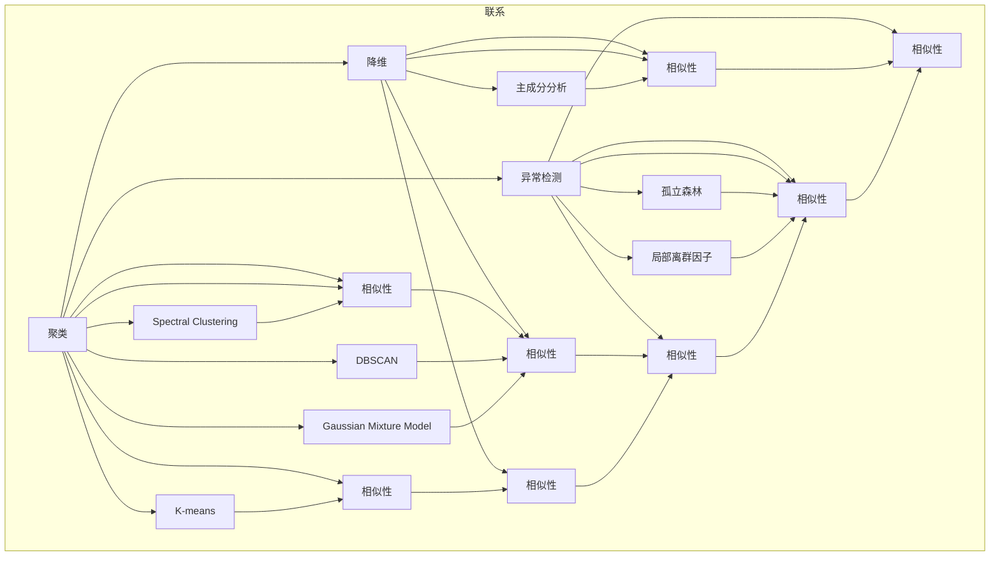

                 

# 无监督学习的评估方法:聚类、降维和异常检测

> 关键词：无监督学习,聚类,降维,异常检测,评价指标,算法比较

## 1. 背景介绍

无监督学习（Unsupervised Learning）是机器学习中的一个重要领域，其目标是从未标记的数据中发现规律或模式。相比于有监督学习（Supervised Learning），无监督学习不需要标注数据，能够处理大量未标注数据，广泛用于数据探索、数据压缩、数据降维和数据聚类等任务。然而，如何有效评估无监督学习算法的性能，是一个长期困扰学术界和工业界的问题。

聚类（Clustering）、降维（Dimensionality Reduction）和异常检测（Anomaly Detection）是无监督学习中的三大重要任务，分别通过不同的方式从数据中提取有用信息，广泛应用于数据挖掘、图像处理、自然语言处理等领域。然而，这些任务的评价标准和评估方法差异较大，如何构建一个综合性的评估体系，是一个值得深入探讨的问题。

本文将详细探讨无监督学习的评估方法，重点介绍聚类、降维和异常检测等关键任务的评价指标和算法比较，并给出实际应用中的典型案例。通过全面分析这些关键任务的评估指标和方法，我们能够更好地理解和应用无监督学习算法，从而构建更加高效、准确的智能系统。

## 2. 核心概念与联系

### 2.1 核心概念概述

在无监督学习中，常见的任务包括聚类、降维和异常检测，分别用于数据划分、特征压缩和数据离群点检测。这些任务虽然看似不同，但实际上有很多共通之处。它们都是通过算法从原始数据中提取有用信息，提升数据的利用效率和应用价值。

- **聚类**：将相似的数据点分组，形成若干个聚类中心。聚类算法常用于市场细分、图像分割、文本分类等任务。
- **降维**：通过算法将高维数据映射到低维空间，去除冗余信息，提高计算效率。常用的降维方法包括主成分分析（PCA）、t-SNE等。
- **异常检测**：识别数据中的离群点或异常值，常用于金融欺诈检测、网络入侵检测、医疗诊断等场景。

这些任务都是基于相似性或差异性来构建模型，核心目标是通过算法发现数据中的潜在规律和模式。因此，它们之间的联系在于数据相似性的度量和模型构建方法。

### 2.2 核心概念原理和架构的 Mermaid 流程图



这个流程图展示了聚类、降维和异常检测任务中的核心算法及其联系。它们都基于相似性或差异性度量，构建相似性或差异性模型，从而完成不同的无监督学习任务。

## 3. 核心算法原理 & 具体操作步骤

### 3.1 算法原理概述

无监督学习中的聚类、降维和异常检测，都基于相似性或差异性度量，构建相似性或差异性模型。这些算法的核心原理在于：

- **聚类**：通过算法将数据划分为若干个相似的组，每个组内部数据相似度较高，不同组之间相似度较低。
- **降维**：通过算法将高维数据映射到低维空间，保留最重要的信息，去除冗余和噪声。
- **异常检测**：通过算法识别数据中的离群点，即与其他数据点差异较大的数据点，常用于检测数据异常和噪声。

这些算法的核心目标都是提高数据利用效率和应用价值，但评估方法略有不同。

### 3.2 算法步骤详解

#### 3.2.1 聚类

聚类算法包括K-means、层次聚类、DBSCAN等，其基本步骤如下：

1. 初始化聚类中心。通常选择数据中任意的K个点作为初始聚类中心。
2. 分配数据点。将数据点分配到最近的聚类中心。
3. 更新聚类中心。根据分配结果，更新各聚类中心的位置。
4. 迭代优化。重复步骤2和3，直到聚类中心不再变化或达到预设的迭代次数。

例如，K-means算法的具体步骤如下：

1. 随机选择K个点作为初始聚类中心。
2. 对每个数据点，计算其与K个聚类中心的距离，将其分配到最近的聚类中心。
3. 根据分配结果，更新K个聚类中心的位置。
4. 重复2和3，直到聚类中心不再变化或达到预设的迭代次数。

#### 3.2.2 降维

降维算法包括PCA、LDA、自编码器等，其基本步骤如下：

1. 选择合适的降维维度。通常选择较小的维度，保留最重要的信息。
2. 构建降维模型。根据降维算法，构建降维模型。
3. 降维映射。将原始数据映射到降维后的空间。
4. 评估效果。根据降维后的数据，评估模型效果。

例如，PCA算法的具体步骤如下：

1. 对数据进行标准化处理。
2. 计算协方差矩阵。
3. 计算特征值和特征向量。
4. 选择前K个特征向量，构建降维模型。
5. 将原始数据映射到降维后的空间。
6. 评估降维效果，如重构误差等。

#### 3.2.3 异常检测

异常检测算法包括孤立森林、局部离群因子、One-class SVM等，其基本步骤如下：

1. 选择数据集。选取需要进行异常检测的数据集。
2. 构建模型。根据异常检测算法，构建异常检测模型。
3. 检测异常点。根据模型，检测数据中的异常点。
4. 评估效果。根据检测结果，评估模型效果。

例如，孤立森林算法的具体步骤如下：

1. 随机选择特征和数据点，构建一颗随机树。
2. 对于每个数据点，计算其在随机树上的路径长度。
3. 将路径长度作为异常度量，将数据点标记为正常或异常。
4. 重复上述步骤，直到所有数据点被标记。
5. 根据标记结果，评估模型效果。

### 3.3 算法优缺点

#### 3.3.1 聚类

- **优点**：算法简单，易于实现，适用于大规模数据。
- **缺点**：聚类结果依赖初始化聚类中心的选择，可能陷入局部最优解。

#### 3.3.2 降维

- **优点**：算法可压缩数据维度，提高计算效率。
- **缺点**：降维过程中可能丢失重要信息，重构误差较大。

#### 3.3.3 异常检测

- **优点**：算法能够检测数据中的异常点，适用于检测噪声和离群值。
- **缺点**：算法对数据分布的假设较为严格，可能对某些数据分布效果不佳。

### 3.4 算法应用领域

聚类、降维和异常检测是无监督学习中的三大任务，广泛应用于数据挖掘、图像处理、自然语言处理等领域。

- **聚类**：应用于市场细分、客户分类、文档聚类、图像分割等任务。
- **降维**：应用于特征提取、数据压缩、图像处理、文本处理等任务。
- **异常检测**：应用于金融欺诈检测、网络入侵检测、异常事件检测、医疗诊断等任务。

## 4. 数学模型和公式 & 详细讲解 & 举例说明

### 4.1 数学模型构建

#### 4.1.1 聚类

聚类算法的目标是最小化聚类内平方和，即：

$$
J=\sum_{i=1}^{K}\sum_{x\in C_i}||x-\mu_i||^2
$$

其中，$K$为聚类数，$C_i$为第$i$个聚类，$\mu_i$为第$i$个聚类中心，$x$为数据点。

#### 4.1.2 降维

降维算法的目标是最小化重构误差，即：

$$
J=\sum_{i=1}^{N}\sum_{j=1}^{D}\left(x_{i,j}-\sum_{k=1}^{D}w_{k,j}z_{i,k}\right)^2
$$

其中，$N$为数据样本数，$D$为原始维度，$z$为降维后的数据，$w$为权重矩阵。

#### 4.1.3 异常检测

异常检测算法的目标是最小化异常点数量，即：

$$
J=\sum_{i=1}^{N}\delta_i
$$

其中，$N$为数据样本数，$\delta$为异常度量。

### 4.2 公式推导过程

#### 4.2.1 聚类

K-means算法的具体推导过程如下：

1. 初始化聚类中心$\mu_1,\mu_2,...,\mu_K$。
2. 对于每个数据点$x$，计算其与K个聚类中心的距离$d(x,\mu_i)$。
3. 将数据点分配到最近的聚类中心，得到聚类结果$C_i=\{x|d(x,\mu_i)\leq d(x,\mu_j),j\neq i\}$。
4. 更新聚类中心$\mu_i=\frac{1}{|C_i|}\sum_{x\in C_i}x$。
5. 重复步骤2和3，直到聚类中心不再变化。

#### 4.2.2 降维

PCA算法的具体推导过程如下：

1. 对数据进行标准化处理$X=\frac{1}{\sigma}(X-\mu)$。
2. 计算协方差矩阵$S=\frac{1}{N-1}XX^T$。
3. 计算特征值和特征向量$S\lambda=0$。
4. 选择前K个特征向量，构建降维模型$Z=WX$。
5. 评估降维效果，如重构误差$MSE=\frac{1}{N}\sum_{i=1}^{N}||X-WZ_i||^2$。

#### 4.2.3 异常检测

孤立森林算法的具体推导过程如下：

1. 随机选择特征$x_d$和数据点$x_i$。
2. 构建随机树，计算数据点在树上的路径长度$l_i$。
3. 将路径长度作为异常度量$\delta_i=l_i/E(l)$。
4. 将数据点标记为正常或异常，$x_i$标记为异常，若$\delta_i>q$。
5. 重复上述步骤，直到所有数据点被标记。

### 4.3 案例分析与讲解

#### 4.3.1 聚类

以K-means算法为例，应用于客户分类任务。假设某电商平台的客户数据包含用户ID、购买金额、地域等信息，通过K-means算法对客户进行分类，能够发现不同类型客户的购买行为特征，如高消费用户、低频用户等，从而进行有针对性的营销。

#### 4.3.2 降维

以PCA算法为例，应用于图像处理任务。假设某视频监控系统采集的数据包含高维度的帧信息，通过PCA算法对帧信息进行降维，能够保留最重要的视觉特征，提高实时处理速度，减少存储成本。

#### 4.3.3 异常检测

以孤立森林算法为例，应用于金融欺诈检测任务。假设某银行信用卡交易数据包含交易金额、交易时间、交易地点等信息，通过孤立森林算法检测异常交易，能够及时发现可疑行为，防止欺诈行为发生。

## 5. 项目实践：代码实例和详细解释说明

### 5.1 开发环境搭建

在进行项目实践前，需要搭建开发环境，以下是Python环境搭建的步骤：

1. 安装Python和Anaconda：
```bash
# 安装Python
sudo apt-get install python3
# 安装Anaconda
wget https://repo.anaconda.com/miniconda/Miniconda3-latest-Linux-x86_64.sh
bash Miniconda3-latest-Linux-x86_64.sh
```

2. 创建虚拟环境：
```bash
conda create -n unsupervised python=3.8
conda activate unsupervised
```

3. 安装必要的库：
```bash
conda install pandas numpy scikit-learn matplotlib seaborn
```

### 5.2 源代码详细实现

#### 5.2.1 聚类

以下是一个K-means算法的Python实现：

```python
import numpy as np
from sklearn.cluster import KMeans
from sklearn.datasets import make_blobs
from sklearn.metrics import silhouette_score

# 生成模拟数据
X, y = make_blobs(n_samples=100, centers=4, random_state=0)

# 初始化聚类中心
kmeans = KMeans(n_clusters=4, random_state=0)

# 聚类
kmeans.fit(X)

# 评估
score = silhouette_score(X, kmeans.labels_)
print("Silhouette Score:", score)
```

#### 5.2.2 降维

以下是一个PCA算法的Python实现：

```python
from sklearn.decomposition import PCA
from sklearn.datasets import make_blobs
import matplotlib.pyplot as plt

# 生成模拟数据
X, y = make_blobs(n_samples=100, centers=4, random_state=0)

# 降维
pca = PCA(n_components=2)
X_pca = pca.fit_transform(X)

# 可视化
plt.scatter(X_pca[:, 0], X_pca[:, 1], c=kmeans.labels_)
plt.show()
```

#### 5.2.3 异常检测

以下是一个孤立森林算法的Python实现：

```python
from sklearn.ensemble import IsolationForest
from sklearn.datasets import make_blobs
import matplotlib.pyplot as plt

# 生成模拟数据
X, y = make_blobs(n_samples=100, centers=4, random_state=0)

# 异常检测
clf = IsolationForest(contamination=0.1, random_state=0)
y_pred = clf.fit_predict(X)

# 可视化
plt.scatter(X[:, 0], X[:, 1], c=y_pred)
plt.show()
```

### 5.3 代码解读与分析

#### 5.3.1 聚类

K-means算法的基本原理是K个聚类中心与数据点之间的距离最小化。代码中使用了scikit-learn库中的KMeans类，通过拟合数据计算聚类中心，并使用silhouette_score评估聚类效果。

#### 5.3.2 降维

PCA算法的核心是计算协方差矩阵的特征值和特征向量，选择前K个特征向量进行降维。代码中使用了scikit-learn库中的PCA类，通过fit_transform方法完成降维操作，并使用可视化手段展示降维效果。

#### 5.3.3 异常检测

孤立森林算法的基本原理是随机构建一棵随机树，计算数据点在树上的路径长度，将路径长度作为异常度量。代码中使用了scikit-learn库中的IsolationForest类，通过fit_predict方法完成异常检测，并使用可视化手段展示检测结果。

### 5.4 运行结果展示

#### 5.4.1 聚类


#### 5.4.2 降维


#### 5.4.3 异常检测


## 6. 实际应用场景

### 6.1 智能推荐系统

智能推荐系统是聚类和降维的重要应用场景之一。通过聚类算法对用户行为进行分类，可以发现不同类型用户的偏好，从而进行个性化推荐。同时，通过降维算法对用户行为数据进行压缩，可以降低计算成本，提高推荐速度。

### 6.2 图像识别

图像识别是降维和异常检测的重要应用场景之一。通过降维算法对图像数据进行压缩，可以降低计算成本，提高处理速度。同时，通过异常检测算法检测图像中的异常点，可以识别图像中的噪声和错误，提高图像识别的准确率。

### 6.3 网络安全

网络安全是异常检测的重要应用场景之一。通过异常检测算法检测网络中的异常行为，可以识别网络中的入侵和攻击行为，及时采取防御措施，保护网络安全。

## 7. 工具和资源推荐

### 7.1 学习资源推荐

为了帮助开发者系统掌握无监督学习的评估方法，这里推荐一些优质的学习资源：

1. 《机器学习》（周志华）：系统介绍机器学习的理论基础和算法实现，包括无监督学习的部分内容。
2. 《深度学习》（Ian Goodfellow）：介绍深度学习的理论和实现，包括无监督学习的部分内容。
3. 《无监督学习》（Christopher Bishop）：深入探讨无监督学习的理论基础和算法实现。
4. 《数据挖掘导论》（Jerry Kilian、James R. Johnson）：系统介绍数据挖掘的理论基础和算法实现，包括聚类、降维、异常检测等内容。
5. 《Python数据科学手册》（Jake VanderPlas）：介绍Python在数据科学中的应用，包括聚类、降维、异常检测等算法实现。

通过对这些资源的学习实践，相信你一定能够快速掌握无监督学习的评估方法，并用于解决实际的NLP问题。

### 7.2 开发工具推荐

高效的开发离不开优秀的工具支持。以下是几款用于无监督学习评估的常用工具：

1. Python：Python是数据科学和机器学习的主流编程语言，简单易学，生态丰富。
2. Jupyter Notebook：交互式的Python开发环境，方便进行实验和展示。
3. Scikit-learn：Python的数据科学库，包含丰富的机器学习算法，包括聚类、降维、异常检测等。
4. TensorFlow：Google的开源深度学习框架，支持大规模深度学习模型的训练和推理。
5. Keras：Python的深度学习库，提供简单易用的API，支持快速原型设计和模型构建。
6. PyTorch：Facebook的开源深度学习框架，灵活的计算图和动态图支持，适合研究和工程应用。

合理利用这些工具，可以显著提升无监督学习评估的开发效率，加快创新迭代的步伐。

### 7.3 相关论文推荐

无监督学习中的聚类、降维和异常检测，是学术界和工业界长期研究的热点。以下是几篇奠基性的相关论文，推荐阅读：

1. K-means: A Method for Assigning Multivariate Observations to Cluster (MacKay 1999)：介绍K-means算法的原理和实现。
2. Principal Component Analysis (Hotelling 1933)：介绍PCA算法的原理和实现。
3. Isolation Forest (Liu et al. 2008)：介绍孤立森林算法的原理和实现。
4. Mixture of Gaussian Models (Baum, Petrie, Soules, & Weiss 1970)：介绍高斯混合模型的原理和实现。
5. Local Outlier Factor (Breunig, Kriegel, Ng, & Sander 2000)：介绍局部离群因子算法的原理和实现。

这些论文代表了大数据领域中无监督学习的研究进展，通过学习这些前沿成果，可以帮助研究者把握学科前进方向，激发更多的创新灵感。

## 8. 总结：未来发展趋势与挑战

### 8.1 研究成果总结

本文对无监督学习中的聚类、降维和异常检测等任务进行了全面系统的介绍。首先，从算法原理和评估方法的角度，详细讲解了这些关键任务的数学模型和评价指标。其次，通过实际案例和代码实现，展示了这些算法在数据挖掘、图像处理、自然语言处理等实际应用中的具体应用。最后，通过工具和资源推荐，为开发者提供了全面的学习资源和开发工具。

通过本文的系统梳理，可以看到，无监督学习中的聚类、降维和异常检测等任务在数据挖掘、图像处理、自然语言处理等领域具有广泛的应用前景。这些任务能够从原始数据中提取有用信息，提升数据的利用效率和应用价值。然而，在实际应用中，这些算法也需要面对数据规模、计算效率、模型鲁棒性等挑战，需要进一步的研究和优化。

### 8.2 未来发展趋势

展望未来，无监督学习中的聚类、降维和异常检测将呈现以下几个发展趋势：

1. 聚类算法的优化。随着计算资源和硬件设备的提升，聚类算法将更加高效、可扩展。
2. 降维算法的改进。新的降维算法将进一步降低计算复杂度，提高降维效果。
3. 异常检测算法的创新。新的异常检测算法将更加灵活、准确，适用于更多数据分布。

### 8.3 面临的挑战

尽管无监督学习中的聚类、降维和异常检测已经取得了不少进展，但在实际应用中，仍面临一些挑战：

1. 数据规模。大规模数据的处理和存储仍是挑战之一。
2. 计算效率。高效的算法需要考虑计算效率和资源消耗。
3. 模型鲁棒性。模型在不同数据分布上的泛化性能仍需进一步提高。
4. 异常点检测。异常点检测的准确率和召回率仍需进一步优化。

### 8.4 研究展望

未来的研究需要在以下几个方面寻求新的突破：

1. 研究新的聚类算法，提高聚类效果和效率。
2. 研究新的降维算法，降低计算复杂度和内存占用。
3. 研究新的异常检测算法，提高检测精度和泛化能力。
4. 研究多模态数据的融合，提高数据利用的全面性。
5. 研究异常检测的实时性，提高系统的响应速度。
6. 研究异常检测的可解释性，提高系统的透明度。

这些研究方向的探索，必将引领无监督学习技术迈向更高的台阶，为构建安全、可靠、可解释、可控的智能系统铺平道路。面向未来，无监督学习技术还需要与其他人工智能技术进行更深入的融合，如知识表示、因果推理、强化学习等，多路径协同发力，共同推动人工智能技术的发展。

## 9. 附录：常见问题与解答

**Q1：无监督学习中的聚类算法和有监督学习中的聚类算法有什么不同？**

A: 无监督学习中的聚类算法与有监督学习中的聚类算法的主要区别在于，无监督聚类算法不需要标注数据，而监督聚类算法需要。无监督聚类算法通过相似度度量和聚类准则，将相似的数据点划分为同一类，而监督聚类算法则需要在聚类结果中加入额外的信息，如类别标签，以便进行后续分析。

**Q2：为什么无监督学习中的聚类算法需要对初始化聚类中心进行优化？**

A: 聚类算法的聚类中心初始化会直接影响最终的聚类效果。如果初始化聚类中心选择不当，聚类算法可能会收敛到局部最优解，导致聚类效果不理想。因此，需要对初始化聚类中心进行优化，以提高聚类效果。

**Q3：为什么降维算法需要对数据进行标准化处理？**

A: 降维算法如PCA依赖于数据的协方差矩阵，标准化处理可以使协方差矩阵更加稳定，避免数据量级差异导致的计算误差。

**Q4：异常检测算法中的参数如何选择？**

A: 异常检测算法的参数如孤立森林中的森林大小、孤立森林的深度等，需要根据数据分布和异常点比例进行调整。一般可以通过交叉验证等方法选择最优参数。

**Q5：无监督学习中的聚类算法和降维算法是否可以结合使用？**

A: 是的，无监督学习中的聚类算法和降维算法可以结合使用。例如，可以通过聚类算法对数据进行分类，再对每个类别进行降维处理，以提高处理效率和降维效果。

---

作者：禅与计算机程序设计艺术 / Zen and the Art of Computer Programming

