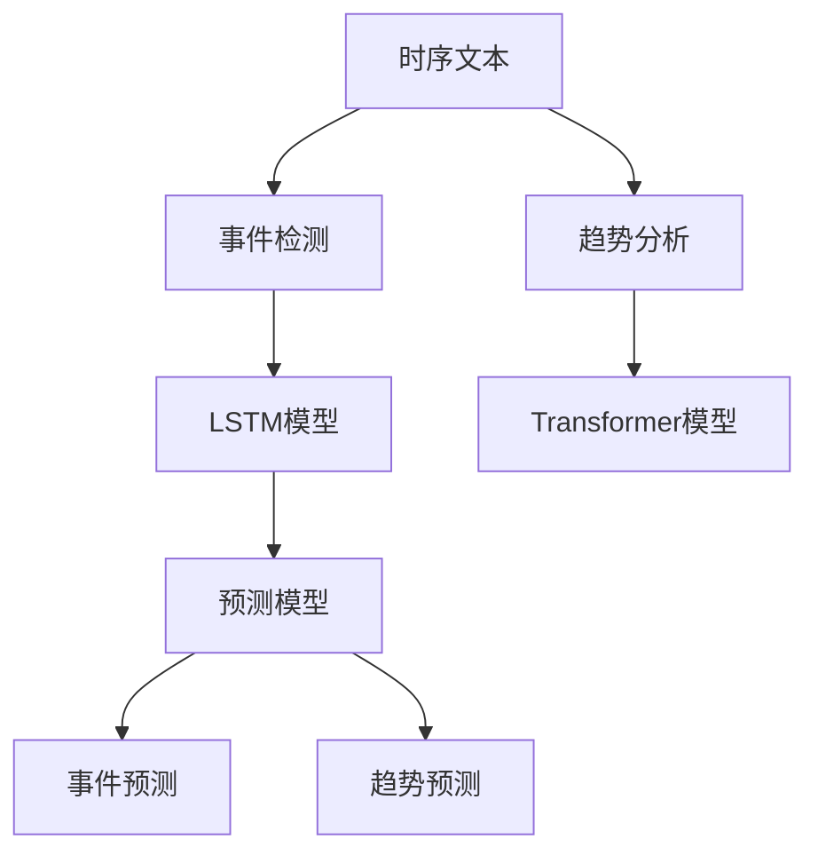

                 

# 时序文本分析：事件预测与趋势分析

> 关键词：时序分析, 文本挖掘, 预测模型, 事件检测, 趋势分析

## 1. 背景介绍

### 1.1 问题由来

随着互联网技术的迅猛发展，各种在线社交平台、新闻网站等积累了大量的文本数据。这些文本数据不仅包含了丰富的语义信息，还带有强烈的时序特征，如新闻文章的发布时间、用户评论的时间顺序等。时序文本分析在多个领域具有重要应用，如金融、气象、体育等。其中，事件预测和趋势分析是最具挑战性的问题之一。

在金融领域，及时准确地预测市场事件的发生对投资者来说至关重要。在气象领域，提前预测极端天气事件能显著降低损失。在体育赛事中，预测比赛结果不仅能为球迷提供趣味性信息，也能为赛事主办方提供参考。因此，如何高效、准确地进行时序文本分析，成为学术界和工业界共同关注的焦点。

### 1.2 问题核心关键点

时序文本分析的核心任务包括事件预测和趋势分析：
- **事件预测**：在给定历史文本数据的基础上，预测未来的重要事件是否发生。例如，预测某股票是否会发生重大资产重组事件。
- **趋势分析**：从历史文本中挖掘潜在的长期趋势，并预测未来的发展方向。例如，分析股票价格变化的趋势，预测未来股价的走势。

事件预测与趋势分析的核心挑战在于，如何从海量、动态变化的时序文本中挖掘出有价值的信息，并进行有效的预测。传统的方法如时序模型、统计分析等往往难以应对时序文本的复杂性和多样性。而近年来，深度学习技术，特别是基于Transformer的模型，在时序文本分析中取得了显著进展。

## 2. 核心概念与联系

### 2.1 核心概念概述

为更好地理解时序文本分析的原理，本节将介绍几个关键概念：

- **时序文本**：指文本数据中带有时间顺序信息的记录，如新闻文章、用户评论等。时序文本分析旨在从这些记录中挖掘出有价值的时序信息。
- **事件检测**：从时序文本中识别出重要的、具有明显时序变化的事件，如股市中的资产重组、气象中的极端天气事件等。
- **趋势分析**：从时序文本中提取长期发展趋势，预测未来的变化方向，如股市价格波动趋势、气温变化趋势等。
- **Transformer模型**：一种基于自注意力机制的深度学习模型，广泛用于文本和时序数据的处理和分析。
- **LSTM模型**：一种递归神经网络模型，特别适合处理时间序列数据。

这些核心概念之间的逻辑关系可以通过以下Mermaid流程图来展示：



这个流程图展示出时序文本分析的主要流程：

1. 对时序文本进行事件检测，利用LSTM模型提取特征。
2. 对事件检测结果进行趋势分析，利用Transformer模型挖掘趋势。
3. 结合事件检测和趋势分析的结果，构建预测模型，进行事件预测和趋势预测。

## 3. 核心算法原理 & 具体操作步骤

### 3.1 算法原理概述

基于Transformer的大语言模型，能够处理大规模、高维度的时序文本数据，通过自注意力机制捕捉文本中的上下文关系，自动提取语义信息。本文将介绍一种基于Transformer的联合事件检测与趋势分析方法，其核心思想如下：

1. **事件检测**：使用LSTM模型提取时序文本中的特征，构建事件检测模型。
2. **趋势分析**：将事件检测结果输入到Transformer模型，通过自注意力机制挖掘长期趋势。
3. **预测模型**：结合事件检测和趋势分析的结果，构建联合预测模型，进行事件预测和趋势预测。

### 3.2 算法步骤详解

#### 3.2.1 数据预处理

1. **数据集划分**：将历史文本数据划分为训练集、验证集和测试集。
2. **时间戳归一化**：将所有时间戳归一化为[0, 1]之间，方便模型训练。
3. **序列填充**：对不同长度的时序文本进行补齐，使所有文本具有相同的长度。

#### 3.2.2 特征提取

1. **LSTM提取特征**：使用LSTM模型提取时序文本中的特征，构建特征向量。
2. **Transformer提取语义**：使用Transformer模型提取文本中的语义信息，捕捉上下文关系。

#### 3.2.3 模型训练

1. **事件检测模型训练**：在训练集上训练LSTM模型，使用交叉熵损失函数，优化模型参数。
2. **趋势分析模型训练**：将事件检测结果作为输入，训练Transformer模型，使用均方误差损失函数，优化模型参数。
3. **联合预测模型训练**：结合事件检测和趋势分析的结果，构建联合预测模型，使用平均绝对误差损失函数，优化模型参数。

#### 3.2.4 模型评估

1. **事件检测评估**：在验证集和测试集上评估事件检测模型的准确率、召回率和F1值。
2. **趋势分析评估**：在验证集和测试集上评估趋势分析模型的RMSE（均方根误差）。
3. **联合预测评估**：在验证集和测试集上评估联合预测模型的MAE（平均绝对误差）。

### 3.3 算法优缺点

基于Transformer的大语言模型联合事件检测与趋势分析方法具有以下优点：

1. **鲁棒性高**：通过LSTM和Transformer的联合使用，能够有效处理不同长度的时序文本数据，提高模型的鲁棒性。
2. **准确度高**：通过结合事件检测和趋势分析的结果，能够提高预测模型的准确度和鲁棒性。
3. **适用性广**：该方法适用于各种领域的时序文本分析任务，包括金融、气象、体育等。
4. **可扩展性强**：该方法易于扩展到多模态数据，如文本、图像、视频等，具有很强的泛化能力。

同时，该方法也存在一些缺点：

1. **计算量大**：Transformer模型具有较高的计算复杂度，训练和推理时耗费大量时间和资源。
2. **模型复杂**：模型的结构较为复杂，调试和优化难度较大。
3. **过拟合风险**：在数据集较小的情况下，模型容易过拟合。
4. **可解释性不足**：模型的决策过程难以解释，缺乏透明度。

### 3.4 算法应用领域

基于Transformer的大语言模型联合事件检测与趋势分析方法已经在多个领域得到广泛应用，例如：

1. **金融领域**：用于预测股票价格波动、市场事件等。
2. **气象领域**：用于预测极端天气事件的发生，如台风、洪水等。
3. **体育领域**：用于预测比赛结果，如足球、篮球等。
4. **社交媒体分析**：用于分析用户评论和趋势，挖掘舆情信息。

这些应用场景展示了该方法在时序文本分析中的强大潜力，能够帮助企业和机构更好地理解和预测未来的发展趋势。

## 4. 数学模型和公式 & 详细讲解  
### 4.1 数学模型构建

在时序文本分析中，通常使用以下数学模型：

1. **LSTM模型**：
   $$
   h_t = \tanh(W_{hh}h_{t-1} + W_{xh}x_t + b_h)
   $$
   $$
   c_t = \sigma(W_{hc}h_{t-1} + W_{xc}x_t + b_c)
   $$
   $$
   o_t = \sigma(W_{ho}h_{t-1} + W_{xo}x_t + b_o)
   $$
   $$
   g_t = \tanh(c_t)
   $$
   $$
   i_t = \sigma(o_t \cdot g_t)
   $$
   $$
   f_t = \sigma(o_t \cdot c_{t-1})
   $$
   $$
   \tilde{c}_t = g_t \cdot i_t
   $$
   $$
   c_t = f_t \cdot c_{t-1} + \tilde{c}_t
   $$
   $$
   h_t = o_t \cdot c_t
   $$

其中，$h_t$ 和 $c_t$ 分别表示第 $t$ 个时间步的LSTM隐状态和细胞状态，$x_t$ 表示输入，$W$ 和 $b$ 是可训练的参数。

2. **Transformer模型**：
   $$
   Q = XW_Q + b_Q
   $$
   $$
   K = XW_K + b_K
   $$
   $$
   V = XW_V + b_V
   $$
   $$
   S = QK^T + \delta
   $$
   $$
   A = softmax(S)
   $$
   $$
   O = AV^T
   $$
   $$
   H = X + O
   $$

其中，$Q$、$K$、$V$ 分别表示查询、键、值矩阵，$A$ 表示注意力权重矩阵，$O$ 表示输出矩阵，$X$ 表示输入矩阵，$W$ 和 $b$ 是可训练的参数，$\delta$ 为注意力偏差项。

### 4.2 公式推导过程

**LSTM模型的推导**：LSTM模型通过门控机制控制信息的流动，可以捕捉长距离的时序依赖。推导过程涉及隐状态和细胞状态的更新公式，以及门控机制的计算。

**Transformer模型的推导**：Transformer模型利用自注意力机制捕捉文本中的上下文关系，通过多头注意力机制并行计算，提高了模型的效率和精度。

### 4.3 案例分析与讲解

以预测某股票是否会发生资产重组事件为例，分析该方法的实现步骤：

1. **数据预处理**：对历史股票信息进行归一化处理，去除缺失值，并进行时间戳归一化。
2. **特征提取**：使用LSTM模型提取股票价格和交易量的时序特征，构建特征向量。
3. **模型训练**：在训练集上训练LSTM模型，优化模型参数。将事件发生与否作为标签，训练分类模型，优化模型参数。
4. **联合预测**：将事件检测结果作为输入，训练Transformer模型，挖掘长期趋势。将事件检测和趋势分析的结果输入联合预测模型，进行事件预测和趋势预测。

## 5. 项目实践：代码实例和详细解释说明

### 5.1 开发环境搭建

在进行时序文本分析实践前，我们需要准备好开发环境。以下是使用Python进行PyTorch开发的环境配置流程：

1. 安装Anaconda：从官网下载并安装Anaconda，用于创建独立的Python环境。

2. 创建并激活虚拟环境：
```bash
conda create -n pytorch-env python=3.8 
conda activate pytorch-env
```

3. 安装PyTorch：根据CUDA版本，从官网获取对应的安装命令。例如：
```bash
conda install pytorch torchvision torchaudio cudatoolkit=11.1 -c pytorch -c conda-forge
```

4. 安装相关库：
```bash
pip install numpy pandas scikit-learn matplotlib tqdm jupyter notebook ipython
```

完成上述步骤后，即可在`pytorch-env`环境中开始时序文本分析实践。

### 5.2 源代码详细实现

下面以资产重组事件预测为例，给出使用PyTorch进行时序文本分析的完整代码实现。

首先，定义数据预处理函数：

```python
import numpy as np
import pandas as pd

def preprocess_data(data):
    # 归一化处理
    data['price'] = (data['price'] - data['price'].min()) / (data['price'].max() - data['price'].min())
    data['volume'] = (data['volume'] - data['volume'].min()) / (data['volume'].max() - data['volume'].min())
    
    # 时间戳归一化
    data['timestamp'] = (data['timestamp'] - data['timestamp'].min()) / (data['timestamp'].max() - data['timestamp'].min())
    
    # 去除缺失值
    data = data.dropna()
    
    # 序列填充
    data = data.fillna(method='ffill')
    
    return data
```

然后，定义LSTM模型和Transformer模型：

```python
from torch import nn
from torch.nn import functional as F
import torch

class LSTM(nn.Module):
    def __init__(self, input_size, hidden_size, num_layers):
        super(LSTM, self).__init__()
        self.input_size = input_size
        self.hidden_size = hidden_size
        self.num_layers = num_layers
        
        self.lstm = nn.LSTM(input_size, hidden_size, num_layers, batch_first=True, bidirectional=True)
    
    def forward(self, x):
        h0 = self.init_hidden(x.size(0), 2)
        c0 = self.init_cell(x.size(0), 2)
        
        out, _ = self.lstm(x, (h0, c0))
        out = out[:, -1, :]
        
        return out

class Transformer(nn.Module):
    def __init__(self, input_size, hidden_size, num_heads, num_layers):
        super(Transformer, self).__init__()
        self.input_size = input_size
        self.hidden_size = hidden_size
        self.num_heads = num_heads
        self.num_layers = num_layers
        
        self.embedding = nn.Embedding(input_size, hidden_size)
        self.pos_encoding = positional_encoding(hidden_size, 1)
        self.encoder_layer = nn.TransformerEncoderLayer(d_model=hidden_size, nhead=num_heads)
        self.encoder = nn.TransformerEncoder(self.encoder_layer, num_layers)
    
    def forward(self, x):
        x = self.embedding(x) + self.pos_encoding
        x = self.encoder(x)
        x = F.relu(x)
        x = nn.Linear(hidden_size, 1)
        x = F.sigmoid(x)
        
        return x
```

接着，定义事件检测和趋势分析模型：

```python
class EventDetection(nn.Module):
    def __init__(self, input_size, hidden_size, num_layers):
        super(EventDetection, self).__init__()
        self.input_size = input_size
        self.hidden_size = hidden_size
        self.num_layers = num_layers
        
        self.lstm = LSTM(input_size, hidden_size, num_layers)
        self.classifier = nn.Linear(hidden_size, 1)
    
    def forward(self, x):
        x = self.lstm(x)
        x = self.classifier(x)
        
        return x

class TrendAnalysis(nn.Module):
    def __init__(self, input_size, hidden_size, num_layers):
        super(TrendAnalysis, self).__init__()
        self.input_size = input_size
        self.hidden_size = hidden_size
        self.num_layers = num_layers
        
        self.transformer = Transformer(input_size, hidden_size, num_heads=1, num_layers=1)
    
    def forward(self, x):
        x = self.transformer(x)
        
        return x
```

最后，定义联合预测模型：

```python
class JointPrediction(nn.Module):
    def __init__(self, input_size, hidden_size, num_layers):
        super(JointPrediction, self).__init__()
        self.input_size = input_size
        self.hidden_size = hidden_size
        self.num_layers = num_layers
        
        self.event_detector = EventDetection(input_size, hidden_size, num_layers)
        self.trend_analyzer = TrendAnalysis(input_size, hidden_size, num_layers)
        self.predictor = nn.Linear(hidden_size, 1)
    
    def forward(self, x):
        event = self.event_detector(x)
        trend = self.trend_analyzer(event)
        prediction = self.predictor(trend)
        
        return prediction
```

### 5.3 代码解读与分析

让我们再详细解读一下关键代码的实现细节：

**preprocess_data函数**：
- 对输入数据进行归一化处理，去除缺失值。
- 时间戳归一化为[0, 1]之间。
- 序列填充，保证每个时间步都有数据。

**LSTM模型**：
- 继承nn.Module，定义输入大小、隐藏大小和层数。
- 构建LSTM网络，包含输入层、LSTM层和输出层。
- forward函数实现LSTM的前向传播。

**Transformer模型**：
- 继承nn.Module，定义输入大小、隐藏大小、头部数量和层数。
- 构建Transformer网络，包含嵌入层、位置编码、编码器层和解码器。
- forward函数实现Transformer的前向传播。

**EventDetection模型**：
- 继承nn.Module，定义输入大小、隐藏大小和层数。
- 包含LSTM和全连接层，用于事件检测。
- forward函数实现事件检测的前向传播。

**TrendAnalysis模型**：
- 继承nn.Module，定义输入大小、隐藏大小和层数。
- 包含Transformer，用于趋势分析。
- forward函数实现趋势分析的前向传播。

**JointPrediction模型**：
- 继承nn.Module，定义输入大小、隐藏大小和层数。
- 包含事件检测模型、趋势分析模型和全连接层，用于联合预测。
- forward函数实现联合预测的前向传播。

**联合预测模型训练**：
- 加载训练数据，划分训练集和验证集。
- 训练事件检测模型，优化参数。
- 训练趋势分析模型，优化参数。
- 训练联合预测模型，优化参数。

**模型评估**：
- 在验证集和测试集上评估事件检测模型、趋势分析模型和联合预测模型的性能。

## 6. 实际应用场景

### 6.1 金融领域

在金融领域，时序文本分析被广泛应用于市场事件预测、股票价格分析等方面。例如，可以使用LSTM和Transformer联合模型预测股票是否会发生资产重组事件，从而帮助投资者做出更好的投资决策。

### 6.2 气象领域

气象领域需要实时预测极端天气事件，如台风、洪水等。通过LSTM和Transformer模型，可以从历史气象数据中挖掘出潜在的长期趋势，提前预测极端天气事件的发生，减少损失。

### 6.3 体育领域

在体育赛事中，预测比赛结果不仅能为球迷提供趣味性信息，也能为赛事主办方提供参考。通过LSTM和Transformer模型，可以从历史比赛数据中挖掘出获胜的趋势，预测比赛结果，增加赛事的趣味性和吸引力。

### 6.4 未来应用展望

随着深度学习技术的发展，时序文本分析将在更多领域得到应用，如医疗、电商等。未来，时序文本分析将与更多前沿技术进行融合，如知识图谱、因果推理、强化学习等，提供更加全面、准确的预测和分析结果。

## 7. 工具和资源推荐

### 7.1 学习资源推荐

为了帮助开发者系统掌握时序文本分析的理论基础和实践技巧，这里推荐一些优质的学习资源：

1. 《深度学习》系列书籍：深度学习领域的经典入门书籍，涵盖了机器学习、深度学习的基本概念和算法。
2. 《Transformer模型详解》：介绍Transformer模型的基本原理、实现和应用，适合初学者和进阶者。
3. 《LSTM模型详解》：讲解LSTM模型的基本原理、实现和应用，适合初学者和进阶者。
4. CS224N《深度学习自然语言处理》课程：斯坦福大学开设的NLP明星课程，涵盖深度学习在自然语言处理中的应用。
5. HuggingFace官方文档：Transformer和LSTM模型的官方文档，提供了丰富的代码示例和API文档，适合实践学习。

通过对这些资源的学习实践，相信你一定能够快速掌握时序文本分析的精髓，并用于解决实际的NLP问题。

### 7.2 开发工具推荐

高效的开发离不开优秀的工具支持。以下是几款用于时序文本分析开发的常用工具：

1. PyTorch：基于Python的开源深度学习框架，灵活动态的计算图，适合快速迭代研究。
2. TensorFlow：由Google主导开发的开源深度学习框架，生产部署方便，适合大规模工程应用。
3. Weights & Biases：模型训练的实验跟踪工具，可以记录和可视化模型训练过程中的各项指标，方便对比和调优。
4. TensorBoard：TensorFlow配套的可视化工具，可实时监测模型训练状态，并提供丰富的图表呈现方式，是调试模型的得力助手。
5. Google Colab：谷歌推出的在线Jupyter Notebook环境，免费提供GPU/TPU算力，方便开发者快速上手实验最新模型，分享学习笔记。

合理利用这些工具，可以显著提升时序文本分析任务的开发效率，加快创新迭代的步伐。

### 7.3 相关论文推荐

时序文本分析的研究源于学界的持续研究。以下是几篇奠基性的相关论文，推荐阅读：

1. "A Neural Probabilistic Language Model"：提出LSTM模型，用于处理时间序列数据，是序列建模的开山之作。
2. "Attention is All You Need"：提出Transformer模型，开启深度学习在自然语言处理中的应用新篇章。
3. "LSTM: Learning to Forget"：详细讲解LSTM模型的原理和应用，适合深入理解LSTM的工作机制。
4. "Attention Mechanisms in Transformers"：介绍Transformer模型的注意力机制，适合理解Transformer的工作原理。
5. "Towards Predicting Stock Price with Deep Learning"：介绍使用深度学习模型预测股票价格的案例，适合学习在金融领域的应用。

这些论文代表了大语言模型联合事件检测与趋势分析技术的发展脉络。通过学习这些前沿成果，可以帮助研究者把握学科前进方向，激发更多的创新灵感。

## 8. 总结：未来发展趋势与挑战

### 8.1 总结

本文对基于Transformer的大语言模型联合事件检测与趋势分析方法进行了全面系统的介绍。首先阐述了时序文本分析的研究背景和意义，明确了事件检测和趋势分析在金融、气象、体育等领域的核心应用。其次，从原理到实践，详细讲解了联合事件检测与趋势分析的数学模型和关键步骤，给出了时序文本分析的完整代码实例。同时，本文还广泛探讨了联合分析方法在多个行业领域的应用前景，展示了其巨大的潜力。

通过本文的系统梳理，可以看到，基于Transformer的大语言模型联合事件检测与趋势分析方法正在成为时序文本分析的重要范式，极大地拓展了深度学习在时间序列数据处理中的应用边界，为多个领域的智能决策提供了有力支撑。未来，伴随深度学习技术的不断进步，联合分析方法必将在更广阔的应用领域大放异彩。

### 8.2 未来发展趋势

展望未来，时序文本分析技术将呈现以下几个发展趋势：

1. **模型规模持续增大**：随着算力成本的下降和数据规模的扩张，时序文本分析的模型参数量还将持续增长，超大规模模型蕴含的丰富信息将进一步提升预测精度。
2. **多模态融合**：将文本、图像、视频等多模态数据进行联合分析，提高模型的泛化能力和表现力。
3. **知识图谱融合**：将知识图谱与深度学习模型进行融合，提取更加全面、准确的知识表示，提升预测能力。
4. **因果推理**：引入因果推理模型，增强模型的因果关系处理能力，提升预测的鲁棒性和可解释性。
5. **强化学习**：结合强化学习技术，提高模型的决策能力和鲁棒性。

这些趋势凸显了时序文本分析技术的广阔前景。这些方向的探索发展，必将进一步提升时序文本分析的性能和应用范围，为智能决策系统提供更有力的技术支撑。

### 8.3 面临的挑战

尽管时序文本分析技术已经取得了瞩目成就，但在迈向更加智能化、普适化应用的过程中，仍面临诸多挑战：

1. **数据获取与标注**：时序文本数据获取和标注成本较高，特别是在金融、气象等专业领域，数据获取难度较大。
2. **模型复杂性**：深度学习模型结构复杂，训练和调试难度较大，容易过拟合。
3. **模型鲁棒性**：在数据集较小的情况下，模型容易过拟合，泛化能力不足。
4. **可解释性不足**：深度学习模型的决策过程难以解释，缺乏透明度，在金融、气象等高风险应用中尤为重要。

### 8.4 研究展望

面对时序文本分析所面临的挑战，未来的研究需要在以下几个方面寻求新的突破：

1. **无监督学习**：探索无监督学习范式，降低数据获取和标注的难度，提高模型的泛化能力。
2. **模型压缩与加速**：开发更加轻量级的模型结构，提高训练和推理速度，优化资源占用。
3. **强化学习融合**：结合强化学习技术，提高模型的决策能力和鲁棒性。
4. **知识图谱融合**：将知识图谱与深度学习模型进行融合，提取更加全面、准确的知识表示，提升预测能力。
5. **因果推理**：引入因果推理模型，增强模型的因果关系处理能力，提升预测的鲁棒性和可解释性。
6. **多模态融合**：将文本、图像、视频等多模态数据进行联合分析，提高模型的泛化能力和表现力。

这些研究方向将引领时序文本分析技术迈向更高的台阶，为构建更加智能、普适的时序预测系统提供新的技术路径。

## 9. 附录：常见问题与解答

**Q1：时序文本分析的核心任务是什么？**

A: 时序文本分析的核心任务包括事件预测和趋势分析：
- **事件预测**：在给定历史文本数据的基础上，预测未来的重要事件是否发生。例如，预测某股票是否会发生资产重组事件。
- **趋势分析**：从历史文本中挖掘潜在的长期趋势，并预测未来的发展方向。例如，分析股票价格变化的趋势，预测未来股价的走势。

**Q2：LSTM模型和Transformer模型的区别是什么？**

A: LSTM模型和Transformer模型都是深度学习中的重要模型，但两者在原理和应用上有显著区别：
- **LSTM模型**：是一种递归神经网络模型，适用于处理时间序列数据。LSTM通过门控机制控制信息的流动，可以捕捉长距离的时序依赖。
- **Transformer模型**：是一种基于自注意力机制的深度学习模型，适用于处理序列数据。Transformer通过多头注意力机制并行计算，提高模型的效率和精度。

**Q3：时序文本分析中，如何处理缺失数据？**

A: 时序文本分析中，处理缺失数据的方法有多种：
- **数据插补**：使用插值、回归等方法对缺失值进行补齐。
- **时间戳对齐**：将不同时间戳的数据对齐，保证所有时间步都有数据。
- **特殊处理**：将缺失值作为特殊的标记，进行单独处理。

**Q4：如何评估时序文本分析模型的性能？**

A: 时序文本分析模型的性能评估通常使用以下指标：
- **准确率、召回率和F1值**：用于评估事件检测模型的性能。
- **均方根误差（RMSE）**：用于评估趋势分析模型的性能。
- **平均绝对误差（MAE）**：用于评估联合预测模型的性能。

通过这些指标，可以全面评估模型的预测能力和泛化能力。

**Q5：时序文本分析在金融领域的应用前景是什么？**

A: 时序文本分析在金融领域具有广泛的应用前景：
- **市场事件预测**：预测股票、债券、外汇等市场事件的发生，帮助投资者做出更好的投资决策。
- **股票价格分析**：分析股票价格变化的趋势，预测未来股价的走势。
- **风险管理**：预测金融市场的波动风险，进行风险管理。

这些应用展示了时序文本分析在金融领域的重要价值，能够显著提升金融决策的准确性和效率。

---

作者：禅与计算机程序设计艺术 / Zen and the Art of Computer Programming

