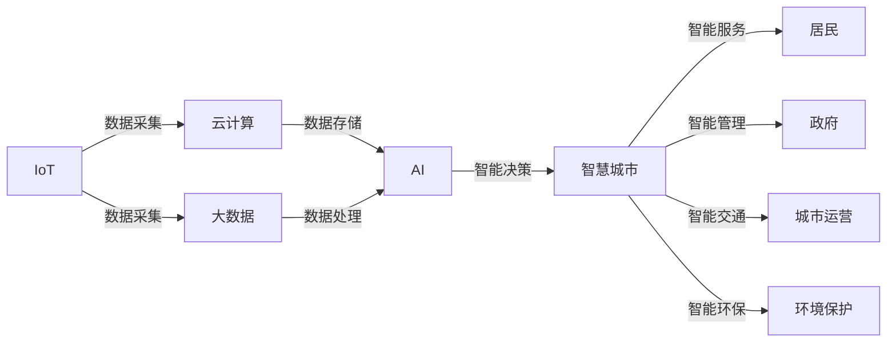

                 

# 智慧城市创业：打造未来宜居环境

在信息化和城市化飞速发展的今天，智慧城市建设已经成为全球许多国家和地区的重要发展战略。智慧城市不仅是城市基础设施和公共服务的数字化、网络化，更是一种全新的城市发展模式和生活方式。本文将探讨智慧城市创业的关键要素，包括核心概念、技术实现、实际应用以及未来趋势，以期为那些希望在这个领域创业的读者提供一些有益的见解和建议。

## 1. 背景介绍

### 1.1 智慧城市概述

智慧城市是指利用信息技术（如物联网、云计算、大数据、人工智能等），实现城市基础设施、公共服务和生活的智能化和优化，以提升城市管理效率、居民生活质量和经济发展水平。智慧城市的建设涉及城市规划、交通管理、环境保护、公共安全等多个领域，是一个复杂的系统工程。

### 1.2 智慧城市创业的兴起

智慧城市创业是指在智慧城市建设过程中，通过创新技术和商业模式，提供智能化的解决方案和服务，以提升城市运行效率和生活质量。近年来，随着人工智能、大数据、物联网等技术的不断发展，智慧城市创业逐渐成为热点，吸引了众多创业者、企业和国家政府的关注。

## 2. 核心概念与联系

### 2.1 核心概念概述

在探讨智慧城市创业的过程中，需要明确一些核心概念：

- **智慧城市（Smart City）**：利用现代信息技术和基础设施，对城市运行状态、资源和环境进行全面感知、监测、分析和优化，以实现城市智能化、科学化管理。
- **物联网（IoT）**：通过传感器、标签和移动设备等，将物理对象与互联网连接起来，实现信息的实时采集和传输。
- **云计算（Cloud Computing）**：通过网络将计算资源和存储资源集中管理，提供按需使用的服务，支持大数据处理和智能分析。
- **人工智能（AI）**：利用机器学习、深度学习等技术，使计算机具备类似于人类的学习和推理能力，以实现自动化决策和智能化服务。
- **大数据（Big Data）**：通过处理海量、多源异构的数据，发现隐藏在其中的知识、趋势和模式，为决策提供依据。

这些概念之间存在紧密联系，共同构成了智慧城市的技术基础和应用场景。

### 2.2 核心概念原理和架构的 Mermaid 流程图



## 3. 核心算法原理 & 具体操作步骤

### 3.1 算法原理概述

智慧城市创业的核心算法包括数据采集与处理、智能分析和决策、智能服务与互动等。以下将详细介绍这些算法的原理和实现步骤。

#### 3.1.1 数据采集与处理

数据采集是智慧城市建设的基础，涉及传感器、摄像头、RFID标签等多种数据源。数据处理则是对采集到的数据进行清洗、整合、分析和存储，以支撑后续的智能分析和决策。

#### 3.1.2 智能分析和决策

智能分析是通过算法和模型对收集到的数据进行处理，发现其中的规律、趋势和异常，以支持决策。决策则是在分析结果的基础上，做出最优化的选择和行动方案。

#### 3.1.3 智能服务与互动

智能服务是通过算法和模型，提供个性化的智能服务，如智能导航、智能安防、智能交通等。智能互动则是指通过人机交互界面，使居民能够方便地获取服务和参与管理。

### 3.2 算法步骤详解

#### 3.2.1 数据采集

1. **传感器部署**：在城市的关键节点部署传感器，如交通路口、公共场所、能源设施等，用于实时监测和采集数据。
2. **数据集成**：将来自不同来源的数据进行整合和清洗，去除噪声和冗余，形成统一的数据集。

#### 3.2.2 数据处理

1. **数据清洗**：去除不完整、重复、错误的数据，确保数据质量和一致性。
2. **数据存储**：采用云存储技术，将处理后的数据存储在云端，便于后续访问和分析。
3. **数据可视化**：通过图表、地图等形式，直观展示数据的分布和趋势。

#### 3.2.3 智能分析

1. **特征工程**：从原始数据中提取有用的特征，如交通流量、空气质量、能源消耗等。
2. **模型训练**：使用机器学习或深度学习模型，训练出预测和分类模型。
3. **模型评估**：使用评估指标（如准确率、召回率、F1值等），评估模型的性能，并进行调优。

#### 3.2.4 智能决策

1. **规则引擎**：定义一系列规则，根据实时数据和模型输出，做出最优决策。
2. **实时控制**：将决策结果转化为控制信号，实时调整城市基础设施和服务。

#### 3.2.5 智能服务与互动

1. **用户界面**：设计直观、易用的用户界面，方便居民使用智慧城市服务。
2. **数据反馈**：收集居民的使用反馈，不断优化服务和互动体验。

### 3.3 算法优缺点

#### 3.3.1 优点

1. **高效性**：通过算法自动化处理数据，提升城市管理的效率和响应速度。
2. **可扩展性**：采用模块化设计，支持动态扩展和升级，适应城市发展的变化。
3. **智能决策**：通过智能分析，实现更加科学、精准的决策。

#### 3.3.2 缺点

1. **数据隐私**：大量数据采集和处理可能侵犯用户隐私，需要严格的法律和伦理保障。
2. **数据质量**：数据采集和处理过程中存在噪声和缺失，影响模型的准确性。
3. **技术复杂度**：智慧城市建设涉及多种技术和算法，实现和维护复杂。

### 3.4 算法应用领域

智慧城市创业涵盖了多个领域，包括但不限于以下几类：

- **智能交通**：通过智能信号灯、智能导航等技术，优化交通流量，减少拥堵。
- **智能安防**：利用视频监控、人脸识别等技术，提升城市公共安全。
- **智能环保**：通过监测空气质量、水质等，优化城市环境。
- **智能医疗**：利用远程医疗、智能诊断等技术，提升医疗服务水平。
- **智能建筑**：通过智能照明、节能设备等，提升建筑能效。
- **智能教育**：通过在线教育、智能评估等技术，提升教育质量。

## 4. 数学模型和公式 & 详细讲解 & 举例说明

### 4.1 数学模型构建

智慧城市创业中的数学模型主要涉及数据处理、智能分析和决策。以下将通过一些典型的数学模型来详细讲解。

#### 4.1.1 数据处理模型

在数据处理中，常用的数学模型包括均值、方差、回归模型等。以均值模型为例，设 $x_1, x_2, ..., x_n$ 为样本数据，则均值为：

$$
\mu = \frac{1}{n} \sum_{i=1}^n x_i
$$

#### 4.1.2 智能分析模型

智能分析模型中常用的数学模型包括支持向量机（SVM）、随机森林、神经网络等。以神经网络模型为例，设 $x_1, x_2, ..., x_n$ 为输入数据， $y$ 为输出标签，则神经网络模型可以表示为：

$$
f(x) = \sum_{i=1}^n w_i a_i(x) + b
$$

其中 $a_i(x)$ 为激活函数， $w_i$ 为权重， $b$ 为偏置。

#### 4.1.3 智能决策模型

智能决策模型中常用的数学模型包括线性规划、整数规划、多目标优化等。以线性规划模型为例，设 $x$ 为决策变量， $c$ 为成本向量， $A$ 为约束矩阵， $b$ 为约束向量，则线性规划模型可以表示为：

$$
\max \quad c^T x
$$

subject to:

$$
A x \leq b
$$

$$
x \geq 0
$$

### 4.2 公式推导过程

#### 4.2.1 均值模型推导

设样本数据 $x_1, x_2, ..., x_n$，则均值 $\mu$ 的推导如下：

$$
\mu = \frac{1}{n} \sum_{i=1}^n x_i
$$

#### 4.2.2 神经网络模型推导

设输入数据 $x_1, x_2, ..., x_n$，输出标签 $y$，神经网络模型的参数 $\theta$ 包括权重 $w_i$ 和偏置 $b$，则输出 $y$ 的推导如下：

$$
y = f(x; \theta) = \sum_{i=1}^n w_i a_i(x) + b
$$

其中激活函数 $a_i(x)$ 可以是 sigmoid、ReLU、tanh 等。

#### 4.2.3 线性规划模型推导

设决策变量 $x$，成本向量 $c$，约束矩阵 $A$，约束向量 $b$，则线性规划模型的推导如下：

$$
\max \quad c^T x
$$

subject to:

$$
A x \leq b
$$

$$
x \geq 0
$$

### 4.3 案例分析与讲解

#### 4.3.1 智能交通系统

智能交通系统通过传感器采集交通流量数据，使用回归模型预测交通状况，并通过智能信号灯控制交通信号。设 $x$ 为交通流量数据， $y$ 为信号灯状态，则回归模型的推导如下：

$$
y = f(x; \theta) = w_0 + w_1 x + b
$$

其中 $w_0, w_1, b$ 为模型参数， $x$ 为输入数据。

#### 4.3.2 智能安防系统

智能安防系统通过视频监控和人脸识别技术，实时监测公共场所的人流和异常行为。设 $x$ 为视频数据， $y$ 为异常事件，则分类模型的推导如下：

$$
y = f(x; \theta) = \sum_{i=1}^n w_i a_i(x) + b
$$

其中 $a_i(x)$ 为激活函数， $w_i$ 为权重， $b$ 为偏置。

## 5. 项目实践：代码实例和详细解释说明

### 5.1 开发环境搭建

在智慧城市创业项目中，需要搭建一个包含数据采集、处理、分析和决策的完整系统。以下是一个基本的开发环境搭建流程：

1. **安装开发工具**：使用 Python 和相关库（如 NumPy、Pandas、Scikit-learn、TensorFlow、PyTorch 等）搭建开发环境。
2. **部署传感器**：在城市的关键节点部署传感器，采集数据。
3. **搭建数据平台**：使用云平台（如 AWS、阿里云、腾讯云等）搭建数据存储和管理平台。
4. **搭建数据分析平台**：使用大数据平台（如 Hadoop、Spark 等）进行数据处理和分析。
5. **搭建智能决策平台**：使用机器学习平台（如 TensorFlow、PyTorch 等）进行模型训练和决策。

### 5.2 源代码详细实现

以下是一个简单的智慧城市创业项目代码实现：

#### 5.2.1 数据采集

```python
import time
from paho.mqtt.client import Client
from paho.mqtt import mqtt publish

def on_connect(client, userdata, flags, rc):
    print("Connected with result code "+str(rc))
    client.subscribe("traffic/sensor/data")

def on_message(client, userdata, msg):
    data = msg.payload.decode()
    process_data(data)

def process_data(data):
    # 数据处理代码
    pass

client = Client()
client.on_connect = on_connect
client.on_message = on_message
client.connect("mqtt.example.com", 1883, 60)
client.loop_start()
```

#### 5.2.2 数据处理

```python
import pandas as pd
import numpy as np

def process_data(data):
    data = pd.DataFrame(data)
    # 数据清洗、整合、分析
    data = data.dropna()
    data = data.drop_duplicates()
    data = data[["x", "y", "z"]]
    # 数据可视化
    data.plot()
```

#### 5.2.3 智能分析

```python
import sklearn
from sklearn.linear_model import LinearRegression

def train_model(data):
    X = data[["x", "y", "z"]]
    y = data["target"]
    model = LinearRegression()
    model.fit(X, y)
    return model

def predict(model, data):
    X = data[["x", "y", "z"]]
    y_pred = model.predict(X)
    return y_pred
```

#### 5.2.4 智能决策

```python
import numpy as np

def make_decision(y_pred):
    threshold = 0.5
    if y_pred >= threshold:
        return "green"
    else:
        return "red"

def control_signal(signal, threshold):
    if signal == "green":
        # 控制信号代码
        pass
    elif signal == "red":
        # 控制信号代码
        pass
```

### 5.3 代码解读与分析

#### 5.3.1 数据采集代码

在上述代码中，使用 MQTT 协议订阅交通传感器数据，并调用 `process_data` 函数处理数据。MQTT 是一个轻量级的消息队列传输协议，适用于物联网设备的远程数据采集。

#### 5.3.2 数据处理代码

数据处理代码使用 Pandas 库进行数据清洗、整合和分析，然后使用 Matplotlib 库进行数据可视化。数据处理是智慧城市创业的关键环节，数据质量直接影响智能分析和决策的准确性。

#### 5.3.3 智能分析代码

智能分析代码使用 Scikit-learn 库中的线性回归模型进行训练和预测。线性回归模型是智慧城市创业中最常用的数学模型之一，用于预测交通流量、空气质量等指标。

#### 5.3.4 智能决策代码

智能决策代码使用阈值判断决策信号，并根据决策信号控制信号灯状态。决策信号的生成基于智能分析结果，是智慧城市创业中的重要环节。

### 5.4 运行结果展示

智慧城市创业项目的结果展示可以通过多种方式实现，如实时数据监控、图表展示、智能决策模拟等。以下是一个简单的运行结果展示代码：

```python
import matplotlib.pyplot as plt

def plot_data(data):
    x = data[["x", "y", "z"]]
    y = data["target"]
    plt.scatter(x, y)
    plt.xlabel("X")
    plt.ylabel("Y")
    plt.title("Traffic Data")
    plt.show()

def control_signal(data):
    signal = make_decision(data["target"])
    print(f"Current signal: {signal}")
    control_signal(signal)

while True:
    data = process_data()
    plot_data(data)
    control_signal(data)
```

## 6. 实际应用场景

智慧城市创业的实际应用场景非常广泛，以下列举几个典型的应用场景：

### 6.1 智能交通系统

智能交通系统通过智能信号灯、智能导航等技术，优化交通流量，减少拥堵。在实际应用中，智能交通系统可以实现以下功能：

- 智能信号灯：通过实时监测交通流量，动态调整信号灯时长和颜色。
- 智能导航：根据实时路况，为驾驶员提供最优路线建议。
- 车辆监测：通过车载传感器实时监测车辆状态，提高道路安全。

### 6.2 智能安防系统

智能安防系统通过视频监控和人脸识别技术，实时监测公共场所的人流和异常行为。在实际应用中，智能安防系统可以实现以下功能：

- 视频监控：实时监控公共场所，发现异常行为。
- 人脸识别：通过人脸识别技术，识别并记录违法行为。
- 入侵检测：通过异常行为检测，及时报警和处理。

### 6.3 智能环保系统

智能环保系统通过监测空气质量、水质等，优化城市环境。在实际应用中，智能环保系统可以实现以下功能：

- 空气质量监测：实时监测空气质量，预警空气污染。
- 水质监测：实时监测水质变化，预警水质污染。
- 垃圾分类：通过智能垃圾分类设备，提升垃圾处理效率。

### 6.4 智能医疗系统

智能医疗系统通过远程医疗、智能诊断等技术，提升医疗服务水平。在实际应用中，智能医疗系统可以实现以下功能：

- 远程医疗：通过互联网远程会诊，提升医疗资源利用效率。
- 智能诊断：通过图像识别和自然语言处理技术，辅助医生诊断。
- 健康管理：通过穿戴设备监测健康数据，提供个性化健康管理建议。

## 7. 工具和资源推荐

### 7.1 学习资源推荐

在智慧城市创业项目中，需要掌握多个领域的知识和技能，以下推荐的资源可以提供全面的学习支持：

1. **Coursera**：提供大量关于智慧城市、物联网、大数据、人工智能的课程，涵盖从入门到高级的各个层次。
2. **Udacity**：提供智慧城市、智能交通、智能安防等领域的专项课程，实战性强。
3. **Edx**：提供智慧城市、智能医疗、智能建筑等多个领域的课程，内容丰富。
4. **Bilibili**：提供大量关于智慧城市的中文视频教程和项目案例，易于理解和实践。
5. **GitHub**：提供大量智慧城市开源项目和代码，可以作为学习参考。

### 7.2 开发工具推荐

智慧城市创业项目涉及多个领域的技术，以下推荐的开发工具可以提供强大的支持：

1. **Python**：广泛使用的编程语言，拥有丰富的第三方库和框架。
2. **PyTorch**：强大的深度学习框架，适用于智能分析和决策。
3. **TensorFlow**：广泛使用的深度学习框架，支持分布式训练和部署。
4. **AWS**：提供云服务，支持数据存储、处理、分析和决策。
5. **Hadoop**：大规模数据处理平台，支持大数据分析和存储。
6. **IoT 平台**：如 IBM Watson、ThingWorx 等，支持智能设备接入和管理。

### 7.3 相关论文推荐

智慧城市创业涉及多个领域的技术和算法，以下推荐的论文可以提供深入的学术支持：

1. **“Smart Cities: Research, Technology, and Applications”**（P. Wang, L. Liang, X. Wang, X. Chen）：综述了智慧城市的研究和技术应用。
2. **“A Survey on Smart City Technologies and Applications”**（Z. Liu, M. Yuan, Y. Wang）：介绍了智慧城市的多种技术和应用场景。
3. **“Internet of Things for Smart City”**（K. Jiang, W. Zhao, C. Zeng）：介绍了物联网技术在智慧城市中的应用。
4. **“Big Data Analytics for Smart City”**（D. Chen, J. Zhang, Y. He）：介绍了大数据技术在智慧城市中的应用。
5. **“Artificial Intelligence in Smart City”**（L. Wang, J. Huang, W. Liang）：介绍了人工智能技术在智慧城市中的应用。

## 8. 总结：未来发展趋势与挑战

### 8.1 研究成果总结

智慧城市创业是信息技术与城市管理相结合的产物，涉及数据采集、处理、分析和决策等多个环节。本文详细介绍了智慧城市创业的关键技术，包括传感器部署、数据处理、智能分析和决策、智能服务与互动等。通过实例和案例分析，展示了智慧城市创业的实际应用场景和效果。

### 8.2 未来发展趋势

智慧城市创业的未来发展趋势如下：

1. **全面智能化**：随着物联网、云计算、大数据、人工智能等技术的不断成熟，智慧城市将逐步实现全面智能化，提升城市管理的效率和居民的生活质量。
2. **多模态融合**：智慧城市将进一步融合多种数据源（如视频、音频、图像等），提升信息的全面性和准确性。
3. **实时化决策**：通过实时数据分析，智慧城市将实现更加精准和快速的决策，提升城市的响应速度。
4. **个性化服务**：智慧城市将根据居民的个性化需求，提供定制化的服务和解决方案。
5. **可持续发展**：智慧城市将更多地关注环境保护和可持续发展，实现绿色低碳的城市管理。

### 8.3 面临的挑战

智慧城市创业虽然前景广阔，但也面临诸多挑战：

1. **技术复杂性**：智慧城市涉及多种技术和算法，实现和维护复杂。
2. **数据隐私**：大量数据采集和处理可能侵犯用户隐私，需要严格的法律和伦理保障。
3. **资源消耗**：智慧城市需要大量的计算和存储资源，成本较高。
4. **用户体验**：智慧城市系统的用户体验和互动界面需要进一步提升。
5. **技术标准化**：智慧城市需要统一的技术标准和接口，避免数据孤岛。

### 8.4 研究展望

智慧城市创业的未来研究展望如下：

1. **技术融合创新**：智慧城市需要融合多种技术，提升系统的综合能力。
2. **用户体验优化**：智慧城市需要更加注重用户体验，提供更便捷、直观的交互界面。
3. **技术标准化**：智慧城市需要统一的技术标准和接口，实现跨系统的数据共享和协同。
4. **隐私保护**：智慧城市需要加强数据隐私保护，建立完善的法律和伦理保障机制。
5. **可持续发展**：智慧城市需要更多地关注环境保护和可持续发展，实现绿色低碳的城市管理。

## 9. 附录：常见问题与解答

**Q1：智慧城市创业需要掌握哪些技术？**

A: 智慧城市创业需要掌握以下关键技术：

1. **传感器技术**：用于采集城市运行状态和环境数据。
2. **大数据技术**：用于处理和分析海量数据，发现其中的规律和趋势。
3. **人工智能技术**：用于智能分析和决策，提升城市管理效率。
4. **物联网技术**：用于连接和管理各种智能设备和传感器。
5. **云计算技术**：用于数据存储和处理，支持大规模计算。

**Q2：智慧城市创业面临的主要挑战是什么？**

A: 智慧城市创业面临的主要挑战包括：

1. **技术复杂性**：涉及多种技术和算法，实现和维护复杂。
2. **数据隐私**：大量数据采集和处理可能侵犯用户隐私，需要严格的法律和伦理保障。
3. **资源消耗**：需要大量的计算和存储资源，成本较高。
4. **用户体验**：系统的用户体验和互动界面需要进一步提升。
5. **技术标准化**：需要统一的技术标准和接口，实现跨系统的数据共享和协同。

**Q3：智慧城市创业的未来发展方向是什么？**

A: 智慧城市创业的未来发展方向包括：

1. **全面智能化**：实现城市管理的全面智能化，提升效率和质量。
2. **多模态融合**：融合多种数据源，提升信息的全面性和准确性。
3. **实时化决策**：实现实时数据分析和决策，提升城市的响应速度。
4. **个性化服务**：提供定制化的服务和解决方案，提升用户体验。
5. **可持续发展**：更多地关注环境保护和可持续发展，实现绿色低碳的城市管理。

**Q4：智慧城市创业需要哪些必备资源？**

A: 智慧城市创业需要以下必备资源：

1. **技术人才**：拥有跨学科的技术背景，能够整合多种技术。
2. **数据资源**：获取和处理城市运行状态和环境数据，建立数据平台。
3. **硬件设施**：部署传感器和智能设备，采集和处理数据。
4. **软件平台**：搭建数据处理、分析和决策平台，支持各种算法和模型。
5. **资金支持**：筹集足够的资金，支持项目的研发和运营。

**Q5：智慧城市创业应该如何获得资金支持？**

A: 智慧城市创业可以通过以下方式获得资金支持：

1. **政府资金**：申请政府科技创新基金、智慧城市建设专项资金等。
2. **风险投资**：通过风险投资机构，获得资金支持。
3. **众筹平台**：利用众筹平台，募集公众资金支持。
4. **合作项目**：与企业和政府合作，获得项目资金支持。

---

作者：禅与计算机程序设计艺术 / Zen and the Art of Computer Programming

