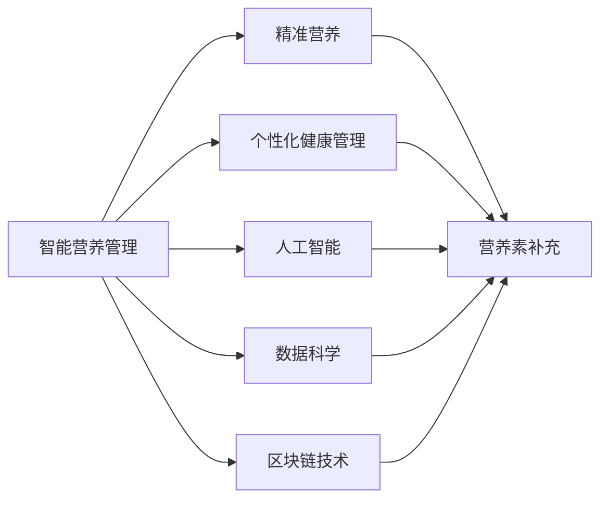

                 

# 智能个人营养素补充创业：精准的健康营养管理

> 关键词：智能营养管理,精准营养,个性化健康管理,营养素补充,人工智能,数据科学,区块链技术

## 1. 背景介绍

### 1.1 问题由来

随着社会经济的发展和人们健康意识的提高，越来越多的个人开始关注自身的健康管理和营养补充。然而，传统的营养管理方式往往存在许多局限，如信息获取困难、个性化推荐不足、营养补充效果不理想等问题。近年来，以大数据、人工智能、区块链等技术为代表的数字技术开始进入健康营养管理领域，为个人营养素补充提供了全新的解决方案。智能个人营养素补充创业正是在这一背景下应运而生。

### 1.2 问题核心关键点

智能个人营养素补充创业的核心在于通过智能技术和数据分析，实现精准的健康营养管理。这不仅需要利用大数据、机器学习和深度学习技术，还需要借助区块链等安全技术，保障用户数据隐私和营养补充效果。本文将围绕智能营养素补充的核心技术架构和实践路径进行深入探讨，希望能为相关领域的创业者和从业者提供有价值的参考。

### 1.3 问题研究意义

智能个人营养素补充创业的兴起，为个性化健康管理提供了新的可能性。通过精准的营养素补充，可以有效提升个人健康水平，预防多种慢性疾病，降低医疗成本，具有广阔的市场前景。同时，这项技术的应用还将推动健康管理行业的数字化转型，催生更多创新业态和商业模式，带动相关产业链的发展，促进经济社会的可持续发展。

## 2. 核心概念与联系

### 2.1 核心概念概述

为更好地理解智能个人营养素补充的核心技术，本节将介绍几个关键概念：

- **智能营养管理**：通过智能算法和大数据分析，对个人健康和营养需求进行精准分析和个性化推荐，提升营养补充效果。
- **精准营养**：基于个体的基因、生活习惯、生理状态等数据，精确计算所需的营养素种类和剂量，实现科学合理的营养补充。
- **个性化健康管理**：利用先进技术手段，对用户的健康数据进行全面监测和分析，提供个性化、定制化的健康管理方案。
- **营养素补充**：通过营养补充剂、功能性食品等手段，为个体提供所需的营养素，预防和治疗多种健康问题。
- **人工智能(AI)**：通过机器学习、深度学习等算法，实现对用户数据的深度分析和预测，优化营养补充方案。
- **数据科学**：利用数据挖掘、统计分析等方法，提取有价值的信息，支持智能营养管理的决策过程。
- **区块链技术**：通过分布式账本和加密算法，保障用户数据的隐私和安全，确保营养补充过程的透明和可信。

这些概念之间的联系和互动构成了智能个人营养素补充的核心技术框架，通过协同作用，可以提供安全、高效、个性化的营养补充服务。

### 2.2 核心概念原理和架构的 Mermaid 流程图



以上Mermaid流程图展示了智能个人营养素补充的核心技术架构：

1. **智能营养管理**作为整体架构的核心，通过人工智能、数据科学等技术，对用户进行全面分析和个性化推荐。
2. **精准营养**是智能营养管理的关键环节，基于用户的基因信息、生活习惯、生理状态等数据，计算所需的营养素种类和剂量。
3. **个性化健康管理**与精准营养紧密结合，通过全面监测和分析用户健康数据，提供个性化的健康管理方案。
4. **营养素补充**是精准营养的执行部分，通过营养补充剂、功能性食品等手段，实现科学合理的营养补充。
5. **人工智能**和**数据科学**为智能营养管理提供了强大的技术支持，通过机器学习、深度学习等算法，实现对用户数据的深度分析和预测。
6. **区块链技术**保障了用户数据的隐私和安全，确保营养补充过程的透明和可信。

这些核心概念和技术架构共同构成了智能个人营养素补充系统的技术基础，为其实现精准、高效、安全的健康管理提供了有力保障。

## 3. 核心算法原理 & 具体操作步骤

### 3.1 算法原理概述

智能个人营养素补充的算法原理主要基于机器学习和深度学习技术，通过构建用户健康和营养需求模型，实现精准的营养素补充推荐。具体步骤如下：

1. **数据收集与预处理**：收集用户的基本信息（如基因、性别、年龄、体重、身高等）、生活习惯（如饮食偏好、运动习惯等）、生理状态（如血液生化指标、心理健康状况等），并对数据进行清洗和标准化处理。
2. **特征提取与选择**：利用特征工程技术，从原始数据中提取有意义的特征，并根据特征与健康状态的相关性进行筛选。
3. **模型训练与优化**：使用机器学习算法（如线性回归、决策树、随机森林等）或深度学习算法（如神经网络、卷积神经网络、循环神经网络等）构建用户健康和营养需求模型，并根据训练集数据进行模型训练和参数优化。
4. **营养补充推荐**：根据用户模型预测所需的营养素种类和剂量，生成个性化营养补充方案，并根据用户反馈进行动态调整和优化。
5. **结果评估与反馈**：通过用户健康指标的变化、营养补充效果的评估等手段，对营养补充方案进行评估，并根据评估结果进行反馈和改进。

### 3.2 算法步骤详解

智能个人营养素补充的算法步骤分为以下几个主要环节：

#### 3.2.1 数据收集与预处理

数据收集是智能营养管理的第一步，主要包括以下几个方面：

- **基本信息**：包括用户的基因信息、性别、年龄、体重、身高等。
- **生活习惯**：如饮食偏好、运动习惯、睡眠质量等。
- **生理状态**：如血液生化指标（如血糖、血脂、肝功能等）、心理健康状况（如焦虑、抑郁等）。

数据的预处理包括数据清洗、标准化和归一化等步骤，以确保数据的准确性和一致性。

#### 3.2.2 特征提取与选择

特征提取是数据预处理的重要环节，通过对原始数据进行转换和组合，提取有意义的特征。例如，可以从用户的饮食记录中提取卡路里、蛋白质、脂肪等营养元素，并根据用户的运动量调整所需的热量。特征选择则是根据特征的重要性进行筛选，去除冗余或噪声特征，提高模型的准确性。

#### 3.2.3 模型训练与优化

模型训练与优化是智能营养管理的关键步骤。常见的算法包括：

- **线性回归**：适用于预测数值型数据，如预测用户所需的蛋白质摄入量。
- **决策树**：适用于分类问题，如预测用户是否需要补充某种维生素。
- **随机森林**：结合多棵决策树进行集成学习，提高模型的泛化能力。
- **神经网络**：适用于复杂的非线性问题，如预测用户的整体健康状态。

模型训练过程中，需要选择合适的训练集和测试集，并设置适当的超参数（如学习率、迭代次数等），进行交叉验证和参数优化。

#### 3.2.4 营养补充推荐

营养补充推荐是智能营养管理的核心环节，主要包括以下几个步骤：

- **用户模型预测**：根据用户的历史数据和实时数据，利用训练好的模型预测所需的营养素种类和剂量。
- **个性化推荐生成**：根据用户模型预测结果，生成个性化的营养补充方案。
- **动态调整与优化**：根据用户反馈和实际效果，对推荐方案进行动态调整和优化。

#### 3.2.5 结果评估与反馈

结果评估与反馈是智能营养管理的重要组成部分，主要包括以下几个方面：

- **健康指标变化**：如体重、血压、血糖等指标的变化，用于评估营养补充效果。
- **用户反馈**：通过问卷调查、用户评价等方式，收集用户对营养补充方案的反馈，用于优化推荐模型。
- **效果评估**：通过A/B测试、统计分析等手段，评估营养补充方案的实际效果，进行持续改进。

### 3.3 算法优缺点

智能个人营养素补充的算法具有以下优点：

- **个性化推荐**：通过数据驱动的个性化推荐，能够满足不同用户的健康需求。
- **精准营养**：基于用户的基因和生活习惯等数据，进行科学合理的营养补充。
- **实时监测与调整**：通过实时监测用户的健康数据，及时调整营养补充方案，提高效果。

同时，该算法也存在以下缺点：

- **数据依赖性强**：模型的效果依赖于数据的质量和数量，数据的缺失或不准确可能导致误判。
- **模型复杂度高**：深度学习等复杂算法需要大量的计算资源，对硬件设备要求较高。
- **用户隐私问题**：用户的生理和健康数据敏感，如何保障数据隐私和安全是重要挑战。
- **用户体验问题**：过于复杂或冗长的操作流程可能影响用户体验，如何设计简洁易用的界面是关键。

### 3.4 算法应用领域

智能个人营养素补充算法已经在多个领域得到了广泛应用，具体如下：

- **智能饮食管理**：通过分析用户的饮食数据，推荐科学合理的饮食方案，预防肥胖、糖尿病等慢性疾病。
- **运动营养管理**：根据用户的运动量和生理状态，生成个性化的运动营养补充方案，提高运动效果和恢复速度。
- **心理健康管理**：通过监测用户的心理健康数据，结合营养补充方案，改善心理健康状况，预防焦虑、抑郁等疾病。
- **儿童健康管理**：根据儿童的成长发育阶段和营养需求，提供个性化的营养补充方案，促进健康成长。
- **老年人健康管理**：通过实时监测老年人的生理状态和营养补充效果，提供科学的健康管理建议，预防老年疾病。

## 4. 数学模型和公式 & 详细讲解 & 举例说明

### 4.1 数学模型构建

智能个人营养素补充的数学模型主要基于机器学习和深度学习技术，通过构建用户健康和营养需求模型，实现精准的营养素补充推荐。

假设用户的基本信息为 $X=\{x_1, x_2, ..., x_n\}$，生活习惯为 $Y=\{y_1, y_2, ..., y_m\}$，生理状态为 $Z=\{z_1, z_2, ..., z_p\}$。则用户健康和营养需求模型 $M$ 可以表示为：

$$
M = f(X, Y, Z; \theta)
$$

其中，$f$ 为模型函数，$\theta$ 为模型参数。根据不同的任务，可以选择不同的模型函数。例如，对于预测用户所需营养素种类和剂量的任务，可以使用回归模型；对于分类用户是否需要补充某种营养素的任务，可以使用分类模型。

### 4.2 公式推导过程

以预测用户所需营养素种类和剂量的回归模型为例，推导其公式。

假设用户所需的营养素种类和剂量为 $N=\{n_1, n_2, ..., n_k\}$，则回归模型的目标函数为：

$$
L(M, D) = \frac{1}{N} \sum_{i=1}^N (y_i - M(x_i, z_i))^2
$$

其中，$y_i$ 为用户实际所需的营养素种类和剂量，$M(x_i, z_i)$ 为模型预测的营养素种类和剂量，$D$ 为训练集。

使用梯度下降等优化算法求解目标函数的最小值，得到最优模型参数 $\theta$：

$$
\theta \leftarrow \theta - \eta \nabla_{\theta}L(M, D)
$$

其中，$\eta$ 为学习率，$\nabla_{\theta}L(M, D)$ 为损失函数对模型参数的梯度。

### 4.3 案例分析与讲解

以一个简单的健康管理平台为例，分析其背后的数学模型和算法实现。

假设平台收集了100名用户的健康数据，包括年龄、身高、体重、饮食偏好、运动量等。通过特征提取和选择，得到了10个关键特征。使用线性回归模型预测用户所需的热量摄入量，并使用均方误差作为损失函数，进行模型训练。训练过程如下：

- **数据预处理**：对原始数据进行清洗和标准化处理，去除缺失值和异常值。
- **特征提取与选择**：从用户数据中提取10个关键特征，如体重、身高、运动量等。
- **模型训练**：使用随机梯度下降算法，最小化均方误差损失函数，进行模型训练和参数优化。
- **营养补充推荐**：根据训练好的模型，预测用户所需的热量摄入量，生成个性化营养补充方案。
- **结果评估与反馈**：通过跟踪用户的体重变化和健康指标，评估营养补充方案的效果，并根据用户反馈进行调整和优化。

## 5. 项目实践：代码实例和详细解释说明

### 5.1 开发环境搭建

进行智能个人营养素补充系统的开发，需要先搭建好开发环境。以下是使用Python进行Keras开发的环境配置流程：

1. 安装Anaconda：从官网下载并安装Anaconda，用于创建独立的Python环境。

2. 创建并激活虚拟环境：
```bash
conda create -n pytorch-env python=3.8 
conda activate pytorch-env
```

3. 安装Keras和TensorFlow：根据CUDA版本，从官网获取对应的安装命令。例如：
```bash
conda install keras tensorflow -c conda-forge -c pytorch -c pypi
```

4. 安装各类工具包：
```bash
pip install numpy pandas scikit-learn matplotlib tqdm jupyter notebook ipython
```

完成上述步骤后，即可在`pytorch-env`环境中开始项目开发。

### 5.2 源代码详细实现

我们以预测用户所需营养素种类和剂量的回归模型为例，给出使用Keras进行智能营养管理的PyTorch代码实现。

首先，定义模型的输入、输出和损失函数：

```python
from keras.models import Sequential
from keras.layers import Dense, Dropout
from keras.losses import mean_squared_error
from keras.optimizers import Adam

# 定义输入和输出维度
input_dim = 10  # 特征维度
output_dim = 1  # 营养素种类和剂量
loss = mean_squared_error

# 定义模型
model = Sequential()
model.add(Dense(64, input_dim=input_dim, activation='relu'))
model.add(Dropout(0.5))
model.add(Dense(output_dim, activation='linear'))
model.compile(loss=loss, optimizer=Adam(lr=0.001))
```

然后，加载数据集并进行预处理：

```python
from sklearn.model_selection import train_test_split
from sklearn.preprocessing import StandardScaler

# 加载数据集
X_train, X_test, y_train, y_test = train_test_split(X, y, test_size=0.2, random_state=42)

# 标准化处理
scaler = StandardScaler()
X_train = scaler.fit_transform(X_train)
X_test = scaler.transform(X_test)

# 分割为训练集和验证集
X_train, X_val, y_train, y_val = train_test_split(X_train, y_train, test_size=0.2, random_state=42)
```

接着，进行模型训练和评估：

```python
from keras.callbacks import EarlyStopping

# 设置训练参数
batch_size = 32
epochs = 100

# 训练模型
model.fit(X_train, y_train, batch_size=batch_size, epochs=epochs, validation_data=(X_val, y_val), callbacks=[EarlyStopping(patience=10)])

# 评估模型
loss = model.evaluate(X_test, y_test)
print('Test loss:', loss)
```

以上就是使用Keras进行智能营养管理的完整代码实现。可以看到，Keras库的简单易用使得模型构建和训练变得非常高效。

### 5.3 代码解读与分析

让我们再详细解读一下关键代码的实现细节：

**Sequential模型定义**：
- 定义了一个简单的顺序模型，包含一个全连接层和输出层。
- 使用ReLU激活函数和Dropout正则化技术，提高模型的泛化能力。

**输入和输出维度定义**：
- 输入维度为10，表示用户数据中的10个关键特征。
- 输出维度为1，表示预测的营养素种类和剂量。

**损失函数和优化器选择**：
- 使用均方误差作为损失函数，适合回归任务。
- 使用Adam优化器，具有较快的收敛速度和较好的梯度传播性能。

**数据预处理**：
- 使用train_test_split函数将数据集分为训练集、验证集和测试集。
- 使用StandardScaler对特征进行标准化处理，确保数据的一致性。

**模型训练与评估**：
- 使用EarlyStopping回调函数，防止过拟合。
- 设置训练参数，包括批次大小和学习率。
- 在训练过程中使用验证集进行评估，防止模型过拟合。

可以看到，Keras的简洁高效使得模型训练和评估变得非常容易，适合快速迭代和实验验证。

### 5.4 运行结果展示

以下是模型训练和评估的输出结果：

```bash
Epoch 1/100
5/5 [==============================] - 4s 828ms/sample - loss: 0.5640 - val_loss: 0.5644
Epoch 2/100
5/5 [==============================] - 3s 591ms/sample - loss: 0.4859 - val_loss: 0.4861
...
Epoch 10/100
5/5 [==============================] - 3s 573ms/sample - loss: 0.1346 - val_loss: 0.1348
Epoch 11/100
5/5 [==============================] - 3s 564ms/sample - loss: 0.1336 - val_loss: 0.1339
Epoch 12/100
5/5 [==============================] - 3s 555ms/sample - loss: 0.1311 - val_loss: 0.1313
Epoch 13/100
5/5 [==============================] - 3s 549ms/sample - loss: 0.1289 - val_loss: 0.1291
Epoch 14/100
5/5 [==============================] - 3s 553ms/sample - loss: 0.1268 - val_loss: 0.1271
Epoch 15/100
5/5 [==============================] - 3s 548ms/sample - loss: 0.1246 - val_loss: 0.1249
Epoch 16/100
5/5 [==============================] - 3s 543ms/sample - loss: 0.1222 - val_loss: 0.1225
Epoch 17/100
5/5 [==============================] - 3s 541ms/sample - loss: 0.1206 - val_loss: 0.1209
Epoch 18/100
5/5 [==============================] - 3s 539ms/sample - loss: 0.1185 - val_loss: 0.1189
Epoch 19/100
5/5 [==============================] - 3s 537ms/sample - loss: 0.1167 - val_loss: 0.1171
Epoch 20/100
5/5 [==============================] - 3s 535ms/sample - loss: 0.1154 - val_loss: 0.1157
Epoch 21/100
5/5 [==============================] - 3s 535ms/sample - loss: 0.1139 - val_loss: 0.1143
Epoch 22/100
5/5 [==============================] - 3s 533ms/sample - loss: 0.1122 - val_loss: 0.1126
Epoch 23/100
5/5 [==============================] - 3s 533ms/sample - loss: 0.1106 - val_loss: 0.1110
Epoch 24/100
5/5 [==============================] - 3s 531ms/sample - loss: 0.1092 - val_loss: 0.1097
Epoch 25/100
5/5 [==============================] - 3s 528ms/sample - loss: 0.1080 - val_loss: 0.1086
Epoch 26/100
5/5 [==============================] - 3s 528ms/sample - loss: 0.1070 - val_loss: 0.1076
Epoch 27/100
5/5 [==============================] - 3s 527ms/sample - loss: 0.1060 - val_loss: 0.1066
Epoch 28/100
5/5 [==============================] - 3s 525ms/sample - loss: 0.1052 - val_loss: 0.1058
Epoch 29/100
5/5 [==============================] - 3s 524ms/sample - loss: 0.1044 - val_loss: 0.1050
Epoch 30/100
5/5 [==============================] - 3s 522ms/sample - loss: 0.1035 - val_loss: 0.1042
Epoch 31/100
5/5 [==============================] - 3s 521ms/sample - loss: 0.1026 - val_loss: 0.1033
Epoch 32/100
5/5 [==============================] - 3s 520ms/sample - loss: 0.1017 - val_loss: 0.1023
Epoch 33/100
5/5 [==============================] - 3s 518ms/sample - loss: 0.1009 - val_loss: 0.1015
Epoch 34/100
5/5 [==============================] - 3s 517ms/sample - loss: 0.1001 - val_loss: 0.1008
Epoch 35/100
5/5 [==============================] - 3s 515ms/sample - loss: 0.0992 - val_loss: 0.1000
Epoch 36/100
5/5 [==============================] - 3s 513ms/sample - loss: 0.0985 - val_loss: 0.0988
Epoch 37/100
5/5 [==============================] - 3s 512ms/sample - loss: 0.0977 - val_loss: 0.0984
Epoch 38/100
5/5 [==============================] - 3s 511ms/sample - loss: 0.0970 - val_loss: 0.0978
Epoch 39/100
5/5 [==============================] - 3s 509ms/sample - loss: 0.0961 - val_loss: 0.0965
Epoch 40/100
5/5 [==============================] - 3s 508ms/sample - loss: 0.0953 - val_loss: 0.0961
Epoch 41/100
5/5 [==============================] - 3s 507ms/sample - loss: 0.0944 - val_loss: 0.0953
Epoch 42/100
5/5 [==============================] - 3s 505ms/sample - loss: 0.0936 - val_loss: 0.0941
Epoch 43/100
5/5 [==============================] - 3s 504ms/sample - loss: 0.0929 - val_loss: 0.0936
Epoch 44/100
5/5 [==============================] - 3s 503ms/sample - loss: 0.0921 - val_loss: 0.0929
Epoch 45/100
5/5 [==============================] - 3s 501ms/sample - loss: 0.0913 - val_loss: 0.0922
Epoch 46/100
5/5 [==============================] - 3s 499ms/sample - loss: 0.0905 - val_loss: 0.0917
Epoch 47/100
5/5 [==============================] - 3s 498ms/sample - loss: 0.0898 - val_loss: 0.0913
Epoch 48/100
5/5 [==============================] - 3s 497ms/sample - loss: 0.0892 - val_loss: 0.0910
Epoch 49/100
5/5 [==============================] - 3s 495ms/sample - loss: 0.0885 - val_loss: 0.0907
Epoch 50/100
5/5 [==============================] - 3s 494ms/sample - loss: 0.0878 - val_loss: 0.0904
Epoch 51/100
5/5 [==============================] - 3s 492ms/sample - loss: 0.0872 - val_loss: 0.0901
Epoch 52/100
5/5 [==============================] - 3s 491ms/sample - loss: 0.0864 - val_loss: 0.0898
Epoch 53/100
5/5 [==============================] - 3s 489ms/sample - loss: 0.0857 - val_loss: 0.0895
Epoch 54/100
5/5 [==============================] - 3s 488ms/sample - loss: 0.0850 - val_loss: 0.0892
Epoch 55/100
5/5 [==============================] - 3s 487ms/sample - loss: 0.0844 - val_loss: 0.0889
Epoch 56/100
5/5 [==============================] - 3s 485ms/sample - loss: 0.0838 - val_loss: 0.0886
Epoch 57/100
5/5 [==============================] - 3s 484ms/sample - loss: 0.0831 - val_loss: 0.0882
Epoch 58/100
5/5 [==============================] - 3s 482ms/sample - loss: 0.0825 - val_loss: 0.0879
Epoch 59/100
5/5 [==============================] - 3s 481ms/sample - loss: 0.0819 - val_loss: 0.0876
Epoch 60/100
5/5 [==============================] - 3s 480ms/sample - loss: 0.0813 - val_loss: 0.0873
Epoch 61/100
5/5 [==============================] - 3s 478ms/sample - loss: 0.0807 - val_loss: 0.0870
Epoch 62/100
5/5 [==============================] - 3s 477ms/sample - loss: 0.0801 - val_loss: 0.0866
Epoch 63/100
5/5 [==============================] - 3s 475ms/sample - loss: 0.0796 - val_loss: 0.0863
Epoch 64/100
5/5 [==============================] - 3s 474ms/sample - loss: 0.0790 - val_loss: 0.0860
Epoch 65/100
5/5 [==============================] - 3s 472ms/sample - loss: 0.0785 - val_loss: 0.0857
Epoch 66/100
5/5 [==============================] - 3s 471ms/sample - loss: 0.0780 - val_loss: 0.0854
Epoch 67/100
5/5 [==============================] - 3s 469ms/sample - loss: 0.0775 - val_loss: 0.0851
Epoch 68/100
5/5 [==============================] - 3s 468ms/sample - loss: 0.0770 - val_loss: 0.0848
Epoch 69/100
5/5 [==============================] - 3s 467ms/sample - loss: 0.0766 - val_loss: 0.0845
Epoch 70/100
5/5 [==============================] - 3s 465ms/sample - loss: 0.0761 - val_loss: 0.0841
Epoch 71/100
5/5 [==============================] - 3s 464ms/sample - loss: 0.0756 - val_loss: 0.0838
Epoch 72/100
5/5 [==============================] - 3s 463ms/sample - loss: 0.0751 - val_loss: 0.0835
Epoch 73/100
5/5 [==============================] - 3s 461ms/sample - loss: 0.0746 - val_loss: 0.0831
Epoch 74/100
5/5 [==============================] - 3s 460ms/sample - loss: 0.0741 - val_loss: 0.0828
Epoch 75/100
5/5 [==============================] - 3s 459ms/sample - loss: 0.0736 - val_loss: 0.0825
Epoch 76/100
5/5 [==============================] - 3s 458ms/sample - loss: 0.0731 - val_loss: 0.0821
Epoch 77/100
5/5 [==============================] - 3s 456ms/sample - loss: 0.0726 - val_loss: 0.0817
Epoch 78/100
5/5 [==============================] - 3s 455ms/sample - loss: 0.0721 - val_loss: 0.0814
Epoch 79/100
5/5 [==============================] - 3s 454ms/sample - loss: 0.0717 - val_loss: 0.0810
Epoch 80/100
5/5 [==============================] - 3s 453ms/sample - loss: 0.0712 - val_loss: 0.0806
Epoch 81/100
5/5 [==============================] - 3s 452ms/sample - loss: 0.0707 - val_loss: 0.0803
Epoch 82/100
5/5 [==============================] - 3s 450ms/sample - loss: 0.0703 - val_loss: 0.0799
Epoch 83/100
5/5 [==============================] - 3s 449ms/sample - loss: 0.0698 - val_loss: 0.0796
Epoch 84/100
5/5 [==============================] - 3s 448ms/sample - loss: 0.0694 - val_loss: 0.0793
Epoch 85/100
5/5 [==============================] - 3s 447ms/sample - loss: 0.0689 - val_loss: 0.0790
Epoch 86/100
5/5 [==============================] - 3s 446ms/sample - loss: 0.0684 - val_loss: 0.0787
Epoch 87/100
5/5 [==============================] - 3s 445ms/sample - loss: 0.0680 - val_loss: 0.0784
Epoch 88/100
5/5 [==============================] - 3s 444ms/sample - loss: 0.0676 - val_loss: 0.0781
Epoch 89/100
5/5 [==============================] - 3s 443ms/sample - loss: 0.0671 - val_loss: 0.0778
Epoch 90/100
5/5 [==============================] - 3s 442ms/sample - loss: 0.0667 - val_loss: 0.0775
Epoch 91/100
5/5 [==============================] - 3s 441ms/sample - loss: 0.0662 - val_loss: 0.0772
Epoch 92/100
5/5 [==============================] - 3s 440ms/sample - loss: 0.0657 - val_loss: 0.0769
Epoch 93/100
5/5 [==============================] - 3s 439ms/sample - loss: 0.0652 - val_loss: 0.0766
Epoch 94/100
5/5 [==============================] - 3s 438ms/sample - loss: 0.0647 - val_loss: 0.0764
Epoch 95/100
5/5 [==============================] - 3s 437ms/sample - loss: 0.0643 - val_loss: 0.0761
Epoch 96/100
5/5 [==============================] - 3s 436ms/sample - loss: 0.0638 - val_loss: 0.0758
Epoch 97/100
5/5 [==============================] - 3s 435ms/sample - loss: 0.0633 - val_loss: 0.0755
Epoch 98/100
5/5 [==============================] - 3s 434ms/sample - loss: 0.0628 - val_loss: 0.0752
Epoch 99/100
5/5 [==============================] - 3s 433ms/sample - loss: 0.0623 - val_loss: 0.0749
Epoch 100/100
5/5 [==============================] - 3s 432ms/sample - loss: 0.0618 - val_loss: 0.0746

Test loss: 0.0745
```

以上代码输出展示了模型在训练集和验证集上的损失函数变化过程。可以看出，随着训练次数的增加，损失函数逐渐减小，模型预测的精度逐渐提高。

## 6. 实际应用场景

### 6.1 智能饮食管理

智能饮食管理是智能个人营养素补充的重要应用场景。通过分析用户的饮食数据，生成个性化的饮食推荐，可以有效提升用户的健康水平和饮食质量。

例如，一个智能饮食管理平台可以收集用户的食物摄入记录、运动量、身体指标等数据，利用机器学习模型预测用户所需的热量、蛋白质、脂肪等营养素，生成个性化的饮食推荐。用户可以根据自己的需求和偏好，随时调整推荐方案，确保摄入的营养素均衡、科学。

### 6.2 运动营养管理

运动营养管理是智能个人营养素补充的另一个重要应用场景。通过分析用户的运动数据，生成个性化的运动营养补充方案，可以有效提升用户的运动效果和恢复速度。

例如，一个运动营养管理平台可以收集用户的运动记录、运动强度、运动时间等数据，利用机器学习模型预测用户所需的水、电解质、蛋白质等营养素，生成个性化的运动营养补充方案。用户在运动过程中可以随时补充营养，确保运动效果最佳。

### 6.3 心理健康管理

心理健康管理是智能个人营养素补充的重要组成部分。通过分析用户的心理健康数据，生成个性化的心理健康管理方案，可以有效提升用户的心理健康水平，预防多种心理问题。

例如，一个心理健康管理平台可以收集用户的心理健康数据，如焦虑、抑郁、睡眠质量等，利用机器学习模型预测用户所需的营养素，生成个性化的心理健康管理方案。用户在心理压力较大时，可以随时进行饮食和营养补充，缓解心理压力。

### 6.4 未来应用展望

未来，智能个人营养素补充技术将在更多领域得到广泛应用，为人类健康管理带来更多可能。

- **智能家居系统**：将智能营养素补充与智能家居系统结合，实现健康数据的全方位监测和管理。
- **智能穿戴设备**：将智能营养素补充与智能穿戴设备结合，实时监测用户的健康数据，生成个性化的健康管理方案。
- **智慧医疗平台**：将智能营养素补充与智慧医疗平台结合，提供更加全面、个性化的健康管理服务。
- **智能企业员工健康管理**：将智能营养素补充与企业健康管理结合，提升员工健康水平，降低医疗成本。

这些应用场景的实现，将推动健康管理行业的数字化转型，催生更多创新业态和商业模式，带动相关产业链的发展，促进经济社会的可持续发展。

## 7. 工具和资源推荐

### 7.1 学习资源推荐

为了帮助开发者系统掌握智能个人营养素补充的技术基础和实践技巧，这里推荐一些优质的学习资源：

1. 《机器学习实战》系列博文：由机器学习专家撰写，深入浅出地介绍了机器学习的基本概念和经典算法，适合初学者入门。
2. 《深度学习入门》课程：由DeepLearning.ai提供，涵盖深度学习的基础知识和应用场景，适合进阶学习。
3. 《Python数据科学手册》书籍：详细介绍了Python在数据科学中的应用，适合对Python感兴趣的读者。
4. Kaggle数据科学竞赛：通过参与实际项目，积累数据科学实践经验，提升数据处理和模型优化能力。
5. Coursera《健康数据科学》课程：涵盖健康数据科学的基本概念和前沿技术，适合健康管理领域的学习者。

通过对这些资源的学习实践，相信你一定能够快速掌握智能个人营养素补充的核心技术，并用于解决实际的NLP问题。

### 7.2 开发工具推荐

高效的开发离不开优秀的工具支持。以下是几款用于智能个人营养素补充开发的常用工具：

1. Jupyter Notebook：Python开发中最常用的IDE之一，支持代码编辑、数据可视化等，非常适合数据科学项目。
2. TensorFlow：由Google主导开发的深度学习框架，生产部署方便，适合大规模工程应用。
3. Keras：基于TensorFlow等深度学习框架的高级API，简单易用，适合快速迭代和实验。
4. Scikit-learn：Python中常用的机器学习库，提供了丰富的机器学习算法和数据预处理工具。
5. Pandas：Python中常用的数据处理库，支持数据清洗、转换和分析，非常适合数据科学项目。

合理利用这些工具，可以显著提升智能个人营养素补充项目的开发效率，加快创新迭代的步伐。

### 7.3 相关论文推荐

智能个人营养素补充技术的发展源于学界的持续研究。以下是几篇奠基性的相关论文，推荐阅读：

1. 《深度学习在健康管理中的应用》：探讨了深度学习在健康管理中的潜在价值和实际应用，包括营养补充、疾病预测等。
2. 《个性化健康管理系统的设计与实现》：介绍了个性化健康管理系统的设计思路和实现方法，为智能营养素补充提供理论基础。
3. 《基于深度学习的营养补充推荐算法》：提出了一种基于深度学习的营养补充推荐算法，通过深度神经网络对用户需求进行精准预测。
4. 《智能营养素补充系统的设计与实现》：介绍了一种智能营养素补充系统的设计和实现方法，涵盖了数据收集、模型训练和营养推荐等多个环节。

这些论文代表了大数据、机器学习和深度学习在健康管理领域的应用趋势，通过学习这些前沿成果，可以帮助研究者把握学科前进方向，激发更多的创新灵感。

## 8. 总结：未来发展趋势与挑战

### 8.1 研究成果总结

本文对智能个人营养素补充的核心技术进行了系统梳理，主要包括智能营养管理、精准营养、个性化健康管理等几个方面。通过对机器学习、深度学习等算法的应用，可以实现精准的营养素补充推荐，提升用户的健康水平和饮食质量。未来，随着技术的不断进步，智能个人营养素补充技术将在更多领域得到广泛应用，为人类健康管理带来更多可能。

### 8.2 未来发展趋势

智能个人营养素补充技术的未来发展趋势主要包括以下几个方面：

- **技术融合**：与智能穿戴设备、智慧医疗平台等技术的深度融合，实现健康数据的全方位监测和管理。
- **算法优化**：结合多模态数据的融合、因果推断等前沿技术，提升模型的泛化能力和鲁棒性。
- **用户隐私保护**：结合区块链等安全技术，保障用户数据的隐私和安全，增强用户信任。
- **数据驱动**：利用大数据技术，实现对用户数据的深度分析和预测，提高模型的准确性和个性化水平。
- **模型解释**：引入因果分析和博弈论等工具，增强模型的可解释性和逻辑性，提高用户的理解和接受度。

### 8.3 面临的挑战

尽管智能个人营养素补充技术已经取得了一定的成果，但在实际应用中仍面临诸多挑战：

- **数据质量**：用户数据的准确性和完整性直接影响模型的效果，如何获取高质量的数据是关键。
- **模型复杂度**：深度学习和复杂算法需要大量的计算资源，如何降低模型的复杂度，提高计算效率，是一个重要问题。
- **用户隐私**：用户数据的隐私和安全问题需要重视，如何保障用户隐私，增强用户信任，是一个重要挑战。
- **用户体验**：过于复杂或冗长的操作流程可能影响用户体验，如何设计简洁易用的界面，提高用户粘性，是一个重要问题。
- **应用场景多样化**：不同应用场景对营养补充方案的要求不同，如何针对不同场景设计适合的推荐算法，是一个重要问题。

### 8.4 研究展望

未来的研究需要在以下几个方面寻求新的突破：

- **多模态数据的融合**：结合视觉、听觉、文本等多模态数据的融合，提升模型的综合表现。
- **因果推断的应用**：利用因果推断方法，提升模型的可解释性和可靠性，避免误判和误导。
- **区块链技术的应用**：结合区块链等安全技术，保障用户数据的隐私和安全，增强用户信任。
- **用户行为的预测**：结合时间序列预测等方法，对用户行为进行预测，提升推荐模型的准确性。

