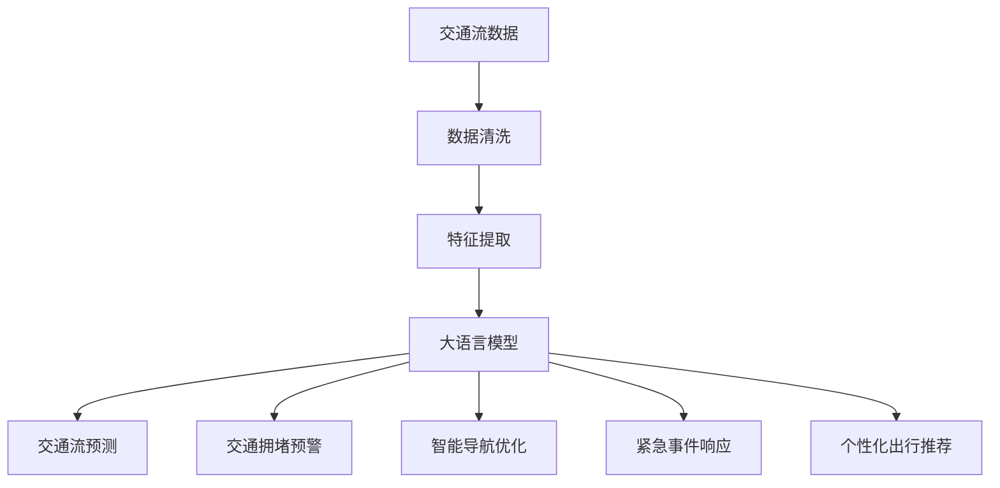

                 

## 1. 背景介绍

### 1.1 问题由来

随着城市的不断扩张和机动车数量的急剧增加，交通拥堵问题已经成为制约城市发展的重要瓶颈。传统的交通管理手段，如信号灯控制、限行限购等，已难以应对日益复杂的交通场景和海量交通数据。智能化、精细化的交通管理手段，成为城市交通发展的重要方向。

近年来，语言模型在自然语言处理领域取得了突破性进展。大语言模型（LLM, Large Language Model），如GPT、BERT等，能够通过大规模语料训练获得强大的语言理解能力，用于处理和分析交通数据，提供城市交通流预测、拥堵预警、智能导航等决策支持服务。

### 1.2 问题核心关键点

智能交通管理中，如何高效利用大语言模型的语言理解能力，对交通数据进行分析和预测，成为当前研究的热点问题。关键在于：

1. 收集和预处理城市交通数据。需要将车辆位置、速度、流量、道路拥堵状态等交通数据转化为模型可以处理的格式。
2. 设计合适的语言模型任务。需要根据具体问题，设计合适的语言模型输入输出格式和任务目标函数。
3. 优化模型的超参数。需要选择合适的学习率、正则化强度、模型结构等，确保模型在少量数据上的泛化能力。
4. 利用多模态数据融合。需要融合交通监控摄像头、传感器等数据源，增强模型对复杂交通场景的理解和预测。

### 1.3 问题研究意义

智能交通管理中，利用大语言模型进行城市交通流的优化，对于提升城市交通效率、降低交通成本、改善市民出行体验具有重要意义：

1. 实时交通流预测：通过大语言模型预测城市交通流，为交通管理部门提供实时参考，优化信号灯控制和交通疏导策略。
2. 交通拥堵预警：及时识别交通热点区域和拥堵路段，提前采取疏导措施，减少交通延误。
3. 智能导航优化：利用大语言模型生成的路线方案，优化出行路径，减少出行时间和能耗。
4. 紧急事件响应：快速识别和响应交通事故、施工堵塞等紧急事件，保障城市交通运行平稳。
5. 个性化出行推荐：结合用户的出行历史和偏好，提供个性化的交通导航和出行建议。

## 2. 核心概念与联系

### 2.1 核心概念概述

智能交通管理中，大语言模型主要应用于以下几类任务：

- **交通流预测**：预测未来一段时间内道路交通流，包括车辆数、速度、拥堵状态等。
- **交通拥堵预警**：识别交通热点区域和拥堵路段，提供预警信息。
- **智能导航优化**：生成最佳出行路线，考虑交通流量、速度、道路条件等因素。
- **紧急事件响应**：自动检测并响应交通事故、施工堵塞等紧急事件。
- **个性化出行推荐**：根据用户偏好和历史出行记录，推荐最佳出行方案。

这些任务在大语言模型的支持下，可以实现更智能、高效、可靠的交通管理。

### 2.2 核心概念原理和架构的 Mermaid 流程图



大语言模型在智能交通管理中主要扮演以下几个角色：

1. **数据清洗**：通过自然语言处理技术，对原始交通数据进行清洗和标准化，使其适合模型输入。
2. **特征提取**：从清洗后的数据中提取关键特征，生成模型的输入。
3. **模型预测**：利用大语言模型进行交通流预测、拥堵预警、智能导航、紧急事件响应、出行推荐等任务。
4. **数据反馈**：将模型预测结果与实际交通数据进行对比，生成反馈信息，用于模型优化和改进。

## 3. 核心算法原理 & 具体操作步骤

### 3.1 算法原理概述

基于大语言模型的智能交通管理，主要利用模型的语言理解和生成能力，对交通数据进行处理和分析。其核心原理包括：

1. **数据表示**：将交通数据转换为自然语言，用于模型输入。
2. **语言模型训练**：在大规模交通数据上训练大语言模型，学习交通流的语言表示。
3. **任务适配**：根据具体任务，设计合适的任务适配层，适配模型输出。
4. **微调优化**：在特定交通场景上，对模型进行微调，优化预测性能。

### 3.2 算法步骤详解

#### 3.2.1 数据预处理和表示

**Step 1: 数据收集与清洗**

- **交通数据收集**：收集城市交通管理平台中的交通监控数据，包括车辆位置、速度、流量、道路拥堵状态等。
- **数据清洗**：去除数据中的异常值和噪声，确保数据的一致性和完整性。

**Step 2: 数据表示**

- **数据转换**：将原始交通数据转换为文本格式，生成模型可读的输入。
- **时间窗口划分**：将时间序列数据划分为多个时间窗口，每个窗口内数据用于训练模型。

#### 3.2.2 语言模型训练

**Step 3: 构建语言模型**

- **选择模型**：选择合适的预训练语言模型，如GPT、BERT等。
- **预训练**：在大量交通文本数据上预训练语言模型，学习交通流语言表示。

**Step 4: 微调模型**

- **任务适配**：根据具体任务，设计合适的任务适配层，适配模型输出。
- **数据准备**：准备标注数据，标注模型的输出标签。
- **微调优化**：使用标注数据，对模型进行微调，优化预测性能。

#### 3.2.3 模型预测与输出

**Step 5: 模型预测**

- **输入数据**：将最新的交通数据输入模型，生成交通流预测、拥堵预警、智能导航、紧急事件响应等预测结果。
- **输出解释**：利用自然语言处理技术，将模型输出转换为易于理解的语言形式，生成交通管理决策报告。

**Step 6: 反馈优化**

- **数据反馈**：将模型预测结果与实际交通数据进行对比，生成反馈信息。
- **模型优化**：根据反馈信息，优化模型参数和结构，提高预测性能。

### 3.3 算法优缺点

#### 3.3.1 优点

1. **高效预测**：大语言模型具有强大的语言理解能力，能够高效处理和分析复杂交通数据，实现实时交通流预测和拥堵预警。
2. **任务灵活**：大语言模型支持多种任务，如智能导航、紧急事件响应、个性化出行推荐等，能够灵活应对不同的交通管理需求。
3. **数据适应**：大语言模型能够适应不同城市、不同交通场景的数据，具有良好的泛化能力。

#### 3.3.2 缺点

1. **数据依赖**：大语言模型的性能高度依赖于数据质量和数据量，需要大量的标注数据和高质量的数据预处理。
2. **计算成本高**：大规模语言模型的训练和微调需要高算力和高计算资源，成本较高。
3. **可解释性差**：大语言模型的输出通常缺乏可解释性，难以理解模型的内部工作机制和决策逻辑。

### 3.4 算法应用领域

基于大语言模型的智能交通管理，在多个领域中得到了广泛应用，包括：

1. **城市交通管理**：利用大语言模型进行交通流预测和拥堵预警，优化交通信号灯控制和道路资源分配。
2. **智能导航系统**：结合大语言模型的预测结果，生成最佳出行路线，提高出行效率和体验。
3. **紧急事件响应**：自动检测和响应交通事故、施工堵塞等紧急事件，保障城市交通运行平稳。
4. **个性化出行推荐**：结合用户偏好和历史出行记录，提供个性化的交通导航和出行建议。
5. **交通数据分析**：利用大语言模型对历史交通数据进行分析，生成交通报告和政策建议。

## 4. 数学模型和公式 & 详细讲解 & 举例说明

### 4.1 数学模型构建

在智能交通管理中，大语言模型主要用于以下几个任务：

1. **交通流预测**：预测未来一段时间内道路交通流，包括车辆数、速度、拥堵状态等。
2. **交通拥堵预警**：识别交通热点区域和拥堵路段，提供预警信息。
3. **智能导航优化**：生成最佳出行路线，考虑交通流量、速度、道路条件等因素。
4. **紧急事件响应**：自动检测并响应交通事故、施工堵塞等紧急事件。
5. **个性化出行推荐**：根据用户偏好和历史出行记录，推荐最佳出行方案。

### 4.2 公式推导过程

#### 4.2.1 交通流预测

设交通流数据为 $(x_t, y_t)$，其中 $x_t$ 为第 $t$ 时间点的交通状态数据，$y_t$ 为第 $t$ 时间点的交通流预测值。则交通流预测的任务可以形式化表示为：

$$
y_t = f(x_t; \theta)
$$

其中 $f(\cdot)$ 为模型预测函数，$\theta$ 为模型参数。

设模型输出层的节点数为 $m$，则交通流预测的损失函数为：

$$
\mathcal{L}(\theta) = \frac{1}{N}\sum_{i=1}^N \ell(y_i, \hat{y}_i)
$$

其中 $\ell(\cdot)$ 为交叉熵损失函数，$y_i$ 为真实交通流值，$\hat{y}_i$ 为模型预测值。

#### 4.2.2 交通拥堵预警

交通拥堵预警的任务是将交通热点区域和拥堵路段标注为高风险区域，生成预警信息。设 $(x_t, y_t)$ 为第 $t$ 时间点的交通数据和标注信息，其中 $y_t$ 为高风险区域和拥堵路段的集合。则交通拥堵预警的任务可以形式化表示为：

$$
y_t = f(x_t; \theta)
$$

其中 $f(\cdot)$ 为模型预测函数，$\theta$ 为模型参数。

设模型输出层的节点数为 $m$，则交通拥堵预警的损失函数为：

$$
\mathcal{L}(\theta) = \frac{1}{N}\sum_{i=1}^N \ell(y_i, \hat{y}_i)
$$

其中 $\ell(\cdot)$ 为交叉熵损失函数，$y_i$ 为真实高风险区域和拥堵路段，$\hat{y}_i$ 为模型预测值。

#### 4.2.3 智能导航优化

智能导航优化的任务是根据交通流量、速度、道路条件等因素，生成最佳出行路线。设 $(x_t, y_t)$ 为第 $t$ 时间点的交通数据和导航信息，其中 $y_t$ 为最佳出行路线的集合。则智能导航优化的任务可以形式化表示为：

$$
y_t = f(x_t; \theta)
$$

其中 $f(\cdot)$ 为模型预测函数，$\theta$ 为模型参数。

设模型输出层的节点数为 $m$，则智能导航优化的损失函数为：

$$
\mathcal{L}(\theta) = \frac{1}{N}\sum_{i=1}^N \ell(y_i, \hat{y}_i)
$$

其中 $\ell(\cdot)$ 为交叉熵损失函数，$y_i$ 为真实最佳出行路线，$\hat{y}_i$ 为模型预测值。

### 4.3 案例分析与讲解

#### 4.3.1 交通流预测

**案例背景**

某城市交通管理部门希望利用大语言模型进行交通流预测，以优化交通信号灯控制和道路资源分配。数据集包括：

- **交通监控数据**：包括车辆位置、速度、流量、道路拥堵状态等。
- **标注数据**：标注未来一段时间内的交通流数据。

**案例实现**

1. **数据预处理**

   - **数据清洗**：去除异常值和噪声，确保数据一致性和完整性。
   - **数据转换**：将原始交通数据转换为文本格式，生成模型可读的输入。

2. **语言模型训练**

   - **选择模型**：选择预训练的GPT模型。
   - **预训练**：在大量交通文本数据上预训练语言模型，学习交通流语言表示。
   - **任务适配**：设计任务适配层，适配交通流预测输出。

3. **微调模型**

   - **数据准备**：准备标注数据，标注模型的输出标签。
   - **微调优化**：使用标注数据，对模型进行微调，优化预测性能。

4. **模型预测**

   - **输入数据**：将最新的交通数据输入模型，生成交通流预测结果。
   - **输出解释**：利用自然语言处理技术，将模型输出转换为易于理解的语言形式，生成交通管理决策报告。

#### 4.3.2 交通拥堵预警

**案例背景**

某城市希望通过大语言模型实现交通拥堵预警，以减少交通延误和拥堵。数据集包括：

- **交通监控数据**：包括车辆位置、速度、流量、道路拥堵状态等。
- **标注数据**：标注高风险区域和拥堵路段。

**案例实现**

1. **数据预处理**

   - **数据清洗**：去除异常值和噪声，确保数据一致性和完整性。
   - **数据转换**：将原始交通数据转换为文本格式，生成模型可读的输入。

2. **语言模型训练**

   - **选择模型**：选择预训练的BERT模型。
   - **预训练**：在大量交通文本数据上预训练语言模型，学习交通流语言表示。
   - **任务适配**：设计任务适配层，适配交通拥堵预警输出。

3. **微调模型**

   - **数据准备**：准备标注数据，标注模型的输出标签。
   - **微调优化**：使用标注数据，对模型进行微调，优化预警性能。

4. **模型预测**

   - **输入数据**：将最新的交通数据输入模型，生成交通拥堵预警结果。
   - **输出解释**：利用自然语言处理技术，将模型输出转换为易于理解的语言形式，生成交通管理决策报告。

#### 4.3.3 智能导航优化

**案例背景**

某导航系统希望利用大语言模型实现智能导航优化，以提升用户出行体验。数据集包括：

- **交通监控数据**：包括车辆位置、速度、流量、道路拥堵状态等。
- **标注数据**：标注最佳出行路线。

**案例实现**

1. **数据预处理**

   - **数据清洗**：去除异常值和噪声，确保数据一致性和完整性。
   - **数据转换**：将原始交通数据转换为文本格式，生成模型可读的输入。

2. **语言模型训练**

   - **选择模型**：选择预训练的BERT模型。
   - **预训练**：在大量交通文本数据上预训练语言模型，学习交通流语言表示。
   - **任务适配**：设计任务适配层，适配智能导航优化输出。

3. **微调模型**

   - **数据准备**：准备标注数据，标注模型的输出标签。
   - **微调优化**：使用标注数据，对模型进行微调，优化导航性能。

4. **模型预测**

   - **输入数据**：将最新的交通数据输入模型，生成最佳出行路线。
   - **输出解释**：利用自然语言处理技术，将模型输出转换为易于理解的语言形式，生成导航建议。

## 5. 项目实践：代码实例和详细解释说明

### 5.1 开发环境搭建

在进行智能交通管理中大语言模型的项目实践时，需要先准备好开发环境。以下是使用Python进行PyTorch开发的环境配置流程：

1. 安装Anaconda：从官网下载并安装Anaconda，用于创建独立的Python环境。

2. 创建并激活虚拟环境：
```bash
conda create -n pytorch-env python=3.8 
conda activate pytorch-env
```

3. 安装PyTorch：根据CUDA版本，从官网获取对应的安装命令。例如：
```bash
conda install pytorch torchvision torchaudio cudatoolkit=11.1 -c pytorch -c conda-forge
```

4. 安装Transformers库：
```bash
pip install transformers
```

5. 安装各类工具包：
```bash
pip install numpy pandas scikit-learn matplotlib tqdm jupyter notebook ipython
```

完成上述步骤后，即可在`pytorch-env`环境中开始智能交通管理中的大语言模型微调实践。

### 5.2 源代码详细实现

这里我们以交通流预测任务为例，给出使用Transformers库对BERT模型进行微调的PyTorch代码实现。

首先，定义交通流预测任务的数据处理函数：

```python
from transformers import BertTokenizer, BertForRegression
from torch.utils.data import Dataset
import torch

class TrafficFlowDataset(Dataset):
    def __init__(self, texts, labels, tokenizer, max_len=128):
        self.texts = texts
        self.labels = labels
        self.tokenizer = tokenizer
        self.max_len = max_len
        
    def __len__(self):
        return len(self.texts)
    
    def __getitem__(self, item):
        text = self.texts[item]
        label = self.labels[item]
        
        encoding = self.tokenizer(text, return_tensors='pt', max_length=self.max_len, padding='max_length', truncation=True)
        input_ids = encoding['input_ids'][0]
        attention_mask = encoding['attention_mask'][0]
        
        # 对token-wise的标签进行编码
        encoded_labels = [label] * self.max_len
        labels = torch.tensor(encoded_labels, dtype=torch.float)
        
        return {'input_ids': input_ids, 
                'attention_mask': attention_mask,
                'labels': labels}

# 数据转换函数
def convert_data(data, tokenizer, max_len=128):
    texts, labels = [], []
    for item in data:
        text, label = item
        encoded_text = tokenizer.encode(text, max_length=max_len)
        texts.append(encoded_text)
        labels.append(label)
    return texts, labels

# 准备数据集
tokenizer = BertTokenizer.from_pretrained('bert-base-cased')
train_texts, train_labels = convert_data(train_data, tokenizer)
dev_texts, dev_labels = convert_data(dev_data, tokenizer)
test_texts, test_labels = convert_data(test_data, tokenizer)

# 创建数据集
train_dataset = TrafficFlowDataset(train_texts, train_labels, tokenizer)
dev_dataset = TrafficFlowDataset(dev_texts, dev_labels, tokenizer)
test_dataset = TrafficFlowDataset(test_texts, test_labels, tokenizer)
```

然后，定义模型和优化器：

```python
from transformers import BertForRegression, AdamW

model = BertForRegression.from_pretrained('bert-base-cased', num_labels=1)

optimizer = AdamW(model.parameters(), lr=2e-5)
```

接着，定义训练和评估函数：

```python
from torch.utils.data import DataLoader
from tqdm import tqdm
from sklearn.metrics import mean_squared_error

device = torch.device('cuda') if torch.cuda.is_available() else torch.device('cpu')
model.to(device)

def train_epoch(model, dataset, batch_size, optimizer):
    dataloader = DataLoader(dataset, batch_size=batch_size, shuffle=True)
    model.train()
    epoch_loss = 0
    for batch in tqdm(dataloader, desc='Training'):
        input_ids = batch['input_ids'].to(device)
        attention_mask = batch['attention_mask'].to(device)
        labels = batch['labels'].to(device)
        model.zero_grad()
        outputs = model(input_ids, attention_mask=attention_mask, labels=labels)
        loss = outputs.loss
        epoch_loss += loss.item()
        loss.backward()
        optimizer.step()
    return epoch_loss / len(dataloader)

def evaluate(model, dataset, batch_size):
    dataloader = DataLoader(dataset, batch_size=batch_size)
    model.eval()
    preds, labels = [], []
    with torch.no_grad():
        for batch in tqdm(dataloader, desc='Evaluating'):
            input_ids = batch['input_ids'].to(device)
            attention_mask = batch['attention_mask'].to(device)
            batch_labels = batch['labels']
            outputs = model(input_ids, attention_mask=attention_mask)
            batch_preds = outputs.logits.item()
            batch_labels = batch_labels.to('cpu').tolist()
            for pred in batch_preds:
                preds.append(pred)
                labels.append(batch_labels[0])
    
    mse = mean_squared_error(labels, preds)
    return mse

```

最后，启动训练流程并在测试集上评估：

```python
epochs = 5
batch_size = 16

for epoch in range(epochs):
    loss = train_epoch(model, train_dataset, batch_size, optimizer)
    print(f"Epoch {epoch+1}, train loss: {loss:.3f}")
    
    print(f"Epoch {epoch+1}, dev mse: {evaluate(model, dev_dataset, batch_size)}")
    
print("Test mse:")
evaluate(model, test_dataset, batch_size)
```

以上就是使用PyTorch对BERT进行交通流预测任务微调的完整代码实现。可以看到，得益于Transformers库的强大封装，我们可以用相对简洁的代码完成BERT模型的加载和微调。

### 5.3 代码解读与分析

让我们再详细解读一下关键代码的实现细节：

**TrafficFlowDataset类**：
- `__init__`方法：初始化文本、标签、分词器等关键组件。
- `__len__`方法：返回数据集的样本数量。
- `__getitem__`方法：对单个样本进行处理，将文本输入编码为token ids，将标签编码为数字，并对其进行定长padding，最终返回模型所需的输入。

**数据转换函数**：
- `convert_data`方法：将原始数据集转换为文本格式，生成模型可读的输入。

**模型和优化器定义**：
- `BertForRegression`类：用于交通流预测任务的模型，继承自BERT模型的回归任务。
- `AdamW`优化器：用于微调过程的优化器。

**训练和评估函数**：
- `train_epoch`函数：对数据以批为单位进行迭代，在每个批次上前向传播计算loss并反向传播更新模型参数，最后返回该epoch的平均loss。
- `evaluate`函数：与训练类似，不同点在于不更新模型参数，并在每个batch结束后将预测和标签结果存储下来，最后使用sklearn的mean_squared_error计算平均误差。

**训练流程**：
- 定义总的epoch数和batch size，开始循环迭代
- 每个epoch内，先在训练集上训练，输出平均loss
- 在验证集上评估，输出平均误差
- 所有epoch结束后，在测试集上评估，给出最终测试结果

可以看到，PyTorch配合Transformers库使得BERT微调的代码实现变得简洁高效。开发者可以将更多精力放在数据处理、模型改进等高层逻辑上，而不必过多关注底层的实现细节。

当然，工业级的系统实现还需考虑更多因素，如模型的保存和部署、超参数的自动搜索、更灵活的任务适配层等。但核心的微调范式基本与此类似。

## 6. 实际应用场景

### 6.1 智能交通管理

基于大语言模型的智能交通管理，可以广泛应用于城市交通流预测、拥堵预警、智能导航等场景，为交通管理部门提供数据支持和决策参考。

在具体实现中，可以通过收集和预处理城市交通监控数据，利用大语言模型进行交通流预测和拥堵预警。将预测结果和实际交通数据进行对比，不断优化模型参数，提升预测精度。同时，利用预测结果进行智能导航优化，生成最佳出行路线，提高出行效率和体验。

### 6.2 交通事件响应

交通事件响应是智能交通管理的重要环节。通过大语言模型自动检测并响应交通事故、施工堵塞等紧急事件，保障城市交通运行平稳。

具体实现中，可以将交通监控摄像头、传感器等数据源接入大语言模型，进行实时监控和分析。模型能够自动识别交通事件的类型和位置，并生成应对策略，及时通知相关部门进行处理。

### 6.3 交通数据分析

交通数据分析是智能交通管理的重要辅助手段。利用大语言模型对历史交通数据进行分析，生成交通报告和政策建议，为城市交通规划和管理提供数据支持。

具体实现中，可以通过收集城市交通监控数据和交通管理平台的数据，利用大语言模型进行数据分析和建模。模型能够识别交通流模式、高峰期规律等，生成交通报告和政策建议，为城市交通管理提供数据支持。

### 6.4 未来应用展望

未来，基于大语言模型的智能交通管理技术将不断扩展和深化，具有以下几个发展趋势：

1. **多模态数据融合**：交通管理部门可以融合交通监控摄像头、传感器、GPS数据等多种数据源，增强对复杂交通场景的理解和预测。
2. **动态调整模型**：通过持续学习，模型能够动态调整参数和结构，适应不断变化的交通场景和数据分布。
3. **实时预测与响应**：大语言模型能够实现实时交通流预测和事件响应，提高交通管理的及时性和精准性。
4. **个性化服务**：基于用户出行历史和偏好，生成个性化的交通导航和推荐服务，提升用户出行体验。
5. **伦理与安全保障**：在模型训练和应用过程中，重视数据隐私和模型伦理，确保交通管理的公平与安全。

## 7. 工具和资源推荐

### 7.1 学习资源推荐

为了帮助开发者系统掌握大语言模型在智能交通管理中的应用，这里推荐一些优质的学习资源：

1. 《Transformer from Understanding to Practical》系列博文：由大模型技术专家撰写，深入浅出地介绍了Transformer原理、BERT模型、微调技术等前沿话题。

2. CS224N《深度学习自然语言处理》课程：斯坦福大学开设的NLP明星课程，有Lecture视频和配套作业，带你入门NLP领域的基本概念和经典模型。

3. 《Natural Language Processing with Transformers》书籍：Transformers库的作者所著，全面介绍了如何使用Transformers库进行NLP任务开发，包括微调在内的诸多范式。

4. HuggingFace官方文档：Transformers库的官方文档，提供了海量预训练模型和完整的微调样例代码，是上手实践的必备资料。

5. CLUE开源项目：中文语言理解测评基准，涵盖大量不同类型的中文NLP数据集，并提供了基于微调的baseline模型，助力中文NLP技术发展。

通过对这些资源的学习实践，相信你一定能够快速掌握大语言模型在智能交通管理中的应用精髓，并用于解决实际的交通管理问题。

### 7.2 开发工具推荐

高效的开发离不开优秀的工具支持。以下是几款用于智能交通管理中大语言模型微调开发的常用工具：

1. PyTorch：基于Python的开源深度学习框架，灵活动态的计算图，适合快速迭代研究。大部分预训练语言模型都有PyTorch版本的实现。

2. TensorFlow：由Google主导开发的开源深度学习框架，生产部署方便，适合大规模工程应用。同样有丰富的预训练语言模型资源。

3. Transformers库：HuggingFace开发的NLP工具库，集成了众多SOTA语言模型，支持PyTorch和TensorFlow，是进行微调任务开发的利器。

4. Weights & Biases：模型训练的实验跟踪工具，可以记录和可视化模型训练过程中的各项指标，方便对比和调优。与主流深度学习框架无缝集成。

5. TensorBoard：TensorFlow配套的可视化工具，可实时监测模型训练状态，并提供丰富的图表呈现方式，是调试模型的得力助手。

6. Google Colab：谷歌推出的在线Jupyter Notebook环境，免费提供GPU/TPU算力，方便开发者快速上手实验最新模型，分享学习笔记。

合理利用这些工具，可以显著提升大语言模型在智能交通管理中的微调任务的开发效率，加快创新迭代的步伐。

### 7.3 相关论文推荐

大语言模型在智能交通管理中的应用源于学界的持续研究。以下是几篇奠基性的相关论文，推荐阅读：

1. Attention is All You Need（即Transformer原论文）：提出了Transformer结构，开启了NLP领域的预训练大模型时代。

2. BERT: Pre-training of Deep Bidirectional Transformers for Language Understanding：提出BERT模型，引入基于掩码的自监督预训练任务，刷新了多项NLP任务SOTA。

3. Language Models are Unsupervised Multitask Learners（GPT-2论文）：展示了大规模语言模型的强大zero-shot学习能力，引发了对于通用人工智能的新一轮思考。

4. Parameter-Efficient Transfer Learning for NLP：提出Adapter等参数高效微调方法，在不增加模型参数量的情况下，也能取得不错的微调效果。

5. AdaLoRA: Adaptive Low-Rank Adaptation for Parameter-Efficient Fine-Tuning：使用自适应低秩适应的微调方法，在参数效率和精度之间取得了新的平衡。

6. Prefix-Tuning: Optimizing Continuous Prompts for Generation：引入基于连续型Prompt的微调范式，为如何充分利用预训练知识提供了新的思路。

这些论文代表了大语言模型在智能交通管理中的应用发展脉络。通过学习这些前沿成果，可以帮助研究者把握学科前进方向，激发更多的创新灵感。

## 8. 总结：未来发展趋势与挑战

### 8.1 总结

本文对基于大语言模型的智能交通管理方法进行了全面系统的介绍。首先阐述了智能交通管理中大语言模型的研究背景和意义，明确了大语言模型在交通流预测、拥堵预警、智能导航等任务中的应用价值。其次，从原理到实践，详细讲解了大语言模型在交通管理中的数学模型构建、公式推导和案例分析，给出了基于BERT的微调代码实现。最后，探讨了大语言模型在智能交通管理中的实际应用场景和未来发展趋势，提出了当前面临的挑战和研究展望。

通过本文的系统梳理，可以看到，基于大语言模型的智能交通管理技术已经在大规模城市交通管理中得到了初步应用，展现了强大的应用潜力。未来，伴随技术进一步发展和多模态数据融合等技术手段的应用，基于大语言模型的智能交通管理技术将进一步深入发展，为城市交通管理提供更加智能化、高效化的解决方案。

### 8.2 未来发展趋势

展望未来，大语言模型在智能交通管理中具有以下几个发展趋势：

1. **多模态数据融合**：交通管理部门可以融合交通监控摄像头、传感器、GPS数据等多种数据源，增强对复杂交通场景的理解和预测。
2. **动态调整模型**：通过持续学习，模型能够动态调整参数和结构，适应不断变化的交通场景和数据分布。
3. **实时预测与响应**：大语言模型能够实现实时交通流预测和事件响应，提高交通管理的及时性和精准性。
4. **个性化服务**：基于用户出行历史和偏好，生成个性化的交通导航和推荐服务，提升用户出行体验。
5. **伦理与安全保障**：在模型训练和应用过程中，重视数据隐私和模型伦理，确保交通管理的公平与安全。

### 8.3 面临的挑战

尽管大语言模型在智能交通管理中的应用取得了初步进展，但在迈向更加智能化、普适化应用的过程中，它仍面临着诸多挑战：

1. **数据依赖**：大语言模型的性能高度依赖于数据质量和数据量，需要大量的标注数据和高质量的数据预处理。
2. **计算成本高**：大规模语言模型的训练和微调需要高算力和高计算资源，成本较高。
3. **可解释性差**：大语言模型的输出通常缺乏可解释性，难以理解模型的内部工作机制和决策逻辑。
4. **动态适应性不足**：现有模型无法动态适应新的交通场景和数据变化，需要不断优化模型结构和参数。
5. **伦理与安全问题**：在模型训练和应用过程中，重视数据隐私和模型伦理，确保交通管理的公平与安全。

### 8.4 研究展望

面对智能交通管理中大语言模型所面临的挑战，未来的研究需要在以下几个方面寻求新的突破：

1. **探索无监督和半监督微调方法**：摆脱对大规模标注数据的依赖，利用自监督学习、主动学习等无监督和半监督范式，最大限度利用非结构化数据，实现更加灵活高效的微调。
2. **研究参数高效和计算高效的微调范式**：开发更加参数高效的微调方法，在固定大部分预训练参数的同时，只更新极少量的任务相关参数。同时优化微调模型的计算图，减少前向传播和反向传播的资源消耗，实现更加轻量级、实时性的部署。
3. **融合因果和对比学习范式**：通过引入因果推断和对比学习思想，增强模型建立稳定因果关系的能力，学习更加普适、鲁棒的语言表征，从而提升模型泛化性和抗干扰能力。
4. **纳入伦理道德约束**：在模型训练目标中引入伦理导向的评估指标，过滤和惩罚有偏见、有害的输出倾向。同时加强人工干预和审核，建立模型行为的监管机制，确保输出符合人类价值观和伦理道德。
5. **结合因果分析和博弈论工具**：将因果分析方法引入微调模型，识别出模型决策的关键特征，增强输出解释的因果性和逻辑性。借助博弈论工具刻画人机交互过程，主动探索并规避模型的脆弱点，提高系统稳定性。

这些研究方向的探索，必将引领大语言模型在智能交通管理中的应用迈向更高的台阶，为构建安全、可靠、可解释、可控的智能系统铺平道路。面向未来，大语言模型在智能交通管理中的研究还需要与其他人工智能技术进行更深入的融合，如知识表示、因果推理、强化学习等，多路径协同发力，共同推动交通流预测和智能导航技术的进步。只有勇于创新、敢于突破，才能不断拓展语言模型的边界，让智能技术更好地造福人类社会。

## 9. 附录：常见问题与解答

**Q1：基于大语言模型的智能交通管理是否适用于所有交通场景？**

A: 基于大语言模型的智能交通管理在大部分交通场景中都能取得不错的效果。但对于某些特殊场景，如极端天气、重大活动等，需要结合实际场景进行模型优化。此外，针对特定城市的交通特征，需要收集和预处理相应的交通数据，以提高模型的适应性。

**Q2：大语言模型在智能交通管理中的应用，数据质量如何影响模型性能？**

A: 大语言模型在智能交通管理中的应用，数据质量对模型性能有着至关重要的影响。数据中的噪声和异常值会严重影响模型的预测准确性，因此需要采用数据清洗和预处理技术，确保数据的一致性和完整性。

**Q3：如何在智能交通管理中提高模型的动态适应性？**

A: 提高模型的动态适应性，需要结合持续学习和多模态数据融合等技术手段，使模型能够实时适应不断变化的交通场景和数据分布。此外，通过引入因果分析和博弈论工具，增强模型的因果关系推理能力，提高模型对复杂场景的理解和预测能力。

**Q4：智能交通管理中，如何确保模型的可解释性？**

A: 确保模型的可解释性，需要在模型设计和训练过程中引入可解释性评估指标，如LIME、SHAP等，生成模型的解释性报告。此外，可以采用可视化技术，如特征重要性分析、部分依赖图等，帮助理解和解释模型的预测结果。

**Q5：在智能交通管理中，如何平衡模型的效率和精度？**

A: 在智能交通管理中，平衡模型的效率和精度需要结合任务特点进行综合考虑。对于实时预测和导航等对速度要求较高的任务，可以采用参数高效微调方法，在保证精度的同时减少计算资源消耗。对于复杂的交通分析和决策支持任务，需要采用更复杂的模型结构和更丰富的数据源，以提升模型精度。

通过本文的系统梳理，可以看到，基于大语言模型的智能交通管理技术在实际应用中已经初见成效，展现出强大的应用潜力。未来，伴随技术的不断进步和多模态数据融合等技术手段的应用，基于大语言模型的智能交通管理技术将进一步深入发展，为城市交通管理提供更加智能化、高效化的解决方案。

