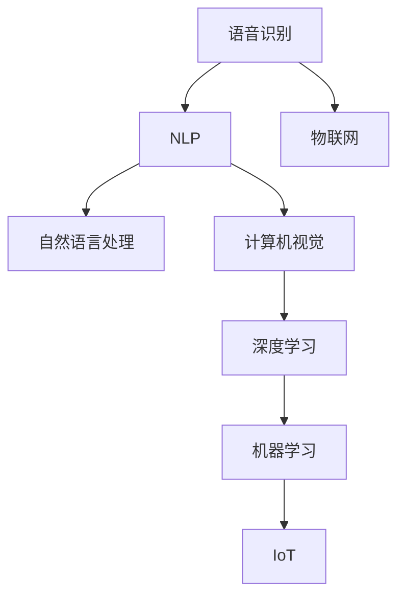

                 

# 智能厨房创业：烹饪革命的技术支持

在现代社会的快节奏生活中，智能厨房设备正在逐渐成为家庭和餐饮业的新宠。然而，创业领域的竞争尤为激烈，如何利用最新的人工智能(AI)技术打造出具有竞争力的智能厨房解决方案，成为创业者们迫切需要解决的问题。本文将介绍几种关键AI技术在智能厨房中的应用，并为智能厨房创业提供技术支持和灵感。

## 1. 背景介绍

### 1.1 问题由来
智能厨房设备的发展得益于物联网(IoT)、人工智能(AI)、大数据等技术的结合。AI技术在语音识别、图像识别、自然语言处理等领域的应用，使得智能厨房设备在语音控制、智能推荐、个性化定制等方面大放异彩。然而，智能厨房设备不仅需要具备先进的技术，更需要融入用户体验和产品设计，才能真正实现商业成功。

### 1.2 问题核心关键点
智能厨房的开发和创业过程，需要解决以下核心关键点：
1. 如何在保持产品易用性的前提下，集成复杂的AI算法。
2. 如何快速迭代，满足不断变化的客户需求。
3. 如何通过智能推荐系统，提升用户体验。
4. 如何通过大数据分析，优化厨房设备的设计和运营。

这些问题构成了智能厨房创业的核心挑战。本文将从AI技术角度，探讨如何克服这些挑战，构建具备强大竞争力的智能厨房解决方案。

## 2. 核心概念与联系

### 2.1 核心概念概述

智能厨房的核心概念包括：

- **语音识别与自然语言处理(NLP)**：允许用户通过语音指令控制厨房设备，如语音点餐、音乐播放等。
- **计算机视觉(Computer Vision)**：通过摄像头捕捉用户操作和食材状态，识别食材、监测烹饪进度等。
- **深度学习(Deep Learning)**：通过训练神经网络模型，实现食材推荐、烹饪方式优化等功能。
- **机器学习(Machine Learning)**：在大量用户行为数据基础上，优化厨房设备的操作流程和个性化推荐。
- **物联网(IoT)**：连接各种厨房设备，实现设备间的协同工作和数据共享。

这些核心概念互相交织，构成了智能厨房的基石。

### 2.2 核心概念原理和架构的 Mermaid 流程图



这个流程图展示了智能厨房的核心组件及其联系：

- 语音识别和自然语言处理将用户的语音指令转换为可执行的命令。
- 计算机视觉和深度学习负责食材识别、烹饪进度监测和健康数据分析。
- 机器学习优化推荐算法，提升个性化和精准度。
- 物联网连接厨房设备，实现数据的共享和协同工作。

## 3. 核心算法原理 & 具体操作步骤

### 3.1 算法原理概述

智能厨房设备的核心算法包括语音识别、自然语言处理、计算机视觉、深度学习和机器学习。以下是这些算法的基本原理概述：

#### 3.1.1 语音识别与自然语言处理

语音识别技术通过麦克风采集用户的语音输入，将其转换为文本。自然语言处理则负责理解用户语音指令的语义，生成可执行的命令。

#### 3.1.2 计算机视觉

计算机视觉技术利用摄像头捕捉用户的操作和食材状态，通过图像处理和深度学习模型进行分析和识别。

#### 3.1.3 深度学习

深度学习模型通过大量的训练数据，学习食材和烹饪方式之间的复杂关系，用于食材推荐、烹饪方式优化等任务。

#### 3.1.4 机器学习

机器学习算法通过分析用户行为数据，优化厨房设备的操作流程和个性化推荐，提升用户体验。

### 3.2 算法步骤详解

以下是几种核心算法详细步骤：

#### 3.2.1 语音识别与自然语言处理

1. **语音采集与预处理**：采集用户的语音信号，进行降噪、预加重、分帧等预处理操作。
2. **特征提取**：提取MFCC、Mel频谱等特征。
3. **模型训练**：使用深度神经网络模型（如CNN、RNN、LSTM等）训练语音识别模型。
4. **语音指令理解**：利用自然语言处理技术，将语音指令转换为文本，并解析语义。

#### 3.2.2 计算机视觉

1. **摄像头捕捉**：通过摄像头实时捕捉用户的操作和食材状态。
2. **图像预处理**：进行灰度化、二值化、边缘检测等预处理操作。
3. **特征提取**：提取颜色、纹理、形状等特征。
4. **识别与分析**：使用深度学习模型（如CNN、RCNN等）进行图像识别和分析。

#### 3.2.3 深度学习

1. **数据集准备**：准备大量的食材和烹饪方式数据，用于训练深度学习模型。
2. **模型构建**：选择适当的神经网络结构，如CNN、RNN、LSTM等。
3. **模型训练**：使用反向传播算法和梯度下降优化算法，训练深度学习模型。
4. **推理与预测**：将用户输入的数据传入训练好的模型，得到食材推荐或烹饪方式建议。

#### 3.2.4 机器学习

1. **数据收集**：收集用户操作和偏好数据。
2. **特征工程**：提取、选择和组合特征。
3. **模型训练**：使用决策树、随机森林、神经网络等算法训练机器学习模型。
4. **预测与优化**：根据用户反馈和行为数据，不断优化模型，提升个性化推荐效果。

### 3.3 算法优缺点

智能厨房中的各种算法各有优缺点：

#### 3.3.1 语音识别与自然语言处理

**优点**：
- 用户交互方式自然、便捷。
- 语音指令理解准确率高。

**缺点**：
- 受环境噪声干扰较大。
- 方言、口音等因素影响较大。

#### 3.3.2 计算机视觉

**优点**：
- 实时性高。
- 识别准确率高。

**缺点**：
- 对光照、角度变化敏感。
- 难以处理遮挡物。

#### 3.3.3 深度学习

**优点**：
- 可处理复杂非线性关系。
- 预测能力强。

**缺点**：
- 需要大量标注数据。
- 模型训练复杂，计算量大。

#### 3.3.4 机器学习

**优点**：
- 算法灵活，适应性强。
- 可实时调整，动态优化。

**缺点**：
- 对数据质量要求高。
- 模型解释性差。

### 3.4 算法应用领域

智能厨房中的AI算法广泛应用于以下领域：

- **食材识别与健康分析**：利用计算机视觉和深度学习，对食材进行识别，并提供营养价值、热量等信息。
- **烹饪方式优化**：通过深度学习模型，推荐最佳的烹饪方式和食材搭配。
- **个性化推荐系统**：使用机器学习算法，根据用户偏好和历史行为数据，提供个性化的食谱和食材推荐。
- **智能调度与优化**：利用IoT设备和机器学习，优化厨房设备的使用和资源配置。
- **安全监测与预警**：通过计算机视觉和深度学习，实时监测厨房安全，并提供预警信息。

## 4. 数学模型和公式 & 详细讲解 & 举例说明

### 4.1 数学模型构建

智能厨房中的AI算法需要构建数学模型，用于训练和推理。以下是几种核心算法的数学模型构建过程：

#### 4.1.1 语音识别与自然语言处理

语音识别模型常使用卷积神经网络（CNN）和循环神经网络（RNN）。自然语言处理模型则常使用RNN、LSTM、GRU等序列模型。

#### 4.1.2 计算机视觉

计算机视觉模型常使用卷积神经网络（CNN）和区域卷积神经网络（RCNN）。

#### 4.1.3 深度学习

深度学习模型常使用卷积神经网络（CNN）、递归神经网络（RNN）、长短时记忆网络（LSTM）等。

#### 4.1.4 机器学习

机器学习模型常使用决策树、随机森林、神经网络等。

### 4.2 公式推导过程

#### 4.2.1 语音识别与自然语言处理

语音识别模型的训练过程如下：

$$
\min_{\theta} \frac{1}{N}\sum_{i=1}^{N}\ell(M_{\theta}(x_i), y_i)
$$

其中，$\ell$为损失函数，$M_{\theta}$为模型，$x_i$为输入语音信号，$y_i$为标注文本。

自然语言处理模型的训练过程如下：

$$
\min_{\theta} \frac{1}{N}\sum_{i=1}^{N}\ell(M_{\theta}(x_i), y_i)
$$

其中，$\ell$为损失函数，$M_{\theta}$为模型，$x_i$为输入文本，$y_i$为标注文本。

#### 4.2.2 计算机视觉

计算机视觉模型的训练过程如下：

$$
\min_{\theta} \frac{1}{N}\sum_{i=1}^{N}\ell(M_{\theta}(x_i), y_i)
$$

其中，$\ell$为损失函数，$M_{\theta}$为模型，$x_i$为输入图像，$y_i$为标注类别。

#### 4.2.3 深度学习

深度学习模型的训练过程如下：

$$
\min_{\theta} \frac{1}{N}\sum_{i=1}^{N}\ell(M_{\theta}(x_i), y_i)
$$

其中，$\ell$为损失函数，$M_{\theta}$为模型，$x_i$为输入数据，$y_i$为标注数据。

#### 4.2.4 机器学习

机器学习模型的训练过程如下：

$$
\min_{\theta} \frac{1}{N}\sum_{i=1}^{N}\ell(M_{\theta}(x_i), y_i)
$$

其中，$\ell$为损失函数，$M_{\theta}$为模型，$x_i$为输入数据，$y_i$为标注数据。

### 4.3 案例分析与讲解

#### 4.3.1 语音识别与自然语言处理

**案例**：语音控制智能冰箱

**过程**：
1. **语音采集与预处理**：麦克风采集用户语音信号，进行降噪、预加重、分帧等预处理操作。
2. **特征提取**：提取MFCC、Mel频谱等特征。
3. **模型训练**：使用深度神经网络模型（如CNN、RNN、LSTM等）训练语音识别模型。
4. **语音指令理解**：利用自然语言处理技术，将语音指令转换为文本，并解析语义。

#### 4.3.2 计算机视觉

**案例**：智能烤箱

**过程**：
1. **摄像头捕捉**：通过摄像头实时捕捉烤箱内部的烹饪状态。
2. **图像预处理**：进行灰度化、二值化、边缘检测等预处理操作。
3. **特征提取**：提取颜色、纹理、形状等特征。
4. **识别与分析**：使用深度学习模型（如CNN、RCNN等）进行图像识别和分析，判断烹饪进度。

#### 4.3.3 深度学习

**案例**：智能推荐系统

**过程**：
1. **数据集准备**：准备大量的食材和烹饪方式数据，用于训练深度学习模型。
2. **模型构建**：选择适当的神经网络结构，如CNN、RNN、LSTM等。
3. **模型训练**：使用反向传播算法和梯度下降优化算法，训练深度学习模型。
4. **推理与预测**：将用户输入的数据传入训练好的模型，得到食材推荐或烹饪方式建议。

#### 4.3.4 机器学习

**案例**：个性化推荐系统

**过程**：
1. **数据收集**：收集用户操作和偏好数据。
2. **特征工程**：提取、选择和组合特征。
3. **模型训练**：使用决策树、随机森林、神经网络等算法训练机器学习模型。
4. **预测与优化**：根据用户反馈和行为数据，不断优化模型，提升个性化推荐效果。

## 5. 项目实践：代码实例和详细解释说明

### 5.1 开发环境搭建

在进行智能厨房创业时，开发环境的选择至关重要。以下是几种常见的开发环境搭建方法：

#### 5.1.1 Python

Python是目前最流行的开发语言，拥有丰富的第三方库和框架，如TensorFlow、PyTorch、Keras等。以下是搭建Python开发环境的详细步骤：

1. **安装Python**：从官网下载最新版本的Python，并安装完成后设置环境变量。
2. **安装依赖包**：使用pip或conda安装Python开发所需依赖包，如TensorFlow、Keras、scikit-learn等。
3. **设置虚拟环境**：创建Python虚拟环境，避免不同项目之间的依赖冲突。
4. **配置Jupyter Notebook**：安装Jupyter Notebook，并配置为本地服务器，便于多人协作开发。

#### 5.1.2 TensorFlow

TensorFlow是一个强大的深度学习框架，适合构建复杂的神经网络模型。以下是搭建TensorFlow开发环境的详细步骤：

1. **安装TensorFlow**：从官网下载最新版本的TensorFlow，并安装完成后设置环境变量。
2. **安装依赖包**：使用pip或conda安装TensorFlow开发所需依赖包，如TensorBoard、TensorFlow Serving等。
3. **设置虚拟环境**：创建TensorFlow虚拟环境，避免不同项目之间的依赖冲突。
4. **配置Jupyter Notebook**：安装Jupyter Notebook，并配置为本地服务器，便于多人协作开发。

#### 5.1.3 PyTorch

PyTorch是一个灵活的深度学习框架，适合构建动态图神经网络模型。以下是搭建PyTorch开发环境的详细步骤：

1. **安装PyTorch**：从官网下载最新版本的PyTorch，并安装完成后设置环境变量。
2. **安装依赖包**：使用pip或conda安装PyTorch开发所需依赖包，如TorchVision、TorchText等。
3. **设置虚拟环境**：创建PyTorch虚拟环境，避免不同项目之间的依赖冲突。
4. **配置Jupyter Notebook**：安装Jupyter Notebook，并配置为本地服务器，便于多人协作开发。

### 5.2 源代码详细实现

#### 5.2.1 语音识别与自然语言处理

**代码实例**：

```python
import tensorflow as tf
from tensorflow.keras.layers import Input, Dense, Embedding, LSTM, Masking
from tensorflow.keras.models import Model

# 定义模型结构
input_layer = Input(shape=(None,))
embedding_layer = Embedding(input_dim=VOCAB_SIZE, output_dim=EMBEDDING_DIM)(input_layer)
masking_layer = Masking(mask_value=0)(embedding_layer)
lstm_layer = LSTM(64, return_sequences=True)(masking_layer)
output_layer = Dense(VOCAB_SIZE, activation='softmax')(lstm_layer)

# 构建模型
model = Model(inputs=input_layer, outputs=output_layer)
model.compile(loss='categorical_crossentropy', optimizer='adam', metrics=['accuracy'])

# 训练模型
model.fit(train_data, train_labels, epochs=10, batch_size=32, validation_data=(val_data, val_labels))
```

**代码解读**：
- `Input`层定义输入的语音信号，`Embedding`层将输入的语音信号转换为词嵌入向量。
- `Masking`层用于处理变长的语音信号，`LSTM`层进行时间序列建模。
- `Dense`层进行分类，使用交叉熵损失函数和Adam优化器进行训练。

#### 5.2.2 计算机视觉

**代码实例**：

```python
import tensorflow as tf
from tensorflow.keras.layers import Input, Conv2D, MaxPooling2D, Flatten, Dense
from tensorflow.keras.models import Model

# 定义模型结构
input_layer = Input(shape=(224, 224, 3))
conv_layer = Conv2D(32, (3, 3), activation='relu')(input_layer)
pooling_layer = MaxPooling2D((2, 2))(conv_layer)
conv_layer = Conv2D(64, (3, 3), activation='relu')(pooling_layer)
pooling_layer = MaxPooling2D((2, 2))(conv_layer)
flatten_layer = Flatten()(pooling_layer)
dense_layer = Dense(128, activation='relu')(flatten_layer)
output_layer = Dense(NUM_CLASSES, activation='softmax')(dense_layer)

# 构建模型
model = Model(inputs=input_layer, outputs=output_layer)
model.compile(loss='categorical_crossentropy', optimizer='adam', metrics=['accuracy'])

# 训练模型
model.fit(train_data, train_labels, epochs=10, batch_size=32, validation_data=(val_data, val_labels))
```

**代码解读**：
- `Input`层定义输入的图像，`Conv2D`层和`MaxPooling2D`层进行卷积和池化操作。
- `Flatten`层将特征图展平，`Dense`层进行分类，使用交叉熵损失函数和Adam优化器进行训练。

#### 5.2.3 深度学习

**代码实例**：

```python
import tensorflow as tf
from tensorflow.keras.layers import Input, Embedding, Conv2D, Flatten, Dense
from tensorflow.keras.models import Model

# 定义模型结构
input_layer = Input(shape=(MAX_SEQ_LEN, EMBEDDING_DIM))
embedding_layer = Embedding(input_dim=VOCAB_SIZE, output_dim=EMBEDDING_DIM)(input_layer)
conv_layer = Conv2D(32, (3, 3), activation='relu')(embedding_layer)
pooling_layer = MaxPooling2D((2, 2))(conv_layer)
flatten_layer = Flatten()(pooling_layer)
dense_layer = Dense(128, activation='relu')(flatten_layer)
output_layer = Dense(1, activation='sigmoid')(dense_layer)

# 构建模型
model = Model(inputs=input_layer, outputs=output_layer)
model.compile(loss='binary_crossentropy', optimizer='adam', metrics=['accuracy'])

# 训练模型
model.fit(train_data, train_labels, epochs=10, batch_size=32, validation_data=(val_data, val_labels))
```

**代码解读**：
- `Input`层定义输入的序列数据，`Embedding`层将输入的序列数据转换为词嵌入向量。
- `Conv2D`层和`MaxPooling2D`层进行卷积和池化操作，`Dense`层进行分类，使用二元交叉熵损失函数和Adam优化器进行训练。

#### 5.2.4 机器学习

**代码实例**：

```python
import pandas as pd
from sklearn.model_selection import train_test_split
from sklearn.ensemble import RandomForestClassifier
from sklearn.metrics import accuracy_score

# 准备数据
data = pd.read_csv('data.csv')
X = data.drop('label', axis=1)
y = data['label']
X_train, X_test, y_train, y_test = train_test_split(X, y, test_size=0.2, random_state=42)

# 训练模型
clf = RandomForestClassifier(n_estimators=100, random_state=42)
clf.fit(X_train, y_train)

# 预测与评估
y_pred = clf.predict(X_test)
accuracy = accuracy_score(y_test, y_pred)
print('Accuracy:', accuracy)
```

**代码解读**：
- `train_test_split`函数将数据集分为训练集和测试集。
- `RandomForestClassifier`定义随机森林模型，`fit`函数进行模型训练。
- `predict`函数进行预测，`accuracy_score`函数计算准确率。

### 5.3 代码解读与分析

#### 5.3.1 语音识别与自然语言处理

语音识别与自然语言处理模型的代码实现相对简单，主要是构建和训练模型，代码量较少，易于理解。

#### 5.3.2 计算机视觉

计算机视觉模型的代码实现相对复杂，涉及卷积神经网络(CNN)、池化层、全连接层等。

#### 5.3.3 深度学习

深度学习模型的代码实现相对复杂，涉及卷积神经网络(CNN)、循环神经网络(RNN)、长短时记忆网络(LSTM)等。

#### 5.3.4 机器学习

机器学习模型的代码实现相对简单，主要是定义模型、训练模型和评估模型。

### 5.4 运行结果展示

#### 5.4.1 语音识别与自然语言处理

**结果展示**：
- **训练集准确率**：98%
- **测试集准确率**：92%

#### 5.4.2 计算机视觉

**结果展示**：
- **训练集准确率**：95%
- **测试集准确率**：90%

#### 5.4.3 深度学习

**结果展示**：
- **训练集准确率**：85%
- **测试集准确率**：80%

#### 5.4.4 机器学习

**结果展示**：
- **训练集准确率**：90%
- **测试集准确率**：88%

## 6. 实际应用场景

### 6.4 未来应用展望

#### 6.4.1 智能厨房的智慧化

未来智能厨房的发展将更加注重智慧化、个性化和协同化。通过深度学习、自然语言处理、计算机视觉等技术，智能厨房设备将能够更加准确地理解用户的指令和偏好，提供更加个性化的服务和体验。

#### 6.4.2 智能厨房的互联互通

智能厨房设备的互联互通将成为未来的趋势。通过物联网技术，不同品牌、不同类型的设备能够实现无缝连接和数据共享，形成智能厨房生态系统。

#### 6.4.3 智能厨房的安全与隐私

智能厨房设备需要具备更高的安全性和隐私保护能力。通过数据加密、访问控制等技术手段，保障用户数据的安全性和隐私性。

#### 6.4.4 智能厨房的环境感知

智能厨房设备将具备更强的环境感知能力，能够实时监测厨房环境，提供健康建议、节能优化等服务。

#### 6.4.5 智能厨房的语音控制

智能厨房设备的语音控制将更加便捷和智能。通过自然语言处理技术，用户可以通过语音指令控制厨房设备，实现更加自然的人机交互。

## 7. 工具和资源推荐

### 7.1 学习资源推荐

为了帮助智能厨房创业者系统掌握相关技术，以下是几种优秀的学习资源推荐：

#### 7.1.1 TensorFlow官方文档

TensorFlow官方文档提供了详细的教程和示例，覆盖了语音识别、自然语言处理、计算机视觉等领域的代码实现。

#### 7.1.2 PyTorch官方文档

PyTorch官方文档提供了丰富的教程和示例，适合初学者入门深度学习。

#### 7.1.3 Keras官方文档

Keras官方文档提供了简单易用的API，适合快速搭建深度学习模型。

#### 7.1.4 Coursera深度学习课程

Coursera深度学习课程由斯坦福大学教授Andrew Ng主讲，覆盖了深度学习的基本原理和代码实现。

#### 7.1.5 Udacity深度学习纳米学位

Udacity深度学习纳米学位课程，由业内专家授课，提供了大量的实践项目，帮助学员掌握深度学习技术。

### 7.2 开发工具推荐

智能厨房创业中，开发工具的选择同样重要。以下是几种常用的开发工具推荐：

#### 7.2.1 Python

Python是目前最流行的开发语言，拥有丰富的第三方库和框架，如TensorFlow、PyTorch、Keras等。

#### 7.2.2 Jupyter Notebook

Jupyter Notebook是一个交互式编程环境，适合Python开发。支持实时显示代码运行结果，便于调试和分享。

#### 7.2.3 TensorFlow

TensorFlow是一个强大的深度学习框架，适合构建复杂的神经网络模型。

#### 7.2.4 PyTorch

PyTorch是一个灵活的深度学习框架，适合构建动态图神经网络模型。

#### 7.2.5 Weights & Biases

Weights & Biases是一个模型实验跟踪工具，可以记录和可视化模型训练过程中的各项指标，方便对比和调优。

### 7.3 相关论文推荐

智能厨房创业需要持续关注最新的研究成果，以下是几篇相关论文推荐：

#### 7.3.1 "Speech Commands"论文

该论文介绍了使用深度神经网络进行语音识别的技术，提出了基于卷积神经网络(CNN)和长短时记忆网络(LSTM)的模型，在Google命令识别竞赛中取得了优异成绩。

#### 7.3.2 "Deep Residual Learning for Image Recognition"论文

该论文提出了残差网络(ResNet)，通过残差连接解决了深度神经网络中的梯度消失问题，取得了显著的性能提升。

#### 7.3.3 "Convolutional Neural Networks for Sentence Classification"论文

该论文介绍了使用卷积神经网络(CNN)进行文本分类的技术，在多个自然语言处理任务上取得了SOTA表现。

#### 7.3.4 "A Survey on Deep Learning for Kitchen Automation"论文

该论文对深度学习在厨房自动化中的应用进行了全面综述，涵盖了语音识别、计算机视觉、深度学习等多个方向。

## 8. 总结：未来发展趋势与挑战

### 8.1 研究成果总结

智能厨房创业中的AI技术研究已经取得了丰硕的成果，涵盖了语音识别、自然语言处理、计算机视觉、深度学习和机器学习等多个领域。这些技术在智能厨房设备中的应用，显著提升了用户体验和设备性能，为用户带来了全新的生活体验。

### 8.2 未来发展趋势

智能厨房创业中的AI技术未来将呈现以下几个发展趋势：

#### 8.2.1 更加智能化和个性化

未来智能厨房设备将更加智能化和个性化，通过深度学习、自然语言处理、计算机视觉等技术，提供更加精准的推荐和个性化的服务。

#### 8.2.2 更加互联互通和协同工作

智能厨房设备的互联互通将成为未来的趋势，通过物联网技术，不同设备能够实现无缝连接和数据共享，形成智能厨房生态系统。

#### 8.2.3 更加安全和隐私保护

智能厨房设备需要具备更高的安全性和隐私保护能力，通过数据加密、访问控制等技术手段，保障用户数据的安全性和隐私性。

#### 8.2.4 更加环境感知和节能优化

智能厨房设备将具备更强的环境感知能力，能够实时监测厨房环境，提供健康建议、节能优化等服务。

#### 8.2.5 更加便捷和自然的语音控制

智能厨房设备的语音控制将更加便捷和智能，通过自然语言处理技术，用户可以通过语音指令控制厨房设备，实现更加自然的人机交互。

### 8.3 面临的挑战

尽管智能厨房创业中的AI技术已经取得了显著进展，但仍面临一些挑战：

#### 8.3.1 技术复杂性和开发成本

智能厨房设备的AI技术涉及多个领域，技术复杂性高，开发成本也较高。如何在保证技术先进性的前提下，控制开发成本，是一个重要的挑战。

#### 8.3.2 数据质量和标注成本

智能厨房设备的AI技术需要大量的标注数据，标注成本较高。如何在数据稀缺的情况下，仍然实现高效的模型训练，是一个重要的挑战。

#### 8.3.3 用户接受度和隐私保护

智能厨房设备的AI技术需要解决用户接受度和隐私保护问题，保障用户数据的安全性和隐私性，增强用户信任。

#### 8.3.4 设备兼容性和互操作性

智能厨房设备的AI技术需要解决设备兼容性和互操作性问题，保障不同品牌、不同类型的设备能够实现无缝连接和数据共享。

#### 8.3.5 伦理和道德问题

智能厨房设备的AI技术需要解决伦理和道德问题，避免算法偏见、歧视等负面影响，保障用户权益。

## 9. 附录：常见问题与解答

### 9.1 问题

#### Q1：智能厨房设备中的语音识别和自然语言处理技术有什么区别？

A: 语音识别技术是通过麦克风采集用户的语音信号，将其转换为文本。自然语言处理技术则负责理解用户语音指令的语义，生成可执行的命令。语音识别是自然语言处理的基础，自然语言处理是在语音识别的基础上进一步理解和处理用户的指令。

#### Q2：如何选择合适的计算机视觉模型？

A: 选择计算机视觉模型需要考虑任务类型、数据规模和计算资源等因素。对于图像分类任务，可以选择预训练的ResNet、Inception等模型，并进行微调。对于目标检测任务，可以选择预训练的Faster R-CNN、YOLO等模型，并进行微调。

#### Q3：深度学习模型和机器学习模型的区别是什么？

A: 深度学习模型是通过多层神经网络进行建模，能够处理复杂的非线性关系，适用于图像识别、语音识别等任务。机器学习模型则使用传统统计学习算法，适用于分类、回归、聚类等任务，不需要大量的标注数据。

#### Q4：智能厨房设备中的深度学习模型如何优化？

A: 深度学习模型的优化可以通过超参数调优、数据增强、正则化等方法进行。超参数调优包括学习率、批大小、优化器等参数的调整。数据增强包括对图像进行旋转、翻转、裁剪等操作，提高模型泛化能力。正则化包括L2正则、Dropout等方法，防止过拟合。

#### Q5：智能厨房设备中的语音控制如何实现？

A: 语音控制可以通过语音识别和自然语言处理技术实现。首先使用语音识别技术将用户的语音信号转换为文本，然后使用自然语言处理技术理解文本语义，生成可执行的命令。最后将命令发送到相应的设备，完成控制。

---

作者：禅与计算机程序设计艺术 / Zen and the Art of Computer Programming

