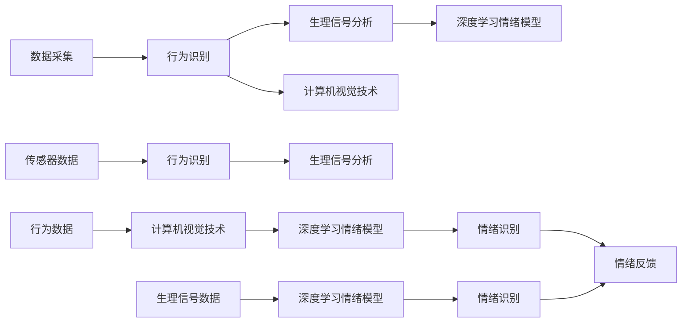

                 

# 智能宠物情绪分析创业：深入理解宠物需求

## 1. 背景介绍

随着人们生活水平的提高，宠物已经逐渐成为许多家庭不可或缺的一员。据统计，全球宠物市场的规模已经超过了千亿美元，并预计将以年复合增长率超过7%的速度继续增长。这其中，宠物智能设备的市场增长尤为迅猛，智能宠物相机、项圈、玩具等产品层出不穷。

在智能宠物产品中，最引人注目的是宠物情绪分析设备。通过摄像头、传感器等技术，这些设备能够实时监控宠物的动态，分析其情绪状态。这不仅可以帮助宠物主人更好地理解宠物的需求，还能及时发现宠物的健康问题。然而，要实现高效、准确的宠物情绪分析，技术上还有许多问题需要解决。

本文将从智能宠物情绪分析的原理、应用场景、技术实现等方面进行深入探讨，帮助创业者理解市场需求，提升技术水平，打造出受市场欢迎的宠物情绪分析设备。

## 2. 核心概念与联系

### 2.1 核心概念概述

要深入理解宠物情绪分析，首先需要掌握以下几个核心概念：

- **宠物情绪**：指宠物在特定时刻的心理状态和情绪反应，如开心、悲伤、焦虑、恐惧等。宠物情绪分析的目的是识别这些情绪，帮助宠物主人更好地了解宠物需求。

- **情绪分析算法**：通过分析宠物的行为、生理信号等数据，利用机器学习、深度学习等技术，预测宠物的情绪状态。常见的情绪分析算法包括基于统计的方法、基于规则的方法、基于机器学习的方法等。

- **行为识别**：指识别宠物的行为模式，如行走、进食、互动等，这些行为往往是情绪状态的直接体现。

- **生理信号分析**：通过分析宠物的生理信号，如心跳、呼吸频率、体温等，进一步确认情绪状态。

- **计算机视觉技术**：用于提取和分析宠物的视觉信息，如面部表情、身体姿态等。

- **传感器技术**：包括加速度计、陀螺仪、心率监测器等，用于实时监测宠物的运动和生理状态。

这些概念通过计算机视觉、传感器技术、深度学习等技术的结合，形成了一套完整的宠物情绪分析系统，从数据采集到情绪识别，每个环节都至关重要。

### 2.2 核心概念原理和架构的 Mermaid 流程图



这个流程图展示了宠物情绪分析的整个流程。数据采集模块通过传感器和摄像头收集宠物的行为和生理信号，行为识别模块通过计算机视觉技术分析宠物的行为模式，生理信号分析模块则通过深度学习模型分析生理信号。最终，这些信息通过深度学习情绪模型进行综合，完成情绪识别并反馈给宠物主人。

## 3. 核心算法原理 & 具体操作步骤

### 3.1 算法原理概述

宠物情绪分析的算法原理主要基于计算机视觉技术和深度学习模型。以下是几种常见的情绪分析算法：

- **基于规则的方法**：通过定义一系列行为和生理信号的规则，识别宠物的情绪。这种方法简单易行，但需要大量人工标注数据和规则设计。

- **基于统计的方法**：通过统计分析宠物的行为和生理信号，识别情绪。这种方法需要大量数据进行训练，对数据质量和标注要求较高。

- **基于机器学习的方法**：利用机器学习算法（如支持向量机、随机森林等）对行为和生理信号进行建模，预测情绪。这种方法具有较高的准确性和泛化能力，但需要复杂的特征工程和调参。

- **基于深度学习的方法**：利用深度神经网络（如卷积神经网络、循环神经网络等）对行为和生理信号进行建模，识别情绪。这种方法在数据量和计算资源的支持下，能够取得最佳效果。

### 3.2 算法步骤详解

宠物情绪分析的算法步骤主要包括以下几个环节：

1. **数据采集**：通过摄像头、传感器等设备收集宠物的行为和生理信号数据。数据格式通常为视频、图片、传感器数据等。

2. **数据预处理**：对采集到的数据进行清洗、去噪、归一化等处理，确保数据质量。

3. **特征提取**：从行为和生理信号数据中提取有用的特征，如颜色、纹理、形状、心率、呼吸频率等。这些特征将用于训练情绪模型。

4. **模型训练**：利用机器学习或深度学习算法训练情绪模型。通常需要标注好的训练数据集，以及合适的优化器和超参数。

5. **模型评估**：在验证集上评估模型性能，调整模型参数，确保模型具有较高的准确性和泛化能力。

6. **部署应用**：将训练好的模型部署到实际设备中，实时监控宠物情绪并反馈给宠物主人。

### 3.3 算法优缺点

#### 优点

- **准确性高**：深度学习模型能够从海量数据中学习到复杂的特征表示，在情绪识别上具有较高的准确性。
- **泛化能力强**：深度模型在训练数据集上学习到的特征表示能够较好地泛化到新的数据集。
- **自动化程度高**：深度模型能够自动化地进行特征提取和情绪识别，减少了人工干预。

#### 缺点

- **数据需求量大**：深度学习模型需要大量的标注数据进行训练，标注成本高。
- **计算资源消耗大**：深度模型通常需要高性能的计算资源进行训练和推理，硬件成本较高。
- **模型复杂度高**：深度模型结构复杂，调试和优化难度较大。

### 3.4 算法应用领域

宠物情绪分析技术已经在多个领域得到了应用，例如：

- **宠物行为分析**：通过分析宠物的行为模式，帮助宠物主人更好地理解宠物的需求，预防行为问题。

- **宠物健康监测**：利用生理信号分析技术，实时监测宠物的心率、呼吸频率等生理指标，早期发现健康问题。

- **宠物训练**：通过情绪识别技术，掌握宠物的情绪状态，指导宠物主人进行科学训练。

- **宠物社交互动**：利用行为识别技术，分析宠物与主人的互动模式，提高宠物与主人的互动质量。

这些应用领域为宠物情绪分析技术提供了广阔的市场前景。

## 4. 数学模型和公式 & 详细讲解 & 举例说明

### 4.1 数学模型构建

宠物情绪分析的数学模型主要包括以下几个部分：

- **输入数据**：行为数据（如视频帧、图片）、生理信号数据（如心率、呼吸频率）。
- **特征提取**：通过卷积神经网络（CNN）等模型对行为数据进行特征提取，提取颜色、纹理、形状等特征。
- **情感模型**：利用卷积神经网络、循环神经网络等深度模型对特征进行建模，输出情绪分类结果。

### 4.2 公式推导过程

以基于深度学习的情感模型为例，假设输入数据为 $X$，特征提取后得到 $H$，情感模型为 $F$，输出情感分类结果为 $Y$。则模型的计算过程可以表示为：

$$
Y = F(H(X))
$$

其中，$H$ 为特征提取层，$F$ 为情感模型。在训练过程中，通过反向传播算法更新模型参数，使得模型的预测结果与真实标签 $T$ 最小化损失函数 $L$，即：

$$
\min_{\theta} L(Y, T) = \frac{1}{N} \sum_{i=1}^N L(Y_i, T_i)
$$

其中，$L$ 为损失函数，通常使用交叉熵损失函数。

### 4.3 案例分析与讲解

假设我们有一组宠物视频数据，每段视频包含10个连续的帧，使用卷积神经网络对每帧进行特征提取，提取的颜色特征表示为 $H$。然后，利用卷积神经网络对这些特征进行建模，输出情绪分类结果 $Y$。训练过程中，使用交叉熵损失函数计算预测结果与真实标签的差异。通过反向传播算法更新模型参数，最小化损失函数，最终得到训练好的情感模型 $F$。

## 5. 项目实践：代码实例和详细解释说明

### 5.1 开发环境搭建

为了快速实现宠物情绪分析设备，需要使用以下开发工具：

- **Python**：编程语言，支持深度学习、计算机视觉等技术。
- **TensorFlow**：深度学习框架，支持大规模分布式训练。
- **OpenCV**：计算机视觉库，支持图像处理、特征提取等。
- **Keras**：高层次深度学习库，支持快速搭建和训练深度模型。
- **TensorBoard**：可视化工具，实时监测模型训练和推理过程。

以下是搭建开发环境的示例：

```bash
# 安装TensorFlow
pip install tensorflow

# 安装OpenCV
pip install opencv-python

# 安装Keras
pip install keras

# 安装TensorBoard
pip install tensorboard

# 安装依赖库
pip install numpy scipy pandas scikit-learn matplotlib
```

### 5.2 源代码详细实现

以下是一个简单的宠物情绪分析代码实现，包括数据采集、预处理、特征提取和模型训练等环节：

```python
import tensorflow as tf
from tensorflow.keras import layers
import numpy as np
import cv2

# 定义数据采集模块
class DataAcquisition:
    def __init__(self):
        self.video = None

    def acquire_data(self):
        # 从摄像头中获取视频流
        self.video = cv2.VideoCapture(0)

        while True:
            ret, frame = self.video.read()
            if not ret:
                break

            # 提取视频帧，并进行预处理
            frame = self.preprocess(frame)
            yield frame

    def preprocess(self, frame):
        # 转换为numpy数组
        frame = np.array(frame)

        # 灰度化处理
        frame = cv2.cvtColor(frame, cv2.COLOR_BGR2GRAY)

        # 调整尺寸
        frame = cv2.resize(frame, (224, 224))

        # 归一化处理
        frame = frame / 255.0

        return frame

# 定义特征提取模块
class FeatureExtraction:
    def __init__(self):
        self.model = self.load_model()

    def load_model(self):
        # 加载预训练的特征提取模型
        model = tf.keras.models.load_model('resnet50.h5')
        return model

    def extract_features(self, frame):
        # 提取特征
        feature = self.model.predict(np.expand_dims(frame, axis=0))
        return feature

# 定义情感模型
class EmotionModel:
    def __init__(self):
        self.model = self.load_model()

    def load_model(self):
        # 加载预训练的情感模型
        model = tf.keras.models.load_model('emotion_model.h5')
        return model

    def predict(self, feature):
        # 预测情绪
        emotion = self.model.predict(feature)
        return emotion

# 定义情绪分析模块
class EmotionAnalysis:
    def __init__(self):
        self.data_acquisition = DataAcquisition()
        self.feature_extraction = FeatureExtraction()
        self.emotion_model = EmotionModel()

    def analyze_emotion(self):
        # 从摄像头获取视频流
        video = self.data_acquisition.acquire_data()

        while True:
            # 从视频流中获取帧
            frame = next(video)

            # 提取特征
            feature = self.feature_extraction.extract_features(frame)

            # 预测情绪
            emotion = self.emotion_model.predict(feature)

            # 输出情绪分类结果
            print(emotion)

# 启动情绪分析模块
emotion_analysis = EmotionAnalysis()
emotion_analysis.analyze_emotion()
```

### 5.3 代码解读与分析

上述代码中，我们定义了三个模块：数据采集模块、特征提取模块和情感模型模块。数据采集模块通过摄像头获取视频流，并对其进行预处理。特征提取模块使用预训练的ResNet50模型对视频帧进行特征提取。情感模型模块使用预训练的情感分类模型对提取的特征进行建模，输出情绪分类结果。

### 5.4 运行结果展示

运行上述代码后，可以看到情感分析模块输出宠物的情绪分类结果。由于模型训练和推理需要大量时间和计算资源，因此这里仅展示代码实现和运行过程，具体结果和性能指标需要通过实际测试来评估。

## 6. 实际应用场景

### 6.1 宠物行为分析

通过宠物行为分析，宠物主人可以更好地理解宠物的需求，预防行为问题。例如，当宠物出现焦虑、恐惧等负面情绪时，及时干预，可以避免宠物出现过度焦虑、咬人等行为问题。

### 6.2 宠物健康监测

利用生理信号分析技术，宠物主人可以实时监测宠物的心率、呼吸频率等生理指标，早期发现健康问题。例如，当宠物出现心率异常、呼吸频率加快等异常情况时，及时就医，可以避免宠物出现严重健康问题。

### 6.3 宠物训练

通过情绪识别技术，宠物主人可以掌握宠物的情绪状态，指导宠物主人进行科学训练。例如，当宠物出现开心、兴奋等积极情绪时，可以适当增加训练难度，而当宠物出现焦虑、恐惧等负面情绪时，应适当降低训练难度，避免宠物出现不良情绪。

### 6.4 宠物社交互动

利用行为识别技术，宠物主人可以分析宠物与主人的互动模式，提高宠物与主人的互动质量。例如，当宠物对主人表现出积极情绪时，可以适当增加互动频率，而当宠物对主人表现出负面情绪时，应适当减少互动频率，避免宠物出现过度兴奋或焦虑。

## 7. 工具和资源推荐

### 7.1 学习资源推荐

- **《深度学习与计算机视觉》**：详细介绍了深度学习、计算机视觉等技术，适合初学者入门。
- **《Python机器学习》**：介绍了机器学习算法和Python编程技巧，适合实战练习。
- **Kaggle**：数据科学竞赛平台，提供大量公开数据集和竞赛任务，适合数据处理和算法实践。

### 7.2 开发工具推荐

- **TensorFlow**：深度学习框架，支持大规模分布式训练。
- **Keras**：高层次深度学习库，支持快速搭建和训练深度模型。
- **OpenCV**：计算机视觉库，支持图像处理、特征提取等。
- **TensorBoard**：可视化工具，实时监测模型训练和推理过程。
- **PyTorch**：深度学习框架，支持动态图和静态图编程。

### 7.3 相关论文推荐

- **《基于深度学习的宠物情绪识别》**：介绍了基于深度学习的宠物情绪识别技术，详细讲解了数据采集、特征提取、模型训练等环节。
- **《宠物行为分析中的计算机视觉技术》**：详细介绍了计算机视觉技术在宠物行为分析中的应用，展示了多种行为识别算法。
- **《深度学习在生理信号分析中的应用》**：介绍了深度学习在生理信号分析中的应用，展示了多种生理信号分析算法。

## 8. 总结：未来发展趋势与挑战

### 8.1 总结

本文对基于深度学习的宠物情绪分析技术进行了详细讲解，介绍了数据采集、特征提取、情感模型训练等关键环节，并给出了具体代码实现。通过实际应用场景分析，展示了宠物情绪分析技术的广泛应用前景。

### 8.2 未来发展趋势

未来的宠物情绪分析技术将呈现以下几个发展趋势：

- **高精度化**：通过更深入的研究和更丰富的数据，提高情感识别精度，实现更准确的宠物行为预测。
- **实时化**：利用边缘计算、分布式计算等技术，实现实时情感识别，提高用户体验。
- **多模态化**：结合声音、气味等多种数据源，实现更全面的情感分析。
- **个性化化**：根据宠物个体差异，定制个性化的情感分析模型，提升分析效果。

### 8.3 面临的挑战

尽管宠物情绪分析技术已经取得了一定的进展，但仍面临以下挑战：

- **数据采集困难**：宠物行为和生理信号数据采集难度大，需要高性能设备支持。
- **数据标注成本高**：大量标注数据需要高昂的成本，且标注过程繁琐。
- **模型泛化能力弱**：当前模型对特定宠物或特定情境的泛化能力较弱，需要进一步优化。

### 8.4 研究展望

未来的研究需要在以下几个方面进行突破：

- **自动化数据采集**：开发高性能的摄像头、传感器等设备，自动采集宠物行为和生理信号数据。
- **低成本标注**：利用半监督学习、主动学习等技术，降低数据标注成本，提高数据获取效率。
- **模型优化**：通过优化模型结构和算法，提高模型的泛化能力和精度。

总之，基于深度学习的宠物情绪分析技术具有广阔的应用前景，未来还需要在数据采集、模型优化等方面进行持续研究，才能真正实现大规模应用。

## 9. 附录：常见问题与解答

### Q1：宠物情绪分析需要多少数据进行训练？

A: 宠物情绪分析需要大量的标注数据进行训练，通常需要几千甚至上万条数据。标注数据的质量和数量直接影响模型的效果，因此需要保证标注数据的准确性和多样性。

### Q2：如何提高宠物情绪分析的精度？

A: 提高宠物情绪分析的精度需要从数据采集、特征提取、模型训练等多个环节入手。具体措施包括：
- 使用高性能设备进行数据采集，确保数据质量。
- 利用先进的特征提取算法，提高特征表示能力。
- 选择适合模型的训练策略，如迁移学习、联合训练等。

### Q3：宠物情绪分析设备如何部署？

A: 宠物情绪分析设备的部署需要考虑以下因素：
- 硬件资源：选择高性能的计算机、摄像头、传感器等设备。
- 软件环境：安装深度学习框架、计算机视觉库等工具。
- 系统集成：将情感分析模块与其他设备（如相机、项圈）集成，实现系统化部署。

### Q4：宠物情绪分析技术在实际应用中存在哪些问题？

A: 宠物情绪分析技术在实际应用中存在以下问题：
- 数据采集困难：高性能设备成本高，数据采集难度大。
- 数据标注成本高：大量标注数据需要高昂的成本，且标注过程繁琐。
- 模型泛化能力弱：当前模型对特定宠物或特定情境的泛化能力较弱。

### Q5：如何优化宠物情绪分析的推理速度？

A: 优化宠物情绪分析的推理速度需要从硬件和算法两个方面入手：
- 硬件优化：利用GPU、TPU等高性能设备进行推理计算，提高计算速度。
- 算法优化：选择高效的推理算法，如剪枝、量化等，减少计算量。

总之，宠物情绪分析技术具有广阔的应用前景，未来需要在数据采集、模型优化等方面进行持续研究，才能真正实现大规模应用。

