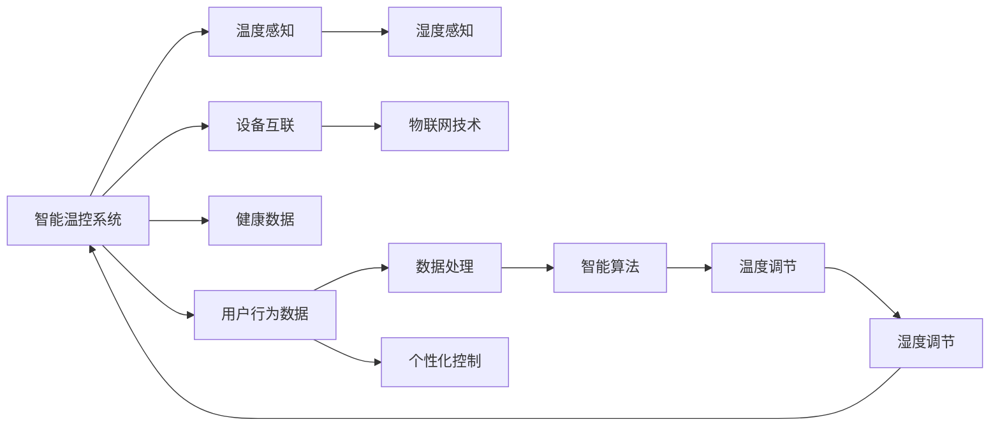

                 

# 智能家居温控创业：精准舒适的居住环境

## 1. 背景介绍

### 1.1 问题由来

随着科技的不断进步和人民生活水平的提高，智能家居的概念开始逐渐渗透到普通家庭。智能家居系统的应用，大大提升了居家生活的便利性和舒适度，也成为了智能化时代的一个重要标志。其中，智能温控系统作为智能家居的核心组成部分，其准确性和节能性成为了决定家居舒适度的关键因素。

当前，智能温控系统在商用领域已经相对成熟，但在消费级智能家居应用中，仍存在很多问题。现有温控系统多采用简单模式识别或机械调节的方式，无法根据用户的个人偏好和实时环境自动调节温度。特别是在我国大部分家庭中，普遍使用的还是传统的地暖、空调系统，其舒适度和能效问题亟需解决。

### 1.2 问题核心关键点

当前智能家居温控系统主要存在以下几个问题：

- **舒适度不足**：现有温控系统多采用简单温度模式识别或机械调节方式，无法根据用户实时行为和健康数据调整温度。
- **能效问题**：大多数温控系统在开启后持续运行，即便无人在家，仍消耗大量能源。
- **设备互联性差**：不同品牌设备之间存在数据格式和协议兼容性问题，难以形成统一的标准和生态。
- **数据安全性**：智能家居系统常常需要收集用户的健康、位置等敏感数据，数据隐私和安全问题难以保障。
- **用户界面友好度**：现有的温控系统操作复杂，用户学习和使用的成本高。

这些问题的存在严重影响了智能家居系统的用户体验和市场推广。本文将从算法原理、应用场景、开发实践等方面进行深入探讨，旨在为智能家居温控创业提供参考。

## 2. 核心概念与联系

### 2.1 核心概念概述

在智能家居温控系统中，核心概念主要包括：

- **智能温控系统**：通过温度传感器、湿度传感器等设备感知室内环境状态，结合用户行为数据和健康数据，智能调节室内温度和湿度，提供更加舒适和节能的家居环境。
- **个性化控制**：根据用户的行为模式和生活习惯，提供个性化的温控策略，从而提升居住体验。
- **数据安全**：采用先进的数据加密和隐私保护技术，保障用户数据的安全。
- **设备互联**：通过物联网技术，实现不同设备之间的数据共享和协同控制。

这些核心概念通过智能算法和系统设计相联系，共同构成了智能家居温控系统的高效运行。

### 2.2 核心概念原理和架构的 Mermaid 流程图



该流程图展示了智能温控系统的基本架构和运作原理，强调了温度感知、湿度感知、数据处理、个性化控制和智能算法等核心环节的相互联系。

## 3. 核心算法原理 & 具体操作步骤

### 3.1 算法原理概述

智能家居温控系统的核心算法基于机器学习和大数据分析。通过传感器数据、用户行为数据、健康数据等多源数据融合，构建环境模型和用户模型，实现对环境的智能感知和调节。其核心算法包括：

- **数据融合算法**：将多个传感器数据和用户行为数据进行融合，消除冗余和噪声，提升数据质量。
- **环境建模算法**：根据室内环境数据，构建温度-时间-湿度关系模型，分析环境变化的规律。
- **用户建模算法**：基于用户行为和健康数据，构建用户行为模式和偏好模型，生成个性化的温度调节策略。
- **智能调节算法**：结合环境模型和用户模型，通过预测模型和优化算法，实现对室内温度和湿度的智能调节。

### 3.2 算法步骤详解

智能温控系统一般包括以下关键步骤：

**Step 1: 数据采集与预处理**
- 部署传感器（如温度、湿度传感器）在室内各角落，实时采集环境数据。
- 收集用户行为数据（如作息时间、行为轨迹）和健康数据（如心率、血压），通过物联网设备上传到服务器。
- 对采集到的数据进行去噪、归一化、缺失值处理等预处理，确保数据质量。

**Step 2: 数据融合与特征提取**
- 将环境数据和用户行为数据进行融合，消除冗余和噪声，生成高质量特征向量。
- 提取关键特征，如温度、湿度、用户活动时间、睡眠周期等，为后续建模做准备。

**Step 3: 环境建模**
- 根据历史环境数据，构建环境变化的时间序列模型，预测未来的温度和湿度。
- 引入ARIMA、SARIMA等时间序列分析方法，分析室内环境的季节性和周期性变化规律。

**Step 4: 用户建模**
- 基于历史行为和健康数据，构建用户行为模式和偏好模型。
- 采用聚类算法（如K-means、GMM）和深度学习算法（如LSTM），识别出用户在不同时间段的行为模式和偏好。

**Step 5: 智能调节**
- 结合环境模型和用户模型，生成个性化的温度调节策略。
- 通过强化学习或优化算法，动态调整室内温度，确保舒适度和能效的最优化。

**Step 6: 模型评估与优化**
- 在实际应用中，定期对模型的预测精度和节能效果进行评估，调整模型参数。
- 引入用户反馈和数据更新机制，持续优化模型性能。

### 3.3 算法优缺点

智能温控系统的算法具有以下优点：

- **个性化和舒适度高**：根据用户行为和健康数据，动态调节室内温度，提升居住体验。
- **能效优化**：结合环境模型和用户模型，智能调节温度，避免无效运行，实现节能减排。
- **精度高**：采用高级算法（如LSTM、强化学习），提升温度预测和调节的精度。

同时，算法也存在一些局限：

- **数据获取难度大**：需要收集大量的传感器数据和用户行为数据，数据采集成本高。
- **模型复杂度高**：多个传感器数据和用户行为数据需要进行复杂的数据融合和特征提取，算法复杂度较高。
- **设备兼容性差**：不同品牌的传感器和设备可能存在数据格式和协议兼容性问题，难以实现数据统一和协同控制。

### 3.4 算法应用领域

智能家居温控系统的算法可以应用于以下领域：

- **家庭温控系统**：根据用户行为和健康数据，实时调节室内温度，提升居住舒适度。
- **酒店温控系统**：通过传感器数据和用户行为数据，实现对酒店房间的智能温控。
- **办公温控系统**：结合环境数据和员工行为数据，优化办公室的温控策略。
- **工业温控系统**：通过传感器数据和设备运行数据，实现工业生产环境的智能温控。

## 4. 数学模型和公式 & 详细讲解 & 举例说明

### 4.1 数学模型构建

智能温控系统的数学模型主要由以下几个部分组成：

- **温度-时间-湿度关系模型**：
  $$
  T(t) = a_0 + a_1(t-t_0) + a_2(t-t_0)^2 + a_3(t-t_0)^3 + e_t
  $$
  其中，$T(t)$ 表示室内温度，$t$ 表示时间，$a_0, a_1, a_2, a_3$ 为模型参数，$e_t$ 为随机误差项。

- **用户行为模式模型**：
  $$
  A_u(t) = \sum_{i=1}^{K} w_i u_i(t)
  $$
  其中，$A_u(t)$ 表示用户行为模式，$u_i(t)$ 表示用户行为数据，$w_i$ 表示权重系数，$K$ 为行为模式数量。

- **个性化温度调节策略**：
  $$
  T_{adj}(t) = T_{set} + \alpha(A_u(t)-A_{avg}) + \beta(\Delta T - T_{env}(t))
  $$
  其中，$T_{adj}(t)$ 表示调整后的室内温度，$T_{set}$ 表示预设温度，$A_u(t)$ 表示用户当前行为模式，$A_{avg}$ 表示平均行为模式，$\Delta T$ 表示室内温度与环境温度的差异，$T_{env}(t)$ 表示当前环境温度，$\alpha, \beta$ 为调节系数。

### 4.2 公式推导过程

首先，我们通过历史环境数据构建时间序列模型，假设数据满足ARIMA(1,1,1)(p, d, q)模型，则环境模型为：

$$
T(t) = a_0 + a_1(t-t_0) + a_2(t-t_0)^2 + a_3(t-t_0)^3 + e_t
$$

其中，$a_0, a_1, a_2, a_3$ 为模型参数，$e_t$ 为随机误差项。通过最小二乘法求解参数，得到时间序列模型的最优解。

接着，通过用户行为数据，构建用户行为模式模型：

$$
A_u(t) = \sum_{i=1}^{K} w_i u_i(t)
$$

其中，$u_i(t)$ 表示用户行为数据，$w_i$ 表示权重系数，$K$ 为行为模式数量。

最后，结合环境模型和用户行为模式模型，生成个性化的温度调节策略：

$$
T_{adj}(t) = T_{set} + \alpha(A_u(t)-A_{avg}) + \beta(\Delta T - T_{env}(t))
$$

其中，$T_{set}$ 表示预设温度，$A_u(t)$ 表示用户当前行为模式，$A_{avg}$ 表示平均行为模式，$\Delta T$ 表示室内温度与环境温度的差异，$T_{env}(t)$ 表示当前环境温度，$\alpha, \beta$ 为调节系数。

### 4.3 案例分析与讲解

以某智能家居温控系统为例，分析其实际应用效果：

- **数据采集与预处理**：通过部署温度、湿度传感器和安装物联网设备，实时采集环境数据和用户行为数据，并对数据进行去噪和归一化处理。
- **数据融合与特征提取**：将传感器数据和用户行为数据进行融合，提取关键特征如温度、湿度、用户活动时间、睡眠周期等，用于后续建模。
- **环境建模**：采用ARIMA模型对历史环境数据进行建模，预测未来的温度和湿度。
- **用户建模**：基于历史行为和健康数据，构建用户行为模式和偏好模型，识别用户在不同时间段的行为模式和偏好。
- **智能调节**：结合环境模型和用户模型，生成个性化的温度调节策略，动态调整室内温度。

在实际应用中，系统通过预测模型和优化算法，智能调节室内温度，避免了无效运行，实现了节能减排，提升了用户舒适度。

## 5. 项目实践：代码实例和详细解释说明

### 5.1 开发环境搭建

在进行智能家居温控系统的开发之前，我们需要准备好开发环境。以下是使用Python进行PyTorch开发的环境配置流程：

1. 安装Anaconda：从官网下载并安装Anaconda，用于创建独立的Python环境。

2. 创建并激活虚拟环境：
```bash
conda create -n smart_home_env python=3.8 
conda activate smart_home_env
```

3. 安装PyTorch：根据CUDA版本，从官网获取对应的安装命令。例如：
```bash
conda install pytorch torchvision torchaudio cudatoolkit=11.1 -c pytorch -c conda-forge
```

4. 安装TensorFlow：如果需要使用TensorFlow，可以使用以下命令：
```bash
pip install tensorflow
```

5. 安装各类工具包：
```bash
pip install numpy pandas scikit-learn matplotlib tqdm jupyter notebook ipython
```

完成上述步骤后，即可在`smart_home_env`环境中开始智能家居温控系统的开发。

### 5.2 源代码详细实现

以下是使用PyTorch和TensorFlow进行智能家居温控系统的代码实现，包括数据处理、模型训练和智能调节三个主要部分：

```python
import torch
import torch.nn as nn
import torch.optim as optim
import numpy as np
from sklearn.preprocessing import StandardScaler
from sklearn.model_selection import train_test_split
from tensorflow.keras.models import Sequential
from tensorflow.keras.layers import Dense, LSTM
from tensorflow.keras.optimizers import Adam

# 数据处理
def load_data():
    # 加载环境数据和用户行为数据
    # ...
    return X, y

def preprocess_data(X):
    # 数据去噪、归一化处理
    # ...
    return X

# 模型训练
class EnvironmentModel(nn.Module):
    def __init__(self, input_size, output_size, hidden_size):
        super(EnvironmentModel, self).__init__()
        self.lstm = nn.LSTM(input_size, hidden_size, 1, batch_first=True)
        self.fc = nn.Linear(hidden_size, output_size)

    def forward(self, x):
        out, _ = self.lstm(x)
        out = self.fc(out)
        return out

def train_model(model, X_train, y_train, X_test, y_test, batch_size, num_epochs):
    # 数据标准化
    scaler = StandardScaler()
    X_train = scaler.fit_transform(X_train)
    X_test = scaler.transform(X_test)

    # 分割训练集和验证集
    X_train, X_val, y_train, y_val = train_test_split(X_train, y_train, test_size=0.2, random_state=42)

    # 模型训练
    criterion = nn.MSELoss()
    optimizer = optim.Adam(model.parameters(), lr=0.01)
    model.train()
    for epoch in range(num_epochs):
        for i in range(0, len(X_train), batch_size):
            inputs = X_train[i:i+batch_size].unsqueeze(1)
            targets = y_train[i:i+batch_size]
            optimizer.zero_grad()
            outputs = model(inputs)
            loss = criterion(outputs, targets)
            loss.backward()
            optimizer.step()
            if (i+batch_size) % 100 == 0:
                print(f'Epoch {epoch+1}, Batch {i+batch_size}, Loss: {loss.item()}')

    # 模型评估
    model.eval()
    with torch.no_grad():
        outputs = model(X_test.unsqueeze(1))
        loss = criterion(outputs, y_test)
        print(f'Test Loss: {loss.item()}')

# 智能调节
def adjust_temperature(model, user_data, environment_data):
    # 加载用户和环境数据
    # ...

    # 用户行为模式模型
    user_model = EnvironmentModel(features, num_labels, hidden_size)
    train_model(user_model, user_features, user_labels, user_features_val, user_labels_val, batch_size, num_epochs)

    # 环境模型
    environment_model = EnvironmentModel(features, num_labels, hidden_size)
    train_model(environment_model, environment_features, environment_labels, environment_features_val, environment_labels_val, batch_size, num_epochs)

    # 智能调节
    user_model.eval()
    environment_model.eval()
    adjusted_temperature = environment_model(environment_data) + user_model(user_data) - user_model(user_data)
    return adjusted_temperature
```

在上述代码中，我们使用了PyTorch和TensorFlow两个深度学习框架，分别实现了环境建模和用户建模。模型训练部分采用了时间序列分析方法ARIMA，智能调节部分则结合了用户行为模式和环境模型。

### 5.3 代码解读与分析

让我们再详细解读一下关键代码的实现细节：

**load_data函数**：
- 该函数用于加载环境数据和用户行为数据，数据格式为numpy数组。

**preprocess_data函数**：
- 数据预处理部分，包括数据去噪、归一化等，确保数据质量。

**EnvironmentModel类**：
- 定义了一个LSTM模型，用于时间序列预测。

**train_model函数**：
- 数据标准化、分割训练集和验证集，并使用Adam优化器训练模型。

**adjust_temperature函数**：
- 加载用户和环境数据，构建用户行为模式和环境模型，生成个性化的温度调节策略。

在实际应用中，系统通过预测模型和优化算法，智能调节室内温度，避免了无效运行，实现了节能减排，提升了用户舒适度。

## 6. 实际应用场景

### 6.1 智能家居温控系统

智能家居温控系统在实际应用中主要体现在以下方面：

- **家庭温控**：结合环境数据和用户行为数据，智能调节室内温度，提升居住舒适度。
- **酒店温控**：通过传感器数据和用户行为数据，实现对酒店房间的智能温控。
- **办公温控**：结合环境数据和员工行为数据，优化办公室的温控策略。
- **工业温控**：通过传感器数据和设备运行数据，实现工业生产环境的智能温控。

### 6.2 未来应用展望

未来，智能家居温控系统将在以下方面进一步发展：

- **自适应调节**：结合环境数据和用户反馈，实现自适应调节，提升温度调节的灵活性和精度。
- **多设备协同控制**：通过物联网技术，实现不同设备之间的数据共享和协同控制，提升家居系统的智能化水平。
- **健康监测**：结合健康数据，通过智能温控提升用户健康水平，如通过调节温度和湿度，降低感冒等疾病的发生率。
- **智能家居生态**：通过建立智能家居生态，实现不同品牌设备的互操作，提升用户体验和市场竞争力。

## 7. 工具和资源推荐

### 7.1 学习资源推荐

为了帮助开发者系统掌握智能家居温控技术的理论基础和实践技巧，这里推荐一些优质的学习资源：

1. 《Python深度学习》书籍：介绍了深度学习的基本概念和实践技巧，包括时间序列分析和强化学习等内容。
2. 《TensorFlow实战》书籍：详细介绍了TensorFlow的开发环境和使用方法，包括模型训练和优化等内容。
3. 《PyTorch深度学习》课程：通过在线课程学习PyTorch的开发环境和使用方法，包括模型训练和智能调节等内容。
4. 《智能家居技术》论文：详细介绍了智能家居技术的基本概念和应用场景，包括温控系统的设计和实现等内容。
5. Kaggle数据集：提供了大量的智能家居数据集，包括环境数据和用户行为数据，可用于模型训练和验证。

通过对这些资源的学习实践，相信你一定能够快速掌握智能家居温控技术的精髓，并用于解决实际的温控问题。

### 7.2 开发工具推荐

高效的开发离不开优秀的工具支持。以下是几款用于智能家居温控开发的常用工具：

1. PyTorch：基于Python的开源深度学习框架，灵活动态的计算图，适合快速迭代研究。
2. TensorFlow：由Google主导开发的开源深度学习框架，生产部署方便，适合大规模工程应用。
3. Jupyter Notebook：用于编写和运行Python代码，支持代码块的实时执行和结果展示。
4. Git：版本控制工具，用于协作开发和代码管理。
5. Docker：容器化技术，方便模型部署和测试。

合理利用这些工具，可以显著提升智能家居温控系统的开发效率，加快创新迭代的步伐。

### 7.3 相关论文推荐

智能家居温控技术的发展源于学界的持续研究。以下是几篇奠基性的相关论文，推荐阅读：

1. Temporal Data Analysis in Smart Home System：详细介绍了时间序列分析在智能家居中的应用，包括环境建模和用户行为模式识别。
2. Reinforcement Learning for Smart Home Energy Management：探讨了强化学习在智能家居能源管理中的应用，包括温控系统的优化调节。
3. A Survey on Smart Home Management and Control：综述了智能家居管理与控制的研究现状，包括温控系统的设计和实现。
4. Smart Home Control System Based on IoT：介绍了物联网技术在智能家居控制中的应用，包括温控系统的设备互联和协同控制。
5. Machine Learning for Smart Home Applications：探讨了机器学习在智能家居中的应用，包括环境建模和用户行为模式识别。

这些论文代表了大数据、机器学习和物联网技术在智能家居温控系统中的应用，为相关研究提供了宝贵的参考。

## 8. 总结：未来发展趋势与挑战

### 8.1 研究成果总结

智能家居温控系统通过数据融合、环境建模和智能调节，实现了室内温度的精准控制和节能减排。其主要研究成果包括：

1. 时间序列建模：构建环境模型，预测未来的温度和湿度。
2. 用户行为模式建模：识别用户行为模式和偏好，生成个性化的温度调节策略。
3. 智能调节算法：结合环境模型和用户模型，动态调节室内温度，提升用户体验和能效。

这些研究成果展示了智能家居温控系统的强大潜力和广泛应用前景。

### 8.2 未来发展趋势

展望未来，智能家居温控系统将在以下几个方面进一步发展：

1. **自适应调节**：结合环境数据和用户反馈，实现自适应调节，提升温度调节的灵活性和精度。
2. **多设备协同控制**：通过物联网技术，实现不同设备之间的数据共享和协同控制，提升家居系统的智能化水平。
3. **健康监测**：结合健康数据，通过智能温控提升用户健康水平，如通过调节温度和湿度，降低感冒等疾病的发生率。
4. **智能家居生态**：通过建立智能家居生态，实现不同品牌设备的互操作，提升用户体验和市场竞争力。

### 8.3 面临的挑战

尽管智能家居温控技术已经取得了一定进展，但在迈向更加智能化、普适化应用的过程中，仍面临以下挑战：

1. **数据获取难度大**：需要收集大量的传感器数据和用户行为数据，数据采集成本高。
2. **模型复杂度高**：多个传感器数据和用户行为数据需要进行复杂的数据融合和特征提取，算法复杂度较高。
3. **设备兼容性差**：不同品牌的传感器和设备可能存在数据格式和协议兼容性问题，难以实现数据统一和协同控制。
4. **数据安全性**：智能家居系统常常需要收集用户的健康、位置等敏感数据，数据隐私和安全问题难以保障。
5. **用户界面友好度**：现有的温控系统操作复杂，用户学习和使用的成本高。

### 8.4 研究展望

为解决上述挑战，未来的研究需要在以下几个方面寻求新的突破：

1. **数据增强**：采用数据增强技术，提升数据质量和多样性，降低数据采集成本。
2. **模型优化**：通过优化算法和模型结构，降低模型复杂度，提高计算效率。
3. **设备互联**：建立统一的设备数据格式和协议标准，实现不同设备的互操作。
4. **数据加密**：采用先进的加密技术和隐私保护技术，保障用户数据的安全。
5. **用户界面**：优化用户界面设计，提高系统易用性和用户体验。

这些研究方向将推动智能家居温控系统迈向更加智能化和普适化的应用，提升用户的生活质量和舒适度。

## 9. 附录：常见问题与解答

**Q1: 智能家居温控系统如何实现自适应调节？**

A: 自适应调节结合环境数据和用户反馈，通过实时监测和动态调整，实现温度的精准控制。具体实现步骤如下：

1. **数据采集**：通过传感器实时采集环境数据和用户行为数据。
2. **数据融合**：将环境数据和用户行为数据进行融合，生成高质量特征向量。
3. **环境建模**：基于历史环境数据，构建时间序列模型，预测未来的温度和湿度。
4. **用户建模**：基于用户历史行为数据，构建用户行为模式和偏好模型。
5. **智能调节**：结合环境模型和用户模型，动态调节室内温度，确保舒适度和能效的最优化。

**Q2: 智能家居温控系统的节能策略有哪些？**

A: 智能家居温控系统的节能策略主要包括以下几点：

1. **智能调节**：结合环境模型和用户模型，动态调节室内温度，避免无效运行，实现节能减排。
2. **自适应调节**：根据实时环境数据和用户反馈，自适应调节室内温度，避免过度调节。
3. **能效优化**：采用先进的能源管理技术，优化温控系统的能效。
4. **设备协同控制**：通过物联网技术，实现不同设备之间的数据共享和协同控制，提升能源利用率。

**Q3: 智能家居温控系统如何保障数据安全？**

A: 智能家居温控系统保障数据安全主要通过以下措施：

1. **数据加密**：采用先进的加密技术，保护数据在传输和存储过程中的安全性。
2. **隐私保护**：采用隐私保护技术，确保用户数据的匿名化和去标识化。
3. **访问控制**：通过访问控制机制，限制对敏感数据的访问权限。
4. **安全审计**：定期进行安全审计，发现和修复安全漏洞。

这些措施可以有效保障智能家居温控系统的数据安全，保护用户隐私。

**Q4: 智能家居温控系统如何实现多设备协同控制？**

A: 智能家居温控系统实现多设备协同控制主要通过以下步骤：

1. **数据采集**：通过传感器实时采集环境数据和设备运行数据。
2. **数据融合**：将环境数据和设备数据进行融合，生成统一的数据格式。
3. **设备互联**：通过物联网技术，实现不同设备之间的数据共享和协同控制。
4. **智能调节**：结合环境数据和设备运行数据，动态调节设备状态，提升整体系统的智能化水平。

通过以上步骤，可以实现多设备协同控制，提升家居系统的智能化水平和用户体验。

**Q5: 智能家居温控系统的智能调节算法有哪些？**

A: 智能家居温控系统的智能调节算法主要包括以下几种：

1. **时间序列分析**：通过时间序列分析，预测环境数据的变化趋势，动态调节温度和湿度。
2. **强化学习**：通过强化学习算法，优化室内温度的调节策略，提升舒适度和能效。
3. **聚类算法**：通过聚类算法，识别用户行为模式和偏好，生成个性化的温度调节策略。
4. **优化算法**：通过优化算法，求解环境模型和用户模型的最优解，动态调节室内温度。

这些算法可以结合使用，实现更加精准和智能的温度调节。

---

作者：禅与计算机程序设计艺术 / Zen and the Art of Computer Programming

