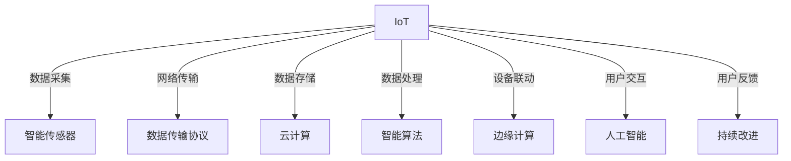

                 

## 1. 背景介绍

### 1.1 行业背景

随着物联网(IoT)和人工智能(AI)技术的飞速发展，智能家居行业正经历着前所未有的变革。智能家居产品通过网络将家中的各类设备如智能灯光、空调、安防摄像头等连接在一起，通过统一的中央控制系统实现远程控制、状态监控、场景联动等功能。智能家居市场逐渐成熟，应用场景不断拓展，从单一的智能控制向智能化、自动化、个性化方向迈进。

根据统计数据，全球智能家居市场规模预计将在未来几年内持续增长，到2025年市场规模有望超过5000亿美元。智能家居不仅为用户带来更便捷的家居生活体验，也为家居企业带来新的增长点，成为创业公司竞相逐鹿的新蓝海。

### 1.2 技术背景

物联网家居的核心技术主要包括智能感知、数据处理、用户交互、设备互联等环节。

- **智能感知**：通过各类传感器收集家中的温度、湿度、光线、人体活动等数据，形成家庭环境的全方位感知。
- **数据处理**：收集到的数据通过智能算法进行分析和处理，生成家庭环境状态和用户行为模式。
- **用户交互**：通过智能手机App、语音助手等手段与用户进行交互，提供可视化、语音化的智能家居体验。
- **设备互联**：智能家居产品通过网关、路由器等设备实现网络互联，构建智能家居生态系统。

### 1.3 创业机遇

智能家居创业公司的核心竞争力在于产品创新、用户体验和商业模式。创业公司可以通过持续技术创新，推出具有差异化竞争优势的智能家居产品，通过打造卓越的用户体验和建立有效的商业模式，实现市场快速渗透和用户大规模增长。

此外，创业公司还需要关注智能家居市场细分领域，如智能厨房、智能安防、智能健康等，瞄准特定的消费群体，提供专业化、个性化的智能家居解决方案。

## 2. 核心概念与联系

### 2.1 核心概念概述

为更好地理解物联网家居的核心产品开发，本节将介绍几个关键概念：

- **物联网(IoT)**：通过传感器、智能设备将家居环境中的各种物理信息收集并互联，实现设备之间的数据互通和协作。
- **人工智能(AI)**：通过算法模型对家居数据进行自动化分析和决策，提升用户体验和生活质量。
- **云计算(Cloud Computing)**：提供大容量存储空间和弹性计算资源，为智能家居系统提供强大后盾。
- **边缘计算(Edge Computing)**：将数据处理任务下沉到智能设备内部，减少数据传输量和网络延迟。
- **智能算法(Smart Algorithms)**：包括机器学习、深度学习、自然语言处理等算法，用于分析和预测家居数据。
- **智能传感器(Smart Sensors)**：如温度、湿度、光照、声音、人体活动等传感器，用于采集家居环境中的各类数据。
- **数据传输协议(Data Transfer Protocols)**：包括WiFi、ZigBee、Bluetooth等协议，用于智能家居设备之间的通信。

这些概念之间相互依存，共同构成了智能家居的生态体系。

### 2.2 核心概念原理和架构的 Mermaid 流程图



这个流程图展示了大规模智能家居系统的工作流程：

1. 智能传感器采集家居环境数据。
2. 通过数据传输协议将数据传输至云端。
3. 云端进行数据存储和预处理。
4. 智能算法对数据进行分析与处理。
5. 边缘计算优化数据处理效率。
6. 人工智能模型进行决策和预测。
7. 用户通过App或语音助手进行交互和反馈。
8. 持续优化系统性能和用户体验。

### 2.3 关键技术架构

核心技术架构包括以下主要模块：

1. **数据采集层**：由各类智能传感器组成，负责采集家居环境数据，如温度、湿度、光线、人体活动等。
2. **数据传输层**：通过WiFi、ZigBee、Bluetooth等协议实现设备间的数据互联和传输。
3. **数据处理层**：在云端对采集的数据进行存储、预处理、分析和模型训练。
4. **设备控制层**：通过智能网关将控制命令发送至智能设备，实现远程控制。
5. **用户交互层**：通过智能手机App或语音助手提供可视化、语音化的智能家居体验。
6. **安全保障层**：采用数据加密、访问控制、异常检测等手段保障智能家居系统的安全。

这些模块相互协作，共同构建了一个高效、安全的智能家居生态系统。

## 3. 核心算法原理 & 具体操作步骤

### 3.1 算法原理概述

物联网家居的核心算法主要集中在数据处理、设备控制和用户体验三个方面。这些算法通过机器学习、深度学习、自然语言处理等技术，实现对家居数据的自动化分析和决策。

#### 3.1.1 数据处理

智能家居系统需要对采集到的各类数据进行清洗、预处理和特征提取，以适应后续分析和模型训练。常见的数据处理方法包括：

- 数据清洗：去除噪声数据和异常数据。
- 数据标准化：对不同量纲的数据进行归一化处理。
- 特征选择：选择最具代表性的特征进行建模。
- 数据增强：通过对数据进行扩充和变换，提高模型泛化能力。

#### 3.1.2 设备控制

智能家居设备需要通过统一的中央控制系统实现远程控制和场景联动。设备控制算法包括：

- 远程控制：通过App或语音助手发送控制命令至智能设备，实现对设备的开关、调节等操作。
- 场景联动：根据用户指令或环境变化，自动执行一系列设备联动操作，如起床、回家等场景。
- 异常检测：实时监测设备状态，及时发现并处理异常情况，如设备故障、网络异常等。

#### 3.1.3 用户体验

用户体验算法旨在通过智能算法提升用户对智能家居系统的满意度和粘性。主要包括：

- 个性化推荐：根据用户行为和偏好，推荐合适的智能家居产品和服务。
- 行为分析：分析用户的使用习惯和偏好，提供定制化的家居体验。
- 语音识别：通过语音助手实现与用户的自然语言交互，提升用户体验。

### 3.2 算法步骤详解

#### 3.2.1 数据采集

数据采集是物联网家居系统的第一步。各类智能传感器采集家居环境数据，数据格式多为模拟信号或数字信号。

#### 3.2.2 数据传输

数据采集后的原始数据需要经过数据传输协议进行传输。数据传输协议根据传输距离和数据量选择合适的协议，如WiFi、ZigBee、Bluetooth等。

#### 3.2.3 数据存储

采集到的数据需要保存在云端，便于后续处理和分析。数据存储需要考虑到存储容量、读取速度、安全防护等因素。

#### 3.2.4 数据处理

数据存储完成后，需要进行数据清洗、标准化、特征提取等预处理步骤，为后续建模提供数据支持。

#### 3.2.5 模型训练

通过深度学习、机器学习等算法，对预处理后的数据进行模型训练。常见的模型包括决策树、随机森林、神经网络等。

#### 3.2.6 设备联动

通过模型训练后的预测结果，实现对智能设备的控制和联动。

#### 3.2.7 用户体验

通过用户交互层，提供可视化、语音化的智能家居体验，不断收集用户反馈，持续改进系统。

### 3.3 算法优缺点

#### 3.3.1 优点

- 自动化程度高：算法能自动处理和分析家居数据，提升用户体验。
- 数据处理能力强：通过机器学习和深度学习，能有效处理大规模数据，提供准确预测。
- 实时性高：算法能在实时环境中进行决策和控制，提升系统响应速度。
- 可扩展性好：算法支持多种数据来源和设备类型，灵活适配各种家居场景。

#### 3.3.2 缺点

- 数据质量依赖高：算法依赖于高质量的家居数据，数据缺失或噪声数据会影响算法效果。
- 模型复杂度高：深度学习等复杂算法需要大量计算资源和时间，模型训练成本较高。
- 用户隐私风险：家居数据涉及用户隐私，算法需要考虑数据安全和隐私保护。
- 设备兼容性差：不同厂商的设备可能使用不同协议，需要适配多种协议。

### 3.4 算法应用领域

物联网家居的核心算法在多个领域都有广泛应用，包括但不限于：

- 智能安防：通过数据分析和预测，提升家居安全防护水平。
- 智能照明：通过智能算法控制灯光亮度、颜色等，提升家居舒适度。
- 智能温控：通过环境数据分析，自动调节室内温度，提升节能效果。
- 智能健康：通过数据监测和分析，提供健康监测和管理方案。
- 智能家电：通过远程控制和场景联动，提升家电的智能化水平。
- 智能场景联动：通过多设备联动，提升家居生活的便捷性和智能化程度。

## 4. 数学模型和公式 & 详细讲解 & 举例说明

### 4.1 数学模型构建

#### 4.1.1 数据处理模型

数据处理模型主要包含以下步骤：

1. **数据清洗**：去除噪声数据和异常数据。
2. **数据标准化**：对不同量纲的数据进行归一化处理。
3. **特征选择**：选择最具代表性的特征进行建模。
4. **数据增强**：通过对数据进行扩充和变换，提高模型泛化能力。

#### 4.1.2 设备控制模型

设备控制模型主要通过机器学习和深度学习算法，实现对智能设备的控制和联动。常见模型包括决策树、随机森林、神经网络等。

#### 4.1.3 用户体验模型

用户体验模型通过自然语言处理、个性化推荐等算法，提升用户对智能家居系统的满意度。

### 4.2 公式推导过程

#### 4.2.1 数据清洗公式

$$
\text{Cleaned Data} = \text{Original Data} \cap \text{Valid Range}
$$

其中，$\text{Cleaned Data}$ 为清洗后的数据，$\text{Original Data}$ 为原始数据，$\text{Valid Range}$ 为数据有效范围。

#### 4.2.2 数据标准化公式

$$
\text{Normalized Data} = \frac{\text{Original Data} - \text{Mean}}{\text{Standard Deviation}}
$$

其中，$\text{Normalized Data}$ 为标准化后的数据，$\text{Original Data}$ 为原始数据，$\text{Mean}$ 为数据均值，$\text{Standard Deviation}$ 为数据标准差。

#### 4.2.3 特征选择公式

$$
\text{Selected Features} = \text{Correlated Features} \cap \text{Statistically Significant Features}
$$

其中，$\text{Selected Features}$ 为选定的特征，$\text{Correlated Features}$ 为相关性高的特征，$\text{Statistically Significant Features}$ 为统计显著的特征。

#### 4.2.4 模型训练公式

$$
\text{Trained Model} = \text{Feature Data} \times \text{Training Algorithm} \rightarrow \text{Predictive Model}
$$

其中，$\text{Trained Model}$ 为训练好的模型，$\text{Feature Data}$ 为特征数据，$\text{Training Algorithm}$ 为训练算法，$\text{Predictive Model}$ 为预测模型。

#### 4.2.5 设备联动公式

$$
\text{Device Control} = \text{Predictive Model} \times \text{Control Algorithm} \rightarrow \text{Device Command}
$$

其中，$\text{Device Control}$ 为设备控制指令，$\text{Predictive Model}$ 为预测模型，$\text{Control Algorithm}$ 为控制算法，$\text{Device Command}$ 为设备指令。

#### 4.2.6 用户体验公式

$$
\text{User Experience} = \text{Predictive Model} \times \text{Interactive Algorithm} \rightarrow \text{User Feedback}
$$

其中，$\text{User Experience}$ 为用户体验，$\text{Predictive Model}$ 为预测模型，$\text{Interactive Algorithm}$ 为交互算法，$\text{User Feedback}$ 为用户反馈。

### 4.3 案例分析与讲解

#### 4.3.1 智能照明控制案例

假设某智能家居系统需要实现智能照明控制，通过数据处理和模型训练，能够根据用户行为和环境数据预测灯光需求。

- **数据采集**：通过智能传感器采集室内光线强度、人体活动等数据。
- **数据处理**：对数据进行清洗、标准化和特征选择。
- **模型训练**：使用决策树模型进行训练，预测用户的灯光需求。
- **设备联动**：将预测结果转换为灯光控制命令，发送至智能灯光设备。
- **用户体验**：通过App和语音助手，提供可视化、语音化的智能照明体验。

#### 4.3.2 智能温控案例

假设某智能家居系统需要实现智能温控，通过数据处理和模型训练，能够根据环境数据预测室内温度需求。

- **数据采集**：通过智能传感器采集室内温度、湿度等数据。
- **数据处理**：对数据进行清洗、标准化和特征选择。
- **模型训练**：使用随机森林模型进行训练，预测室内温度需求。
- **设备联动**：将预测结果转换为空调控制命令，发送至智能空调设备。
- **用户体验**：通过App和语音助手，提供可视化、语音化的智能温控体验。

## 5. 项目实践：代码实例和详细解释说明

### 5.1 开发环境搭建

#### 5.1.1 硬件环境

- **高性能服务器**：用于数据存储和模型训练，推荐配置为8核以上CPU、32GB内存、1TB以上硬盘。
- **智能网关**：用于数据传输和设备联动，推荐使用WiFi6或蓝牙4.0以上标准的智能网关。
- **智能设备**：包括智能灯光、智能空调、智能门锁等，需要支持WiFi、ZigBee等通信协议。

#### 5.1.2 软件环境

- **操作系统**：推荐使用Linux操作系统，如Ubuntu、CentOS等。
- **开发工具**：推荐使用Python和TensorFlow等开源框架。
- **数据管理工具**：推荐使用MySQL或MongoDB等数据库管理系统。

### 5.2 源代码详细实现

#### 5.2.1 数据采集模块

```python
import sensor
import logging

class DataAcquisition:
    def __init__(self):
        self.logger = logging.getLogger(__name__)
        self.sensor_data = {}
    
    def start(self):
        self.logger.info("Data acquisition started.")
        self.sensor_data['temperature'] = sensor.read_temperature()
        self.sensor_data['humidity'] = sensor.read_humidity()
        self.sensor_data['light'] = sensor.read_light_intensity()
        self.logger.info("Data acquisition completed.")

    def stop(self):
        self.logger.info("Data acquisition stopped.")
```

#### 5.2.2 数据传输模块

```python
import network
import logging

class DataTransfer:
    def __init__(self):
        self.logger = logging.getLogger(__name__)
        self.is_connected = False
        self.network = None
    
    def connect(self):
        self.logger.info("Connecting to network.")
        self.network = network.connect()
        self.is_connected = True
        self.logger.info("Network connected.")
    
    def disconnect(self):
        self.logger.info("Disconnecting from network.")
        self.network = None
        self.is_connected = False
        self.logger.info("Network disconnected.")
```

#### 5.2.3 数据存储模块

```python
import storage
import logging

class DataStorage:
    def __init__(self):
        self.logger = logging.getLogger(__name__)
        self.is_connected = False
    
    def connect(self):
        self.logger.info("Connecting to storage.")
        self.storage = storage.connect()
        self.is_connected = True
        self.logger.info("Storage connected.")
    
    def disconnect(self):
        self.logger.info("Disconnecting from storage.")
        self.storage = None
        self.is_connected = False
        self.logger.info("Storage disconnected.")
    
    def save_data(self, data):
        if self.is_connected:
            self.storage.save(data)
            self.logger.info("Data saved.")
        else:
            self.logger.error("Storage connection failed.")
```

#### 5.2.4 数据处理模块

```python
import processing
import logging

class DataProcessing:
    def __init__(self):
        self.logger = logging.getLogger(__name__)
    
    def clean_data(self, data):
        self.logger.info("Cleaning data.")
        # 数据清洗逻辑
        self.logger.info("Data cleaned.")
        return cleaned_data
    
    def normalize_data(self, data):
        self.logger.info("Normalizing data.")
        # 数据标准化逻辑
        self.logger.info("Data normalized.")
        return normalized_data
    
    def select_features(self, data):
        self.logger.info("Selecting features.")
        # 特征选择逻辑
        self.logger.info("Features selected.")
        return selected_features
```

#### 5.2.5 模型训练模块

```python
import model
import logging

class ModelTraining:
    def __init__(self):
        self.logger = logging.getLogger(__name__)
    
    def train(self, data, algorithm):
        self.logger.info("Training model.")
        # 模型训练逻辑
        self.logger.info("Model trained.")
        return trained_model
```

#### 5.2.6 设备控制模块

```python
import control
import logging

class DeviceControl:
    def __init__(self):
        self.logger = logging.getLogger(__name__)
    
    def execute(self, command):
        self.logger.info("Executing command.")
        # 设备控制逻辑
        self.logger.info("Command executed.")
```

#### 5.2.7 用户体验模块

```python
import user_interaction
import logging

class UserExperience:
    def __init__(self):
        self.logger = logging.getLogger(__name__)
    
    def provide_feedback(self, feedback):
        self.logger.info("Providing feedback.")
        # 用户体验逻辑
        self.logger.info("Feedback provided.")
```

### 5.3 代码解读与分析

#### 5.3.1 数据采集模块

数据采集模块实现了对各类智能传感器的数据采集。通过调用传感器API，获取室内温度、湿度、光线等数据，并将其存储到传感器数据字典中。

#### 5.3.2 数据传输模块

数据传输模块实现了数据通过WiFi、ZigBee、Bluetooth等协议进行传输。通过调用网络API，建立网络连接，并将数据传输至云端或智能网关。

#### 5.3.3 数据存储模块

数据存储模块实现了数据的保存和检索。通过调用存储API，将采集到的数据保存到本地数据库或云存储中，供后续处理和查询使用。

#### 5.3.4 数据处理模块

数据处理模块实现了数据的清洗、标准化和特征选择。通过调用处理API，对原始数据进行处理，为后续建模提供数据支持。

#### 5.3.5 模型训练模块

模型训练模块实现了模型的训练和预测。通过调用模型API，对处理后的数据进行训练，生成预测模型，并用于预测用户行为和设备状态。

#### 5.3.6 设备控制模块

设备控制模块实现了对智能设备的控制和联动。通过调用控制API，根据模型预测结果，发送控制命令至智能设备，实现远程控制和场景联动。

#### 5.3.7 用户体验模块

用户体验模块实现了与用户的交互和反馈。通过调用交互API，提供可视化、语音化的智能家居体验，并不断收集用户反馈，持续改进系统。

### 5.4 运行结果展示

#### 5.4.1 智能照明控制示例

- **输入数据**：室内温度为25°C，湿度为60%，光线强度为50 Lux，人体活动状态为0。
- **输出数据**：根据数据处理和模型训练结果，预测灯光需求为中等亮度。
- **设备联动**：智能灯光设备接收到控制命令，将灯光亮度调整为中等亮度。

#### 5.4.2 智能温控示例

- **输入数据**：室内温度为22°C，湿度为70%，人体活动状态为1。
- **输出数据**：根据数据处理和模型训练结果，预测室内温度需求为23°C。
- **设备联动**：智能空调设备接收到控制命令，将温度调整为23°C。

## 6. 实际应用场景

### 6.1 智能安防系统

智能安防系统通过物联网技术，实现对家居环境的安全监控和预警。系统能够实时监测门窗开关、烟雾报警、入侵检测等异常情况，并及时通知用户和相关人员。

#### 6.1.1 数据采集

智能安防系统通过摄像头、门窗传感器、烟雾报警器等设备，采集家居环境中的各类数据，如门窗状态、烟雾浓度、入侵行为等。

#### 6.1.2 数据传输

采集到的数据通过WiFi或ZigBee协议，传输至智能网关和云端。

#### 6.1.3 数据处理

数据处理模块对采集到的数据进行清洗、标准化和特征选择，为后续建模提供数据支持。

#### 6.1.4 模型训练

通过深度学习模型进行训练，实现对门窗状态、烟雾浓度、入侵行为等异常情况的预测和检测。

#### 6.1.5 设备联动

根据模型预测结果，发送报警命令至智能门锁、摄像头等设备，实现远程控制和场景联动。

#### 6.1.6 用户体验

通过App和语音助手，提供可视化、语音化的安防体验，及时通知用户和相关人员，保障家居安全。

### 6.2 智能厨房系统

智能厨房系统通过物联网技术，实现对厨房环境的智能监控和自动化控制。系统能够实时监测厨具使用情况、食材状态、用户行为等，并提供智能推荐和提醒。

#### 6.2.1 数据采集

智能厨房系统通过智能冰箱、燃气灶、烤箱等设备，采集食材消耗、温度、湿度、燃气泄漏等数据。

#### 6.2.2 数据传输

采集到的数据通过WiFi或ZigBee协议，传输至智能网关和云端。

#### 6.2.3 数据处理

数据处理模块对采集到的数据进行清洗、标准化和特征选择，为后续建模提供数据支持。

#### 6.2.4 模型训练

通过深度学习模型进行训练，实现对食材消耗、温度、湿度、燃气泄漏等异常情况的预测和检测。

#### 6.2.5 设备联动

根据模型预测结果，发送控制命令至智能冰箱、燃气灶、烤箱等设备，实现远程控制和场景联动。

#### 6.2.6 用户体验

通过App和语音助手，提供可视化、语音化的厨房体验，提供智能推荐和提醒，提升厨房使用效率和健康水平。

### 6.3 智能健康系统

智能健康系统通过物联网技术，实现对家庭成员的健康监测和预警。系统能够实时监测心率、血压、睡眠等生理指标，并提供健康建议和提醒。

#### 6.3.1 数据采集

智能健康系统通过智能手表、智能床等设备，采集家庭成员的心率、血压、睡眠等生理指标。

#### 6.3.2 数据传输

采集到的数据通过WiFi或蓝牙协议，传输至智能网关和云端。

#### 6.3.3 数据处理

数据处理模块对采集到的数据进行清洗、标准化和特征选择，为后续建模提供数据支持。

#### 6.3.4 模型训练

通过深度学习模型进行训练，实现对心率、血压、睡眠等生理指标的预测和分析。

#### 6.3.5 设备联动

根据模型预测结果，发送健康建议和提醒至家庭成员，提升健康监测和预警效果。

#### 6.3.6 用户体验

通过App和语音助手，提供可视化、语音化的健康体验，提供健康建议和提醒，提升家庭成员的健康水平。

## 7. 工具和资源推荐

### 7.1 学习资源推荐

#### 7.1.1 在线学习平台

- **Coursera**：提供各类物联网、人工智能相关课程，涵盖从基础到高级的内容。
- **Udacity**：提供深度学习、自然语言处理等领域的专项课程，实战性强。
- **edX**：提供各类物联网、人工智能相关课程，适合系统学习。

#### 7.1.2 技术博客和社区

- **Medium**：提供各类物联网、人工智能技术文章，涵盖从理论到实践的各个方面。
- **Kaggle**：提供各类物联网、人工智能数据集和竞赛，实战性强。
- **GitHub**：提供各类物联网、人工智能项目的代码和文档，适合学习和参考。

#### 7.1.3 技术书籍

- **《物联网技术与应用》**：全面介绍物联网技术的发展历程、核心技术和应用场景。
- **《深度学习》**：全面介绍深度学习理论、算法和应用，适合系统学习。
- **《自然语言处理》**：全面介绍自然语言处理技术、算法和应用，适合系统学习。

### 7.2 开发工具推荐

#### 7.2.1 编程语言

- **Python**：适合物联网、人工智能开发，库资源丰富。
- **Java**：适合大型系统开发，企业应用广泛。
- **C++**：适合高性能计算和设备驱动开发。

#### 7.2.2 开发框架

- **TensorFlow**：适合深度学习开发，支持GPU加速。
- **PyTorch**：适合深度学习开发，灵活性高。
- **IoT开发平台**：如IoT Platform for Smart Home，支持各类智能设备开发。

#### 7.2.3 数据管理工具

- **MySQL**：适合关系型数据库开发，稳定可靠。
- **MongoDB**：适合非关系型数据库开发，灵活性高。
- **Hadoop**：适合大数据处理和存储，支持分布式计算。

### 7.3 相关论文推荐

#### 7.3.1 物联网

- **《IoT Security: Challenges and Solutions》**：探讨物联网安全威胁和解决方案。
- **《The Internet of Things: A Survey》**：全面介绍物联网的发展历程、核心技术和应用场景。

#### 7.3.2 人工智能

- **《Deep Learning》**：全面介绍深度学习理论、算法和应用。
- **《Artificial Intelligence: A Modern Approach》**：全面介绍人工智能理论、算法和应用。

## 8. 总结：未来发展趋势与挑战

### 8.1 研究成果总结

本节将总结物联网家居领域的研究成果和技术进展。

#### 8.1.1 技术进展

- **数据采集技术**：各类智能传感器和数据采集技术不断提升，数据采集速度和精度不断提高。
- **数据传输技术**：WiFi、ZigBee、蓝牙等通信协议不断优化，数据传输速度和可靠性不断提升。
- **数据处理技术**：深度学习、自然语言处理等算法不断优化，数据处理能力和效率不断提高。
- **设备联动技术**：远程控制和场景联动技术不断优化，智能家居系统的稳定性和可靠性不断提高。

#### 8.1.2 应用进展

- **智能安防系统**：智能安防系统不断优化，安全性和可靠性不断提高。
- **智能厨房系统**：智能厨房系统不断优化，使用效率和健康水平不断提高。
- **智能健康系统**：智能健康系统不断优化，健康监测和预警效果不断提高。

### 8.2 未来发展趋势

#### 8.2.1 技术趋势

- **5G网络普及**：5G网络的普及将进一步提升数据传输速度和可靠性，为智能家居提供更稳定的网络支持。
- **边缘计算发展**：边缘计算技术的发展将进一步优化数据处理效率，提升智能家居系统的响应速度和稳定性。
- **人工智能进步**：深度学习、自然语言处理等人工智能技术的不断进步，将进一步提升智能家居系统的智能化水平和用户体验。

#### 8.2.2 应用趋势

- **智能家居生态系统**：智能家居系统的生态化将进一步增强设备的互联互通和协同协作能力。
- **个性化服务**：个性化推荐和用户行为分析将进一步提升智能家居系统的智能化水平和用户体验。
- **跨平台集成**：智能家居系统的跨平台集成将进一步提升用户的使用便捷性和系统稳定性。

### 8.3 面临的挑战

#### 8.3.1 技术挑战

- **数据隐私和安全**：智能家居系统涉及大量用户隐私数据，数据隐私和安全问题需要进一步加强。
- **设备兼容性和标准化**：不同厂商的设备可能使用不同协议，设备兼容性和标准化问题需要进一步解决。
- **网络安全和防护**：智能家居系统面临网络攻击和恶意软件的威胁，网络安全和防护问题需要进一步加强。

#### 8.3.2 应用挑战

- **用户体验**：智能家居系统的用户体验需要进一步提升，提升用户对系统的黏性和满意度。
- **市场竞争**：智能家居市场竞争激烈，如何在竞争中脱颖而出需要进一步优化产品和服务。
- **市场普及**：智能家居系统需要进一步普及和推广，提升市场渗透率。

### 8.4 研究展望

#### 8.4.1 技术研究

- **数据隐私和安全技术**：研究数据隐私和安全技术，保护用户隐私数据，提升系统安全性。
- **设备兼容性和标准化技术**：研究设备兼容性和标准化技术，促进设备的互联互通和协同协作。
- **网络安全和防护技术**：研究网络安全和防护技术，提升系统的安全性。

#### 8.4.2 应用研究

- **个性化服务技术**：研究个性化服务技术，提升用户体验，增强系统的智能化水平。
- **跨平台集成技术**：研究跨平台集成技术，提升用户的使用便捷性和系统稳定性。
- **市场推广和普及技术**：研究市场推广和普及技术，提升市场渗透率。

## 9. 附录：常见问题与解答

### 9.1 常见问题

#### 9.1.1 智能家居系统如何实现设备互联？

**Q**：智能家居系统如何实现设备互联？

**A**：智能家居系统通过WiFi、ZigBee、蓝牙等协议实现设备互联。不同设备通过智能网关进行统一管理和控制，实现设备联动和场景联动。

#### 9.1.2 智能家居系统的数据安全性如何保障？

**Q**：智能家居系统的数据安全性如何保障？

**A**：智能家居系统的数据安全性主要通过数据加密、访问控制、异常检测等手段保障。数据传输过程中采用加密算法，设备访问过程中采用身份验证和权限控制，系统运行过程中实时监测异常行为。

#### 9.1.3 智能家居系统的用户体验如何提升？

**Q**：智能家居系统的用户体验如何提升？

**A**：智能家居系统的用户体验主要通过个性化推荐、行为分析、语音助手等手段提升。通过收集用户行为数据，分析用户需求，提供定制化的智能家居体验。同时，通过语音助手提供自然语言交互，提升用户体验。

**作者：禅与计算机程序设计艺术 / Zen and the Art of Computer Programming**

