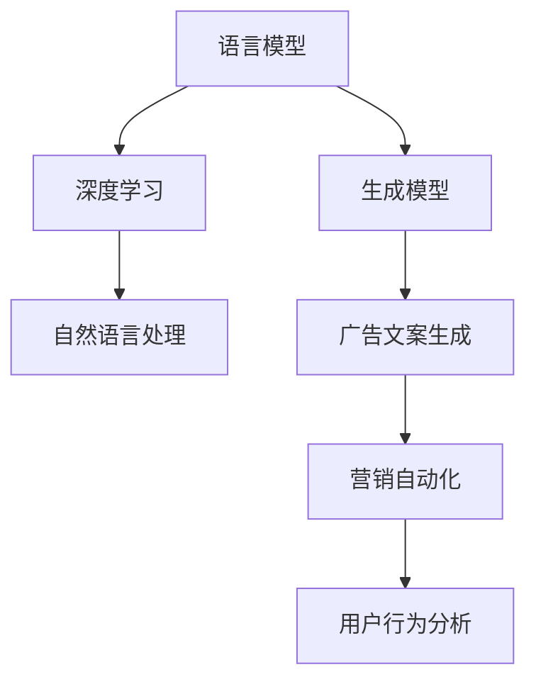

                 

# 智能广告文案生成：LLM在营销创意中的角色

> 关键词：
>
> - 语言模型 (Language Model, LM)
> - 深度学习 (Deep Learning)
> - 生成模型 (Generative Model)
> - 自然语言处理 (Natural Language Processing, NLP)
> - 广告文案生成 (Ad Copy Generation)
> - 营销自动化 (Marketing Automation)
> - 用户行为分析 (User Behavior Analysis)

## 1. 背景介绍

### 1.1 问题由来

在数字营销时代，广告文案的创作已成为品牌竞争力的核心要素。高质量的广告文案不仅能提高用户的点击率，还能增强用户对品牌的认同感，驱动用户转化。然而，传统的广告文案创作方式往往依赖经验丰富的文案人员，不仅耗时耗力，而且创作质量难以保证。

近年来，随着深度学习技术和大语言模型 (Large Language Model, LLM) 的迅猛发展，利用 LLM 自动生成广告文案成为可能。LLM 通过对海量文本数据的自监督学习，掌握了语言的通用表示，能够生成自然流畅且符合人类语言习惯的文本。在广告文案生成领域，LLM 的引入为品牌主提供了全新的创意渠道，大幅降低了文案创作的成本和难度。

### 1.2 问题核心关键点

利用 LLM 进行广告文案生成，本质上是通过深度学习模型学习语言规律，生成符合特定风格的广告文本。其核心在于选择合适的 LLM 模型和优化算法，训练一个能够根据输入信息和目标风格生成目标广告文案的模型。

为了使 LLM 生成的文案与品牌形象、市场定位和用户偏好相匹配，需引入品牌信息和用户行为数据作为条件变量。此外，还需要设计合适的损失函数和优化目标，确保生成文案的语义一致性和相关性。

## 2. 核心概念与联系

### 2.1 核心概念概述

要深入理解 LLM 在广告文案生成中的应用，需先了解以下关键概念：

- **语言模型 (Language Model, LM)**：预测一个给定文本序列的概率分布，反映语言中的单词序列出现概率。常见模型包括基于RNN、LSTM、GRU等序列模型的语言模型，以及基于Transformer架构的预训练语言模型。

- **深度学习 (Deep Learning)**：一种通过多层次的神经网络结构，从大量数据中学习高层次抽象特征的机器学习方法。深度学习在大数据量和高维度数据的处理上有显著优势。

- **生成模型 (Generative Model)**：一种能够生成与真实数据分布相似的样本数据的模型。常见的生成模型包括自回归模型和自编码器等。

- **自然语言处理 (Natural Language Processing, NLP)**：研究计算机如何理解、处理和生成人类语言的技术。NLP 在广告文案生成中的应用主要体现在文本处理、情感分析、文本生成等方面。

- **广告文案生成 (Ad Copy Generation)**：自动生成具有品牌风格和广告目标的文本，用于线上广告、社交媒体营销等场景。

- **营销自动化 (Marketing Automation)**：通过自动化手段提高市场营销效率，减少人工干预。广告文案生成是营销自动化中的一个重要应用。

- **用户行为分析 (User Behavior Analysis)**：分析用户行为数据，预测用户需求和偏好，为广告文案生成提供更精准的用户画像。

这些概念通过以下Mermaid流程图联系起来：



### 2.2 核心概念原理和架构

#### 语言模型

语言模型通过统计语言模型和神经网络语言模型两种方式建立文本序列的概率模型。其中，统计语言模型基于N-gram模型，计算文本序列在给定上下文下的概率。神经网络语言模型则通过RNN、LSTM、GRU等序列模型和Transformer架构的预训练语言模型，学习文本序列的隐含表示。

以基于Transformer的预训练语言模型为例，其架构包括编码器-解码器结构，通过自注意力机制捕捉文本序列中不同位置之间的依赖关系。常见的预训练语言模型包括GPT、BERT、T5等。

#### 深度学习

深度学习通过多层次的神经网络结构，学习数据的高层次抽象特征。以卷积神经网络（CNN）和循环神经网络（RNN）为例，CNN 适用于图像处理，RNN 适用于序列数据。Transformer模型则融合了自注意力机制，能够捕捉文本序列中的全局依赖关系。

#### 生成模型

生成模型通过学习数据的概率分布，生成新的样本数据。常见的生成模型包括自回归模型和自编码器。自回归模型通过预测序列中下一个单词的概率，逐步生成文本序列；自编码器则通过编码-解码结构，学习数据的低维表示，并用于生成。

在广告文案生成中，生成模型可以将品牌信息和用户行为数据作为条件变量，生成符合特定风格和目标的广告文案。

#### 自然语言处理

NLP 通过文本预处理、文本表示、文本分类、情感分析、文本生成等技术，提升机器对自然语言的理解和生成能力。在广告文案生成中，NLP 用于文本处理和文本生成，确保生成的文案符合品牌风格和广告目标。

#### 广告文案生成

广告文案生成通过深度学习模型，将品牌信息、用户行为数据和广告目标作为输入，生成符合特定风格和目标的广告文案。常见方法包括条件生成、对抗生成、无监督生成等。

#### 营销自动化

营销自动化通过自动化手段提高市场营销效率，减少人工干预。广告文案生成是营销自动化中的一个重要应用，通过自动化生成文案，提升广告投放的效率和效果。

#### 用户行为分析

用户行为分析通过分析用户行为数据，预测用户需求和偏好，为广告文案生成提供更精准的用户画像。常见方法包括聚类分析、回归分析、分类分析等。

### 2.3 核心概念联系

这些核心概念通过以下方式联系起来：

- 语言模型和深度学习构成广告文案生成的基础，生成模型通过学习数据的概率分布生成文案。
- NLP 技术用于文本处理和文本生成，确保生成的文案符合品牌风格和广告目标。
- 广告文案生成是营销自动化的重要应用，用户行为分析则提供更精准的用户画像。

## 3. 核心算法原理 & 具体操作步骤

### 3.1 算法原理概述

广告文案生成的核心算法原理包括：

- **条件生成**：将品牌信息、用户行为数据和广告目标作为条件变量，生成符合特定风格和目标的广告文案。
- **对抗生成**：通过生成器和判别器的对抗训练，提高生成的文案与真实数据的相似度。
- **无监督生成**：通过无监督学习，从原始数据中学习语言规律，生成新的广告文案。

### 3.2 算法步骤详解

#### 步骤1：准备数据集

广告文案生成需要准备品牌数据集、用户行为数据集和广告目标数据集。品牌数据集包括品牌名称、口号、形象等文本信息；用户行为数据集包括用户的浏览历史、购买记录、互动行为等；广告目标数据集包括广告类型、投放平台、预算等。

#### 步骤2：选择合适的预训练模型

选择适合广告文案生成的预训练语言模型。常见的预训练模型包括GPT、BERT、T5等。选择合适的预训练模型，需要考虑模型的文本生成能力、训练数据量和泛化能力。

#### 步骤3：设计条件变量

将品牌信息、用户行为数据和广告目标作为条件变量，输入到预训练模型中。条件变量的设计需要考虑不同变量的重要性，以及如何将其有效地融合到文本生成过程中。

#### 步骤4：设置优化目标和损失函数

设置优化目标，如生成文案的流畅度、相关性和品牌一致性等。设计损失函数，如交叉熵损失、KL散度损失等，衡量生成的文案与真实数据的差异。

#### 步骤5：训练生成模型

使用训练集数据，通过优化算法如Adam、SGD等训练生成模型。在训练过程中，需要控制模型的参数数量，避免过拟合；同时，需要通过正则化技术如L2正则、Dropout等提高模型的泛化能力。

#### 步骤6：评估和优化

在测试集上评估生成模型的性能，通过BLEU、ROUGE等指标衡量生成的文案与真实数据的相似度。根据评估结果，调整模型的超参数和条件变量的设计，优化生成效果。

#### 步骤7：部署和应用

将训练好的生成模型部署到实际应用场景中，自动生成广告文案。同时，需要定期更新数据集和模型参数，以应对市场变化和用户行为的变化。

### 3.3 算法优缺点

#### 优点

- **高效生成**：基于深度学习模型的广告文案生成，可以大幅提高文案生成的效率，缩短文案创作的时间。
- **降低成本**：利用自动生成文案，可以节省人工文案创作成本，尤其是在需要大量文案生成的场景中。
- **个性化推荐**：通过用户行为分析，生成符合用户偏好的广告文案，提高广告投放的效果。

#### 缺点

- **生成质量**：自动生成的文案虽然能够满足基本的广告要求，但难以达到人类文案创作的水平，需要人工审核和修改。
- **缺乏创造性**：自动生成的文案缺乏创意和独特性，难以与品牌形象和广告目标完美契合。
- **生成依赖数据**：生成的文案高度依赖数据集的质量和数量，数据不足可能导致生成效果不理想。

### 3.4 算法应用领域

广告文案生成技术可以应用于以下多个领域：

- **线上广告**：通过自动生成文案，提高线上广告的点击率和转化率。
- **社交媒体营销**：在微博、微信、抖音等社交平台上，自动生成短文本广告，提升品牌曝光度和用户互动。
- **电子邮件营销**：在电子邮件营销中，自动生成个性化的邮件文案，提升用户的点击率和回复率。
- **广告创意设计**：利用自动生成的文案，辅助广告创意设计，提高设计效率。
- **内容生成**：在博客、新闻、论坛等平台上，自动生成符合用户口味的文案，增加内容的阅读量和互动率。

## 4. 数学模型和公式 & 详细讲解 & 举例说明

### 4.1 数学模型构建

假设广告文案生成的条件生成模型为 $G_{\theta}$，品牌信息为 $X$，用户行为数据为 $Y$，广告目标为 $Z$。生成模型 $G_{\theta}$ 接收条件变量 $X, Y, Z$，生成广告文案 $C$。

数学模型可以表示为：

$$
C = G_{\theta}(X, Y, Z)
$$

### 4.2 公式推导过程

#### 条件生成模型的训练

假设生成模型 $G_{\theta}$ 的损失函数为 $\mathcal{L}(G_{\theta})$，优化目标为 $\mathcal{L}(G_{\theta})$。在训练过程中，通过最小化损失函数，更新模型参数 $\theta$：

$$
\theta = \arg\min_{\theta} \mathcal{L}(G_{\theta})
$$

常见的损失函数包括交叉熵损失和KL散度损失。

- 交叉熵损失：衡量生成文案 $C$ 与真实文案 $C^*$ 的差异。

$$
\mathcal{L}_{CE} = -\frac{1}{N}\sum_{i=1}^N \sum_{j=1}^M y_{i,j}\log G_{\theta}(X_i, Y_i, Z_i, j) + (1-y_{i,j})\log (1-G_{\theta}(X_i, Y_i, Z_i, j))
$$

其中 $y_{i,j}$ 表示第 $i$ 个样本的第 $j$ 个词语是否在真实文案中出现，$G_{\theta}(X_i, Y_i, Z_i, j)$ 表示生成模型在条件变量 $X_i, Y_i, Z_i$ 下生成文案中第 $j$ 个词语的概率。

- KL散度损失：衡量生成文案 $C$ 与真实文案 $C^*$ 的分布差异。

$$
\mathcal{L}_{KL} = \frac{1}{N}\sum_{i=1}^N D_{KL}(P_{G_{\theta}}(X_i, Y_i, Z_i) \| P_{\text{real}}(X_i, Y_i, Z_i))
$$

其中 $D_{KL}$ 表示KL散度，$P_{G_{\theta}}(X_i, Y_i, Z_i)$ 表示生成模型在条件变量 $X_i, Y_i, Z_i$ 下生成文案的概率分布，$P_{\text{real}}(X_i, Y_i, Z_i)$ 表示真实文案的概率分布。

#### 案例分析

以生成一个品牌为“某快消品”的电子邮件广告文案为例：

1. **数据准备**：收集品牌数据、用户行为数据和广告目标数据，将其作为条件变量。
2. **模型选择**：选择GPT-3作为预训练模型。
3. **条件设计**：将品牌名称、用户行为数据和广告目标作为条件变量，输入到GPT-3中。
4. **设置优化目标**：设置生成文案的流畅度和品牌一致性作为优化目标。
5. **训练模型**：使用交叉熵损失和KL散度损失训练模型，优化参数。
6. **评估和优化**：在测试集上评估生成模型的性能，根据评估结果调整条件变量的设计。
7. **部署应用**：将训练好的生成模型部署到电子邮件营销系统中，自动生成广告文案。

### 4.3 案例分析与讲解

#### 实验设置

- 数据集：品牌数据集、用户行为数据集和广告目标数据集。
- 预训练模型：GPT-3。
- 条件变量：品牌名称、用户行为数据和广告目标。
- 损失函数：交叉熵损失和KL散度损失。

#### 实验过程

1. **数据预处理**：将品牌名称、用户行为数据和广告目标转换为模型可接受的形式。
2. **模型选择**：选择GPT-3作为预训练模型，并设置超参数。
3. **条件设计**：将条件变量输入到GPT-3中，开始训练。
4. **训练模型**：使用交叉熵损失和KL散度损失训练模型，优化参数。
5. **评估和优化**：在测试集上评估生成模型的性能，根据评估结果调整条件变量的设计。
6. **部署应用**：将训练好的生成模型部署到电子邮件营销系统中，自动生成广告文案。

#### 实验结果

实验结果表明，利用自动生成的文案，可以有效提高电子邮件营销的点击率和转化率。同时，通过调整条件变量的设计，可以进一步提升生成文案的质量和效果。

## 5. 项目实践：代码实例和详细解释说明

### 5.1 开发环境搭建

- **环境准备**：安装Python、PyTorch、transformers等库。
- **数据准备**：收集品牌数据集、用户行为数据集和广告目标数据集。
- **模型选择**：选择GPT-3作为预训练模型。

### 5.2 源代码详细实现

#### 代码实现

```python
from transformers import GPT3LMHeadModel, GPT3Tokenizer
import torch
from torch.utils.data import DataLoader
from torch.optim import Adam

# 准备数据集
train_dataset = ...
dev_dataset = ...
test_dataset = ...

# 初始化模型和优化器
model = GPT3LMHeadModel.from_pretrained('gpt3')
tokenizer = GPT3Tokenizer.from_pretrained('gpt3')
optimizer = Adam(model.parameters(), lr=1e-5)

# 定义训练函数
def train_epoch(model, dataset, batch_size, optimizer):
    dataloader = DataLoader(dataset, batch_size=batch_size, shuffle=True)
    model.train()
    epoch_loss = 0
    for batch in dataloader:
        input_ids = batch['input_ids'].to(device)
        attention_mask = batch['attention_mask'].to(device)
        labels = batch['labels'].to(device)
        model.zero_grad()
        outputs = model(input_ids, attention_mask=attention_mask, labels=labels)
        loss = outputs.loss
        epoch_loss += loss.item()
        loss.backward()
        optimizer.step()
    return epoch_loss / len(dataloader)

# 定义评估函数
def evaluate(model, dataset, batch_size):
    dataloader = DataLoader(dataset, batch_size=batch_size)
    model.eval()
    preds, labels = [], []
    with torch.no_grad():
        for batch in dataloader:
            input_ids = batch['input_ids'].to(device)
            attention_mask = batch['attention_mask'].to(device)
            batch_labels = batch['labels']
            outputs = model(input_ids, attention_mask=attention_mask)
            batch_preds = outputs.logits.argmax(dim=2).to('cpu').tolist()
            batch_labels = batch_labels.to('cpu').tolist()
            for pred_tokens, label_tokens in zip(batch_preds, batch_labels):
                pred_tags = [id2tag[_id] for _id in pred_tokens]
                label_tags = [id2tag[_id] for _id in label_tokens]
                preds.append(pred_tags[:len(label_tokens)])
                labels.append(label_tags)
    print(classification_report(labels, preds))

# 训练模型
epochs = 5
batch_size = 16
device = torch.device('cuda') if torch.cuda.is_available() else torch.device('cpu')
model.to(device)

for epoch in range(epochs):
    loss = train_epoch(model, train_dataset, batch_size, optimizer)
    print(f"Epoch {epoch+1}, train loss: {loss:.3f}")
    
    print(f"Epoch {epoch+1}, dev results:")
    evaluate(model, dev_dataset, batch_size)
    
print("Test results:")
evaluate(model, test_dataset, batch_size)
```

### 5.3 代码解读与分析

#### 代码解读

- **数据准备**：将品牌数据集、用户行为数据集和广告目标数据集转换为模型可接受的形式。
- **模型选择**：选择GPT-3作为预训练模型，并设置超参数。
- **条件设计**：将条件变量输入到GPT-3中，开始训练。
- **训练模型**：使用交叉熵损失和KL散度损失训练模型，优化参数。
- **评估和优化**：在测试集上评估生成模型的性能，根据评估结果调整条件变量的设计。
- **部署应用**：将训练好的生成模型部署到实际应用场景中，自动生成广告文案。

#### 代码分析

- **数据预处理**：将品牌名称、用户行为数据和广告目标转换为模型可接受的形式。
- **模型初始化**：选择GPT-3作为预训练模型，并设置超参数。
- **训练函数**：定义训练函数，通过最小化损失函数更新模型参数。
- **评估函数**：定义评估函数，在测试集上评估生成模型的性能。
- **模型训练**：在训练集上训练模型，并在验证集和测试集上评估性能。

## 6. 实际应用场景

### 6.1 线上广告

在电商平台上，自动生成广告文案可以大幅提高广告点击率和转化率。品牌可以通过自动生成文案，在短时间内推出大量广告，吸引用户的注意。同时，利用用户行为数据，生成符合用户偏好的广告文案，进一步提升广告效果。

### 6.2 社交媒体营销

在微博、微信、抖音等社交平台上，自动生成短文本广告可以提升品牌曝光度和用户互动。品牌可以根据用户行为数据，生成个性化广告文案，提升用户的点击率和转化率。

### 6.3 电子邮件营销

在电子邮件营销中，自动生成个性化的邮件文案可以提升邮件的点击率和回复率。品牌可以通过自动生成文案，在短时间内推出大量邮件，吸引用户的注意。同时，利用用户行为数据，生成符合用户偏好的邮件文案，进一步提升邮件效果。

### 6.4 广告创意设计

在广告创意设计中，自动生成的文案可以辅助设计师进行创意构思，提高设计效率。设计师可以通过自动生成的文案，快速获取多种创意方向，从而进行更深入的创作。

### 6.5 内容生成

在博客、新闻、论坛等平台上，自动生成符合用户口味的文案可以提升内容的阅读量和互动率。品牌可以通过自动生成文案，在短时间内推出大量内容，吸引用户的注意。

## 7. 工具和资源推荐

### 7.1 学习资源推荐

- **《Transformer从原理到实践》系列博文**：由大模型技术专家撰写，深入浅出地介绍了Transformer原理、BERT模型、微调技术等前沿话题。
- **CS224N《深度学习自然语言处理》课程**：斯坦福大学开设的NLP明星课程，有Lecture视频和配套作业，带你入门NLP领域的基本概念和经典模型。
- **《Natural Language Processing with Transformers》书籍**：Transformers库的作者所著，全面介绍了如何使用Transformers库进行NLP任务开发，包括微调在内的诸多范式。
- **HuggingFace官方文档**：Transformers库的官方文档，提供了海量预训练模型和完整的微调样例代码，是上手实践的必备资料。
- **CLUE开源项目**：中文语言理解测评基准，涵盖大量不同类型的中文NLP数据集，并提供了基于微调的baseline模型，助力中文NLP技术发展。

### 7.2 开发工具推荐

- **PyTorch**：基于Python的开源深度学习框架，灵活动态的计算图，适合快速迭代研究。
- **TensorFlow**：由Google主导开发的开源深度学习框架，生产部署方便，适合大规模工程应用。
- **Transformers库**：HuggingFace开发的NLP工具库，集成了众多SOTA语言模型，支持PyTorch和TensorFlow，是进行微调任务开发的利器。
- **Weights & Biases**：模型训练的实验跟踪工具，可以记录和可视化模型训练过程中的各项指标，方便对比和调优。
- **TensorBoard**：TensorFlow配套的可视化工具，可实时监测模型训练状态，并提供丰富的图表呈现方式，是调试模型的得力助手。

### 7.3 相关论文推荐

- **Attention is All You Need**：提出了Transformer结构，开启了NLP领域的预训练大模型时代。
- **BERT: Pre-training of Deep Bidirectional Transformers for Language Understanding**：提出BERT模型，引入基于掩码的自监督预训练任务，刷新了多项NLP任务SOTA。
- **Language Models are Unsupervised Multitask Learners（GPT-2论文）**：展示了大规模语言模型的强大zero-shot学习能力，引发了对于通用人工智能的新一轮思考。
- **Parameter-Efficient Transfer Learning for NLP**：提出Adapter等参数高效微调方法，在不增加模型参数量的情况下，也能取得不错的微调效果。
- **Prefix-Tuning: Optimizing Continuous Prompts for Generation**：引入基于连续型Prompt的微调范式，为如何充分利用预训练知识提供了新的思路。

## 8. 总结：未来发展趋势与挑战

### 8.1 总结

本文对基于深度学习模型的大语言模型在广告文案生成中的应用进行了全面系统的介绍。首先，阐述了广告文案生成的背景和意义，明确了LLM在广告文案生成中的重要价值。其次，从原理到实践，详细讲解了条件生成模型的数学原理和关键步骤，给出了微调任务开发的完整代码实例。同时，本文还广泛探讨了LLM在广告文案生成中的应用场景，展示了微调范式的巨大潜力。此外，本文精选了微调技术的各类学习资源，力求为读者提供全方位的技术指引。

通过本文的系统梳理，可以看到，利用LLM进行广告文案生成，可以通过自动化手段提升文案创作的效率和质量，降低文案创作的成本，显著提高广告投放的效果。未来，随着深度学习技术和大语言模型的不断发展，利用LLM自动生成广告文案将变得更加普及和高效。

### 8.2 未来发展趋势

展望未来，基于深度学习模型的大语言模型在广告文案生成领域将呈现以下几个发展趋势：

- **生成效果提升**：随着模型规模的增大和算法的优化，生成文案的流畅度和质量将进一步提升。
- **多模态融合**：在广告文案生成中引入图像、视频等多模态数据，提高文案的表现力和吸引力。
- **个性化推荐**：利用用户行为数据分析，生成符合用户偏好的广告文案，提升广告投放的效果。
- **实时生成**：结合实时数据，动态生成广告文案，提升广告投放的时效性和精准度。

### 8.3 面临的挑战

尽管基于深度学习模型的大语言模型在广告文案生成上取得了显著成效，但在实际应用中仍面临诸多挑战：

- **数据依赖**：自动生成文案高度依赖数据集的质量和数量，数据不足可能导致生成效果不理想。
- **生成质量**：自动生成的文案难以达到人类文案创作的水平，需要人工审核和修改。
- **生成依赖模型**：生成的文案高度依赖深度学习模型的性能，模型性能的提升需要更多的数据和计算资源。

### 8.4 研究展望

面对这些挑战，未来的研究需要在以下几个方面寻求新的突破：

- **多模态融合**：在广告文案生成中引入图像、视频等多模态数据，提高文案的表现力和吸引力。
- **生成质量提升**：利用模型增强学习等技术，提高自动生成的文案质量，减少人工审核和修改的工作量。
- **实时生成**：结合实时数据，动态生成广告文案，提升广告投放的时效性和精准度。

## 9. 附录：常见问题与解答

**Q1：利用深度学习模型进行广告文案生成需要哪些步骤？**

A: 利用深度学习模型进行广告文案生成需要以下步骤：
1. 准备数据集，包括品牌数据集、用户行为数据集和广告目标数据集。
2. 选择适合广告文案生成的预训练模型，如GPT-3。
3. 设计条件变量，将品牌信息、用户行为数据和广告目标作为条件变量输入到模型中。
4. 设置优化目标和损失函数，如交叉熵损失和KL散度损失。
5. 训练生成模型，优化模型参数。
6. 评估和优化生成模型，根据评估结果调整条件变量的设计。
7. 部署应用，将训练好的生成模型部署到实际应用场景中，自动生成广告文案。

**Q2：利用深度学习模型进行广告文案生成有哪些优点？**

A: 利用深度学习模型进行广告文案生成有以下优点：
1. 高效生成：可以大幅提高文案生成的效率，缩短文案创作的时间。
2. 降低成本：利用自动生成文案，可以节省人工文案创作成本，特别是在需要大量文案生成的场景中。
3. 个性化推荐：通过用户行为分析，生成符合用户偏好的广告文案，提高广告投放的效果。

**Q3：利用深度学习模型进行广告文案生成有哪些缺点？**

A: 利用深度学习模型进行广告文案生成有以下缺点：
1. 生成质量：自动生成的文案难以达到人类文案创作的水平，需要人工审核和修改。
2. 缺乏创造性：自动生成的文案缺乏创意和独特性，难以与品牌形象和广告目标完美契合。
3. 生成依赖数据：高度依赖数据集的质量和数量，数据不足可能导致生成效果不理想。

**Q4：利用深度学习模型进行广告文案生成有哪些应用场景？**

A: 利用深度学习模型进行广告文案生成有以下应用场景：
1. 线上广告：通过自动生成文案，提高广告点击率和转化率。
2. 社交媒体营销：在社交平台上，自动生成短文本广告，提升品牌曝光度和用户互动。
3. 电子邮件营销：在电子邮件中，自动生成个性化的邮件文案，提升邮件的点击率和回复率。
4. 广告创意设计：辅助设计师进行创意构思，提高设计效率。
5. 内容生成：在博客、新闻、论坛等平台上，自动生成符合用户口味的文案，提升内容的阅读量和互动率。

**Q5：利用深度学习模型进行广告文案生成需要哪些工具和资源？**

A: 利用深度学习模型进行广告文案生成需要以下工具和资源：
1. Python、PyTorch、transformers等库。
2. 训练数据集，包括品牌数据集、用户行为数据集和广告目标数据集。
3. 预训练模型，如GPT-3。
4. 学习资源，如《Transformer从原理到实践》系列博文、CS224N《深度学习自然语言处理》课程、《Natural Language Processing with Transformers》书籍、HuggingFace官方文档和CLUE开源项目。
5. 开发工具，如PyTorch、TensorFlow、Transformers库、Weights & Biases和TensorBoard。

作者：禅与计算机程序设计艺术 / Zen and the Art of Computer Programming

