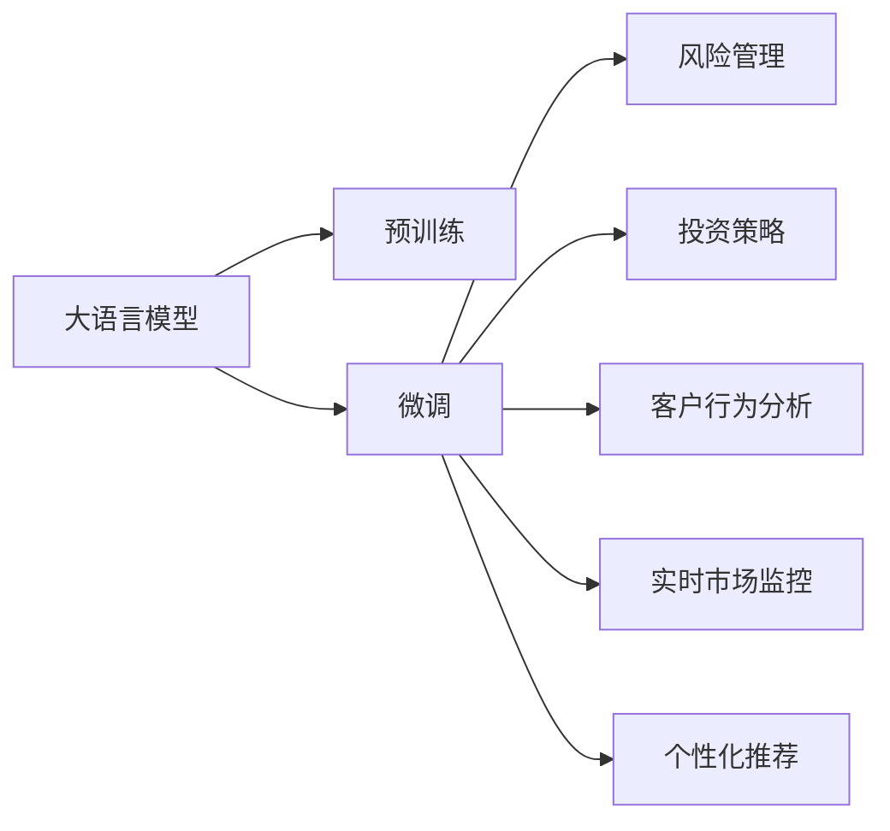

                 

# 智能投资顾问：LLM在财富管理中的应用

## 1. 背景介绍

随着金融市场的复杂化和投资者的个性化需求增加，传统的投资顾问方式已无法满足现代市场的需求。在此背景下，人工智能（AI），特别是大语言模型（LLM），成为实现智能投资顾问的重要技术手段。大语言模型能够从海量的金融文本中学习到丰富的市场知识和投资经验，通过深度学习算法，为客户提供更加个性化、精准的投资建议。

## 2. 核心概念与联系

### 2.1 核心概念概述

本节将介绍几个核心概念：

- 大语言模型（Large Language Model, LLM）：一类基于Transformer架构的深度学习模型，通过大量文本数据的自监督训练，能够捕捉语言中的复杂关系，具有强大的自然语言理解和生成能力。
- 预训练与微调（Pre-training & Fine-tuning）：预训练指在大规模无标签文本数据上训练模型，以获取通用语言表示。微调则是在预训练基础上，通过有限标注数据训练模型，适应特定任务，如金融分析、投资策略等。
- 自然语言处理（Natural Language Processing, NLP）：指计算机处理和理解人类语言的能力，是实现智能投资顾问的关键技术。
- 深度学习（Deep Learning）：基于神经网络的机器学习方法，能够自动从数据中学习特征，为模型提供强大的泛化能力。
- 投资顾问（Investment Advisor）：为客户提供个性化投资建议的专业人士，包括但不限于股票、债券、基金等多种投资渠道的分析和建议。
- 风险管理（Risk Management）：通过分析金融市场的波动性、相关性等，为客户提供风险评估和风险控制建议。

### 2.2 核心概念原理和架构的 Mermaid 流程图



该流程图展示了LLM在财富管理中的核心应用流程：

- 大语言模型通过预训练学习通用语言表示。
- 在预训练基础上，通过微调适配投资顾问特定任务。
- 微调后的模型能够用于风险管理、投资策略、客户行为分析、实时市场监控和个性化推荐等多个方面。

## 3. 核心算法原理 & 具体操作步骤

### 3.1 算法原理概述

智能投资顾问的实现基于大语言模型，主要分为以下步骤：

1. **预训练**：使用大规模无标签金融文本数据训练大语言模型，如股票新闻、财经报道、市场分析报告等，以学习语言中的市场规律和投资经验。
2. **微调**：在预训练的基础上，使用少量的标注数据对模型进行微调，如历史交易数据、市场波动数据等，以适应特定投资顾问任务。
3. **推理**：将用户输入的问题或指令输入微调后的模型，获取个性化的投资建议和市场分析报告。

### 3.2 算法步骤详解

以下是智能投资顾问的具体实现步骤：

1. **数据预处理**：收集金融领域的文本数据，进行清洗、分词、向量化等预处理操作，转化为模型可接受的输入。
2. **模型选择与配置**：选择合适的预训练模型，如GPT-3、BERT等，并进行参数配置，如学习率、批大小等。
3. **微调训练**：使用标注数据集对模型进行微调训练，更新模型参数以适应投资顾问任务。
4. **模型评估**：使用验证集评估模型性能，调整模型参数以优化模型效果。
5. **推理部署**：将微调后的模型部署到生产环境，实现对用户问题的即时回答和投资建议。

### 3.3 算法优缺点

**优点**：

- 高灵活性：大语言模型能够处理自然语言输入，灵活应对不同用户的个性化需求。
- 泛化能力强：预训练模型能够捕捉通用的市场知识，微调后的模型具有良好的泛化能力。
- 自动化程度高：模型能够自动分析市场数据和用户行为，提供实时的投资建议。

**缺点**：

- 数据依赖性高：微调模型的性能很大程度上取决于标注数据的质量和数量。
- 模型复杂度高：大规模预训练和微调模型需要大量的计算资源和存储资源。
- 可解释性不足：深度学习模型通常是"黑盒"，难以解释其内部决策过程。

### 3.4 算法应用领域

基于大语言模型的智能投资顾问广泛应用于以下领域：

- 股票投资建议：根据股票新闻、市场报告等信息，提供股票买入、卖出建议。
- 债券投资策略：分析债券市场数据，提供债券组合管理和投资策略。
- 基金分析与推荐：评估基金的历史表现和风险特征，推荐合适的基金产品。
- 风险评估与管理：分析市场波动性、相关性等，提供风险评估和风险管理建议。
- 客户行为分析：分析客户交易历史、市场操作行为，提供个性化投资策略。
- 实时市场监控：监控市场动态，实时更新投资建议。

## 4. 数学模型和公式 & 详细讲解

### 4.1 数学模型构建

假设有一个通用的投资顾问任务，需要将文本数据$X=\{(x_i, y_i)\}_{i=1}^N$映射到标签$y$，其中$x_i$为金融文本，$y_i$为投资建议。模型的目标是最小化损失函数$\mathcal{L}(\theta)$，其中$\theta$为模型参数。

### 4.2 公式推导过程

以二分类问题为例，使用交叉熵损失函数：

$$
\mathcal{L}(\theta) = -\frac{1}{N} \sum_{i=1}^N \left[ y_i \log P(y_i|x_i) + (1-y_i) \log P(1-y_i|x_i) \right]
$$

其中$P(y_i|x_i)$为模型对标签$y_i$的预测概率。通过梯度下降等优化算法，求解$\theta$使得$\mathcal{L}(\theta)$最小。

### 4.3 案例分析与讲解

假设有一个股票投资建议任务，使用微调后的BERT模型进行投资建议。数据集$D$为历史交易数据，$x_i$为股票新闻，$y_i$为投资建议（买入或卖出）。模型在微调后，对新输入的股票新闻$x$进行预测，输出对应的投资建议$y$。

## 5. 项目实践：代码实例和详细解释说明

### 5.1 开发环境搭建

1. **安装Python**：从官网下载安装Python，并创建虚拟环境。
2. **安装依赖库**：安装TensorFlow、PyTorch、transformers等库。
3. **准备数据集**：收集金融领域的文本数据，并进行预处理。

### 5.2 源代码详细实现

以下是使用PyTorch框架实现股票投资建议任务的代码：

```python
import torch
import torch.nn as nn
import torch.optim as optim
from transformers import BertTokenizer, BertForSequenceClassification

class StockInvestmentAdvisor(nn.Module):
    def __init__(self, num_classes):
        super(StockInvestmentAdvisor, self).__init__()
        self.num_classes = num_classes
        self.bert = BertForSequenceClassification.from_pretrained('bert-base-uncased', num_labels=num_classes)
        
    def forward(self, input_ids, attention_mask):
        outputs = self.bert(input_ids, attention_mask=attention_mask)
        logits = outputs.logits
        return logits

def train_model(model, train_loader, optimizer, device):
    model.train()
    total_loss = 0
    for batch in train_loader:
        input_ids = batch[0].to(device)
        attention_mask = batch[1].to(device)
        labels = batch[2].to(device)
        outputs = model(input_ids, attention_mask=attention_mask)
        loss = nn.CrossEntropyLoss()(outputs, labels)
        loss.backward()
        optimizer.step()
        total_loss += loss.item()
    return total_loss / len(train_loader)
    
def evaluate_model(model, eval_loader, device):
    model.eval()
    total_loss = 0
    total_correct = 0
    for batch in eval_loader:
        input_ids = batch[0].to(device)
        attention_mask = batch[1].to(device)
        labels = batch[2].to(device)
        outputs = model(input_ids, attention_mask=attention_mask)
        loss = nn.CrossEntropyLoss()(outputs, labels)
        total_loss += loss.item()
        predictions = torch.argmax(outputs, dim=1)
        total_correct += (predictions == labels).sum().item()
    return total_loss / len(eval_loader), total_correct / len(eval_loader.dataset)
```

### 5.3 代码解读与分析

1. **StockInvestmentAdvisor类**：继承自nn.Module，定义了模型结构和前向传播函数。
2. **train_model函数**：定义训练函数，使用交叉熵损失函数进行训练。
3. **evaluate_model函数**：定义评估函数，计算模型的平均损失和准确率。

## 6. 实际应用场景

### 6.1 智能投资顾问系统

智能投资顾问系统通过收集用户的历史交易数据、市场动态等信息，使用微调后的LLM模型提供个性化的投资建议。系统通常分为前端交互和后端推理两部分，前端通过自然语言处理接收用户输入，后端使用微调模型生成投资建议。

### 6.2 风险管理平台

风险管理平台利用微调后的LLM模型分析市场波动性、相关性等指标，为客户提供风险评估和风险管理建议。通过定期的模型微调，模型能够不断适应新的市场环境，提供更加准确的投资建议。

### 6.3 金融知识问答系统

金融知识问答系统使用微调后的LLM模型回答用户关于股票、债券、基金等金融知识的问题，帮助用户理解复杂的金融概念。通过不断的微调和优化，系统能够逐渐提升回答的准确性和覆盖面。

### 6.4 未来应用展望

随着LLM技术的不断发展，智能投资顾问在财富管理中的应用前景广阔。未来，LLM将在以下方面进一步提升：

- 多模态融合：结合图像、视频等多模态数据，提升模型的综合分析能力。
- 零样本学习：在缺乏标注数据的情况下，使用LLM进行少样本或零样本学习，快速适应新任务。
- 个性化推荐：基于用户行为和偏好，提供更加个性化的投资建议。
- 实时监控与预测：结合市场动态，提供实时的市场监控和预测服务。

## 7. 工具和资源推荐

### 7.1 学习资源推荐

1. **《深度学习》（Goodfellow et al.）**：介绍深度学习的基本概念和算法。
2. **《自然语言处理综论》（Daniel Jurafsky and James H. Martin）**：涵盖自然语言处理的基础知识和技术。
3. **Coursera《自然语言处理》课程**：由斯坦福大学提供，介绍自然语言处理的基本原理和应用。
4. **Kaggle金融数据集**：提供丰富的金融领域数据集，适合进行模型微调实验。
5. **GitHub开源项目**：提供大量金融领域的开源项目，适合学习和参考。

### 7.2 开发工具推荐

1. **PyTorch**：深度学习框架，支持动态计算图，灵活性强。
2. **TensorFlow**：深度学习框架，支持分布式计算，适合大规模模型训练。
3. **Transformers**：NLP工具库，包含多种预训练模型和微调代码。
4. **Jupyter Notebook**：交互式开发环境，适合数据探索和模型实验。

### 7.3 相关论文推荐

1. **Attention is All You Need**（Vaswani et al.）：提出Transformer架构，推动大语言模型的发展。
2. **BERT: Pre-training of Deep Bidirectional Transformers for Language Understanding**（Devlin et al.）：提出BERT模型，引入自监督预训练，提升模型效果。
3. **GPT-3: Language Models are Unsupervised Multitask Learners**（Brown et al.）：展示GPT-3的强大零样本学习能力。
4. **LoRA: Low-Rank Adaptation of Transformer Layers**（Huang et al.）：提出LoRA方法，实现参数高效微调。
5. **ALBERT: A Lite BERT for Self-supervised Learning of Language Representations**（Lan et al.）：提出ALBERT模型，优化模型效率和效果。

## 8. 总结：未来发展趋势与挑战

### 8.1 总结

本文详细介绍了基于大语言模型的智能投资顾问应用，涵盖了预训练、微调、推理等关键步骤。通过构建数学模型和实际代码实例，展示了LLM在财富管理中的强大应用潜力。智能投资顾问技术的应用，将极大地提升金融市场的智能化水平，提供更加个性化、精准的投资建议。

### 8.2 未来发展趋势

未来，LLM在财富管理中的应用将呈现以下趋势：

- 模型规模扩大：更大规模的LLM模型将带来更丰富的市场知识和投资经验。
- 多模态融合：结合图像、视频等多模态数据，提升模型的综合分析能力。
- 零样本学习：在缺乏标注数据的情况下，使用LLM进行少样本或零样本学习，快速适应新任务。
- 实时监控与预测：结合市场动态，提供实时的市场监控和预测服务。
- 个性化推荐：基于用户行为和偏好，提供更加个性化的投资建议。

### 8.3 面临的挑战

尽管LLM在财富管理中的应用前景广阔，但仍面临以下挑战：

- 数据依赖性高：微调模型的性能很大程度上取决于标注数据的质量和数量。
- 模型复杂度高：大规模预训练和微调模型需要大量的计算资源和存储资源。
- 可解释性不足：深度学习模型通常是"黑盒"，难以解释其内部决策过程。
- 模型鲁棒性不足：面对域外数据时，模型的泛化性能可能大打折扣。
- 模型安全与隐私：模型输出的准确性和安全性需要保障，防止误导性或有害输出。

### 8.4 研究展望

未来，智能投资顾问技术需要在以下几个方面进行研究：

- 无监督与半监督学习：摆脱对大规模标注数据的依赖，利用自监督学习、主动学习等无监督和半监督范式，最大限度利用非结构化数据。
- 参数高效与计算高效：开发更加参数高效和计算高效的微调方法，在固定大部分预训练参数的同时，只更新少量任务相关参数。
- 可解释性与透明性：赋予模型更强的可解释性和透明性，提供决策过程的可视化和技术细节的解释。
- 多模态数据融合：结合图像、视频等多模态数据，提升模型的综合分析能力。
- 跨领域迁移：在多个领域间进行跨领域迁移学习，提升模型的通用性和泛化能力。
- 模型鲁棒性提升：提高模型的鲁棒性和泛化能力，避免模型输出因数据分布变化而产生波动。
- 模型安全与隐私：在模型训练和部署过程中，保障数据的安全性和隐私性，防止模型被恶意利用。

## 9. 附录：常见问题与解答

**Q1: 如何选择合适的预训练模型？**

A: 选择合适的预训练模型需要考虑以下几个因素：
- 任务类型：不同的任务需要不同的模型，如股票分析适合使用BERT，而股票交易适合使用GPT。
- 数据规模：数据规模大的任务适合使用规模较大的模型，如GPT-3。
- 性能要求：需要根据具体任务的需求，选择适合的模型，如对实时性要求高的任务适合使用轻量级模型。

**Q2: 微调模型时如何防止过拟合？**

A: 防止过拟合可以采用以下方法：
- 数据增强：通过数据扩充、回译等方式增加训练数据的多样性。
- 正则化：使用L2正则、Dropout等方法减少模型复杂度。
- 早停机制：当验证集上的性能不再提升时，停止训练。
- 学习率调整：使用学习率衰减或动态调整学习率。

**Q3: 微调模型时如何处理未见过的数据？**

A: 可以使用零样本学习或少样本学习技术：
- 零样本学习：在未见过的数据上直接使用微调后的模型进行推理，无需额外的训练。
- 少样本学习：在未见过的数据上使用少量样本进行微调，更新模型参数以适应该数据。

**Q4: 微调模型时如何保持模型性能的稳定？**

A: 可以采用以下方法：
- 多模型集成：训练多个微调模型，取平均输出，提高模型的稳定性和鲁棒性。
- 模型剪枝：去除不必要的模型参数，减小模型尺寸，提高模型的运行效率。
- 动态更新：根据用户行为和市场动态，定期更新模型参数，保持模型性能的稳定性和时效性。

**Q5: 如何评估微调模型的性能？**

A: 可以采用以下方法：
- 准确率：评估模型在验证集和测试集上的准确率，比较模型的性能。
- F1分数：综合考虑模型的精确率和召回率，更全面地评估模型性能。
- AUC-ROC曲线：评估模型在不同阈值下的性能，选择合适的阈值。

---

作者：禅与计算机程序设计艺术 / Zen and the Art of Computer Programming

