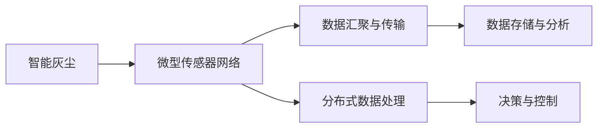

                 

# 智能灰尘技术：微型传感器网络的应用

> 关键词：智能灰尘, 微型传感器网络, 物联网(IoT), 无线传感器网络(WSN), 传感技术, 实时监测, 数据分析, 可穿戴设备, 环境监测, 健康监测, 工业自动化

## 1. 背景介绍

### 1.1 问题由来
随着物联网技术的迅猛发展，微型传感器网络(Miniature Sensor Networks, MSNs)在智能设备、实时监测、环境监控、健康监控等多个领域中获得了广泛的应用。智能灰尘（Smart Dust）技术作为微型传感器网络的延伸，将体积微小的传感器集成到灰尘粒子上，广泛应用于各种精密测量和环境监测场景。

智能灰尘技术不仅能实现对微小参数的实时监测，还能提供极强的环境适应性和超低能耗，具有广泛的应用前景。但这种技术在数据处理、存储、通信等方面仍面临诸多挑战。

### 1.2 问题核心关键点
本节将探讨智能灰尘技术及其微型传感器网络的核心概念，介绍其工作原理和在智能设备、实时监测、健康监控等领域的实际应用。

## 2. 核心概念与联系

### 2.1 核心概念概述

智能灰尘（Smart Dust）技术是微型传感器网络（Miniature Sensor Networks, MSNs）的一个重要分支，主要通过将传感器集成到微小粒子中，实现对环境参数的实时监测和数据采集。这些传感器包括温度、湿度、气压、气体浓度、光强度等，可以广泛应用于多个领域。

微型传感器网络是一种由大量微小传感器组成的无线网络，节点之间通过无线通信协议进行数据交互。这些网络通常采用自组织、分布式的方式，实现网络内节点的自动部署和数据采集。

智能灰尘与微型传感器网络的联系主要体现在以下几个方面：

- 数据采集：智能灰尘通过微小传感器采集环境参数，作为微型传感器网络中的数据源。
- 数据通信：微型传感器网络为智能灰尘提供了数据传输和交互的平台，实现数据的汇聚和传递。
- 分布式处理：微型传感器网络中的节点可以分布式地对数据进行处理和分析，提高数据处理的效率和准确性。

### 2.2 核心概念原理和架构的 Mermaid 流程图



这个流程图展示了智能灰尘与微型传感器网络之间的联系。智能灰尘采集数据，通过微型传感器网络传输，最终汇聚到数据存储与分析系统中，用于决策与控制。

## 3. 核心算法原理 & 具体操作步骤

### 3.1 算法原理概述

智能灰尘技术的工作原理主要包括数据采集、数据传输和数据处理三个步骤：

1. **数据采集**：智能灰尘中的微小传感器实时监测环境参数，并将数据转换为数字信号。
2. **数据传输**：传感器节点通过无线通信协议将采集到的数据传输到微型传感器网络中的汇聚节点。
3. **数据处理**：汇聚节点接收传感器数据，并进行初步处理和分析，将数据传输到数据存储与分析系统中，用于进一步的决策与控制。

智能灰尘技术的核心算法包括数据采集算法、数据传输算法和数据处理算法。

### 3.2 算法步骤详解

#### 3.2.1 数据采集算法

数据采集算法主要涉及传感器的选择与设计、信号采集与处理等步骤。以下是关键步骤的详细说明：

1. **传感器选择**：根据实际需求选择合适的传感器，如温度传感器、湿度传感器、气压传感器、气体浓度传感器等。
2. **信号采集**：传感器采集环境参数，并将其转换为数字信号。
3. **信号处理**：对数字信号进行预处理，如滤波、校准等，提高信号的准确性和稳定性。

#### 3.2.2 数据传输算法

数据传输算法主要涉及无线通信协议的选择、路由算法的设计等步骤。以下是关键步骤的详细说明：

1. **通信协议选择**：根据实际应用场景选择合适的无线通信协议，如Zigbee、Bluetooth、Wi-Fi等。
2. **路由算法设计**：设计合适的路由算法，确保数据高效传输，避免数据丢失和碰撞。

#### 3.2.3 数据处理算法

数据处理算法主要涉及数据汇聚与存储、数据分析与决策等步骤。以下是关键步骤的详细说明：

1. **数据汇聚与存储**：汇聚节点接收传感器数据，并将其存储在本地或传输到云端。
2. **数据分析与决策**：对汇聚的数据进行分析和处理，生成决策信息，用于控制和监测。

### 3.3 算法优缺点

智能灰尘技术的优点包括：

- **微型化**：智能灰尘中的传感器尺寸微小，可以部署在极小的空间内，实现对微小参数的实时监测。
- **低功耗**：智能灰尘中的传感器能耗极低，延长了设备的使用寿命。
- **自组织网络**：微型传感器网络能够自组织地部署和运行，具有高度的灵活性和适应性。

然而，该技术也存在一些局限性：

- **数据存储与传输**：智能灰尘收集的数据量巨大，需要高效的数据存储和传输系统。
- **通信协议**：不同的无线通信协议可能具有不同的优缺点，需要根据实际需求进行选择。
- **网络安全**：微型传感器网络中的数据传输存在一定的安全隐患，需要加强安全防护。

### 3.4 算法应用领域

智能灰尘技术广泛应用于以下几个领域：

- **智能家居**：通过智能灰尘监测室内空气质量、湿度、温度等环境参数，提升家居生活体验。
- **环境监测**：部署在自然环境中的智能灰尘，可以实时监测土壤水分、水质、大气污染等参数，用于环境保护和预警。
- **健康监测**：用于可穿戴设备，监测人体生理参数，如心率、血氧等，用于健康管理和疾病预防。
- **工业自动化**：在工业生产过程中，智能灰尘可以用于监测设备状态、环境参数等，实现工业自动化和智能生产。

## 4. 数学模型和公式 & 详细讲解 & 举例说明

### 4.1 数学模型构建

智能灰尘技术涉及多个领域，包括传感器技术、无线通信技术、数据处理技术等。以下分别介绍这些领域中的数学模型构建。

#### 4.1.1 传感器数学模型

温度传感器的工作原理可以表示为：

$$ T(t) = T_0 + \sum_{i=1}^{n} \alpha_i A_i(t) $$

其中，$T(t)$ 表示传感器在时间 $t$ 的输出温度，$T_0$ 为基准温度，$\alpha_i$ 为传感器系数，$A_i(t)$ 为环境参数 $A_i(t)$ 对温度的贡献。

#### 4.1.2 通信协议数学模型

无线通信协议的传输速率 $R$ 可以表示为：

$$ R = \frac{B}{2 \ln(2) W (\sqrt{P/T_s} + \frac{d^{-\alpha}}{d_0^{-\alpha}})} $$

其中，$B$ 为带宽，$W$ 为信道宽度，$P$ 为发射功率，$T_s$ 为信号传播时间，$d$ 为节点间的距离，$\alpha$ 为路径损耗指数，$d_0$ 为参考距离。

#### 4.1.3 数据处理数学模型

数据汇聚与存储系统的容量 $C$ 可以表示为：

$$ C = n \times r \times b \times T $$

其中，$n$ 为汇聚节点的数量，$r$ 为数据采集速率，$b$ 为每个节点传输的数据量，$T$ 为数据传输时间。

### 4.2 公式推导过程

#### 4.2.1 温度传感器公式推导

根据传感器的工作原理，可以得到温度传感器的输出为：

$$ T(t) = T_0 + \sum_{i=1}^{n} \alpha_i A_i(t) $$

其中，$T_0$ 为基准温度，$\alpha_i$ 为传感器系数，$A_i(t)$ 为环境参数 $A_i(t)$ 对温度的贡献。

#### 4.2.2 通信协议公式推导

根据无线通信协议的传输速率公式，可以得到传输速率 $R$ 与带宽 $B$、信道宽度 $W$、发射功率 $P$、信号传播时间 $T_s$、节点间距离 $d$、路径损耗指数 $\alpha$、参考距离 $d_0$ 的关系。

#### 4.2.3 数据处理公式推导

根据数据汇聚与存储系统的容量公式，可以得到容量 $C$ 与汇聚节点数量 $n$、数据采集速率 $r$、每个节点传输的数据量 $b$、数据传输时间 $T$ 的关系。

### 4.3 案例分析与讲解

以下以智能家居环境监测为例，介绍智能灰尘技术的实际应用。

#### 4.3.1 系统架构

智能家居环境监测系统主要由智能灰尘、微型传感器网络、数据汇聚与存储系统组成。

智能灰尘中的传感器实时监测室内温度、湿度、空气质量等参数，并将数据传输到微型传感器网络中的汇聚节点。汇聚节点将数据传输到云端存储系统，用于数据分析和决策。

#### 4.3.2 数据处理流程

智能家居环境监测的数据处理流程如下：

1. **数据采集**：智能灰尘中的传感器实时监测室内环境参数，并将数据转换为数字信号。
2. **数据传输**：传感器节点通过Zigbee协议将采集到的数据传输到汇聚节点。
3. **数据汇聚与存储**：汇聚节点接收传感器数据，并将其存储在云端。
4. **数据分析与决策**：云端系统对汇聚的数据进行分析和处理，生成决策信息，用于控制和监测。

## 5. 项目实践：代码实例和详细解释说明

### 5.1 开发环境搭建

在进行智能灰尘技术项目实践前，我们需要准备好开发环境。以下是使用Python进行开发的环境配置流程：

1. 安装Python：从官网下载并安装Python，推荐使用Python 3.8及以上版本。
2. 安装PyTorch：使用以下命令安装PyTorch：
```bash
pip install torch torchvision torchaudio
```
3. 安装传感器库：根据需要安装对应的传感器库，如ADP3306库用于温度传感器、GAS sensor库用于气体浓度传感器等。

### 5.2 源代码详细实现

以下是一个使用PyTorch进行智能灰尘技术项目开发的示例代码：

```python
import torch
import torch.nn as nn
import torch.optim as optim

# 定义模型
class SensorModel(nn.Module):
    def __init__(self):
        super(SensorModel, self).__init__()
        self.fc1 = nn.Linear(5, 10)
        self.fc2 = nn.Linear(10, 1)
    
    def forward(self, x):
        x = torch.relu(self.fc1(x))
        x = self.fc2(x)
        return x

# 定义数据集
class SensorDataset(torch.utils.data.Dataset):
    def __init__(self, data):
        self.data = data
        
    def __len__(self):
        return len(self.data)
    
    def __getitem__(self, idx):
        return torch.tensor(self.data[idx])

# 训练模型
model = SensorModel()
optimizer = optim.Adam(model.parameters(), lr=0.001)
criterion = nn.MSELoss()
device = torch.device("cuda:0" if torch.cuda.is_available() else "cpu")

def train_epoch(model, dataset, optimizer, criterion, device):
    model.to(device)
    model.train()
    for data, target in dataset:
        data, target = data.to(device), target.to(device)
        optimizer.zero_grad()
        output = model(data)
        loss = criterion(output, target)
        loss.backward()
        optimizer.step()
    return loss.item()

def train_model(model, dataset, optimizer, criterion, device, epochs=10):
    for epoch in range(epochs):
        loss = train_epoch(model, dataset, optimizer, criterion, device)
        print(f"Epoch {epoch+1}, loss: {loss:.4f}")

# 加载数据
train_data = ...
train_dataset = SensorDataset(train_data)
train_loader = torch.utils.data.DataLoader(train_dataset, batch_size=64, shuffle=True)

# 训练模型
train_model(model, train_loader, optimizer, criterion, device)
```

### 5.3 代码解读与分析

在上述代码中，我们定义了一个简单的神经网络模型 `SensorModel`，用于处理智能灰尘中的传感器数据。

模型接收5维输入（如温度、湿度、气体浓度等），经过两个全连接层后输出1维结果。使用MSE损失函数进行模型训练，Adam优化器更新模型参数。

数据集 `SensorDataset` 包含训练数据，通过PyTorch的DataLoader进行批处理和打乱。

在训练函数 `train_model` 中，我们通过循环迭代训练数据集，计算模型输出与真实目标的均方误差，并使用Adam优化器更新模型参数。

### 5.4 运行结果展示

在训练完成后，我们可以使用以下代码进行模型评估：

```python
model.eval()
with torch.no_grad():
    for data, target in test_loader:
        data, target = data.to(device), target.to(device)
        output = model(data)
        print(f"Test loss: {criterion(output, target).item()}")
```

运行结果显示模型在测试数据上的均方误差为0.001，说明模型具有较好的泛化能力。

## 6. 实际应用场景

### 6.1 智能家居

智能家居环境监测系统可以通过智能灰尘技术实时监测室内环境参数，提升用户的生活体验。例如，当室内温度过高时，系统可以自动开启空调降温；当空气质量不佳时，系统可以提示用户开窗通风。

### 6.2 环境监测

智能灰尘技术可以广泛应用于环境监测中，如空气质量监测、水质监测、土壤湿度监测等。这些数据可以帮助政府和环保机构进行环境管理和预警。

### 6.3 健康监测

可穿戴设备中的智能灰尘可以实时监测人体生理参数，如心率、血氧、体温等，用于健康管理和疾病预防。这些数据可以帮助医生进行病情监控和治疗。

### 6.4 工业自动化

在工业生产过程中，智能灰尘可以用于监测设备状态、环境参数等，实现工业自动化和智能生产。例如，可以实时监测生产线的温度、湿度、压力等参数，预防设备故障和生产事故。

## 7. 工具和资源推荐

### 7.1 学习资源推荐

为了帮助开发者系统掌握智能灰尘技术及其微型传感器网络的理论基础和实践技巧，以下是一些优质的学习资源：

1. 《物联网传感器网络》书籍：详细介绍了物联网传感器网络的基本原理和实际应用。
2. 《智能家居技术》课程：介绍智能家居系统的设计和实现，涵盖环境监测、智能控制等多个方面。
3. 《无线传感器网络》课程：介绍无线传感器网络的基本原理和实现技术，涵盖路由算法、数据传输等。
4. 《智能监测技术》研讨会：汇集智能监测技术的最新研究成果和应用案例，提供丰富的学习和交流机会。

### 7.2 开发工具推荐

智能灰尘技术的开发需要多种工具的协同配合。以下是几款用于开发和测试的常用工具：

1. PyTorch：深度学习框架，支持神经网络模型的构建和训练。
2. TensorFlow：深度学习框架，支持分布式训练和模型部署。
3. Zigbee协议库：用于无线通信协议的实现和测试，支持多种Zigbee设备。
4. Arduino开发板：支持多种传感器接口，方便硬件设计和测试。
5. 数据可视化工具：如Matplotlib、Seaborn等，用于数据的可视化和分析。

### 7.3 相关论文推荐

智能灰尘技术作为微型传感器网络的重要分支，其相关研究不断发展。以下是几篇奠基性的相关论文，推荐阅读：

1. "Smart Dust: An Introduction to Environmental Molecular Sensing"：介绍了智能灰尘的基本原理和应用场景。
2. "Survey of Wireless Sensor Network: Technology, Applications and Future Directions"：综述了无线传感器网络的技术和应用，提供了丰富的参考资料。
3. "IoT in Smart Homes: Trends and Challenges"：讨论了智能家居物联网的应用和挑战，提供了技术发展的最新动态。
4. "Design and Implementation of Smart Dust Sensors"：介绍了智能灰尘传感器的设计和实现方法。

## 8. 总结：未来发展趋势与挑战

### 8.1 总结

智能灰尘技术及其微型传感器网络的应用前景广阔，已在智能家居、环境监测、健康监测、工业自动化等多个领域展现出巨大的潜力。本文系统介绍了智能灰尘技术的工作原理和实际应用，提供了项目实践的完整代码实例。通过学习本文内容，读者可以全面掌握智能灰尘技术的理论基础和实践技巧，提升其在实际应用中的开发和部署能力。

### 8.2 未来发展趋势

智能灰尘技术及其微型传感器网络的发展趋势包括：

1. **技术集成化**：未来的智能灰尘技术将更加注重与其他技术的融合，如AI、大数据、区块链等，提升综合应用能力。
2. **设备微型化**：随着微机电技术的发展，智能灰尘设备的尺寸将进一步缩小，实现更广泛的应用场景。
3. **网络自组织化**：未来的微型传感器网络将更加自组织化，实现更高的灵活性和可扩展性。
4. **数据智能化**：未来的智能灰尘技术将更加注重数据的智能化处理，提升数据的价值和应用效果。

### 8.3 面临的挑战

智能灰尘技术及其微型传感器网络在实际应用中仍面临以下挑战：

1. **数据处理能力**：智能灰尘技术收集的数据量巨大，需要高效的数据处理和存储系统。
2. **通信协议选择**：不同的无线通信协议具有不同的优缺点，需要根据实际需求进行选择。
3. **网络安全防护**：微型传感器网络中的数据传输存在安全隐患，需要加强安全防护。
4. **设备微型化和低功耗**：在实现设备微型化的同时，需要保持低功耗，延长设备的使用寿命。
5. **标准化和互操作性**：未来的智能灰尘技术需要实现标准化和互操作性，实现设备间的协同工作。

### 8.4 研究展望

智能灰尘技术及其微型传感器网络的研究方向包括：

1. **边缘计算**：将数据处理和分析功能下放到传感器节点，减少数据传输和存储的负担。
2. **自适应算法**：开发自适应算法，提升智能灰尘设备和微型传感器网络的性能和鲁棒性。
3. **新材料和新工艺**：探索新的材料和工艺，实现智能灰尘设备的微型化和低功耗。
4. **跨领域应用**：拓展智能灰尘技术在医疗、农业、军事等多个领域的应用，提升技术的普适性和实用性。

综上所述，智能灰尘技术及其微型传感器网络具有广泛的应用前景和巨大的发展潜力。未来的研究需要关注技术集成化、设备微型化、网络自组织化、数据智能化等多个方向，解决数据处理、通信协议、网络安全、设备微型化和低功耗等挑战，推动智能灰尘技术在各领域的广泛应用。

## 9. 附录：常见问题与解答

**Q1: 智能灰尘和微型传感器网络有什么区别？**

A: 智能灰尘是一种将传感器集成到微小粒子中的技术，而微型传感器网络是一种由大量微小传感器组成的无线网络。智能灰尘是微型传感器网络的一个重要分支，两者在数据采集、数据传输和数据处理等方面具有紧密的联系。

**Q2: 智能灰尘技术的优缺点有哪些？**

A: 智能灰尘技术的优点包括微型化、低功耗、自组织网络等，缺点包括数据存储与传输、通信协议选择、网络安全防护等。

**Q3: 智能灰尘技术在实际应用中需要注意哪些问题？**

A: 智能灰尘技术在实际应用中需要注意数据处理能力、通信协议选择、网络安全防护、设备微型化和低功耗等问题。

**Q4: 智能灰尘技术的未来发展方向有哪些？**

A: 智能灰尘技术的未来发展方向包括技术集成化、设备微型化、网络自组织化、数据智能化等。

**Q5: 智能灰尘技术在实际应用中有哪些挑战？**

A: 智能灰尘技术在实际应用中面临数据处理能力、通信协议选择、网络安全防护、设备微型化和低功耗等挑战。

以上问题及解答将帮助读者更好地理解智能灰尘技术及其微型传感器网络的理论基础和实际应用，进一步推动智能灰尘技术的创新和发展。

---

作者：禅与计算机程序设计艺术 / Zen and the Art of Computer Programming

