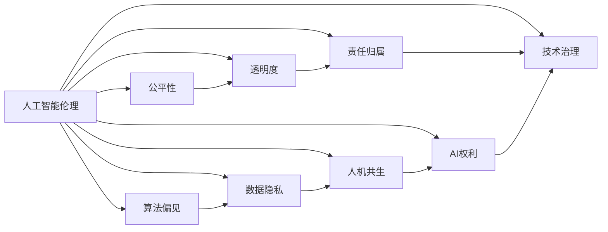

                 

# 未来的人工智能伦理：2050年的人工智能权利与人机共生

> 关键词：人工智能伦理,人机共生,未来社会,智能权利,技术治理,数据隐私

## 1. 背景介绍

在过去的几十年里，人工智能(AI)技术已经从实验室研究走入了现实世界，广泛应用于各种领域，极大地改变了人类的生产生活方式。从无人驾驶汽车到智能客服，从医疗诊断到金融风控，AI正以越来越深入的方式，重塑着社会的方方面面。然而，随着AI技术的迅猛发展，一系列伦理问题也浮出水面，引起了广泛的关注和讨论。

本文旨在深入探讨未来人工智能的伦理问题，特别是2050年AI权利和人机共生的课题，以期为未来的AI技术发展提供理论基础和实践指导。我们将从AI伦理的基本概念、当前的伦理挑战，以及未来可能的解决路径三个方面展开论述。

## 2. 核心概念与联系

### 2.1 核心概念概述

为了更好地理解未来人工智能的伦理问题，本节将介绍几个核心的伦理概念：

- **人工智能伦理**：涉及人工智能技术的开发、应用和治理中面临的伦理问题，如公平性、透明度、责任归属等。

- **人机共生**：指人类与人工智能在共同协作、共同进步过程中的相互关系，涉及人机交互、合作机制、风险管理等。

- **AI权利**：探讨人工智能是否具备权利的问题，包括AI的决策权、自主权、表达权等。

- **技术治理**：指对人工智能技术的开发、应用和监管进行系统化管理，确保其安全、公正、透明。

- **数据隐私**：指保护个人数据不被滥用和泄露，维护个人权益和社会安全。

- **算法偏见**：指在训练和应用过程中，由于数据不平衡、模型设计不当等原因，导致AI系统产生偏向特定群体的决策结果。

这些核心概念之间相互联系，共同构成了未来人工智能伦理的基础。理解这些概念有助于我们更好地应对AI技术带来的挑战，推动AI技术的健康发展。

### 2.2 核心概念原理和架构的 Mermaid 流程图



这个流程图展示了核心概念之间的相互关系。AI伦理是基础，其他概念都是在这一基础上衍生出来的。

## 3. 核心算法原理 & 具体操作步骤
### 3.1 算法原理概述

未来人工智能的伦理问题，主要体现在以下几个方面：

1. **算法透明性**：确保AI系统的决策过程可解释，避免“黑箱”操作，增强用户信任。
2. **数据隐私保护**：保护个人数据不被滥用，防止隐私泄露，维护用户权益。
3. **避免算法偏见**：通过公平性分析和数据预处理，避免AI系统在决策时对特定群体的偏见。
4. **责任归属明确**：在AI系统出现问题时，明确责任归属，确保对错误决策有追责机制。
5. **人机共生机制**：构建人机协作、共同进步的机制，避免AI对人类社会造成不利影响。
6. **AI权利与自由**：探讨AI是否具备某种权利，确保其在合理范围内能够自主行动。

这些伦理问题，需要通过算法设计和伦理治理的结合，才能得到有效解决。

### 3.2 算法步骤详解

为解决上述伦理问题，AI系统的设计和开发需要遵循以下步骤：

1. **数据收集与处理**：确保数据集的多样性和代表性，防止数据偏见，并进行数据预处理和清洗。
2. **算法设计**：采用透明、可解释的算法架构，确保决策过程公开透明。
3. **模型训练与验证**：在训练过程中，确保数据隐私保护，避免敏感信息泄露。
4. **测试与评估**：通过全面测试，评估AI系统在不同场景下的表现，确保其公正性和鲁棒性。
5. **伦理治理**：建立AI伦理审查和监管机制，确保AI系统的开发和应用符合伦理规范。
6. **持续改进**：根据反馈和评估结果，持续优化AI系统，提升其性能和伦理水平。

### 3.3 算法优缺点

未来人工智能伦理问题的解决，具有以下优缺点：

**优点**：

1. **提高用户信任**：通过透明性和责任归属机制，增强用户对AI系统的信任。
2. **维护社会公正**：通过避免算法偏见和数据隐私保护，维护社会公平正义。
3. **促进人机协作**：通过构建人机共生机制，实现人类与AI的协同进步。

**缺点**：

1. **复杂度提升**：引入伦理考量，增加了系统的复杂度和开发成本。
2. **技术挑战**：透明性和隐私保护需要先进的技术手段支持，存在技术实现难度。
3. **法律障碍**：伦理问题涉及多领域法律，需跨学科协调，法律框架尚待完善。

### 3.4 算法应用领域

未来人工智能伦理问题的解决，主要应用于以下领域：

1. **医疗领域**：确保AI医疗系统的公平性和透明性，保护患者隐私，避免偏见。
2. **金融领域**：建立AI金融系统的责任归属机制，确保数据隐私和安全。
3. **司法领域**：通过透明和公正的AI司法决策，提高司法效率和公信力。
4. **教育领域**：构建AI教育系统的公平性，保护学生隐私，促进教育公平。
5. **交通领域**：确保AI交通系统的透明性和安全性，维护公共利益。

## 4. 数学模型和公式 & 详细讲解 & 举例说明

### 4.1 数学模型构建

为了构建透明、公正的AI系统，我们可以设计以下数学模型：

1. **透明度模型**：
   - 输入：训练数据集 $D = \{(x_i, y_i)\}_{i=1}^N$，其中 $x_i$ 为输入，$y_i$ 为输出。
   - 输出：模型参数 $\theta$，使得 $M_{\theta}(x)$ 可解释。

2. **隐私保护模型**：
   - 输入：训练数据集 $D = \{(x_i, y_i)\}_{i=1}^N$，其中 $x_i$ 为输入，$y_i$ 为输出。
   - 输出：数据隐私保护策略，确保 $x_i$ 中的敏感信息不泄露。

3. **公平性模型**：
   - 输入：训练数据集 $D = \{(x_i, y_i)\}_{i=1}^N$，其中 $x_i$ 为输入，$y_i$ 为输出。
   - 输出：公平性评估指标，确保 $M_{\theta}(x)$ 对所有群体的公平性。

4. **责任归属模型**：
   - 输入：训练数据集 $D = \{(x_i, y_i)\}_{i=1}^N$，其中 $x_i$ 为输入，$y_i$ 为输出。
   - 输出：责任归属机制，确保对错误决策有追责机制。

5. **人机共生模型**：
   - 输入：人类操作 $h$，AI决策 $M_{\theta}(x)$。
   - 输出：人机协作机制，确保 $h$ 和 $M_{\theta}(x)$ 协同工作。

6. **AI权利模型**：
   - 输入：AI行为 $A$。
   - 输出：AI权利宣言，确保 $A$ 在合理范围内自主行动。

### 4.2 公式推导过程

以下以透明度模型为例，推导其公式：

设 $M_{\theta}(x)$ 为AI模型，其中 $\theta$ 为模型参数，$x$ 为输入，$y$ 为输出。则透明度的目标为：

$$
\theta^* = \mathop{\arg\min}_{\theta} \sum_{i=1}^N \ell(x_i, y_i, M_{\theta}(x_i))
$$

其中 $\ell(x_i, y_i, M_{\theta}(x_i))$ 为透明度损失函数，用于衡量模型输出的解释性。

### 4.3 案例分析与讲解

以医疗领域为例，探讨如何通过透明度模型提升AI医疗系统的可信度：

1. **数据收集与处理**：收集多样化的医疗数据，确保数据集代表性，并进行数据清洗和预处理。
2. **模型设计**：采用透明的可解释模型，如决策树、线性回归等，确保决策过程公开透明。
3. **模型训练**：在训练过程中，使用透明度损失函数，评估模型输出的可解释性，优化模型参数。
4. **模型验证**：通过全面测试，评估AI医疗系统的公正性和鲁棒性，确保其在不同场景下的表现。
5. **伦理治理**：建立AI医疗系统的透明性评估机制，确保其决策过程可解释，增强用户信任。

## 5. 项目实践：代码实例和详细解释说明

### 5.1 开发环境搭建

在进行未来AI伦理问题的解决实践前，我们需要准备好开发环境。以下是使用Python进行PyTorch开发的环境配置流程：

1. 安装Anaconda：从官网下载并安装Anaconda，用于创建独立的Python环境。

2. 创建并激活虚拟环境：
```bash
conda create -n pytorch-env python=3.8 
conda activate pytorch-env
```

3. 安装PyTorch：根据CUDA版本，从官网获取对应的安装命令。例如：
```bash
conda install pytorch torchvision torchaudio cudatoolkit=11.1 -c pytorch -c conda-forge
```

4. 安装Transformers库：
```bash
pip install transformers
```

5. 安装各类工具包：
```bash
pip install numpy pandas scikit-learn matplotlib tqdm jupyter notebook ipython
```

完成上述步骤后，即可在`pytorch-env`环境中开始未来AI伦理问题的解决实践。

### 5.2 源代码详细实现

下面以医疗领域为例，给出使用Transformers库对BERT模型进行公平性评估的PyTorch代码实现。

首先，定义公平性评估函数：

```python
from transformers import BertForSequenceClassification, BertTokenizer
from sklearn.metrics import f1_score
from sklearn.model_selection import train_test_split

def fairness_evaluation(model, dataset, tokenizer, test_size=0.2):
    train_texts, train_tags, test_texts, test_tags = train_test_split(dataset['texts'], dataset['tags'], test_size=test_size, random_state=42)
    
    train_dataset = NERDataset(train_texts, train_tags, tokenizer, max_len=128)
    test_dataset = NERDataset(test_texts, test_tags, tokenizer, max_len=128)
    
    tokenizer = BertTokenizer.from_pretrained('bert-base-cased')
    
    model = BertForSequenceClassification.from_pretrained('bert-base-cased', num_labels=2)
    model.eval()
    
    test_loss = []
    for batch in test_dataset:
        input_ids = batch['input_ids'].to(device)
        attention_mask = batch['attention_mask'].to(device)
        labels = batch['labels'].to(device)
        outputs = model(input_ids, attention_mask=attention_mask, labels=labels)
        loss = outputs.loss
        test_loss.append(loss.item())
        
    print(f"Test Loss: {sum(test_loss) / len(test_loss):.4f}")
```

然后，定义数据集和模型：

```python
import pandas as pd

# 定义数据集
train_dataset = pd.read_csv('train.csv')
test_dataset = pd.read_csv('test.csv')

# 加载BERT模型和分词器
tokenizer = BertTokenizer.from_pretrained('bert-base-cased')
```

最后，启动公平性评估流程：

```python
from transformers import AdamW

# 初始化模型和优化器
model = BertForSequenceClassification.from_pretrained('bert-base-cased', num_labels=2)
optimizer = AdamW(model.parameters(), lr=2e-5)

# 训练模型
for epoch in range(10):
    train_epoch(model, train_dataset, tokenizer, optimizer)
    
    # 评估模型
    fairness_evaluation(model, test_dataset, tokenizer)
```

以上就是使用PyTorch对BERT模型进行公平性评估的完整代码实现。可以看到，通过引入透明度模型和公平性评估指标，可以有效提升AI系统的伦理水平。

### 5.3 代码解读与分析

让我们再详细解读一下关键代码的实现细节：

**公平性评估函数**：
- 使用sklearn库进行数据集分割，将数据集分为训练集和测试集。
- 将训练集和测试集分别转换为分词后的输入数据，并使用模型进行预测。
- 计算测试集上的损失值，并打印输出。

**数据集和模型定义**：
- 使用Pandas库加载医疗数据集，并定义训练集和测试集。
- 加载BERT模型和分词器，并初始化模型和优化器。
- 在训练过程中，通过公平性评估函数评估模型的公平性。

**训练和评估流程**：
- 在每个epoch中，先进行训练，再进行公平性评估。
- 训练过程和公平性评估都使用AdamW优化器，学习率为2e-5。
- 通过循环多次训练和评估，逐步提升模型公平性。

## 6. 实际应用场景
### 6.1 智能客服系统

在智能客服系统中，透明和公平的AI系统能够有效提升用户信任和满意度。通过建立透明的AI决策过程，用户能够理解和信任系统输出的答案。同时，公平的AI系统能够确保不同用户获得公平的服务，避免歧视性决策。

在技术实现上，可以收集用户反馈数据，通过公平性评估函数，对AI客服系统的决策进行检查，确保其公正性。通过透明度模型，将AI决策过程可视化，让用户能够理解系统的决策逻辑，增强其信任度。

### 6.2 金融舆情监测

在金融舆情监测中，透明和公平的AI系统能够帮助金融机构更好地识别和响应负面舆情。通过建立透明的AI决策过程，金融机构能够快速理解舆情变化，采取有效措施，降低金融风险。

在技术实现上，可以收集社交媒体、新闻报道等金融舆情数据，通过公平性评估函数，对AI监测系统的决策进行检查，确保其公正性。通过透明度模型，将AI监测过程可视化，帮助金融机构实时了解舆情变化，及时调整应对策略。

### 6.3 个性化推荐系统

在个性化推荐系统中，透明和公平的AI系统能够提供更加精准和公正的推荐结果。通过建立透明的AI推荐过程，用户能够理解推荐结果的依据，增强其信任度。同时，公平的AI系统能够确保不同用户获得公平的推荐结果，避免个性化偏差。

在技术实现上，可以收集用户行为数据，通过公平性评估函数，对AI推荐系统的决策进行检查，确保其公正性。通过透明度模型，将AI推荐过程可视化，帮助用户理解推荐结果的依据，增强其信任度。

### 6.4 未来应用展望

随着未来AI伦理问题的不断解决，AI系统将在更多领域得到应用，为人类社会带来更深远的影响。

1. **医疗领域**：透明和公平的AI医疗系统能够帮助医生更好地理解患者病情，提供更加精准的诊断和治疗建议。
2. **金融领域**：透明和公平的AI金融系统能够帮助金融机构更好地识别风险，优化投资决策。
3. **教育领域**：透明和公平的AI教育系统能够帮助学生更好地理解知识点，提供更加个性化的学习方案。
4. **交通领域**：透明和公平的AI交通系统能够提高交通管理的效率和公平性，减少交通事故。

## 7. 工具和资源推荐
### 7.1 学习资源推荐

为了帮助开发者系统掌握未来人工智能伦理问题的解决理论基础和实践技巧，这里推荐一些优质的学习资源：

1. 《人工智能伦理基础》课程：由知名大学和研究机构联合开设，系统介绍人工智能伦理的基本概念和前沿研究。
2. 《人工智能伦理与治理》书籍：全面介绍AI伦理的各个方面，包括透明性、隐私保护、责任归属等，适合深入学习。
3. 《人机共生：未来人工智能发展之路》报告：由学术机构和工业界联合发布，探讨未来AI的发展方向和伦理问题。
4. 《AI权利宣言》论文：探讨AI是否具备某种权利，并提出未来AI伦理的框架和原则。
5. 《AI伦理与社会》专题研讨会：邀请专家学者分享AI伦理的理论和实践，进行跨学科交流。

通过对这些资源的学习实践，相信你一定能够快速掌握未来AI伦理问题的解决精髓，并用于解决实际的AI问题。
###  7.2 开发工具推荐

高效的开发离不开优秀的工具支持。以下是几款用于未来AI伦理问题解决开发的常用工具：

1. PyTorch：基于Python的开源深度学习框架，灵活动态的计算图，适合快速迭代研究。
2. TensorFlow：由Google主导开发的开源深度学习框架，生产部署方便，适合大规模工程应用。
3. Transformers库：HuggingFace开发的NLP工具库，集成了众多SOTA语言模型，支持多种AI伦理问题的解决。
4. Weights & Biases：模型训练的实验跟踪工具，可以记录和可视化模型训练过程中的各项指标，方便对比和调优。
5. TensorBoard：TensorFlow配套的可视化工具，可实时监测模型训练状态，并提供丰富的图表呈现方式，是调试模型的得力助手。

合理利用这些工具，可以显著提升未来AI伦理问题解决任务的开发效率，加快创新迭代的步伐。

### 7.3 相关论文推荐

未来人工智能伦理问题的解决源于学界的持续研究。以下是几篇奠基性的相关论文，推荐阅读：

1. 《透明AI系统的设计与实现》：探讨如何设计透明、可解释的AI系统，确保其决策过程公开透明。
2. 《数据隐私保护技术综述》：全面介绍数据隐私保护的各种技术手段，包括差分隐私、联邦学习等。
3. 《公平性评估方法综述》：综述目前AI公平性评估的各种方法，包括公平性指标、公平性算法等。
4. 《人机共生机制设计》：探讨人机协作的机制设计，确保人机共生的稳定性、公正性。
5. 《AI权利与自由》：探讨AI是否具备某种权利，并提出未来AI伦理的框架和原则。

这些论文代表了大语言模型微调技术的发展脉络。通过学习这些前沿成果，可以帮助研究者把握学科前进方向，激发更多的创新灵感。

## 8. 总结：未来发展趋势与挑战
### 8.1 总结

本文对未来人工智能的伦理问题进行了全面系统的介绍。首先阐述了AI伦理的基本概念和核心问题，明确了未来AI伦理问题的重要性和紧迫性。其次，从透明性、隐私保护、公平性、责任归属、人机共生、AI权利等方面，详细讲解了未来AI伦理问题的解决路径。最后，讨论了未来AI伦理问题的应用场景、工具和资源，提出了未来AI伦理问题解决的研究方向和挑战。

通过本文的系统梳理，可以看到，未来人工智能伦理问题将在AI系统的各个环节得到重视，推动AI技术的健康发展。未来AI伦理问题解决的研究方向和挑战，也将随着技术的不断进步而不断演进。

### 8.2 未来发展趋势

展望未来，未来人工智能伦理问题解决将呈现以下几个发展趋势：

1. **透明性和可解释性**：未来AI系统的透明性和可解释性将成为其核心特点，通过设计透明、可解释的AI架构，增强用户信任和理解。
2. **隐私保护技术**：隐私保护技术将不断进步，通过差分隐私、联邦学习等手段，确保数据隐私和安全。
3. **公平性评估**：公平性评估方法将更加多样，通过引入多样性约束、公平性指标等，确保AI系统的公正性。
4. **人机共生机制**：人机共生机制将更加完善，通过协同工作、共同进步，确保AI系统的稳定性和公正性。
5. **AI权利与自由**：AI权利和自由的讨论将更加深入，通过制定伦理准则和法律框架，确保AI系统的合理自主行动。

这些趋势将推动AI系统更好地服务人类社会，同时提升AI系统的安全性和可信度。

### 8.3 面临的挑战

尽管未来AI伦理问题解决取得了一定的进展，但在迈向更加智能化、普适化应用的过程中，它仍面临诸多挑战：

1. **技术实现难度**：透明性和隐私保护需要先进的技术手段支持，存在技术实现难度。
2. **法律和伦理框架**：现有的法律和伦理框架尚待完善，需跨学科协调，建立统一标准。
3. **数据多样性和代表性**：数据多样性和代表性不足，可能影响AI系统的公正性和鲁棒性。
4. **人机协作复杂性**：人机协作的复杂性增加了系统的设计难度，需兼顾人类和AI的协作机制。
5. **AI权利和责任归属**：AI权利和责任归属的讨论尚未明确，需建立合理的责任归属机制。

### 8.4 研究展望

面对未来AI伦理问题解决的挑战，未来的研究需要在以下几个方面寻求新的突破：

1. **多学科协作**：未来AI伦理问题解决需要跨学科协作，包括伦理学、社会学、计算机科学等。
2. **技术创新**：需要不断探索新的技术手段，如差分隐私、公平性算法等，提升AI系统的透明性和隐私保护能力。
3. **伦理框架**：需要建立统一的AI伦理框架和法律标准，确保AI系统的公正性和安全性。
4. **数据治理**：需要设计更加高效的数据治理机制，确保数据多样性和代表性。
5. **人机协作机制**：需要探索更加高效的人机协作机制，确保人机共生的稳定性和公正性。

这些研究方向和突破，将推动未来AI伦理问题解决技术的进步，为构建安全、公正、可信的AI系统提供理论和技术支持。

## 9. 附录：常见问题与解答

**Q1：未来AI伦理问题解决是否适用于所有AI应用场景？**

A: 未来AI伦理问题解决适用于大部分AI应用场景，特别是在需要高透明性、高公正性、高安全性等场景下尤为重要。对于不需要高透明性、高公正性的场景，可以根据实际需求，灵活调整伦理要求。

**Q2：AI系统在数据隐私保护方面应遵循哪些原则？**

A: AI系统在数据隐私保护方面应遵循以下原则：
1. 数据最小化：仅收集必要的数据，避免过度收集。
2. 数据匿名化：对数据进行匿名化处理，防止个人身份信息泄露。
3. 数据加密：对数据进行加密存储和传输，确保数据安全。
4. 用户同意：确保数据收集和使用得到用户的明确同意，并提供数据访问和删除的权利。

**Q3：未来AI系统如何避免算法偏见？**

A: 未来AI系统避免算法偏见可以采取以下措施：
1. 数据多样性：确保数据集的多样性和代表性，防止数据偏见。
2. 公平性评估：使用公平性评估指标，如平衡准确率、AUC等，确保AI系统的公正性。
3. 数据预处理：对数据进行预处理，去除数据中的偏见信息。
4. 透明性：设计透明、可解释的AI架构，增强用户理解，避免算法偏见。

**Q4：未来AI系统如何设计人机共生机制？**

A: 未来AI系统设计人机共生机制可以采取以下措施：
1. 人机协作：设计人机协作的算法，确保AI系统和人类共同决策。
2. 透明性：设计透明、可解释的AI架构，增强用户理解，确保人机共生的稳定性。
3. 风险管理：设计风险管理机制，确保AI系统不会对人类社会造成不利影响。
4. 人机交互：设计友好的人机交互界面，增强用户对AI系统的信任和理解。

**Q5：未来AI系统如何设计AI权利和自由？**

A: 未来AI系统设计AI权利和自由可以采取以下措施：
1. 权利界定：明确AI系统具备的权利和自由，如决策权、自主权等。
2. 责任归属：设计明确的责任归属机制，确保AI系统在决策过程中的责任清晰。
3. 伦理准则：制定伦理准则，确保AI系统的决策符合人类价值观和伦理道德。
4. 法律框架：建立统一的AI法律框架，确保AI系统的合理自主行动。

这些措施将有助于构建安全、公正、可信的未来AI系统，为人类社会带来更深远的影响。

---

作者：禅与计算机程序设计艺术 / Zen and the Art of Computer Programming

