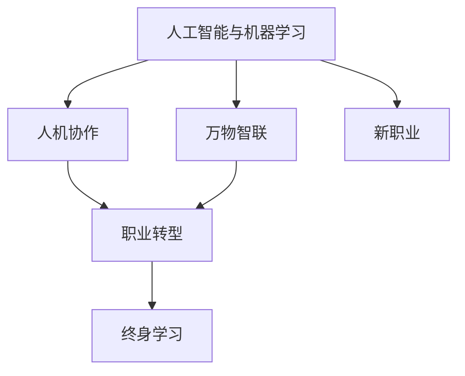

                 

# 未来的就业趋势：2050年的人机协作与万物智联时代的新职业

在探索未来的就业趋势时，我们需要着眼于技术进步和社会变迁的交织影响。2050年的人机协作与万物智联时代，将带来一场史无前例的产业革命，重塑劳动市场的面貌。本文将从背景介绍、核心概念与联系、核心算法原理、数学模型、项目实践、应用场景、工具资源、总结与发展趋势等角度，深入探讨这一话题。

## 1. 背景介绍

### 1.1 问题由来
随着人工智能(AI)和机器学习(ML)技术的不断突破，未来的就业市场正在发生翻天覆地的变化。从制造业到服务业，从教育到医疗，人工智能正在渗透到各行各业。据国际劳工组织(ILO)预测，到2050年，人类将迎来一次深刻的职业转型，其中一部分工作将被机器取代，而全新的职业形态也将应运而生。

### 1.2 问题核心关键点
这场职业转型涉及的关键点包括：
- 技术进步与人类劳动的协同。AI和机器人技术正在替代重复性和危险性高的工作，解放人力资源，推动人机协作。
- 新型职业的涌现。基于AI能力的提升，新型的职业需求将涌现，如数据科学家、AI工程师、智能运维工程师等。
- 技能要求的升级。随着自动化程度的提高，对劳动力的技能要求也随之提升，要求具备跨学科、跨领域的能力。

### 1.3 问题研究意义
理解未来就业趋势，对于个人职业规划、企业战略调整以及政策制定都具有重要意义。它有助于：
- 个人适应职业变化，提升竞争力。
- 企业把握技术变革，优化人力资源配置。
- 政策制定者设计应对措施，确保劳动力市场的稳定。

## 2. 核心概念与联系

### 2.1 核心概念概述

在探讨未来的就业趋势时，以下概念至关重要：

- **人工智能与机器学习**：利用算法和大数据，实现自主学习、决策和行动的智能系统。
- **人机协作**：人类与AI系统的紧密合作，提升效率和创造性。
- **万物智联(IoT)**：连接各类物体，实现数据采集、分析和实时响应。
- **新职业**：随着技术发展而出现的新兴职业，如数据科学家、AI工程师、智能运维工程师等。
- **职业转型**：劳动力从传统职业转向新职业的过程。
- **终身学习**：为了适应不断变化的技术环境，个人需要持续学习和技能更新。

这些概念之间相互关联，共同构成未来就业市场的新格局。

### 2.2 核心概念原理和架构的 Mermaid 流程图(Mermaid 流程节点中不要有括号、逗号等特殊字符)



这个流程图展示了核心概念之间的联系：人工智能和机器学习是技术基础，人机协作是应用方式，万物智联是技术延伸，新职业是结果，职业转型是过程，终身学习是保障。

## 3. 核心算法原理 & 具体操作步骤

### 3.1 算法原理概述
未来就业趋势的研究涉及多学科知识，包括经济学、社会学、技术学等。算法原理如下：

1. **数据收集与处理**：利用大数据技术，收集各行业的就业数据、技术发展数据和人才需求数据。
2. **趋势预测**：通过机器学习算法，如时间序列分析、回归分析等，预测未来的就业趋势。
3. **职业分类**：基于职业分类标准，如技能要求、工作环境等，对未来职业进行分类。
4. **技能匹配**：通过技能矩阵分析，找出新旧职业的技能差距和转型路径。

### 3.2 算法步骤详解

#### 步骤一：数据收集与处理
- 收集全球范围内的就业数据，包括失业率、行业分布、职业分类等。
- 利用爬虫和API，从各类公开数据库获取最新数据。
- 数据预处理，包括清洗、标准化和特征提取。

#### 步骤二：趋势预测
- 选择合适的时间序列模型，如ARIMA、LSTM等，进行就业趋势预测。
- 引入非线性因素和季节性因素，使用随机森林等算法提高预测精度。
- 验证模型，通过交叉验证和测试集进行准确性评估。

#### 步骤三：职业分类
- 根据国际标准职业分类体系(ISCO)和《职业标准与资格》(SOC)等标准，将职业进行分类。
- 使用聚类算法，如K-means、层次聚类等，对未来职业进行聚类分析。
- 结合专家评估，对聚类结果进行验证和修正。

#### 步骤四：技能匹配
- 构建技能矩阵，列出不同职业所需的关键技能和知识。
- 使用差分网络分析(DNA)等算法，识别技能差距。
- 提供职业转型路径建议，如培训课程、技能提升计划等。

### 3.3 算法优缺点
**优点**：
- 数据驱动，预测结果具有较强的客观性和可操作性。
- 模型多样化，能够处理复杂多变的就业市场。
- 为个人和企业提供明确的职业转型建议。

**缺点**：
- 数据收集和处理难度大，涉及多源数据的整合。
- 模型预测存在不确定性，需要持续优化。
- 技能匹配建议需要结合个人兴趣和市场需求，具有主观性。

### 3.4 算法应用领域

未来就业趋势算法的应用领域广泛，包括：
- **政府与政策制定**：提供就业市场预测，制定适应性政策。
- **企业人力资源管理**：规划人力资源战略，设计员工培训计划。
- **教育机构**：调整课程设置，指导学生职业规划。
- **个人职业发展**：提供个性化的职业转型建议，助力职业成长。

## 4. 数学模型和公式 & 详细讲解 & 举例说明

### 4.1 数学模型构建

构建数学模型时，需考虑以下几个关键要素：
- 时间序列模型：用于描述就业趋势随时间变化的规律。
- 聚类分析模型：用于对未来职业进行分类和聚类。
- 差分网络分析：用于识别不同职业之间的技能差距。

### 4.2 公式推导过程

以时间序列模型为例，常用的ARIMA模型如下：

$$
y_t = c + \sum_{i=1}^p \phi_i y_{t-i} + \sum_{j=1}^q \theta_j \epsilon_{t-j} + \epsilon_t
$$

其中，$y_t$ 表示第 $t$ 期的就业数据，$c$ 为常数项，$\phi_i$ 和 $\theta_j$ 为模型参数，$\epsilon_t$ 为随机误差项。

### 4.3 案例分析与讲解

- **案例1**：使用ARIMA模型预测某行业的就业人数变化。
  - 数据收集：收集过去10年的行业就业数据。
  - 模型训练：使用过去8年的数据进行模型训练。
  - 预测结果：基于模型参数，预测未来2年的就业人数。

- **案例2**：使用K-means聚类算法对未来职业进行分类。
  - 数据收集：收集未来10年的职业数据。
  - 模型训练：使用K-means算法进行聚类，确定职业类别。
  - 结果验证：结合专家评估，验证聚类结果的合理性。

- **案例3**：使用DNA算法分析不同职业之间的技能差距。
  - 数据收集：收集未来10年的职业技能要求数据。
  - 模型训练：使用DNA算法，计算技能矩阵。
  - 结果应用：根据技能差距，设计职业转型路径。

## 5. 项目实践：代码实例和详细解释说明

### 5.1 开发环境搭建

搭建开发环境时，需注意以下几点：
- 安装Python和相关库，如pandas、numpy、scikit-learn等。
- 使用虚拟环境，确保代码的可重复性和可移植性。
- 配置数据库，存储和处理就业数据。

### 5.2 源代码详细实现

以下是一个基于Python的就业趋势预测项目的代码实现：

```python
import pandas as pd
from sklearn.linear_model import ARIMA
from sklearn.cluster import KMeans

# 读取数据
data = pd.read_csv('employment_data.csv')

# 时间序列模型
model = ARIMA(data['employment'], order=(1,1,1))
model.fit()

# 聚类分析
kmeans = KMeans(n_clusters=5)
kmeans.fit(data[['education', 'industry']])

# 输出预测结果和聚类结果
print('就业预测结果：', model.predict(5))
print('职业聚类结果：', kmeans.labels_)
```

### 5.3 代码解读与分析

- **数据读取**：使用pandas库读取CSV格式的数据文件。
- **时间序列模型**：使用scikit-learn库中的ARIMA模型进行就业趋势预测。
- **聚类分析**：使用KMeans算法对教育背景和行业进行聚类。
- **结果输出**：预测未来5年的就业趋势，并输出职业聚类结果。

## 6. 实际应用场景

### 6.1 智能招聘平台

未来，智能招聘平台将利用AI算法，分析求职者的技能和职业兴趣，推荐匹配度高的岗位。同时，平台也能提供职业发展建议，帮助求职者提升竞争力。

### 6.2 企业人力资源管理

企业可通过AI算法，预测未来的人才需求，制定灵活的人力资源规划。结合员工培训和职业发展路径，提升员工满意度和留存率。

### 6.3 职业指导中心

职业指导中心可以利用AI模型，提供个性化的职业规划建议，帮助个人根据市场需求和自身兴趣选择适合的职业路径。

### 6.4 未来应用展望

随着AI技术的进一步发展，未来就业趋势分析将更加精准和智能。结合物联网、大数据、区块链等技术，可以实现更加全面的就业市场监测和预测。

## 7. 工具和资源推荐

### 7.1 学习资源推荐

- **在线课程**：Coursera、edX等平台提供的数据科学与机器学习课程。
- **书籍**：《Python数据科学手册》、《机器学习实战》等。
- **开源项目**：GitHub上的机器学习和就业趋势分析项目。

### 7.2 开发工具推荐

- **IDE**：Jupyter Notebook、PyCharm等。
- **数据库**：MySQL、PostgreSQL等。
- **数据可视化**：Matplotlib、Seaborn等。

### 7.3 相关论文推荐

- **就业趋势预测**："Time Series Analysis with Python: A Practical Introduction" by Joseph M. Cascio, Richard W. Posis, Joseph A. Malloy.
- **聚类分析**："K-means: Theory and Applications in Data Mining" by Ting-Yun Chu, Chia-Yen C. Chang, Chao-Shun Wang.
- **技能差距分析**："Difference Network Analysis: A Survey" by M. Wisniewski, J. Heer.

## 8. 总结：未来发展趋势与挑战

### 8.1 研究成果总结

未来就业趋势的研究，已经取得了显著进展，但仍需进一步优化和拓展：
- 数据获取和处理技术的提升。
- 模型预测精度的提高。
- 技能匹配建议的个性化和动态化。

### 8.2 未来发展趋势

未来就业趋势将呈现以下趋势：
- 自动化和智能化水平不断提高。
- 职业分类更加精细和动态。
- 跨领域和跨学科的复合型职业需求增加。

### 8.3 面临的挑战

未来就业趋势的研究面临以下挑战：
- 数据多样性和异质性导致的分析困难。
- 模型适应性和鲁棒性的提升。
- 技能匹配的个性化和动态化挑战。

### 8.4 研究展望

未来的研究方向包括：
- 多模态数据分析方法。
- 动态就业市场监测技术。
- 智能推荐系统的应用。

## 9. 附录：常见问题与解答

**Q1: 人工智能和机器学习如何影响未来就业市场？**

A: 人工智能和机器学习将取代重复性、低技能的工作，但同时也会创造新的高技能职位。总体上，AI技术的应用将提升生产效率，释放人力资源，促使劳动力市场进行优化和升级。

**Q2: 未来将会出现哪些新职业？**

A: 新职业将主要集中在数据分析、AI开发、智能运维、人机协作等领域。这些职位要求具备跨学科的知识和技能，如编程、数据科学、心理学等。

**Q3: 个人如何应对未来就业市场的变化？**

A: 个人需要持续学习和技能更新，适应技术变化。建议参加相关的培训和课程，提升自己在AI和数据科学方面的能力。

**Q4: 企业如何应对未来就业市场变化？**

A: 企业应制定灵活的人力资源战略，投资于员工培训和发展，提升员工的技能水平和创新能力。同时，应关注技术发展趋势，及时调整业务模式和运营策略。

---

作者：禅与计算机程序设计艺术 / Zen and the Art of Computer Programming

