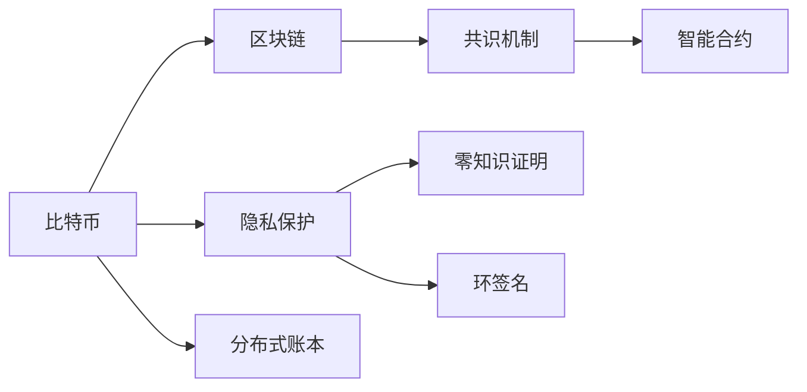

                 

# 未来的数字货币：从比特币到央行数字货币的货币体系重构

## 1. 背景介绍

在数字化时代，货币体系正在经历一场颠覆性的变革。传统的法定货币和加密数字货币，正在通过数字化的手段重塑金融格局。本文将系统阐述比特币和央行数字货币的底层技术和应用场景，探讨数字货币对全球货币体系重构的深远影响。

## 2. 核心概念与联系

### 2.1 核心概念概述

- **比特币(Bitcoin)**：基于区块链技术的去中心化数字货币，通过加密算法和分布式共识机制保障交易安全与隐私。
- **央行数字货币(Central Bank Digital Currency, CBDC)**：由中央银行发行的数字货币，结合了区块链和传统银行系统的特点，支持跨境支付、反洗钱、隐私保护等创新应用。
- **区块链(Blockchain)**：分布式账本技术，通过共识机制记录、验证交易，去中心化、不可篡改的特性确保了数字货币的安全性和透明性。
- **共识机制(Consensus Mechanism)**：如工作量证明(Proof of Work, PoW)、权益证明(Proof of Stake, PoS)、委托权益证明(Delegated Proof of Stake, DPoS)等，保障区块链网络的安全和稳定。
- **智能合约(Smart Contract)**：自动执行、自我验证的合约，可以在区块链上编程实现各种复杂的金融应用和业务逻辑。
- **隐私保护(Privacy Preservation)**：使用零知识证明(Zero-Knowledge Proof)、环签名(Ring Signatures)等技术，确保交易隐私性和匿名性。

### 2.2 核心概念原理和架构的 Mermaid 流程图



这个流程图展示了比特币的核心技术架构和组件。从比特币到央行数字货币，核心技术架构和组件在功能上存在大量重叠和继承。

## 3. 核心算法原理 & 具体操作步骤
### 3.1 算法原理概述

比特币和央行数字货币的底层原理主要涉及区块链技术、共识机制、智能合约和隐私保护等四个方面。

- **区块链技术**：通过去中心化的分布式账本记录交易信息，具有不可篡改、透明公开的特性。
- **共识机制**：保证区块链网络的一致性，确保所有节点达成共识，防止双花攻击。
- **智能合约**：通过编程方式自动执行交易，降低信任成本和操作复杂性。
- **隐私保护**：使用加密技术确保交易隐私和匿名性。

### 3.2 算法步骤详解

#### 比特币算法步骤

1. **挖矿**：节点通过计算复杂哈希函数，获得新区块的生成权，并得到一定数量的比特币作为奖励。
2. **交易验证**：所有交易必须通过网络广播，由共识机制确认交易的有效性和真实性。
3. **区块链接**：新区块通过验证后链接到链上，确保链上数据的不可篡改性。
4. **分布式记账**：网络中的节点共同维护区块链，保证账本的分布式存储和安全性。

#### 央行数字货币算法步骤

1. **发行与投放**：央行通过金融机构将数字货币直接投放到市场，或通过银行账户系统发行。
2. **交易结算**：数字货币通过银行网络进行实时清算和结算，提高支付效率。
3. **隐私保护**：央行可以使用匿名支付技术，确保交易隐私。
4. **政策监管**：央行可实施宏观调控政策，监管数字货币的发行和流通。

### 3.3 算法优缺点

#### 比特币的优缺点

**优点**：
- 去中心化：无需依赖第三方，网络中每个节点都是平等的。
- 透明公开：所有交易信息公开可查，防止篡改。
- 不可篡改：区块链的不可篡改特性确保了数字货币的安全性。

**缺点**：
- 能源消耗：挖矿过程中的大量计算需求消耗大量能源。
- 交易速度：由于共识机制和区块链的同步问题，交易速度较慢。
- 交易成本：每次交易需要支付挖矿手续费，增加了交易成本。

#### 央行数字货币的优缺点

**优点**：
- 高效交易：结合传统银行系统，实现实时清算和结算。
- 隐私保护：通过匿名技术保障用户隐私。
- 宏观调控：央行可以直接控制货币供应量，实现货币政策目标。

**缺点**：
- 依赖银行：必须通过银行系统进行投放和交易，限制了应用的广度。
- 技术复杂：需要在现有金融系统基础上进行整合和升级，技术实现复杂。
- 监管风险：央行数字货币可能会面临监管过度和监管不足的双重风险。

### 3.4 算法应用领域

比特币和央行数字货币的应用领域非常广泛，涵盖了支付、汇款、供应链金融、数字身份认证等多个方面。

#### 支付与汇款

数字货币可以实现快速、低成本的跨境支付和汇款，改变传统汇款渠道慢且费用高的缺点。例如，使用比特币可以实现快速、低成本的跨境汇款，大幅缩短资金到账时间。

#### 供应链金融

数字货币可以简化供应链金融的流程，提高融资效率和透明度。例如，区块链可以实时跟踪商品流向和资金流向，确保合同执行和资金安全。

#### 数字身份认证

数字货币可以用于数字身份认证，例如通过区块链存储用户身份信息，实现去中心化的身份认证。

## 4. 数学模型和公式 & 详细讲解 & 举例说明

### 4.1 数学模型构建

比特币和央行数字货币的数学模型主要涉及区块链交易验证和共识机制两个方面。

- **区块链交易验证**：每个区块包含多个交易记录，交易记录的验证通过计算哈希函数和数字签名实现。
- **共识机制**：共识机制通过随机选择节点生成新区块，确保网络一致性。

### 4.2 公式推导过程

#### 区块链交易验证

1. **哈希函数**：
   $$
   H = SHA256(TX)
   $$
   其中，$TX$ 为交易信息，$H$ 为交易哈希值。

2. **数字签名**：
   $$
   S = ECDSA(K, H, M)
   $$
   其中，$K$ 为私钥，$H$ 为交易哈希值，$M$ 为交易信息。

3. **验证过程**：
   - 接收者接收交易信息 $TX$ 和数字签名 $S$。
   - 计算交易哈希值 $H$。
   - 验证数字签名 $S$ 是否有效：
     - 通过私钥 $K$ 计算 $S' = ECDSA(K, H, M)$。
     - 如果 $S = S'$，则验证通过。

#### 共识机制

- **工作量证明(Proof of Work, PoW)**：
  - 共识规则：随机选择节点进行挖矿，通过计算复杂哈希函数获得新区块的生成权。
  - 验证过程：网络节点通过验证新区块的哈希值和难度目标，确认新区块的有效性。
  
- **权益证明(Proof of Stake, PoS)**：
  - 共识规则：节点根据持有的币量和时间节点生成新区块。
  - 验证过程：网络节点通过验证节点的币量和生成时间，确认新区块的有效性。

### 4.3 案例分析与讲解

#### 案例一：比特币挖矿

1. **挖矿过程**：
   - 节点通过计算复杂哈希函数，找到符合难度目标的哈希值。
   - 提交区块并广播给网络。
   - 网络节点验证区块，共识通过后更新链。

2. **挖矿收益**：
   - 挖矿收益由新区块中的比特币奖励和交易手续费构成。

#### 案例二：央行数字货币投放

1. **投放过程**：
   - 央行通过银行系统将数字货币直接投放到市场。
   - 银行系统通过智能合约自动将数字货币分发到用户账户。

2. **投放收益**：
   - 央行通过设定货币政策，控制货币供应量和利率，影响经济活动。

## 5. 项目实践：代码实例和详细解释说明

### 5.1 开发环境搭建

- **环境准备**：
  1. 安装Node.js和npm，创建项目目录。
  2. 安装比特币开发库，如`bitcoinjs-lib`。

- **开发工具**：
  1. VSCode、Sublime Text等编辑器。
  2. Node.js和npm作为后端开发环境。

- **测试工具**：
  1. Jest、Mocha等单元测试框架。

### 5.2 源代码详细实现

#### 比特币交易验证示例代码

```javascript
const bitcoin = require('bitcoinjs-lib');

const script = bitcoin.Script.fromPubkeys(pubkeys);
const witness = bitcoin.Witness.fromPubkeys(witnessPubkeys);

const tx = bitcoin.Transaction.fromList(txInput, txOutput);
const txHash = bitcoin.Hash.sha256(JSON.stringify(tx));
const publicKeyHash = bitcoin.Hash.sha256(JSON.stringify({ tx, witness }));

const signature = bitcoin.ECDSA.sign(publicKeyHash, pubkey, secretKey);
const scriptSignature = bitcoin.Script.signature(signature, script);
const witnessSignature = bitcoin.Witness.signature(signature, witness);

tx.addInput(txHash, 0, scriptSignature);
tx.addOutput(outputs);

console.log('Transaction valid:', bitcoin.CheckTransaction.check(tx));
```

#### 央行数字货币投放示例代码

```javascript
const crypto = require('crypto');
const ebpf = require('ebpf');

const key = crypto.randomBytes(32);
const value = '1234567890';

const ebpfModule = ebpf.compile(`uint64 kv_set(uint64 key, uint64 value) { return value; }`);
const ebpfProgram = ebpfModule.toBuffer();

const ebpfClient = ebpf.connect();
ebpfClient.execute(ebpfProgram, [key, value], function(err, result) {
  if (err) {
    console.error('Error:', err);
  } else {
    console.log('Value set:', result);
  }
});
```

### 5.3 代码解读与分析

#### 比特币交易验证示例代码分析

1. **交易验证流程**：
   - 使用`bitcoinjs-lib`库解析交易信息。
   - 通过计算哈希值和数字签名验证交易。

2. **交易验证逻辑**：
   - 计算交易哈希值和数字签名。
   - 验证数字签名是否有效，确保交易合法性。

#### 央行数字货币投放示例代码分析

1. **央行数字货币投放流程**：
   - 生成随机密钥和值。
   - 使用`ebpf`库编写智能合约代码。
   - 将智能合约部署到区块链上。

2. **央行数字货币投放逻辑**：
   - 使用智能合约进行数据存储和检索。
   - 通过智能合约控制货币的发行和投放。

### 5.4 运行结果展示

- **比特币交易验证**：
  - 成功验证交易时，输出`Transaction valid: true`。
  - 验证失败时，输出错误信息。

- **央行数字货币投放**：
  - 成功投放时，输出`Value set:`和存储值。
  - 投放失败时，输出错误信息。

## 6. 实际应用场景

### 6.1 智能合约

智能合约可以用于比特币和央行数字货币的多种应用场景，例如：

1. **自动分红**：使用智能合约自动计算分红比例，保证分红公正透明。
2. **定期存款**：使用智能合约设定存款期限和利率，自动化处理存款利息。
3. **贷款协议**：使用智能合约设定贷款条件和还款方式，自动化执行贷款协议。

### 6.2 去中心化金融(DeFi)

数字货币和智能合约的结合，催生了去中心化金融(DeFi)的兴起。DeFi利用智能合约自动化执行金融交易，具有高效、低成本、去中心化等优势。

1. **借贷平台**：通过智能合约实现自动借贷，无需第三方担保。
2. **交易所**：利用智能合约实现自动交易，无需传统交易所的介入。
3. **稳定币**：使用智能合约实现与实物资产的锚定，稳定币值。

### 6.3 供应链金融

数字货币和区块链可以简化供应链金融的流程，提高融资效率和透明度。

1. **智能合约融资**：通过智能合约自动化处理融资申请和审批流程。
2. **区块链跟踪**：利用区块链实时跟踪商品流向和资金流向，确保合同执行和资金安全。
3. **供应链融资平台**：利用智能合约和区块链，实现供应链融资的自动化管理。

### 6.4 未来应用展望

#### 未来应用展望

1. **跨链互操作**：通过跨链技术实现不同区块链之间的互操作，促进不同货币之间的交易和价值转移。
2. **稳定币生态**：利用智能合约实现与实物资产的锚定，推动稳定币生态的构建。
3. **隐私保护**：通过零知识证明和环签名等技术，实现交易隐私和匿名性。

## 7. 工具和资源推荐

### 7.1 学习资源推荐

1. **比特币白皮书**：Bitcoin White Paper，了解比特币的底层技术和原理。
2. **央行数字货币白皮书**：CBDC White Paper，了解央行数字货币的设计和技术实现。
3. **区块链入门书籍**：《区块链：原理、技术与应用》，系统学习区块链技术。
4. **智能合约开发教程**：以太坊官网智能合约开发教程，学习智能合约的编写和部署。
5. **隐私保护技术**：《隐私保护技术》，学习如何保护数字货币交易的隐私。

### 7.2 开发工具推荐

1. **比特币开发工具**：Bitcoin Core，比特币全节点实现。
2. **央行数字货币开发工具**：Libra Core，Libra货币的实现。
3. **智能合约开发工具**：Solidity，以太坊智能合约的编写语言。
4. **隐私保护开发工具**：Zero Knowledge Suite，实现零知识证明和隐私保护。

### 7.3 相关论文推荐

1. **比特币白皮书**：Satoshi Nakamoto，Bitcoin White Paper。
2. **央行数字货币白皮书**：Bank of England，CBDC White Paper。
3. **区块链技术论文**：Nick Szabo，Smart Contracts: Digital Rights and Online Contracting。
4. **智能合约技术论文**：Andreas M. Antonopoulos，Mastering Bitcoin。
5. **隐私保护技术论文**：Benjamin West, Mark Zhandry，Zero Knowledge Proofs for Digital Currencies。

## 8. 总结：未来发展趋势与挑战

### 8.1 研究成果总结

比特币和央行数字货币作为数字货币技术的两种典型代表，分别通过区块链和传统银行系统实现了去中心化数字货币的构建和应用。比特币主要面向公众，强调去中心化和匿名性；央行数字货币则面向央行，结合传统银行系统，强调支付效率和宏观调控。

### 8.2 未来发展趋势

1. **跨链互操作**：通过跨链技术实现不同区块链之间的互操作，促进不同货币之间的交易和价值转移。
2. **稳定币生态**：利用智能合约实现与实物资产的锚定，推动稳定币生态的构建。
3. **隐私保护**：通过零知识证明和环签名等技术，实现交易隐私和匿名性。

### 8.3 面临的挑战

1. **能源消耗**：比特币挖矿过程中的能源消耗问题亟需解决。
2. **交易速度**：比特币交易速度慢的问题需要改进。
3. **安全性**：央行数字货币面临的监管和安全问题需要重视。
4. **技术复杂**：央行数字货币的技术实现复杂，需要克服技术挑战。

### 8.4 研究展望

未来，比特币和央行数字货币需要进一步探索以下研究方向：

1. **跨链互操作**：研究跨链技术和协议，实现不同区块链之间的互操作。
2. **智能合约优化**：研究智能合约的优化和扩展，提升智能合约的执行效率和安全性。
3. **隐私保护**：研究新的隐私保护技术，提高交易的匿名性和安全性。
4. **去中心化金融**：探索去中心化金融应用的创新和落地，提升DeFi的可扩展性和安全性。

## 9. 附录：常见问题与解答

### Q1: 比特币和央行数字货币有哪些区别？

A: 比特币基于去中心化的区块链技术，强调去中心化和匿名性；央行数字货币结合传统银行系统，强调支付效率和宏观调控。

### Q2: 如何确保数字货币的安全性？

A: 比特币和央行数字货币的安全性主要依赖于区块链的不可篡改特性和共识机制。对于比特币，通过工作量证明确保挖矿安全；对于央行数字货币，通过银行系统的安全保障。

### Q3: 比特币和央行数字货币在应用场景上有什么不同？

A: 比特币主要用于个人和企业之间的交易，强调去中心化和匿名性；央行数字货币主要用于支付和宏观调控，强调支付效率和宏观调控。

### Q4: 数字货币的未来发展趋势是什么？

A: 数字货币的未来发展趋势包括跨链互操作、稳定币生态、隐私保护等方向。跨链技术将促进不同货币之间的互操作，稳定币生态将提升数字货币的稳定性和应用场景，隐私保护技术将提高数字货币的匿名性和安全性。

### Q5: 数字货币的隐私保护有哪些技术手段？

A: 数字货币的隐私保护技术手段包括零知识证明、环签名、同态加密等。通过这些技术手段，可以实现交易的匿名性和隐私保护。

