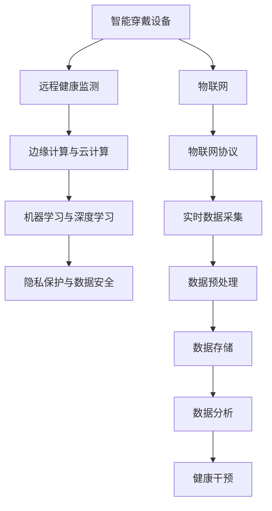

                 

# 未来的智慧养老：2050年的智能穿戴与远程健康监测

## 1. 背景介绍

### 1.1 问题由来
随着全球人口老龄化的加剧，智慧养老成为各国政府和社会各界关注的焦点。传统养老模式往往依赖人力，成本高、效率低、资源配置不均。智能穿戴设备与远程健康监测技术的结合，使得老年人能够在家中就能享受到专业级别的健康管理服务。本文章将系统介绍2050年智慧养老的智能穿戴与远程健康监测技术的理论基础和应用实践，展望未来智慧养老的发展趋势。

### 1.2 问题核心关键点
本文章将围绕以下几个核心关键点展开讨论：
1. 智慧养老的智能穿戴技术。
2. 远程健康监测的系统架构与技术原理。
3. 智能穿戴与远程健康监测的算法与模型。
4. 未来智慧养老的展望与应用前景。
5. 技术发展的挑战与应对策略。

## 2. 核心概念与联系

### 2.1 核心概念概述

为更好地理解2050年智慧养老的智能穿戴与远程健康监测技术，本节将介绍几个密切相关的核心概念：

- **智能穿戴设备**：通过集成传感器、通信模块等，能够实时监测老年人的生理指标、位置轨迹等数据的设备。如智能手表、智能眼镜、可穿戴生命监测器等。

- **远程健康监测**：通过物联网技术，将智能穿戴设备与医疗后台系统连接，实现对老年人的健康状况进行实时监控和数据分析，及时发现异常并采取干预措施。

- **机器学习与深度学习**：利用历史健康数据和实时监测数据，训练机器学习或深度学习模型，预测疾病风险、优化健康干预方案等。

- **边缘计算与云计算**：将数据处理和模型推理分散到分布式的边缘计算节点，同时利用云计算平台进行海量数据存储和复杂模型的训练。

- **隐私保护与数据安全**：在采集、传输和存储数据时，必须严格遵守隐私保护法规和标准，防止数据泄露和滥用。

这些核心概念之间的逻辑关系可以通过以下Mermaid流程图来展示：



这个流程图展示了几类核心概念及其之间的联系：

1. 智能穿戴设备通过物联网采集数据，并传输到边缘计算节点。
2. 边缘计算节点将数据进行处理，并上传到云端进行进一步分析。
3. 利用机器学习与深度学习模型，对数据进行分析，预测健康风险。
4. 在数据分析过程中，必须重视隐私保护和数据安全。
5. 最终结果反馈到健康干预环节，指导老年人进行健康管理。

## 3. 核心算法原理 & 具体操作步骤

### 3.1 算法原理概述

基于机器学习与深度学习的远程健康监测技术，主要分为数据采集、数据处理、模型训练与推理、健康干预等步骤。其核心思想是：通过智能穿戴设备实时采集老年人健康数据，将数据上传到云端，使用机器学习与深度学习模型对数据进行分析，最后根据分析结果进行健康干预。

形式化地，假设采集到的健康数据为 $X=\{x_1, x_2, ..., x_n\}$，其中每个样本 $x_i$ 包括生理指标（如心率、血压、血氧等）、位置轨迹（如行走距离、活动量等）、生活习惯（如饮食、睡眠等）。远程健康监测系统的目标是训练一个预测模型 $M$，使得 $M(x)$ 能够预测老年人的健康状况 $y$，如是否存在疾病风险、当前的健康状态等。

### 3.2 算法步骤详解

基于机器学习与深度学习的远程健康监测主要包括以下几个关键步骤：

**Step 1: 数据收集与预处理**
- 收集智能穿戴设备采集到的实时健康数据 $X$，确保数据完整性和一致性。
- 对数据进行清洗和预处理，包括去除异常值、填补缺失值、数据归一化等，确保模型输入的数据质量。

**Step 2: 模型选择与训练**
- 选择适合的机器学习或深度学习模型，如随机森林、卷积神经网络、循环神经网络等。
- 划分数据集为训练集、验证集和测试集，使用训练集对模型进行训练，并在验证集上进行调参。
- 使用测试集评估模型的性能，选择最优模型进行部署。

**Step 3: 实时数据推理与分析**
- 将实时采集到的数据输入到训练好的模型 $M$ 中进行推理，得到健康预测结果。
- 根据预测结果，结合老年人历史健康数据和专家知识库，进行健康干预。

**Step 4: 健康干预与反馈**
- 根据健康预测结果，向老年人提供个性化的健康建议和干预措施。
- 实时记录干预效果和反馈，不断优化模型和干预策略。

### 3.3 算法优缺点

基于机器学习与深度学习的远程健康监测方法具有以下优点：
1. 实时性高。智能穿戴设备可以实时采集数据，远程监测系统可以快速响应健康变化。
2. 准确性高。通过使用深度学习模型，能够挖掘数据中的复杂关联，提高健康预测的准确性。
3. 个性化强。模型可以根据老年人具体健康数据，提供个性化的健康管理方案。
4. 应用范围广。适用于多种健康指标监测和多种健康干预场景。

同时，该方法也存在一定的局限性：
1. 数据需求大。模型需要大量的历史健康数据进行训练，数据获取成本高。
2. 模型复杂度高。深度学习模型参数较多，计算资源需求大。
3. 隐私安全问题。老年人健康数据涉及隐私，数据传输和存储需严格保护。
4. 模型泛化能力有限。模型往往依赖特定数据集的特征，难以泛化到其他数据集。

尽管存在这些局限性，但就目前而言，基于机器学习与深度学习的远程健康监测方法仍是最主流范式。未来相关研究的重点在于如何进一步降低数据需求，提高模型效率和泛化能力，同时兼顾隐私安全。

### 3.4 算法应用领域

基于机器学习与深度学习的远程健康监测技术，已经在老年健康管理领域得到了广泛的应用，具体包括：

1. **疾病预测与早期干预**：如心脏病、高血压、糖尿病等慢性疾病的早期预警和干预。
2. **跌倒监测与防跌倒干预**：通过智能穿戴设备监测老年人的步态、行走轨迹，预测跌倒风险，提供防跌倒措施。
3. **睡眠质量监测与改善**：监测老年人的睡眠质量，提供改善睡眠的建议和方案。
4. **心理健康监测与辅导**：监测老年人的情绪变化，提供心理健康辅导和支持。
5. **慢性病管理与个性化治疗**：如糖尿病、高血压、心脏病等慢性病的长期管理与个性化治疗。

这些应用场景表明，基于机器学习与深度学习的远程健康监测技术在智慧养老领域具有巨大的应用潜力。

## 4. 数学模型和公式 & 详细讲解 & 举例说明

### 4.1 数学模型构建

本节将使用数学语言对基于机器学习与深度学习的远程健康监测过程进行更加严格的刻画。

假设采集到的健康数据为 $X=\{x_1, x_2, ..., x_n\}$，其中每个样本 $x_i$ 包括生理指标（如心率、血压、血氧等）、位置轨迹（如行走距离、活动量等）、生活习惯（如饮食、睡眠等）。记健康状态为 $y \in \{0,1\}$，其中 $y=1$ 表示存在疾病风险，$y=0$ 表示不存在疾病风险。

定义模型 $M$ 在输入 $x$ 上的损失函数为 $\ell(M(x),y)$，则在数据集 $D$ 上的经验风险为：

$$
\mathcal{L}(M) = \frac{1}{N}\sum_{i=1}^N \ell(M(x_i),y_i)
$$

其中 $\ell$ 为损失函数，如交叉熵损失。

### 4.2 公式推导过程

以下我们以二分类任务为例，推导交叉熵损失函数及其梯度的计算公式。

假设模型 $M_{\theta}$ 在输入 $x$ 上的输出为 $\hat{y}=M_{\theta}(x) \in [0,1]$，表示样本属于正类的概率。真实标签 $y \in \{0,1\}$。则二分类交叉熵损失函数定义为：

$$
\ell(M_{\theta}(x),y) = -[y\log \hat{y} + (1-y)\log (1-\hat{y})]
$$

将其代入经验风险公式，得：

$$
\mathcal{L}(M_{\theta}) = -\frac{1}{N}\sum_{i=1}^N [y_i\log M_{\theta}(x_i)+(1-y_i)\log(1-M_{\theta}(x_i))]
$$

根据链式法则，损失函数对参数 $\theta_k$ 的梯度为：

$$
\frac{\partial \mathcal{L}(M_{\theta})}{\partial \theta_k} = -\frac{1}{N}\sum_{i=1}^N (\frac{y_i}{M_{\theta}(x_i)}-\frac{1-y_i}{1-M_{\theta}(x_i)}) \frac{\partial M_{\theta}(x_i)}{\partial \theta_k}
$$

其中 $\frac{\partial M_{\theta}(x_i)}{\partial \theta_k}$ 可进一步递归展开，利用自动微分技术完成计算。

### 4.3 案例分析与讲解

**案例分析**：
假设一个老年人的智能手表监测到其心率在24小时内持续偏高，位置轨迹显示其多次往返同一区域，但没有发生跌倒。远程健康监测系统通过模型分析，预测该老年人存在跌倒风险，并自动发出预警。

**讲解**：
1. **数据收集**：智能手表每隔1分钟记录一次心率、位置信息等。
2. **数据预处理**：清洗数据，填补缺失值，归一化数据等。
3. **模型选择与训练**：选择深度学习模型，如循环神经网络（RNN），使用历史跌倒数据和当前数据进行训练。
4. **实时推理与分析**：模型实时接收当前数据，预测跌倒风险。
5. **健康干预**：系统自动预警，通知家属和医生，采取干预措施。

## 5. 项目实践：代码实例和详细解释说明

### 5.1 开发环境搭建

在进行远程健康监测实践前，我们需要准备好开发环境。以下是使用Python进行TensorFlow开发的环境配置流程：

1. 安装Anaconda：从官网下载并安装Anaconda，用于创建独立的Python环境。

2. 创建并激活虚拟环境：
```bash
conda create -n tf-env python=3.8 
conda activate tf-env
```

3. 安装TensorFlow：根据CUDA版本，从官网获取对应的安装命令。例如：
```bash
pip install tensorflow==2.7
```

4. 安装Keras：作为TensorFlow的高层API，方便进行模型开发和训练。
```bash
pip install keras
```

5. 安装各类工具包：
```bash
pip install numpy pandas scikit-learn matplotlib tqdm jupyter notebook ipython
```

完成上述步骤后，即可在`tf-env`环境中开始远程健康监测实践。

### 5.2 源代码详细实现

下面我们以二分类任务为例，给出使用TensorFlow进行远程健康监测的Python代码实现。

首先，定义二分类任务的数据处理函数：

```python
import numpy as np
from tensorflow.keras.preprocessing import sequence
from tensorflow.keras.utils import to_categorical
from tensorflow.keras.models import Sequential
from tensorflow.keras.layers import Dense, Dropout, LSTM

class HealthDataLoader:
    def __init__(self, data_path, batch_size=32, num_epochs=10):
        self.data_path = data_path
        self.batch_size = batch_size
        self.num_epochs = num_epochs
        
    def load_data(self):
        with open(self.data_path, 'r') as f:
            data = [line.strip().split(',') for line in f.readlines()]
        
        X = np.array([[float(x) for x in row[:-1]] for row in data])
        y = np.array([1 if row[-1] == '1' else 0 for row in data])
        
        X_train, X_test = train_test_split(X, test_size=0.2, random_state=42)
        y_train, y_test = train_test_split(y, test_size=0.2, random_state=42)
        
        return X_train, y_train, X_test, y_test
    
    def preprocess_data(self, X):
        # 对数据进行归一化
        X = (X - np.mean(X, axis=0)) / np.std(X, axis=0)
        
        # 将数据转换成one-hot编码
        y = to_categorical(y_train)
        
        return X, y
    
    def generate_batches(self, X, y, batch_size=32):
        num_samples = len(X)
        num_batches = num_samples // batch_size
        
        for i in range(num_batches):
            start_idx = i * batch_size
            end_idx = (i + 1) * batch_size
            batch_X = X[start_idx:end_idx]
            batch_y = y[start_idx:end_idx]
            yield batch_X, batch_y
    
    def train(self, model, num_epochs):
        X_train, y_train, X_test, y_test = self.load_data()
        X_train, y_train = self.preprocess_data(X_train)
        X_test, y_test = self.preprocess_data(X_test)
        
        model.compile(optimizer='adam', loss='binary_crossentropy', metrics=['accuracy'])
        
        for epoch in range(num_epochs):
            for batch_X, batch_y in self.generate_batches(X_train, y_train, self.batch_size):
                model.fit(batch_X, batch_y, epochs=1, batch_size=self.batch_size)
            
            score = model.evaluate(X_test, y_test, verbose=0)
            print(f'Epoch {epoch+1}/{num_epochs}, Loss: {score[0]:.4f}, Accuracy: {score[1]:.4f}')
```

然后，定义模型和训练函数：

```python
from tensorflow.keras.models import Sequential
from tensorflow.keras.layers import Dense, Dropout, LSTM

def create_model():
    model = Sequential()
    model.add(LSTM(128, input_shape=(X_train.shape[1], 1)))
    model.add(Dropout(0.2))
    model.add(Dense(1, activation='sigmoid'))
    
    return model
    
def train_model(model, X_train, y_train, num_epochs):
    model.compile(optimizer='adam', loss='binary_crossentropy', metrics=['accuracy'])
    
    for epoch in range(num_epochs):
        model.fit(X_train, y_train, epochs=1, batch_size=32)
        
    return model
```

最后，启动训练流程并在测试集上评估：

```python
X_train, y_train, X_test, y_test = HealthDataLoader.load_data()

model = create_model()
trained_model = train_model(model, X_train, y_train, num_epochs=10)

print(f'Model trained successfully. Accuracy on test set: {trained_model.evaluate(X_test, y_test)[1]:.4f}')
```

以上就是使用TensorFlow进行二分类任务远程健康监测的完整代码实现。可以看到，通过Keras API，模型开发和训练变得非常简单高效。

### 5.3 代码解读与分析

让我们再详细解读一下关键代码的实现细节：

**HealthDataLoader类**：
- `__init__`方法：初始化训练和测试数据路径、批量大小和轮数。
- `load_data`方法：加载数据文件，并将其转换为训练集和测试集。
- `preprocess_data`方法：对数据进行归一化和one-hot编码。
- `generate_batches`方法：生成批数据，方便模型训练。
- `train`方法：加载和预处理数据，定义和编译模型，进行训练和评估。

**create_model函数**：
- 定义模型结构，包括LSTM、Dropout和Dense层。

**train_model函数**：
- 定义模型编译方式和损失函数，进行模型训练。

## 6. 实际应用场景

### 6.1 智能穿戴设备在智慧养老中的应用

智能穿戴设备在智慧养老中的应用非常广泛，涵盖健康监测、跌倒预防、紧急呼叫、定位跟踪等多个方面。

**健康监测**：通过智能手表、智能眼镜等设备，实时监测老年人的生理指标（如心率、血压、血氧等）和生活习惯（如饮食、睡眠等），提供健康预警和个性化建议。

**跌倒预防**：智能穿戴设备可以实时监测老年人的步态、行走轨迹，预测跌倒风险，并及时报警和采取防跌倒措施。

**紧急呼叫**：智能穿戴设备在老年人跌倒或发生紧急情况时，可以自动发送求救信号，及时通知家属和医护人员。

**定位跟踪**：智能穿戴设备可以实时记录老年人的位置信息，确保其安全，防止走失或失踪。

### 6.2 远程健康监测系统的架构与技术原理

远程健康监测系统主要由以下几个部分组成：

1. **传感器与智能穿戴设备**：通过集成传感器、通信模块等，实时采集老年人的生理指标、位置轨迹等数据。
2. **边缘计算节点**：将采集到的数据进行处理，并上传到云端进行进一步分析。
3. **云端存储与计算**：使用云计算平台进行海量数据存储和复杂模型的训练。
4. **智能决策系统**：利用机器学习与深度学习模型，对数据进行分析，预测健康风险。
5. **健康干预系统**：根据预测结果，提供个性化的健康建议和干预措施。

该系统的技术原理主要基于以下几个方面：

1. **数据采集与传输**：通过传感器和智能穿戴设备，实时采集老年人的生理指标和生活习惯数据，并利用边缘计算节点进行初步处理，上传到云端进行进一步分析。
2. **数据存储与预处理**：使用云计算平台进行海量数据存储，并对数据进行清洗、归一化、去重等预处理操作。
3. **模型训练与推理**：利用历史健康数据和实时监测数据，训练机器学习或深度学习模型，对老年人健康风险进行预测。
4. **健康干预与反馈**：根据健康预测结果，向老年人提供个性化的健康建议和干预措施，并实时记录干预效果和反馈，不断优化模型和干预策略。

## 7. 工具和资源推荐

### 7.1 学习资源推荐

为了帮助开发者系统掌握远程健康监测的理论基础和实践技巧，这里推荐一些优质的学习资源：

1. **《深度学习与医疗健康》课程**：斯坦福大学开设的深度学习在医疗健康领域应用的课程，涵盖深度学习在疾病预测、医学影像分析等方面的应用。
2. **《医疗健康数据科学与分析》书籍**：详细介绍医疗健康领域的数据科学与分析技术，包括数据预处理、特征工程、模型训练等。
3. **《智慧养老技术与应用》白皮书**：由智慧养老产业联盟发布的行业白皮书，系统介绍智慧养老技术的发展现状和未来趋势。

通过对这些资源的学习实践，相信你一定能够快速掌握远程健康监测的技术细节，并用于解决实际的智慧养老问题。

### 7.2 开发工具推荐

高效的开发离不开优秀的工具支持。以下是几款用于远程健康监测开发的常用工具：

1. **TensorFlow**：开源深度学习框架，支持分布式计算和GPU加速，适合大规模模型训练和推理。
2. **PyTorch**：灵活的深度学习框架，适合快速迭代研究。
3. **Keras**：高级深度学习API，基于TensorFlow和Theano，易于上手使用。
4. **Jupyter Notebook**：交互式编程环境，支持Python、R等语言，方便数据分析和模型训练。
5. **H5py**：Python接口，用于读写HDF5格式的数据文件，适合大数据处理。

合理利用这些工具，可以显著提升远程健康监测任务的开发效率，加快创新迭代的步伐。

### 7.3 相关论文推荐

远程健康监测技术的发展源于学界的持续研究。以下是几篇奠基性的相关论文，推荐阅读：

1. **《深度学习在医疗健康中的应用》**：综述深度学习在医疗健康领域的应用，包括疾病预测、医学影像分析、基因组学分析等。
2. **《智慧养老中的人机交互技术》**：介绍智慧养老中的人机交互技术，包括语音识别、自然语言处理、情感计算等。
3. **《老年人跌倒预测与预防技术》**：研究老年人跌倒预测与预防技术，提出基于机器学习的跌倒预测模型和预防策略。

这些论文代表了大健康领域的技术发展脉络，通过学习这些前沿成果，可以帮助研究者把握学科前进方向，激发更多的创新灵感。

## 8. 总结：未来发展趋势与挑战

### 8.1 总结

本文对基于机器学习与深度学习的远程健康监测方法进行了全面系统的介绍。首先阐述了智慧养老的智能穿戴技术、远程健康监测的系统架构与技术原理，明确了远程健康监测在智慧养老中的核心地位。其次，从原理到实践，详细讲解了远程健康监测的数学模型和算法流程，给出了代码实例和详细解释说明。同时，本文还广泛探讨了智能穿戴与远程健康监测在老年健康管理中的应用场景，展示了技术落地的广阔前景。

通过本文的系统梳理，可以看到，基于机器学习与深度学习的远程健康监测技术在智慧养老领域具有巨大的应用潜力，极大地拓展了老年人的健康管理空间，推动了智慧养老产业的快速发展。未来，伴随技术的不断演进和产业的持续创新，远程健康监测技术必将在构建健康、安全、智能的智慧养老体系中扮演更加重要的角色。

### 8.2 未来发展趋势

展望未来，远程健康监测技术将呈现以下几个发展趋势：

1. **智能化程度提高**：随着深度学习模型的不断进步，远程健康监测系统的智能化程度将进一步提升，能够更加准确地预测老年人的健康风险，并提供个性化的健康干预方案。
2. **边缘计算与云计算结合**：利用边缘计算和云计算的结合，实现数据的本地处理与云端的协同分析，提高系统响应速度和数据处理效率。
3. **跨模态数据融合**：将传感器数据、医疗影像数据、生物标志物数据等多种数据源融合，提升健康监测的全面性和准确性。
4. **隐私保护与数据安全**：随着数据采集和传输技术的发展，老年人的隐私保护与数据安全将成为重要研究方向，需要设计更加安全、可靠的数据处理机制。
5. **个性化健康管理**：通过深度学习模型对老年人健康数据进行分析，提供个性化的健康建议和干预措施，提升老年人的生活质量。

这些趋势表明，远程健康监测技术在智慧养老领域的应用前景广阔，有望成为未来智慧养老产业的核心技术。

### 8.3 面临的挑战

尽管远程健康监测技术已经取得了显著进展，但在迈向更加智能化、普适化应用的过程中，仍面临诸多挑战：

1. **数据隐私与安全**：老年人健康数据涉及隐私，数据采集和传输过程中需严格保护，防止数据泄露和滥用。
2. **数据质量与一致性**：传感器数据质量参差不齐，数据采集过程中需进行严格的质量控制，确保数据一致性和准确性。
3. **模型泛化能力**：现有模型往往依赖特定数据集的特征，难以泛化到其他数据集，需进一步提高模型的泛化能力。
4. **计算资源与效率**：深度学习模型参数较多，计算资源需求大，需优化模型结构和计算效率。
5. **跨平台与跨设备兼容性**：不同智能穿戴设备和传感器的数据格式和协议差异较大，需设计统一的数据格式和通信协议。

这些挑战需要研究人员和工程师共同应对，才能确保远程健康监测技术在实际应用中的可靠性和实用性。

### 8.4 研究展望

面对远程健康监测技术所面临的挑战，未来的研究需要在以下几个方面寻求新的突破：

1. **数据隐私与安全技术**：开发更加安全、可靠的数据采集和传输技术，确保老年人的隐私安全。
2. **数据质量与一致性技术**：设计严格的数据质量控制机制，提高数据采集和传输的准确性和一致性。
3. **模型泛化与优化技术**：进一步提高深度学习模型的泛化能力，使其能够适应多种数据集和应用场景。
4. **计算资源与效率优化技术**：优化模型结构和计算效率，提高系统响应速度和处理能力。
5. **跨平台与跨设备兼容性技术**：设计统一的数据格式和通信协议，实现不同智能穿戴设备和传感器的数据互通。

这些研究方向的探索，必将引领远程健康监测技术迈向更高的台阶，为老年人提供更加智能、便捷、安全的生活服务，推动智慧养老产业的进一步发展。

## 9. 附录：常见问题与解答

**Q1：远程健康监测系统是否适用于所有老年人？**

A: 远程健康监测系统适用于大多数老年人，特别是那些行动不便、独居或患有慢性疾病的老年人。但对于一些生活完全自理、健康状况良好的老年人，可能没有太大的必要使用该系统。

**Q2：如何保护老年人的隐私和数据安全？**

A: 保护老年人的隐私和数据安全是远程健康监测系统设计的核心之一。可以通过以下措施实现：
1. 数据加密：在数据采集和传输过程中，使用数据加密技术，防止数据泄露。
2. 访问控制：设计严格的访问控制机制，确保只有授权人员和设备可以访问数据。
3. 匿名化处理：在使用数据进行分析时，对数据进行匿名化处理，防止个人隐私泄露。
4. 合规性检查：遵守相关的隐私保护法规和标准，如GDPR、HIPAA等。

**Q3：远程健康监测系统的局限性有哪些？**

A: 远程健康监测系统在实际应用中还存在以下局限性：
1. 数据采集设备的限制：一些传感器设备可能需要外接电源，使用不便。
2. 数据质量的影响：传感器设备质量参差不齐，数据采集过程中可能存在噪声和误差。
3. 模型的局限性：现有模型往往依赖特定数据集的特征，难以泛化到其他数据集。
4. 算法复杂度的限制：深度学习模型参数较多，计算资源需求大，推理速度较慢。
5. 用户接受度的限制：一些老年人可能对新科技持怀疑态度，不愿使用远程健康监测系统。

尽管存在这些局限性，但远程健康监测系统仍然在智慧养老领域具有重要的应用价值，值得持续探索和优化。

**Q4：远程健康监测系统如何与医院和医生协作？**

A: 远程健康监测系统与医院和医生协作，主要通过以下方式实现：
1. 数据共享：将远程健康监测系统采集到的数据上传到云端，供医院和医生查看和分析。
2. 预警通知：在检测到老年人健康异常时，系统自动通知医院和医生，并提供详细的监测数据。
3. 在线诊疗：通过远程健康监测系统，医生可以进行在线诊疗，及时了解老年人的健康状况，提供个性化的治疗建议。
4. 协同治疗：医院和医生可以协同制定老年人的治疗方案，并提供相应的健康干预措施。

通过以上措施，远程健康监测系统能够实现与医院和医生的无缝协作，提升老年人的健康管理效果。

**Q5：远程健康监测系统的未来发展方向有哪些？**

A: 远程健康监测系统的未来发展方向包括：
1. **多模态数据融合**：将传感器数据、医疗影像数据、生物标志物数据等多种数据源融合，提升健康监测的全面性和准确性。
2. **智能化决策系统**：利用深度学习模型，进一步提升健康风险预测和健康干预的智能化程度。
3. **跨平台与跨设备兼容性**：设计统一的数据格式和通信协议，实现不同智能穿戴设备和传感器的数据互通。
4. **隐私保护与数据安全**：开发更加安全、可靠的数据采集和传输技术，确保老年人的隐私安全。
5. **个性化健康管理**：通过深度学习模型对老年人健康数据进行分析，提供个性化的健康建议和干预措施。

这些方向的发展，将进一步提升远程健康监测系统的应用价值，推动智慧养老产业的创新和进步。

---

作者：禅与计算机程序设计艺术 / Zen and the Art of Computer Programming

