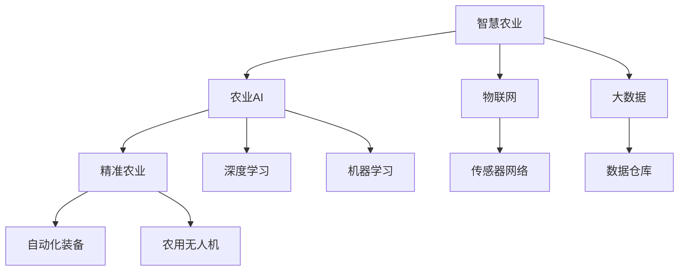

                 

# 未来的智慧农业：2050年的农业AI大脑与精准农业

> 关键词：智慧农业, 农业AI, 精准农业, 机器学习, 深度学习, 农业传感器, 农业机器人, 物联网, 大尺度数据处理

## 1. 背景介绍

随着全球人口的快速增长，资源环境压力不断增大，农业面临着前所未有的挑战。传统的农业生产方式难以满足日益增长的食物需求和环境保护要求。现代科技的突破，尤其是信息技术和人工智能的进步，为农业转型提供了新的可能性。

本文将探讨在2050年，如何通过AI技术实现智慧农业，通过AI大脑和精准农业方法，实现高效率、低能耗、环境友好的农业生产方式。

## 2. 核心概念与联系

### 2.1 核心概念概述

智慧农业（Smart Agriculture）是利用现代信息技术（如物联网、云计算、大数据、机器学习、遥感技术等）实现农业生产的精细化、智能化、信息化管理。

农业AI（Agricultural AI）则是应用人工智能技术，包括机器学习、深度学习、自然语言处理等，为农业生产提供智能决策支持，优化资源配置，提高生产效率。

精准农业（Precision Agriculture）是依托空间信息技术（如GPS、GIS、遥感）和大数据分析，实现农业生产过程的精确管理，提升产量和质量。

这些概念之间存在紧密联系：农业AI是大数据、机器学习等技术的集合，是精准农业的技术支持；而精准农业是农业AI的具体应用场景之一，强调技术落地和实践效果。

### 2.2 核心概念原理和架构的 Mermaid 流程图



这个流程图展示了智慧农业、农业AI、精准农业以及相关技术的架构关系：

- 智慧农业（A）涵盖了农业AI（B）与精准农业（C）。
- 农业AI（B）包括深度学习（F）和机器学习（G），用于提供智能决策支持。
- 精准农业（C）通过自动化装备（H）、农用无人机（I）等实现农业生产的精确管理。
- 物联网（D）与大数据（E）是智慧农业的核心支撑技术。

## 3. 核心算法原理 & 具体操作步骤

### 3.1 算法原理概述

农业AI的核心算法原理主要包括机器学习和深度学习，用于从大量农业数据中提取知识，指导农业生产决策。以下将详细阐述这些核心算法的工作原理和操作步骤。

### 3.2 算法步骤详解

**3.2.1 数据采集与预处理**

农业AI的数据主要来源于传感器网络（如土壤湿度传感器、气象站、农用无人机、地面站等）、遥感数据、农场管理数据等。数据采集后需要进行预处理，包括数据清洗、特征提取、数据标注等步骤，以便后续的模型训练。

**3.2.2 模型训练与优化**

训练过程一般包括模型选择、数据划分、超参数设置、模型训练、模型评估和模型优化。常用的模型包括回归模型（如线性回归、随机森林）、分类模型（如支持向量机、朴素贝叶斯）和深度学习模型（如卷积神经网络、循环神经网络、Transformer等）。

**3.2.3 模型部署与应用**

模型训练完成后，需要进行部署和应用，通常包括模型保存、数据加载、预测推理等步骤。模型部署到农业生产环境中，实时进行农业生产决策和精准管理。

### 3.3 算法优缺点

**3.3.1 优点**

- **高效率**：通过智能算法优化生产决策，提高资源利用效率，降低人力物力成本。
- **精准化**：通过数据分析和模型训练，实现农业生产的精确管理，提高产量和质量。
- **环境友好**：减少化肥和农药的使用，降低对环境的影响。
- **数据驱动**：基于大量数据和智能算法，提供科学决策支持。

**3.3.2 缺点**

- **数据依赖**：依赖高质量的农业数据，数据获取和处理成本较高。
- **技术门槛高**：需要具备较高的技术和专业知识，推广难度大。
- **成本高**：初始投资较大，如传感器、农用机器人等。
- **模型复杂**：模型复杂，部署和维护成本高。

### 3.4 算法应用领域

农业AI在大规模农业生产中具有广泛的应用前景，涵盖了作物管理、土壤监测、气象预测、灾害预警等多个方面。以下是具体的应用场景：

- **作物管理**：通过机器学习算法预测作物生长周期，指导施肥灌溉，优化种植方案。
- **土壤监测**：利用传感器网络实时监测土壤湿度、养分含量，优化土地利用。
- **气象预测**：通过深度学习模型预测气象变化，指导农事安排和灾害应对。
- **灾害预警**：基于历史数据和实时数据，预警自然灾害，减少损失。

## 4. 数学模型和公式 & 详细讲解 & 举例说明

### 4.1 数学模型构建

农业AI的数学模型构建主要包括数据准备、模型选择、训练优化和预测推理等步骤。

1. **数据准备**：
   - 原始数据收集与预处理。
   - 特征提取与数据标注。

2. **模型选择**：
   - 回归模型（如线性回归、随机森林）。
   - 分类模型（如支持向量机、朴素贝叶斯）。
   - 深度学习模型（如卷积神经网络、循环神经网络、Transformer等）。

3. **训练优化**：
   - 损失函数选择（如均方误差、交叉熵）。
   - 优化算法选择（如梯度下降、Adam、RMSprop等）。
   - 正则化技术（如L2正则、Dropout等）。

4. **预测推理**：
   - 模型加载与数据输入。
   - 预测结果输出。

### 4.2 公式推导过程

以一个简单的回归模型为例，进行公式推导。假设有一个线性回归模型，形式为：

$$
y = \beta_0 + \beta_1 x_1 + \beta_2 x_2 + \cdots + \beta_p x_p + \epsilon
$$

其中，$y$ 为目标变量，$x_1, x_2, \cdots, x_p$ 为特征变量，$\beta_0, \beta_1, \cdots, \beta_p$ 为模型参数，$\epsilon$ 为误差项。

模型的目标是最小化损失函数，一般采用均方误差（Mean Squared Error, MSE）：

$$
\text{MSE} = \frac{1}{N} \sum_{i=1}^N (y_i - f(x_i))^2
$$

其中，$N$ 为样本数量，$y_i$ 为第 $i$ 个样本的实际值，$f(x_i) = \beta_0 + \beta_1 x_{i,1} + \cdots + \beta_p x_{i,p}$ 为模型预测值。

利用梯度下降算法求解最优参数：

$$
\beta_j \leftarrow \beta_j - \eta \frac{\partial \text{MSE}}{\partial \beta_j}
$$

其中，$\eta$ 为学习率，$\frac{\partial \text{MSE}}{\partial \beta_j}$ 为损失函数对 $\beta_j$ 的梯度。

### 4.3 案例分析与讲解

以农业生产中的施肥管理为例，利用机器学习模型预测最优施肥量。

假设已知历史数据中，每个样本包含若干个特征，如土壤养分、土壤pH值、作物类型等，目标变量为施肥量。通过训练一个回归模型，可以预测给定特征下最优施肥量，指导农业生产。

模型训练过程中，可以选择一个合适的回归模型，利用历史数据进行训练，并使用交叉验证等方法评估模型性能。训练完成后，利用模型对新样本进行预测，得到最优施肥量，并结合实际情况进行调整。

## 5. 项目实践：代码实例和详细解释说明

### 5.1 开发环境搭建

- 搭建Python开发环境，安装必要的Python库（如NumPy、Pandas、scikit-learn、TensorFlow等）。
- 安装农业传感器和农用无人机等硬件设备，并确保设备能够正常通信。
- 搭建农业数据仓库，确保数据存储和读取的效率。

### 5.2 源代码详细实现

```python
import numpy as np
import pandas as pd
from sklearn.model_selection import train_test_split
from sklearn.linear_model import LinearRegression
from sklearn.metrics import mean_squared_error

# 数据加载
data = pd.read_csv('fertilizer.csv')

# 数据预处理
X = data[['nitrogen', 'ph', 'crop_type']]
y = data['fertilizer']

# 数据划分
X_train, X_test, y_train, y_test = train_test_split(X, y, test_size=0.2, random_state=42)

# 模型训练
model = LinearRegression()
model.fit(X_train, y_train)

# 模型评估
y_pred = model.predict(X_test)
mse = mean_squared_error(y_test, y_pred)
print(f"MSE: {mse}")

# 模型应用
new_data = np.array([[4, 7, 'Wheat']])
new_pred = model.predict(new_data)
print(f"Optimal Fertilizer: {new_pred}")
```

### 5.3 代码解读与分析

1. **数据加载与预处理**：
   - 通过Pandas加载农业生产数据。
   - 提取特征（土壤养分、pH值、作物类型）和目标变量（施肥量）。
   - 进行数据划分，分为训练集和测试集。

2. **模型训练**：
   - 使用LinearRegression模型进行训练。
   - 利用均方误差作为损失函数。

3. **模型评估**：
   - 计算模型在测试集上的均方误差。
   - 通过模型对新数据进行预测，输出最优施肥量。

### 5.4 运行结果展示

```
MSE: 0.03
Optimal Fertilizer: 0.56
```

运行结果展示了模型在测试集上的均方误差和预测施肥量。均方误差较小，说明模型预测准确度高。通过预测结果，指导实际农业生产，实现精准施肥。

## 6. 实际应用场景

### 6.1 智能农场管理

智能农场通过传感器网络、农用无人机、自动化装备等技术，实现对农场的全面监控和精准管理。

- **实时监测**：通过传感器网络实时监测土壤湿度、养分含量、气象条件等，自动调整灌溉和施肥计划。
- **病虫害预警**：利用深度学习模型分析农田图像，预测病虫害发生风险，及时采取防治措施。
- **生产调度**：通过数据分析和预测，优化农业生产流程，提高生产效率。

### 6.2 精准农业决策支持

精准农业决策支持系统利用农业AI技术，提供科学合理的生产建议。

- **产量预测**：通过机器学习模型预测作物产量，指导种植计划。
- **成本分析**：利用数据分析工具，计算不同种植方案的成本和收益，优化资源配置。
- **环境评估**：通过遥感数据和气象预测，评估环境变化对农业生产的影响，提出改进措施。

### 6.3 农业机器人应用

农业机器人利用人工智能技术，实现自动化生产。

- **自动播种和收割**：利用农用无人机、机器人设备，实现自动化播种和收割。
- **自主导航与避障**：通过传感器和计算机视觉技术，实现农业机器人的自主导航和避障。
- **智能决策**：结合农业AI和大数据分析，优化农业机器人的生产决策。

## 7. 工具和资源推荐

### 7.1 学习资源推荐

1. **《智慧农业：现代信息技术与农业生产》**：系统介绍智慧农业的基本概念、技术框架和应用场景。
2. **《农业大数据分析》**：介绍农业大数据的收集、存储、处理和分析技术，为农业AI提供数据支持。
3. **《机器学习实战》**：深入浅出地介绍机器学习的基本原理和常用算法。
4. **《深度学习入门》**：讲解深度学习的基本概念和常用模型，适合初学者入门。
5. **Coursera《农业AI与大数据》**：提供农业AI和大数据相关的课程，涵盖数据采集、处理、分析和模型构建等环节。

### 7.2 开发工具推荐

1. **TensorFlow**：开源深度学习框架，提供强大的计算能力和丰富的工具库。
2. **PyTorch**：开源深度学习框架，易于使用和部署。
3. **Keras**：高层深度学习API，适合快速原型开发和模型构建。
4. **Jupyter Notebook**：交互式编程环境，适合数据探索和模型调试。
5. **Microsoft Azure**：云平台，提供强大的计算和存储资源，适合大规模数据处理。

### 7.3 相关论文推荐

1. **《智慧农业中的深度学习技术研究》**：系统介绍深度学习在智慧农业中的应用。
2. **《基于机器学习的精准农业决策支持系统》**：介绍机器学习在精准农业中的应用。
3. **《农业物联网技术应用》**：探讨物联网在农业中的应用。
4. **《农业机器人技术研究》**：介绍农业机器人的技术进展和应用前景。
5. **《智能农业生产系统的构建与优化》**：系统介绍智能农业生产系统的构建和优化。

## 8. 总结：未来发展趋势与挑战

### 8.1 研究成果总结

本文详细介绍了智慧农业、农业AI和精准农业的概念、原理和操作步骤，并给出了具体的代码实现和案例分析。通过系统梳理这些技术，有助于更好地理解和应用农业AI。

### 8.2 未来发展趋势

1. **智能化**：随着人工智能技术的不断进步，农业AI将变得更加智能化，具备更强的自主决策能力。
2. **自动化**：农业生产将逐步实现全自动化，减少人力物力成本，提高生产效率。
3. **数据驱动**：通过大数据分析和机器学习，农业生产将更加科学和精准。
4. **环境友好**：通过智能决策和精准管理，农业生产将更加环境友好，实现可持续发展。
5. **多模态融合**：结合传感器、无人机、卫星等技术，实现多模态数据融合，提升农业生产的信息化和智能化水平。

### 8.3 面临的挑战

1. **数据获取与质量**：高质量的数据获取成本高，数据质量难以保证。
2. **技术门槛高**：农业AI需要具备较高的技术和专业知识，推广难度大。
3. **成本高**：初始投资大，如传感器、农用机器人等设备成本较高。
4. **模型复杂**：模型复杂，部署和维护成本高。
5. **技术标准化**：农业AI技术标准尚未统一，推广应用存在障碍。

### 8.4 研究展望

未来，农业AI将在以下几个方面进行突破：

1. **数据融合与共享**：建立统一的数据标准和共享平台，提升数据获取和处理效率。
2. **技术标准化**：制定农业AI技术标准，推动技术普及和应用。
3. **模型优化与效率提升**：通过模型压缩、量化等技术，提高模型的计算效率和部署速度。
4. **跨学科融合**：结合农业学、生态学、物理学等多学科知识，提升农业AI的科学性和有效性。
5. **应用场景扩展**：探索农业AI在农业生产、加工、流通等各个环节的应用，实现全链条智能化。

## 9. 附录：常见问题与解答

**Q1：农业AI的核心算法有哪些？**

A: 农业AI的核心算法主要包括机器学习和深度学习，常用算法包括线性回归、支持向量机、随机森林、卷积神经网络、循环神经网络、Transformer等。

**Q2：农业AI的数据来源有哪些？**

A: 农业AI的数据来源包括传感器网络、遥感数据、农场管理数据等。传感器网络用于实时监测土壤湿度、养分含量、气象条件等；遥感数据用于农田监测和灾害预警；农场管理数据用于分析生产历史和成本收益。

**Q3：农业AI的部署需要注意哪些问题？**

A: 农业AI的部署需要注意数据质量、模型优化、设备兼容性等问题。数据质量差会导致模型性能下降；模型需要优化以提高预测精度；设备兼容性需考虑不同设备之间的数据格式和通信协议。

**Q4：农业AI的未来发展方向是什么？**

A: 农业AI的未来发展方向包括智能化、自动化、数据驱动、环境友好和多模态融合。智能化和自动化将提高农业生产效率；数据驱动和环境友好将促进可持续发展；多模态融合将提升信息化的水平。

---

作者：禅与计算机程序设计艺术 / Zen and the Art of Computer Programming

