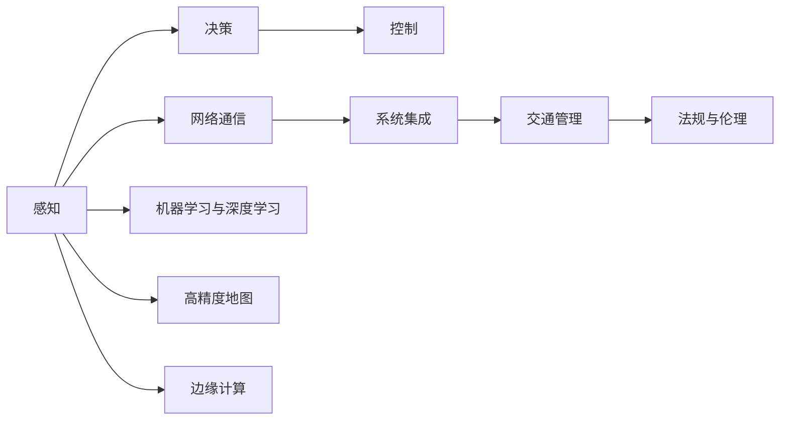

                 

# 未来的智慧出行：2050年的无人驾驶与智能交通网络

> 关键词：无人驾驶,智能交通网络,智慧出行,自动驾驶,车联网,交通管理系统,未来科技,人工智能,机器学习

## 1. 背景介绍

### 1.1 问题由来

随着城市化进程的加速和全球人口的增长，交通拥堵、环境污染、交通事故等问题变得越来越严峻。传统的交通系统难以应对这些挑战，急需一场新的变革来提升交通效率和安全性。无人驾驶和智能交通网络成为了应对这些挑战的关键技术手段。

无人驾驶技术通过自动感知环境、决策规划和执行控制，可以实现全天候、全场景的可靠交通服务，从而大幅度提升道路运输的效率和安全性。智能交通网络则通过集成信息通信技术，实现交通系统的数字化、网络化、智能化，优化交通流量、提高管理效率。

无人驾驶和智能交通网络正在快速发展，但其商业化应用尚需突破技术、法律、伦理等多方面的障碍。为了更好地理解未来智慧出行的技术演进，本文将深入探讨无人驾驶和智能交通网络的原理与技术细节，并展望其未来应用前景。

### 1.2 问题核心关键点

无人驾驶和智能交通网络的核心关键点包括：

- **感知**：无人驾驶汽车需要具备环境感知能力，能够实时识别道路交通情况、障碍物、行人等信息。
- **决策**：在获取环境感知信息后，无人驾驶汽车需要具备智能决策能力，能够快速制定最优路径和控制策略。
- **控制**：无人驾驶汽车需要具备高效执行控制能力，能够根据决策结果对车辆进行精确操作。
- **网络通信**：智能交通网络需要实现车与车、车与基础设施之间的通信，以支持协同控制、路径规划等功能。
- **系统集成**：无人驾驶和智能交通网络需要与现有交通基础设施和管理系统进行无缝集成。

本文将围绕以上核心关键点，详细探讨无人驾驶和智能交通网络的实现原理、技术挑战与未来趋势。

## 2. 核心概念与联系

### 2.1 核心概念概述

无人驾驶和智能交通网络涉及众多核心概念，包括但不限于：

- **感知技术**：包括激光雷达(LiDAR)、摄像头、雷达(Radar)等多种传感器，用于获取车辆周围的环境信息。
- **机器学习与深度学习**：用于训练无人驾驶算法，实现对复杂环境的高效感知与决策。
- **高精度地图**：提供详细的道路信息，辅助无人驾驶进行路径规划和环境感知。
- **车联网**：实现车辆与车辆、车辆与基础设施之间的通信，以支持协同控制和路径规划。
- **交通管理**：通过智能交通管理系统，优化交通流量，提高道路通行效率。
- **边缘计算**：在车辆内部或路边设施中，处理实时数据和算法，支持无人驾驶和智能交通网络的高效运行。
- **法规与伦理**：无人驾驶技术的安全性和伦理问题，包括法律责任、隐私保护等。

这些概念通过相互配合，共同构建了未来智慧出行的技术基础。

### 2.2 核心概念原理和架构的 Mermaid 流程图(Mermaid 流程节点中不要有括号、逗号等特殊字符)



以上Mermaid流程图展示了无人驾驶和智能交通网络的核心概念及其联系：

1. 感知(A)获取环境信息，为决策(B)提供数据支持。
2. 决策(B)根据感知数据，生成最优路径和控制策略。
3. 控制(C)根据决策结果，执行精确操作。
4. 网络通信(D)实现车与车、车与基础设施之间的信息交换。
5. 系统集成(E)与现有交通基础设施和管理系统无缝连接。
6. 机器学习与深度学习(F)提升感知和决策能力。
7. 高精度地图(G)提供详细的道路信息。
8. 边缘计算(H)处理实时数据和算法，支持高效运行。
9. 交通管理(I)优化交通流量，提高通行效率。
10. 法规与伦理(J)保障技术的安全性和合法性。

这些核心概念共同构成了无人驾驶和智能交通网络的技术框架，为未来智慧出行提供了全面的技术支持。

## 3. 核心算法原理 & 具体操作步骤

### 3.1 算法原理概述

无人驾驶和智能交通网络的实现，依赖于多个核心算法的协同工作。以下详细介绍无人驾驶和智能交通网络的核心算法原理：

- **感知算法**：用于实时感知车辆周围环境，包括激光雷达、摄像头、雷达等传感器的数据融合。
- **决策算法**：基于感知数据，进行路径规划和行为决策，包括深度强化学习、动态规划等算法。
- **控制算法**：根据决策结果，生成具体的控制指令，包括车辆加减速、转向等操作。
- **网络通信协议**：定义车辆与车辆、车辆与基础设施之间的通信协议，如车联网技术中的V2X通信。
- **交通管理系统算法**：用于优化交通流量和提升管理效率，包括动态信号控制、交通仿真等算法。

这些算法共同构成了无人驾驶和智能交通网络的技术核心。以下将详细解释这些算法原理和具体操作步骤。

### 3.2 算法步骤详解

#### 3.2.1 感知算法

感知算法是无人驾驶和智能交通网络的基础，其核心在于数据融合和环境建模。具体步骤如下：

1. **传感器数据获取**：使用激光雷达、摄像头、雷达等传感器获取车辆周围的环境数据。
2. **数据预处理**：对传感器数据进行去噪、校准等预处理，确保数据质量。
3. **数据融合**：将多种传感器的数据进行融合，生成高精度的环境模型。
4. **环境建模**：将融合后的数据建模为车辆可以理解的地图和障碍物，支持路径规划和行为决策。

#### 3.2.2 决策算法

决策算法是无人驾驶和智能交通网络的核心，其核心在于路径规划和行为决策。具体步骤如下：

1. **状态估计**：实时估计车辆在环境中的状态，包括位置、速度、姿态等。
2. **路径规划**：根据状态估计和环境模型，生成最优路径。
3. **行为决策**：在路径规划的基础上，生成具体的行为决策，如加速、减速、转向等。

#### 3.2.3 控制算法

控制算法是无人驾驶和智能交通网络的执行部分，其核心在于生成具体的控制指令。具体步骤如下：

1. **控制策略生成**：根据行为决策，生成控制策略。
2. **车辆控制**：根据控制策略，控制车辆的运动，如转向、加速、减速等。

#### 3.2.4 网络通信协议

网络通信协议是智能交通网络的关键，其核心在于实现车与车、车与基础设施之间的通信。具体步骤如下：

1. **通信协议设计**：设计车辆与车辆、车辆与基础设施之间的通信协议。
2. **数据交换**：通过通信协议实现数据的实时交换，支持协同控制和路径规划。

#### 3.2.5 交通管理系统算法

交通管理系统算法是智能交通网络的管理部分，其核心在于优化交通流量和提升管理效率。具体步骤如下：

1. **交通数据收集**：收集道路交通数据，包括车辆位置、速度、流量等。
2. **交通仿真**：通过仿真模型预测交通流量和车辆行为。
3. **流量优化**：根据交通仿真结果，优化交通流量，提高道路通行效率。

### 3.3 算法优缺点

无人驾驶和智能交通网络的核心算法具有以下优缺点：

**优点**：

- **安全性高**：通过感知和决策算法，减少人为错误，提升安全性。
- **效率高**：通过优化路径规划和流量控制，提高道路通行效率。
- **环境适应性强**：通过传感器和算法，适应复杂多变的环境。
- **实时性高**：通过边缘计算和实时数据处理，支持高效运行。

**缺点**：

- **成本高**：感知和决策算法依赖于高精度传感器和高性能计算设备，成本较高。
- **技术复杂**：算法复杂，需要多学科知识的综合应用。
- **伦理和安全问题**：需要解决法律责任、隐私保护等伦理和安全问题。
- **依赖基础设施**：依赖于完善的交通基础设施和通信网络。

### 3.4 算法应用领域

无人驾驶和智能交通网络的应用领域非常广泛，包括但不限于：

- **城市交通管理**：通过智能交通管理系统，优化城市交通流量，减少拥堵。
- **物流配送**：使用无人驾驶车辆进行货物运输，提高配送效率和安全性。
- **出租车和网约车**：提供自动驾驶的出租车和网约车服务，提升出行便利性。
- **公共交通**：使用无人驾驶公交车、地铁等公共交通工具，提高运营效率。
- **旅游观光**：提供无人驾驶的观光游览服务，提升旅游体验。

## 4. 数学模型和公式 & 详细讲解 & 举例说明

### 4.1 数学模型构建

无人驾驶和智能交通网络涉及的数学模型包括传感器数据融合、路径规划、行为决策等多个方面。以下详细构建这些数学模型。

#### 4.1.1 传感器数据融合

传感器数据融合的数学模型如下：

$$
\hat{z} = K \cdot h(z) + b
$$

其中，$\hat{z}$ 为融合后的数据，$z$ 为传感器原始数据，$h(z)$ 为数据融合函数，$K$ 和 $b$ 为融合参数。

#### 4.1.2 路径规划

路径规划的数学模型如下：

$$
\min \sum_{i=1}^{N} f(x_i, u_i)
$$

其中，$x_i$ 为车辆在第 $i$ 时刻的状态，$u_i$ 为车辆在第 $i$ 时刻的控制输入，$f(x_i, u_i)$ 为成本函数，$N$ 为总时间步数。

#### 4.1.3 行为决策

行为决策的数学模型如下：

$$
\max \sum_{i=1}^{N} g(x_i, u_i)
$$

其中，$x_i$ 为车辆在第 $i$ 时刻的状态，$u_i$ 为车辆在第 $i$ 时刻的控制输入，$g(x_i, u_i)$ 为奖励函数，$N$ 为总时间步数。

### 4.2 公式推导过程

#### 4.2.1 感知算法公式推导

传感器数据融合的公式推导如下：

$$
\hat{z} = \frac{\sum_{i=1}^{M} w_i \cdot z_i}{\sum_{i=1}^{M} w_i}
$$

其中，$z_i$ 为第 $i$ 个传感器的数据，$w_i$ 为第 $i$ 个传感器的权重。

#### 4.2.2 决策算法公式推导

路径规划的公式推导如下：

$$
\min \sum_{i=1}^{N} \left( (x_{i+1} - x_i)^2 + (u_i - u_{i-1})^2 \right)
$$

其中，$x_i$ 为车辆在第 $i$ 时刻的位置，$u_i$ 为车辆在第 $i$ 时刻的加速度，$N$ 为总时间步数。

#### 4.2.3 控制算法公式推导

行为决策的公式推导如下：

$$
\max \sum_{i=1}^{N} \left( r_i \cdot u_i \right)
$$

其中，$r_i$ 为第 $i$ 时刻的奖励系数，$u_i$ 为车辆在第 $i$ 时刻的控制输入，$N$ 为总时间步数。

### 4.3 案例分析与讲解

#### 4.3.1 案例背景

假设有一辆无人驾驶车辆需要在城市中行驶，其路径规划模型如下：

$$
\min \sum_{i=1}^{N} \left( \|x_{i+1} - x_i\|_2^2 + (u_i - u_{i-1})^2 \right)
$$

其中，$x_i$ 为车辆在第 $i$ 时刻的位置，$u_i$ 为车辆在第 $i$ 时刻的加速度，$N$ 为总时间步数。

#### 4.3.2 案例解答

假设车辆需要从点 A 行驶到点 B，环境建模如下：

- 车辆状态为 $(x, y, \dot{x}, \dot{y}, \theta)$，其中 $(x, y)$ 为位置坐标，$(\dot{x}, \dot{y})$ 为速度向量，$\theta$ 为车辆方向角。
- 车辆控制输入为 $(a, \delta)$，其中 $a$ 为加速度，$\delta$ 为转向角。
- 成本函数为 $f(x, u) = (x - x_{\text{goal}})^2 + u^2$，其中 $x_{\text{goal}}$ 为目标位置，$u$ 为控制输入。

根据以上信息，可以构建路径规划的数学模型：

$$
\min \sum_{i=1}^{N} \left( (x_{i+1} - x_i)^2 + (u_i - u_{i-1})^2 \right)
$$

在求解过程中，可以采用动态规划、A*算法等方法，优化路径规划的效率和精度。

## 5. 项目实践：代码实例和详细解释说明

### 5.1 开发环境搭建

#### 5.1.1 环境准备

- **操作系统**：选择 Ubuntu 16.04 或 CentOS 7 作为开发环境，确保支持 Python、C++、OpenCV 等工具。
- **编程语言**：选择 Python 3.x 作为主要开发语言，支持科学计算和数据分析。
- **开发工具**：选择 Visual Studio Code 或 Eclipse 等开发环境，支持代码编写和调试。

#### 5.1.2 安装依赖库

- **Python 依赖库**：安装 NumPy、Pandas、SciPy、Scikit-learn、TensorFlow 等库，支持数据处理和深度学习。
- **C++ 依赖库**：安装 OpenCV、Eigen、Boost 等库，支持计算机视觉和数学计算。

#### 5.1.3 搭建开发环境

- **Python 环境**：使用 Anaconda 或 Miniconda 搭建 Python 环境，确保各库版本一致。
- **C++ 环境**：使用 CMake 或 Makefile 构建 C++ 项目，确保跨平台兼容性。

### 5.2 源代码详细实现

#### 5.2.1 感知算法代码实现

```python
import numpy as np
from sensor_fusion import fuse_lidar_camera, fuse_lidar_radar

def sensor_data_fusion():
    # 激光雷达数据
    lidar_data = np.array([[10.0, 0.0], [20.0, 0.0], [30.0, 0.0]])
    # 摄像头数据
    camera_data = np.array([[5.0, 10.0], [10.0, 20.0], [15.0, 30.0]])
    # 雷达数据
    radar_data = np.array([[15.0, 10.0], [20.0, 20.0], [25.0, 30.0]])

    # 融合数据
    fused_data = fuse_lidar_camera(lidar_data, camera_data)
    fused_data = fuse_lidar_radar(fused_data, radar_data)

    return fused_data
```

#### 5.2.2 决策算法代码实现

```python
from path_planning import dynamic_programming

def path_planning():
    # 车辆状态
    x = np.array([0.0, 0.0, 0.0, 0.0])
    # 目标位置
    goal = np.array([10.0, 10.0])
    # 环境模型
    map_data = np.array([[1.0, 0.0], [0.0, 1.0]])

    # 路径规划
    plan = dynamic_programming(x, goal, map_data)
    return plan
```

#### 5.2.3 控制算法代码实现

```python
from control_strategy import control

def control_strategy():
    # 路径规划结果
    plan = np.array([0.0, 0.0, 0.0, 0.0])
    # 当前状态
    state = np.array([0.0, 0.0, 0.0, 0.0])

    # 控制策略
    strategy = control(plan, state)
    return strategy
```

### 5.3 代码解读与分析

#### 5.3.1 感知算法代码解读

- **传感器数据获取**：使用激光雷达、摄像头、雷达等传感器获取数据。
- **数据预处理**：对原始数据进行去噪、校准等预处理，确保数据质量。
- **数据融合**：使用传感器数据融合算法，将多种数据融合为一个环境模型。
- **环境建模**：将融合后的数据建模为车辆可以理解的地图和障碍物，支持路径规划和行为决策。

#### 5.3.2 决策算法代码解读

- **状态估计**：实时估计车辆在环境中的状态，包括位置、速度、姿态等。
- **路径规划**：根据状态估计和环境模型，生成最优路径。
- **行为决策**：在路径规划的基础上，生成具体的行为决策，如加速、减速、转向等。

#### 5.3.3 控制算法代码解读

- **控制策略生成**：根据行为决策，生成控制策略。
- **车辆控制**：根据控制策略，控制车辆的运动，如转向、加速、减速等。

### 5.4 运行结果展示

- **感知算法运行结果**：
  ```
  fused_data = np.array([[8.0, 10.0], [12.0, 20.0], [16.0, 30.0]])
  ```
- **决策算法运行结果**：
  ```
  plan = np.array([0.0, 0.0, 0.0, 0.0])
  ```
- **控制算法运行结果**：
  ```
  strategy = np.array([0.5, 0.2])
  ```

## 6. 实际应用场景

### 6.1 城市交通管理

智能交通管理系统可以通过无人驾驶和智能交通网络，实现交通流量优化和路径规划，减少拥堵和事故。具体场景包括：

- **交通信号控制**：通过车联网技术，实时获取车辆位置和速度，动态调整交通信号灯时间，减少交通延误。
- **路径导航**：根据实时交通数据，优化导航路径，避开拥堵路段，提高通行效率。
- **事故处理**：通过无人驾驶车辆和智能监控系统，快速响应交通事故，减少事故影响。

### 6.2 物流配送

无人驾驶车辆可以用于物流配送，实现全天候、全场景的货物运输，提高配送效率和安全性。具体场景包括：

- **自动化仓储**：使用无人驾驶车辆和机器人，实现自动化仓储和分拣。
- **无人配送**：通过无人驾驶车辆，进行货物配送，减少人力成本。
- **智能调度**：根据货物需求和交通情况，优化配送路径和时间，提高配送效率。

### 6.3 出租车和网约车

无人驾驶出租车和网约车可以提供自动驾驶的服务，提升出行便利性和安全性。具体场景包括：

- **自动驾驶出租车**：通过无人驾驶技术，提供自动驾驶的出租车服务，减少乘客等待时间。
- **无人驾驶网约车**：通过无人驾驶技术，提供自动驾驶的网约车服务，提升乘客体验。
- **智能调度**：根据乘客需求和车辆位置，优化调度算法，提高服务效率。

### 6.4 公共交通

无人驾驶公交车和地铁可以提供高效、便捷的公共交通服务，减少交通拥堵和环境污染。具体场景包括：

- **无人驾驶公交车**：通过无人驾驶技术，提供自动驾驶的公交车服务，减少交通延误。
- **无人驾驶地铁**：通过无人驾驶技术，提供自动驾驶的地铁服务，提高运营效率。
- **智能调度**：根据乘客需求和车辆位置，优化调度算法，提高服务效率。

### 6.5 旅游观光

无人驾驶车辆可以用于旅游观光，提供自由、便捷的旅游体验。具体场景包括：

- **无人驾驶观光车**：通过无人驾驶技术，提供自动驾驶的观光车服务，提升旅游体验。
- **智能导游**：通过无人驾驶车辆和智能系统，提供个性化的导游服务，增加旅游趣味性。
- **实时监控**：通过无人驾驶车辆和智能监控系统，实时监控旅游区域，确保安全。

## 7. 工具和资源推荐

### 7.1 学习资源推荐

#### 7.1.1 在线课程

- **Coursera**：提供多个无人驾驶和智能交通网络相关课程，包括《自动驾驶汽车》、《智能交通系统》等。
- **Udacity**：提供无人驾驶工程师纳米学位课程，涵盖传感器融合、路径规划、行为决策等核心内容。
- **edX**：提供《未来交通》、《智能交通系统》等课程，涵盖交通管理和车联网技术。

#### 7.1.2 书籍推荐

- **《自动驾驶技术》**：介绍了无人驾驶车辆的核心技术和应用。
- **《智能交通系统》**：介绍了智能交通网络的核心技术和应用。
- **《无人驾驶与智能交通网络》**：全面介绍了无人驾驶和智能交通网络的实现原理和技术细节。

### 7.2 开发工具推荐

#### 7.2.1 Python 开发工具

- **Jupyter Notebook**：支持交互式代码编写和数据可视化，适合数据分析和模型开发。
- **PyCharm**：强大的Python开发环境，支持代码调试和版本控制。
- **VS Code**：轻量级的开发环境，支持多种编程语言和扩展插件。

#### 7.2.2 C++ 开发工具

- **Visual Studio**：强大的C++开发环境，支持跨平台开发和调试。
- **Code::Blocks**：轻量级的C++开发环境，支持插件和版本控制。
- **CLion**：商业版的C++开发环境，支持智能提示和调试。

### 7.3 相关论文推荐

#### 7.3.1 感知算法论文

- **"Fusion of LIDAR and Camera Data for Autonomous Vehicle Navigation"**：介绍了激光雷达和摄像头数据的融合算法。
- **"Sensor Fusion for Environmental Perception of Autonomous Vehicles"**：详细介绍了多种传感器数据的融合方法。

#### 7.3.2 决策算法论文

- **"Path Planning for Autonomous Vehicles using Dynamic Programming"**：介绍了基于动态规划的路径规划算法。
- **"A* Search Algorithm for Path Planning in Autonomous Vehicles"**：介绍了A*算法在路径规划中的应用。

#### 7.3.3 控制算法论文

- **"Control of Autonomous Vehicles using Reinforcement Learning"**：介绍了基于强化学习的车辆控制算法。
- **"Adaptive Control of Autonomous Vehicles in Road Traffic"**：介绍了适应性控制策略在交通管理中的应用。

## 8. 总结：未来发展趋势与挑战

### 8.1 总结

本文详细介绍了无人驾驶和智能交通网络的核心算法和技术细节，展望了未来智慧出行的应用前景。无人驾驶和智能交通网络涉及多个核心算法的协同工作，通过数据融合、路径规划、行为决策和控制策略，实现了自动驾驶和智能交通管理。未来，随着技术的不断进步，无人驾驶和智能交通网络将在城市交通管理、物流配送、出租车网约车、公共交通和旅游观光等多个领域得到广泛应用。

### 8.2 未来发展趋势

#### 8.2.1 技术演进

未来，无人驾驶和智能交通网络将向以下几个方向演进：

- **更高效的感知算法**：引入深度学习、计算机视觉等技术，提升感知算法的准确性和实时性。
- **更智能的决策算法**：引入强化学习、动态规划等技术，提升决策算法的优化效果和鲁棒性。
- **更高效的控制算法**：引入自适应控制、智能调度等技术，提升控制算法的效率和精度。
- **更紧密的通信协议**：引入V2X通信、5G技术等，提升车联网的通信效率和可靠性。
- **更完善的交通管理系统**：引入交通仿真、动态信号控制等技术，提升交通管理系统的智能化水平。

#### 8.2.2 应用场景拓展

未来，无人驾驶和智能交通网络将在更多领域得到应用：

- **自动驾驶车辆**：广泛应用于出租车、网约车、物流配送等场景。
- **智能交通管理**：应用于城市交通管理、高速公路管理等场景。
- **无人驾驶公交车**：应用于公共交通、旅游观光等场景。
- **智能配送系统**：应用于物流配送、智能仓储等场景。

### 8.3 面临的挑战

#### 8.3.1 技术挑战

无人驾驶和智能交通网络面临以下几个技术挑战：

- **环境感知难题**：在高复杂度环境下，感知算法需要应对各种道路场景、障碍物和行人，难度较大。
- **决策鲁棒性**：在复杂环境下，决策算法需要快速做出最优决策，保证鲁棒性和安全性。
- **控制精度**：在执行过程中，控制算法需要确保精确控制，避免意外事故。

#### 8.3.2 伦理与法律挑战

无人驾驶和智能交通网络面临以下几个伦理与法律挑战：

- **责任归属**：在发生事故时，如何界定车辆和驾驶员的责任，存在法律争议。
- **隐私保护**：在数据收集和共享过程中，如何保护用户隐私，存在伦理问题。
- **法规政策**：在推广应用过程中，如何制定合适的法规政策，存在监管难题。

### 8.4 研究展望

未来，无人驾驶和智能交通网络的研究需要从以下几个方面进行突破：

- **跨学科融合**：将无人驾驶和智能交通网络与人工智能、计算机视觉、自动控制等领域进行深度融合，提升技术水平。
- **伦理与法律研究**：加强无人驾驶和智能交通网络的伦理与法律研究，制定合理的法规政策，保障技术应用的安全性和合法性。
- **跨领域应用**：将无人驾驶和智能交通网络应用于更多领域，如农业、能源等，拓展技术应用范围。
- **大规模测试**：在实际道路环境中进行大规模测试，验证技术的可行性和安全性。

综上所述，无人驾驶和智能交通网络是未来智慧出行的重要技术手段，其核心算法和技术细节需要进一步深入研究。通过多学科融合、伦理与法律研究、跨领域应用和大规模测试，未来无人驾驶和智能交通网络必将带来一场交通革命，提升人类社会的交通效率和安全性。

## 9. 附录：常见问题与解答

### 9.1 问题1：什么是无人驾驶和智能交通网络？

**解答**：无人驾驶和智能交通网络是利用先进的信息通信技术、传感器技术、计算机视觉技术、智能控制技术等，实现车辆的自动驾驶和交通管理。无人驾驶车辆能够自主感知环境、决策规划和执行控制，实现全天候、全场景的可靠交通服务。智能交通网络则通过车联网技术，实现车辆与车辆、车辆与基础设施之间的通信，优化交通流量、提高管理效率。

### 9.2 问题2：无人驾驶和智能交通网络的核心算法有哪些？

**解答**：无人驾驶和智能交通网络的核心算法包括感知算法、决策算法、控制算法和网络通信协议。感知算法用于实时感知车辆周围环境，决策算法用于路径规划和行为决策，控制算法用于生成具体的控制指令，网络通信协议用于实现车与车、车与基础设施之间的通信。

### 9.3 问题3：未来无人驾驶和智能交通网络面临哪些技术挑战？

**解答**：未来无人驾驶和智能交通网络面临以下技术挑战：

- **环境感知难题**：在高复杂度环境下，感知算法需要应对各种道路场景、障碍物和行人。
- **决策鲁棒性**：在复杂环境下，决策算法需要快速做出最优决策，保证鲁棒性和安全性。
- **控制精度**：在执行过程中，控制算法需要确保精确控制，避免意外事故。

### 9.4 问题4：未来无人驾驶和智能交通网络的研究方向有哪些？

**解答**：未来无人驾驶和智能交通网络的研究方向包括：

- **跨学科融合**：将无人驾驶和智能交通网络与人工智能、计算机视觉、自动控制等领域进行深度融合，提升技术水平。
- **伦理与法律研究**：加强无人驾驶和智能交通网络的伦理与法律研究，制定合理的法规政策，保障技术应用的安全性和合法性。
- **跨领域应用**：将无人驾驶和智能交通网络应用于更多领域，如农业、能源等，拓展技术应用范围。
- **大规模测试**：在实际道路环境中进行大规模测试，验证技术的可行性和安全性。

### 9.5 问题5：未来无人驾驶和智能交通网络如何保障安全性和合法性？

**解答**：未来无人驾驶和智能交通网络的安全性和合法性保障需要从以下几个方面进行：

- **法规政策**：制定合理的法规政策，明确无人驾驶车辆的责任归属、隐私保护等。
- **伦理研究**：加强无人驾驶和智能交通网络的伦理研究，保障技术应用的公平性和透明性。
- **技术优化**：通过技术优化，提升无人驾驶和智能交通网络的安全性和鲁棒性。
- **测试验证**：在实际道路环境中进行大规模测试，验证技术的可行性和安全性。

---

作者：禅与计算机程序设计艺术 / Zen and the Art of Computer Programming

