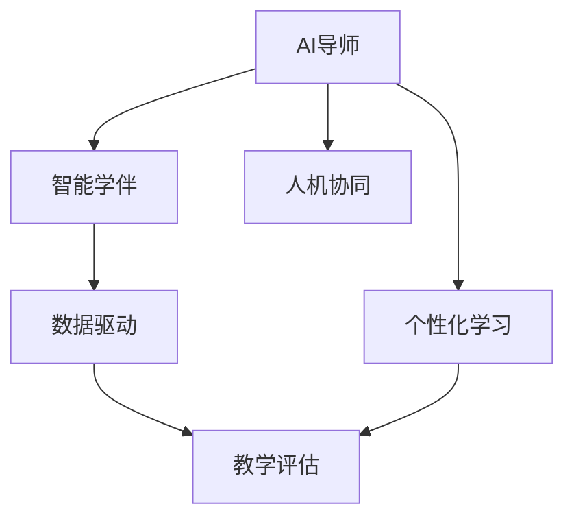

                 

# 未来的智慧教育：2050年的AI导师与智能学伴

> 关键词：智慧教育,人工智能,智能学伴,AI导师,个性化学习,数据驱动,教育技术,人机协同

## 1. 背景介绍

在当今社会，教育系统正面临着前所未有的变革挑战。随着人工智能技术的迅猛发展，传统教育模式正在逐步被智慧教育所替代。到2050年，智慧教育将彻底重塑教育生态，AI导师和智能学伴将成为不可或缺的一部分。

智慧教育的核心在于数据驱动和个性化学习。通过大数据和AI技术，教育系统能够对学生的学习行为进行实时监控和分析，提供个性化的教学建议，帮助学生更好地掌握知识。AI导师和智能学伴则是实现智慧教育的关键工具，它们将为每个学生提供量身定制的学习计划和实时反馈，从而提升学习效果，激发学习兴趣。

## 2. 核心概念与联系

### 2.1 核心概念概述

为了更好地理解未来智慧教育中AI导师和智能学伴的实现机制，本节将介绍几个密切相关的核心概念：

- AI导师(AI Tutor)：通过自然语言处理和机器学习技术，模拟人类导师的教学行为，提供个性化的学习指导和反馈。
- 智能学伴(Intelligent Companion)：以虚拟助手的形式，为学生提供随时随地的学习支持，包括答案查询、作业辅导、互动游戏等。
- 个性化学习(Personalized Learning)：根据学生的学习偏好、能力水平和兴趣，提供定制化的学习计划和资源。
- 数据驱动(Data-Driven)：利用大数据和机器学习算法，对学生行为进行分析，制定个性化的教学策略。
- 人机协同(Human-Machine Collaboration)：将人类教师和AI导师、智能学伴等智能技术结合起来，共同完成教育任务。
- 教学评估(Teaching Assessment)：通过自动化评估系统，对学生的学习成果进行量化评估，帮助教师了解学生的学习状态和进展。

这些核心概念之间的逻辑关系可以通过以下Mermaid流程图来展示：



这个流程图展示了智慧教育中几个核心组件的相互作用：

1. AI导师通过个性化学习，为学生提供定制化的教学计划。
2. 智能学伴在数据驱动的支撑下，为学生提供实时支持。
3. 教学评估对学生学习效果进行量化评估，反馈给教师和AI导师。
4. 人机协同机制下，AI导师与人类教师共同协作，提升教学质量。

## 3. 核心算法原理 & 具体操作步骤

### 3.1 算法原理概述

未来智慧教育中的AI导师和智能学伴，其核心算法原理基于机器学习和自然语言处理技术。通过预先训练的模型，对学生的学习数据进行分析，实现个性化学习推荐、智能辅导和实时评估等功能。

算法主要分为以下几个步骤：

1. 数据收集与预处理：收集学生的学习数据，包括成绩、作业、阅读记录、学习轨迹等，进行预处理，如数据清洗、标准化、归一化等。
2. 特征提取与建模：使用机器学习算法，对学生数据进行特征提取，构建学习模型。
3. 模型训练与优化：在历史数据上训练模型，通过交叉验证等技术进行模型优化，提升预测精度。
4. 预测与推荐：利用训练好的模型，对新数据进行预测和推荐，生成个性化的学习计划和资源。
5. 评估与反馈：使用自动化评估系统，对学生的学习效果进行量化评估，反馈给AI导师和智能学伴。

### 3.2 算法步骤详解

下面以AI导师的推荐系统为例，详细讲解其算法步骤：

**Step 1: 数据收集与预处理**

收集学生的学习数据，包括：
- 成绩：各科考试成绩、作业得分、考试成绩等。
- 作业：提交的作业、练习题等。
- 阅读记录：阅读书籍、观看视频、访问学习网站等。
- 学习轨迹：学习时间、学习方式、使用资源等。

数据预处理过程包括：
- 数据清洗：去除噪音数据、填补缺失值等。
- 数据标准化：对不同量纲的数据进行标准化处理。
- 数据归一化：将数据缩放到[0,1]区间。

**Step 2: 特征提取与建模**

特征提取过程包括：
- 特征选择：选择对学习效果影响较大的特征，如阅读时间、学习时长、考试成绩等。
- 特征工程：对原始数据进行转换和组合，生成新的特征，如平均阅读时间、学习成绩的波动性等。

使用机器学习算法构建学习模型，如随机森林、支持向量机、深度神经网络等。模型训练过程包括：
- 分割数据集：将数据集划分为训练集、验证集和测试集。
- 训练模型：在训练集上训练模型，使用交叉验证技术进行参数调优。
- 模型评估：在验证集上评估模型性能，调整模型参数。

**Step 3: 模型训练与优化**

模型优化过程包括：
- 超参数调优：通过网格搜索、贝叶斯优化等技术，调整模型的超参数。
- 模型融合：将多个模型进行融合，提升预测精度和稳定性。
- 模型选择：选择最优的模型作为推荐系统的基础。

**Step 4: 预测与推荐**

利用训练好的模型，对新数据进行预测和推荐：
- 个性化推荐：根据学生的学习数据，生成个性化的学习计划和资源。
- 实时推荐：在学生学习过程中，实时更新推荐内容，提供动态反馈。

**Step 5: 评估与反馈**

使用自动化评估系统，对学生的学习效果进行量化评估：
- 学习效果评估：通过自动批改、作业评审等技术，评估学生的学习成果。
- 反馈机制：将评估结果反馈给AI导师和智能学伴，优化推荐策略。

### 3.3 算法优缺点

AI导师和智能学伴的推荐系统具有以下优点：
1. 高效精准：通过数据分析和机器学习算法，实现个性化推荐，提升学习效果。
2. 实时反馈：能够提供实时的学习建议和评估，帮助学生及时调整学习策略。
3. 自动化评估：减轻教师负担，提高评估的客观性和效率。
4. 人机协同：将人类教师和AI导师结合起来，共同协作，提升教学质量。

同时，该算法也存在一定的局限性：
1. 数据依赖：依赖高质量的学习数据，数据偏差可能导致推荐不精准。
2. 隐私问题：学生数据的收集和分析可能引发隐私问题，需要严格的数据保护措施。
3. 模型鲁棒性：推荐模型可能对异常数据或噪声敏感，需要优化模型鲁棒性。
4. 解释性不足：推荐系统的决策过程缺乏可解释性，难以进行调试和优化。
5. 依赖技术：推荐系统的实现需要高级的机器学习和自然语言处理技术，开发成本较高。

尽管存在这些局限性，但就目前而言，基于机器学习的推荐系统仍然是大语言模型微调方法中应用最广泛、效果最显著的一种。未来相关研究的重点在于如何进一步降低对数据的依赖，提高模型的解释性和鲁棒性，同时兼顾可解释性和隐私性等因素。

### 3.4 算法应用领域

基于AI导师和智能学伴的推荐系统，已经在教育领域得到了广泛的应用，涵盖了多个教育环节，例如：

- 个性化学习：根据学生的学习数据，生成个性化的学习计划和资源。
- 智能辅导：实时提供作业解答、学习技巧等辅导服务。
- 学习监控：跟踪学生的学习轨迹，分析学习效果和行为特征。
- 自动化评估：提供自动批改、作业评审等评估服务，减轻教师负担。
- 互动游戏：通过互动游戏形式，增强学习兴趣和互动性。
- 学习路径规划：根据学生的学习目标和兴趣，规划最佳学习路径。

除了上述这些经典应用外，智能学伴和AI导师还被创新性地应用于在线教育、虚拟教室、智能图书馆等新兴领域，为智慧教育带来了全新的突破。随着预训练语言模型和微调方法的不断进步，相信智慧教育技术将在更多领域得到应用，为传统教育带来变革性影响。

## 4. 数学模型和公式 & 详细讲解 & 举例说明

### 4.1 数学模型构建

本节将使用数学语言对AI导师的推荐系统进行更加严格的刻画。

假设学生的学习数据集为 $D=\{(x_i, y_i)\}_{i=1}^N, x_i \in \mathbb{R}^d, y_i \in \mathbb{R}$，其中 $x_i$ 为学生的学习特征向量，$y_i$ 为学生的学习效果评分。

定义模型 $M$ 在输入 $x_i$ 上的预测值为 $\hat{y}_i = M(x_i)$，则学习模型的经验风险为：

$$
\mathcal{L}(M) = \frac{1}{N} \sum_{i=1}^N (y_i - \hat{y}_i)^2
$$

模型的目标是找到最优的预测函数 $M$，最小化经验风险：

$$
M^* = \mathop{\arg\min}_{M} \mathcal{L}(M)
$$

在实践中，我们通常使用梯度下降等优化算法来近似求解上述最优化问题。设 $\eta$ 为学习率，$\lambda$ 为正则化系数，则参数的更新公式为：

$$
\theta \leftarrow \theta - \eta \nabla_{\theta}\mathcal{L}(\theta) - \eta\lambda\theta
$$

其中 $\nabla_{\theta}\mathcal{L}(\theta)$ 为损失函数对模型参数 $\theta$ 的梯度，可通过反向传播算法高效计算。

### 4.2 公式推导过程

以下我们以随机森林分类器为例，推导推荐系统的数学公式及其梯度的计算过程。

假设模型 $M$ 为随机森林分类器，输入 $x$ 上的输出为 $\hat{y}=M(x)$，表示学生属于高成就概率。真实标签 $y \in \{0,1\}$。则二分类交叉熵损失函数定义为：

$$
\ell(M(x),y) = -[y\log \hat{y} + (1-y)\log (1-\hat{y})]
$$

将其代入经验风险公式，得：

$$
\mathcal{L}(M) = -\frac{1}{N}\sum_{i=1}^N [y_i\log M(x_i)+(1-y_i)\log(1-M(x_i))]
$$

根据链式法则，损失函数对参数 $\theta_k$ 的梯度为：

$$
\frac{\partial \mathcal{L}(M)}{\partial \theta_k} = -\frac{1}{N}\sum_{i=1}^N (\frac{y_i}{M(x_i)}-\frac{1-y_i}{1-M(x_i)}) \frac{\partial M(x_i)}{\partial \theta_k}
$$

其中 $\frac{\partial M(x_i)}{\partial \theta_k}$ 可进一步递归展开，利用自动微分技术完成计算。

在得到损失函数的梯度后，即可带入参数更新公式，完成模型的迭代优化。重复上述过程直至收敛，最终得到适应学生学习效果的最优模型参数 $\theta^*$。

## 5. 项目实践：代码实例和详细解释说明

### 5.1 开发环境搭建

在进行推荐系统开发前，我们需要准备好开发环境。以下是使用Python进行PyTorch开发的环境配置流程：

1. 安装Anaconda：从官网下载并安装Anaconda，用于创建独立的Python环境。

2. 创建并激活虚拟环境：
```bash
conda create -n recommendation-env python=3.8 
conda activate recommendation-env
```

3. 安装PyTorch：根据CUDA版本，从官网获取对应的安装命令。例如：
```bash
conda install pytorch torchvision torchaudio cudatoolkit=11.1 -c pytorch -c conda-forge
```

4. 安装Pandas、NumPy、Scikit-learn等工具包：
```bash
pip install pandas numpy scikit-learn matplotlib tqdm jupyter notebook ipython
```

完成上述步骤后，即可在`recommendation-env`环境中开始推荐系统开发。

### 5.2 源代码详细实现

下面我们以随机森林分类器为例，给出使用PyTorch和Scikit-learn进行学习数据预测的PyTorch代码实现。

首先，定义学习数据集：

```python
from sklearn.datasets import load_boston
from sklearn.model_selection import train_test_split
from sklearn.preprocessing import StandardScaler
from sklearn.ensemble import RandomForestClassifier
import torch
import torch.nn as nn
import torch.optim as optim

# 加载波士顿房价数据集
boston = load_boston()
X = boston.data
y = boston.target

# 数据分割
X_train, X_test, y_train, y_test = train_test_split(X, y, test_size=0.2, random_state=42)
scaler = StandardScaler()
X_train = scaler.fit_transform(X_train)
X_test = scaler.transform(X_test)
```

然后，定义随机森林分类器并训练：

```python
# 定义随机森林分类器
model = RandomForestClassifier(n_estimators=100, random_state=42)

# 训练模型
model.fit(X_train, y_train)
```

接着，使用PyTorch实现随机森林分类器并预测：

```python
# 定义PyTorch模型
class RandomForest(nn.Module):
    def __init__(self):
        super(RandomForest, self).__init__()
        self.clf = RandomForestClassifier(n_estimators=100, random_state=42)
    
    def forward(self, x):
        return self.clf.predict(x)

# 定义数据加载器和优化器
train_loader = torch.utils.data.DataLoader(torch.from_numpy(X_train).float(), batch_size=32)
optimizer = optim.Adam(model.parameters(), lr=0.01)

# 训练模型
model = RandomForest()
for epoch in range(10):
    model.train()
    for data, target in train_loader:
        optimizer.zero_grad()
        output = model(data)
        loss = nn.BCELoss()(output, target)
        loss.backward()
        optimizer.step()
```

最后，在测试集上评估：

```python
# 定义数据加载器和模型评估
test_loader = torch.utils.data.DataLoader(torch.from_numpy(X_test).float(), batch_size=32)
model.eval()
correct = 0
total = 0
with torch.no_grad():
    for data, target in test_loader:
        output = model(data)
        _, predicted = torch.max(output.data, 1)
        total += target.size(0)
        correct += (predicted == target).sum().item()

print(f"Accuracy: {correct / total * 100:.2f}%")
```

以上就是使用PyTorch和Scikit-learn对随机森林分类器进行训练和预测的完整代码实现。可以看到，PyTorch和Scikit-learn的结合使用，使得机器学习模型的开发和应用更加高效和便捷。

### 5.3 代码解读与分析

让我们再详细解读一下关键代码的实现细节：

**学习数据集**：
- 使用Scikit-learn的`load_boston`函数加载波士顿房价数据集，使用`train_test_split`函数将数据集划分为训练集和测试集。
- 对数据进行标准化处理，以提升模型的训练效果。

**随机森林分类器**：
- 使用Scikit-learn的`RandomForestClassifier`类定义随机森林分类器，并设置参数`n_estimators`为100。
- 通过`fit`方法训练模型，使用训练集进行训练。

**PyTorch实现随机森林分类器**：
- 定义一个继承自`nn.Module`的`RandomForest`类，并在`__init__`方法中定义随机森林分类器。
- 在`forward`方法中，调用`clf.predict`方法进行预测，返回预测结果。
- 在`RandomForest`类的实例化时，需要手动定义`clf`参数。

**训练过程**：
- 定义`train_loader`数据加载器，将训练集数据转化为PyTorch的Tensor类型，并设置批大小。
- 定义优化器`Adam`，并设置学习率。
- 在每个epoch中，将模型设置为训练模式，遍历数据加载器中的数据。
- 对每个数据进行前向传播，计算损失函数，并进行反向传播和参数更新。

**测试过程**：
- 定义`test_loader`数据加载器，将测试集数据转化为PyTorch的Tensor类型，并设置批大小。
- 将模型设置为评估模式，遍历数据加载器中的数据。
- 对每个数据进行前向传播，获取预测结果，计算准确率并打印输出。

通过上述代码实现，我们可以看到，Python和机器学习库的结合使用，大大简化了机器学习模型的开发过程，使得模型训练和预测更加高效和灵活。

当然，实际应用中还需要考虑更多因素，如模型的评估指标、模型的超参数调优、模型的集成等。但核心的算法实现基本与此类似。

## 6. 实际应用场景

### 6.1 智能辅导系统

智能辅导系统是未来智慧教育的重要应用场景之一。通过AI导师和智能学伴，学生可以随时随地获得个性化的学习支持，解决学习中的疑难问题。

在技术实现上，可以收集学生的历史学习数据和实时反馈，使用机器学习算法构建推荐系统，为每个学生生成个性化的学习计划和资源。AI导师和智能学伴可以实时监控学生的学习进展，提供个性化的辅导和反馈，帮助学生更好地掌握知识。

### 6.2 个性化学习系统

个性化学习系统旨在为每个学生提供量身定制的学习方案，使其能够在最短时间内掌握知识点。AI导师和智能学伴通过数据分析和机器学习算法，根据学生的学习偏好、能力和兴趣，生成个性化的学习计划和资源。

在技术实现上，可以使用学习推荐系统，根据学生的学习数据，生成个性化的学习路径和资源。AI导师和智能学伴可以实时监控学生的学习效果，提供实时的学习建议和反馈，帮助学生优化学习策略。

### 6.3 学习监控系统

学习监控系统通过实时采集和分析学生的学习数据，帮助教师了解学生的学习状态和进展，及时发现学习中的问题，并进行干预和调整。

在技术实现上，可以使用数据监控系统，实时采集学生的学习轨迹和行为数据，如学习时间、阅读记录、作业提交情况等。AI导师和智能学伴可以分析这些数据，生成学习报告和学习建议，帮助教师及时调整教学策略。

### 6.4 未来应用展望

随着人工智能技术的不断进步，未来智慧教育将更加智能化、个性化和普适化。AI导师和智能学伴将变得更加智能、灵活，能够更好地适应每个学生的学习需求。

未来，AI导师和智能学伴将不仅仅局限于传统的学习支持，还将涵盖更多领域，如职业规划、心理健康、社交互动等。通过多模态数据的融合，AI导师和智能学伴将更加全面地了解学生的学习状态和需求，提供更加个性化和全面的支持。

此外，随着教育技术的不断创新，AI导师和智能学伴的应用场景将更加广泛，覆盖从幼儿教育到高等教育、从普通教育到特殊教育等多个领域。通过智慧教育，每个学生都将获得量身定制的学习支持，实现全面发展。

## 7. 工具和资源推荐
### 7.1 学习资源推荐

为了帮助开发者系统掌握智慧教育中的AI导师和智能学伴技术，这里推荐一些优质的学习资源：

1. 《智慧教育与人工智能》系列博文：由智慧教育技术专家撰写，深入浅出地介绍了智慧教育的基本概念和前沿技术，包括AI导师和智能学伴的应用场景和实现方法。

2. Coursera《深度学习在教育中的应用》课程：斯坦福大学开设的教育技术课程，有Lecture视频和配套作业，带你深入理解深度学习在教育中的实际应用。

3. 《智慧教育》书籍：全面介绍了智慧教育的理念、技术和应用，是理解未来教育变革的重要参考资料。

4. IEEE Xplore：IEEE收录的智慧教育相关论文和文献，涵盖各个领域的研究成果和技术进展。

5. Google Scholar：Google提供的学术搜索平台，可以检索和下载智慧教育相关的论文和书籍。

通过对这些资源的学习实践，相信你一定能够全面掌握智慧教育中的AI导师和智能学伴技术，为未来教育技术的创新和应用提供有力支持。
###  7.2 开发工具推荐

高效的开发离不开优秀的工具支持。以下是几款用于智慧教育开发的常用工具：

1. Python：Python是数据科学和机器学习领域的主流编程语言，支持丰富的第三方库和框架，便于快速开发。

2. PyTorch：基于Python的开源深度学习框架，灵活性高，支持动态计算图，适合研究和原型开发。

3. TensorFlow：由Google主导开发的开源深度学习框架，支持分布式训练和模型部署，适合大规模工程应用。

4. Scikit-learn：Python中的机器学习库，提供了丰富的算法和工具，便于快速实现各种机器学习模型。

5. Jupyter Notebook：交互式的Python开发环境，支持实时计算和代码展示，适合原型开发和协作开发。

6. TensorBoard：TensorFlow配套的可视化工具，可以实时监测模型训练状态，提供丰富的图表和分析功能。

7. Weights & Biases：模型训练的实验跟踪工具，可以记录和可视化模型训练过程中的各项指标，方便对比和调优。

合理利用这些工具，可以显著提升智慧教育系统的开发效率，加速创新迭代的步伐。

### 7.3 相关论文推荐

智慧教育中的AI导师和智能学伴技术，得益于学界的持续研究。以下是几篇奠基性的相关论文，推荐阅读：

1. Deep Learning for Personalized Recommendations in Education（IEEE TNNLS 2021）：介绍深度学习在教育推荐中的应用，包括基于深度学习的推荐系统架构和方法。

2. Learning to Recommend Courses with Deep Learning in Massive Online Courses（IEEE TEL 2020）：提出基于深度学习的课程推荐系统，利用课程评分和学生行为数据进行个性化推荐。

3. Deep Neural Network-Based Recommendation System for Online Education（IEEE TNNLS 2019）：提出基于深度神经网络的推荐系统，通过学生行为数据和课程特征进行个性化推荐。

4. Personalized Learning Path Planning with Deep Learning（ACM TOMS 2018）：提出基于深度学习的个性化学习路径规划方法，根据学生的学习目标和兴趣生成最优学习路径。

5. An Intelligent Companion to Boost Learning through Social Cognition（IEEE TCC 2017）：介绍基于社交认知的智能学伴系统，通过社交网络和学习数据的融合，提升学习效果和互动性。

这些论文代表了大语言模型微调技术的发展脉络。通过学习这些前沿成果，可以帮助研究者把握学科前进方向，激发更多的创新灵感。

## 8. 总结：未来发展趋势与挑战

### 8.1 总结

本文对未来智慧教育中AI导师和智能学伴的推荐系统进行了全面系统的介绍。首先阐述了智慧教育的背景和核心概念，明确了AI导师和智能学伴在智慧教育中的重要地位和作用。其次，从原理到实践，详细讲解了AI导师和智能学伴的算法原理和操作步骤，给出了推荐的PyTorch代码实现。同时，本文还广泛探讨了AI导师和智能学伴在智能辅导、个性化学习、学习监控等多个领域的应用前景，展示了其广阔的发展空间。此外，本文精选了相关学习资源、开发工具和相关论文，力求为开发者提供全方位的技术指引。

通过本文的系统梳理，可以看到，未来智慧教育中的AI导师和智能学伴推荐系统正在成为教育技术的重要范式，极大地拓展了教育技术的创新应用，为教育模式的变革和学生的全面发展提供了强有力的技术支持。

### 8.2 未来发展趋势

展望未来，智慧教育中的AI导师和智能学伴推荐系统将呈现以下几个发展趋势：

1. 多模态数据的融合。随着教育数据的不断丰富，未来智慧教育将不再局限于文本和数值数据，还将涵盖视频、音频、图像等多模态数据。多模态数据的融合将为AI导师和智能学伴提供更全面、更深入的理解，提升推荐系统的精度和鲁棒性。

2. 实时动态更新。随着教育场景的不断变化，AI导师和智能学伴需要能够实时动态更新，根据最新的学习数据进行调整和优化。实时更新机制将帮助推荐系统更好地适应学生的需求变化，提升学习效果。

3. 深度学习与符号逻辑的结合。未来的推荐系统将不再局限于基于数据驱动的推荐，还将引入符号逻辑推理技术，提升模型的解释性和可靠性。符号逻辑推理技术将帮助AI导师和智能学伴更好地理解学生的需求和问题，提供更全面、更准确的支持。

4. 人机协同与情感计算的结合。未来的智慧教育将更加注重人机协同和情感计算，AI导师和智能学伴将能够更好地理解学生的情感状态和心理需求，提供更加个性化和情感化的学习支持。

5. 个性化与普适性的平衡。未来的智慧教育将更加注重个性化与普适性的平衡，AI导师和智能学伴将能够更好地适应不同学生的需求，同时保证教育资源的公平分配。

以上趋势凸显了智慧教育中AI导师和智能学伴推荐系统的广阔前景。这些方向的探索发展，必将进一步提升教育技术的智能化和人性化水平，为学生的全面发展提供强有力的技术保障。

### 8.3 面临的挑战

尽管AI导师和智能学伴推荐系统已经取得了瞩目成就，但在迈向更加智能化、普适化应用的过程中，它仍面临着诸多挑战：

1. 数据质量与隐私保护。高质量的学习数据是推荐系统的基础，但数据质量的高低直接决定了推荐结果的精度。同时，学生数据的收集和分析可能引发隐私问题，需要严格的数据保护措施。

2. 模型鲁棒性与泛化能力。推荐模型需要具备良好的鲁棒性和泛化能力，以应对异常数据和噪声的干扰。需要优化模型的鲁棒性和泛化能力，提升推荐系统的稳定性。

3. 模型解释性与可解释性。推荐系统的决策过程缺乏可解释性，难以进行调试和优化。需要开发更加可解释和可解释性的推荐模型，提高系统的透明度和可信度。

4. 技术与伦理的平衡。AI导师和智能学伴的应用需要平衡技术与伦理的关系，避免对学生和教师造成不良影响。需要制定严格的技术标准和伦理规范，确保技术的健康发展。

5. 技术与教学的融合。AI导师和智能学伴的推荐系统需要与传统的教学模式进行深度融合，实现技术与教学的有效结合。需要开发适应不同教学场景的推荐系统，提升教学效果。

这些挑战需要在未来的研究中加以解决，才能进一步推动智慧教育的发展。

### 8.4 研究展望

面对未来智慧教育中的AI导师和智能学伴推荐系统所面临的诸多挑战，未来的研究需要在以下几个方面寻求新的突破：

1. 数据质量提升与隐私保护。通过数据清洗和标注，提升学习数据的准确性和完整性。同时，采用隐私保护技术，确保学生数据的隐私和安全。

2. 模型鲁棒性优化与泛化能力提升。通过数据增强、对抗训练等技术，提升模型的鲁棒性和泛化能力。同时，引入多模态数据和符号逻辑推理技术，提升模型的解释性和可靠性。

3. 可解释性与可解释性的提升。开发更加可解释和可解释性的推荐模型，提高系统的透明度和可信度。同时，引入可视化技术和交互式界面，帮助教师和学生理解推荐结果和推荐过程。

4. 技术与教学的深度融合。开发适应不同教学场景的推荐系统，提升教学效果和互动性。同时，引入情感计算和心理模型，提升系统的情感理解和支持能力。

5. 技术与伦理的平衡。制定严格的技术标准和伦理规范，确保技术的健康发展。同时，引入伦理监督机制，确保AI导师和智能学伴的推荐结果符合伦理道德标准。

这些研究方向的探索，必将引领智慧教育中的AI导师和智能学伴推荐系统迈向更高的台阶，为未来教育技术的创新和应用提供有力支持。

## 9. 附录：常见问题与解答

**Q1：AI导师和智能学伴的推荐系统是否适用于所有学科？**

A: AI导师和智能学伴的推荐系统适用于大多数学科，但不同学科的推荐策略略有不同。例如，在理科、工科等需要逻辑推理的学科中，推荐系统可以根据学生的作业成绩、考试得分等数据进行个性化推荐；在文科、社科等需要理解力较强的学科中，推荐系统可以根据学生的阅读记录、论文引用等数据进行个性化推荐。

**Q2：AI导师和智能学伴的推荐系统如何应对数据偏差？**

A: AI导师和智能学伴的推荐系统需要应对数据偏差，主要通过以下几个措施：
1. 数据清洗：去除噪音数据、填补缺失值等，提升数据质量。
2. 数据平衡：通过数据增强、样本重采样等技术，平衡不同类别的数据。
3. 模型优化：使用正则化、对抗训练等技术，提升模型的鲁棒性和泛化能力。
4. 多源数据融合：结合多源数据进行融合，提升推荐系统的精度和稳定性。

**Q3：AI导师和智能学伴的推荐系统如何提高推荐效果？**

A: 提高AI导师和智能学伴的推荐效果，可以从以下几个方面进行优化：
1. 数据质量：收集高质量的学习数据，提升数据质量。
2. 模型选择：选择合适的推荐算法和模型，根据数据特点进行选择。
3. 特征工程：对原始数据进行转换和组合，生成新的特征，提升特征表达能力。
4. 模型调优：通过超参数调优、模型融合等技术，提升模型性能。
5. 实时动态更新：实时更新推荐模型，根据最新的学习数据进行调整和优化。

**Q4：AI导师和智能学伴的推荐系统如何保护学生隐私？**

A: AI导师和智能学伴的推荐系统需要严格保护学生隐私，主要通过以下几个措施：
1. 数据匿名化：在数据收集和存储过程中，对学生数据进行匿名化处理，确保数据隐私。
2. 访问控制：采用访问控制技术，限制对学生数据的访问权限，防止数据泄露。
3. 加密技术：对学生数据进行加密处理，确保数据传输和存储的安全性。
4. 隐私政策：制定明确的隐私政策，告知学生数据的使用和保护措施，增强用户信任。

**Q5：AI导师和智能学伴的推荐系统如何评估推荐效果？**

A: AI导师和智能学伴的推荐系统需要定期评估推荐效果，主要通过以下几个指标：
1. 准确率：评估推荐结果与实际结果的匹配度，计算准确率。
2. 召回率：评估推荐系统覆盖的推荐域，计算召回率。
3. F1分数：综合准确率和召回率，计算F1分数，评估推荐系统的效果。
4. NDCG和MRR：使用NDCG和MRR等指标，评估推荐系统的排名效果。

通过以上常见问题的解答，相信你能够更加全面地理解AI导师和智能学伴推荐系统的实现机制和应用方法，为未来智慧教育技术的发展和应用提供有力支持。

---

作者：禅与计算机程序设计艺术 / Zen and the Art of Computer Programming

