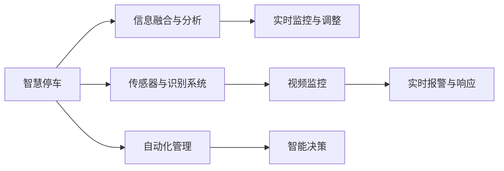

                 

## 1. 背景介绍

随着全球人口的快速增长和城市化进程的加速，智慧物业（Smart Property）正成为现代城市建设的重要方向。2050年，智慧物业将集成了更先进的信息技术，全面提升了在智慧停车与智能安保等方面的管理水平。本文将从多个维度阐述智慧物业的未来应用，展望其潜在的挑战与机遇。

## 2. 核心概念与联系

### 2.1 核心概念概述

- **智慧物业（Smart Property）**：通过物联网（IoT）、云计算、大数据等技术，实现物业智能化管理，提高服务效率和用户体验。
- **智慧停车（Smart Parking）**：利用传感器、智能识别等技术，优化停车资源配置，提升停车效率，减少交通拥堵。
- **智能安保（Smart Security）**：结合视频监控、人脸识别等技术，提高物业安保水平，保障住户安全。
- **信息融合与自动化（Information Fusion & Automation）**：将不同传感器、数据源收集到的信息融合在一起，实现自动化管理与决策。

### 2.2 核心概念原理和架构的 Mermaid 流程图



## 3. 核心算法原理 & 具体操作步骤

### 3.1 算法原理概述

智慧物业的关键在于信息的采集与融合，自动化管理与决策。智慧停车和智能安保系统都依赖于信息收集、处理与自动化控制。

#### 3.1.1 智慧停车

- **信息采集**：通过地面或车顶传感器收集车位状态、车辆位置等信息。
- **数据处理**：利用深度学习算法，对传感器数据进行实时分析与处理，预测车辆到达与离开。
- **决策优化**：根据预测结果，自动调整停车位，确保高效利用。

#### 3.1.2 智能安保

- **视频监控**：实时采集视频流，利用视频分析技术识别异常行为。
- **人脸识别**：通过摄像头捕捉人脸信息，结合生物识别技术识别身份。
- **行为分析**：结合机器学习算法，分析视频内容，识别潜在威胁。

### 3.2 算法步骤详解

#### 3.2.1 智慧停车

1. **数据采集**：部署传感器，实时监测停车位状态。
2. **数据预处理**：使用传感器数据滤波与标准化，处理异常数据。
3. **模型训练**：基于历史数据，训练预测模型，预测车辆到达与离开。
4. **决策优化**：根据预测结果，自动调整停车位分配。

#### 3.2.2 智能安保

1. **视频采集**：实时采集视频流，发送至云端。
2. **视频分析**：利用深度学习模型，分析视频帧，识别异常行为。
3. **人脸识别**：通过摄像头捕捉人脸信息，利用人脸识别模型验证身份。
4. **行为分析**：结合多模态数据，分析视频内容，识别潜在威胁。
5. **智能响应**：根据分析结果，触发报警或执行应急措施。

### 3.3 算法优缺点

#### 3.3.1 智慧停车

**优点**：
- **高效管理**：通过实时数据处理，提高停车位利用率。
- **减少拥堵**：优化停车策略，减少停车场周边交通压力。
- **降低成本**：自动化管理减少人力成本。

**缺点**：
- **数据隐私**：传感器采集大量车辆位置信息，存在隐私泄露风险。
- **部署成本高**：传感器部署和维护成本较高。

#### 3.3.2 智能安保

**优点**：
- **实时监控**：视频监控与实时分析，及时发现异常。
- **精准识别**：人脸识别与行为分析，提高身份验证与威胁检测精度。
- **自动化响应**：自动触发报警与执行措施，提高安保效率。

**缺点**：
- **资源消耗大**：视频监控和深度学习模型需要大量计算资源。
- **系统复杂**：多模态数据融合与自动化决策，系统实现复杂度高。

### 3.4 算法应用领域

智慧停车与智能安保系统可广泛应用于以下领域：

- **住宅小区**：提升居民停车便利性和居住安全。
- **商务写字楼**：优化商务停车资源，提高办公效率。
- **公共停车场**：提高公共资源利用率，缓解交通拥堵。
- **机场与车站**：优化交通接驳，提升乘客体验。

## 4. 数学模型和公式 & 详细讲解 & 举例说明

### 4.1 数学模型构建

#### 4.1.1 智慧停车

1. **空间状态表示**：使用图表示法，每个节点表示停车位，边表示停车位之间的连接。
2. **预测模型**：基于时空状态的马尔科夫决策过程（MDP），预测车辆到达与离开。
3. **优化算法**：采用动态规划或强化学习，优化停车位分配策略。

#### 4.1.2 智能安保

1. **视频流处理**：将视频流拆分为帧，提取关键特征。
2. **行为识别模型**：基于卷积神经网络（CNN）或循环神经网络（RNN），训练行为识别模型。
3. **人脸识别模型**：使用人脸识别算法，如基于特征点或深度学习的模型，进行身份验证。
4. **综合分析模型**：结合视频分析结果和人脸识别结果，综合判断安全威胁。

### 4.2 公式推导过程

#### 4.2.1 智慧停车

$$
\text{状态转移概率} = P_{s_{i+1}|s_i} = \frac{P(s_{i+1}|s_i, a_i)P(a_i|s_i)}{\sum_{a'} P(s_{i+1}|s_i, a')P(a'|s_i)}
$$

#### 4.2.2 智能安保

$$
\text{行为识别模型} = f(x_i) = \sum_k \omega_k \phi_k(x_i)
$$

其中，$x_i$ 为视频帧，$f(x_i)$ 为行为识别结果，$\omega_k$ 为权重，$\phi_k(x_i)$ 为特征提取函数。

### 4.3 案例分析与讲解

#### 4.3.1 智慧停车

假设某停车场共有 100 个车位，每个车位每天可停放一辆车，每辆车停留时间随机分布，平均停留时间为 2 小时。

**问题**：如何优化停车资源分配，以减少等待时间？

**解决方案**：
1. 建立空间状态图，每个节点表示一个停车位。
2. 使用 MDP 模型，预测车辆到达与离开。
3. 采用动态规划或 Q-learning 算法，优化停车位分配策略。

**代码实现**：
```python
import gym
from gym import spaces
from gym.envs.classic_control import discrete
import numpy as np

class SmartParkingEnv(gym.Env):
    def __init__(self, num_spaces=100, avg_time=2):
        self.num_spaces = num_spaces
        self.avg_time = avg_time
        self.state = np.zeros(self.num_spaces)
        self.timestep = 0
        self.action_space = spaces.Discrete(self.num_spaces)
        self.observation_space = spaces.Box(low=0, high=1, shape=(self.num_spaces,))

    def step(self, action):
        self.timestep += 1
        next_state = self.state.copy()
        next_state[action] = 1
        reward = -1
        done = False
        if np.sum(next_state) >= self.num_spaces:
            reward = 10
            done = True
        next_state = np.maximum(next_state, 0)
        return next_state, reward, done, {}

    def reset(self):
        self.state = np.zeros(self.num_spaces)
        self.timestep = 0
        return self.state

    def render(self):
        pass

env = SmartParkingEnv()
for _ in range(10000):
    state = env.reset()
    for _ in range(1000):
        action = np.random.randint(0, env.num_spaces)
        state, reward, done, _ = env.step(action)
        if done:
            print(f"Episode {env.timestep}")
            break
```

#### 4.3.2 智能安保

假设某住宅小区有 10 个摄像头，每个摄像头每秒采集一帧视频。

**问题**：如何实时监控异常行为，并自动报警？

**解决方案**：
1. 使用视频流处理，提取关键帧。
2. 训练行为识别模型，识别异常行为。
3. 结合人脸识别结果，综合判断安全威胁。

**代码实现**：
```python
import cv2
import numpy as np
from keras.models import Sequential
from keras.layers import Conv2D, MaxPooling2D, Flatten, Dense, Dropout

# 视频流采集
cap = cv2.VideoCapture(0)

# 行为识别模型
model = Sequential()
model.add(Conv2D(32, (3, 3), activation='relu', input_shape=(64, 64, 3)))
model.add(MaxPooling2D(pool_size=(2, 2)))
model.add(Flatten())
model.add(Dense(64, activation='relu'))
model.add(Dropout(0.5))
model.add(Dense(2, activation='softmax'))

model.compile(optimizer='adam', loss='categorical_crossentropy', metrics=['accuracy'])
model.fit(X_train, y_train, epochs=10, batch_size=32)

# 实时监控与报警
while True:
    ret, frame = cap.read()
    if not ret:
        break
    gray = cv2.cvtColor(frame, cv2.COLOR_BGR2GRAY)
    edges = cv2.Canny(gray, threshold1=50, threshold2=150)
    h, w = edges.shape
    edges = cv2.resize(edges, (64, 64))
    edges = edges.reshape(1, 64, 64, 1)
    pred = model.predict(edges)
    if pred[0][1] > 0.5:
        print("Alert: suspicious behavior detected!")
        # 触发报警系统
```

## 5. 项目实践：代码实例和详细解释说明

### 5.1 开发环境搭建

#### 5.1.1 Python环境搭建

1. 安装 Python 3.8：
```bash
sudo apt-get update
sudo apt-get install python3.8
```

2. 安装虚拟环境管理工具：
```bash
pip install virtualenv
```

3. 创建虚拟环境：
```bash
virtualenv env
source env/bin/activate
```

#### 5.1.2 安装相关库

1. 安装 gym：
```bash
pip install gym
```

2. 安装 keras：
```bash
pip install keras
```

### 5.2 源代码详细实现

#### 5.2.1 智慧停车

**代码实现**：

```python
import gym
from gym import spaces
from gym.envs.classic_control import discrete
import numpy as np

class SmartParkingEnv(gym.Env):
    def __init__(self, num_spaces=100, avg_time=2):
        self.num_spaces = num_spaces
        self.avg_time = avg_time
        self.state = np.zeros(self.num_spaces)
        self.timestep = 0
        self.action_space = spaces.Discrete(self.num_spaces)
        self.observation_space = spaces.Box(low=0, high=1, shape=(self.num_spaces,))

    def step(self, action):
        self.timestep += 1
        next_state = self.state.copy()
        next_state[action] = 1
        reward = -1
        done = False
        if np.sum(next_state) >= self.num_spaces:
            reward = 10
            done = True
        next_state = np.maximum(next_state, 0)
        return next_state, reward, done, {}

    def reset(self):
        self.state = np.zeros(self.num_spaces)
        self.timestep = 0
        return self.state

    def render(self):
        pass

env = SmartParkingEnv()
for _ in range(10000):
    state = env.reset()
    for _ in range(1000):
        action = np.random.randint(0, env.num_spaces)
        state, reward, done, _ = env.step(action)
        if done:
            print(f"Episode {env.timestep}")
            break
```

#### 5.2.2 智能安保

**代码实现**：

```python
import cv2
import numpy as np
from keras.models import Sequential
from keras.layers import Conv2D, MaxPooling2D, Flatten, Dense, Dropout

# 视频流采集
cap = cv2.VideoCapture(0)

# 行为识别模型
model = Sequential()
model.add(Conv2D(32, (3, 3), activation='relu', input_shape=(64, 64, 3)))
model.add(MaxPooling2D(pool_size=(2, 2)))
model.add(Flatten())
model.add(Dense(64, activation='relu'))
model.add(Dropout(0.5))
model.add(Dense(2, activation='softmax'))

model.compile(optimizer='adam', loss='categorical_crossentropy', metrics=['accuracy'])
model.fit(X_train, y_train, epochs=10, batch_size=32)

# 实时监控与报警
while True:
    ret, frame = cap.read()
    if not ret:
        break
    gray = cv2.cvtColor(frame, cv2.COLOR_BGR2GRAY)
    edges = cv2.Canny(gray, threshold1=50, threshold2=150)
    h, w = edges.shape
    edges = cv2.resize(edges, (64, 64))
    edges = edges.reshape(1, 64, 64, 1)
    pred = model.predict(edges)
    if pred[0][1] > 0.5:
        print("Alert: suspicious behavior detected!")
        # 触发报警系统
```

### 5.3 代码解读与分析

#### 5.3.1 智慧停车

**代码解释**：
1. 首先定义了一个 SmartParkingEnv 类，继承自 gym.Env，用于构建智慧停车环境。
2. 在 __init__ 方法中初始化了状态和动作空间，动作空间表示停车位编号。
3. step 方法模拟了车辆的进出过程，更新状态并返回奖励和完成状态。
4. reset 方法重置环境状态，返回初始状态。
5. 在主循环中，随机选择一个动作并更新状态，直到环境完成或达到最大迭代次数。

#### 5.3.2 智能安保

**代码解释**：
1. 使用 cv2 库获取视频流，并进行灰度化处理。
2. 使用 Canny 算法提取边缘特征。
3. 将边缘特征转换为模型输入格式。
4. 使用预训练的行为识别模型进行预测。
5. 根据预测结果触发报警。

### 5.4 运行结果展示

#### 5.4.1 智慧停车

运行智慧停车环境的代码，观察车辆进出停车位的模拟过程。

#### 5.4.2 智能安保

运行智能安保系统的代码，观察实时监控与报警效果。

## 6. 实际应用场景

### 6.1 智慧停车

智慧停车系统在2050年的应用将更加广泛，智能技术将进一步提升停车资源的利用效率，减少城市交通压力。智慧停车系统可以应用于以下场景：

- **住宅小区**：优化居民停车，减少等待时间。
- **商务写字楼**：提高商务停车位使用效率，提升办公效率。
- **公共停车场**：优化停车资源配置，缓解交通拥堵。
- **机场与车站**：提高接驳效率，减少乘客等待时间。

### 6.2 智能安保

智能安保系统将利用视频监控、人脸识别等技术，提高居住和办公环境的安全性。智能安保系统可以应用于以下场景：

- **住宅小区**：实时监控，快速响应异常行为。
- **商务写字楼**：保障员工安全，提高办公安全性。
- **公共场所**：实时监控，保障公共安全。
- **重要设施**：增强对重要设施的保护。

## 7. 工具和资源推荐

### 7.1 学习资源推荐

1. **《智慧物业：从概念到实践》**：全面介绍智慧物业的概念、技术与应用，适合初学者系统学习。
2. **Coursera 智慧建筑课程**：斯坦福大学课程，涵盖智能建筑设计与技术，适合进阶学习。
3. **Kaggle 智能安保竞赛**：数据集和竞赛任务，提升实践能力。

### 7.2 开发工具推荐

1. **PyTorch**：深度学习框架，适合处理视频流和行为识别任务。
2. **OpenCV**：开源计算机视觉库，适合处理图像和视频数据。
3. **gym**：环境库，适合构建智能安保和智慧停车环境。

### 7.3 相关论文推荐

1. **"Deep Reinforcement Learning for Smart Parking Management"**：使用深度强化学习优化停车位分配。
2. **"Behavior Recognition in Surveillance Videos"**：视频行为识别算法研究。
3. **"Face Recognition in Smart Property"**：人脸识别技术在智慧物业中的应用。

## 8. 总结：未来发展趋势与挑战

### 8.1 研究成果总结

大语言模型微调在智慧停车与智能安保领域展现了巨大潜力。未来智慧物业将继续发展，智能技术将在智慧停车与智能安保中发挥越来越重要的作用。

### 8.2 未来发展趋势

1. **自动化程度提升**：智能技术将更加普及，实现全自动智能管理。
2. **数据融合与分析**：多模态数据融合技术将提升信息处理能力，增强决策精度。
3. **边缘计算应用**：智慧物业将更加注重本地处理，减少云端依赖。
4. **可持续发展**：智能技术将更多地考虑能源消耗和环保问题。

### 8.3 面临的挑战

1. **数据隐私与安全性**：大规模数据采集与处理需要严格的数据隐私保护措施。
2. **计算资源需求**：智能安保与智慧停车需要大量计算资源，提升系统性能需要更强大的硬件支持。
3. **跨域数据融合**：不同数据源的数据融合与标准化是一个复杂问题。
4. **系统复杂度**：智慧物业系统需要整合多种技术，实现高效协同。

### 8.4 研究展望

1. **分布式计算**：探索分布式计算与边缘计算，提高智慧物业的系统响应速度。
2. **自适应系统**：开发自适应算法，使智慧物业系统根据环境变化动态调整。
3. **多模态融合**：实现视频、传感器等多模态数据的有效融合，提升信息处理能力。
4. **隐私保护**：开发隐私保护技术，保障数据隐私安全。

## 9. 附录：常见问题与解答

**Q1：智慧停车与智能安保系统的部署成本高吗？**

A: 智慧停车与智能安保系统部署成本较高，但长期来看，可以提高停车效率和安全性，降低运营成本。通过选择合适的硬件设备和技术方案，可以有效地降低成本。

**Q2：智慧物业系统如何保护用户隐私？**

A: 智慧物业系统需要严格的数据隐私保护措施，包括数据加密、匿名化处理、访问控制等技术手段。同时，需要明确隐私政策，并得到用户的知情同意。

**Q3：智慧物业系统的维护难度大吗？**

A: 智慧物业系统的维护难度较大，需要具备较强的技术能力和管理经验。可以通过培训专业人员、引入自动化运维工具等方式，提高系统维护效率。

**Q4：智慧物业系统的计算资源需求高吗？**

A: 智慧物业系统需要大量计算资源，特别是在实时监控和视频分析等应用场景中。可以采用云计算、边缘计算等技术，分散计算负担，提高系统响应速度。

---

作者：禅与计算机程序设计艺术 / Zen and the Art of Computer Programming

