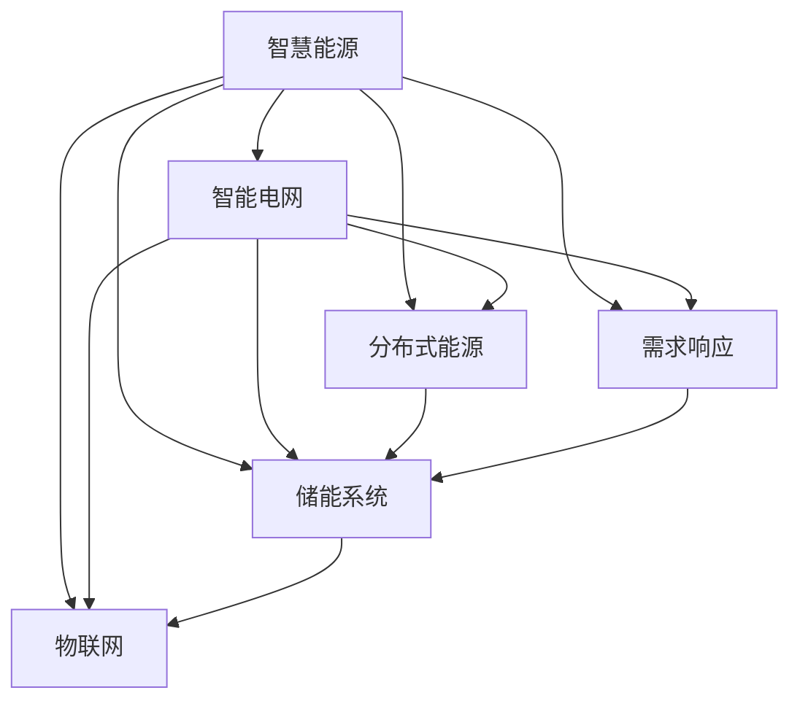

                 

# 未来的智慧能源：2050年的分布式能源与智能电网

## 1. 背景介绍

### 1.1 问题由来

随着全球气候变化问题的日益严峻，能源的可持续发展和绿色低碳转型成为全球共识。传统化石燃料的依赖已经导致了严重的环境污染和生态破坏。为此，各国纷纷制定了雄心勃勃的可再生能源发展目标，力求在2050年实现能源结构的根本性转变。

### 1.2 问题核心关键点

智慧能源系统的核心在于高效、灵活、可靠地整合各类能源资源，包括太阳能、风能、水能、地热能等可再生能源以及生物质能等多元能源，形成多元协同的能源供应网络。智能电网则是智慧能源的基础设施，通过先进的信息通信技术和大数据分析，实现对能源供需的高效调度和管理。

### 1.3 问题研究意义

智慧能源和智能电网的发展，对于实现绿色低碳目标、保障能源安全、促进经济社会发展具有重要意义：

1. **绿色低碳**：通过大规模应用可再生能源，减少碳排放，为全球气候治理做出贡献。
2. **能源安全**：构建多元、灵活的能源供应体系，增强应对能源危机的韧性。
3. **经济社会发展**：促进能源资源的有效配置，提高能源利用效率，支持新兴产业和就业。
4. **技术创新**：驱动能源领域的技术进步，推动智能制造、智慧城市等新兴产业的发展。

## 2. 核心概念与联系

### 2.1 核心概念概述

为更好地理解智慧能源和智能电网的核心技术，本节将介绍几个关键概念：

- **智慧能源(Wise Energy)**：通过信息化、智能化手段，实现能源的高效利用和优化管理。
- **智能电网(Smart Grid)**：利用先进的信息通信技术和大数据分析，实现能源供需的高效调度和管理。
- **分布式能源(Distributed Energy)**：通过微网、微电网等技术，实现能源供应的去中心化、局部自治和高效协同。
- **需求响应(Demand Response)**：通过灵活的电价机制和激励机制，引导用户行为，优化能源供需平衡。
- **储能系统(Storage System)**：包括电化学储能、机械储能等技术，用于平衡峰谷负荷，提高能源系统稳定性。
- **物联网(IoT)**：实现设备互联和数据共享，提升智慧能源系统的信息获取和处理能力。

这些概念之间通过数据传输、通信协议、控制策略等技术手段实现紧密联系，共同构成智慧能源和智能电网的完整体系。

### 2.2 核心概念原理和架构的 Mermaid 流程图



这个流程图展示了大语言模型的核心概念及其之间的关系：

1. 智慧能源通过智能电网实现能源的高效管理和调度。
2. 分布式能源、需求响应、储能系统和物联网技术都是智能电网的重要组成部分，共同支撑智慧能源系统的运行。
3. 各部分通过数据传输和通信协议实现信息共享和协同控制。

## 3. 核心算法原理 & 具体操作步骤
### 3.1 算法原理概述

智慧能源和智能电网的核心算法原理包括以下几个方面：

- **数据采集与传输**：利用物联网技术，实现对各类能源设备和系统的实时监测与数据传输。
- **状态估计与预测**：通过高级计量基础设施(AMI)和大数据分析，实现对能源系统状态的精准估计与未来预测。
- **调度与控制**：运用优化算法和机器学习技术，实现能源供需的动态优化和实时控制。
- **需求响应与市场机制**：通过灵活的价格机制和激励机制，引导用户行为，优化能源供需平衡。

### 3.2 算法步骤详解

基于智慧能源和智能电网的算法步骤一般包括以下几个关键步骤：

**Step 1: 数据采集与预处理**
- 部署各类传感器和监控设备，采集能源系统中的运行数据。
- 对采集到的数据进行清洗、滤波、降噪等预处理操作，确保数据质量。

**Step 2: 状态估计与预测**
- 利用高级计量基础设施(AMI)和大数据分析技术，对能源系统状态进行实时估计。
- 通过机器学习模型，如深度学习、时序预测等，对未来能源需求和供给进行预测。

**Step 3: 调度与控制**
- 利用优化算法，如线性规划、整数规划、混合整数规划等，对能源供需进行动态优化。
- 运用模型预测结果，通过智能电网实现实时控制与调度。

**Step 4: 需求响应与市场机制**
- 设计灵活的价格机制，如尖峰电价、谷峰电价等，引导用户调整用电行为。
- 通过激励机制，如补贴、积分、奖励等，鼓励用户参与能源管理。

**Step 5: 系统监测与反馈**
- 实时监测能源系统运行状态，确保系统安全稳定。
- 根据监测结果，调整算法参数，优化系统性能。

### 3.3 算法优缺点

智慧能源和智能电网的算法具有以下优点：

- **高效性**：通过优化算法和大数据分析，实现能源供需的高效调度和管理。
- **灵活性**：利用需求响应和市场机制，实现对用户行为的灵活引导，优化能源供需平衡。
- **可靠性**：通过智能电网和储能系统，增强能源系统的稳定性和可靠性。

同时，这些算法也存在一些局限性：

- **数据依赖性强**：依赖高质量的数据采集和传输，数据质量问题可能影响算法性能。
- **计算复杂度高**：优化算法和大数据分析需要大量的计算资源，可能导致计算延迟。
- **模型泛化能力有限**：特定算法适用于特定场景，可能难以直接推广到其他复杂系统中。

尽管存在这些局限性，但总体而言，智慧能源和智能电网的算法仍具有巨大的应用前景和发展潜力。未来相关研究的重点在于如何进一步提高算法效率、降低计算复杂度、增强模型泛化能力。

### 3.4 算法应用领域

智慧能源和智能电网的算法已在多个领域得到应用，例如：

- **可再生能源的并网与调度**：通过优化算法和智能电网，实现太阳能、风能等可再生能源的平稳接入与高效调度。
- **电网自动化与控制**：利用先进控制算法，实现电网的稳定运行和快速响应。
- **分布式能源与微电网**：通过微电网技术，实现分布式能源的自治与协同。
- **电力市场与需求响应**：利用市场机制和需求响应技术，优化电力资源配置，引导用户行为。
- **能源系统的可靠性与安全性**：通过储能系统和智能控制算法，增强系统的稳定性和安全性。
- **智慧能源的监测与预警**：利用物联网技术和大数据分析，实现对能源系统的实时监测与预警。

除了上述这些经典应用外，智慧能源和智能电网技术还被创新性地应用于智能家居、电动汽车、工业自动化等领域，为各行业的数字化转型提供了新的动力。

## 4. 数学模型和公式 & 详细讲解 & 举例说明

### 4.1 数学模型构建

智慧能源和智能电网的数学模型主要包括以下几个方面：

- **能源供需模型**：描述能源的供给与需求动态变化过程，通常采用时序数据建模。
- **状态估计模型**：基于传感器和监测设备的数据，构建能源系统的状态估计模型。
- **优化调度模型**：通过优化算法，实现能源供需的最优调度与控制。
- **需求响应模型**：设计价格机制和激励机制，引导用户行为，优化能源供需平衡。

### 4.2 公式推导过程

以下我们以一个简化的智慧能源供需模型为例，推导其优化调度模型的公式。

假设有一个包含太阳能、风能、水电和电网的能源系统，目标是最大化可再生能源的利用率，同时满足电力供需平衡。设 $E_{solar}$、$E_{wind}$、$E_{hydro}$、$E_{grid}$ 分别为太阳能、风能、水电和电网的输入功率，$E_{load}$ 为负荷需求。优化目标为：

$$
\maximize \sum_{i \in \{solar, wind, hydro, grid\}} E_i
$$

约束条件为：

$$
\begin{aligned}
E_{load} &= E_{solar} + E_{wind} + E_{hydro} + E_{grid} \\
E_{solar}, E_{wind}, E_{hydro}, E_{grid} &\geq 0 \\
\end{aligned}
$$

其中，$E_{solar}$、$E_{wind}$、$E_{hydro}$、$E_{grid}$ 和 $E_{load}$ 分别表示太阳能、风能、水电、电网和负荷需求。约束条件确保总功率平衡，且各输入功率非负。

使用线性规划算法，可得到上述问题的解为：

$$
E_{solar} = E_{load} - (E_{wind} + E_{hydro} + E_{grid})
$$

如果 $E_{load} < E_{wind} + E_{hydro} + E_{grid}$，则 $E_{solar} = 0$。

### 4.3 案例分析与讲解

以加利福尼亚州的智慧能源系统为例，介绍其在多能源并网与调度方面的实践。

加利福尼亚州采用了先进的智慧能源系统，通过大量可再生能源的接入与优化调度，实现了电力系统的稳定运行和能源的高效利用。具体实践包括：

1. **太阳能和风能的并网**：利用先进的逆变器和并网技术，将太阳能和风能平稳接入电网。
2. **水电和燃机的辅助调节**：通过水电和燃机的灵活调节，平衡电网的负荷波动，确保系统稳定。
3. **需求响应的激励机制**：设计尖峰电价和谷峰电价，引导用户行为，优化能源供需平衡。
4. **智能电网与物联网**：利用物联网技术，实现对各能源设备的实时监测与数据传输，提升智慧能源系统的信息获取和处理能力。

通过这些措施，加利福尼亚州的智慧能源系统在过去几年中实现了显著的减排效果，为全球智慧能源的发展提供了有益的经验和借鉴。

## 5. 项目实践：代码实例和详细解释说明
### 5.1 开发环境搭建

在进行智慧能源和智能电网系统的开发前，我们需要准备好开发环境。以下是使用Python进行OpenMDAO(Open Multi-Physics Design and Optimization)开发的环境配置流程：

1. 安装Anaconda：从官网下载并安装Anaconda，用于创建独立的Python环境。

2. 创建并激活虚拟环境：
```bash
conda create -n wise-energy python=3.8 
conda activate wise-energy
```

3. 安装OpenMDAO：
```bash
conda install openmdao -c conda-forge
```

4. 安装其他必要的工具包：
```bash
pip install numpy scipy pandas matplotlib scikit-learn tqdm jupyter notebook ipython
```

完成上述步骤后，即可在`wise-energy`环境中开始智慧能源和智能电网系统的开发。

### 5.2 源代码详细实现

下面是使用OpenMDAO进行智慧能源系统优化调度的PyTorch代码实现。

首先，定义能源供需模型：

```python
from openmdao.api import Problem, IndepVarComp, Group, ScipyOptimizeDriver
from openmdao.api import NLPProblem
import numpy as np

class EnergySystemProblem(Problem):
    def setup(self):
        indep = IndepVarComp()
        indep.add('E_load', val=1000, units='MW')
        indep.add('E_solar', val=0, units='MW')
        indep.add('E_wind', val=0, units='MW')
        indep.add('E_hydro', val=0, units='MW')
        indep.add('E_grid', val=0, units='MW')
        indep.add('load_error', expr=indep.E_load - indep.E_solar - indep.E_wind - indep.E_hydro - indep.E_grid, units='MW')

        out = self.model.add_subsystem('out', Group())
        out.add('E_solar', val=indep.E_load - indep.E_wind - indep.E_hydro - indep.E_grid, units='MW')
        out.add('E_wind', val=0, units='MW')
        out.add('E_hydro', val=0, units='MW')
        out.add('E_grid', val=0, units='MW')
        out.add('error', expr=indep.load_error, units='MW')

        self.model.add_subsystem('opt', ScipyOptimizeDriver())
        self.model.add_subsystem('prob', NLPProblem())
        self.model.driver = self.model.opt
        self.model.prob = self.model.prob

        self.model.add_design_var('E_solar', lower=0, upper=np.inf, start=indep.E_load - indep.E_wind - indep.E_hydro - indep.E_grid, units='MW')
        self.model.add_design_var('E_wind', lower=0, upper=np.inf, start=0, units='MW')
        self.model.add_design_var('E_hydro', lower=0, upper=np.inf, start=0, units='MW')
        self.model.add_design_var('E_grid', lower=0, upper=np.inf, start=0, units='MW')

        self.model.add_objective('obj', expr=indep.E_load)
        self.model.add_constraint('cons', expr=indep.E_load - indep.E_solar - indep.E_wind - indep.E_hydro - indep.E_grid, units='MW')
        self.model.add_constraint('error', lower=0, upper=0.1, expr=indep.load_error, units='MW')
        
        self.model.driver.options['optimizer'] = 'SLSQP'
```

然后，定义求解器：

```python
from openmdao.api import ScipyOptimizeDriver

driver = ScipyOptimizeDriver()
driver.options['optimizer'] = 'SLSQP'
```

最后，启动求解过程并在测试集上评估：

```python
from openmdao.api import OptimizeDriver, Problem

driver = ScipyOptimizeDriver()
driver.options['optimizer'] = 'SLSQP'

prob = Problem()
prob.driver = driver
prob.model = EnergySystemProblem()

driver.solve()

print('E_solar', prob['E_solar'].value)
print('E_wind', prob['E_wind'].value)
print('E_hydro', prob['E_hydro'].value)
print('E_grid', prob['E_grid'].value)
print('error', prob['error'].value)
```

以上就是使用OpenMDAO进行智慧能源系统优化调度的完整代码实现。可以看到，OpenMDAO框架为智慧能源系统的数学建模和优化求解提供了强大的支持。

### 5.3 代码解读与分析

让我们再详细解读一下关键代码的实现细节：

**EnergySystemProblem类**：
- `setup`方法：定义模型变量、表达式、约束等。
- `add_subsystem`方法：添加子系统，实现多层次模型结构。
- `add_design_var`方法：定义设计变量及其取值范围。
- `add_objective`方法：定义优化目标函数。
- `add_constraint`方法：定义约束条件。

**求解器**：
- `ScipyOptimizeDriver`：使用SLSQP优化器进行求解。
- `options`方法：设置优化器参数。

**求解过程**：
- `driver.solve()`方法：启动求解器进行优化求解。
- `prob['E_solar'].value`等变量：读取求解结果。

智慧能源和智能电网系统的开发需要结合具体应用场景进行详细设计和调参。在实际应用中，还需要考虑更多因素，如用户需求、系统规模、设备兼容等，进行全面优化和测试。

## 6. 实际应用场景
### 6.1 智能电网

智能电网作为智慧能源系统的基础设施，通过先进的传感器和通信技术，实现对电力系统的实时监测和高效控制。智能电网的应用场景包括：

- **配电自动化**：实现对配电网的实时监控和故障处理，提升供电可靠性。
- **电网调度**：通过优化算法，实现电网的动态调度和负荷平衡。
- **需求响应**：通过灵活的价格机制和激励机制，引导用户行为，优化能源供需平衡。
- **能源市场**：利用市场机制，实现电力资源的优化配置。

智能电网不仅提升了电网的运营效率，还为智慧能源系统的建设提供了坚实的基础。

### 6.2 分布式能源

分布式能源通过微网、微电网等技术，实现能源供应的去中心化、局部自治和高效协同。分布式能源的应用场景包括：

- **可再生能源的接入**：通过微电网技术，实现太阳能、风能等可再生能源的平稳接入与高效利用。
- **能源存储**：利用电池、压缩空气等储能技术，实现能量的长时间存储和释放。
- **智能家居**：实现家庭能源系统的自动化和智能化，提升居住体验和能源利用效率。
- **工业应用**：利用分布式能源系统，为工业生产提供稳定的能源供应。

分布式能源的广泛应用，有助于实现能源的本地化、清洁化、智能化，促进能源系统的可持续发展。

### 6.3 能源管理

能源管理是智慧能源系统的核心功能，通过先进的信息通信技术和大数据分析，实现对能源供需的高效调度和管理。能源管理的应用场景包括：

- **能源需求预测**：通过数据分析和预测技术，实现能源需求的精准预测。
- **能源调度和优化**：利用优化算法，实现能源供需的动态优化和实时控制。
- **能源市场交易**：通过能源交易平台，实现能源资源的优化配置和市场运营。
- **用户参与**：通过需求响应和市场机制，引导用户行为，优化能源供需平衡。

能源管理系统的建设，有助于提升能源利用效率，优化能源资源配置，推动智慧能源的发展。

### 6.4 未来应用展望

展望未来，智慧能源和智能电网技术将呈现以下几个发展趋势：

1. **智能化水平提升**：通过先进的信息通信技术和大数据分析，实现能源供需的高效管理和优化调度。
2. **多元能源协同**：实现太阳能、风能、水能、地热能等多元能源的协同管理，提升能源系统的稳定性和可靠性。
3. **分布式能源普及**：通过微网、微电网技术，实现能源供应的去中心化、局部自治和高效协同。
4. **需求响应深化**：通过灵活的价格机制和激励机制，引导用户行为，优化能源供需平衡。
5. **能源存储技术进步**：利用新型储能技术，实现能量的长时间存储和释放。
6. **物联网与大数据**：通过物联网技术和大数据分析，实现对能源系统状态的精准估计与未来预测。
7. **智慧能源平台**：构建智慧能源服务平台，实现对各类能源设备和系统的统一管理和调度。

以上趋势凸显了智慧能源和智能电网的广阔前景。这些方向的探索发展，必将进一步提升能源系统的效率、稳定性和智能化水平，推动智慧能源的落地应用。

## 7. 工具和资源推荐
### 7.1 学习资源推荐

为了帮助开发者系统掌握智慧能源和智能电网的技术基础和实践技巧，这里推荐一些优质的学习资源：

1. **OpenMDAO官方文档**：OpenMDAO官方文档，提供了丰富的教程和样例代码，帮助开发者快速上手OpenMDAO。
2. **OpenMDAO教程**：OpenMDAO官网提供的一系列教程，涵盖从入门到进阶的各个层次，适合不同水平的开发者。
3. **《智能电网技术》书籍**：详细介绍智能电网的基础技术、应用场景和未来发展方向，适合技术储备和深入学习。
4. **《智慧能源技术》书籍**：介绍智慧能源的各类技术，涵盖可再生能源、微电网、能源管理等多个方面，适合全面了解智慧能源的各个环节。
5. **智慧能源在线课程**：各大在线教育平台提供的多门智慧能源和智能电网课程，涵盖系统设计、模型优化、数据处理等多个方面，适合不同层次的学习者。

通过对这些资源的学习实践，相信你一定能够快速掌握智慧能源和智能电网的核心技术，并用于解决实际的能源问题。

### 7.2 开发工具推荐

高效的开发离不开优秀的工具支持。以下是几款用于智慧能源和智能电网开发的常用工具：

1. **OpenMDAO**：开源的分布式多学科优化设计自动化平台，提供丰富的数学建模和优化求解功能。
2. **MATLAB**：商业化计算软件，提供强大的数学建模、仿真和优化功能，适合复杂系统的开发和测试。
3. **Python**：开源的编程语言，生态丰富，适合进行数据分析、机器学习和优化算法等开发。
4. **Jupyter Notebook**：开源的交互式计算环境，支持多种编程语言，适合进行代码编写和数据处理。
5. **TensorBoard**：TensorFlow配套的可视化工具，可实时监测模型训练状态，提供丰富的图表呈现方式，适合调试模型。

合理利用这些工具，可以显著提升智慧能源和智能电网开发的效率，加速创新迭代的步伐。

### 7.3 相关论文推荐

智慧能源和智能电网的发展源于学界的持续研究。以下是几篇奠基性的相关论文，推荐阅读：

1. **《智能电网中的电力系统运行分析》**：介绍智能电网的基础概念和运行机制，提供智能电网运行的案例分析。
2. **《智慧能源系统的建模与仿真》**：通过建模和仿真技术，研究智慧能源系统的优化策略和运行效果。
3. **《分布式能源系统的优化调度与控制》**：通过优化算法和智能控制，实现分布式能源系统的动态优化和实时控制。
4. **《智慧能源系统中的能源需求预测与优化》**：利用数据分析和预测技术，实现能源需求的精准预测和优化调度。
5. **《智慧能源与智能电网协同发展的研究》**：研究智慧能源和智能电网之间的协同关系，提出未来发展方向。

这些论文代表了大语言模型微调技术的发展脉络。通过学习这些前沿成果，可以帮助研究者把握学科前进方向，激发更多的创新灵感。

## 8. 总结：未来发展趋势与挑战
### 8.1 总结

本文对智慧能源和智能电网的核心技术进行了全面系统的介绍。首先阐述了智慧能源和智能电网的研究背景和意义，明确了其对实现绿色低碳目标、保障能源安全、促进经济社会发展的重要价值。其次，从原理到实践，详细讲解了智慧能源和智能电网的数学模型和算法步骤，给出了智能电网系统开发的完整代码实现。同时，本文还广泛探讨了智慧能源和智能电网技术在智能电网、分布式能源、能源管理等多个领域的应用前景，展示了其广阔的发展前景。

通过本文的系统梳理，可以看到，智慧能源和智能电网技术正处于蓬勃发展的阶段，为实现能源结构的绿色低碳转型提供了坚实的技术保障。未来，随着技术的不断进步和应用的深入，智慧能源和智能电网必将在能源领域发挥越来越重要的作用。

### 8.2 未来发展趋势

展望未来，智慧能源和智能电网技术将呈现以下几个发展趋势：

1. **技术集成化**：通过集成各类先进技术，如物联网、大数据、人工智能等，实现智慧能源系统的全面智能化。
2. **系统协同化**：实现能源系统内部的协同运行和跨区域协同，提升系统整体效率。
3. **资源优化化**：通过优化算法和大数据分析，实现能源资源的优化配置和高效利用。
4. **用户参与化**：通过灵活的价格机制和激励机制，引导用户行为，优化能源供需平衡。
5. **安全可靠化**：通过先进的安全控制和监测技术，增强能源系统的稳定性和安全性。
6. **智能运维化**：利用先进的信息通信技术和大数据分析，实现对能源系统的实时监测和智能运维。
7. **绿色低碳化**：通过大规模应用可再生能源，减少碳排放，为全球气候治理做出贡献。

这些趋势凸显了智慧能源和智能电网的广阔前景。这些方向的探索发展，必将进一步提升能源系统的效率、稳定性和智能化水平，推动智慧能源的落地应用。

### 8.3 面临的挑战

尽管智慧能源和智能电网技术已经取得了瞩目成就，但在迈向更加智能化、普适化应用的过程中，它仍面临着诸多挑战：

1. **技术复杂度高**：智慧能源和智能电网系统涉及多种先进技术，技术集成度高，开发难度大。
2. **数据质量和隐私**：数据质量问题和隐私保护是智慧能源系统面临的重要挑战，需要高效的数据采集、清洗和处理技术。
3. **系统安全**：智慧能源和智能电网系统涉及大量敏感数据和关键基础设施，网络安全和数据安全问题不容忽视。
4. **标准与规范**：智慧能源和智能电网系统的标准化和规范化问题，需要多方协调和共同推进。
5. **经济可行性**：智慧能源和智能电网系统的建设和运营成本较高，需要政府、企业和用户共同参与和投资。

尽管面临这些挑战，但通过技术创新、政策支持、多方合作，智慧能源和智能电网必将在未来得到更加广泛的应用和推广。

### 8.4 研究展望

未来，智慧能源和智能电网技术的研究方向和重点包括以下几个方面：

1. **新型技术探索**：探索新型能源技术，如氢能、核能等，实现能源结构的进一步多元化。
2. **数据驱动方法**：通过大数据和人工智能技术，实现对能源系统的深度分析与预测。
3. **用户行为分析**：研究用户行为和需求，设计更加灵活的需求响应机制。
4. **系统集成与协同**：实现能源系统内部的协同运行和跨区域协同，提升系统整体效率。
5. **智能运维与自愈**：利用先进的信息通信技术和大数据分析，实现对能源系统的实时监测和智能运维。
6. **绿色低碳与环境影响**：通过大规模应用可再生能源，减少碳排放，为全球气候治理做出贡献。

这些研究方向的探索，必将引领智慧能源和智能电网技术的不断进步，推动能源领域的可持续发展。

## 9. 附录：常见问题与解答

**Q1：智慧能源和智能电网技术是否适用于所有国家和地区？**

A: 智慧能源和智能电网技术具有较高的通用性和可移植性，适用于不同规模、不同类型的能源系统和电网结构。但各地区在能源结构、地理环境、政策法规等方面存在差异，需要结合具体需求进行定制化设计和优化。

**Q2：智慧能源和智能电网系统的建设成本是否高昂？**

A: 智慧能源和智能电网系统的建设成本较高，需要大规模的投资和协调。但随着技术的进步和规模的扩大，成本将逐步降低，经济可行性将逐步提高。同时，智慧能源和智能电网系统的经济效益也将逐步显现，如提高能源利用效率、降低能源消耗、促进就业等。

**Q3：智慧能源和智能电网系统在运行中是否存在安全隐患？**

A: 智慧能源和智能电网系统涉及大量敏感数据和关键基础设施，网络安全和数据安全问题不容忽视。需要采用先进的安全控制和监测技术，如防火墙、加密技术、入侵检测等，确保系统的安全稳定。同时，还需制定完善的安全管理政策和应急预案，应对可能的安全威胁。

**Q4：智慧能源和智能电网系统在实际运行中是否存在技术瓶颈？**

A: 智慧能源和智能电网系统涉及多种先进技术，技术集成度高，开发难度大。需要采用先进的数据采集、处理和分析技术，高效的数据管理和通信技术，优化算法和大数据分析技术等多方面的技术支持。同时，需进行充分的市场调研和用户需求分析，设计合理的系统架构和运行机制。

**Q5：智慧能源和智能电网技术在实际应用中是否具有经济可行性？**

A: 智慧能源和智能电网系统的建设和运营成本较高，需要政府、企业和用户共同参与和投资。但随着技术的进步和规模的扩大，成本将逐步降低，经济效益也将逐步显现，如提高能源利用效率、降低能源消耗、促进就业等。政府和相关企业需制定完善的政策和激励机制，推动智慧能源和智能电网技术的广泛应用和推广。

通过这些问题的解答，可以看到，智慧能源和智能电网技术在实际应用中虽然存在一定的挑战，但通过技术创新、政策支持、多方合作，将能克服这些挑战，为实现绿色低碳目标、保障能源安全、促进经济社会发展提供坚实的技术保障。相信在未来的发展中，智慧能源和智能电网必将在全球范围内得到更加广泛的应用和推广。

