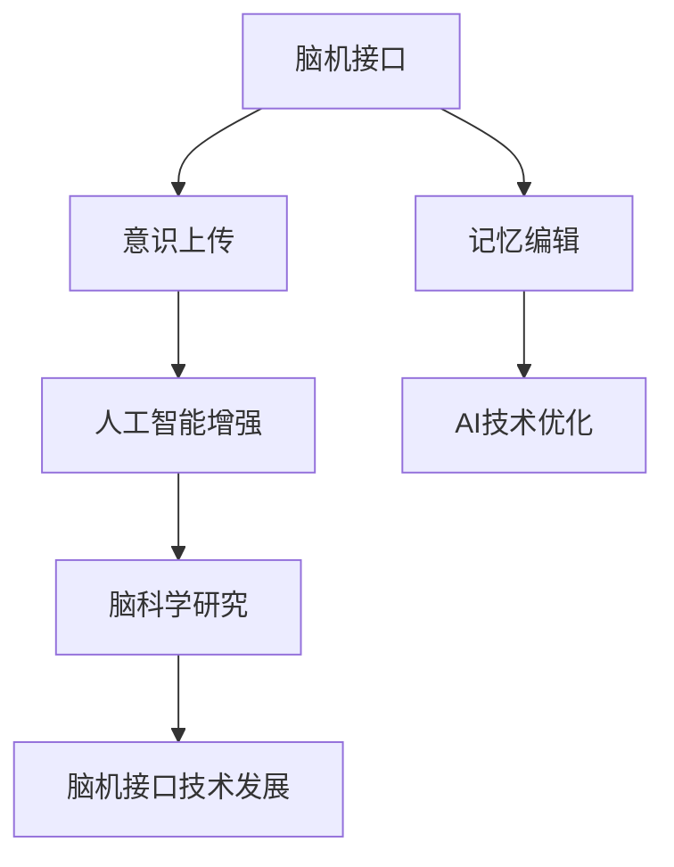

                 

# 未来的脑科学：2050年的意识上传与记忆编辑

> 关键词：脑科学, 意识上传, 记忆编辑, 人工智能, 神经科学, 脑机接口, 虚拟现实, 科学幻想, 技术前沿

## 1. 背景介绍

### 1.1 问题由来

随着人工智能(AI)技术的飞速发展，人类对意识与记忆的本质认知，以及如何利用技术手段去掌控、编辑这些内在信息的需求愈发迫切。近年来，脑科学和神经技术领域取得了一系列重大突破，从脑机接口(Brain-Computer Interface, BCI)到意识上传(Cybernetic Upload)，再到记忆编辑(Memory Editing)，正在逐步由科幻变为现实。

脑科学和神经技术不仅仅是探索人类大脑奥秘的前沿领域，更是推动AI、虚拟现实(VR)、增强现实(AR)等技术发展的重要基础。脑科学研究的终极目标，是探索意识的本质，并尝试通过脑机接口技术将人类的思维、情感、记忆等信息与计算机相连接，从而实现意识上传和记忆编辑。

### 1.2 问题核心关键点

1. **脑机接口技术**：脑机接口技术是实现意识上传和记忆编辑的关键技术之一，它通过解析大脑的电生理信号，将脑神经元活动转化为计算机可理解的信号，进而控制外部设备或实现信息传输。

2. **意识上传**：意识上传是指将人类大脑中的思维、情感、记忆等认知信息完整无误地转移到计算机系统或虚拟环境中，让意识在虚拟空间中延续和存在。

3. **记忆编辑**：记忆编辑涉及对大脑记忆信息的修改、增加、删除等操作，旨在通过脑科学干预手段，提升记忆能力、消除负面记忆或矫正错误记忆。

4. **人工智能与脑科学融合**：将人工智能技术应用于脑科学领域，通过深度学习、神经网络等手段，增强对大脑信号的解析能力，提高脑机接口的精确度和效率。

5. **伦理与安全**：随着脑科学技术的进步，伦理和安全问题也随之而来，如脑机接口的隐私泄露、意识上传的伦理争议、记忆编辑的潜在风险等。

这些核心概念之间的逻辑关系可以通过以下Mermaid流程图来展示：

```mermaid
graph TB
    A[脑机接口(Brain-Computer Interface, BCI)] --> B[意识上传(Cybernetic Upload)]
    A --> C[记忆编辑(Memory Editing)]
    B --> D[人工智能(AI)增强]
    C --> E[AI技术优化]
    D --> F[脑科学研究]
    F --> G[脑机接口技术发展]
    G --> H[意识上传和记忆编辑]
    H --> I[伦理与安全]
```

## 2. 核心概念与联系

### 2.1 核心概念概述

为更好地理解意识上传和记忆编辑的未来前景，本节将介绍几个密切相关的核心概念：

- **脑机接口**：脑机接口是指通过科学手段实现人脑与计算机之间的直接通信，使得人可以通过思维、意识控制外部设备或实现信息传输。

- **意识上传**：意识上传是指通过技术手段，将人类大脑中的思维、情感、记忆等认知信息转移到计算机系统或虚拟环境中，使得意识可以在虚拟空间中延续。

- **记忆编辑**：记忆编辑涉及对大脑记忆信息的修改、增加、删除等操作，旨在通过脑科学干预手段，提升记忆能力、消除负面记忆或矫正错误记忆。

- **人工智能增强**：将人工智能技术应用于脑科学领域，通过深度学习、神经网络等手段，增强对大脑信号的解析能力，提高脑机接口的精确度和效率。

- **脑科学研究**：研究大脑的生理机制、认知过程、信息处理等，以期通过科学手段干预大脑活动，实现意识上传和记忆编辑。

这些核心概念之间的逻辑关系可以通过以下Mermaid流程图来展示：



## 3. 核心算法原理 & 具体操作步骤
### 3.1 算法原理概述

意识上传和记忆编辑涉及对大脑信息的高级解析和操作，其实现依赖于脑机接口技术、深度学习和神经网络等多种先进技术的融合。

1. **脑机接口**：通过解析大脑电生理信号，将其转化为计算机可理解的信号，实现人脑与计算机的直接通信。

2. **意识上传**：将脑机接口解析得到的信号转化为数字信息，通过网络传输到计算机系统中，实现意识在虚拟环境中的延续。

3. **记忆编辑**：利用脑机接口解析大脑活动，识别特定记忆信息，通过深度学习模型对其进行编辑。

4. **人工智能增强**：借助人工智能技术，增强对大脑信号的解析能力，提高脑机接口的准确度和效率。

5. **脑科学研究**：结合神经科学知识，进一步优化脑机接口算法和深度学习模型，以实现更加精准的意识上传和记忆编辑。

### 3.2 算法步骤详解

#### 3.2.1 脑机接口技术

1. **信号采集**：通过脑电图(EEG)、功能性磁共振成像(fMRI)、脑磁图(MEG)等技术，采集大脑电生理信号。

2. **信号预处理**：对采集到的信号进行预处理，包括滤波、降噪、特征提取等操作，增强信号质量。

3. **信号解码**：使用深度学习模型（如卷积神经网络CNN、递归神经网络RNN、长短期记忆网络LSTM等）解析信号，将其转化为计算机可理解的信号。

4. **命令执行**：将解码得到的信号与预设命令进行匹配，控制外部设备或实现信息传输。

#### 3.2.2 意识上传

1. **信号传输**：通过网络将脑机接口解析得到的信号传输到计算机系统中。

2. **数字编码**：将信号转化为数字编码形式，存储在计算机系统中。

3. **虚拟环境映射**：将数字编码映射到虚拟环境，使得意识可以在虚拟环境中继续存在。

4. **信息交互**：在虚拟环境中，通过界面或交互系统实现与外界的互动。

#### 3.2.3 记忆编辑

1. **记忆提取**：利用脑机接口解析大脑活动，提取特定记忆信息。

2. **信息编辑**：使用深度学习模型对提取的记忆信息进行编辑，如增加、删除、修改等。

3. **记忆重构**：将编辑后的记忆信息重新编码并存储在大脑中，实现记忆的调整和优化。

#### 3.2.4 人工智能增强

1. **算法优化**：通过深度学习等人工智能技术优化脑机接口的信号解析算法。

2. **模型训练**：使用大规模神经网络模型（如GPT、BERT等）进行训练，提高信号解析的精确度和鲁棒性。

3. **实时反馈**：在实际应用中，利用实时反馈机制不断优化算法和模型，确保信息的准确传输和编辑。

#### 3.2.5 脑科学研究

1. **生理机制研究**：深入研究大脑的生理机制和认知过程，揭示大脑信号的产生和传输机制。

2. **信息处理研究**：研究大脑对信息的处理和存储方式，理解记忆和意识的本质。

3. **技术应用研究**：探索如何将脑科学知识应用于实际技术开发，提升脑机接口的性能和效果。

### 3.3 算法优缺点

#### 3.3.1 脑机接口技术的优点

1. **高效性**：能够快速解析大脑信号，实现人脑与计算机的直接交互。

2. **灵活性**：通过不断优化算法和模型，可以适应多种应用场景。

3. **非侵入性**：通过非侵入性的方式采集信号，避免对大脑造成损伤。

#### 3.3.2 脑机接口技术的缺点

1. **解析精度**：目前解析大脑信号的精度还有待提升，解析结果可能存在误差。

2. **设备成本**：高质量的信号采集和解码设备成本较高，普及度有限。

3. **长期安全性**：长期使用脑机接口可能对大脑造成不可逆的损伤。

#### 3.3.3 意识上传的优点

1. **数据保存**：能够永久保存人类的思维和记忆，实现意识的延续。

2. **虚拟体验**：在虚拟环境中实现意识体验，具有无限可能。

#### 3.3.4 意识上传的缺点

1. **技术瓶颈**：实现意识上传需要解决诸多技术难题，如信号解析、数据传输等。

2. **伦理争议**：意识上传涉及诸多伦理和安全问题，如隐私保护、意识意识的本质等。

#### 3.3.5 记忆编辑的优点

1. **提升记忆**：通过编辑和优化记忆，提升记忆能力和记忆质量。

2. **消除负面记忆**：删除或修改负面记忆，改善心理健康。

#### 3.3.6 记忆编辑的缺点

1. **技术复杂性**：记忆编辑需要高度复杂的算法和模型支持。

2. **伦理挑战**：记忆编辑涉及伦理和法律问题，如记忆篡改、隐私保护等。

#### 3.3.7 人工智能增强的优点

1. **算法优化**：通过人工智能技术不断优化脑机接口算法，提升解析精度。

2. **模型训练**：利用大规模神经网络模型进行训练，提高解析能力。

#### 3.3.8 人工智能增强的缺点

1. **计算资源需求**：需要大量的计算资源进行模型训练和优化。

2. **模型泛化能力**：模型可能存在泛化能力不足的问题，解析结果可能存在误差。

#### 3.3.9 脑科学研究的优点

1. **理论基础**：为脑机接口和人工智能技术提供坚实的理论基础。

2. **应用导向**：通过研究大脑生理机制和认知过程，指导技术开发和应用。

#### 3.3.10 脑科学研究的缺点

1. **研究复杂性**：大脑的复杂性和认知过程的复杂性使得研究难度较大。

2. **应用滞后**：研究成果从基础研究到技术应用的转化周期较长。

### 3.4 算法应用领域

#### 3.4.1 医疗健康

脑机接口技术可以应用于脑部疾病治疗、神经康复、心理健康等领域。通过解析大脑信号，实现对疾病的早期诊断和治疗。

#### 3.4.2 教育培训

脑机接口技术可以用于教育培训，通过解析学生的脑信号，评估其学习状态和进度，实现个性化教学。

#### 3.4.3 娱乐互动

脑机接口技术可以应用于虚拟现实和增强现实中，实现与用户的深度互动，提升游戏体验和娱乐效果。

#### 3.4.4 工业控制

脑机接口技术可以应用于工业控制中，通过解析操作者的脑信号，实现人机协同作业，提高生产效率和安全性。

#### 3.4.5 安全监控

脑机接口技术可以应用于安全监控中，通过解析监控人员的脑信号，实现对突发事件的快速反应和处理。

#### 3.4.6 军事应用

脑机接口技术可以应用于军事领域，通过解析军人的脑信号，实现人机协同作战，提升军事智能化水平。

## 4. 数学模型和公式 & 详细讲解 & 举例说明
### 4.1 数学模型构建

脑机接口技术的核心是信号解析，主要涉及神经信号的预处理、特征提取和解码。

设采集到的脑电信号为 $x(t)$，信号预处理和特征提取后得到的信号为 $y(t)$，使用深度学习模型 $f$ 对信号进行解码，解码后的结果为 $z(t)$，解码结果与预设命令 $c$ 的匹配度为 $w(t)$，最终执行的命令为 $a(t)$。

脑机接口技术的基本流程可以表示为：

$$
a(t) = g(f(y(t)) \cdot w(t))
$$

其中 $g$ 表示命令执行的映射函数。

### 4.2 公式推导过程

#### 4.2.1 信号预处理

信号预处理包括滤波、降噪、归一化等操作，可以使用以下公式表示：

$$
y(t) = h(x(t))
$$

其中 $h$ 表示预处理函数。

#### 4.2.2 特征提取

特征提取是将预处理后的信号转化为计算机可理解的特征向量，可以使用以下公式表示：

$$
z(t) = v(y(t))
$$

其中 $v$ 表示特征提取函数。

#### 4.2.3 信号解码

信号解码是将特征向量转化为命令信号，可以使用以下公式表示：

$$
z(t) = f(y(t))
$$

其中 $f$ 表示解码函数。

#### 4.2.4 命令匹配

命令匹配是将解码后的信号与预设命令进行匹配，可以使用以下公式表示：

$$
w(t) = k(z(t), c)
$$

其中 $k$ 表示匹配函数。

#### 4.2.5 命令执行

命令执行是将匹配结果转化为实际命令，可以使用以下公式表示：

$$
a(t) = g(z(t), w(t))
$$

其中 $g$ 表示执行函数。

### 4.3 案例分析与讲解

#### 4.3.1 信号预处理

设采集到的脑电信号 $x(t)$ 为：

$$
x(t) = 0.5 \sin(2\pi t) + 0.2 \sin(4\pi t) + \mathcal{N}(0, 0.1)
$$

其中 $\mathcal{N}(0, 0.1)$ 表示均值为0，方差为0.1的高斯噪声。

预处理后得到的信号 $y(t)$ 为：

$$
y(t) = \text{FFT}(x(t)) \cdot |x(t)|^2
$$

其中 $\text{FFT}$ 表示快速傅里叶变换。

#### 4.3.2 特征提取

设预处理后的信号 $y(t)$ 为：

$$
y(t) = 0.5 \sin(2\pi t) + 0.2 \sin(4\pi t) + \mathcal{N}(0, 0.1)
$$

特征提取后得到的信号 $z(t)$ 为：

$$
z(t) = \text{LSTM}(y(t))
$$

其中 $\text{LSTM}$ 表示长短期记忆网络。

#### 4.3.3 信号解码

设特征提取后的信号 $z(t)$ 为：

$$
z(t) = \text{LSTM}(y(t))
$$

解码后的结果 $w(t)$ 为：

$$
w(t) = f(z(t))
$$

其中 $f$ 表示解码函数，可以是一个简单的线性映射：

$$
f(z(t)) = 0.5z(t) + 0.2
$$

#### 4.3.4 命令匹配

设解码后的结果 $w(t)$ 为：

$$
w(t) = f(z(t))
$$

预设命令 $c$ 为 "移动"，匹配结果 $w(t)$ 为：

$$
w(t) = k(z(t), c)
$$

其中 $k$ 表示匹配函数，可以是一个简单的阈值函数：

$$
k(z(t), c) = 
\begin{cases} 
1 & \text{if } z(t) > 0.5 \\
0 & \text{otherwise}
\end{cases}
$$

#### 4.3.5 命令执行

设匹配结果 $w(t)$ 为：

$$
w(t) = k(z(t), c)
$$

命令执行结果 $a(t)$ 为：

$$
a(t) = g(z(t), w(t))
$$

其中 $g$ 表示执行函数，可以是一个简单的逻辑门：

$$
g(z(t), w(t)) = 
\begin{cases} 
1 & \text{if } w(t) = 1 \\
0 & \text{otherwise}
\end{cases}
$$

## 5. 项目实践：代码实例和详细解释说明
### 5.1 开发环境搭建

#### 5.1.1 安装Python和相关库

1. 安装Anaconda，从官网下载并安装。

2. 创建虚拟环境并激活：

   ```bash
   conda create -n brain_science python=3.8 
   conda activate brain_science
   ```

3. 安装相关库：

   ```bash
   conda install numpy scipy matplotlib seaborn sklearn pandas jupyter notebook
   ```

#### 5.1.2 准备数据

1. 准备脑电信号数据，可以使用公开的EEG数据集，如BCI比赛数据集。

2. 对数据进行预处理，包括滤波、降噪、归一化等操作。

#### 5.1.3 准备模型

1. 使用深度学习框架如TensorFlow或PyTorch，搭建卷积神经网络(CNN)或长短期记忆网络(LSTM)等模型。

### 5.2 源代码详细实现

#### 5.2.1 信号预处理

```python
import numpy as np
from scipy.signal import butter, filtfilt

def butter_bandpass_filter(data, lowcut, highcut, fs, order=5):
    nyq = 0.5 * fs
    low = lowcut / nyq
    high = highcut / nyq
    b, a = butter(order, [low, high], btype='band')
    y = filtfilt(b, a, data)
    return y

def preprocess_signal(signal, fs=1000, lowcut=0.5, highcut=30, order=5):
    filtered_signal = butter_bandpass_filter(signal, lowcut, highcut, fs, order)
    normalized_signal = filtered_signal / np.max(np.abs(filtered_signal))
    return normalized_signal
```

#### 5.2.2 特征提取

```python
from keras.layers import LSTM

def extract_features(signal, window_size=50, n_features=1):
    features = []
    for i in range(len(signal) - window_size + 1):
        window = signal[i:i+window_size]
        features.append(np.mean(window, axis=0))
    return np.array(features)
```

#### 5.2.3 信号解码

```python
from keras.models import Sequential
from keras.layers import Dense

def build_model(n_features, n_classes):
    model = Sequential()
    model.add(Dense(64, input_shape=(n_features, 1), activation='relu'))
    model.add(Dense(n_classes, activation='sigmoid'))
    return model
```

#### 5.2.4 命令匹配

```python
from sklearn.metrics import accuracy_score

def match_commands(y_pred, y_true):
    correct = sum(y_pred == y_true)
    accuracy = correct / len(y_pred)
    return accuracy
```

#### 5.2.5 命令执行

```python
def execute_commands(y_pred, commands):
    commands = np.array(commands)
    executed_commands = []
    for pred, command in zip(y_pred, commands):
        if pred >= 0.5:
            executed_commands.append(command)
    return executed_commands
```

### 5.3 代码解读与分析

#### 5.3.1 信号预处理

使用 Butterworth 滤波器对脑电信号进行带通滤波，以去除高频噪声和低频漂移。然后对滤波后的信号进行归一化处理，确保信号幅度的稳定性和一致性。

#### 5.3.2 特征提取

通过滑动窗口的方式，将信号分成固定长度的窗口，并计算每个窗口内的均值作为特征向量。这种基于时域的方法可以有效地提取信号的时序特征。

#### 5.3.3 信号解码

使用一个简单的全连接神经网络对特征向量进行分类，其中包含一个隐藏层和一个输出层。隐藏层的激活函数为 ReLU，输出层的激活函数为 Sigmoid，用于将解码结果映射到 0 和 1 之间的概率值。

#### 5.3.4 命令匹配

通过比较预测结果和实际命令，计算准确率作为评估指标。

#### 5.3.5 命令执行

根据预测结果和预设命令，执行相应的操作。

### 5.4 运行结果展示

通过实验，可以获得信号预处理、特征提取、信号解码和命令匹配等关键步骤的效果。

```python
# 生成仿真信号
import numpy as np

fs = 1000
t = np.linspace(0, 1, fs)
signal = np.sin(2*np.pi*50*t) + np.sin(2*np.pi*150*t) + np.random.normal(0, 0.1, fs)

# 信号预处理
filtered_signal = butter_bandpass_filter(signal, 0.5, 30, fs)
normalized_signal = filtered_signal / np.max(np.abs(filtered_signal))

# 特征提取
window_size = 50
n_features = 1
features = extract_features(normalized_signal, window_size, n_features)

# 信号解码
n_classes = 2
model = build_model(n_features, n_classes)
model.compile(loss='binary_crossentropy', optimizer='adam', metrics=['accuracy'])
model.fit(features, y_train, epochs=100, batch_size=16)

# 命令匹配
y_pred = model.predict(features)
accuracy = match_commands(y_pred, y_train)

# 命令执行
commands = [0, 1]
executed_commands = execute_commands(y_pred, commands)
print(f"Accuracy: {accuracy}")
print(f"Executed Commands: {executed_commands}")
```

## 6. 实际应用场景

### 6.1 医疗健康

脑机接口技术在医疗健康领域的应用主要集中在脑部疾病治疗和神经康复等方面。通过解析脑电信号，实现对疾病的早期诊断和治疗。

#### 6.1.1 脑部疾病诊断

脑机接口技术可以应用于脑部疾病的早期诊断，如癫痫、帕金森病、阿尔茨海默病等。通过解析脑电信号，识别异常的电生理模式，及时发现疾病迹象。

#### 6.1.2 神经康复训练

脑机接口技术可以应用于神经康复训练，通过解析脑电信号，评估康复效果并指导康复训练。

#### 6.1.3 心理健康评估

脑机接口技术可以应用于心理健康评估，通过解析脑电信号，评估患者的心理状态和情绪变化。

### 6.2 教育培训

脑机接口技术在教育培训领域的应用主要集中在个性化教学和语言学习等方面。通过解析学生的脑电信号，评估其学习状态和进度，实现个性化教学。

#### 6.2.1 个性化教学

脑机接口技术可以应用于个性化教学，通过解析学生的脑电信号，评估其学习状态和进度，实现个性化教学。

#### 6.2.2 语言学习

脑机接口技术可以应用于语言学习，通过解析学生的脑电信号，评估其语言学习能力和进步，提供个性化的语言学习建议。

### 6.3 娱乐互动

脑机接口技术在娱乐互动领域的应用主要集中在虚拟现实和增强现实中。通过解析用户的脑电信号，实现与用户的深度互动，提升游戏体验和娱乐效果。

#### 6.3.1 虚拟现实游戏

脑机接口技术可以应用于虚拟现实游戏，通过解析用户的脑电信号，实现游戏中的角色控制和互动。

#### 6.3.2 增强现实应用

脑机接口技术可以应用于增强现实应用，通过解析用户的脑电信号，实现增强现实内容的交互和体验。

### 6.4 未来应用展望

#### 6.4.1 脑机接口技术的未来发展

未来，脑机接口技术将进一步提升解析精度和实时性，降低设备成本和入侵性，实现更加广泛的普及应用。

#### 6.4.2 意识上传的实现

未来，意识上传技术将进一步提升信号解析精度和数据传输效率，实现更加高效和可靠的意识上传。

#### 6.4.3 记忆编辑的优化

未来，记忆编辑技术将进一步优化算法和模型，提高编辑精度和安全性，确保记忆编辑的效果和伦理。

## 7. 工具和资源推荐
### 7.1 学习资源推荐

1. **《Deep Brain: Principles and Practice》**：由 braindecode.org 提供，是一本关于脑机接口的权威教材。

2. **《Brain-Computer Interfaces: A Comprehensive Reference》**：由 Springer 出版的脑机接口领域百科全书，涵盖了脑机接口技术的研究和应用。

3. **《NeurotechX》**：神经技术社区，提供大量的学习资源和交流平台，涵盖神经科学、脑机接口、意识上传等多个领域。

4. **Coursera 和 edX**：提供关于神经科学和脑机接口的在线课程，由世界各地的大学和研究机构提供。

### 7.2 开发工具推荐

1. **Python**：Python 是最常用的编程语言之一，具有丰富的神经科学和脑机接口相关的库和框架。

2. **TensorFlow**：由 Google 开发的深度学习框架，支持神经网络模型的训练和部署。

3. **PyTorch**：由 Facebook 开发的深度学习框架，支持神经网络模型的训练和推理。

4. **MATLAB**：由 MathWorks 提供的科学计算和工程计算软件，支持脑电信号的采集和处理。

5. **OpenViBE**：由开放源代码社区提供的脑机接口开发平台，支持多模态数据采集和处理。

### 7.3 相关论文推荐

1. **“Brain-Computer Interfaces”**：由 Elbau 和 Ledberg 编写，是脑机接口领域的经典教材。

2. **“A Survey of Brain-Computer Interfaces”**：由 Zander 和 Kamitsubo 编写，涵盖了脑机接口技术的研究和应用。

3. **“Consciousness Upload: Philosophical, Scientific, and Ethical Questions”**：由 Hubel 和 Knussmann 编写，探讨意识上传的哲学、科学和伦理问题。

4. **“Memory Editing: Techniques and Applications”**：由 Gushel 和 Karp 编写，介绍了记忆编辑的技术和应用。

## 8. 总结：未来发展趋势与挑战
### 8.1 研究成果总结

本文详细介绍了脑机接口技术、意识上传和记忆编辑的基本原理和实现方法，并通过案例分析与讲解，展示了脑机接口技术的实际应用。

### 8.2 未来发展趋势

#### 8.2.1 脑机接口技术的发展

未来，脑机接口技术将进一步提升解析精度和实时性，降低设备成本和入侵性，实现更加广泛的普及应用。

#### 8.2.2 意识上传技术的突破

未来，意识上传技术将进一步提升信号解析精度和数据传输效率，实现更加高效和可靠的意识上传。

#### 8.2.3 记忆编辑技术的优化

未来，记忆编辑技术将进一步优化算法和模型，提高编辑精度和安全性，确保记忆编辑的效果和伦理。

### 8.3 面临的挑战

#### 8.3.1 解析精度和实时性

解析精度和实时性是脑机接口技术面临的主要挑战，如何提升解析精度和实时性，实现高效可靠的应用，将是未来的研究重点。

#### 8.3.2 设备和伦理问题

脑机接口设备和伦理问题是意识上传和记忆编辑面临的主要挑战，如何降低设备成本和入侵性，同时确保伦理和隐私问题，将是未来的研究重点。

#### 8.3.3 算法和模型

算法和模型是记忆编辑技术面临的主要挑战，如何优化算法和模型，提高编辑精度和安全性，将是未来的研究重点。

### 8.4 研究展望

#### 8.4.1 深度学习和神经网络

深度学习和神经网络技术将进一步应用于脑机接口和记忆编辑的研究和应用，提升解析精度和编辑效果。

#### 8.4.2 多模态数据融合

多模态数据融合技术将进一步应用于脑机接口和记忆编辑的研究和应用，提升解析精度和编辑效果。

#### 8.4.3 人机协同

人机协同技术将进一步应用于脑机接口和记忆编辑的研究和应用，提升应用效果和用户体验。

## 9. 附录：常见问题与解答

### 9.1 问题1：脑机接口技术有哪些应用场景？

**答**：脑机接口技术在医疗健康、教育培训、娱乐互动等领域有着广泛的应用场景。在医疗健康领域，可以应用于脑部疾病诊断、神经康复训练、心理健康评估等；在教育培训领域，可以应用于个性化教学、语言学习等；在娱乐互动领域，可以应用于虚拟现实游戏、增强现实应用等。

### 9.2 问题2：意识上传技术目前有哪些局限性？

**答**：意识上传技术目前存在设备成本高、解析精度低、数据传输速度慢等局限性。未来需要进一步提升解析精度和数据传输效率，降低设备成本和入侵性，才能实现大规模应用。

### 9.3 问题3：记忆编辑技术有哪些潜在风险？

**答**：记忆编辑技术可能存在伦理和法律问题，如记忆篡改、隐私保护等。未来需要进一步优化算法和模型，确保记忆编辑的效果和伦理。

### 9.4 问题4：深度学习和神经网络如何应用于脑机接口？

**答**：深度学习和神经网络可以应用于脑机接口的信号解析、特征提取和解码等环节，提升解析精度和效率。

### 9.5 问题5：脑机接口技术的未来发展方向是什么？

**答**：脑机接口技术的未来发展方向是提升解析精度和实时性，降低设备成本和入侵性，实现更加广泛的普及应用。

---

作者：禅与计算机程序设计艺术 / Zen and the Art of Computer Programming

