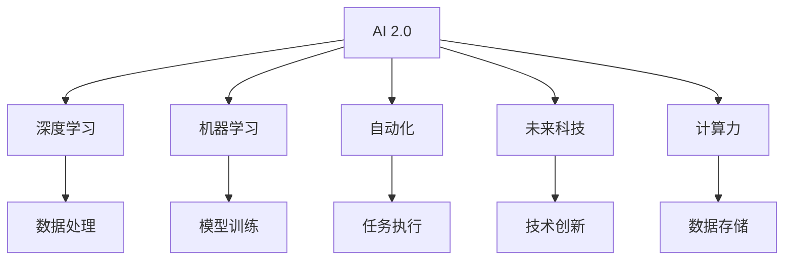

                 

# 李开复：AI 2.0 时代的意义

> 关键词：人工智能, AI 2.0, 深度学习, 机器学习, 自动化, 未来科技, 计算力

## 1. 背景介绍

### 1.1 问题由来
随着人工智能技术的飞速发展，AI 2.0时代已然到来。这一时代的核心特征是人工智能技术从研究实验室走向实际应用，从专有领域拓展至各个行业。在AI 2.0时代，AI技术正以前所未有的速度和规模，改变着人们的生活、工作和思维方式。

AI 2.0时代的意义，在于它不仅极大地提升了计算力和数据处理能力，还通过深度学习和机器学习等技术，解锁了前所未有的应用可能性。AI 2.0时代，人工智能已经不仅仅是科学研究的前沿领域，更是正在全面渗透到各个行业，成为推动社会进步和经济发展的重要力量。

### 1.2 问题核心关键点
AI 2.0时代的核心在于其“以人工智能为中心”的新商业模式。这一时代，人工智能技术的广泛应用将显著提高生产效率，降低运营成本，提升用户体验，同时也带来了数据隐私、伦理道德等方面的新挑战。

AI 2.0时代的意义在于：

- **生产力的全面提升**：AI技术的应用将极大提升各行各业的效率，从制造到服务，从零售到医疗，AI技术正在改变传统的生产方式和商业模式。
- **数据驱动的决策**：AI 2.0时代，数据成为决策的基石，通过大数据分析和机器学习，企业能够更加精准地预测市场趋势，优化决策过程。
- **个性化体验的提升**：基于用户行为和偏好的数据分析，AI能够提供高度个性化的产品和服务，极大地提升用户体验。
- **智能化管理的普及**：AI技术使得智能化的管理和运营成为可能，从智能客服到智能监控，AI正在全面渗透到企业管理和运营中。

### 1.3 问题研究意义
理解AI 2.0时代的意义，有助于我们更好地把握人工智能技术的发展趋势，预见其带来的机遇与挑战，从而在未来的竞争中占据先机。AI 2.0时代，我们不仅需要掌握先进的AI技术，还需要对其社会、经济、伦理等各方面影响有全面认识，确保技术的发展方向符合人类社会的整体利益。

## 2. 核心概念与联系

### 2.1 核心概念概述

为更好地理解AI 2.0时代的意义，本节将介绍几个关键核心概念：

- **AI 2.0**：指人工智能技术从理论研究走向实际应用，广泛应用于各行各业的时代。其核心特征是技术的应用化和普及化。
- **深度学习**：一种机器学习方法，通过多层次神经网络对数据进行抽象和学习，能够处理大量复杂数据，实现高度自动化的决策。
- **机器学习**：通过算法使机器能够从数据中学习，并通过数据不断优化算法，实现自主决策和适应性提升。
- **自动化**：利用AI技术，实现任务的自动完成，提高工作效率，减少人为错误。
- **未来科技**：AI 2.0时代的技术创新，如量子计算、边缘计算、自动驾驶等，正在改变我们对未来科技的认知。
- **计算力**：数据处理和计算的能力，是AI 2.0时代技术应用的基础。

这些概念之间的逻辑关系可以通过以下Mermaid流程图来展示：



这个流程图展示出AI 2.0时代各个核心概念之间的联系：

1. AI 2.0是AI技术应用的全面普及。
2. 深度学习和机器学习是AI 2.0时代技术的重要支柱。
3. 自动化和未来科技是AI 2.0时代的应用成果。
4. 计算力是AI 2.0时代技术应用的基础。

这些概念共同构成了AI 2.0时代的全景，揭示了技术发展和社会进步之间的内在联系。

## 3. 核心算法原理 & 具体操作步骤
### 3.1 算法原理概述

AI 2.0时代的核心算法原理，主要基于深度学习和机器学习。其核心思想是通过构建多层次神经网络，对大规模数据进行抽象和学习，从而实现高度自动化的决策和预测。

形式化地，设输入数据为 $X$，目标输出为 $Y$，深度学习模型 $f_{\theta}$ 通过训练参数 $\theta$ 最小化损失函数 $\mathcal{L}$，使模型输出尽可能接近真实标签。具体过程如下：

$$
\theta^* = \mathop{\arg\min}_{\theta} \mathcal{L}(f_{\theta}(X), Y)
$$

其中 $\mathcal{L}$ 为常用的交叉熵损失函数，用于衡量模型预测输出与真实标签之间的差异。

### 3.2 算法步骤详解

AI 2.0时代的深度学习模型训练和微调通常包括以下关键步骤：

**Step 1: 数据准备**
- 收集和整理数据集，划分为训练集、验证集和测试集。
- 对数据进行预处理，如数据清洗、归一化、特征工程等。

**Step 2: 模型构建**
- 选择或设计合适的深度学习模型架构，如卷积神经网络(CNN)、循环神经网络(RNN)、Transformer等。
- 根据具体任务，设定模型的输入输出形式。

**Step 3: 模型训练**
- 使用优化算法（如Adam、SGD等）对模型参数进行优化，最小化损失函数。
- 使用正则化技术（如L2正则、Dropout等）防止过拟合。
- 使用数据增强（如数据扩充、数据旋转等）增加数据多样性。

**Step 4: 模型验证与测试**
- 在验证集上评估模型性能，调整超参数和模型架构。
- 在测试集上对模型进行最终评估，输出性能指标（如准确率、召回率、F1分数等）。

**Step 5: 模型部署与优化**
- 将训练好的模型部署到实际应用中。
- 持续收集新数据，定期重新训练模型以提升性能。

### 3.3 算法优缺点

AI 2.0时代的深度学习算法具有以下优点：

- **高效性**：通过大规模并行计算，深度学习模型能够快速处理大量数据，实现高效的自动化决策。
- **鲁棒性**：深度学习模型在面对噪声数据和异常情况时，具有较强的鲁棒性，能够自动学习数据中的模式和规律。
- **适应性**：深度学习模型可以通过微调等方式，适应不同领域和任务，实现跨领域的应用。

然而，深度学习算法也存在一些局限性：

- **数据依赖**：深度学习模型对标注数据依赖较强，数据质量和数量对模型性能有重要影响。
- **可解释性不足**：深度学习模型作为"黑盒"，难以解释其内部工作机制和决策逻辑，不利于应用在需要高度透明性和可解释性的领域。
- **资源消耗高**：深度学习模型通常需要高性能计算资源，如GPU、TPU等，增加了应用成本。

### 3.4 算法应用领域

AI 2.0时代的深度学习算法，已经在众多领域得到广泛应用，例如：

- **医疗健康**：通过深度学习模型，实现疾病预测、影像分析、药物研发等应用，提升医疗服务的精准度和效率。
- **金融服务**：应用于股票交易、风险管理、反欺诈检测等领域，提升金融服务的自动化和智能化水平。
- **自动驾驶**：通过深度学习技术，实现自动驾驶汽车的感知、决策和控制，推动汽车行业向智能化方向发展。
- **智能制造**：应用于生产线监控、故障预测、质量控制等领域，提高制造业的自动化和智能化水平。
- **自然语言处理**：应用于机器翻译、情感分析、问答系统等领域，提升自然语言理解和处理的能力。

除了这些经典应用外，深度学习技术还在智能推荐、内容生成、图像识别、语音识别等众多领域取得突破性进展，推动了人工智能技术的应用广度和深度。

## 4. 数学模型和公式 & 详细讲解 & 举例说明

### 4.1 数学模型构建

深度学习模型的数学模型通常基于神经网络架构。这里以卷积神经网络(CNN)为例，构建一个简单的图像分类模型。

设输入数据为 $x$，网络输出为 $y$，模型参数为 $\theta$，卷积层、池化层、全连接层等组成的网络结构为 $f_{\theta}(x)$。模型在训练集上最小化交叉熵损失函数：

$$
\mathcal{L}(f_{\theta}(x), y) = -\frac{1}{N} \sum_{i=1}^N \log f_{\theta}(x_i)
$$

其中 $N$ 为样本数量。模型的优化目标是最小化经验风险：

$$
\theta^* = \mathop{\arg\min}_{\theta} \mathcal{L}(f_{\theta}(X), Y)
$$

### 4.2 公式推导过程

以下以简单的卷积神经网络为例，推导其训练和推理过程的数学公式。

设输入数据为 $x$，卷积层输出的特征图为 $f_1(x)$，池化层输出的特征图为 $f_2(x)$，全连接层输出的特征向量为 $f_3(x)$，输出层输出的概率分布为 $y = f_4(f_3(x))$。设损失函数为交叉熵损失：

$$
\mathcal{L}(f_{\theta}(x), y) = -\frac{1}{N} \sum_{i=1}^N \log f_{\theta}(x_i)
$$

其中 $\theta$ 为网络参数。前向传播过程如下：

$$
f_1(x) = \sigma(\mathcal{C}(x; \theta_1))
$$

$$
f_2(x) = \max_{i=1}^k f_1(x; i)
$$

$$
f_3(x) = \mathcal{F}(f_2(x); \theta_2)
$$

$$
y = f_4(f_3(x); \theta_3)
$$

其中 $\sigma$ 为激活函数，$\mathcal{C}$ 为卷积操作，$\mathcal{F}$ 为全连接操作。

通过链式法则，损失函数对参数 $\theta$ 的梯度为：

$$
\frac{\partial \mathcal{L}}{\partial \theta_k} = \frac{\partial f_4(f_3(x); \theta_3)}{\partial f_3(x)} \cdot \frac{\partial f_3(x)}{\partial \theta_2} \cdot \frac{\partial \mathcal{F}(f_2(x); \theta_2)}{\partial f_2(x)} \cdot \frac{\partial f_2(x)}{\partial f_1(x)} \cdot \frac{\partial \mathcal{C}(x; \theta_1)}{\partial x}
$$

通过反向传播算法，将梯度逐层反向传递，更新模型参数。

### 4.3 案例分析与讲解

以下以图像分类任务为例，分析深度学习模型的训练和推理过程。

设输入图像 $x$ 为 $64 \times 64$ 像素的彩色图片，输出为 $10$ 个类别的概率分布。模型结构如下：


具体步骤如下：

1. 使用卷积层对输入图像进行特征提取，生成 $64 \times 64 \times 64$ 的特征图 $f_1(x)$。
2. 使用池化层对特征图进行下采样，生成 $32 \times 32 \times 64$ 的特征图 $f_2(x)$。
3. 将池化后的特征图展开成一维向量，输入到全连接层进行分类，生成 $10$ 个类别的概率分布 $y$。
4. 使用交叉熵损失函数对模型输出和真实标签进行比较，计算损失值。
5. 通过反向传播算法更新模型参数。

以上步骤可以重复多次，直至模型收敛，得到最优的参数 $\theta^*$。在测试集上，将新的输入图像 $x$ 送入模型，得到概率分布 $y$，选择概率最大的类别作为预测结果。

## 5. 项目实践：代码实例和详细解释说明

### 5.1 开发环境搭建

在进行深度学习项目开发前，我们需要准备好开发环境。以下是使用Python进行TensorFlow开发的环境配置流程：

1. 安装Anaconda：从官网下载并安装Anaconda，用于创建独立的Python环境。

2. 创建并激活虚拟环境：
```bash
conda create -n tf-env python=3.8 
conda activate tf-env
```

3. 安装TensorFlow：根据CUDA版本，从官网获取对应的安装命令。例如：
```bash
pip install tensorflow tensorflow-gpu==2.8.0
```

4. 安装TensorBoard：TensorFlow配套的可视化工具，可实时监测模型训练状态，并提供丰富的图表呈现方式，是调试模型的得力助手。

5. 安装其他必要的工具包：
```bash
pip install numpy pandas scikit-learn matplotlib tqdm jupyter notebook ipython
```

完成上述步骤后，即可在`tf-env`环境中开始深度学习项目的开发。

### 5.2 源代码详细实现

下面以图像分类任务为例，给出使用TensorFlow进行卷积神经网络训练的Python代码实现。

首先，定义数据集和数据预处理函数：

```python
import tensorflow as tf
from tensorflow.keras.datasets import mnist
from tensorflow.keras.preprocessing.image import ImageDataGenerator

(x_train, y_train), (x_test, y_test) = mnist.load_data()

# 数据预处理
x_train = x_train.reshape(x_train.shape[0], 28, 28, 1).astype('float32') / 255
x_test = x_test.reshape(x_test.shape[0], 28, 28, 1).astype('float32') / 255
```

然后，定义卷积神经网络模型：

```python
from tensorflow.keras.models import Sequential
from tensorflow.keras.layers import Conv2D, MaxPooling2D, Flatten, Dense

model = Sequential()
model.add(Conv2D(32, (3, 3), activation='relu', input_shape=(28, 28, 1)))
model.add(MaxPooling2D((2, 2)))
model.add(Conv2D(64, (3, 3), activation='relu'))
model.add(MaxPooling2D((2, 2)))
model.add(Conv2D(64, (3, 3), activation='relu'))
model.add(Flatten())
model.add(Dense(64, activation='relu'))
model.add(Dense(10, activation='softmax'))

# 编译模型
model.compile(optimizer='adam', loss='sparse_categorical_crossentropy', metrics=['accuracy'])
```

接着，定义训练和评估函数：

```python
batch_size = 64

# 训练函数
def train_epoch(model, data, batch_size):
    model.fit_generator(data, steps_per_epoch=len(data), epochs=10, verbose=1)
    
# 评估函数
def evaluate(model, data, batch_size):
    score = model.evaluate_generator(data, steps=len(data))
    print('Test loss:', score[0])
    print('Test accuracy:', score[1])
```

最后，启动训练流程并在测试集上评估：

```python
train_epoch(model, train_data, batch_size)
evaluate(model, test_data, batch_size)
```

以上就是使用TensorFlow进行卷积神经网络训练的完整代码实现。可以看到，TensorFlow的Keras API使得模型的定义和训练过程非常简洁高效，大大降低了深度学习的开发难度。

### 5.3 代码解读与分析

让我们再详细解读一下关键代码的实现细节：

**CNN模型定义**：
- 使用Sequential模型定义卷积神经网络，依次添加卷积层、池化层和全连接层。
- 卷积层使用32、64个过滤器，大小为3x3，激活函数为ReLU。
- 池化层使用2x2大小，下采样比例为2。
- 全连接层使用64个神经元，激活函数为ReLU。
- 输出层使用10个神经元，激活函数为Softmax，对应10个类别。

**训练和评估函数**：
- 使用fit_generator函数对模型进行训练，每次迭代64个样本。
- 在每个epoch结束时，使用evaluate_generator函数在测试集上评估模型性能。
- 训练和评估过程可以通过TensorBoard进行可视化，监控训练过程中的各项指标。

**训练流程**：
- 定义总epoch数，开始循环迭代
- 每个epoch内，先进行训练，输出损失和准确率
- 在测试集上评估模型性能，打印测试结果

可以看到，TensorFlow的Keras API使得深度学习模型的开发变得异常便捷。开发者可以快速定义模型、编译模型、进行训练和评估，而无需深入底层实现细节。

当然，工业级的系统实现还需考虑更多因素，如模型的保存和部署、超参数的自动搜索、更灵活的任务适配层等。但核心的深度学习范式基本与此类似。

## 6. 实际应用场景
### 6.1 医疗健康

在医疗健康领域，深度学习模型可以应用于疾病预测、影像分析、药物研发等应用，提升医疗服务的精准度和效率。

具体而言，深度学习模型可以从电子病历、医学影像、基因数据中提取信息，进行疾病预测和诊断。例如，通过分析影像数据，识别肿瘤、心脏病等疾病，并提供治疗建议。同时，深度学习模型还可以从基因数据中挖掘基因表达谱，预测疾病易感性，辅助个性化医疗。

### 6.2 金融服务

在金融服务领域，深度学习模型可以应用于股票交易、风险管理、反欺诈检测等领域，提升金融服务的自动化和智能化水平。

例如，通过分析历史交易数据和市场趋势，深度学习模型可以预测股票价格走势，提供投资建议。同时，通过分析客户行为和交易记录，深度学习模型可以识别异常交易行为，预防金融欺诈。此外，深度学习模型还可以应用于信贷评估、信用风险管理等领域，提升金融服务的决策精准度。

### 6.3 自动驾驶

在自动驾驶领域，深度学习技术可以实现自动驾驶汽车的感知、决策和控制，推动汽车行业向智能化方向发展。

具体而言，深度学习模型可以从摄像头、雷达、激光雷达等传感器获取实时数据，进行场景理解和行为预测。例如，通过分析摄像头图像，识别交通标志、行人和其他车辆，提供驾驶决策。同时，深度学习模型还可以从传感器数据中提取信息，实现车辆控制和路径规划。

### 6.4 智能制造

在智能制造领域，深度学习模型可以应用于生产线监控、故障预测、质量控制等领域，提高制造业的自动化和智能化水平。

例如，通过分析生产数据和设备状态，深度学习模型可以预测设备故障，提前进行维护，降低生产成本。同时，深度学习模型还可以分析产品检测数据，提高产品质量控制。此外，深度学习模型还可以应用于供应链优化、库存管理等领域，提升制造业的效率和灵活性。

### 6.5 未来应用展望

随着深度学习技术的发展，AI 2.0时代的应用场景将更加广泛，未来的技术创新也将带来更多新的应用方向。

- **智能城市**：深度学习技术可以应用于智能交通、智能安防、智能环保等领域，提升城市管理的智能化水平。
- **智慧教育**：深度学习技术可以应用于智能教学、智能评估、智能推荐等领域，提升教育服务的个性化和智能化水平。
- **智能农业**：深度学习技术可以应用于智能种植、智能农机、智能灌溉等领域，提升农业生产的效率和精准度。

总之，深度学习技术的应用前景广阔，将深刻影响各行各业的未来发展。未来，随着技术的进一步突破和应用落地，深度学习将为人类社会带来更加深刻的变革。

## 7. 工具和资源推荐
### 7.1 学习资源推荐

为了帮助开发者系统掌握深度学习理论基础和实践技巧，这里推荐一些优质的学习资源：

1. **深度学习入门书籍**：《深度学习》（Ian Goodfellow等著）是深度学习领域的经典教材，详细介绍了深度学习的理论基础和实际应用。
2. **在线课程**：Coursera和edX等在线学习平台提供多门深度学习课程，涵盖从基础到高级的内容，适合不同层次的学习者。
3. **技术博客**：如DeepMind博客、OpenAI博客、Kaggle等，提供最新的研究进展和技术分享，是学习深度学习的重要资源。
4. **开源框架**：如TensorFlow、PyTorch、Keras等，提供丰富的深度学习模型和工具，方便快速开发和实验。

通过这些资源的学习实践，相信你一定能够快速掌握深度学习技术的精髓，并用于解决实际的NLP问题。

### 7.2 开发工具推荐

高效的开发离不开优秀的工具支持。以下是几款用于深度学习开发的常用工具：

1. **PyTorch**：基于Python的开源深度学习框架，灵活的计算图，适合快速迭代研究。
2. **TensorFlow**：由Google主导开发的深度学习框架，生产部署方便，适合大规模工程应用。
3. **Keras**：高层次的深度学习API，支持多种后端引擎，易于上手和使用。
4. **Jupyter Notebook**：交互式的编程环境，方便编写和调试代码。
5. **TensorBoard**：TensorFlow配套的可视化工具，可实时监测模型训练状态，提供丰富的图表呈现方式。

合理利用这些工具，可以显著提升深度学习开发的效率，加快创新迭代的步伐。

### 7.3 相关论文推荐

深度学习技术的快速发展离不开学界的持续研究。以下是几篇奠基性的相关论文，推荐阅读：

1. **AlexNet**：Hinton等人在2012年提出的卷积神经网络，开创了深度学习在大规模视觉识别任务上的应用。
2. **ResNet**：He等人在2015年提出的残差网络，解决了深度网络训练中的梯度消失问题，大幅提升了深度神经网络的深度和精度。
3. **AlphaGo**：DeepMind团队在2016年提出的深度学习模型，应用于围棋对弈，取得超人类水平的成绩，展示了深度学习在复杂决策问题上的潜力。
4. **GAN**：Goodfellow等人在2014年提出的生成对抗网络，用于生成具有真实感的图像和视频，推动了计算机视觉和生成模型的发展。
5. **BERT**：Devlin等人在2018年提出的语言预训练模型，在大规模语言理解任务上取得显著成效，推动了自然语言处理领域的发展。

这些论文代表了深度学习技术的发展脉络。通过学习这些前沿成果，可以帮助研究者把握学科前进方向，激发更多的创新灵感。

## 8. 总结：未来发展趋势与挑战

### 8.1 总结

本文对AI 2.0时代的深度学习技术进行了全面系统的介绍。首先阐述了深度学习在AI 2.0时代的重要地位，明确了其推动技术应用和产业化进程的核心价值。其次，从原理到实践，详细讲解了深度学习的数学模型和算法步骤，给出了深度学习任务开发的完整代码实例。同时，本文还探讨了深度学习在医疗健康、金融服务、自动驾驶等众多领域的应用前景，展示了深度学习技术的前景和潜力。最后，本文精选了深度学习的学习资源、开发工具和相关论文，力求为读者提供全方位的技术指引。

通过本文的系统梳理，可以看到，深度学习技术在AI 2.0时代具有广阔的应用前景，正在全面渗透到各行各业，成为推动社会进步和经济发展的强大引擎。

### 8.2 未来发展趋势

展望未来，深度学习技术将继续发展，呈现出以下几个趋势：

1. **模型规模持续增大**：随着算力成本的下降和数据规模的扩张，深度学习模型的参数量还将持续增长。超大规模深度学习模型蕴含的丰富特征表示，将进一步提升模型的性能和应用范围。
2. **算法多样化和高效化**：未来的深度学习算法将更加多样化和高效化。除了传统的卷积神经网络、循环神经网络外，将涌现更多高效的新算法，如Transformer、ResNet等，提升深度学习模型的计算效率和精度。
3. **跨领域应用广泛**：深度学习技术将继续拓展到各个领域，从医疗、金融到自动驾驶、智能制造，深度学习将成为各行各业的“通用工具”。
4. **可解释性和透明性提升**：未来的深度学习模型将更加注重可解释性和透明性，通过引入因果分析、解释性模型等技术，提升模型的可解释性和可信度。
5. **伦理和社会责任**：深度学习技术的发展将更加注重伦理和社会责任，通过引入公平性、可解释性等指标，确保技术应用符合人类价值观和伦理道德。

这些趋势凸显了深度学习技术的强大潜力和广泛应用前景，必将深刻影响人类社会的未来发展。

### 8.3 面临的挑战

尽管深度学习技术取得了显著成果，但在迈向更加智能化、普适化应用的过程中，仍面临诸多挑战：

1. **数据隐私和安全**：深度学习模型需要大量标注数据进行训练，数据隐私和安全问题不容忽视。如何在数据使用和处理过程中确保用户隐私，避免数据泄露和滥用，需要更多技术手段和安全措施。
2. **公平性和偏见**：深度学习模型可能存在偏见，影响决策的公平性。如何在训练和应用过程中消除偏见，确保模型决策的公正性和透明性，还需要更多技术手段和社会监督。
3. **计算资源需求**：深度学习模型需要高性能计算资源，如何在降低计算成本的同时，提升模型性能，还需要更多技术手段和算法创新。
4. **模型鲁棒性和泛化能力**：深度学习模型在面对噪声数据和异常情况时，鲁棒性有待提升。如何在训练和应用过程中增强模型的鲁棒性和泛化能力，需要更多技术手段和模型改进。
5. **模型复杂性和可解释性**：深度学习模型往往具有复杂的结构和参数，难以解释其内部工作机制和决策逻辑。如何在提升模型复杂性的同时，提升模型的可解释性和透明性，还需要更多技术手段和方法创新。

### 8.4 研究展望

面对深度学习技术所面临的挑战，未来的研究需要在以下几个方面寻求新的突破：

1. **无监督和半监督学习**：探索无监督和半监督学习方法，摆脱对大规模标注数据的依赖，利用自监督学习、主动学习等技术，最大限度利用非结构化数据，实现更加灵活高效的深度学习模型。
2. **跨领域迁移学习**：研究跨领域迁移学习技术，实现深度学习模型在多个领域之间的知识共享和迁移，提升模型的泛化能力和应用范围。
3. **模型压缩和优化**：开发模型压缩和优化技术，减小深度学习模型的规模和计算成本，提升模型的实时性和可部署性。
4. **因果分析和解释性**：引入因果分析方法和解释性模型，增强深度学习模型的可解释性和透明性，提升模型的可信度和公正性。
5. **公平性和伦理约束**：在深度学习模型的训练和应用过程中，引入公平性和伦理约束指标，确保技术应用符合人类价值观和伦理道德。

这些研究方向将引领深度学习技术迈向更高的台阶，为构建安全、可靠、可解释、可控的智能系统铺平道路。

## 9. 附录：常见问题与解答

**Q1：深度学习技术是否适用于所有NLP任务？**

A: 深度学习技术在大多数NLP任务上都能取得不错的效果，特别是对于数据量较大的任务。但对于一些特定领域的任务，如医学、法律等，仅仅依靠通用语料预训练的模型可能难以很好地适应。此时需要在特定领域语料上进一步预训练，再进行微调，才能获得理想效果。

**Q2：深度学习模型在实际应用中如何防止过拟合？**

A: 防止过拟合是深度学习模型训练过程中的一项重要任务。常见的缓解策略包括：
1. 数据增强：通过回译、近义替换等方式扩充训练集
2. 正则化：使用L2正则、Dropout等防止过拟合
3. 对抗训练：引入对抗样本，提高模型鲁棒性
4. 参数高效微调：只调整少量参数(如Adapter、Prefix等)，减小过拟合风险
5. 多模型集成：训练多个深度学习模型，取平均输出，抑制过拟合

这些策略往往需要根据具体任务和数据特点进行灵活组合。只有在数据、模型、训练、推理等各环节进行全面优化，才能最大限度地发挥深度学习模型的性能。

**Q3：深度学习模型在实际部署时需要注意哪些问题？**

A: 将深度学习模型转化为实际应用，还需要考虑以下因素：
1. 模型裁剪：去除不必要的层和参数，减小模型尺寸，加快推理速度
2. 量化加速：将浮点模型转为定点模型，压缩存储空间，提高计算效率
3. 服务化封装：将模型封装为标准化服务接口，便于集成调用
4. 弹性伸缩：根据请求流量动态调整资源配置，平衡服务质量和成本
5. 监控告警：实时采集系统指标，设置异常告警阈值，确保服务稳定性
6. 安全防护：采用访问鉴权、数据脱敏等措施，保障数据和模型安全

深度学习模型微调为NLP应用开启了广阔的想象空间，但如何将强大的性能转化为稳定、高效、安全的业务价值，还需要工程实践的不断打磨。唯有从数据、算法、工程、业务等多个维度协同发力，才能真正实现人工智能技术在垂直行业的规模化落地。总之，深度学习需要开发者根据具体任务，不断迭代和优化模型、数据和算法，方能得到理想的效果。

---

作者：禅与计算机程序设计艺术 / Zen and the Art of Computer Programming

