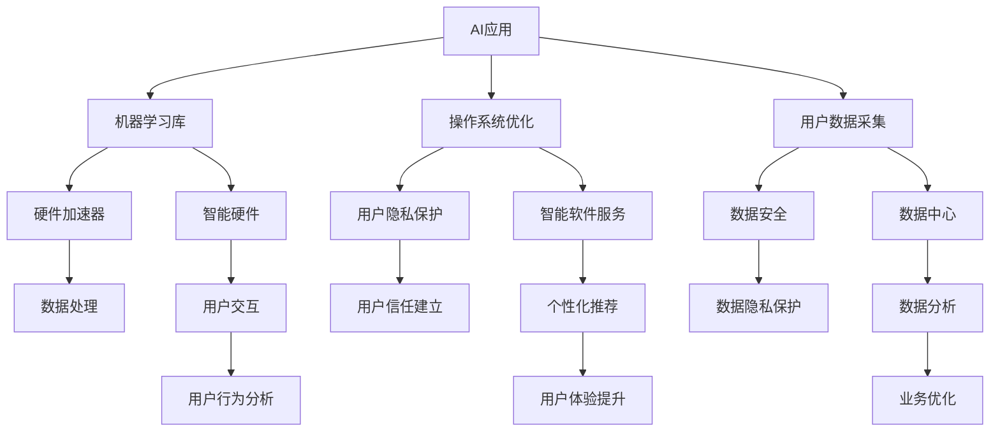

                 

# 李开复：苹果发布AI应用的市场

在科技与人工智能的世界里，每一场变革都孕育着无限可能。苹果（Apple）作为全球科技巨头，其最新的AI应用不仅预示着行业发展的趋势，更激发了人们对AI与日常生活的深度融合的想象。本文将从市场角度，深入探讨苹果发布AI应用背后的商业逻辑与技术原理，旨在揭示AI技术赋能未来的无限潜力。

## 1. 背景介绍

### 1.1 苹果的AI战略

苹果自2017年起，就开始布局AI战略。从最初的机器学习（Machine Learning）工具库——Metal，到如今的M1芯片、Apple Neural Engine（ANE）、Siri，苹果在AI技术的各个环节都做到了深耕细作。2021年，苹果发布了其首款AI专用芯片M1 Pro，这不仅彰显了苹果在硬件领域的投入，更是为其AI应用打下了坚实的硬件基础。

苹果的AI战略可以分为两个阶段：
1. **基础设施建设**：包括机器学习库、硬件加速器、操作系统优化等，为AI应用落地提供坚实的基础设施。
2. **核心应用推广**：推出如Siri、Facetime、iCloud等基于AI的典型应用，提升用户体验。

### 1.2 市场现状

全球AI市场持续高速增长，预计2025年将达到3820亿美元。在此背景下，苹果的AI应用不仅拓展了其硬件生态系统，也为其软件服务和硬件产品增添了新的增长点。

AI应用市场主要有以下特点：
- **智能硬件**：智能音箱、智能穿戴设备等。
- **软件服务**：智能客服、智能推荐、自然语言处理等。
- **垂直领域**：医疗、金融、教育等特定行业的应用。

## 2. 核心概念与联系

### 2.1 核心概念概述

为了深入理解苹果的AI应用市场策略，首先需要澄清几个关键概念：

- **人工智能（AI）**：指由人制造的机器所展现的智能。
- **机器学习（ML）**：指让机器从数据中学习模式，并应用这些模式进行预测或决策。
- **深度学习（DL）**：一种机器学习技术，使用深层神经网络进行数据处理和分析。
- **自然语言处理（NLP）**：指使计算机能够理解和处理人类语言的AI技术。
- **计算机视觉（CV）**：指让计算机“看”和理解图像和视频的技术。

### 2.2 核心概念联系

以下Mermaid流程图展示了苹果AI应用生态系统的核心概念及其联系：



这个流程图展示了苹果AI应用生态系统的核心概念及其相互关系：
1. **机器学习库（B）**：为AI应用提供算法支持。
2. **智能硬件（C）**：基于AI技术开发的智能产品。
3. **操作系统优化（D）**：优化操作系统的性能，提升AI应用的运行效率。
4. **智能软件服务（E）**：基于AI的个性化推荐、智能客服等服务。
5. **用户数据采集（F）**：收集用户数据，用于训练AI模型。
6. **数据中心（G）**：处理和存储海量用户数据，支持AI模型训练和应用。
7. **硬件加速器（H）**：提升数据处理效率，减少AI应用的延迟。
8. **用户交互（J）**：通过用户与AI应用的交互，优化AI模型的训练和应用。
9. **用户行为分析（K）**：通过分析用户行为，提升AI应用的个性化推荐和服务。
10. **用户隐私保护（L）**：确保用户数据的安全和隐私。
11. **个性化推荐（N）**：基于用户行为数据，提供定制化的推荐。
12. **用户体验提升（O）**：通过AI技术提升用户交互体验。
13. **数据安全（P）**：保护用户数据，防止数据泄露。
14. **数据分析（R）**：通过数据驱动决策，优化业务流程。

### 2.3 核心算法原理

苹果的AI应用主要依赖深度学习和强化学习技术。深度学习通过多层神经网络进行复杂数据处理和模式识别，而强化学习通过智能体（Agent）与环境交互，学习最优策略，以实现特定目标。

## 3. 核心算法原理 & 具体操作步骤

### 3.1 算法原理概述

苹果的AI应用算法主要包含以下几个步骤：

1. **数据收集**：通过智能硬件、应用程序收集用户数据。
2. **数据预处理**：清洗、归一化、降维等预处理步骤，准备用于模型训练的数据。
3. **模型训练**：使用深度学习或强化学习算法训练模型，得到最优参数。
4. **模型部署**：将训练好的模型部署到智能硬件或软件中，实现实时预测或决策。
5. **效果评估**：通过指标（如准确率、召回率、F1值等）评估模型效果，不断优化模型。

### 3.2 算法步骤详解

**数据收集**：
1. **智能硬件**：如iPhone X的Face ID、Apple Watch的Siri。
2. **应用程序**：如Siri、Facetime、Apple News。

**数据预处理**：
1. **数据清洗**：去除噪声和异常值，保证数据质量。
2. **数据归一化**：将数据转化为标准形式，便于模型训练。
3. **特征工程**：选择和构造模型需要的特征。

**模型训练**：
1. **深度学习**：使用TensorFlow、PyTorch等框架进行模型训练。
2. **强化学习**：通过Q-learning、SARSA等算法训练智能体。

**模型部署**：
1. **智能硬件**：如M1芯片、ANE，提升模型推理效率。
2. **软件应用**：如Siri、Facetime，提供实时服务。

**效果评估**：
1. **准确率**：模型预测的正确率。
2. **召回率**：实际正样本中被正确预测为正样本的比例。
3. **F1值**：综合考虑准确率和召回率的指标。

### 3.3 算法优缺点

**优点**：
1. **高效处理复杂数据**：深度学习和强化学习算法可以处理大规模、复杂的数据。
2. **实时服务**：智能硬件和优化后的操作系统支持实时数据处理和模型推理。
3. **用户隐私保护**：通过本地数据处理和加密技术，确保用户数据安全。

**缺点**：
1. **数据隐私问题**：大量用户数据采集和使用可能导致隐私泄露。
2. **模型可解释性**：深度学习模型通常“黑盒”，难以解释内部决策逻辑。
3. **计算资源需求高**：深度学习和强化学习算法计算量大，对硬件和算力要求高。

### 3.4 算法应用领域

苹果的AI应用涵盖多个领域，包括智能硬件、智能软件服务、个性化推荐等。以下是几个典型应用：

**智能硬件**：
- **Face ID**：使用深度学习进行人脸识别，实现安全的解锁和支付功能。
- **Apple Watch的Siri**：通过语音识别和自然语言处理，提供智能助手服务。

**智能软件服务**：
- **Siri**：通过自然语言处理和语音识别，实现语音助手功能。
- **Apple News**：通过推荐算法，个性化推荐新闻内容。

**个性化推荐**：
- **Facetime**：通过分析用户行为和偏好，推荐特定的视频和内容。

## 4. 数学模型和公式 & 详细讲解 & 举例说明

### 4.1 数学模型构建

苹果的AI应用依赖深度学习算法，常用的模型包括卷积神经网络（CNN）和循环神经网络（RNN）。

**CNN模型**：
- **输入**：图像数据，如像素值。
- **输出**：分类结果，如物体类别。

**RNN模型**：
- **输入**：时间序列数据，如语音信号。
- **输出**：序列预测结果，如文本生成、语音识别。

### 4.2 公式推导过程

**卷积神经网络（CNN）**：
$$
y = \sigma(Wx + b)
$$
- $W$：权重矩阵。
- $b$：偏置向量。
- $\sigma$：激活函数。

**循环神经网络（RNN）**：
$$
h_t = f(W_h h_{t-1} + W_x x_t + b)
$$
- $h_t$：隐藏层状态。
- $f$：激活函数。
- $x_t$：输入。

### 4.3 案例分析与讲解

以Siri的语音识别为例，通过卷积神经网络和循环神经网络，Siri能够准确识别用户的语音指令，并作出相应的回应。具体步骤如下：
1. **语音采集**：用户通过麦克风输入语音指令。
2. **预处理**：将语音信号转化为特征向量。
3. **卷积神经网络**：通过多层的卷积层和池化层，提取语音特征。
4. **循环神经网络**：通过循环层处理序列特征，进行时间步的动态更新。
5. **全连接层**：将特征向量转化为分类结果。

## 5. 项目实践：代码实例和详细解释说明

### 5.1 开发环境搭建

要开发苹果的AI应用，首先需要搭建开发环境。

1. **安装Python**：从官网下载并安装最新版本的Python。
2. **安装深度学习框架**：如TensorFlow、PyTorch、Keras等。
3. **安装智能硬件开发工具**：如Xcode、Android Studio等。

### 5.2 源代码详细实现

以下是一个基于TensorFlow的语音识别代码示例：

```python
import tensorflow as tf
from tensorflow.keras import layers

# 定义模型
model = tf.keras.Sequential([
    layers.Conv2D(32, (3, 3), activation='relu', input_shape=(32, 32, 3)),
    layers.MaxPooling2D((2, 2)),
    layers.Flatten(),
    layers.Dense(10, activation='softmax')
])

# 编译模型
model.compile(optimizer='adam',
              loss='sparse_categorical_crossentropy',
              metrics=['accuracy'])

# 训练模型
model.fit(train_data, train_labels, epochs=10, validation_data=(test_data, test_labels))
```

### 5.3 代码解读与分析

这段代码实现了一个简单的卷积神经网络模型，用于语音识别任务。具体步骤如下：
1. **定义模型**：包含卷积层、池化层、全连接层等。
2. **编译模型**：指定优化器、损失函数、评价指标。
3. **训练模型**：使用训练集进行模型训练，并在验证集上评估模型性能。

## 6. 实际应用场景

### 6.1 智能客服

苹果的智能客服应用通过深度学习和自然语言处理技术，能够快速响应用户的咨询请求，提升客服效率。具体实现步骤包括：
1. **数据收集**：通过智能客服系统收集用户咨询记录。
2. **数据预处理**：清洗、归一化用户文本数据。
3. **模型训练**：使用深度学习算法训练自然语言处理模型。
4. **模型部署**：将训练好的模型部署到智能客服系统，实现自动回复。

### 6.2 个性化推荐

苹果的个性化推荐应用通过深度学习算法，分析用户行为数据，提供个性化的内容和推荐。具体实现步骤包括：
1. **数据收集**：收集用户点击、浏览、购买等行为数据。
2. **数据预处理**：清洗、归一化数据，提取特征。
3. **模型训练**：使用深度学习算法训练推荐模型。
4. **模型部署**：将训练好的模型部署到App中，实时推荐内容。

### 6.3 可穿戴设备

苹果的可穿戴设备如Apple Watch，通过深度学习和计算机视觉技术，实现智能健康监测。具体实现步骤包括：
1. **数据收集**：通过可穿戴设备采集健康数据。
2. **数据预处理**：清洗、归一化数据，提取特征。
3. **模型训练**：使用深度学习算法训练健康监测模型。
4. **模型部署**：将训练好的模型部署到可穿戴设备中，实时监测健康状况。

## 7. 工具和资源推荐

### 7.1 学习资源推荐

- **Coursera**：提供深度学习、机器学习等课程。
- **Kaggle**：提供数据科学竞赛和教程。
- **Google AI**：提供深度学习、计算机视觉等领域的教程和资源。
- **GitHub**：提供深度学习框架和模型源码。

### 7.2 开发工具推荐

- **TensorFlow**：Google开源的深度学习框架，支持多种设备和平台。
- **PyTorch**：Facebook开源的深度学习框架，具有强大的动态图功能。
- **Xcode**：苹果官方的开发环境，支持Mac、iOS、watchOS等平台。

### 7.3 相关论文推荐

- **Deep Learning**：Ian Goodfellow等人著作的深度学习经典教材。
- **Pattern Recognition and Machine Learning**：Christopher Bishop的机器学习经典教材。
- **Reinforcement Learning**：Sutton和Barto的强化学习经典教材。

## 8. 总结：未来发展趋势与挑战

### 8.1 研究成果总结

苹果的AI应用已经取得显著的进展，但未来的发展仍面临诸多挑战。以下是几个关键的研究成果总结：
1. **深度学习算法**：如卷积神经网络、循环神经网络等，在图像、语音、文本等领域的广泛应用。
2. **强化学习**：通过智能体与环境的交互，学习最优策略，实现智能控制和决策。
3. **自然语言处理**：通过深度学习模型，实现文本生成、语音识别、情感分析等任务。

### 8.2 未来发展趋势

1. **智能硬件普及**：随着智能硬件的普及，AI应用将更加深入用户的生活和工作。
2. **跨平台集成**：通过API和SDK，实现跨平台、跨设备的AI应用集成。
3. **云计算支持**：利用云计算平台处理海量数据和模型推理，提升AI应用的实时性和可靠性。
4. **边缘计算**：通过边缘计算，实现本地数据处理和实时决策，降低网络延迟。

### 8.3 面临的挑战

1. **数据隐私**：大量用户数据采集和使用可能导致隐私泄露。
2. **模型可解释性**：深度学习模型通常“黑盒”，难以解释内部决策逻辑。
3. **计算资源需求**：深度学习和强化学习算法计算量大，对硬件和算力要求高。

### 8.4 研究展望

未来的AI应用将朝着更加智能、普适、安全的方向发展。以下研究展望值得关注：
1. **隐私保护技术**：通过差分隐私、联邦学习等技术，保护用户数据隐私。
2. **模型可解释性**：通过可解释性研究，提升AI模型的可解释性。
3. **计算资源优化**：通过硬件加速、模型压缩等技术，优化AI应用的计算资源消耗。

## 9. 附录：常见问题与解答

**Q1：苹果的AI应用市场策略是什么？**

A: 苹果的AI应用市场策略主要包括以下几个方面：
1. **基础设施建设**：如机器学习库、硬件加速器等，为AI应用落地提供坚实的基础。
2. **核心应用推广**：如Siri、Face ID、Apple News等，提升用户体验。
3. **跨平台集成**：通过API和SDK，实现跨平台、跨设备的AI应用集成。
4. **云计算支持**：利用云计算平台处理海量数据和模型推理，提升AI应用的实时性和可靠性。

**Q2：苹果的AI应用有哪些？**

A: 苹果的AI应用主要包括以下几个方面：
1. **智能硬件**：如Face ID、Apple Watch的Siri等。
2. **智能软件服务**：如Siri、Apple News等。
3. **个性化推荐**：如Facetime、Apple Music等。

**Q3：苹果的AI应用如何保护用户隐私？**

A: 苹果通过以下措施保护用户隐私：
1. **本地数据处理**：尽可能在本地处理数据，减少数据传输和存储。
2. **数据加密**：采用AES等加密算法，保护数据传输和存储安全。
3. **差分隐私**：使用差分隐私技术，确保用户数据在统计分析中的隐私保护。

**Q4：苹果的AI应用面临哪些挑战？**

A: 苹果的AI应用面临以下挑战：
1. **数据隐私**：大量用户数据采集和使用可能导致隐私泄露。
2. **模型可解释性**：深度学习模型通常“黑盒”，难以解释内部决策逻辑。
3. **计算资源需求**：深度学习和强化学习算法计算量大，对硬件和算力要求高。

**Q5：苹果的AI应用如何实现实时服务？**

A: 苹果通过以下措施实现实时服务：
1. **智能硬件**：如M1芯片、ANE，提升模型推理效率。
2. **优化操作系统**：通过操作系统优化，支持实时数据处理和模型推理。
3. **云服务支持**：利用云计算平台，处理海量数据和模型推理，提升AI应用的实时性和可靠性。

---

作者：禅与计算机程序设计艺术 / Zen and the Art of Computer Programming

