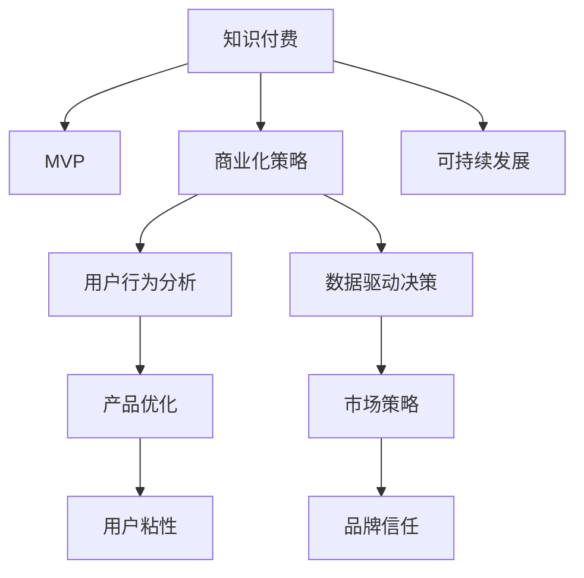

                 

# 构建知识付费MVP：快速验证商业模式

> 关键词：知识付费, MVP(最小可行产品), 产品验证, 商业化策略, 用户行为分析, 市场反馈, 数据驱动决策

## 1. 背景介绍

在数字化时代的浪潮中，知识付费已成为行业热点。一方面，海量知识的积累为知识传播提供了前所未有的便利；另一方面，知识的获取方式逐渐由免费转向付费，知识创造者得以通过付费模式获得合理的回报，从而推动知识生产和传播。然而，知识付费市场的激烈竞争也带来了新的挑战：如何设计合理的商业模式，如何挖掘核心价值，如何确保长期的可持续发展，这些问题始终困扰着行业从业者。本文旨在探讨构建知识付费MVP（Minimum Viable Product，最小可行产品）的思路和步骤，快速验证商业模式，找到可持续发展的道路。

### 1.1 问题由来

随着互联网技术的不断发展，知识付费形式日益多样化。从传统的线上订阅，到基于内容的单次购买，再到新兴的按需付费，知识付费市场正呈现出蓬勃发展的态势。然而，市场中各类平台层出不穷，内容同质化问题严重，用户粘性不足，盈利模式单一等问题亟需解决。如何在竞争激烈的市场中找到突破口，快速验证商业模式，构建用户粘性，实现可持续发展，成为知识付费行业的重要课题。

### 1.2 问题核心关键点

为更好地理解构建知识付费MVP的方法和路径，本节将介绍几个密切相关的核心概念：

- 最小可行产品(MVP)：在产品开发的早期阶段，以最低的成本快速实现产品基本功能的概念。MVP的目标是通过快速迭代，验证产品价值，为后续产品优化和商业化提供依据。
- 知识付费：基于知识产品（如课程、文章、音频等）的付费模式，通过为知识创造者提供合理的回报，推动高质量知识内容的生产。
- 商业化策略：通过设计和实施合理的商业模式，实现商业盈利和持续发展。包括产品定价、市场推广、渠道建设等策略。
- 用户行为分析：通过分析用户行为数据，了解用户需求和偏好，指导产品优化和市场策略调整。
- 数据驱动决策：利用数据和统计分析，在产品开发和市场推广中做出科学的决策。
- 可持续发展：在确保短期盈利的同时，建立用户粘性和品牌信任，实现长期发展。

这些核心概念之间的逻辑关系可以通过以下Mermaid流程图来展示：



这个流程图展示的知识付费MVP的构建流程：

1. 从知识付费的基本概念出发。
2. 设计并快速实现MVP，验证产品价值。
3. 通过用户行为分析和数据驱动决策，指导产品优化和市场策略调整。
4. 建立用户粘性和品牌信任，实现可持续发展。

## 2. 核心概念与联系

### 2.1 核心概念概述

为更好地理解构建知识付费MVP的方法和路径，本节将介绍几个密切相关的核心概念：

- 最小可行产品(MVP)：在产品开发的早期阶段，以最低的成本快速实现产品基本功能的概念。MVP的目标是通过快速迭代，验证产品价值，为后续产品优化和商业化提供依据。
- 知识付费：基于知识产品（如课程、文章、音频等）的付费模式，通过为知识创造者提供合理的回报，推动高质量知识内容的生产。
- 商业化策略：通过设计和实施合理的商业模式，实现商业盈利和持续发展。包括产品定价、市场推广、渠道建设等策略。
- 用户行为分析：通过分析用户行为数据，了解用户需求和偏好，指导产品优化和市场策略调整。
- 数据驱动决策：利用数据和统计分析，在产品开发和市场推广中做出科学的决策。
- 可持续发展：在确保短期盈利的同时，建立用户粘性和品牌信任，实现长期发展。

这些核心概念之间的逻辑关系可以通过以下Mermaid流程图来展示：


这个流程图展示的知识付费MVP的构建流程：

1. 从知识付费的基本概念出发。
2. 设计并快速实现MVP，验证产品价值。
3. 通过用户行为分析和数据驱动决策，指导产品优化和市场策略调整。
4. 建立用户粘性和品牌信任，实现可持续发展。

## 3. 核心算法原理 & 具体操作步骤
### 3.1 算法原理概述

构建知识付费MVP的核心在于快速验证产品价值，找到可行的商业模式。其核心思想是：以最低的成本快速实现产品基本功能，通过市场测试和用户反馈，评估产品价值，调整产品策略，最终实现商业化。

形式化地，假设初始产品设计为 $P_{\theta}$，其中 $\theta$ 为产品设计参数。给定目标市场 $M$，MVP的目标是找到最优设计 $\hat{\theta}$，使得：

$$
\hat{\theta}=\mathop{\arg\min}_{\theta} \mathcal{L}(P_{\theta},M)
$$

其中 $\mathcal{L}$ 为评估产品在目标市场 $M$ 上表现的效果函数，用于衡量产品价值。常见的效果函数包括用户满意度、转化率、留存率等。

通过梯度下降等优化算法，MVP过程不断更新产品设计参数 $\theta$，最小化效果函数 $\mathcal{L}$，使得产品在目标市场 $M$ 上的表现逼近最优。由于 $\theta$ 已经通过初期设计获得了基本的用户需求和市场特征，因此即便在资源有限的情况下，MVP也能较快收敛到理想的模型参数 $\hat{\theta}$。

### 3.2 算法步骤详解

构建知识付费MVP一般包括以下几个关键步骤：

**Step 1: 设定初始产品设计**
- 定义产品基本功能和服务目标，初步设定产品设计参数 $\theta_0$。
- 根据市场调研和用户反馈，设定初步的用户需求和市场特征。

**Step 2: 快速实现MVP**
- 选择技术栈，搭建开发环境。
- 实现MVP的基础功能和服务逻辑。
- 准备市场测试的素材，如视频、音频、文章等。

**Step 3: 市场测试和用户反馈**
- 设计测试场景和指标，进行小规模市场测试。
- 收集用户反馈，评估产品效果。
- 根据用户反馈调整产品设计和市场策略。

**Step 4: 迭代优化和商业化**
- 根据市场测试结果和用户反馈，调整产品参数 $\theta_1$。
- 重新进行市场测试，收集反馈，进行迭代优化。
- 在产品优化和市场测试的基础上，制定商业化策略。

**Step 5: 持续改进和扩展**
- 定期评估产品表现，收集用户反馈，持续改进。
- 寻找新的市场机会，扩大产品规模和服务范围。

以上步骤展示了构建知识付费MVP的一般流程。在实际应用中，还需要针对具体市场和用户特点，对MVP过程的各个环节进行优化设计，如选择合适的测试场景和指标，设计科学的评估方法，快速响应市场变化等，以进一步提升产品验证的效率。

### 3.3 算法优缺点

构建知识付费MVP方法具有以下优点：
1. 快速验证：通过快速迭代，短时间内验证产品价值，减少开发和市场投入。
2. 灵活调整：可以根据用户反馈和市场数据，灵活调整产品设计和市场策略。
3. 数据驱动：通过用户行为分析，做出科学的决策，提升产品优化和市场推广的精准度。
4. 降低风险：通过市场测试和迭代优化，降低商业化风险，提高成功率。

同时，该方法也存在一定的局限性：
1. 资源有限：由于资源有限，MVP可能无法覆盖所有市场细分和用户需求。
2. 市场竞争：在激烈的市场竞争中，可能需要投入较大的人力物力进行市场推广。
3. 用户认知：初期用户对产品认知不足，需要时间积累用户粘性和品牌信任。
4. 迭代成本：持续的迭代优化和市场测试，需要不断投入人力物力。

尽管存在这些局限性，但就目前而言，构建知识付费MVP仍然是最主流的方法。未来相关研究的重点在于如何进一步降低MVP的迭代成本，提高市场测试的科学性，同时兼顾产品优化和用户粘性等因素。

### 3.4 算法应用领域

构建知识付费MVP的方法已经广泛应用于知识付费产品的开发和推广。以下是几个典型的应用场景：

1. **在线课程平台**：通过快速验证课程内容、教学形式、用户体验等，找到可持续的商业模式。
2. **专业咨询服务**：设计并测试咨询方案、服务形式、用户互动等，验证服务价值，推广咨询服务。
3. **知识付费社群**：评估社群内容和用户互动效果，优化社区管理策略，提升用户粘性。
4. **知识付费工具**：通过市场测试和用户反馈，优化工具功能和用户体验，实现商业化。

除了上述这些典型场景外，构建知识付费MVP的方法也被创新性地应用到更多领域中，如可控内容生成、个性化推荐、智能客服等，为知识付费技术带来了全新的突破。随着产品设计思路和市场测试方法的持续演进，相信知识付费技术将在更广泛的领域大放异彩。

## 4. 数学模型和公式 & 详细讲解  
### 4.1 数学模型构建

本节将使用数学语言对构建知识付费MVP过程进行更加严格的刻画。

假设初始产品设计为 $P_{\theta_0}$，目标市场为 $M$。MVP的效果函数为 $\mathcal{L}(P_{\theta},M)$，用于衡量产品在目标市场 $M$ 上的表现。初始设计参数为 $\theta_0$，通过市场测试和用户反馈，不断调整优化，得到最优设计参数 $\theta^*$。

在实践中，我们通常使用梯度下降等优化算法来近似求解上述最优化问题。设 $\eta$ 为学习率，则产品设计参数的更新公式为：

$$
\theta \leftarrow \theta - \eta \nabla_{\theta}\mathcal{L}(\theta) - \eta\lambda\theta
$$

其中 $\nabla_{\theta}\mathcal{L}(\theta)$ 为效果函数对设计参数 $\theta$ 的梯度，可通过反向传播算法高效计算。

### 4.2 公式推导过程

以下我们以用户满意度作为效果函数，推导其梯度计算公式。

假设用户对产品 $P_{\theta}$ 的满意度为 $S(P_{\theta})$，则MVP的效果函数 $\mathcal{L}(P_{\theta},M)$ 可以表示为：

$$
\mathcal{L}(P_{\theta},M) = -\sum_{i=1}^N \log S(P_{\theta},x_i)
$$

其中 $x_i$ 为市场测试数据集中的第 $i$ 个样本，$S(P_{\theta},x_i)$ 为产品 $P_{\theta}$ 对样本 $x_i$ 的用户满意度。

根据链式法则，效果函数对设计参数 $\theta$ 的梯度为：

$$
\frac{\partial \mathcal{L}(\theta)}{\partial \theta_k} = -\frac{\partial}{\partial \theta_k} \sum_{i=1}^N \log S(P_{\theta},x_i)
$$

具体推导过程如下：

$$
\begin{align*}
\frac{\partial \mathcal{L}(\theta)}{\partial \theta_k} &= -\frac{\partial}{\partial \theta_k} \sum_{i=1}^N \log S(P_{\theta},x_i) \\
&= -\sum_{i=1}^N \frac{\partial}{\partial \theta_k} \log S(P_{\theta},x_i) \\
&= -\sum_{i=1}^N \frac{1}{S(P_{\theta},x_i)} \frac{\partial S(P_{\theta},x_i)}{\partial \theta_k} \\
&= -\sum_{i=1}^N \frac{1}{S(P_{\theta},x_i)} \frac{\partial S(P_{\theta},x_i)}{\partial P_{\theta}} \frac{\partial P_{\theta}}{\partial \theta_k}
\end{align*}
$$

在得到梯度公式后，即可带入设计参数更新公式，完成产品的迭代优化。重复上述过程直至收敛，最终得到适应目标市场的最优设计参数 $\theta^*$。

## 5. 项目实践：代码实例和详细解释说明
### 5.1 开发环境搭建

在进行MVP实践前，我们需要准备好开发环境。以下是使用Python进行Flask开发的环境配置流程：

1. 安装Anaconda：从官网下载并安装Anaconda，用于创建独立的Python环境。

2. 创建并激活虚拟环境：
```bash
conda create -n flask-env python=3.8 
conda activate flask-env
```

3. 安装Flask：
```bash
pip install Flask
```

4. 安装SQLAlchemy：
```bash
pip install sqlalchemy
```

5. 安装Flask-RESTful：
```bash
pip install Flask-RESTful
```

6. 安装Jinja2：
```bash
pip install Jinja2
```

完成上述步骤后，即可在`flask-env`环境中开始MVP实践。

### 5.2 源代码详细实现

下面以在线课程平台为例，给出使用Flask框架构建MVP的Python代码实现。

首先，定义Flask应用和数据库：

```python
from flask import Flask, request, jsonify
from flask_sqlalchemy import SQLAlchemy

app = Flask(__name__)
app.config['SQLALCHEMY_DATABASE_URI'] = 'sqlite:///course.db'
app.config['SQLALCHEMY_TRACK_MODIFICATIONS'] = False
db = SQLAlchemy(app)
```

然后，定义课程模型和课程数据：

```python
class Course(db.Model):
    id = db.Column(db.Integer, primary_key=True)
    title = db.Column(db.String(100), nullable=False)
    description = db.Column(db.Text, nullable=False)
    price = db.Column(db.Float, nullable=False)

    def __init__(self, title, description, price):
        self.title = title
        self.description = description
        self.price = price

courses = [
    Course('Python基础', '本课程介绍Python语言基础，包括语法、数据结构、函数等', 99.9),
    Course('Python进阶', '本课程深入讲解Python高级特性，包括多线程、网络编程等', 299.9),
    Course('数据分析', '本课程介绍数据分析方法和工具，包括Pandas、NumPy等', 199.9)
]

db.create_all()
```

接着，定义API接口和相关函数：

```python
@app.route('/courses', methods=['GET'])
def get_courses():
    courses = Course.query.all()
    result = [{'id': course.id, 'title': course.title, 'description': course.description, 'price': course.price} for course in courses]
    return jsonify(result)

@app.route('/courses/<int:id>', methods=['GET'])
def get_course(id):
    course = Course.query.filter_by(id=id).first()
    if course is None:
        return jsonify({'error': 'Course not found'}), 404
    result = {'id': course.id, 'title': course.title, 'description': course.description, 'price': course.price}
    return jsonify(result)

@app.route('/courses', methods=['POST'])
def create_course():
    data = request.json
    new_course = Course(title=data['title'], description=data['description'], price=data['price'])
    db.session.add(new_course)
    db.session.commit()
    return jsonify({'message': 'Course created successfully'}), 201
```

最后，启动Flask应用：

```python
if __name__ == '__main__':
    app.run(debug=True)
```

以上就是使用Flask框架构建MVP的完整代码实现。可以看到，得益于Flask的便捷性和易用性，构建MVP的代码实现变得简洁高效。

### 5.3 代码解读与分析

让我们再详细解读一下关键代码的实现细节：

**Flask应用和数据库**：
- 使用Flask框架搭建应用，配置数据库连接。
- 使用SQLAlchemy作为ORM工具，简化数据库操作。

**课程模型和数据**：
- 定义课程模型，包含课程ID、标题、描述和价格。
- 创建课程数据，使用Flask提供的`db.create_all()`方法自动生成表结构。

**API接口和相关函数**：
- 定义API接口，使用Flask提供的装饰器实现路由和HTTP方法。
- `get_courses`函数返回所有课程信息，`get_course`函数根据ID返回指定课程信息，`create_course`函数根据请求数据创建新课程。
- 所有API接口返回JSON格式的数据，使用Flask提供的`jsonify`方法。

**Flask应用**：
- 在`if __name__ == '__main__':`代码块中启动Flask应用，`debug=True`表示开启调试模式。

可以看到，Flask框架为开发者提供了便捷的Web开发环境，可以快速搭建MVP，进行市场测试和用户反馈收集。开发者可以将更多精力放在产品设计和市场策略上，而不必过多关注底层的实现细节。

当然，工业级的系统实现还需考虑更多因素，如数据安全性、用户身份验证、前后端分离等，但核心的MVP构建思路基本与此类似。

## 6. 实际应用场景
### 6.1 智能教育

基于MVP的知识付费方法，可以在智能教育领域构建高效的学习平台。传统教育往往采用单向灌输方式，难以满足学生的个性化需求。而使用MVP方法，可以快速验证课程内容和教学形式的有效性，找到可持续的商业模式。

在技术实现上，可以收集用户学习数据，包括学习时长、作业提交情况、反馈评价等，构建学习分析和评价体系。根据用户反馈，不断优化课程内容和教学方式，推出更适合学生的课程。同时，还可以引入个性化推荐算法，为用户推荐最适合自己的学习资源。

### 6.2 专业培训

MVP方法同样适用于专业培训领域，帮助企业快速构建专业技能培训平台。企业内部培训往往存在内容滞后、效果不理想等问题。通过MVP方法，可以评估培训内容的实用性、讲师授课方式等，快速验证培训效果，找到合理的培训方式。

在技术实现上，可以采集培训反馈、测试成绩等数据，评估培训效果，根据用户反馈调整课程内容和授课方式。同时，还可以引入在线考试、项目作业等形式，提高培训效果。

### 6.3 个性化健康指导

在健康指导领域，MVP方法同样具有广泛应用。传统健康指导往往采用通用化的方式，难以满足用户的个性化需求。通过MVP方法，可以快速验证健康指导内容和方式的科学性和有效性，找到可持续的商业模式。

在技术实现上，可以收集用户健康数据，包括饮食、运动、心理等，构建健康分析和指导体系。根据用户反馈，不断优化健康指导内容和方式，提供更个性化的健康建议。

### 6.4 未来应用展望

随着MVP方法的不断发展，知识付费技术将在更多领域得到应用，为各行各业带来新的变革。

在智慧医疗领域，基于MVP的医疗知识付费方法，可以帮助医生快速验证诊疗方案和健康指导内容，提高诊疗水平和用户满意度。

在智能教育领域，MVP方法可以帮助教育机构快速验证课程内容和教学方式，提高教育效果和用户体验。

在智能健康领域，MVP方法可以帮助健康指导平台快速验证健康指导内容和方式的科学性和有效性，提高健康指导水平。

此外，在企业培训、金融理财、娱乐阅读等多个领域，MVP方法也将不断涌现，为各行各业带来新的发展机遇。相信随着MVP方法的持续演进，知识付费技术必将在更广泛的领域大放异彩，深刻影响人类的生产生活方式。

## 7. 工具和资源推荐
### 7.1 学习资源推荐

为了帮助开发者系统掌握MVP的理论基础和实践技巧，这里推荐一些优质的学习资源：

1. 《最小可行产品：构建与快速验证》书籍：详细介绍了构建MVP的方法和技巧，结合实际案例，帮助开发者快速上手。

2. 《精益创业》课程：由斯坦福大学创业中心开设的课程，介绍了精益创业的方法论，适用于MVP的构建和验证。

3. 《用户故事地图》书籍：介绍了用户故事地图的绘制方法，帮助开发者更好地理解用户需求和产品价值。

4. 《精益敏捷开发》课程：介绍了敏捷开发和精益开发的方法论，适用于MVP的快速迭代和市场测试。

5. 《产品管理：从零到一》书籍：介绍了产品管理的全流程，从需求分析到市场测试，帮助开发者全面掌握MVP的构建和优化。

通过对这些资源的学习实践，相信你一定能够快速掌握MVP的精髓，并用于解决实际的商业问题。
###  7.2 开发工具推荐

高效的开发离不开优秀的工具支持。以下是几款用于MVP开发的常用工具：

1. Flask：轻量级的Web开发框架，易于上手，适合快速构建MVP。

2. Django：全功能的Web开发框架，功能强大，适合复杂的应用开发。

3. PyCharm：智能的Python开发工具，提供代码补全、调试等便捷功能，适合MVP的开发和测试。

4. GitLab：基于Git版本控制的项目管理平台，提供持续集成和持续部署功能，适合MVP的迭代开发。

5. JIRA：项目管理工具，提供任务分配、进度跟踪等功能，适合团队协作和市场测试。

6. Trello：可视化项目管理工具，提供看板式任务管理，适合MVP的迭代优化和市场测试。

合理利用这些工具，可以显著提升MVP的开发效率，加快创新迭代的步伐。

### 7.3 相关论文推荐

MVP方法的发展源于学界的持续研究。以下是几篇奠基性的相关论文，推荐阅读：

1. 《最小可行产品：快速验证产品价值》论文：介绍了最小可行产品的定义和构建方法，为MVP的实践提供了理论支持。

2. 《精益创业：一种快速验证商业模式的方法》论文：介绍了精益创业的理论基础和实践方法，适用于MVP的构建和验证。

3. 《敏捷开发：响应变化的管理方法》论文：介绍了敏捷开发的方法论和实践技巧，适用于MVP的快速迭代和市场测试。

4. 《精益创业：从想法到市场》书籍：介绍了精益创业的全流程，从想法验证到市场推广，帮助开发者全面掌握MVP的构建和优化。

这些论文和书籍代表了MVP方法的发展脉络。通过学习这些前沿成果，可以帮助研究者把握学科前进方向，激发更多的创新灵感。

## 8. 总结：未来发展趋势与挑战
### 8.1 总结

本文对构建知识付费MVP的方法进行了全面系统的介绍。首先阐述了MVP的概念和意义，明确了MVP在产品验证和商业化中的重要作用。其次，从原理到实践，详细讲解了MVP的数学模型和关键步骤，给出了MVP任务开发的完整代码实例。同时，本文还广泛探讨了MVP方法在智能教育、专业培训、健康指导等多个行业领域的应用前景，展示了MVP范式的巨大潜力。

通过本文的系统梳理，可以看到，构建知识付费MVP的方法已经成为知识付费行业的标配，极大地提升了产品验证和商业化的效率。MVP方法通过快速迭代和市场测试，最大限度地降低商业化风险，提高成功率。未来，伴随MVP方法的持续演进，知识付费技术必将在更广泛的领域大放异彩，深刻影响人类的生产生活方式。

### 8.2 未来发展趋势

展望未来，MVP方法将呈现以下几个发展趋势：

1. 技术栈多样性：MVP方法不再局限于Web应用，而是拓展到移动应用、物联网等多个技术栈。跨平台、多终端的MVP构建将更加灵活多样。

2. 数据驱动优化：MVP方法将更加注重数据驱动的优化，利用用户行为数据进行产品优化和市场策略调整。通过A/B测试、多臂赌博机等方法，提升市场测试的科学性。

3. 持续集成与持续部署：MVP方法将与持续集成和持续部署(DevOps)技术深度融合，实现快速迭代和高效部署。通过自动化测试和CI/CD工具链，提高MVP的开发和测试效率。

4. 产品生态化：MVP方法将更加注重产品生态的构建，通过开放API、开发者社区等手段，吸引第三方开发者参与。通过生态化建设，提升产品的市场竞争力和用户粘性。

5. 人工智能辅助：MVP方法将引入人工智能技术，如自然语言处理、机器学习等，提升产品优化和市场测试的智能化水平。通过AI技术，实现更精准的用户需求分析和市场预测。

这些趋势凸显了MVP方法的广阔前景。这些方向的探索发展，必将进一步提升MVP方法的应用范围和能力，为知识付费行业带来更多的创新机遇。

### 8.3 面临的挑战

尽管MVP方法已经取得了显著成果，但在迈向更加智能化、普适化应用的过程中，它仍面临着诸多挑战：

1. 资源限制：MVP方法需要大量的数据和计算资源，对于一些中小型企业，可能面临资源限制的问题。如何降低MVP的开发和市场测试成本，是亟需解决的问题。

2. 市场竞争：在激烈的市场竞争中，MVP方法可能难以覆盖所有的市场细分和用户需求，面临用户流失的风险。如何找到有效的市场定位和用户细分策略，是MVP成功的关键。

3. 用户认知：初期用户对MVP产品的认知不足，需要时间积累用户粘性和品牌信任。如何通过市场推广和用户引导，提高用户认知和接受度，是MVP初期的重要任务。

4. 迭代成本：持续的迭代优化和市场测试，需要不断投入人力物力。如何平衡产品迭代和市场测试的效率，是MVP方法的重要挑战。

5. 用户隐私：MVP方法需要收集和分析用户数据，可能涉及用户隐私和安全问题。如何在数据利用和隐私保护之间找到平衡，是MVP方法的重要课题。

6. 效果评估：MVP方法需要科学评估产品效果，可能面临评估标准和指标不一致的问题。如何建立科学合理的评估体系，是MVP方法的重要挑战。

这些挑战凸显了MVP方法的复杂性。只有克服这些挑战，MVP方法才能真正发挥其优势，实现商业化和可持续发展。

### 8.4 研究展望

面对MVP方法所面临的种种挑战，未来的研究需要在以下几个方面寻求新的突破：

1. 降低MVP的开发和市场测试成本：探索低成本的MVP构建方法，如无代码开发平台、低成本的数据采集工具等。通过技术创新，提高MVP的开发效率和市场测试效果。

2. 提升MVP的市场测试科学性：引入先进的市场测试方法，如A/B测试、多臂赌博机、贝叶斯优化等，提升市场测试的科学性和决策精度。通过技术手段，最大化利用市场测试数据，优化产品策略。

3. 构建高效的产品生态系统：通过开放API、开发者社区等手段，吸引第三方开发者参与MVP的开发和优化。通过生态化建设，提升产品的市场竞争力和用户粘性。

4. 引入人工智能技术：引入自然语言处理、机器学习等技术，提升产品优化和市场测试的智能化水平。通过AI技术，实现更精准的用户需求分析和市场预测。

5. 建立科学的市场测试评估体系：建立科学合理的市场测试评估体系，制定统一的标准和指标。通过规范化的评估，提升市场测试的效果和可信度。

这些研究方向的探索，必将引领MVP方法迈向更高的台阶，为知识付费行业带来更多的创新机遇。面向未来，MVP方法还需要与其他人工智能技术进行更深入的融合，如知识表示、因果推理、强化学习等，多路径协同发力，共同推动知识付费系统的进步。只有勇于创新、敢于突破，才能不断拓展MVP方法的边界，让知识付费技术更好地造福人类社会。

## 9. 附录：常见问题与解答

**Q1：如何选择合适的MVP功能和服务？**

A: 选择合适的MVP功能和服务需要综合考虑用户需求、市场竞争和资源限制等因素。可以采用用户调研、市场分析等方法，了解用户需求和市场机会，初步筛选出关键功能和服务。同时，需要评估自身的资源和能力，确定可行的开发计划和市场测试方案。

**Q2：如何降低MVP的开发和市场测试成本？**

A: 降低MVP的开发和市场测试成本，可以通过以下几个方法：
1. 使用低成本的开发工具和平台，如Flask、Django等轻量级框架。
2. 利用开源数据和资源，减少数据采集和处理成本。
3. 引入第三方开发者和社区，共享开发资源和市场测试数据。
4. 采用无代码开发平台，降低技术门槛和开发成本。
5. 优化市场测试方案，提高测试效率和效果。

**Q3：如何进行市场测试和用户反馈收集？**

A: 进行市场测试和用户反馈收集，可以通过以下几个步骤：
1. 设计测试场景和指标，选择合适的测试方法，如A/B测试、多臂赌博机等。
2. 根据测试结果评估产品效果，找出不足之处。
3. 收集用户反馈，了解用户需求和痛点。
4. 根据反馈调整产品功能和市场策略，进行迭代优化。

**Q4：如何建立用户粘性和品牌信任？**

A: 建立用户粘性和品牌信任，可以通过以下几个方法：
1. 提供优质的产品和服务，满足用户需求，提升用户体验。
2. 建立社区和互动机制，增强用户粘性和社区归属感。
3. 定期更新和优化产品，保持产品新鲜感和竞争力。
4. 重视用户隐私和数据安全，建立用户信任和品牌声誉。

**Q5：如何进行持续改进和扩展？**

A: 进行持续改进和扩展，可以通过以下几个方法：
1. 定期收集用户反馈，分析市场变化，进行产品优化。
2. 引入新技术和方法，提升产品性能和用户体验。
3. 寻找新的市场机会，扩大产品范围和服务功能。
4. 建立合作伙伴关系，拓展市场渠道和资源。

这些方法和策略，将帮助开发者有效构建和优化MVP，实现产品验证和商业化。

---

作者：禅与计算机程序设计艺术 / Zen and the Art of Computer Programming

