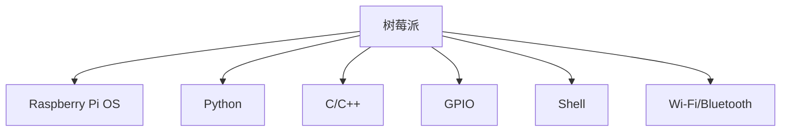

                 

# 树莓派开发：从入门到精通

> 关键词：树莓派,开发,入门,进阶,实用指南

## 1. 背景介绍

### 1.1 问题由来

树莓派(Raspberry Pi)作为一种小型且成本较低的计算机平台，因其简单易用、功能强大和社区活跃等特性，受到了全球开发者的广泛关注和使用。随着物联网、教育、嵌入式系统等领域的快速发展，树莓派在各行业的创新应用场景不断涌现，从智能家居、教育设备到工业自动化，无所不在。

然而，对于初学者而言，树莓派开发依然存在一定的门槛，特别是对于没有计算机硬件开发背景的用户，可能会对树莓派的操作系统和软件开发感到陌生。为了解决这一问题，本文旨在通过系统而全面的内容，从零基础开始，逐步引导读者掌握树莓派开发所需的基本知识和技能，帮助读者顺利从入门到精通。

### 1.2 问题核心关键点

树莓派开发的关键在于理解其硬件架构、操作系统和开发工具，并掌握基本的编程技能。这些核心知识构成了树莓派开发的基础，在实际应用中，需要通过合理组合和实践，才能实现高效、实用的解决方案。

## 2. 核心概念与联系

### 2.1 核心概念概述

为更好地理解树莓派开发，本文将介绍几个关键概念：

- **树莓派**：基于ARM架构的微控制器开发板，内置Linux操作系统，支持Python、C/C++等多种编程语言。
- **Raspberry Pi OS**：树莓派官方提供的Linux发行版，基于Debian系统，提供了简单易用的开发环境。
- **Python**：树莓派开发的首选编程语言，具备简单易学、跨平台、丰富的库支持等特点。
- **C/C++**：树莓派底层开发的主流语言，适合处理硬件驱动、系统编程等任务。
- **GPIO**：树莓派专用的通用输入输出接口，用于控制硬件外设。
- **Shell**：树莓派内置的命令行界面，提供与操作系统交互的方式。
- **Wi-Fi/Bluetooth**：树莓派内置的无线通讯模块，支持Wi-Fi和蓝牙，用于远程控制和数据传输。

这些核心概念构成了树莓派开发的基础，通过理解这些概念，读者可以更好地掌握树莓派开发的技巧和实践。

### 2.2 核心概念原理和架构的 Mermaid 流程图



这个流程图展示了树莓派开发所需的核心概念及其关系：

1. 树莓派（A）是硬件平台，提供基本的硬件资源。
2. Raspberry Pi OS（B）是操作系统，提供编程环境和资源管理。
3. Python（C）和C/C++（D）是编程语言，用于开发应用程序。
4. GPIO（E）是硬件接口，用于控制外部设备。
5. Shell（F）是命令行工具，用于管理硬件和软件。
6. Wi-Fi/Bluetooth（G）是无线通讯模块，用于网络连接和远程控制。

这些概念通过合理的组合和实践，可以构建出功能丰富、性能卓越的树莓派应用系统。

## 3. 核心算法原理 & 具体操作步骤

### 3.1 算法原理概述

树莓派开发主要涉及嵌入式系统编程和跨平台编程。嵌入式系统编程关注硬件与软件的协同工作，通过控制GPIO接口、编写驱动程序等方式与硬件交互；跨平台编程则关注在不同操作系统和编程语言间实现代码复用和功能移植。

树莓派开发的关键算法包括：

1. **嵌入式系统编程**：使用C/C++语言编写驱动程序，控制GPIO接口，实现硬件操作。
2. **跨平台编程**：使用Python语言，利用跨平台特性和丰富的库资源，实现应用功能。
3. **网络编程**：使用Socket库，实现树莓派与网络的连接和数据传输。
4. **并发编程**：使用多线程和异步编程技术，提高系统响应速度和资源利用率。
5. **数据处理**：使用Python的Numpy、Pandas库，处理和分析传感器数据。

### 3.2 算法步骤详解

#### 3.2.1 嵌入式系统编程

1. **安装必要的开发工具**：
   - 安装树莓派操作系统Raspberry Pi OS。
   - 安装交叉编译工具链，用于在树莓派上编译C/C++程序。
   - 安装调试工具，如GDB、Minicom等。

2. **编写驱动程序**：
   - 使用C/C++编写驱动程序，控制GPIO接口。
   - 利用Linux内核API，与硬件设备交互。
   - 通过make命令编译并生成二进制文件。

3. **硬件测试**：
   - 将驱动程序烧录到树莓派中，进行硬件测试。
   - 使用调试工具，监控程序运行状态，发现和修复问题。

#### 3.2.2 跨平台编程

1. **安装开发环境**：
   - 安装Python解释器。
   - 安装必要的库，如PyPi、pip等。
   - 安装虚拟环境管理工具，如virtualenv或conda。

2. **编写Python程序**：
   - 使用Python编写应用程序，利用丰富的库资源，实现各种功能。
   - 使用跨平台特性，确保程序在多个操作系统上运行。
   - 使用虚拟环境管理工具，避免不同项目间的依赖冲突。

3. **程序测试与部署**：
   - 在本地计算机上测试程序，发现和修复问题。
   - 将程序打包成可执行文件或系统服务，部署到树莓派中。
   - 使用树莓派内置的Shell，管理程序运行。

### 3.3 算法优缺点

树莓派开发的优点包括：

1. **成本低廉**：树莓派硬件成本较低，易于批量采购和使用。
2. **简单易学**：树莓派硬件和软件生态较为成熟，开发门槛较低。
3. **功能强大**：支持多种编程语言和开发环境，具备丰富的硬件资源和网络功能。
4. **社区支持**：拥有活跃的开发者社区，提供了大量的开源项目和文档资源。

但树莓派开发也存在以下缺点：

1. **性能有限**：树莓派硬件性能相对较弱，不适合处理高负载和高精度计算任务。
2. **内存不足**：树莓派内置的内存较小，需要合理管理内存资源，避免程序崩溃。
3. **开发环境复杂**：需要掌握嵌入式系统和跨平台编程的知识，开发过程较为繁琐。
4. **硬件兼容性**：不同型号的树莓派硬件可能存在兼容性问题，需要细心调试。

### 3.4 算法应用领域

树莓派开发广泛应用于以下领域：

1. **智能家居**：实现语音控制、智能照明、安防监控等功能。
2. **教育设备**：开发互动学习板、编程机器人、科学实验装置等。
3. **嵌入式系统**：开发传感器网络、工业控制、物联网设备等。
4. **科研工具**：用于数据采集、图像处理、科学计算等科研任务。
5. **远程控制**：通过Wi-Fi和Bluetooth实现远程监控和控制。
6. **网络服务器**：搭建Web服务器、数据库服务器、VPN等网络服务。

树莓派开发的多样性和灵活性，使其能够覆盖多个应用场景，推动了多个行业的数字化转型。

## 4. 数学模型和公式 & 详细讲解 & 举例说明

### 4.1 数学模型构建

树莓派开发涉及的数学模型主要包括以下几类：

1. **嵌入式系统编程模型**：
   - 控制理论：通过控制算法实现传感器数据的采集和处理。
   - 嵌入式系统调度：利用实时操作系统，优化程序执行效率。

2. **跨平台编程模型**：
   - 数据库操作：使用SQL查询和事务处理，管理数据库数据。
   - 网络通信：利用Socket编程，实现数据传输和通信协议。

3. **数据处理模型**：
   - 统计分析：使用Python的Numpy、Pandas库，进行数据分析和统计。
   - 机器学习：使用Scikit-learn、TensorFlow等库，进行模型训练和预测。

### 4.2 公式推导过程

以嵌入式系统编程中的控制理论为例，假设有一个简单的控制系统，其状态方程为：

$$
\dot{x} = Ax + Bu
$$

其中 $x$ 表示系统状态，$u$ 表示输入信号，$A$ 和 $B$ 为系统参数。

控制系统的目标是使系统状态 $x$ 稳定在某个期望值。通过求解如下状态反馈控制律：

$$
u = -Kx
$$

其中 $K$ 为反馈系数，可以使系统达到稳态。

通过拉普拉斯变换，可以将上述微分方程转化为频域方程：

$$
sX(s) = AX(s) + BU(s)
$$

其中 $s$ 为拉普拉斯变换变量。求解该方程，可以得到系统的闭环传递函数：

$$
T(s) = \frac{I - A}{sI - A} BK
$$

通过频域分析，可以确定系统的稳定性条件和控制参数的选择。

### 4.3 案例分析与讲解

以树莓派上的红外传感器控制为例，具体分析树莓派开发中控制理论的应用：

1. **传感器数据采集**：
   - 使用树莓派内置的GPIO接口，连接红外传感器。
   - 编写C/C++程序，读取传感器数据，并转换为数字信号。
   - 通过定时中断，实现连续采集，获取稳定的数据流。

2. **数据处理与分析**：
   - 使用Numpy库，进行数据平滑和滤波处理。
   - 使用Pandas库，将数据转换为DataFrame格式，进行统计分析。
   - 使用Matplotlib库，绘制传感器数据曲线，观察数据变化趋势。

3. **控制算法实现**：
   - 使用Python编写状态反馈控制律，实现对传感器数据的反馈控制。
   - 设置控制参数，使系统状态达到期望值。
   - 利用实时操作系统，优化程序执行效率，保证系统的实时性。

通过以上步骤，可以实现树莓派上的红外传感器控制，从而实现智能家居、安防监控等功能。

## 5. 项目实践：代码实例和详细解释说明

### 5.1 开发环境搭建

树莓派开发环境的搭建主要包括以下几个步骤：

1. **硬件准备**：
   - 准备树莓派开发板、电源、以太网、USB键盘鼠标等设备。
   - 连接树莓派和显示器、键盘、鼠标等外设。
   - 连接树莓派和网络，确保Wi-Fi和Bluetooth正常工作。

2. **软件安装**：
   - 安装Raspberry Pi OS系统，可以使用SD卡或网络安装。
   - 安装必要的开发工具，如PyCharm、Visual Studio Code等。
   - 安装Python解释器和开发库，如Pip、virtualenv等。

### 5.2 源代码详细实现

以下是一个树莓派上红外传感器控制的Python代码示例：

```python
import numpy as np
from rpi import GPIO
from rpi import Pi
from rpi import PiTimer

def setup_gpio():
    GPIO.setmode(GPIO.BCM)
    GPIO.setup(17, GPIO.IN)

def read_sensor():
    value = GPIO.input(17)
    return value

def main():
    setup_gpio()
    timer = PiTimer(1)
    while True:
        value = read_sensor()
        print("传感器值：", value)
        time.sleep(1)

if __name__ == '__main__':
    main()
```

### 5.3 代码解读与分析

这段代码主要实现树莓派上红外传感器的数据采集和处理。

1. **setup_gpio函数**：
   - 设置GPIO模式为BCM模式。
   - 设置GPIO引脚17为输入模式。

2. **read_sensor函数**：
   - 读取GPIO引脚17的值，返回数字信号。
   - 通过循环调用，实现连续采集，获取稳定的数据流。

3. **main函数**：
   - 在主函数中调用setup_gpio函数，初始化GPIO。
   - 使用定时器，控制数据采集频率。
   - 通过循环调用read_sensor函数，读取传感器数据，并打印输出。

### 5.4 运行结果展示

运行上述代码，树莓派上红外传感器的数据将被实时采集和显示。例如，传感器值为1时，表示红外信号被触发，传感器值可能变化范围在0到1之间，具体取决于传感器的精度和环境噪声。

## 6. 实际应用场景

### 6.1 智能家居

树莓派在智能家居领域的应用非常广泛。通过树莓派和红外传感器、门磁等硬件设备，可以实现智能门锁、灯光控制、安防监控等功能。

例如，将树莓派和门磁传感器连接，可以实现智能门锁功能。当检测到门被打开时，树莓派通过Wi-Fi或Bluetooth发送警报信息，并通知用户。通过树莓派控制家庭灯光，可以实现智能照明系统，用户可以通过手机APP远程控制灯光亮度和颜色。

### 6.2 教育设备

树莓派在教育设备领域也有广泛应用。通过树莓派开发互动学习板、编程机器人等设备，可以提升学生的动手能力和编程兴趣。

例如，开发一个树莓派编程机器人，通过Python编程控制机器人的动作，实现编程任务。学生可以通过简单的编程指令，控制机器人完成特定的任务，增强编程技能和思维能力。

### 6.3 嵌入式系统

树莓派在嵌入式系统领域也有重要应用。通过树莓派开发传感器网络、工业控制等设备，可以实现自动化和智能化操作。

例如，开发一个树莓派传感器网络，实时监测环境参数，如温度、湿度、空气质量等。将数据通过Wi-Fi传输到云端，实现远程监控和管理。通过树莓派控制工业设备，可以实现智能控制和自动化生产。

### 6.4 未来应用展望

随着树莓派的不断发展和技术的进步，其应用场景将不断拓展。未来，树莓派有望在以下几个领域实现新的突破：

1. **5G物联网**：树莓派支持5G网络，可以实现更快速、更稳定的网络连接，应用于智能家居、智能城市等领域。
2. **边缘计算**：树莓派具备强大的计算能力，可以实现边缘计算和数据处理，应用于工业物联网、智慧医疗等领域。
3. **人工智能**：树莓派支持深度学习框架，可以实现图像识别、语音识别等人工智能应用，应用于安防监控、自动驾驶等领域。
4. **虚拟现实**：树莓派支持虚拟现实技术，可以实现VR/AR应用，应用于游戏、教育等领域。

## 7. 工具和资源推荐

### 7.1 学习资源推荐

为了帮助读者系统掌握树莓派开发的知识，本文推荐以下学习资源：

1. **Raspberry Pi官方文档**：提供树莓派硬件和软件的基础知识，详细说明开发环境搭建和API使用方法。
2. **《Raspberry Pi用户指南》**：一本实用的入门教程，涵盖树莓派硬件和软件的基本操作和应用场景。
3. **PyCharm官方教程**：提供PyCharm的开发环境和插件的安装和使用指南，帮助读者编写和调试Python程序。
4. **Udemy课程**：提供树莓派开发的系统课程，涵盖嵌入式系统编程、跨平台编程、网络编程等多个方面。
5. **Github资源**：提供大量的开源树莓派项目和代码示例，方便读者学习和借鉴。

通过以上学习资源，读者可以逐步掌握树莓派开发所需的知识和技能，实现从入门到精通的目标。

### 7.2 开发工具推荐

树莓派开发需要借助多种工具进行高效开发。以下是几款常用的开发工具：

1. **PyCharm**：一款功能强大的Python开发环境，支持版本控制、调试、测试等功能。
2. **Visual Studio Code**：一款轻量级的代码编辑器，支持多种编程语言和扩展插件。
3. **Git**：一款版本控制系统，方便代码的协作和版本管理。
4. **GDB**：一款调试工具，支持断点调试、内存分析等功能。
5. **Minicom**：一款串口调试工具，支持树莓派和计算机的串口通信。

合理利用这些工具，可以显著提升树莓派开发的效率和质量。

### 7.3 相关论文推荐

树莓派开发涉及多个技术领域，以下是几篇相关论文，推荐读者阅读：

1. **《Raspberry Pi Development with Python》**：介绍树莓派开发的基础知识和编程技巧，涵盖Python编程、跨平台编程、硬件控制等多个方面。
2. **《Real-Time Sensor Data Acquisition with Raspberry Pi》**：介绍树莓派传感器数据采集的实现方法和应用场景，涵盖数据平滑、滤波、控制算法等技术。
3. **《Energy-Efficient Control of Raspberry Pi GPIO Using Python》**：介绍树莓派GPIO控制的优化方法，涵盖数据采集、状态反馈控制、实时操作系统等多个技术。
4. **《Edge Computing with Raspberry Pi》**：介绍树莓派在边缘计算中的应用，涵盖数据处理、分布式计算、安全防护等多个技术。

通过阅读这些论文，读者可以深入了解树莓派开发的理论和技术，进一步提升实践能力。

## 8. 总结：未来发展趋势与挑战

### 8.1 总结

本文从入门到精通，系统介绍了树莓派开发所需的知识和技术，涵盖硬件搭建、软件开发、嵌入式系统编程等多个方面。通过详细的算法原理和操作步骤，帮助读者逐步掌握树莓派开发的技能，实现从入门到精通的目标。

树莓派开发具备成本低廉、简单易学、功能强大等特点，广泛应用于智能家居、教育设备、嵌入式系统等多个领域。通过合理利用树莓派开发环境和学习资源，读者可以实现高效、实用的解决方案，推动树莓派在各个行业中的应用。

### 8.2 未来发展趋势

树莓派开发的前景广阔，未来将呈现以下发展趋势：

1. **硬件升级**：随着技术的进步，树莓派硬件性能将不断提升，支持更多高性能芯片和传感器。
2. **软件生态**：树莓派开发工具和库将不断丰富和完善，提高开发效率和用户体验。
3. **应用场景**：树莓派将应用于更多行业领域，推动数字化转型和智能化升级。
4. **社区发展**：树莓派开发者社区将不断壮大，促进开源项目和知识共享。
5. **新兴技术**：树莓派将融合人工智能、边缘计算、5G物联网等新兴技术，拓展应用边界。

### 8.3 面临的挑战

树莓派开发在技术进步的同时，也面临以下挑战：

1. **硬件兼容性**：不同型号的树莓派硬件可能存在兼容性问题，需要开发者仔细调试和适配。
2. **资源管理**：树莓派硬件性能有限，需要合理管理内存和CPU资源，避免程序崩溃。
3. **安全防护**：树莓派内置的网络和外设接口可能存在安全风险，需要加强安全防护措施。
4. **跨平台问题**：树莓派开发涉及多种编程语言和平台，需要解决跨平台兼容性和代码移植问题。
5. **技术更新**：树莓派硬件和软件不断发展，开发者需要不断学习和更新技术，保持竞争力。

### 8.4 研究展望

面对树莓派开发面临的挑战，未来的研究方向包括：

1. **硬件优化**：改进树莓派硬件设计，提高性能和兼容性。
2. **软件优化**：优化树莓派开发工具和库，提高开发效率和用户体验。
3. **应用拓展**：探索树莓派在更多行业领域的应用场景，推动数字化转型。
4. **安全防护**：加强树莓派的安全防护措施，保障数据和设备安全。
5. **技术融合**：将人工智能、边缘计算等新兴技术融合到树莓派开发中，拓展应用边界。

只有积极应对挑战，不断创新和优化，才能推动树莓派开发技术的不断进步和应用领域的不断拓展，为树莓派开发者和开发者社区带来新的发展机遇。

## 9. 附录：常见问题与解答

### Q1：树莓派开发需要哪些硬件设备？

A: 树莓派开发需要以下硬件设备：
- 树莓派开发板
- 电源
- 以太网
- USB键盘鼠标
- 显示器
- 摄像头（可选）
- 传感器（可选）
- 网络模块（可选）

### Q2：树莓派开发需要哪些软件工具？

A: 树莓派开发需要以下软件工具：
- Raspberry Pi OS操作系统
- Python解释器
- PyCharm、Visual Studio Code等开发环境
- pip、virtualenv等工具
- GDB、Minicom等调试工具
- Git版本控制系统
- Socket、MySQL等库

### Q3：树莓派开发中常见的编程语言有哪些？

A: 树莓派开发中常见的编程语言包括：
- Python
- C/C++
- Java
- JavaScript

其中，Python是树莓派开发的首选语言，易于学习和使用，具备丰富的库和工具支持。

### Q4：树莓派开发中如何进行硬件控制？

A: 树莓派开发中，硬件控制主要通过GPIO接口实现。具体步骤如下：
- 设置GPIO模式和引脚。
- 读取和写入GPIO引脚的值。
- 使用定时中断或循环调用，实现硬件数据采集和控制。

### Q5：树莓派开发中如何进行数据处理？

A: 树莓派开发中，数据处理主要通过Python的Numpy、Pandas库实现。具体步骤如下：
- 读取传感器或文件数据，转换为数组或DataFrame格式。
- 进行数据平滑、滤波、统计分析等处理。
- 使用Matplotlib、Seaborn等库，绘制数据图表。

通过以上问答，读者可以更好地理解树莓派开发所需的基础知识和技能，为后续学习和实践奠定基础。

