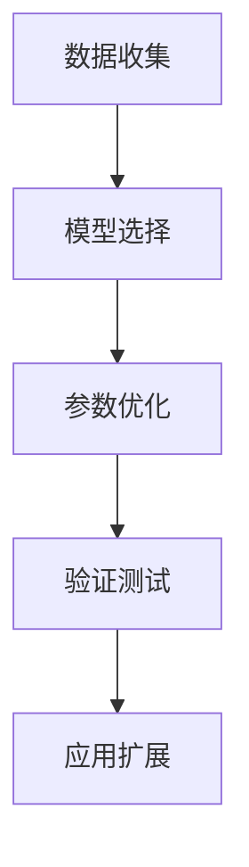

                 

# 模型思维：认知复杂世界的快捷方式

> 关键词：模型思维,认知复杂性,数据分析,机器学习,模型优化,应用场景

## 1. 背景介绍

### 1.1 问题由来
在信息爆炸、数据泛滥的21世纪，人类面临的决策问题日益复杂多变。从商业决策到医学诊断，从金融投资到智能制造，每一个决策背后，都有大量数据的支撑。然而，面对海量数据，如何从中提取关键信息、发现隐藏规律，却成了一道难题。此时，模型思维成为了一种迅速、有效的方法，为复杂世界提供了便捷的认知框架。

### 1.2 问题核心关键点
模型思维指的是通过构建数学或计算模型来描述、分析和预测复杂系统的行为。它包括以下几个关键点：

1. **数据收集**：获取高质量的、代表性的数据，是构建模型的基础。
2. **模型选择**：根据问题的特点，选择合适的模型框架。
3. **参数优化**：通过优化模型的参数，提高模型预测的准确性和泛化能力。
4. **验证测试**：在真实环境中验证模型的效果，确保模型具有实际应用价值。
5. **应用扩展**：将模型应用到新场景中，解决更广泛的问题。

### 1.3 问题研究意义
模型思维在解决复杂问题、提升决策效率、优化资源配置等方面具有重要意义：

1. **提高决策效率**：通过模型，可以迅速提炼数据关键信息，支持快速决策。
2. **优化资源配置**：通过模型预测，可以实现资源的最优配置，提高经济效益。
3. **促进创新**：模型思维提供了一种系统化的分析方法，有助于发现新知识和新思路。
4. **增强可信度**：模型预测结果具有数学依据，可以提高决策的可信度和可靠性。

## 2. 核心概念与联系

### 2.1 核心概念概述

为更好地理解模型思维的原理和应用，本节将介绍几个核心概念：

- **模型(Model)**：数学或计算模型，用于描述现实世界的物理或统计特性。常见的模型包括线性回归、决策树、神经网络等。
- **优化(Optimization)**：通过调整模型参数，使模型输出最优化地拟合真实数据的过程。常见的优化算法包括梯度下降、遗传算法等。
- **验证(Validation)**：通过保留一部分未参与训练的数据，评估模型在新数据上的泛化能力，避免过拟合。
- **预测(Prediction)**：使用模型对新数据进行预测，用于辅助决策和资源配置。
- **拟合(Fitting)**：将模型参数调整到与训练数据相匹配的程度。
- **泛化能力(Generalization)**：模型在新数据上表现与训练数据相近的能力。

这些核心概念之间的逻辑关系可以通过以下Mermaid流程图来展示：



这个流程图展示了几大核心概念之间的联系：首先从数据开始，通过选择合适的模型，再通过参数优化和验证测试，最终将模型应用到实际问题中，实现预测和优化。

## 3. 核心算法原理 & 具体操作步骤
### 3.1 算法原理概述

模型思维的核心在于通过构建数学或计算模型，描述和预测复杂系统的行为。其基本流程包括数据收集、模型选择、参数优化、验证测试和应用扩展等步骤。

形式化地，假设我们有一个数据集 $D=\{(x_i,y_i)\}_{i=1}^N$，其中 $x_i$ 为输入特征，$y_i$ 为输出标签。我们的目标是构建一个模型 $M$，使得在给定输入 $x$ 时，模型输出 $M(x)$ 尽可能接近真实标签 $y$。

一个典型的模型训练流程如下：

1. **数据收集**：收集与问题相关的数据，确保数据样本的多样性和代表性。
2. **模型选择**：选择适合问题的模型结构，如线性回归、决策树、神经网络等。
3. **参数优化**：通过优化算法调整模型参数，最小化模型在训练数据上的损失函数。
4. **验证测试**：使用保留的测试集评估模型在新数据上的泛化能力，调整参数以提高模型性能。
5. **应用扩展**：将优化后的模型应用于实际问题中，进行预测和优化决策。

### 3.2 算法步骤详解

模型思维的应用流程通常包括以下几个关键步骤：

**Step 1: 数据收集**
- 明确问题目标，确定需要收集的数据类型和数据量。
- 设计数据收集方案，选择合适的数据采集工具和方法。
- 确保数据的质量和代表性，去除噪声和异常值。

**Step 2: 模型选择**
- 根据问题的特点，选择合适的模型类型，如回归、分类、聚类等。
- 设计模型的架构，包括输入、隐藏层、输出等组件。
- 确定模型的超参数，如学习率、正则化系数等。

**Step 3: 参数优化**
- 选择合适的优化算法，如梯度下降、Adam等。
- 使用训练集对模型进行前向传播和反向传播，计算损失函数。
- 调整模型参数，最小化损失函数。

**Step 4: 验证测试**
- 使用验证集评估模型在新数据上的泛化能力。
- 使用测试集进一步验证模型的稳定性和准确性。
- 根据验证测试结果调整模型参数，提高模型性能。

**Step 5: 应用扩展**
- 将优化后的模型应用到实际问题中，进行预测和优化决策。
- 监控模型在实际环境中的表现，及时调整和优化模型。

### 3.3 算法优缺点

模型思维具有以下优点：

1. **效率高**：通过数学或计算模型，可以快速提炼数据关键信息，支持快速决策。
2. **可解释性强**：模型输出具有数学依据，有助于理解决策过程。
3. **可重复性强**：模型训练和预测过程具有可重复性，便于比较和优化。
4. **灵活性高**：可以根据问题特点灵活选择模型类型和参数。

同时，模型思维也存在一些缺点：

1. **数据依赖强**：模型的效果很大程度上依赖于数据的质量和代表性。
2. **过度拟合风险**：模型可能过度拟合训练数据，泛化能力不足。
3. **计算资源需求高**：复杂的模型和大量的数据需要高计算资源支持。
4. **模型解释性差**：某些模型如神经网络具有"黑盒"性质，难以解释其内部工作机制。

尽管存在这些局限性，但就目前而言，模型思维是解决复杂问题的主要方法之一。未来相关研究的重点在于如何进一步提高模型的泛化能力，降低对数据和计算资源的依赖，同时提高模型的解释性和透明度。

### 3.4 算法应用领域

模型思维在各个领域都有广泛的应用，例如：

- **金融投资**：通过历史数据预测股票价格，进行投资组合优化。
- **医疗诊断**：通过病历数据预测疾病风险，辅助临床决策。
- **市场营销**：通过客户数据预测购买行为，进行精准营销。
- **物流管理**：通过交通数据优化路线，提高物流效率。
- **城市规划**：通过人口和交通数据预测城市发展趋势，进行资源配置。

除了上述这些经典领域，模型思维也被创新性地应用到更多场景中，如智能制造、智慧农业、智能城市等，为社会管理和服务提供了新的解决方案。随着模型的不断演进和应用实践的深化，相信模型思维将在更多领域发挥重要作用。

## 4. 数学模型和公式 & 详细讲解  
### 4.1 数学模型构建

本节将使用数学语言对模型思维的原理和应用进行更加严格的刻画。

假设我们有一个线性回归模型 $M(x)=\beta_0+\sum_{i=1}^d \beta_i x_i$，其中 $x_i$ 为输入特征，$\beta_i$ 为模型参数，$\beta_0$ 为截距。

定义模型在训练集上的损失函数为 $L(\beta)=\frac{1}{N}\sum_{i=1}^N (y_i-M(x_i))^2$，目标是最小化损失函数，即找到最优参数：

$$
\beta^* = \mathop{\arg\min}_{\beta} L(\beta)
$$

在实践中，我们通常使用基于梯度的优化算法（如SGD、Adam等）来近似求解上述最优化问题。设 $\eta$ 为学习率，$\lambda$ 为正则化系数，则参数的更新公式为：

$$
\beta \leftarrow \beta - \eta \nabla_{\beta}L(\beta) - \eta\lambda\beta
$$

其中 $\nabla_{\beta}L(\beta)$ 为损失函数对参数 $\beta$ 的梯度，可通过反向传播算法高效计算。

### 4.2 公式推导过程

以下我们以线性回归模型为例，推导最小二乘法的公式及其梯度的计算公式。

假设模型 $M(x)=\beta_0+\sum_{i=1}^d \beta_i x_i$，在输入 $x$ 上的输出为 $M(x)$。真实标签 $y \in \mathbb{R}$，则均方误差损失函数定义为：

$$
L(M(x),y) = \frac{1}{2}(y-M(x))^2
$$

将其代入损失函数公式，得：

$$
L(\beta) = \frac{1}{2N}\sum_{i=1}^N (y_i-M(x_i))^2
$$

根据链式法则，损失函数对参数 $\beta_k$ 的梯度为：

$$
\frac{\partial L(\beta)}{\partial \beta_k} = -\frac{1}{N}\sum_{i=1}^N (y_i-M(x_i))x_{ik}
$$

其中 $M(x_i)=\beta_0+\sum_{i=1}^d \beta_i x_{ik}$，$x_{ik}$ 为输入特征的第 $k$ 个分量。

在得到损失函数的梯度后，即可带入参数更新公式，完成模型的迭代优化。重复上述过程直至收敛，最终得到适应训练数据的最优模型参数 $\beta^*$。

## 5. 项目实践：代码实例和详细解释说明
### 5.1 开发环境搭建

在进行模型训练实践前，我们需要准备好开发环境。以下是使用Python进行Scikit-learn开发的环境配置流程：

1. 安装Anaconda：从官网下载并安装Anaconda，用于创建独立的Python环境。

2. 创建并激活虚拟环境：
```bash
conda create -n scikit-learn-env python=3.8 
conda activate scikit-learn-env
```

3. 安装Scikit-learn和其他常用工具包：
```bash
pip install scikit-learn numpy pandas scikit-optimize matplotlib seaborn tqdm jupyter notebook ipython
```

完成上述步骤后，即可在`scikit-learn-env`环境中开始模型训练实践。

### 5.2 源代码详细实现

下面我们以线性回归模型为例，给出使用Scikit-learn进行模型训练的Python代码实现。

首先，导入必要的库：

```python
import numpy as np
from sklearn.linear_model import LinearRegression
from sklearn.model_selection import train_test_split
from sklearn.metrics import mean_squared_error, r2_score
```

然后，准备数据集：

```python
X = np.random.randn(100, 2)
y = np.dot(X, [0.5, 1]) + np.random.randn(100)
```

接着，划分训练集和测试集：

```python
X_train, X_test, y_train, y_test = train_test_split(X, y, test_size=0.2, random_state=42)
```

定义并训练线性回归模型：

```python
model = LinearRegression()
model.fit(X_train, y_train)
```

最后，在测试集上进行预测并评估：

```python
y_pred = model.predict(X_test)
print('MSE:', mean_squared_error(y_test, y_pred))
print('R2:', r2_score(y_test, y_pred))
```

以上就是使用Scikit-learn进行线性回归模型训练的完整代码实现。可以看到，Scikit-learn封装了大量的统计学习算法，使得模型训练过程简洁高效。

### 5.3 代码解读与分析

让我们再详细解读一下关键代码的实现细节：

**train_test_split函数**：
- 将数据集随机划分为训练集和测试集，用于评估模型的泛化能力。

**LinearRegression类**：
- 定义了线性回归模型，提供了丰富的模型训练和预测方法。

**mean_squared_error和r2_score函数**：
- 计算预测值与真实值之间的均方误差和R²分数，评估模型预测的准确性。

**训练流程**：
- 使用训练集对模型进行训练，得到最优的模型参数。
- 在测试集上对模型进行预测，评估模型在新数据上的表现。
- 使用评估指标对比模型预测与真实值，输出均方误差和R²分数。

可以看到，Scikit-learn封装了大量的模型训练和评估方法，开发者只需要专注于业务逻辑和数据处理，便可以快速构建并优化模型。

当然，工业级的系统实现还需考虑更多因素，如模型的保存和部署、超参数的自动搜索、更灵活的任务适配层等。但核心的模型训练范式基本与此类似。

## 6. 实际应用场景
### 6.1 智能投资决策

模型思维在金融投资领域具有广泛的应用，可以帮助投资者通过历史数据预测股票价格，进行投资组合优化。

具体而言，可以收集历史交易数据、公司财报、市场指数等数据，构建统计模型或机器学习模型，预测股票价格的趋势和波动。使用模型输出辅助投资决策，可以提高投资收益和风险控制。

### 6.2 医疗健康预测

模型思维在医疗健康领域同样具有重要应用，可以通过病历数据预测疾病风险，辅助临床诊断和治疗决策。

例如，可以收集患者的病史、体检数据、遗传信息等，构建机器学习模型，预测患者患某种疾病的概率。根据预测结果，医生可以提前制定治疗方案，提高诊疗效率和准确性。

### 6.3 供应链管理

模型思维在供应链管理中也有广泛应用，通过预测市场需求和库存水平，优化供应链管理策略。

具体而言，可以收集历史销售数据、市场趋势、库存信息等数据，构建预测模型，预测未来市场需求和库存水平。根据预测结果，企业可以优化库存管理，减少库存成本和缺货风险。

### 6.4 未来应用展望

随着模型思维的不断发展和应用，未来将有更多领域受益于此。以下是一些可能的未来应用场景：

- **智慧农业**：通过气象数据、土壤数据、作物数据等，预测作物生长和产量，优化种植策略。
- **智能制造**：通过生产数据、设备状态、市场需求等，预测生产量和设备维护需求，优化生产流程。
- **智慧城市**：通过交通数据、人口数据、环境数据等，预测城市发展趋势，优化资源配置。
- **金融风险控制**：通过市场数据、财务数据、政策变化等，预测金融市场波动，进行风险控制和投资决策。

这些应用场景展示了模型思维在解决复杂问题方面的巨大潜力。随着模型的不断优化和应用实践的深入，相信模型思维将在更多领域发挥重要作用。

## 7. 工具和资源推荐
### 7.1 学习资源推荐

为了帮助开发者系统掌握模型思维的理论基础和实践技巧，这里推荐一些优质的学习资源：

1. 《统计学习基础》系列博文：由统计学专家撰写，全面介绍了统计学习的基本原理和方法。

2. 《机器学习实战》书籍：通过丰富的代码示例，介绍了机器学习算法的实现和应用。

3. 《深度学习》课程：斯坦福大学开设的深度学习课程，包括数学基础、算法实现和应用实践。

4. 《Python机器学习》书籍：介绍了Python在机器学习中的应用，涵盖数据预处理、模型训练、模型评估等多个环节。

5. 《Kaggle竞赛指南》：Kaggle竞赛是数据科学领域的顶级比赛，提供大量实际问题和学习资源，是实践模型思维的绝佳平台。

通过对这些资源的学习实践，相信你一定能够快速掌握模型思维的核心方法，并用于解决实际的决策问题。

### 7.2 开发工具推荐

高效的开发离不开优秀的工具支持。以下是几款用于模型训练开发的常用工具：

1. Scikit-learn：基于Python的机器学习库，提供了丰富的统计学习算法，支持数据预处理、模型训练、模型评估等。

2. TensorFlow：由Google主导开发的深度学习框架，生产部署方便，支持多种模型架构和优化算法。

3. PyTorch：基于Python的深度学习框架，支持动态计算图，灵活便捷。

4. Weights & Biases：模型训练的实验跟踪工具，可以记录和可视化模型训练过程中的各项指标，方便对比和调优。

5. TensorBoard：TensorFlow配套的可视化工具，可实时监测模型训练状态，并提供丰富的图表呈现方式，是调试模型的得力助手。

6. Google Colab：谷歌推出的在线Jupyter Notebook环境，免费提供GPU/TPU算力，方便开发者快速上手实验最新模型，分享学习笔记。

合理利用这些工具，可以显著提升模型训练和应用的开发效率，加快创新迭代的步伐。

### 7.3 相关论文推荐

模型思维的研究源于学界的持续探索。以下是几篇奠基性的相关论文，推荐阅读：

1. "Linear Regression Analysis" by Christian G. Bohm：介绍了线性回归模型的原理和应用。

2. "Gaussian Processes for Machine Learning" by Carl E. Rasmussen and Christopher K.I. Williams：介绍了高斯过程模型及其在机器学习中的应用。

3. "Random Forests" by Leo Breiman：介绍了随机森林模型的原理和应用。

4. "Deep Learning" by Ian Goodfellow、Yoshua Bengio和Aaron Courville：介绍了深度学习的基本原理和应用。

5. "XGBoost: A Scalable Tree Boosting System" by Tianqi Chen et al.：介绍了XGBoost算法及其在数据挖掘和机器学习中的应用。

这些论文代表了大模型思维的发展脉络。通过学习这些前沿成果，可以帮助研究者把握学科前进方向，激发更多的创新灵感。

## 8. 总结：未来发展趋势与挑战

### 8.1 总结

本文对模型思维的原理和应用进行了全面系统的介绍。首先阐述了模型思维在解决复杂问题、提升决策效率、优化资源配置等方面的重要意义。其次，从原理到实践，详细讲解了模型思维的数学模型和操作步骤，给出了模型训练任务开发的完整代码实例。同时，本文还广泛探讨了模型思维在金融、医疗、供应链等领域的实际应用前景，展示了模型思维的广阔前景。此外，本文精选了模型思维的学习资源，力求为读者提供全方位的技术指引。

通过本文的系统梳理，可以看到，模型思维已成为解决复杂问题的有力工具，具有广阔的应用前景。未来，伴随模型的不断演进和应用实践的深入，相信模型思维将在更多领域发挥重要作用。

### 8.2 未来发展趋势

展望未来，模型思维将呈现以下几个发展趋势：

1. **自动化**：随着AI技术的不断进步，自动化建模和优化将成为趋势。自动化的模型选择和参数优化将大大提高模型训练的效率和精度。

2. **多模态融合**：未来的模型思维将更多地融合多模态数据，如文本、图像、音频等，提升模型的理解和建模能力。

3. **可解释性增强**：模型输出将更具可解释性，有助于理解决策过程和优化策略。

4. **分布式计算**：大数据量的模型训练需要分布式计算支持，大规模并行计算将推动模型思维的进一步发展。

5. **隐私保护**：模型训练过程中将更加注重隐私保护，避免数据泄露和滥用。

6. **模型迁移**：未来的模型将更多地利用迁移学习，快速适应新场景和新任务。

以上趋势凸显了模型思维的广阔前景。这些方向的探索发展，必将进一步提高模型的泛化能力，提升决策的效率和质量。

### 8.3 面临的挑战

尽管模型思维已经取得了显著进展，但在迈向更加智能化、普适化应用的过程中，仍面临诸多挑战：

1. **数据质量问题**：数据的质量和代表性是模型训练的基础，如何获取高质量的数据是模型思维面临的一大难题。

2. **计算资源瓶颈**：复杂模型的训练和推理需要高计算资源支持，如何降低计算成本是模型思维面临的一大挑战。

3. **模型泛化能力不足**：模型可能在训练数据上表现优秀，但在实际应用中泛化能力不足，难以适应新场景和新任务。

4. **模型解释性差**：某些模型如深度学习模型具有"黑盒"性质，难以解释其内部工作机制和决策逻辑。

5. **模型鲁棒性不足**：模型面对噪声和异常数据时，可能出现不稳定现象，如何提高模型鲁棒性是重要研究方向。

6. **隐私保护问题**：模型训练过程中涉及大量敏感数据，如何保护数据隐私和匿名化是模型思维面临的一大挑战。

正视模型思维面临的这些挑战，积极应对并寻求突破，将是大模型思维走向成熟的必由之路。相信随着学界和产业界的共同努力，这些挑战终将一一被克服，模型思维必将在构建智能系统、优化决策过程中发挥更大的作用。

### 8.4 研究展望

面对模型思维面临的种种挑战，未来的研究需要在以下几个方面寻求新的突破：

1. **自动化建模**：开发自动化模型选择工具和优化器，提高模型训练的效率和精度。

2. **多模态融合**：研究多模态数据的表示和融合方法，提升模型对现实世界的理解和建模能力。

3. **模型解释性**：引入可解释性方法，如LIME、SHAP等，增强模型输出的可解释性。

4. **模型鲁棒性**：研究鲁棒性优化方法，提高模型面对噪声和异常数据时的稳定性。

5. **隐私保护**：研究数据匿名化和隐私保护技术，确保模型训练过程的数据安全和隐私保护。

这些研究方向的探索，必将引领模型思维技术迈向更高的台阶，为构建智能系统和优化决策提供更加可靠和高效的工具。面向未来，模型思维还需要与其他人工智能技术进行更深入的融合，如知识表示、因果推理、强化学习等，多路径协同发力，共同推动智能技术的发展和应用。

---

作者：禅与计算机程序设计艺术 / Zen and the Art of Computer Programming

