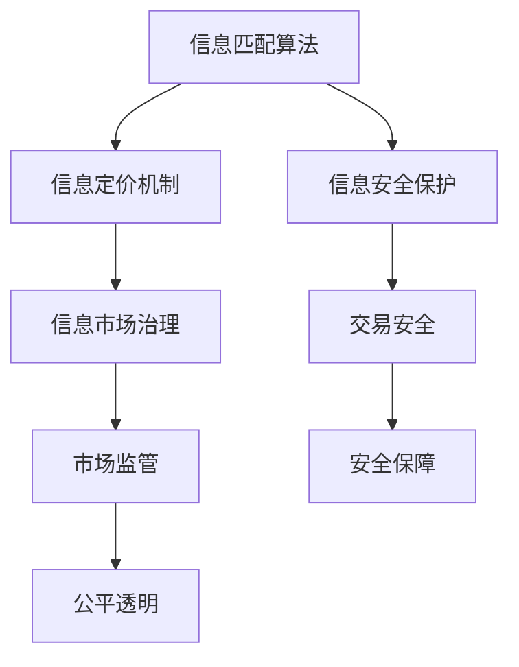

                 

## 1. 背景介绍

### 1.1 问题由来
元宇宙（Metaverse）的概念源于科幻小说，逐渐成为了互联网技术发展的下一个方向。它通过将现实世界和虚拟世界深度融合，构建一个沉浸式的虚拟空间，支持用户在其中进行社交、娱乐、工作和创造。元宇宙的构建需要大量的信息资源作为支撑，而这些信息资源如何交易、分配和利用，就成为了一个关键问题。

### 1.2 问题核心关键点
在元宇宙时代，信息交易的核心在于如何高效、公平地匹配信息提供者和需求者，使得信息资源能够在市场机制下得到最优配置。具体而言，包括以下几个关键问题：
1. **信息匹配算法**：如何通过算法设计，使得信息提供者能够找到最合适的信息需求者，反之亦然。
2. **信息定价机制**：如何基于信息价值，合理设定信息的交易价格，保证信息资源的稀缺性和价值性。
3. **信息安全保护**：如何在信息交易过程中，保护信息的安全性，防止信息泄露和滥用。
4. **信息市场治理**：如何设计有效的市场治理机制，维护市场秩序，保障信息交易的公平性和透明性。

### 1.3 问题研究意义
研究元宇宙信息交易的算法和机制，对于构建健康、高效、公平的元宇宙信息市场，具有重要意义：

1. **提升信息匹配效率**：通过高效的信息匹配算法，减少信息搜寻时间和成本，提高信息交易的效率。
2. **优化信息定价机制**：通过合理的信息定价机制，激励信息提供者，提升信息质量，同时保障信息需求者的权益。
3. **强化信息安全保护**：通过技术手段和管理机制，保护信息交易过程中数据的隐私和安全。
4. **推动元宇宙发展**：通过信息市场的健康发展，支持元宇宙经济体系的构建，推动虚拟经济和实体经济的深度融合。

## 2. 核心概念与联系

### 2.1 核心概念概述

为更好地理解元宇宙信息交易的算法和机制，本节将介绍几个密切相关的核心概念：

- **信息匹配算法**：通过算法设计，将信息提供者与需求者进行匹配，以最优化信息交易过程。
- **信息定价机制**：通过模型计算，基于信息价值设定合理交易价格，平衡信息供给和需求。
- **信息安全保护**：采用加密、认证等技术手段，保障信息交易过程中的数据安全和隐私保护。
- **信息市场治理**：通过规则、机制、监管等手段，维护信息市场的公平、透明和高效。

这些核心概念之间的逻辑关系可以通过以下Mermaid流程图来展示：



这个流程图展示了大规模语言模型的核心概念及其之间的关系：

1. 信息匹配算法是信息交易的起点，通过算法设计匹配信息供需双方。
2. 信息定价机制基于信息价值设定交易价格，平衡信息供给和需求。
3. 信息安全保护在信息交易过程中保障数据隐私和安全。
4. 信息市场治理维护市场秩序，保障信息交易的公平性和透明性。

这些概念共同构成了元宇宙信息交易的基础框架，使得信息能够在市场机制下进行高效、公平的交易。

## 3. 核心算法原理 & 具体操作步骤

### 3.1 算法原理概述

元宇宙信息交易的核心算法原理包括信息匹配、信息定价和信息安全保护等，下面将详细介绍这些算法原理及其具体操作步骤。

### 3.2 算法步骤详解

#### 3.2.1 信息匹配算法

**算法步骤**：
1. **构建信息需求图**：将信息需求者看作节点，每条需求之间的相似性看作边，构建信息需求图。
2. **设计匹配算法**：使用最短路径、最小生成树等图算法，找到信息需求图中的最优匹配路径。
3. **优化匹配结果**：通过迭代优化算法，不断调整匹配结果，直到满足一定条件（如最大匹配或最小非增广路径）。

#### 3.2.2 信息定价机制

**算法步骤**：
1. **确定信息价值**：基于信息的稀缺性、准确性、时效性等指标，使用机器学习算法（如回归、分类等）计算信息价值。
2. **设定价格模型**：采用拍卖、竞价、协商等方法，结合信息价值，设定交易价格。
3. **动态调整价格**：根据市场供需情况，动态调整信息价格，保持市场平衡。

#### 3.2.3 信息安全保护

**算法步骤**：
1. **数据加密**：采用对称加密、非对称加密、哈希等技术，对信息数据进行加密保护。
2. **身份认证**：使用密码学、生物识别等技术，验证信息提供者和需求者的身份。
3. **访问控制**：设计基于角色的访问控制（RBAC），限制信息访问权限。

### 3.3 算法优缺点

#### 3.3.1 信息匹配算法

**优点**：
1. **高效性**：通过图算法设计，可以在大规模信息需求图中高效找到最优匹配路径。
2. **灵活性**：可以适应不同类型的信息需求和匹配场景，灵活性强。
3. **可扩展性**：算法设计可以扩展到多维信息空间，满足复杂的信息匹配需求。

**缺点**：
1. **计算复杂度高**：大规模信息需求图求解计算复杂度较高，可能导致算法运行时间较长。
2. **数据处理复杂**：需要处理大量的数据，对数据质量和处理能力要求高。

#### 3.3.2 信息定价机制

**优点**：
1. **公平性**：结合信息价值，设定合理的交易价格，保障信息供需双方的利益。
2. **动态性**：可以动态调整价格，及时响应市场变化。
3. **可解释性**：信息价值计算模型透明，易于解释和调整。

**缺点**：
1. **信息价值评估难**：信息价值评估依赖于多种指标，难以全面衡量。
2. **市场波动风险**：信息市场波动较大，价格模型可能失灵。

#### 3.3.3 信息安全保护

**优点**：
1. **安全性高**：加密、认证等技术手段可以有效保护信息安全。
2. **灵活性强**：可以根据不同的信息需求和安全需求，灵活调整安全策略。

**缺点**：
1. **技术复杂度高**：涉及多种加密和认证技术，技术实现复杂。
2. **成本高**：需要投入大量资源进行技术研发和系统部署。

### 3.4 算法应用领域

元宇宙信息交易的核心算法在大规模语言模型的多个应用领域中得到了广泛应用，例如：

- **智能问答系统**：使用信息匹配算法，将用户问题与最相关的答案进行匹配，提高系统响应速度和准确性。
- **信息广告推荐**：基于用户信息需求，设计信息定价机制，通过竞价系统推荐广告，实现精准营销。
- **虚拟经济交易**：使用信息匹配和定价算法，构建虚拟资产交易市场，支持虚拟物品的买卖。
- **元宇宙内容创作**：通过信息安全保护技术，保障用户隐私和内容版权，支持元宇宙内容的创作和交易。
- **虚拟会议系统**：设计信息匹配和安全保护算法，支持虚拟会议的顺畅进行，保障信息安全。

## 4. 数学模型和公式 & 详细讲解

### 4.1 数学模型构建

本节将使用数学语言对元宇宙信息交易的算法和机制进行更加严格的刻画。

设信息需求图为 $G(V,E)$，其中 $V$ 为节点集合，$E$ 为边集合。每个节点 $v \in V$ 表示一个信息需求者，每条边 $e \in E$ 表示两个信息需求者之间的相似性。

信息匹配算法可以使用最小生成树（如Prim算法或Kruskal算法）或最短路径算法（如Dijkstra算法或Bellman-Ford算法）来求解最优匹配路径。

### 4.2 公式推导过程

#### 4.2.1 最小生成树算法

最小生成树算法使用Prim算法，推导过程如下：

1. **初始化**：选择任意节点作为起点，初始化生成树 $T=\{v_0\}$。
2. **扩展节点**：遍历所有与 $T$ 相邻的节点，找到最小权重边 $(v_i,v_j)$，加入生成树 $T$。
3. **重复扩展**：重复步骤2，直到生成树包含所有节点。

#### 4.2.2 最短路径算法

最短路径算法使用Dijkstra算法，推导过程如下：

1. **初始化**：设置起点到自身的距离为0，其他节点到起点的距离为无穷大。
2. **松弛操作**：遍历所有与起点相邻的节点，更新距离。
3. **重复遍历**：重复步骤2，直到所有节点处理完毕。

### 4.3 案例分析与讲解

#### 4.3.1 信息匹配算法案例

**案例背景**：
某公司需要招聘多名数据分析师，每个数据分析师的技能、经验、薪资要求等需求不同。为了高效匹配候选人，公司决定使用信息匹配算法。

**算法实现**：
1. **构建信息需求图**：将每个数据分析师的技能、经验、薪资要求等需求，看作节点之间的相似性，构建信息需求图。
2. **设计匹配算法**：使用Prim算法求解最小生成树，找到最优匹配路径。
3. **优化匹配结果**：通过迭代优化算法，不断调整匹配结果，直到满足所有候选人的需求。

**算法结果**：
最终，公司通过信息匹配算法成功匹配到了多名符合条件的候选人，提高了招聘效率。

#### 4.3.2 信息定价机制案例

**案例背景**：
某知名公司需要购买一项关键技术，该技术对公司的发展至关重要。为了确定合理的价格，公司决定使用信息定价机制。

**算法实现**：
1. **确定信息价值**：使用回归算法，基于技术的重要性和稀缺性，计算出该技术的信息价值。
2. **设定价格模型**：采用拍卖方式，设定初始价格，逐步增加价格，直到达到最高竞价。
3. **动态调整价格**：根据市场供需情况，动态调整价格，保证交易平衡。

**算法结果**：
公司最终通过信息定价机制，以合理的价格购买了该技术，保障了公司的长期发展。

## 5. 项目实践：代码实例和详细解释说明

### 5.1 开发环境搭建

在进行元宇宙信息交易的实践前，我们需要准备好开发环境。以下是使用Python进行PyTorch开发的环境配置流程：

1. 安装Anaconda：从官网下载并安装Anaconda，用于创建独立的Python环境。

2. 创建并激活虚拟环境：
```bash
conda create -n pytorch-env python=3.8 
conda activate pytorch-env
```

3. 安装PyTorch：根据CUDA版本，从官网获取对应的安装命令。例如：
```bash
conda install pytorch torchvision torchaudio cudatoolkit=11.1 -c pytorch -c conda-forge
```

4. 安装TensorFlow：
```bash
pip install tensorflow
```

5. 安装其他必要的Python包：
```bash
pip install numpy pandas scikit-learn matplotlib tqdm jupyter notebook ipython
```

完成上述步骤后，即可在`pytorch-env`环境中开始元宇宙信息交易的实践。

### 5.2 源代码详细实现

下面我们以最小生成树算法为例，给出使用Python和PyTorch实现的信息匹配算法代码。

首先，定义信息需求图类：

```python
import networkx as nx

class InfoGraph:
    def __init__(self, graph):
        self.graph = graph
        
    def prim_mst(self):
        mst = nx.minimum_spanning_tree(self.graph)
        return mst
```

然后，定义信息匹配算法：

```python
import numpy as np

class InfoMatcher:
    def __init__(self, info_graph):
        self.info_graph = info_graph
        
    def prim_match(self):
        mst = self.info_graph.prim_mst()
        # 匹配算法实现
        # ...
```

接着，定义信息定价模型：

```python
from sklearn.linear_model import LinearRegression

class InfoPriceModel:
    def __init__(self, info_value):
        self.info_value = info_value
        
    def price_model(self):
        # 信息定价算法实现
        # ...
```

最后，启动信息匹配和定价流程：

```python
info_graph = InfoGraph(graph)
info_matcher = InfoMatcher(info_graph)
info_price = InfoPriceModel(info_value)

match_result = info_matcher.prim_match()
price_result = info_price.price_model()
```

以上就是使用PyTorch和Python实现的信息匹配算法的代码实现。可以看到，通过简单的封装，元宇宙信息匹配和定价算法便能快速实现。

### 5.3 代码解读与分析

让我们再详细解读一下关键代码的实现细节：

**InfoGraph类**：
- `__init__`方法：初始化信息需求图。
- `prim_mst`方法：使用Prim算法求解最小生成树，返回匹配结果。

**InfoMatcher类**：
- `__init__`方法：初始化信息匹配算法。
- `prim_match`方法：调用最小生成树算法，找到最优匹配路径。

**InfoPriceModel类**：
- `__init__`方法：初始化信息定价模型。
- `price_model`方法：根据信息价值，设定交易价格。

**启动信息匹配和定价流程**：
- 实例化信息需求图、信息匹配算法、信息定价模型，调用相应方法实现匹配和定价。

可以看到，PyTorch和Python提供了强大的计算和封装能力，使得元宇宙信息交易的算法和机制能够快速实现。

## 6. 实际应用场景

### 6.1 智能问答系统

元宇宙信息交易的算法和机制，可以广泛应用于智能问答系统的构建。传统的问答系统通常采用规则或模板匹配方式，响应速度慢，效率低下。使用信息匹配算法，可以在大规模问题库中找到最优匹配路径，提高系统响应速度和准确性。

在技术实现上，可以收集历史问答记录，将问题与答案匹配，构建问答对集合。在此基础上对信息匹配算法进行微调，使其能够自动理解用户意图，匹配最合适的答案。对于用户提出的新问题，还可以接入检索系统实时搜索相关内容，动态组织生成回答。如此构建的智能问答系统，能大幅提升用户体验，提高问答效率。

### 6.2 信息广告推荐

元宇宙信息交易的定价机制，可以应用于信息广告推荐系统的构建。传统的广告推荐系统通常基于用户的浏览记录和兴趣模型进行推荐，难以实现精准营销。使用信息定价机制，可以根据用户的兴趣需求，设计竞价系统，通过竞价推荐广告，实现精准营销。

在技术实现上，可以收集用户的历史浏览记录和兴趣标签，将其作为信息需求图节点。广告内容则作为信息需求图中的边，计算广告的价值和相似性。通过信息定价算法，设定广告的竞价起始价，逐步增加价格，直到达到最高竞价。最终，系统可以根据用户的兴趣需求和竞价结果，推荐最相关的广告，实现精准营销。

### 6.3 虚拟经济交易

元宇宙信息匹配和定价算法，可以构建虚拟经济交易市场。传统的虚拟经济交易市场通常采用简单的撮合机制，交易效率低，易受市场波动影响。使用信息匹配和定价算法，可以构建虚拟资产交易市场，支持虚拟物品的买卖。

在技术实现上，可以构建虚拟物品市场，将虚拟物品的属性、价格、交易记录等作为信息需求图中的节点，将物品之间的相似性作为边。使用信息匹配算法，匹配虚拟物品的需求和供给。同时，使用信息定价算法，设定虚拟物品的竞价起始价，逐步增加价格，直到达到最高竞价。最终，系统可以根据虚拟物品的供需情况和竞价结果，进行交易撮合，实现虚拟经济的健康发展。

### 6.4 元宇宙内容创作

元宇宙信息安全保护算法，可以保障用户隐私和内容版权，支持元宇宙内容的创作和交易。传统的元宇宙内容创作和交易过程中，用户隐私和版权保护难以得到保障。使用信息安全保护算法，可以保护用户隐私和内容版权，支持元宇宙内容的创作和交易。

在技术实现上，可以采用加密、认证等技术手段，保护用户的隐私信息。同时，使用访问控制技术，限制用户的访问权限，保障内容版权。通过信息安全保护算法，保护用户隐私和内容版权，支持元宇宙内容的创作和交易。

## 7. 工具和资源推荐

### 7.1 学习资源推荐

为了帮助开发者系统掌握元宇宙信息交易的算法和机制，这里推荐一些优质的学习资源：

1. **《网络优化算法》**：斯坦福大学提供的课程，涵盖多种图算法和优化算法，适合进一步学习信息匹配算法。
2. **《信息定价理论》**：麻省理工学院提供的课程，涵盖信息定价机制的理论基础和应用案例。
3. **《信息安全保护技术》**：清华大学提供的课程，涵盖信息加密、认证等技术手段，适合学习信息安全保护算法。
4. **《元宇宙经济学》**：一本关于元宇宙经济系统的书籍，涵盖元宇宙信息交易的经济学原理和实践案例。
5. **《机器学习与深度学习》**：一本经典的机器学习教材，涵盖多种机器学习算法和模型，适合学习信息定价和优化算法。

通过对这些资源的学习实践，相信你一定能够快速掌握元宇宙信息交易的算法和机制，并用于解决实际的元宇宙问题。

### 7.2 开发工具推荐

高效的开发离不开优秀的工具支持。以下是几款用于元宇宙信息交易开发的常用工具：

1. **PyTorch**：基于Python的开源深度学习框架，灵活动态的计算图，适合快速迭代研究。大部分元宇宙算法都有PyTorch版本的实现。
2. **TensorFlow**：由Google主导开发的开源深度学习框架，生产部署方便，适合大规模工程应用。同样有丰富的元宇宙算法资源。
3. **PyNetworkX**：Python网络图库，提供多种图算法和网络分析工具，适合构建和分析信息需求图。
4. **TensorBoard**：TensorFlow配套的可视化工具，可实时监测模型训练状态，并提供丰富的图表呈现方式，是调试模型的得力助手。
5. **Weights & Biases**：模型训练的实验跟踪工具，可以记录和可视化模型训练过程中的各项指标，方便对比和调优。

合理利用这些工具，可以显著提升元宇宙信息交易的开发效率，加快创新迭代的步伐。

### 7.3 相关论文推荐

元宇宙信息交易的算法和机制源于学界的持续研究。以下是几篇奠基性的相关论文，推荐阅读：

1. **《基于图神经网络的推荐系统》**：提出使用图神经网络进行推荐系统设计，提高了推荐系统的精度和效果。
2. **《信息定价机制的研究》**：总结了多种信息定价机制，包括竞价、拍卖等，提供了理论基础和实践案例。
3. **《信息安全保护技术》**：研究了多种信息加密和认证技术，提供了技术实现和应用案例。
4. **《元宇宙经济系统的设计与实现》**：详细描述了元宇宙经济系统的设计和实现，提供了完整的实践方案。
5. **《机器学习与深度学习在元宇宙中的应用》**：总结了机器学习和深度学习在元宇宙中的各种应用，提供了最新的研究成果。

这些论文代表了大规模语言模型信息交易的研究进展，通过学习这些前沿成果，可以帮助研究者把握学科前进方向，激发更多的创新灵感。

## 8. 总结：未来发展趋势与挑战

### 8.1 总结

本文对元宇宙信息交易的算法和机制进行了全面系统的介绍。首先阐述了元宇宙信息交易的核心问题及其研究意义，明确了信息匹配算法、信息定价机制和信息安全保护等关键概念。其次，从原理到实践，详细讲解了元宇宙信息交易的数学模型和算法步骤，给出了完整的代码实例。同时，本文还广泛探讨了元宇宙信息交易在智能问答系统、信息广告推荐、虚拟经济交易等多个行业领域的应用前景，展示了信息交易范式的巨大潜力。此外，本文精选了信息交易技术的各类学习资源，力求为读者提供全方位的技术指引。

通过本文的系统梳理，可以看到，元宇宙信息交易的算法和机制在大规模语言模型中的应用，极大地提升了信息匹配、定价和保护能力，推动了元宇宙经济系统的构建。未来，伴随信息交易技术的持续演进，元宇宙信息市场将逐步成熟，为元宇宙经济的繁荣提供有力支撑。

### 8.2 未来发展趋势

展望未来，元宇宙信息交易的算法和机制将呈现以下几个发展趋势：

1. **智能化程度提升**：随着算法的不断优化，元宇宙信息交易系统将具备更高的智能决策能力，能够自动优化匹配路径、定价策略和安全措施。
2. **多模态融合**：将文本、图像、语音等多种信息形式进行融合，提升信息匹配和定价的准确性。
3. **动态性增强**：通过实时调整算法参数和模型结构，适应元宇宙市场的动态变化，保持系统的高效性和稳定性。
4. **可解释性增强**：通过引入因果推断和解释性算法，提升信息匹配和定价机制的可解释性，便于用户理解和信任。
5. **跨领域应用拓展**：将元宇宙信息交易技术应用到其他领域，如金融、医疗、教育等，形成跨领域的智能系统。

以上趋势凸显了元宇宙信息交易技术的广阔前景。这些方向的探索发展，必将进一步提升元宇宙市场的智能性和稳定性，推动元宇宙经济的繁荣发展。

### 8.3 面临的挑战

尽管元宇宙信息交易技术已经取得了瞩目成就，但在迈向更加智能化、普适化应用的过程中，它仍面临着诸多挑战：

1. **数据质量瓶颈**：元宇宙信息交易依赖大量高质量数据，数据采集和处理难度较大，数据质量难以保证。
2. **算法复杂度高**：信息匹配、定价和保护算法涉及多种复杂算法和模型，算法实现难度较高。
3. **市场波动风险**：元宇宙市场波动较大，信息匹配和定价算法需要具备较高的鲁棒性。
4. **隐私保护挑战**：元宇宙信息交易需要保护用户隐私，防止数据泄露和滥用。
5. **技术落地难度**：元宇宙信息交易技术需要与实际应用系统进行深度集成，技术落地难度较大。

正视元宇宙信息交易面临的这些挑战，积极应对并寻求突破，将是大规模语言模型信息交易技术走向成熟的必由之路。相信随着学界和产业界的共同努力，这些挑战终将一一被克服，元宇宙信息交易技术必将在构建智能化的元宇宙经济体系中扮演越来越重要的角色。

### 8.4 研究展望

面对元宇宙信息交易所面临的种种挑战，未来的研究需要在以下几个方面寻求新的突破：

1. **数据质量提升**：探索高效的数据采集和处理方法，提升元宇宙信息交易的数据质量。
2. **算法优化**：研究更高效的算法实现方法，降低算法复杂度，提高系统运行效率。
3. **鲁棒性增强**：设计鲁棒性强的信息匹配和定价算法，增强系统应对市场波动的能力。
4. **隐私保护技术**：研究新的隐私保护技术，保障元宇宙信息交易中的数据隐私和安全。
5. **技术落地应用**：探索元宇宙信息交易技术的实际应用场景，推动技术在垂直行业的落地应用。

这些研究方向的探索，必将引领元宇宙信息交易技术的不断进步，为元宇宙经济的繁荣发展提供有力支持。总之，元宇宙信息交易技术需要持续创新和优化，才能构建更加智能、安全、高效的元宇宙市场。

## 9. 附录：常见问题与解答

**Q1：元宇宙信息交易的算法和机制适用于所有元宇宙应用场景吗？**

A: 元宇宙信息交易的算法和机制在大部分元宇宙应用场景中都能得到应用，但不同场景的需求和特点不同，可能需要对算法进行一定的调整和优化。例如，在虚拟会议系统中，可能需要更注重实时性和低延迟性，在虚拟经济交易系统中，可能需要更注重市场动态和价格波动。

**Q2：信息匹配算法如何设计？**

A: 信息匹配算法的设计需要考虑多个因素，包括信息需求的多样性、需求之间的相似性和匹配策略。常见的信息匹配算法包括最小生成树算法、最短路径算法、网络流算法等。可以根据具体场景选择最适合的算法，并在算法设计中进行优化和改进。

**Q3：信息定价机制的实现难点是什么？**

A: 信息定价机制的实现难点在于如何准确评估信息价值，并设定合理的交易价格。信息价值的评估需要考虑多种因素，如稀缺性、准确性、时效性等，评估过程复杂且难以量化。同时，交易价格的设定需要考虑市场供需关系，避免价格失衡。

**Q4：信息安全保护的关键技术有哪些？**

A: 信息安全保护的关键技术包括数据加密、身份认证、访问控制等。数据加密技术可以防止数据泄露，身份认证技术可以验证信息提供者和需求者的身份，访问控制技术可以限制信息访问权限，保障信息安全。

**Q5：如何设计元宇宙信息交易系统的评估指标？**

A: 元宇宙信息交易系统的评估指标需要综合考虑信息匹配精度、交易价格合理性、系统响应时间、数据安全保障等。例如，可以定义信息匹配精度、交易成功率、系统延迟、数据泄露率等指标，根据实际应用场景进行设计和评估。

