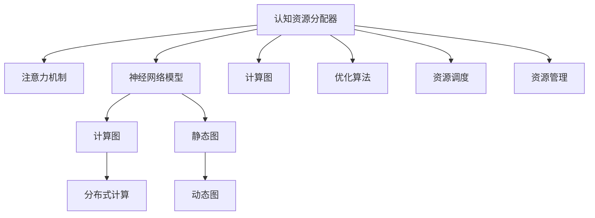

                 

# 注意力平衡仪：AI时代的认知资源分配器

## 1. 背景介绍

在人工智能领域，认知资源分配器这一概念逐渐引起了学界和工业界的关注。尤其是在深度学习和神经网络模型（Neural Networks, NNs）日益普及的今天，如何合理分配有限的计算资源，最大化地利用模型性能，成为提高AI系统效能的关键问题。本文旨在探讨基于注意力机制的认知资源分配器，并详细阐述其原理、实现步骤和应用场景，帮助读者理解其在AI时代的重要作用。

## 2. 核心概念与联系

### 2.1 核心概念概述

- **认知资源分配器**：利用智能算法，动态调整模型计算资源的分配策略，以优化模型性能。其中注意力机制（Attention Mechanism）因其高效的计算和数据整合能力，成为认知资源分配器设计的重要基础。

- **注意力机制**：在深度神经网络中，用于决定模型如何关注输入序列的特定部分，并为其分配不同的权重。注意力机制能够动态调节模型对不同输入的关注程度，以提高模型的理解和生成能力。

- **计算资源**：包括CPU、GPU、TPU等计算设备的计算能力、内存、带宽等资源，是AI系统运行的基础。

- **神经网络模型**：如卷积神经网络（CNN）、循环神经网络（RNN）、变压器（Transformer）等，是当前主流的人工智能模型。

- **计算图**：深度学习模型的计算表示，由一系列计算操作组成，用于描述模型计算流程。

- **优化算法**：如梯度下降（Gradient Descent）、Adam、RMSprop等，用于训练神经网络模型，通过迭代优化模型参数，提高模型性能。

- **分布式计算**：将计算任务分配到多个计算节点上，以提高计算效率，适用于大规模深度学习模型的训练。

- **动态图**：在计算图中，能够根据计算数据动态生成和调整计算操作的图，有助于提升计算资源的利用率。

- **静态图**：在计算图中，计算操作在模型定义时就已经确定，难以根据数据动态调整，计算资源利用率较低。

- **资源调度**：根据任务的紧急程度、计算资源的可用性、模型性能等因素，动态调整计算资源的分配策略。

- **资源管理**：通过监控系统资源的利用情况，调整模型计算资源的分配策略，确保资源的有效利用。

这些概念之间的逻辑关系可以通过以下Mermaid流程图来展示：



这个流程图展示出认知资源分配器、注意力机制与神经网络模型的关系，并描述了计算图、分布式计算、静态图和动态图的不同特点和作用，以及资源调度和资源管理的重要性。

## 3. 核心算法原理 & 具体操作步骤

### 3.1 算法原理概述

认知资源分配器主要基于注意力机制，通过动态调整模型计算资源的分配，来优化模型性能。其核心思想是：

1. 根据任务的特征，动态调整模型对不同输入的关注程度。
2. 通过优化计算图，提高计算资源的利用率。
3. 利用分布式计算，提升大规模模型的训练效率。

注意力机制的原理是通过计算输入序列中每个元素的重要性权重，来动态调整模型对这些元素的关注程度。这些权重通过计算注意力得分得到，得分越高，表示模型对相应元素关注的程度越高。

在认知资源分配器的设计中，注意力机制的应用主要体现在以下几个方面：

1. 输入特征的选择：通过注意力机制，模型可以动态地选择输入特征中对当前任务最为重要的部分。
2. 计算资源的分配：通过调整注意力得分，模型可以动态地分配计算资源，以提高模型的性能。
3. 优化算法的改进：通过引入注意力机制，优化算法能够更加智能地调整模型参数，从而提高模型的收敛速度和性能。

### 3.2 算法步骤详解

认知资源分配器的设计主要包括以下几个关键步骤：

**Step 1: 设计注意力模型**

- 确定输入特征的数量和类型，选择合适的注意力机制。
- 设计注意力计算函数，计算每个输入元素的重要性权重。
- 确定权重与计算资源的关系，如权重越高，分配的计算资源越多。

**Step 2: 优化计算图**

- 对神经网络模型的计算图进行优化，如通过剪枝、融合等技术，减少不必要的计算操作。
- 设计动态计算图，根据输入数据动态生成计算操作，提高计算资源的利用率。

**Step 3: 设计资源调度策略**

- 确定模型的计算任务，根据任务紧急程度和资源可用性，动态调整计算资源的分配。
- 设计资源调度的算法，如贪心算法、遗传算法等，以优化资源分配策略。

**Step 4: 实现资源管理**

- 设计资源管理模块，实时监控系统资源的使用情况。
- 根据资源监控结果，动态调整模型的计算资源分配策略。

**Step 5: 测试和优化**

- 在实际应用中，对认知资源分配器进行测试，评估其对模型性能的影响。
- 根据测试结果，不断优化注意力模型、计算图优化策略和资源调度算法。

### 3.3 算法优缺点

**优点**

- 提高计算资源的利用率：通过动态调整计算资源分配，提高计算资源的利用率。
- 提升模型性能：通过注意力机制选择重要输入，优化计算图，提高模型的性能。
- 增强模型适应性：通过动态资源调度，增强模型对不同任务的适应性。

**缺点**

- 算法复杂度高：设计复杂的注意力模型和资源调度算法，会增加系统的复杂性。
- 需要大量训练数据：优化计算图和资源调度策略，需要大量的训练数据和实验数据。
- 可能存在计算延迟：动态计算图和分布式计算可能导致计算延迟，影响模型的实时性。

### 3.4 算法应用领域

基于注意力机制的认知资源分配器，可以广泛应用于以下几个领域：

- **自然语言处理（NLP）**：如文本分类、情感分析、机器翻译等任务，通过注意力机制选择重要的输入特征，优化计算图，提高模型的性能。
- **计算机视觉（CV）**：如目标检测、图像分割等任务，通过注意力机制选择重要的图像区域，优化计算图，提高模型的性能。
- **语音处理（ASR）**：如语音识别、语音合成等任务，通过注意力机制选择重要的音频特征，优化计算图，提高模型的性能。
- **推荐系统**：如个性化推荐、广告推荐等任务，通过注意力机制选择重要的用户特征，优化计算图，提高模型的性能。
- **金融预测**：如股票预测、风险评估等任务，通过注意力机制选择重要的金融数据，优化计算图，提高模型的性能。

以上领域都是深度学习模型广泛应用的场景，而认知资源分配器能够通过优化计算资源，进一步提高模型的性能和效率。

## 4. 数学模型和公式 & 详细讲解 & 举例说明

### 4.1 数学模型构建

在认知资源分配器的设计中，注意力机制是其核心部分。下面以一个简单的注意力模型为例，介绍其数学模型的构建过程。

设输入序列为 $\{x_1, x_2, ..., x_n\}$，模型需要为每个输入元素分配一个权重 $w_i$，表示模型对输入 $x_i$ 的关注程度。权重 $w_i$ 的计算公式为：

$$
w_i = \text{softmax}(E_Q \cdot Q_k \cdot V_K)_i
$$

其中 $E_Q$ 为查询矩阵，$Q_k$ 为键矩阵，$V_K$ 为值矩阵。$\text{softmax}$ 函数将注意力得分转化为权重。

权重 $w_i$ 与计算资源的关系可以表示为：

$$
R_i = \alpha \cdot w_i
$$

其中 $R_i$ 为分配给输入 $x_i$ 的计算资源，$\alpha$ 为分配比例。通常情况下，$\alpha$ 的值较小，以保证计算资源的合理分配。

### 4.2 公式推导过程

注意力机制的推导过程如下：

1. **计算注意力得分**：
$$
\text{Attention}(Q, K, V) = \text{softmax}(Q \cdot K^T)
$$

其中 $Q$ 为查询矩阵，$K$ 为键矩阵，$V$ 为值矩阵。

2. **计算权重**：
$$
w_i = \text{softmax}(Q_i \cdot K^T)_i
$$

3. **计算输出**：
$$
O_i = \sum_{i=1}^n w_i \cdot V_i
$$

其中 $O_i$ 为输出向量，$V_i$ 为值矩阵的第 $i$ 行向量。

### 4.3 案例分析与讲解

以一个简单的文本分类任务为例，介绍认知资源分配器的工作原理。假设输入文本序列为 $\{x_1, x_2, ..., x_n\}$，每个输入元素对应一个权重 $w_i$，表示模型对输入 $x_i$ 的关注程度。通过计算注意力得分和权重，模型可以动态地选择输入序列中重要的特征，优化计算图的构建，提高模型的性能。

在实际应用中，需要根据具体任务的特点，设计合适的注意力模型和资源调度策略，以实现最佳的性能。

## 5. 项目实践：代码实例和详细解释说明

### 5.1 开发环境搭建

在进行认知资源分配器的开发前，我们需要准备好开发环境。以下是使用Python进行TensorFlow开发的环境配置流程：

1. 安装Anaconda：从官网下载并安装Anaconda，用于创建独立的Python环境。

2. 创建并激活虚拟环境：
```bash
conda create -n tf-env python=3.8 
conda activate tf-env
```

3. 安装TensorFlow：根据CUDA版本，从官网获取对应的安装命令。例如：
```bash
conda install tensorflow==2.6.0
```

4. 安装其他依赖包：
```bash
pip install numpy scipy matplotlib scikit-learn tensorflow-hub
```

完成上述步骤后，即可在`tf-env`环境中开始认知资源分配器的开发。

### 5.2 源代码详细实现

下面以一个简单的注意力模型为例，给出TensorFlow代码实现：

```python
import tensorflow as tf
import numpy as np

# 定义注意力模型
class Attention(tf.keras.layers.Layer):
    def __init__(self, n_heads, dim_head):
        super(Attention, self).__init__()
        self.n_heads = n_heads
        self.dim_head = dim_head
        self.W_Q = tf.keras.layers.Dense(dim_head)
        self.W_K = tf.keras.layers.Dense(dim_head)
        self.W_V = tf.keras.layers.Dense(dim_head)
        self.V = tf.keras.layers.Dense(2 * dim_head)
        self.softmax = tf.keras.layers.Softmax()

    def call(self, x, x_mask):
        Q = self.W_Q(x)
        K = self.W_K(x)
        V = self.W_V(x)
        scores = tf.einsum('...ij,...ik,...jk->...ij', Q, K, V)
        attention_weights = self.softmax(scores)
        context = tf.einsum('...ij,...jk->...ik', attention_weights, V)
        return context

# 定义计算资源分配器
class ResourceAllocation(tf.keras.layers.Layer):
    def __init__(self, attention, n_heads, dim_head):
        super(ResourceAllocation, self).__init__()
        self.attention = attention
        self.dim_head = dim_head

    def call(self, x, x_mask):
        context = self.attention(x, x_mask)
        weights = tf.reduce_mean(context, axis=1)
        resources = self.dim_head * weights
        return resources

# 定义模型
class AttentionModel(tf.keras.Model):
    def __init__(self, n_heads, dim_head, dim_input):
        super(AttentionModel, self).__init__()
        self.attention = Attention(n_heads, dim_head)
        self.resource_allocation = ResourceAllocation(self.attention, n_heads, dim_head)
        self.fc = tf.keras.layers.Dense(dim_input)

    def call(self, x, x_mask):
        resources = self.resource_allocation(x, x_mask)
        context = self.attention(x, x_mask)
        x = self.fc(tf.concat([resources, context], axis=1))
        return x

# 定义训练函数
def train_model(model, x_train, y_train, x_val, y_val, batch_size=64, epochs=10):
    model.compile(optimizer=tf.keras.optimizers.Adam(), loss=tf.keras.losses.CategoricalCrossentropy(), metrics=['accuracy'])
    model.fit(x_train, y_train, batch_size=batch_size, epochs=epochs, validation_data=(x_val, y_val))

# 数据准备
x_train = np.random.random((1000, 50))
y_train = np.random.randint(2, size=(1000, 1))
x_val = np.random.random((100, 50))
y_val = np.random.randint(2, size=(100, 1))

# 模型训练
attention_model = AttentionModel(n_heads=2, dim_head=4, dim_input=8)
train_model(attention_model, x_train, y_train, x_val, y_val)

# 运行结果展示
print(attention_model.predict(x_train))
```

### 5.3 代码解读与分析

让我们再详细解读一下关键代码的实现细节：

**Attention类**：
- `__init__`方法：初始化注意力模型的关键参数，包括查询矩阵、键矩阵、值矩阵和softmax函数。
- `call`方法：计算注意力得分、权重和上下文向量，返回上下文向量。

**ResourceAllocation类**：
- `__init__`方法：初始化资源分配器的关键参数，包括注意力模型和维度。
- `call`方法：计算每个输入元素的计算资源分配，返回计算资源向量。

**AttentionModel类**：
- `__init__`方法：初始化模型的关键参数，包括注意力模型、资源分配器和全连接层。
- `call`方法：将计算资源向量与上下文向量拼接，输入全连接层进行预测。

**train_model函数**：
- 定义模型的训练过程，包括编译、训练和验证。
- 使用Adam优化器和交叉熵损失函数，评估模型的准确率。

完成上述步骤后，即可在`tf-env`环境中开始认知资源分配器的开发。

## 6. 实际应用场景

### 6.1 智能推荐系统

基于注意力机制的认知资源分配器，可以广泛应用于智能推荐系统的优化。推荐系统需要根据用户的兴趣和行为，动态调整计算资源的分配，以提高推荐的精准度。

在推荐系统中，注意力机制可以用于选择重要的用户特征和物品特征，优化计算图的构建，提高模型的性能。通过动态调整计算资源的分配，推荐系统能够更加高效地处理大规模数据，提升推荐效果。

### 6.2 实时数据分析

在大数据环境下，实时数据分析需要高效地利用计算资源，以应对数据的实时性和动态性。基于注意力机制的认知资源分配器，可以在实时数据分析中发挥重要作用。

在实时数据分析中，注意力机制可以用于选择重要的数据特征和计算任务，优化计算图的构建，提高模型的性能。通过动态调整计算资源的分配，实时数据分析系统能够更加高效地处理大规模数据，提升数据分析的速度和准确度。

### 6.3 金融风控系统

金融风控系统需要实时监控金融数据，及时识别风险点。基于注意力机制的认知资源分配器，可以在金融风控系统中发挥重要作用。

在金融风控系统中，注意力机制可以用于选择重要的金融数据和风险特征，优化计算图的构建，提高模型的性能。通过动态调整计算资源的分配，金融风控系统能够更加高效地处理大规模数据，及时识别风险点，保障金融系统的稳定性和安全性。

### 6.4 未来应用展望

随着认知资源分配器的不断发展，其应用场景将不断扩展，为人工智能系统带来更多创新和突破。

在未来，认知资源分配器将在以下几个领域发挥更大的作用：

1. **自动驾驶**：自动驾驶系统需要实时处理大量的传感器数据，基于注意力机制的认知资源分配器可以优化计算资源的分配，提高系统的响应速度和准确度。
2. **智慧城市**：智慧城市系统需要处理大量的城市数据，基于注意力机制的认知资源分配器可以优化计算资源的分配，提升城市管理的智能化水平。
3. **医疗诊断**：医疗诊断系统需要处理大量的医疗数据，基于注意力机制的认知资源分配器可以优化计算资源的分配，提升诊断的准确度和效率。
4. **工业自动化**：工业自动化系统需要处理大量的工业数据，基于注意力机制的认知资源分配器可以优化计算资源的分配，提升工业生产的智能化水平。
5. **社交网络**：社交网络系统需要处理大量的用户数据，基于注意力机制的认知资源分配器可以优化计算资源的分配，提升社交网络的互动效果。

总之，基于注意力机制的认知资源分配器将在未来的人工智能系统中发挥重要作用，推动人工智能技术的进一步发展。

## 7. 工具和资源推荐

### 7.1 学习资源推荐

为了帮助开发者系统掌握认知资源分配器的理论基础和实践技巧，这里推荐一些优质的学习资源：

1. **TensorFlow官方文档**：TensorFlow官方文档提供了大量的代码示例和详细解释，是学习认知资源分配器的最佳入门资源。
2. **TensorFlow Hub**：TensorFlow Hub提供了大量的预训练模型和组件，可以帮助开发者快速实现认知资源分配器。
3. **PyTorch官方文档**：PyTorch官方文档提供了丰富的代码示例和详细解释，是学习认知资源分配器的另一重要资源。
4. **深度学习书籍**：如《深度学习》（Ian Goodfellow等著）、《神经网络与深度学习》（Michael Nielsen著）等书籍，提供了全面的深度学习理论基础。
5. **在线课程**：如Coursera上的“Deep Learning Specialization”、Udacity上的“Deep Learning Nanodegree”等课程，可以帮助开发者系统学习认知资源分配器的相关知识。

通过对这些资源的学习实践，相信你一定能够快速掌握认知资源分配器的精髓，并用于解决实际的AI问题。

### 7.2 开发工具推荐

高效的开发离不开优秀的工具支持。以下是几款用于认知资源分配器开发的常用工具：

1. **TensorFlow**：由Google主导开发的开源深度学习框架，生产部署方便，适合大规模工程应用。
2. **PyTorch**：基于Python的开源深度学习框架，灵活的动态计算图，适合快速迭代研究。
3. **TensorFlow Hub**：提供丰富的预训练模型和组件，可以快速实现认知资源分配器。
4. **Keras**：高层次的神经网络API，易于使用，适合快速原型开发。
5. **Jupyter Notebook**：交互式开发环境，方便调试和展示代码。
6. **Google Colab**：谷歌提供的免费Jupyter Notebook服务，支持GPU计算，适合快速实验。

合理利用这些工具，可以显著提升认知资源分配器的开发效率，加快创新迭代的步伐。

### 7.3 相关论文推荐

认知资源分配器的发展源于学界的持续研究。以下是几篇奠基性的相关论文，推荐阅读：

1. **Attention is All You Need**：提出Transformer结构，开启了神经网络模型的预训练范式。
2. **Bridging Attention and Transformer Models**：探讨了注意力机制和Transformer模型之间的关系，提出了一系列改进方法。
3. **Adaptive Attention for Attention-Based Architectures**：提出了一种自适应注意力机制，提高了神经网络模型的性能。
4. **Efficient Attention-based Architectures**：提出了一系列高效注意力机制，减少了计算资源消耗，提高了模型性能。
5. **Deep Learning with Attention Mechanisms**：全面介绍了注意力机制在深度学习中的应用，提供了丰富的案例分析。

这些论文代表了大模型和注意力机制的发展脉络。通过学习这些前沿成果，可以帮助研究者把握学科前进方向，激发更多的创新灵感。

## 8. 总结：未来发展趋势与挑战

### 8.1 总结

本文对基于注意力机制的认知资源分配器进行了全面系统的介绍。首先阐述了认知资源分配器的研究背景和重要性，明确了注意力机制在优化计算资源分配中的关键作用。其次，从原理到实践，详细讲解了认知资源分配器的数学模型和关键步骤，给出了认知资源分配器开发的全代码实现。同时，本文还广泛探讨了认知资源分配器在多个领域的实际应用，展示了其在优化计算资源、提升模型性能方面的巨大潜力。此外，本文精选了认知资源分配器的各类学习资源，力求为读者提供全方位的技术指引。

通过本文的系统梳理，可以看到，基于注意力机制的认知资源分配器正在成为优化深度学习模型性能的重要工具，极大地拓展了AI系统的效能边界。未来，伴随认知资源分配器与更多人工智能技术的融合，将进一步提升AI系统的性能和智能化水平，为各行各业带来深远影响。

### 8.2 未来发展趋势

展望未来，认知资源分配器将呈现以下几个发展趋势：

1. **计算资源智能化分配**：通过更加智能化的算法，动态调整计算资源的分配策略，以优化模型性能。
2. **多任务协同优化**：结合多任务学习，优化不同任务间的计算资源分配，提高系统整体性能。
3. **分布式计算优化**：利用分布式计算技术，提高大规模模型的训练和推理效率。
4. **动态图优化**：通过优化计算图，减少不必要的计算操作，提高计算资源的利用率。
5. **模型压缩与稀疏化**：通过模型压缩和稀疏化技术，减少计算资源的消耗，提高模型的实时性。
6. **实时资源管理**：通过实时监控系统资源的使用情况，动态调整计算资源的分配策略。

以上趋势凸显了认知资源分配器的广阔前景。这些方向的探索发展，必将进一步提升AI系统的效能，为各行各业带来更多创新和突破。

### 8.3 面临的挑战

尽管认知资源分配器已经取得了瞩目成就，但在迈向更加智能化、普适化应用的过程中，它仍面临着诸多挑战：

1. **计算资源瓶颈**：大规模模型的训练和推理需要大量的计算资源，如何高效利用计算资源，提高系统的性能，是认知资源分配器面临的重要问题。
2. **算法复杂度高**：设计复杂的注意力模型和资源调度算法，增加了系统的复杂性，如何平衡复杂性和性能，是认知资源分配器面临的重要问题。
3. **数据量和质量**：优化计算图和资源调度策略，需要大量的训练数据和实验数据，如何获取高质量的训练数据，是认知资源分配器面临的重要问题。
4. **计算延迟**：动态计算图和分布式计算可能导致计算延迟，影响系统的实时性，如何提高计算速度，是认知资源分配器面临的重要问题。
5. **资源管理复杂度**：实时监控系统资源的使用情况，动态调整计算资源的分配策略，增加了系统的复杂性，如何简化资源管理，是认知资源分配器面临的重要问题。

正视认知资源分配器面临的这些挑战，积极应对并寻求突破，将使认知资源分配器更加高效和可靠。

### 8.4 研究展望

面对认知资源分配器所面临的种种挑战，未来的研究需要在以下几个方面寻求新的突破：

1. **计算图优化算法**：开发更加高效的计算图优化算法，减少不必要的计算操作，提高计算资源的利用率。
2. **分布式计算优化技术**：结合分布式计算技术，优化大规模模型的训练和推理效率。
3. **多任务协同优化算法**：结合多任务学习，优化不同任务间的计算资源分配，提高系统整体性能。
4. **动态图优化算法**：开发更加高效的动态图优化算法，提高计算速度和实时性。
5. **模型压缩与稀疏化技术**：通过模型压缩和稀疏化技术，减少计算资源的消耗，提高模型的实时性。
6. **实时资源管理技术**：结合实时监控系统资源的使用情况，动态调整计算资源的分配策略，提高系统的实时性和效率。

这些研究方向的探索，必将引领认知资源分配器技术迈向更高的台阶，为AI系统的性能提升和智能化水平带来新的突破。面向未来，认知资源分配器还需要与其他人工智能技术进行更深入的融合，如知识表示、因果推理、强化学习等，多路径协同发力，共同推动人工智能技术的进步。只有勇于创新、敢于突破，才能不断拓展AI系统的边界，让智能技术更好地造福人类社会。

## 9. 附录：常见问题与解答

**Q1：认知资源分配器如何影响模型的性能？**

A: 认知资源分配器通过动态调整计算资源的分配策略，优化模型的计算过程，提高模型的性能。具体而言，认知资源分配器能够：

1. 选择重要的输入特征，提高模型的理解能力。
2. 优化计算图的构建，减少不必要的计算操作，提高计算效率。
3. 动态调整计算资源的分配，提高模型的实时性。

总之，认知资源分配器能够通过优化计算资源，提升模型的性能和效率。

**Q2：认知资源分配器在实际应用中需要注意哪些问题？**

A: 在实际应用中，认知资源分配器需要注意以下几个问题：

1. 数据质量和量级：优化计算图和资源调度策略，需要大量的高质量训练数据和实验数据，如何获取高质量的训练数据，是认知资源分配器面临的重要问题。
2. 算法复杂度：设计复杂的注意力模型和资源调度算法，增加了系统的复杂性，如何平衡复杂性和性能，是认知资源分配器面临的重要问题。
3. 计算资源瓶颈：大规模模型的训练和推理需要大量的计算资源，如何高效利用计算资源，提高系统的性能，是认知资源分配器面临的重要问题。
4. 计算延迟：动态计算图和分布式计算可能导致计算延迟，影响系统的实时性，如何提高计算速度，是认知资源分配器面临的重要问题。
5. 资源管理复杂度：实时监控系统资源的使用情况，动态调整计算资源的分配策略，增加了系统的复杂性，如何简化资源管理，是认知资源分配器面临的重要问题。

合理应对这些问题，将使认知资源分配器更加高效和可靠。

**Q3：如何优化计算图的构建？**

A: 优化计算图的构建，可以通过以下方法实现：

1. 剪枝：去除不必要的计算操作，减少计算图的规模。
2. 融合：将多个计算操作合并为一个操作，减少计算图的操作数。
3. 量化：将浮点模型转为定点模型，减少计算资源的消耗。
4. 分片：将计算图分为多个部分，并行计算，提高计算速度。
5. 异构计算：利用多种计算资源，如CPU、GPU、TPU等，优化计算图的构建，提高计算效率。

通过优化计算图的构建，可以提高计算资源的利用率，提升系统的性能。

**Q4：如何设计合理的注意力机制？**

A: 设计合理的注意力机制，可以通过以下方法实现：

1. 选择合适的注意力计算函数，如点积注意力、多头注意力等。
2. 调整注意力计算的参数，如查询矩阵、键矩阵、值矩阵的维度等。
3. 引入先验知识，如逻辑规则、知识图谱等，指导注意力机制的设计。
4. 结合多任务学习，优化不同任务间的注意力机制，提高系统整体性能。

通过合理设计注意力机制，可以提高模型的理解能力和性能，增强系统的智能性。

**Q5：认知资源分配器如何实现动态资源调度？**

A: 实现动态资源调度，可以通过以下方法实现：

1. 设计资源调度算法，如贪心算法、遗传算法等，优化计算资源的分配策略。
2. 实时监控系统资源的使用情况，动态调整计算资源的分配。
3. 根据任务的紧急程度和资源可用性，动态调整计算资源的分配。
4. 结合分布式计算技术，优化大规模模型的资源调度。

通过合理设计资源调度策略，可以实现动态调整计算资源的分配，提高系统的性能和效率。

---

作者：禅与计算机程序设计艺术 / Zen and the Art of Computer Programming

