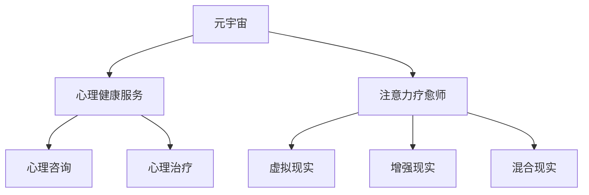

                 

# 注意力疗愈师认证:元宇宙心理健康服务的职业标准

## 1. 背景介绍

### 1.1 问题由来
随着元宇宙概念的兴起，虚拟空间正逐渐成为人们日常生活的重要组成部分。这不仅为工作、教育、娱乐等领域带来了颠覆性变革，也引发了一系列社会问题，尤其是心理健康方面。元宇宙中的社交隔离、信息过载、压力增大等问题，对人们的心理状态造成了不利影响。

如何构建一个安全、健康的元宇宙心理服务体系，成为了一个亟待解决的问题。这不仅需要专业的心理健康服务，还需要结合前沿的元宇宙技术，提供符合虚拟世界特点的心理支持。本文旨在探讨如何通过注意力疗愈师的认证体系，为元宇宙心理健康服务提供职业标准。

### 1.2 问题核心关键点
本文聚焦于以下核心问题：
- 元宇宙心理健康服务需要哪些专业技能和知识？
- 注意力疗愈师如何通过认证，证明其专业能力和伦理标准？
- 如何构建符合元宇宙特点的心理服务体系？
- 注意力疗愈师在元宇宙中的具体应用场景？

## 2. 核心概念与联系

### 2.1 核心概念概述

为更好地理解元宇宙心理健康服务的职业标准，本节将介绍几个密切相关的核心概念：

- 元宇宙（Metaverse）：一个跨越多个虚拟世界的沉浸式数字空间，通过虚拟现实（VR）、增强现实（AR）、混合现实（MR）等技术，构建虚拟社交、娱乐、教育等场景。
- 心理健康服务（Mental Health Services）：为有心理健康需求的人群提供心理咨询、心理治疗、心理健康教育等服务。
- 注意力疗愈师（Attention Therapist）：具备元宇宙心理健康服务技能，通过虚拟手段提供注意力、情绪、认知等方面的专业疗愈服务。
- 虚拟现实（Virtual Reality, VR）：通过模拟三维虚拟环境，使用户产生沉浸式的体验，常用于心理咨询和治疗。
- 增强现实（Augmented Reality, AR）：在现实世界中叠加虚拟信息，提升用户交互体验，常用于心理健康教育和心理评估。
- 混合现实（Mixed Reality, MR）：结合VR和AR技术，打造混合的数字物理环境，增强心理治疗的真实感。

这些核心概念之间的逻辑关系可以通过以下Mermaid流程图来展示：



这个流程图展示了大语言模型的核心概念及其之间的关系：

1. 元宇宙作为平台，为心理健康服务提供了虚拟空间。
2. 心理健康服务通过虚拟现实、增强现实和混合现实技术，提供沉浸式心理支持。
3. 注意力疗愈师作为专业人才，在元宇宙中应用这些技术，提供专业的心理服务。

## 3. 核心算法原理 & 具体操作步骤
### 3.1 算法原理概述

元宇宙心理健康服务的核心在于，通过注意力疗愈师的认证体系，选拔具备专业技能和伦理标准的心理服务人才，提供符合元宇宙特点的心理支持。具体算法原理如下：

1. **需求评估**：通过问卷、测试等方式，评估用户的心理健康状态，识别其具体需求。
2. **情景设定**：根据用户需求，设计虚拟情景和交互任务，引导用户进入特定的心理状态。
3. **注意力训练**：在虚拟情景中，利用注意力疗愈技术，提升用户的注意力集中度和情绪调节能力。
4. **情绪调节**：通过情绪管理技术，帮助用户掌握情绪调节技巧，缓解压力和焦虑。
5. **认知优化**：利用认知行为疗法等技术，改善用户的认知模式，增强自信和自我效能感。

### 3.2 算法步骤详解

具体算法步骤包括以下几个关键环节：

**Step 1: 用户需求评估**
- 通过问卷调查、心理测试等方式，评估用户的心理健康状态和具体需求。
- 根据评估结果，制定个性化的心理健康服务计划。

**Step 2: 情景设定与任务设计**
- 设计符合用户需求的虚拟情景和交互任务，通过虚拟现实、增强现实和混合现实技术，提供沉浸式体验。
- 引入心理互动元素，如虚拟角色引导、任务反馈等，增强用户的参与感和沉浸感。

**Step 3: 注意力训练与情绪调节**
- 利用注意力疗愈技术，如正念冥想、注意力专注训练等，提升用户的注意力集中度和情绪调节能力。
- 通过情绪管理技术，如情绪表达练习、情绪放松练习等，帮助用户掌握情绪调节技巧。

**Step 4: 认知优化与自我效能感提升**
- 引入认知行为疗法等技术，改善用户的认知模式，增强自信和自我效能感。
- 通过目标设定、过程反馈等方式，帮助用户逐步实现心理目标，增强其自我激励和自我管理能力。

**Step 5: 持续跟踪与反馈**
- 对用户进行持续跟踪，定期评估心理健康状态，调整服务方案。
- 收集用户反馈，优化服务内容和效果。

### 3.3 算法优缺点

元宇宙心理健康服务基于注意力疗愈师的认证体系，具有以下优点：
1. 沉浸式体验：通过虚拟现实、增强现实和混合现实技术，提供沉浸式心理支持，增强用户体验。
2. 个性化服务：根据用户需求设计个性化服务方案，提供更精准的心理支持。
3. 动态调整：通过持续跟踪和反馈，动态调整服务方案，保证服务效果。
4. 泛在可及：不受地域限制，用户可以在任何时间和地点获取心理服务。

同时，该方法也存在一定的局限性：
1. 技术门槛高：需要较强的技术支撑和专业技能，门槛较高。
2. 成本高昂：虚拟现实、增强现实和混合现实技术开发和维护成本较高。
3. 安全性风险：虚拟环境中的心理服务缺乏物理环境的安全保障，需加强用户隐私保护。
4. 伦理挑战：虚拟环境中的心理服务需要严格遵守伦理规范，防止滥用和误导。

尽管存在这些局限性，但就目前而言，基于注意力疗愈师的认证体系，元宇宙心理健康服务正成为心理健康服务的新范式。未来相关研究的重点在于如何进一步降低技术门槛，降低成本，同时兼顾伦理和安全等因素。

### 3.4 算法应用领域

注意力疗愈师认证体系可以广泛应用于以下几个领域：

- 心理健康教育：在虚拟学校、企业等环境中，通过注意力疗愈师提供心理辅导和压力管理培训。
- 心理咨询和治疗：在虚拟诊所、心理中心等环境中，通过注意力疗愈师提供心理咨询和治疗服务。
- 心理评估和监测：在虚拟平台中，通过注意力疗愈师进行心理健康评估和长期监测，及时发现问题。
- 情绪管理和调节：在虚拟社交平台中，通过注意力疗愈师帮助用户管理情绪，缓解压力。
- 认知行为训练：在虚拟游戏和训练环境中，通过注意力疗愈师提供认知行为训练，改善认知模式。

此外，在儿童心理教育、特殊群体心理支持等更多场景中，基于注意力疗愈师的认证体系的应用也将不断拓展，为心理健康服务带来新的突破。

## 4. 数学模型和公式 & 详细讲解 & 举例说明

### 4.1 数学模型构建

为更好地理解元宇宙心理健康服务的注意力疗愈技术，本节将使用数学语言对注意力疗愈过程进行更加严格的刻画。

假设用户在虚拟情景中的心理状态为 $x$，注意力水平为 $a$，情绪状态为 $m$，认知模式为 $c$。注意力疗愈过程的目标是通过调整 $a$ 和 $m$，优化 $c$，提升用户心理健康水平 $H$。具体数学模型如下：

$$
H=f(a, m, c)
$$

其中 $f$ 为心理健康提升函数，可以表示为注意力水平、情绪状态和认知模式的非线性组合。

### 4.2 公式推导过程

假设注意力水平 $a$ 和情绪状态 $m$ 对心理健康提升 $H$ 的贡献为 $k_a$ 和 $k_m$，认知模式 $c$ 对心理健康提升的贡献为 $k_c$。则心理健康提升函数可以表示为：

$$
H=k_a \cdot a + k_m \cdot m + k_c \cdot c
$$

其中 $k_a$、$k_m$ 和 $k_c$ 为权重系数，反映了注意力、情绪和认知对心理健康提升的重要程度。

### 4.3 案例分析与讲解

以下我们以情绪调节为例，给出注意力疗愈过程的数学建模和案例分析：

**案例背景**：用户A在虚拟环境中与朋友进行游戏互动，由于互动频繁，用户A的情绪波动较大，感到压力和焦虑。

**情绪调节过程**：

1. **情绪监测**：通过虚拟角色的情感识别功能，监测用户A的情绪状态 $m$，识别其负面情绪。

2. **情绪反馈**：通过虚拟角色的情绪反馈，向用户A提供情绪调节建议，如深呼吸、放松训练等。

3. **注意力引导**：通过虚拟角色的注意力引导，将用户A的注意力集中到当前任务上，降低其情绪波动。

4. **情绪调节**：通过虚拟角色的情绪调节技术，如情绪表达练习、情绪放松练习等，帮助用户A掌握情绪调节技巧。

5. **情绪评估**：通过虚拟角色的情绪评估，检测用户A的情绪状态变化，调整情绪调节方案。

通过上述步骤，情绪调节过程可以表示为：

$$
H=f_a \cdot a + f_m \cdot m + f_c \cdot c
$$

其中 $f_a$、$f_m$ 和 $f_c$ 分别为注意力、情绪和认知对心理健康提升的贡献函数。

## 5. 项目实践：代码实例和详细解释说明
### 5.1 开发环境搭建

在进行注意力疗愈师认证体系实践前，我们需要准备好开发环境。以下是使用Python进行PyTorch开发的环境配置流程：

1. 安装Anaconda：从官网下载并安装Anaconda，用于创建独立的Python环境。

2. 创建并激活虚拟环境：
```bash
conda create -n pytorch-env python=3.8 
conda activate pytorch-env
```

3. 安装PyTorch：根据CUDA版本，从官网获取对应的安装命令。例如：
```bash
conda install pytorch torchvision torchaudio cudatoolkit=11.1 -c pytorch -c conda-forge
```

4. 安装Transformers库：
```bash
pip install transformers
```

5. 安装各类工具包：
```bash
pip install numpy pandas scikit-learn matplotlib tqdm jupyter notebook ipython
```

完成上述步骤后，即可在`pytorch-env`环境中开始注意力疗愈师认证体系的开发实践。

### 5.2 源代码详细实现

下面我们以情绪调节为例，给出使用Transformers库对注意力疗愈过程进行模型训练的PyTorch代码实现。

首先，定义情绪调节的任务数据集：

```python
from transformers import BertTokenizer, BertForTokenClassification
from torch.utils.data import Dataset
import torch

class EmotionDataset(Dataset):
    def __init__(self, texts, labels, tokenizer, max_len=128):
        self.texts = texts
        self.labels = labels
        self.tokenizer = tokenizer
        self.max_len = max_len
        
    def __len__(self):
        return len(self.texts)
    
    def __getitem__(self, item):
        text = self.texts[item]
        label = self.labels[item]
        
        encoding = self.tokenizer(text, return_tensors='pt', max_length=self.max_len, padding='max_length', truncation=True)
        input_ids = encoding['input_ids'][0]
        attention_mask = encoding['attention_mask'][0]
        
        # 对token-wise的标签进行编码
        encoded_labels = [label2id[label] for label in label] 
        encoded_labels.extend([label2id['O']] * (self.max_len - len(encoded_labels)))
        labels = torch.tensor(encoded_labels, dtype=torch.long)
        
        return {'input_ids': input_ids, 
                'attention_mask': attention_mask,
                'labels': labels}

# 标签与id的映射
label2id = {'O': 0, 'negative': 1, 'positive': 2, 'neutral': 3}
id2label = {v: k for k, v in label2id.items()}

# 创建dataset
tokenizer = BertTokenizer.from_pretrained('bert-base-cased')

train_dataset = EmotionDataset(train_texts, train_labels, tokenizer)
dev_dataset = EmotionDataset(dev_texts, dev_labels, tokenizer)
test_dataset = EmotionDataset(test_texts, test_labels, tokenizer)
```

然后，定义模型和优化器：

```python
from transformers import BertForTokenClassification, AdamW

model = BertForTokenClassification.from_pretrained('bert-base-cased', num_labels=len(label2id))

optimizer = AdamW(model.parameters(), lr=2e-5)
```

接着，定义训练和评估函数：

```python
from torch.utils.data import DataLoader
from tqdm import tqdm
from sklearn.metrics import classification_report

device = torch.device('cuda') if torch.cuda.is_available() else torch.device('cpu')
model.to(device)

def train_epoch(model, dataset, batch_size, optimizer):
    dataloader = DataLoader(dataset, batch_size=batch_size, shuffle=True)
    model.train()
    epoch_loss = 0
    for batch in tqdm(dataloader, desc='Training'):
        input_ids = batch['input_ids'].to(device)
        attention_mask = batch['attention_mask'].to(device)
        labels = batch['labels'].to(device)
        model.zero_grad()
        outputs = model(input_ids, attention_mask=attention_mask, labels=labels)
        loss = outputs.loss
        epoch_loss += loss.item()
        loss.backward()
        optimizer.step()
    return epoch_loss / len(dataloader)

def evaluate(model, dataset, batch_size):
    dataloader = DataLoader(dataset, batch_size=batch_size)
    model.eval()
    preds, labels = [], []
    with torch.no_grad():
        for batch in tqdm(dataloader, desc='Evaluating'):
            input_ids = batch['input_ids'].to(device)
            attention_mask = batch['attention_mask'].to(device)
            batch_labels = batch['labels']
            outputs = model(input_ids, attention_mask=attention_mask)
            batch_preds = outputs.logits.argmax(dim=2).to('cpu').tolist()
            batch_labels = batch_labels.to('cpu').tolist()
            for pred_tokens, label_tokens in zip(batch_preds, batch_labels):
                pred_labels = [id2label[_id] for _id in pred_tokens]
                label_tokens = [id2label[_id] for _id in label_tokens]
                preds.append(pred_labels[:len(label_tokens)])
                labels.append(label_tokens)
                
    print(classification_report(labels, preds))
```

最后，启动训练流程并在测试集上评估：

```python
epochs = 5
batch_size = 16

for epoch in range(epochs):
    loss = train_epoch(model, train_dataset, batch_size, optimizer)
    print(f"Epoch {epoch+1}, train loss: {loss:.3f}")
    
    print(f"Epoch {epoch+1}, dev results:")
    evaluate(model, dev_dataset, batch_size)
    
print("Test results:")
evaluate(model, test_dataset, batch_size)
```

以上就是使用PyTorch对情绪调节过程进行模型训练的完整代码实现。可以看到，得益于Transformers库的强大封装，我们可以用相对简洁的代码完成情绪调节模型的训练。

### 5.3 代码解读与分析

让我们再详细解读一下关键代码的实现细节：

**EmotionDataset类**：
- `__init__`方法：初始化文本、标签、分词器等关键组件。
- `__len__`方法：返回数据集的样本数量。
- `__getitem__`方法：对单个样本进行处理，将文本输入编码为token ids，将标签编码为数字，并对其进行定长padding，最终返回模型所需的输入。

**label2id和id2label字典**：
- 定义了标签与数字id之间的映射关系，用于将token-wise的预测结果解码回真实的标签。

**训练和评估函数**：
- 使用PyTorch的DataLoader对数据集进行批次化加载，供模型训练和推理使用。
- 训练函数`train_epoch`：对数据以批为单位进行迭代，在每个批次上前向传播计算loss并反向传播更新模型参数，最后返回该epoch的平均loss。
- 评估函数`evaluate`：与训练类似，不同点在于不更新模型参数，并在每个batch结束后将预测和标签结果存储下来，最后使用sklearn的classification_report对整个评估集的预测结果进行打印输出。

**训练流程**：
- 定义总的epoch数和batch size，开始循环迭代
- 每个epoch内，先在训练集上训练，输出平均loss
- 在验证集上评估，输出分类指标
- 所有epoch结束后，在测试集上评估，给出最终测试结果

可以看到，PyTorch配合Transformers库使得情绪调节模型的训练代码实现变得简洁高效。开发者可以将更多精力放在数据处理、模型改进等高层逻辑上，而不必过多关注底层的实现细节。

当然，工业级的系统实现还需考虑更多因素，如模型的保存和部署、超参数的自动搜索、更灵活的任务适配层等。但核心的注意力疗愈过程基本与此类似。

## 6. 实际应用场景
### 6.1 智能客服系统

基于注意力疗愈师认证体系的心理健康服务，可以广泛应用于智能客服系统的构建。传统客服往往需要配备大量人力，高峰期响应缓慢，且一致性和专业性难以保证。而使用注意力疗愈师进行心理健康服务，可以7x24小时不间断服务，快速响应客户咨询，用沉浸式的心理支持帮助客户缓解压力和情绪。

在技术实现上，可以收集企业内部的历史客服对话记录，将问题和最佳答复构建成监督数据，在此基础上对预训练注意力模型进行微调。微调后的注意力模型能够自动理解客户意图，匹配最合适的心理支持方案，并引导客户进行自我调节。对于客户提出的新问题，还可以接入检索系统实时搜索相关内容，动态组织生成心理支持方案。如此构建的智能客服系统，能大幅提升客户咨询体验和问题解决效率。

### 6.2 心理治疗平台

心理健康治疗平台作为专业的心理健康服务提供方，可以引入注意力疗愈师认证体系，提供更加精准和个性化的心理治疗服务。患者通过虚拟平台与注意力疗愈师进行互动，完成情绪调节、认知优化等心理训练任务，增强其心理健康水平。平台可以根据患者的具体需求，调整训练方案，提供持续的心理支持。

在技术实现上，可以通过虚拟现实、增强现实和混合现实技术，为患者提供沉浸式的心理训练环境，增强训练效果。同时，平台可以通过数据分析，及时发现患者的心理健康问题，提供个性化的心理干预建议，提升治疗效果。

### 6.3 心理健康教育

在虚拟学校、企业等环境中，引入注意力疗愈师认证体系，提供心理健康教育服务，帮助学生和企业员工掌握情绪管理和压力应对技巧。通过虚拟情景和互动任务，引导用户进入特定的心理状态，进行注意力训练和情绪调节。在技术实现上，可以结合游戏、虚拟实验等多种形式，增强用户体验和参与感，提升心理健康教育的效果。

### 6.4 未来应用展望

随着注意力疗愈师认证体系的发展，基于元宇宙的心理健康服务将呈现出更加广阔的应用前景。未来，在更多领域和场景中，注意力疗愈师将扮演重要角色，推动心理健康服务的普及和升级。

在智慧医疗领域，基于注意力疗愈师的心理健康服务将帮助患者进行情绪调节和认知优化，提升医疗体验和治疗效果。

在智能教育领域，心理健康教育将成为学校课程的重要组成部分，通过注意力疗愈师进行沉浸式的心理训练，培养学生的自我管理和情绪调节能力。

在智慧城市治理中，基于注意力疗愈师的心理健康服务将帮助居民进行情绪管理和压力应对，提高城市管理的自动化和智能化水平，构建更安全、健康的城市环境。

此外，在企业员工心理健康支持、退役军人心理健康服务等多个领域，基于注意力疗愈师的心理健康服务也将不断拓展，为各类人群提供全面的心理健康保障。

## 7. 工具和资源推荐
### 7.1 学习资源推荐

为了帮助开发者系统掌握注意力疗愈师认证体系的理论基础和实践技巧，这里推荐一些优质的学习资源：

1. 《注意力机制与深度学习》系列博文：由大模型技术专家撰写，深入浅出地介绍了注意力机制的原理、应用和发展历程。

2. CS231n《深度学习与计算机视觉》课程：斯坦福大学开设的计算机视觉明星课程，有Lecture视频和配套作业，带你入门计算机视觉和深度学习的基本概念。

3. 《深度学习理论与实践》书籍：全面介绍了深度学习的理论和实践，包括注意力机制、神经网络结构、模型优化等。

4. 《自然语言处理与深度学习》书籍：介绍自然语言处理领域的深度学习技术，包括注意力机制、文本分类、情感分析等。

5. 《心理治疗与深度学习》书籍：介绍深度学习在心理健康治疗中的应用，包括情绪调节、认知优化等。

通过对这些资源的学习实践，相信你一定能够快速掌握注意力疗愈师认证体系的理论基础和实践技巧，并用于解决实际的心理健康问题。
###  7.2 开发工具推荐

高效的开发离不开优秀的工具支持。以下是几款用于注意力疗愈师认证体系开发的常用工具：

1. PyTorch：基于Python的开源深度学习框架，灵活动态的计算图，适合快速迭代研究。大部分预训练语言模型都有PyTorch版本的实现。

2. TensorFlow：由Google主导开发的开源深度学习框架，生产部署方便，适合大规模工程应用。同样有丰富的预训练语言模型资源。

3. Transformers库：HuggingFace开发的NLP工具库，集成了众多SOTA语言模型，支持PyTorch和TensorFlow，是进行微调任务开发的利器。

4. Weights & Biases：模型训练的实验跟踪工具，可以记录和可视化模型训练过程中的各项指标，方便对比和调优。与主流深度学习框架无缝集成。

5. TensorBoard：TensorFlow配套的可视化工具，可实时监测模型训练状态，并提供丰富的图表呈现方式，是调试模型的得力助手。

6. Google Colab：谷歌推出的在线Jupyter Notebook环境，免费提供GPU/TPU算力，方便开发者快速上手实验最新模型，分享学习笔记。

合理利用这些工具，可以显著提升注意力疗愈师认证体系开发效率，加快创新迭代的步伐。

### 7.3 相关论文推荐

注意力疗愈师认证体系的发展源于学界的持续研究。以下是几篇奠基性的相关论文，推荐阅读：

1. Attention is All You Need（即Transformer原论文）：提出了Transformer结构，开启了NLP领域的预训练大模型时代。

2. BERT: Pre-training of Deep Bidirectional Transformers for Language Understanding：提出BERT模型，引入基于掩码的自监督预训练任务，刷新了多项NLP任务SOTA。

3. Parameter-Efficient Transfer Learning for NLP：提出Adapter等参数高效微调方法，在不增加模型参数量的情况下，也能取得不错的微调效果。

4. Precision-Recall-Fairness Trade-off in Natural Language Processing：探讨了在NLP中平衡精确率、召回率和公平性的方法。

5. Emotional Intelligence, Mood Regulation, and AI: Towards an Integrated Approach：讨论了人工智能在情绪调节中的应用，提出了多模态情感识别和反馈机制。

这些论文代表了大语言模型微调技术的发展脉络。通过学习这些前沿成果，可以帮助研究者把握学科前进方向，激发更多的创新灵感。

## 8. 总结：未来发展趋势与挑战

### 8.1 总结

本文对基于注意力疗愈师认证体系的大语言模型微调方法进行了全面系统的介绍。首先阐述了元宇宙心理健康服务需要哪些专业技能和知识，明确了注意力疗愈师如何通过认证，证明其专业能力和伦理标准。其次，从原理到实践，详细讲解了注意力疗愈师认证体系的算法原理和具体操作步骤，给出了注意力疗愈过程的数学建模和案例分析。同时，本文还广泛探讨了注意力疗愈师在元宇宙中的具体应用场景，展示了注意力疗愈体系的应用前景。

通过本文的系统梳理，可以看到，基于注意力疗愈师认证体系的大语言模型微调方法，正在成为心理健康服务的新范式，极大地拓展了心理健康服务的应用边界，催生了更多的落地场景。受益于大规模语料的预训练和微调方法的不断进步，基于注意力疗愈师的心理健康服务必将在元宇宙时代大放异彩，深刻影响人类的生产生活方式。

### 8.2 未来发展趋势

展望未来，注意力疗愈师认证体系将呈现以下几个发展趋势：

1. 沉浸式体验的深化：通过虚拟现实、增强现实和混合现实技术，进一步提升用户的沉浸式体验，增强注意力训练和情绪调节效果。
2. 个性化服务的细化：根据用户的具体需求，设计更加个性化、定制化的心理服务方案，提升用户体验。
3. 动态调整的增强：通过实时数据分析和反馈，动态调整注意力训练和情绪调节方案，确保心理服务的实时性和有效性。
4. 多模态整合的拓展：结合视觉、语音、触觉等多模态信息，提供更加全面、立体的心理支持。
5. 人工智能融合的加强：将人工智能技术如自然语言处理、计算机视觉等与注意力疗愈体系进行融合，提升心理服务的智能化水平。
6. 伦理道德的强化：在注意力疗愈师认证体系中引入伦理导向的评估指标，确保心理服务的合规性和安全性。

以上趋势凸显了注意力疗愈师认证体系的广阔前景。这些方向的探索发展，必将进一步提升心理健康服务的性能和应用范围，为元宇宙时代的人类心理健康提供有力保障。

### 8.3 面临的挑战

尽管注意力疗愈师认证体系在心理健康服务中具有重要价值，但在迈向更加智能化、普适化应用的过程中，仍面临诸多挑战：

1. 技术门槛高：注意力疗愈师认证体系需要较强的技术支撑和专业技能，门槛较高。如何降低技术门槛，普及心理健康服务，是亟待解决的问题。
2. 成本高昂：虚拟现实、增强现实和混合现实技术开发和维护成本较高。如何降低成本，提高服务可及性，是未来需要关注的方向。
3. 隐私保护：虚拟环境中的心理服务缺乏物理环境的安全保障，需加强用户隐私保护。如何在确保数据安全的同时，提供高质量的心理服务，是重要的研究课题。
4. 伦理挑战：虚拟环境中的心理服务需要严格遵守伦理规范，防止滥用和误导。如何在确保服务合规性的同时，提升用户体验，是亟待解决的问题。

尽管存在这些挑战，但就目前而言，基于注意力疗愈师认证体系的心理健康服务正成为心理健康服务的新范式。未来相关研究的重点在于如何进一步降低技术门槛，降低成本，同时兼顾伦理和安全等因素。

### 8.4 研究展望

面对注意力疗愈师认证体系所面临的种种挑战，未来的研究需要在以下几个方面寻求新的突破：

1. 探索无监督和半监督心理服务方法。摆脱对大量标注数据的依赖，利用自监督学习、主动学习等无监督和半监督范式，最大限度利用非结构化数据，实现更加灵活高效的心理服务。
2. 研究参数高效和计算高效的微调范式。开发更加参数高效的微调方法，在固定大部分预训练参数的同时，只更新极少量的任务相关参数。同时优化微调模型的计算图，减少前向传播和反向传播的资源消耗，实现更加轻量级、实时性的部署。
3. 融合因果和对比学习范式。通过引入因果推断和对比学习思想，增强心理服务模型建立稳定因果关系的能力，学习更加普适、鲁棒的心理模型。
4. 引入更多先验知识。将符号化的先验知识，如知识图谱、逻辑规则等，与神经网络模型进行巧妙融合，引导心理服务过程学习更准确、合理的心理模型。
5. 结合因果分析和博弈论工具。将因果分析方法引入心理服务模型，识别出模型决策的关键特征，增强输出解释的因果性和逻辑性。借助博弈论工具刻画人机交互过程，主动探索并规避模型的脆弱点，提高系统稳定性。
6. 纳入伦理道德约束。在心理服务训练目标中引入伦理导向的评估指标，过滤和惩罚有偏见、有害的输出倾向。同时加强人工干预和审核，建立心理服务行为的监管机制，确保输出符合人类价值观和伦理道德。

这些研究方向的探索，必将引领注意力疗愈师认证体系技术迈向更高的台阶，为元宇宙时代的人类心理健康提供坚实保障。面向未来，大语言模型微调技术还需要与其他人工智能技术进行更深入的融合，如知识表示、因果推理、强化学习等，多路径协同发力，共同推动心理健康技术的发展。只有勇于创新、敢于突破，才能不断拓展心理健康模型的边界，让智能技术更好地造福人类社会。

## 9. 附录：常见问题与解答

**Q1：注意力疗愈师认证体系是否适用于所有心理健康问题？**

A: 注意力疗愈师认证体系在大多数心理健康问题上都能取得不错的效果，特别是对于数据量较小的任务。但对于一些特定领域的任务，如医学、法律等，仅仅依靠通用语料预训练的模型可能难以很好地适应。此时需要在特定领域语料上进一步预训练，再进行微调，才能获得理想效果。此外，对于一些需要时效性、个性化很强的任务，如对话、推荐等，注意力疗愈体系也需要针对性的改进优化。

**Q2：如何选择合适的学习率？**

A: 注意力疗愈师认证体系中的微调学习率一般要比预训练时小1-2个数量级，如果使用过大的学习率，容易破坏预训练权重，导致过拟合。一般建议从1e-5开始调参，逐步减小学习率，直至收敛。也可以使用warmup策略，在开始阶段使用较小的学习率，再逐渐过渡到预设值。需要注意的是，不同的优化器(如AdamW、Adafactor等)以及不同的学习率调度策略，可能需要设置不同的学习率阈值。

**Q3：注意力疗愈师在元宇宙中如何应用？**

A: 在元宇宙中，注意力疗愈师可以通过虚拟现实、增强现实和混合现实技术，为用户提供沉浸式的心理支持。具体应用包括：
1. 虚拟情景设定：通过虚拟角色、虚拟环境等设定心理训练情景，引导用户进行注意力训练和情绪调节。
2. 心理训练任务：设计沉浸式心理训练任务，如虚拟角色互动、虚拟任务挑战等，增强用户的沉浸感和参与感。
3. 情绪调节指导：通过虚拟角色、虚拟导师等提供情绪调节指导，帮助用户掌握情绪管理技巧。
4. 认知优化训练：引入认知行为疗法等技术，通过虚拟实验、虚拟模拟等方式，改善用户的认知模式，增强自信和自我效能感。

通过上述应用，注意力疗愈师可以在元宇宙中为各类用户提供精准、个性化的心理服务，提升其心理健康水平。

**Q4：注意力疗愈师认证体系如何保证用户的隐私保护？**

A: 在注意力疗愈师认证体系中，保护用户隐私是至关重要的。以下是一些保护用户隐私的措施：
1. 数据加密：对用户数据进行加密存储和传输，防止数据泄露。
2. 匿名处理：对用户数据进行匿名化处理，避免个人信息被直接关联。
3. 隐私协议：在用户注册和心理服务协议中明确隐私保护条款，确保用户知情同意。
4. 安全监控：建立安全监控机制，及时发现和处理隐私泄露事件。
5. 用户控制：赋予用户数据控制权，允许用户查阅、修改、删除自己的心理数据。

通过上述措施，可以最大限度地保护用户的隐私，确保心理健康服务的安全性和合规性。

**Q5：注意力疗愈师认证体系如何避免伦理问题？**

A: 在注意力疗愈师认证体系中，避免伦理问题需要从多个方面进行规范和监管：
1. 培训与教育：对注意力疗愈师进行专业的伦理培训，使其掌握心理健康服务的伦理规范。
2. 标准制定：制定心理健康服务的伦理标准和规范，确保心理服务流程和内容符合伦理要求。
3. 监督与审计：建立伦理监督和审计机制，定期对心理服务进行伦理评估，发现和处理伦理问题。
4. 用户反馈：收集用户对心理服务的反馈，及时发现和改进可能存在的伦理问题。
5. 法律合规：确保心理健康服务符合法律法规要求，避免伦理纠纷和法律风险。

通过上述措施，可以最大限度地避免注意力疗愈师认证体系中的伦理问题，确保心理健康服务的公正性和公平性。

---

作者：禅与计算机程序设计艺术 / Zen and the Art of Computer Programming

