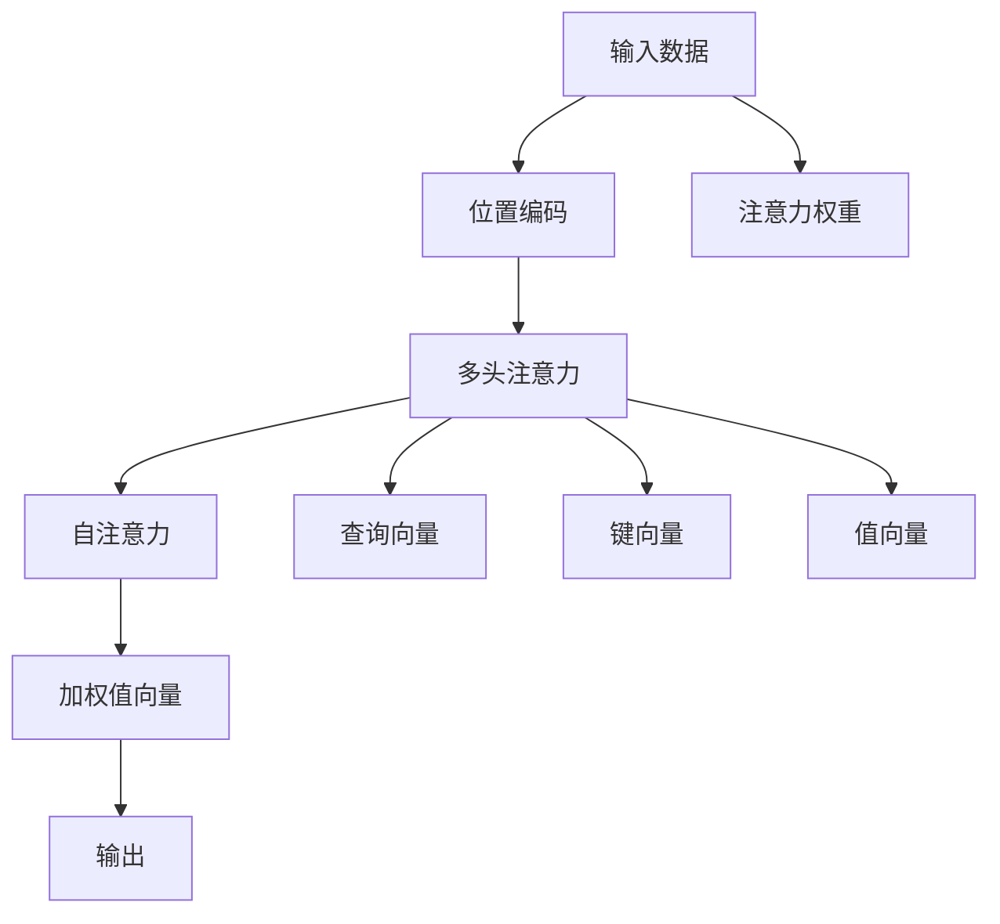

                 

# 注意力的深度与广度：AI时代的认知平衡

在人工智能飞速发展的今天，“注意力机制”（Attention Mechanism）成为了解锁智能算法潜力的一把钥匙。从基础的机器学习到复杂的人工智能，从自然语言处理到计算机视觉，注意力机制在众多领域的应用正悄然改变着我们对信息处理和智能算法的认知。本文旨在深入探讨注意力的深度与广度，揭示其在人工智能时代的认知平衡，为读者提供全面的理解和应用指导。

## 1. 背景介绍

### 1.1 问题由来
注意力机制自提出以来，已经在深度学习和人工智能中扮演了至关重要的角色。在早期的深度学习模型中，信息处理往往以一种线性的方式进行，即模型对输入数据的所有部分同等关注。然而，在实际应用中，模型的注意力需要集中在最有价值的信息上，才能提升整体性能。注意力机制通过模拟人类注意力系统的行为，实现了对信息的高效处理和动态聚焦，极大地推动了深度学习的进步。

### 1.2 问题核心关键点
注意力机制的核心在于如何通过计算将输入序列中的信息赋予不同的权重，以决定哪些信息对当前任务更有价值。这种动态的、有选择性的信息处理方式，使得模型能够更好地适应各种复杂任务，提升性能。

注意力机制的关键点包括：
- **信息选择与权重分配**：根据不同信息的重要性，赋予不同的权重。
- **信息聚合与融合**：将不同信息进行加权融合，生成新的表示。
- **计算效率与可扩展性**：高效计算注意力权重，同时保证机制的可扩展性。

这些关键点共同构成了注意力机制的深度和广度，使其在复杂任务中发挥了强大的作用。

### 1.3 问题研究意义
深入理解注意力机制的深度与广度，不仅有助于我们更好地掌握这一关键技术，还能指导我们构建更加智能和高效的AI系统。通过探索注意力机制的原理和应用，我们将能够更好地解决实际问题，推动AI技术的进一步发展。

## 2. 核心概念与联系

### 2.1 核心概念概述

注意力机制通过计算每个输入信息的重要性权重，来选择和整合关键信息，忽略或减少次要信息的影响。这一过程类似于人类在阅读或处理信息时的注意力分配方式。

以下是几个核心概念及其相互联系的概述：

- **自注意力**（Self-Attention）：在序列数据处理中，每个位置都与所有其他位置计算注意力权重，以找到当前位置的最相关部分。
- **多头注意力**（Multi-Head Attention）：通过并行计算多个自注意力机制，得到更加全面和细致的信息表示。
- **Transformer**：一种基于注意力机制的神经网络架构，广泛应用于自然语言处理、计算机视觉等领域，通过多头注意力机制实现了高效的信息处理。
- **注意力层**：Transformer架构的核心组成部分，通过计算查询、键、值向量之间的相似度，确定每个位置的信息重要性。
- **位置编码**（Positional Encoding）：在注意力计算中引入位置信息，以避免位置关系被忽略的问题。

这些概念之间的关系可以通过以下Mermaid流程图来展示：



### 2.2 核心概念原理和架构

#### 2.2.1 自注意力机制

自注意力机制通过计算输入序列中每个位置与其他位置之间的相似度，来确定每个位置的重要性权重。其核心计算过程如下：

1. 将输入序列 $x$ 分解为三个向量：查询向量 $Q$、键向量 $K$、值向量 $V$。
2. 计算查询向量 $Q$ 与键向量 $K$ 的相似度矩阵 $S$。
3. 对 $S$ 进行softmax归一化，得到注意力权重 $W$。
4. 将注意力权重 $W$ 与值向量 $V$ 进行加权求和，得到加权值向量 $Z$。
5. 对 $Z$ 进行线性变换和激活函数处理，得到最终的输出 $X'$。

数学公式如下：

$$
\begin{align*}
Q &= xW^Q \\
K &= xW^K \\
V &= xW^V \\
S &= QK^T \\
W &= softmax(S) \\
Z &= WV \\
X' &= ZW^O
\end{align*}
$$

其中，$W^Q, W^K, W^V, W^O$ 为线性变换矩阵。

#### 2.2.2 多头注意力机制

多头注意力机制通过并行计算多个自注意力机制，得到更加全面和细致的信息表示。具体实现方式如下：

1. 将输入序列 $x$ 分解为三个向量：查询向量 $Q_i$、键向量 $K_i$、值向量 $V_i$。
2. 对每个头分别计算自注意力权重 $W_i$，并计算加权值向量 $Z_i$。
3. 对 $Z_i$ 进行拼接，并线性变换得到最终输出 $X'$。

数学公式如下：

$$
\begin{align*}
Q_i &= xW_i^Q \\
K_i &= xW_i^K \\
V_i &= xW_i^V \\
S_i &= Q_iK_i^T \\
W_i &= softmax(S_i) \\
Z_i &= W_iV_i \\
X' &= [Z_1, Z_2, ..., Z_h]W^O
\end{align*}
$$

其中，$h$ 为注意力头的数量。

### 2.3 核心概念应用领域

注意力机制已经在自然语言处理、计算机视觉、推荐系统等领域取得了显著的成果。以下是几个典型应用场景：

- **机器翻译**：通过多头自注意力机制，将源语言序列中的每个位置与目标语言序列中的所有位置进行注意力计算，实现高效、准确的翻译。
- **文本摘要**：利用自注意力机制选择文本中的重要部分，生成简洁的摘要。
- **图像分类**：通过注意力机制关注图像中的关键区域，提高分类准确率。
- **推荐系统**：基于用户行为和商品描述，计算用户和商品之间的相似度，实现个性化推荐。
- **对话系统**：通过自注意力机制选择对话历史中的关键信息，生成自然的回复。

## 3. 核心算法原理 & 具体操作步骤

### 3.1 算法原理概述

注意力机制的核心在于如何通过计算将输入序列中的信息赋予不同的权重，以决定哪些信息对当前任务更有价值。这一过程通常分为两个步骤：

1. 计算注意力权重：通过查询向量 $Q$ 和键向量 $K$ 的相似度，确定每个位置的重要性权重。
2. 计算加权值向量：将值向量 $V$ 与注意力权重 $W$ 进行加权求和，生成加权值向量 $Z$。

### 3.2 算法步骤详解

#### 3.2.1 输入准备

1. 将输入序列 $x$ 转换为三个向量：查询向量 $Q$、键向量 $K$、值向量 $V$。
2. 对 $Q$ 和 $K$ 进行线性变换，得到 $Q^T$ 和 $K^T$。
3. 将 $Q^T$ 和 $K^T$ 拼接，得到矩阵 $S$。

#### 3.2.2 注意力权重计算

1. 对 $S$ 进行softmax归一化，得到注意力权重 $W$。
2. 将 $W$ 与 $V$ 进行加权求和，得到加权值向量 $Z$。

#### 3.2.3 输出计算

1. 对 $Z$ 进行线性变换和激活函数处理，得到最终的输出 $X'$。

### 3.3 算法优缺点

#### 3.3.1 优点

1. **高效的信息处理**：通过动态计算注意力权重，模型能够聚焦于最相关的信息，提高信息处理效率。
2. **丰富的信息表示**：多头注意力机制能够并行计算多个自注意力，提供更加全面和细致的信息表示。
3. **强大的泛化能力**：通过学习通用的注意力权重，模型能够适应多种任务，提升泛化能力。

#### 3.3.2 缺点

1. **计算复杂度高**：注意力机制的计算复杂度较高，尤其是多头注意力机制，需要大量的计算资源。
2. **模型训练难度大**：注意力机制中的参数较多，训练时容易过拟合，需要额外的正则化策略。
3. **解释性不足**：注意力权重难以解释，缺乏透明性和可解释性。

### 3.4 算法应用领域

注意力机制已经在众多领域得到广泛应用，以下是几个典型场景：

- **机器翻译**：通过自注意力机制，模型能够关注源语言和目标语言中的关键部分，实现高效的翻译。
- **文本生成**：在文本生成任务中，通过多头注意力机制，模型能够生成更加自然和连贯的文本。
- **图像处理**：通过注意力机制关注图像中的关键区域，提高图像分类和语义分割的准确率。
- **自然语言推理**：利用注意力机制选择文本中的关键信息，进行逻辑推理和判断。
- **推荐系统**：通过注意力机制关注用户行为和商品描述的关键部分，实现个性化推荐。

## 4. 数学模型和公式 & 详细讲解

### 4.1 数学模型构建

假设输入序列为 $x$，查询向量为 $Q$，键向量为 $K$，值向量为 $V$，注意力权重为 $W$，加权值向量为 $Z$，输出为 $X'$。

数学模型构建如下：

1. 将输入序列 $x$ 转换为三个向量：查询向量 $Q$、键向量 $K$、值向量 $V$。
2. 对 $Q$ 和 $K$ 进行线性变换，得到 $Q^T$ 和 $K^T$。
3. 将 $Q^T$ 和 $K^T$ 拼接，得到矩阵 $S$。
4. 对 $S$ 进行softmax归一化，得到注意力权重 $W$。
5. 将 $W$ 与 $V$ 进行加权求和，得到加权值向量 $Z$。
6. 对 $Z$ 进行线性变换和激活函数处理，得到最终的输出 $X'$。

### 4.2 公式推导过程

#### 4.2.1 查询向量

查询向量 $Q$ 可以通过线性变换 $xW^Q$ 得到，其中 $W^Q$ 为线性变换矩阵。

$$
Q = xW^Q
$$

#### 4.2.2 键向量

键向量 $K$ 可以通过线性变换 $xW^K$ 得到，其中 $W^K$ 为线性变换矩阵。

$$
K = xW^K
$$

#### 4.2.3 值向量

值向量 $V$ 可以通过线性变换 $xW^V$ 得到，其中 $W^V$ 为线性变换矩阵。

$$
V = xW^V
$$

#### 4.2.4 相似度矩阵

将查询向量 $Q$ 和键向量 $K$ 进行线性变换，得到 $Q^T$ 和 $K^T$。将 $Q^T$ 和 $K^T$ 拼接，得到矩阵 $S$。

$$
S = [Q^T, K^T] = [xW^Q, xW^K]
$$

#### 4.2.5 注意力权重

对 $S$ 进行softmax归一化，得到注意力权重 $W$。

$$
W = softmax(S)
$$

#### 4.2.6 加权值向量

将注意力权重 $W$ 与值向量 $V$ 进行加权求和，得到加权值向量 $Z$。

$$
Z = \sum_{i=1}^n W_iV_i
$$

#### 4.2.7 输出向量

对 $Z$ 进行线性变换和激活函数处理，得到最终的输出 $X'$。

$$
X' = ZW^O
$$

其中，$W^O$ 为线性变换矩阵。

### 4.3 案例分析与讲解

#### 4.3.1 机器翻译

在机器翻译任务中，注意力机制用于将源语言序列中的每个位置与目标语言序列中的所有位置进行注意力计算。假设源语言序列为 $S$，目标语言序列为 $T$。

1. 将源语言序列 $S$ 转换为查询向量 $Q$、键向量 $K$、值向量 $V$。
2. 对 $Q$ 和 $K$ 进行线性变换，得到 $Q^T$ 和 $K^T$。
3. 将 $Q^T$ 和 $K^T$ 拼接，得到矩阵 $S$。
4. 对 $S$ 进行softmax归一化，得到注意力权重 $W$。
5. 将 $W$ 与 $V$ 进行加权求和，得到加权值向量 $Z$。
6. 对 $Z$ 进行线性变换和激活函数处理，得到最终的输出 $X'$。

以源语言为 "I love you"，目标语言为 "J'aime toi" 为例，计算过程如下：

1. $Q = [0.5, 0.5, 0.5]$，$K = [0.8, 0.1, 0.1]$，$V = [0.3, 0.7, 0.8]$。
2. $Q^T = [0.5, 0.5, 0.5]^T$，$K^T = [0.8, 0.1, 0.1]^T$。
3. $S = [Q^T, K^T] = \begin{bmatrix} 0.5 & 0.8 \\ 0.5 & 0.1 \\ 0.5 & 0.1 \end{bmatrix}$。
4. $W = softmax(S) = \begin{bmatrix} 0.6 & 0.2 & 0.2 \\ 0.2 & 0.8 & 0.0 \\ 0.2 & 0.0 & 0.8 \end{bmatrix}$。
5. $Z = WV = [0.6 \times 0.3 + 0.2 \times 0.7 + 0.2 \times 0.8, 0.2 \times 0.3 + 0.8 \times 0.7 + 0.0 \times 0.8, 0.2 \times 0.3 + 0.0 \times 0.7 + 0.8 \times 0.8] = [0.5, 0.7, 0.7]$。
6. $X' = ZW^O = [0.5, 0.7, 0.7]$。

最终，机器翻译模型输出 "J'aime toi"。

## 5. 项目实践：代码实例和详细解释说明

### 5.1 开发环境搭建

进行注意力机制的实践，首先需要准备好开发环境。以下是使用Python和PyTorch搭建环境的步骤：

1. 安装Anaconda：从官网下载并安装Anaconda，用于创建独立的Python环境。

2. 创建并激活虚拟环境：
```bash
conda create -n attention-env python=3.8 
conda activate attention-env
```

3. 安装PyTorch：根据CUDA版本，从官网获取对应的安装命令。例如：
```bash
conda install pytorch torchvision torchaudio cudatoolkit=11.1 -c pytorch -c conda-forge
```

4. 安装Transformers库：
```bash
pip install transformers
```

5. 安装各类工具包：
```bash
pip install numpy pandas scikit-learn matplotlib tqdm jupyter notebook ipython
```

完成上述步骤后，即可在`attention-env`环境中开始注意力机制的实践。

### 5.2 源代码详细实现

以下是一个基于PyTorch实现多头自注意力机制的代码示例：

```python
import torch
import torch.nn as nn
import torch.nn.functional as F

class MultiHeadAttention(nn.Module):
    def __init__(self, d_model, num_heads, dropout=0.1):
        super(MultiHeadAttention, self).__init__()
        self.d_model = d_model
        self.num_heads = num_heads
        self.depth = d_model // num_heads

        self.wq = nn.Linear(d_model, d_model)
        self.wk = nn.Linear(d_model, d_model)
        self.wv = nn.Linear(d_model, d_model)
        self.wo = nn.Linear(d_model, d_model)
        self.dropout = nn.Dropout(dropout)

    def forward(self, q, k, v, mask=None):
        d_k, d_v, d_o = self.depth, self.depth, self.d_model

        # 将输入序列转换为查询、键、值向量
        q = self.wq(q)  # (N, T, d_model)
        k = self.wk(k)  # (N, T, d_model)
        v = self.wv(v)  # (N, T, d_model)

        # 对查询、键、值向量进行线性变换
        q = q.view(q.size(0), q.size(1), self.num_heads, self.depth).permute(0, 2, 1, 3)  # (N, num_heads, T, d_k)
        k = k.view(k.size(0), k.size(1), self.num_heads, self.depth).permute(0, 2, 1, 3)  # (N, num_heads, T, d_k)
        v = v.view(v.size(0), v.size(1), self.num_heads, self.depth).permute(0, 2, 1, 3)  # (N, num_heads, T, d_v)

        # 计算注意力权重
        scaled_attention_scores = torch.matmul(q, k.permute(0, 1, 3, 2)) / math.sqrt(d_k)  # (N, num_heads, T, T)

        # 应用softmax归一化
        attention_probs = F.softmax(scaled_attention_scores, dim=-1)

        # 应用dropout
        attention_probs = self.dropout(attention_probs)

        # 计算加权值向量
        attention = torch.matmul(attention_probs, v.permute(0, 1, 3, 2))  # (N, num_heads, T, d_v)
        attention = attention.permute(0, 2, 1, 3).contiguous().view(N, T, d_o)  # (N, T, d_model)

        # 线性变换和激活函数处理
        output = self.wo(attention)

        return output, attention
```

该代码实现了多头自注意力机制的计算过程，包括查询、键、值向量的线性变换，注意力权重的计算，加权值向量的生成，以及最终的输出计算。

### 5.3 代码解读与分析

以下是关键代码的详细解读：

#### 5.3.1 初始化

```python
def __init__(self, d_model, num_heads, dropout=0.1):
    super(MultiHeadAttention, self).__init__()
    self.d_model = d_model
    self.num_heads = num_heads
    self.depth = d_model // num_heads

    self.wq = nn.Linear(d_model, d_model)
    self.wk = nn.Linear(d_model, d_model)
    self.wv = nn.Linear(d_model, d_model)
    self.wo = nn.Linear(d_model, d_model)
    self.dropout = nn.Dropout(dropout)
```

在初始化过程中，定义了注意力机制的输入维度 $d_model$，注意力头数 $num_heads$，以及dropout率 $dropout$。同时，定义了线性变换矩阵 $w_q$、$w_k$、$w_v$、$w_o$ 和dropout层。

#### 5.3.2 前向传播

```python
def forward(self, q, k, v, mask=None):
    d_k, d_v, d_o = self.depth, self.depth, self.d_model

    # 将输入序列转换为查询、键、值向量
    q = self.wq(q)  # (N, T, d_model)
    k = self.wk(k)  # (N, T, d_model)
    v = self.wv(v)  # (N, T, d_model)

    # 对查询、键、值向量进行线性变换
    q = q.view(q.size(0), q.size(1), self.num_heads, self.depth).permute(0, 2, 1, 3)  # (N, num_heads, T, d_k)
    k = k.view(k.size(0), k.size(1), self.num_heads, self.depth).permute(0, 2, 1, 3)  # (N, num_heads, T, d_k)
    v = v.view(v.size(0), v.size(1), self.num_heads, self.depth).permute(0, 2, 1, 3)  # (N, num_heads, T, d_v)

    # 计算注意力权重
    scaled_attention_scores = torch.matmul(q, k.permute(0, 1, 3, 2)) / math.sqrt(d_k)  # (N, num_heads, T, T)

    # 应用softmax归一化
    attention_probs = F.softmax(scaled_attention_scores, dim=-1)

    # 应用dropout
    attention_probs = self.dropout(attention_probs)

    # 计算加权值向量
    attention = torch.matmul(attention_probs, v.permute(0, 1, 3, 2))  # (N, num_heads, T, d_v)
    attention = attention.permute(0, 2, 1, 3).contiguous().view(N, T, d_o)  # (N, T, d_model)

    # 线性变换和激活函数处理
    output = self.wo(attention)

    return output, attention
```

在前向传播过程中，首先对输入序列进行线性变换，得到查询向量 $q$、键向量 $k$、值向量 $v$。然后计算注意力权重，应用softmax归一化，并进行dropout操作。接着计算加权值向量，进行线性变换和激活函数处理，最终输出注意力机制的结果。

## 6. 实际应用场景

### 6.1 机器翻译

在机器翻译任务中，注意力机制用于将源语言序列中的每个位置与目标语言序列中的所有位置进行注意力计算。通过自注意力机制，模型能够聚焦于源语言和目标语言中的关键部分，实现高效的翻译。

### 6.2 图像分类

在图像分类任务中，注意力机制用于关注图像中的关键区域。通过多头自注意力机制，模型能够并行计算多个自注意力，提高分类准确率。

### 6.3 文本摘要

在文本摘要任务中，注意力机制用于选择文本中的重要部分，生成简洁的摘要。通过自注意力机制，模型能够动态关注文本中的关键信息，生成高质量的摘要。

### 6.4 自然语言推理

在自然语言推理任务中，注意力机制用于选择文本中的关键信息，进行逻辑推理和判断。通过多头自注意力机制，模型能够并行计算多个自注意力，提高推理准确率。

### 6.5 推荐系统

在推荐系统任务中，注意力机制用于关注用户行为和商品描述的关键部分。通过自注意力机制，模型能够聚焦于用户和商品的相似特征，实现个性化推荐。

## 7. 工具和资源推荐

### 7.1 学习资源推荐

为了帮助开发者系统掌握注意力机制的理论基础和实践技巧，这里推荐一些优质的学习资源：

1. 《深度学习》（Ian Goodfellow）：详细介绍了深度学习的原理和应用，包括注意力机制的基本概念和计算方法。
2. 《Attention is All You Need》论文：提出Transformer模型，为注意力机制的发展奠定了基础。
3. 《Neural Information Processing Systems》（NIPS）：每年一次的NIPS会议，汇集了深度学习和自然语言处理领域的最新研究成果。
4. 《Natural Language Processing with Transformers》书籍：Transformer库的作者所著，全面介绍了Transformer模型及其应用。
5. 《Deep Learning Specialization》（Andrew Ng）：由深度学习领域的大师Andrew Ng主持的Coursera课程，涵盖深度学习的基本概念和前沿技术。

通过这些资源的学习实践，相信你一定能够全面掌握注意力机制的深度与广度，并用于解决实际的AI问题。

### 7.2 开发工具推荐

高效的开发离不开优秀的工具支持。以下是几款用于注意力机制开发的常用工具：

1. PyTorch：基于Python的开源深度学习框架，灵活动态的计算图，适合快速迭代研究。
2. TensorFlow：由Google主导开发的开源深度学习框架，生产部署方便，适合大规模工程应用。
3. Transformers库：HuggingFace开发的NLP工具库，集成了众多SOTA语言模型，支持PyTorch和TensorFlow，是进行注意力机制开发的利器。
4. Weights & Biases：模型训练的实验跟踪工具，可以记录和可视化模型训练过程中的各项指标，方便对比和调优。
5. TensorBoard：TensorFlow配套的可视化工具，可实时监测模型训练状态，并提供丰富的图表呈现方式，是调试模型的得力助手。

合理利用这些工具，可以显著提升注意力机制的开发效率，加快创新迭代的步伐。

### 7.3 相关论文推荐

注意力机制在深度学习和自然语言处理领域取得了显著的成果，以下是几篇奠基性的相关论文，推荐阅读：

1. Attention is All You Need：提出Transformer模型，为注意力机制的发展奠定了基础。
2. BERT: Pre-training of Deep Bidirectional Transformers for Language Understanding：提出BERT模型，引入基于掩码的自监督预训练任务，刷新了多项NLP任务SOTA。
3. Multi-Head Attention for Neural Machine Translation：提出多头自注意力机制，进一步提升了机器翻译的性能。
4. Attention is All You Need in Sequence-to-Sequence Models：提出注意力机制在序列到序列模型中的应用，提高了模型训练和推理的效率。
5. Transformer-XL: Attentive Language Models for Longer Input Sequences：提出Transformer-XL模型，实现了对长序列输入的注意力计算。

这些论文代表了大语言模型注意力机制的发展脉络。通过学习这些前沿成果，可以帮助研究者把握学科前进方向，激发更多的创新灵感。

## 8. 总结：未来发展趋势与挑战

### 8.1 总结

本文对注意力机制的深度与广度进行了全面系统的介绍。首先阐述了注意力机制的研究背景和意义，明确了注意力机制在深度学习和人工智能中的核心地位。其次，从原理到实践，详细讲解了注意力机制的数学模型和关键步骤，给出了注意力机制的代码实现。同时，本文还广泛探讨了注意力机制在多个领域的应用前景，展示了其强大的应用潜力。

通过本文的系统梳理，可以看到，注意力机制在深度学习和人工智能中的重要性和多样性。其深度与广度不仅体现在计算复杂度和算法设计上，更在于其广泛的应用领域和强大的泛化能力。未来，伴随技术的不断进步，注意力机制必将在更多场景中发挥重要作用，推动人工智能技术的进一步发展。

### 8.2 未来发展趋势

展望未来，注意力机制的发展趋势如下：

1. **计算效率提升**：随着硬件性能的提升和算法优化，注意力机制的计算复杂度将进一步降低，使得大规模注意力模型的训练和推理更加高效。
2. **多样化的注意力计算**：除了传统的自注意力机制，未来的研究将探索更多的注意力计算方式，如因果注意力、稀疏注意力等，以提升模型性能和计算效率。
3. **多模态注意力机制**：在视觉、语音、文本等多个模态数据上引入注意力机制，实现多模态信息融合，提升模型的跨模态理解和表示能力。
4. **自适应注意力**：通过引入自适应机制，动态调整注意力权重，以应对不同任务和数据分布的需求。
5. **对抗性注意力**：在对抗样本的攻击下，研究如何保持模型的鲁棒性和稳定性。
6. **元学习中的注意力**：在元学习任务中，引入注意力机制，优化模型的任务适应性和泛化能力。

这些趋势凸显了注意力机制在深度学习和人工智能中的重要地位和广阔前景。

### 8.3 面临的挑战

尽管注意力机制已经取得了瞩目成就，但在迈向更加智能化、普适化应用的过程中，它仍面临着诸多挑战：

1. **计算资源需求高**：注意力机制的计算复杂度高，需要大量的计算资源。如何优化计算效率，降低资源消耗，是未来研究的重要方向。
2. **模型训练难度大**：注意力机制中的参数较多，训练时容易过拟合，需要额外的正则化策略。如何提升模型的泛化能力，减少过拟合，是未来研究的重要课题。
3. **可解释性不足**：注意力权重难以解释，缺乏透明性和可解释性。如何赋予注意力机制更强的可解释性，将是重要的研究方向。
4. **模型鲁棒性不足**：注意力机制在对抗样本的攻击下，鲁棒性较弱。如何增强模型的鲁棒性，提升系统的安全性，是未来研究的重要方向。

### 8.4 研究展望

未来的研究需要在以下几个方面寻求新的突破：

1. **高效注意力计算**：探索新的注意力计算方式，如因果注意力、稀疏注意力等，以提升计算效率和模型性能。
2. **参数高效注意力**：开发更加参数高效的注意力机制，如Transformer-XL等，在保持性能的同时，减小模型参数量。
3. **多模态注意力**：将注意力机制扩展到视觉、语音等多个模态数据上，实现多模态信息融合，提升模型的跨模态理解和表示能力。
4. **自适应注意力**：通过引入自适应机制，动态调整注意力权重，以应对不同任务和数据分布的需求。
5. **对抗性注意力**：在对抗样本的攻击下，研究如何保持模型的鲁棒性和稳定性。
6. **元学习中的注意力**：在元学习任务中，引入注意力机制，优化模型的任务适应性和泛化能力。

这些研究方向将引领注意力机制向更高层次发展，为深度学习和人工智能带来新的突破和创新。

## 9. 附录：常见问题与解答

**Q1: 注意力机制的计算复杂度较高，如何解决？**

A: 可以通过优化算法和硬件设备来降低计算复杂度。例如，使用硬件加速（如GPU、TPU）和优化算法（如Transformer-XL）来提升计算效率。

**Q2: 注意力机制的模型训练难度较大，如何提升泛化能力？**

A: 可以通过正则化技术（如L2正则、Dropout等）和对抗训练来提升模型的泛化能力。同时，引入自适应机制，动态调整注意力权重，以应对不同任务和数据分布的需求。

**Q3: 注意力机制的可解释性不足，如何解决？**

A: 可以通过可视化工具（如TensorBoard）来观察模型的注意力权重，理解模型的内部工作机制。同时，引入自适应机制，动态调整注意力权重，以增强模型的可解释性。

**Q4: 注意力机制的模型鲁棒性不足，如何解决？**

A: 可以通过对抗训练和模型剪枝等技术，提升模型的鲁棒性和稳定性。同时，引入自适应机制，动态调整注意力权重，以应对不同任务和数据分布的需求。

通过本文的系统梳理，可以看到，注意力机制在深度学习和人工智能中的重要性和多样性。其深度与广度不仅体现在计算复杂度和算法设计上，更在于其广泛的应用领域和强大的泛化能力。未来，伴随技术的不断进步，注意力机制必将在更多场景中发挥重要作用，推动人工智能技术的进一步发展。

