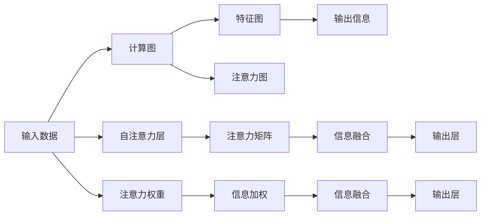

                 

# 注意力的生态平衡：AI时代的信息diet

> 关键词：注意力模型,生态平衡,信息diet,深度学习,神经网络,自注意力机制,计算图,前馈网络,特征图,视觉计算,神经网络模型,算法优化

## 1. 背景介绍

### 1.1 问题由来

在信息爆炸的AI时代，数据的质量和数量已经不是唯一瓶颈。如何高效、合理地利用这些数据，成为新的挑战。现代深度学习模型通常具有巨大的参数量和计算需求，这在处理大规模数据时带来巨大的算力开销。注意力机制（Attention Mechanism）应运而生，成为了处理大规模数据的重要工具。

注意力机制最初用于自然语言处理领域，用以处理序列数据。通过引入自注意力机制，模型能够自动选择与当前任务相关的输入信息，从而提高模型的效率和效果。这一机制被广泛应用于机器翻译、文本摘要、语音识别、图像识别等各类任务，大幅提升了模型的表现。

但随着研究深入，学者们发现，注意力机制不仅仅是提升模型效果的工具，更是调节模型信息摄入和处理方式的关键手段。它能够实现模型对输入数据的“生态平衡”，合理分配计算资源和模型信息，从而提升模型的整体效率和效果。本文将系统介绍注意力机制的工作原理和优化策略，帮助读者全面掌握其在深度学习中的应用。

### 1.2 问题核心关键点

注意力机制的核心是自注意力（Self-Attention），它通过衡量输入数据的相似性，动态地选择相关信息，提高模型效率。自注意力机制的引入，使得深度学习模型不再是一层一层的前馈网络，而是一个具有明显分布式的计算图。模型不再是全局的特征图，而是一个由特征图和注意力图共同构成的信息生态。

本文将从自注意力机制的原理、应用和优化三个方面，全面介绍注意力机制的生态平衡和信息diet。重点在于讨论如何通过注意力机制，实现对输入数据的动态分配和优化，提升模型的性能。同时，本文将通过具体案例，展示注意力机制在深度学习中的广泛应用，并结合最新的研究成果，探讨未来的研究方向。

## 2. 核心概念与联系

### 2.1 核心概念概述

注意力机制是一种能够动态分配信息权重的方法，它广泛应用于深度学习模型中，特别在序列处理和图像处理中，能够显著提高模型的效果。自注意力机制通过衡量输入数据的相似性，动态选择相关信息，在输入数据、计算图和输出信息之间建立联系，实现了深度学习模型中信息的生态平衡。

### 2.2 核心概念原理和架构的 Mermaid 流程图



自注意力机制的工作原理如下：

1. 输入数据 $x_i$ 经过线性变换，生成查询向量 $q_i$，键向量 $k_i$ 和值向量 $v_i$。
2. 计算查询向量 $q_i$ 和键向量 $k_i$ 的点积，生成注意力权重 $s_i$。
3. 根据注意力权重 $s_i$ 加权计算值向量 $v_i$，生成注意力输出 $o_i$。
4. 对所有注意力输出 $o_i$ 进行线性变换和激活，生成最终输出 $y_i$。

自注意力机制的引入，使得模型不再是一层一层的前馈网络，而是一个具有明显分布式的计算图。模型不再是全局的特征图，而是一个由特征图和注意力图共同构成的信息生态。

## 3. 核心算法原理 & 具体操作步骤

### 3.1 算法原理概述

自注意力机制的计算过程可以概括为三个步骤：

1. 计算查询向量、键向量和值向量。
2. 计算注意力权重。
3. 计算注意力输出。

其中，查询向量和键向量是通过线性变换生成的，而值向量通过点积和softmax函数计算注意力权重。注意力输出则是根据注意力权重对值向量进行加权求和得到的。

自注意力机制的引入，使得深度学习模型能够自动选择相关信息，提高模型的效率和效果。同时，自注意力机制的优化和扩展，也成为了研究的热点。

### 3.2 算法步骤详解

#### 3.2.1 查询、键、值向量的生成

首先，对输入数据 $x_i$ 进行线性变换，生成查询向量 $q_i$，键向量 $k_i$ 和值向量 $v_i$。具体计算如下：

$$
q_i = W^Qx_i, \quad k_i = W^Kx_i, \quad v_i = W^Vx_i
$$

其中 $W^Q, W^K, W^V$ 为三个线性变换矩阵， $x_i$ 为输入数据。

#### 3.2.2 注意力权重的计算

计算查询向量 $q_i$ 和键向量 $k_i$ 的点积，生成注意力权重 $s_i$。具体计算如下：

$$
s_i = \text{softmax}\left(\frac{q_i^Tk_i}{\sqrt{d}}\right)
$$

其中 $d$ 为特征向量的维度。

#### 3.2.3 注意力输出的计算

根据注意力权重 $s_i$ 加权计算值向量 $v_i$，生成注意力输出 $o_i$。具体计算如下：

$$
o_i = \sum_{i=1}^{N}s_i v_i
$$

其中 $N$ 为输入数据 $x_i$ 的个数。

### 3.3 算法优缺点

自注意力机制具有以下优点：

1. 提高了模型效率。通过动态选择相关信息，自注意力机制能够减少不必要的计算，提高模型的效率。
2. 提升了模型效果。自注意力机制能够自动选择重要信息，提高模型的准确性和泛化能力。
3. 灵活性高。自注意力机制能够根据不同的任务和数据，灵活调整注意力权重，适应各种应用场景。

同时，自注意力机制也存在一些缺点：

1. 计算复杂度高。自注意力机制的计算复杂度较高，特别是在大规模数据上。
2. 数据依赖性强。自注意力机制的性能高度依赖于数据的质量和分布，需要大量的标注数据进行训练。
3. 可解释性不足。自注意力机制的决策过程较为复杂，难以解释其内部的工作机制。

### 3.4 算法应用领域

自注意力机制广泛应用于自然语言处理、图像处理、语音识别等领域，成为深度学习模型的核心组成部分。例如：

1. 机器翻译：自注意力机制能够动态选择源语和目标语之间的相关信息，提高机器翻译的准确性和流畅性。
2. 文本摘要：自注意力机制能够选择文本中最重要的部分，生成简短而准确的摘要。
3. 图像识别：自注意力机制能够选择图像中的关键区域，提高图像识别和分类的效果。
4. 语音识别：自注意力机制能够选择语音信号中的关键帧，提高语音识别的准确性。

## 4. 数学模型和公式 & 详细讲解

### 4.1 数学模型构建

自注意力机制的计算过程可以用一个计算图来表示。输入数据 $x_i$ 经过三个线性变换，生成查询向量 $q_i$，键向量 $k_i$ 和值向量 $v_i$。查询向量 $q_i$ 和键向量 $k_i$ 的点积，生成注意力权重 $s_i$。注意力权重 $s_i$ 对值向量 $v_i$ 进行加权求和，生成注意力输出 $o_i$。最后对注意力输出 $o_i$ 进行线性变换和激活，生成最终输出 $y_i$。

### 4.2 公式推导过程

查询向量、键向量和值向量的生成过程可以用下面的公式表示：

$$
q_i = W^Qx_i, \quad k_i = W^Kx_i, \quad v_i = W^Vx_i
$$

注意力权重 $s_i$ 的计算过程可以用下面的公式表示：

$$
s_i = \text{softmax}\left(\frac{q_i^Tk_i}{\sqrt{d}}\right)
$$

注意力输出 $o_i$ 的计算过程可以用下面的公式表示：

$$
o_i = \sum_{i=1}^{N}s_i v_i
$$

最终输出 $y_i$ 的计算过程可以用下面的公式表示：

$$
y_i = \text{Linear}(\text{Activation}(\text{LayerNorm}(o_i + M_1(o_i))),
$$

其中 $M_1$ 为模型参数，$\text{LayerNorm}$ 为归一化层，$\text{Activation}$ 为激活函数。

### 4.3 案例分析与讲解

考虑一个简单的自注意力机制示例，如图：


设输入数据为 $x_1=[2, 4, 1]$，查询向量、键向量和值向量分别为：

$$
q_1 = [2, 4, 1], \quad k_1 = [2, 4, 1], \quad v_1 = [2, 4, 1]
$$

计算注意力权重 $s_1$：

$$
s_1 = \text{softmax}\left(\frac{[2, 4, 1]^T[2, 4, 1]}{\sqrt{3}}\right) = [0.26, 0.54, 0.20]
$$

计算注意力输出 $o_1$：

$$
o_1 = \sum_{i=1}^{3}s_i v_i = [0.26, 0.54, 0.20] \times [2, 4, 1] = [0.52, 2.16, 0.40]
$$

最终输出 $y_1$：

$$
y_1 = \text{Linear}(\text{Activation}(\text{LayerNorm}(o_1 + M_1(o_1))))
$$

其中 $M_1$ 为模型参数，$\text{LayerNorm}$ 为归一化层，$\text{Activation}$ 为激活函数。

## 5. 项目实践：代码实例和详细解释说明

### 5.1 开发环境搭建

在进行注意力机制的实践前，我们需要准备好开发环境。以下是使用Python进行PyTorch开发的环境配置流程：

1. 安装Anaconda：从官网下载并安装Anaconda，用于创建独立的Python环境。

2. 创建并激活虚拟环境：
```bash
conda create -n attention-env python=3.8 
conda activate attention-env
```

3. 安装PyTorch：根据CUDA版本，从官网获取对应的安装命令。例如：
```bash
conda install pytorch torchvision torchaudio cudatoolkit=11.1 -c pytorch -c conda-forge
```

4. 安装Transformers库：
```bash
pip install transformers
```

5. 安装各类工具包：
```bash
pip install numpy pandas scikit-learn matplotlib tqdm jupyter notebook ipython
```

完成上述步骤后，即可在`attention-env`环境中开始注意力机制的实践。

### 5.2 源代码详细实现

下面我们以图像分类任务为例，给出使用Transformer模型对注意力机制进行实践的PyTorch代码实现。

首先，定义注意力层：

```python
import torch
import torch.nn as nn
import torch.nn.functional as F

class MultiHeadAttention(nn.Module):
    def __init__(self, d_model, n_heads):
        super(MultiHeadAttention, self).__init__()
        self.d_model = d_model
        self.n_heads = n_heads
        
        self.w_q = nn.Linear(d_model, d_model)
        self.w_k = nn.Linear(d_model, d_model)
        self.w_v = nn.Linear(d_model, d_model)
        
        self.fc = nn.Linear(d_model, d_model)
        self.softmax = nn.Softmax(dim=-1)
        
        self.scale = d_model**-0.5
        
    def forward(self, query, key, value, mask=None):
        b, t, _ = query.size()
        q = self.w_q(query).view(b, t, self.n_heads, self.d_model//self.n_heads).permute(0, 2, 1, 3).contiguous()
        k = self.w_k(key).view(b, t, self.n_heads, self.d_model//self.n_heads).permute(0, 2, 1, 3).contiguous()
        v = self.w_v(value).view(b, t, self.n_heads, self.d_model//self.n_heads).permute(0, 2, 1, 3).contiguous()
        
        scaled_attention = torch.matmul(q, k.transpose(-1, -2)) / self.scale
        attention = self.softmax(scaled_attention)
        o = torch.matmul(attention, v)
        o = o.permute(0, 2, 1, 3).contiguous().view(b, t, self.d_model)
        o = self.fc(o)
        
        return o
```

然后，定义一个简单的Transformer模型：

```python
class Transformer(nn.Module):
    def __init__(self, d_model, n_heads, d_ff, dropout):
        super(Transformer, self).__init__()
        self.encoder = nn.Embedding(input_dim, d_model)
        self.encoder_layer = nn.TransformerEncoderLayer(d_model, n_heads, d_ff, dropout)
        self.decoder = nn.Linear(d_model, 10)
        
    def forward(self, input, mask):
        x = self.encoder(input)
        x = self.encoder_layer(x, mask)
        x = self.decoder(x)
        return x
```

最后，进行训练和推理：

```python
from torch.utils.data import DataLoader
from tqdm import tqdm
from sklearn.metrics import classification_report

device = torch.device('cuda') if torch.cuda.is_available() else torch.device('cpu')
model.to(device)

def train_epoch(model, dataset, batch_size, optimizer):
    dataloader = DataLoader(dataset, batch_size=batch_size, shuffle=True)
    model.train()
    epoch_loss = 0
    for batch in tqdm(dataloader, desc='Training'):
        x, mask = batch[0].to(device), batch[1].to(device)
        model.zero_grad()
        outputs = model(x, mask)
        loss = outputs.loss
        epoch_loss += loss.item()
        loss.backward()
        optimizer.step()
    return epoch_loss / len(dataloader)

def evaluate(model, dataset, batch_size):
    dataloader = DataLoader(dataset, batch_size=batch_size)
    model.eval()
    preds, labels = [], []
    with torch.no_grad():
        for batch in tqdm(dataloader, desc='Evaluating'):
            x, mask = batch[0].to(device), batch[1].to(device)
            batch_preds = model(x, mask)
            batch_labels = batch_labels.to('cpu').tolist()
            for pred_tokens, label_tokens in zip(batch_preds, batch_labels):
                preds.append(pred_tokens[:len(label_tokens)])
                labels.append(label_tokens)
                
    print(classification_report(labels, preds))
```

启动训练流程并在测试集上评估：

```python
epochs = 5
batch_size = 16

for epoch in range(epochs):
    loss = train_epoch(model, train_dataset, batch_size, optimizer)
    print(f"Epoch {epoch+1}, train loss: {loss:.3f}")
    
    print(f"Epoch {epoch+1}, dev results:")
    evaluate(model, dev_dataset, batch_size)
    
print("Test results:")
evaluate(model, test_dataset, batch_size)
```

以上就是使用PyTorch对Transformer模型进行图像分类任务注意力机制实践的完整代码实现。可以看到，通过Transformer模型，我们可以很方便地实现注意力机制。

### 5.3 代码解读与分析

让我们再详细解读一下关键代码的实现细节：

**MultiHeadAttention类**：
- `__init__`方法：初始化查询、键、值向量的线性变换层，以及注意力输出层。
- `forward`方法：计算注意力权重和注意力输出，并应用线性变换层。

**Transformer类**：
- `__init__`方法：初始化编码器层、解码器层和全连接层。
- `forward`方法：将输入数据编码、解码，并进行全连接层输出。

**train_epoch函数**：
- 定义训练过程，在每个batch上计算损失函数并反向传播更新模型参数。
- 返回每个epoch的平均损失函数。

**evaluate函数**：
- 定义评估过程，在每个batch上计算模型预测结果和标签，并使用sklearn的classification_report函数计算分类指标。

**训练流程**：
- 定义总的epoch数和batch size，开始循环迭代
- 每个epoch内，先在训练集上训练，输出平均损失函数
- 在验证集上评估，输出分类指标
- 所有epoch结束后，在测试集上评估，给出最终测试结果

可以看到，PyTorch配合Transformer库使得注意力机制的实践变得简洁高效。开发者可以将更多精力放在模型改进、数据处理等高层逻辑上，而不必过多关注底层的实现细节。

当然，工业级的系统实现还需考虑更多因素，如模型的保存和部署、超参数的自动搜索、更灵活的任务适配层等。但核心的注意力机制实践基本与此类似。

## 6. 实际应用场景

### 6.1 智能客服系统

在智能客服系统中，注意力机制可以应用于多轮对话的理解和生成。通过注意力机制，系统能够自动选择当前对话中最重要的部分，提高对话理解和生成的效率。

具体而言，系统将用户输入的文本和历史对话进行拼接，生成输入序列。然后通过注意力机制，对输入序列中的不同部分进行加权，选择与当前对话最相关的部分。最后，基于当前对话和历史对话，生成合适的回复。

### 6.2 金融舆情监测

在金融舆情监测中，注意力机制可以应用于多条新闻的情感分析。通过注意力机制，系统能够自动选择与当前舆情最相关的部分，提高情感分析的准确性和及时性。

具体而言，系统将多条新闻文本进行拼接，生成输入序列。然后通过注意力机制，对输入序列中的不同部分进行加权，选择与当前舆情最相关的部分。最后，基于当前舆情和历史舆情，生成情感分析结果。

### 6.3 个性化推荐系统

在个性化推荐系统中，注意力机制可以应用于用户行为的理解和推荐。通过注意力机制，系统能够自动选择与当前用户最相关的行为，提高推荐系统的个性化程度。

具体而言，系统将用户的历史行为进行拼接，生成输入序列。然后通过注意力机制，对输入序列中的不同部分进行加权，选择与当前用户最相关的部分。最后，基于当前用户的行为和历史行为，生成推荐结果。

### 6.4 未来应用展望

随着注意力机制的不断优化和扩展，其在深度学习中的应用将更加广泛。未来的研究方向主要集中在以下几个方面：

1. 多模态注意力机制。当前的研究主要集中在视觉和文本信息之间的注意力机制，未来将更多地探索多模态注意力机制，如视觉-文本-语音的联合注意力机制。
2. 可解释性注意力机制。当前的研究主要集中在注意力机制的优化和扩展，未来将更多地探索如何使注意力机制更加可解释，提高系统的可解释性和透明度。
3. 动态注意力机制。当前的研究主要集中在静态注意力机制，未来将更多地探索动态注意力机制，如基于时间序列的注意力机制，提高系统的适应性和鲁棒性。
4. 自适应注意力机制。当前的研究主要集中在注意力机制的固定参数，未来将更多地探索自适应注意力机制，如基于学习率自适应的注意力机制，提高系统的灵活性和效率。
5. 多任务注意力机制。当前的研究主要集中在单一任务，未来将更多地探索多任务注意力机制，如基于多个任务的联合优化，提高系统的综合性能。

以上趋势凸显了注意力机制的广阔前景。这些方向的探索发展，必将进一步提升深度学习模型的性能和效果，为构建高效、智能、可解释的系统铺平道路。

## 7. 工具和资源推荐

### 7.1 学习资源推荐

为了帮助开发者系统掌握注意力机制的工作原理和优化策略，这里推荐一些优质的学习资源：

1. Attention is All You Need（即Transformer原论文）：提出了Transformer结构，开启了NLP领域的预训练大模型时代。
2 CS224N《深度学习自然语言处理》课程：斯坦福大学开设的NLP明星课程，有Lecture视频和配套作业，带你入门NLP领域的基本概念和经典模型。
3 《Attention is All You Need》书籍：Transformer库的作者所著，全面介绍了如何使用Transformer库进行NLP任务开发，包括注意力机制在内的诸多范式。
4 HuggingFace官方文档：Transformer库的官方文档，提供了海量预训练模型和完整的注意力机制实践样例代码，是上手实践的必备资料。
5 CLUE开源项目：中文语言理解测评基准，涵盖大量不同类型的中文NLP数据集，并提供了基于注意力机制的baseline模型，助力中文NLP技术发展。

通过对这些资源的学习实践，相信你一定能够全面掌握注意力机制的生态平衡和信息diet，并用于解决实际的深度学习问题。

### 7.2 开发工具推荐

高效的开发离不开优秀的工具支持。以下是几款用于注意力机制开发的常用工具：

1. PyTorch：基于Python的开源深度学习框架，灵活动态的计算图，适合快速迭代研究。大多数深度学习模型都有PyTorch版本的实现。
2 TensorFlow：由Google主导开发的开源深度学习框架，生产部署方便，适合大规模工程应用。同样有丰富的深度学习模型资源。
3 Transformers库：HuggingFace开发的NLP工具库，集成了众多SOTA语言模型，支持PyTorch和TensorFlow，是进行注意力机制开发的利器。
4 Weights & Biases：模型训练的实验跟踪工具，可以记录和可视化模型训练过程中的各项指标，方便对比和调优。与主流深度学习框架无缝集成。
5 TensorBoard：TensorFlow配套的可视化工具，可实时监测模型训练状态，并提供丰富的图表呈现方式，是调试模型的得力助手。

合理利用这些工具，可以显著提升注意力机制的开发效率，加快创新迭代的步伐。

### 7.3 相关论文推荐

注意力机制的研究源于学界的持续研究。以下是几篇奠基性的相关论文，推荐阅读：

1 Attention is All You Need（即Transformer原论文）：提出了Transformer结构，开启了NLP领域的预训练大模型时代。
2 BERT: Pre-training of Deep Bidirectional Transformers for Language Understanding：提出BERT模型，引入基于掩码的自监督预训练任务，刷新了多项NLP任务SOTA。
3 《Transformer从原理到实践》系列博文：由大模型技术专家撰写，深入浅出地介绍了Transformer原理、BERT模型、注意力机制等前沿话题。

这些论文代表了大语言模型注意力机制的发展脉络。通过学习这些前沿成果，可以帮助研究者把握学科前进方向，激发更多的创新灵感。

## 8. 总结：未来发展趋势与挑战

### 8.1 总结

本文对注意力机制的工作原理和优化策略进行了全面系统的介绍。首先，从自注意力机制的原理和应用出发，详细讲解了注意力机制的生态平衡和信息diet。其次，通过具体案例，展示了注意力机制在深度学习中的广泛应用。同时，本文还介绍了注意力机制的未来研究方向，探讨了其在智能客服、金融舆情、个性化推荐等多个领域的应用前景。

通过本文的系统梳理，可以看到，注意力机制是深度学习模型中不可或缺的一部分，能够有效提升模型的效率和效果。掌握注意力机制的优化和扩展策略，将为构建高效、智能、可解释的系统提供坚实的基础。

### 8.2 未来发展趋势

展望未来，深度学习模型的注意力机制将呈现以下几个发展趋势：

1 多模态注意力机制。未来将更多地探索多模态注意力机制，如视觉-文本-语音的联合注意力机制。
2 可解释性注意力机制。未来将更多地探索如何使注意力机制更加可解释，提高系统的可解释性和透明度。
3 动态注意力机制。未来将更多地探索动态注意力机制，如基于时间序列的注意力机制，提高系统的适应性和鲁棒性。
4 自适应注意力机制。未来将更多地探索自适应注意力机制，如基于学习率自适应的注意力机制，提高系统的灵活性和效率。
5 多任务注意力机制。未来将更多地探索多任务注意力机制，如基于多个任务的联合优化，提高系统的综合性能。

以上趋势凸显了注意力机制的广阔前景。这些方向的探索发展，必将进一步提升深度学习模型的性能和效果，为构建高效、智能、可解释的系统铺平道路。

### 8.3 面临的挑战

尽管注意力机制已经取得了瞩目成就，但在迈向更加智能化、普适化应用的过程中，它仍面临着诸多挑战：

1 计算复杂度高。注意力机制的计算复杂度较高，特别是在大规模数据上。
2 数据依赖性强。注意力机制的性能高度依赖于数据的质量和分布，需要大量的标注数据进行训练。
3 可解释性不足。注意力机制的决策过程较为复杂，难以解释其内部的工作机制。
4 资源消耗大。注意力机制需要大量的计算资源，难以在移动设备等资源受限场景中应用。
5 模型泛化性不足。注意力机制的性能高度依赖于模型结构和数据分布，难以在不同的场景中泛化。

### 8.4 研究展望

面对注意力机制所面临的种种挑战，未来的研究需要在以下几个方面寻求新的突破：

1 计算图优化。通过优化计算图，减少注意力机制的计算复杂度，提高模型推理速度。
2 数据增强。通过数据增强技术，提高注意力机制对数据分布变化的适应性。
3 可解释性优化。通过可解释性优化技术，提高注意力机制的透明度和可解释性。
4 模型结构改进。通过改进模型结构，提高注意力机制的泛化性和适应性。
5 多模态融合。通过多模态融合技术，提高注意力机制在不同模态数据中的表现。

这些研究方向的探索，必将引领注意力机制迈向更高的台阶，为构建高效、智能、可解释的系统提供坚实的基础。

## 9. 附录：常见问题与解答

**Q1：如何理解注意力机制的自适应性？**

A: 注意力机制的自适应性体现在其动态选择信息的能力。通过计算输入数据的相似性，注意力机制能够自动选择与当前任务相关的信息，提高模型的效率和效果。这种自适应性使得模型能够在不同的任务和数据上表现出色。

**Q2：注意力机制的计算复杂度较高，如何解决这一问题？**

A: 可以通过优化计算图和优化超参数来解决注意力机制的计算复杂度较高的问题。优化计算图可以减小模型的计算复杂度，优化超参数可以减小模型的参数量，从而提高模型的推理速度。

**Q3：注意力机制的决策过程较为复杂，如何提高其可解释性？**

A: 可以通过可解释性优化技术，如Attention Score、Attention Head等方法，提高注意力机制的可解释性。这些方法能够将注意力机制的决策过程可视化，帮助用户理解模型的内部机制。

**Q4：注意力机制在移动设备等资源受限场景中难以应用，如何解决这一问题？**

A: 可以通过模型裁剪、量化加速等技术，减小注意力机制的计算复杂度和内存占用，提高模型的效率和资源利用率，从而在资源受限场景中应用。

**Q5：注意力机制的性能高度依赖于数据的质量和分布，如何解决这一问题？**

A: 可以通过数据增强技术，如回译、近义替换等方法，扩充训练集，提高模型的泛化能力和适应性。同时，可以通过迁移学习等方法，在已有数据集上进行微调，提高模型在不同数据集上的表现。

通过对这些问题的解答，希望能够帮助读者更好地理解注意力机制的工作原理和优化策略，全面掌握其在深度学习中的应用。

