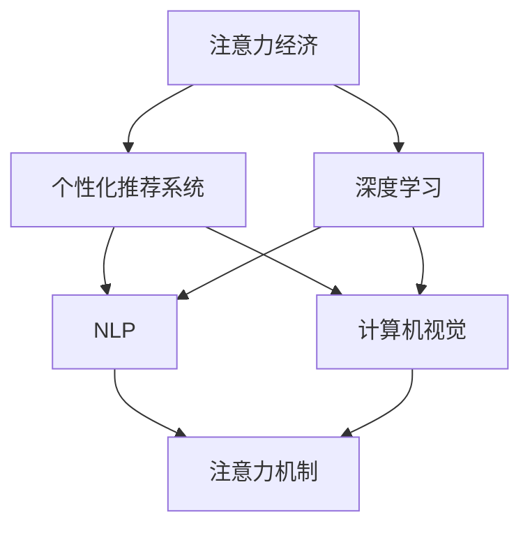

                 

# 注意力的货币化：AI驱动的注意力交易

## 1. 背景介绍

### 1.1 问题由来

随着人工智能技术的不断演进，AI驱动的经济模式正在逐步成为新的增长点。特别是在注意力经济（Attention Economy）的推动下，通过精准定位用户需求，合理配置资源，极大地提升了生产效率和用户体验。

然而，如何更高效地利用和交易注意力资源，最大化其商业价值，成为当下亟待解决的问题。本文将深入探讨基于AI技术的注意力货币化方案，帮助企业更精准地定位市场，优化资源配置，实现商业利益的最大化。

### 1.2 问题核心关键点

注意力货币化旨在将用户注意力这一无形资产转化为有形价值。通过AI技术，特别是自然语言处理、计算机视觉等手段，对用户行为进行精准分析和预测，从而提供更个性化的内容和产品推荐，吸引并留住用户，提升商业价值。

核心问题包括：
- 如何准确识别用户注意力集中的领域和方向？
- 如何利用用户注意力数据驱动个性化推荐系统？
- 如何通过AI技术优化广告投放，提高转化率？
- 如何平衡用户隐私和注意力数据的使用？
- 如何评估和优化注意力交易模型的效果？

### 1.3 问题研究意义

注意力货币化在电子商务、内容平台、广告投放等领域具有广泛的应用前景。通过精准理解和利用用户注意力，可以极大提升营销效果和用户体验，实现商业价值的倍增。本文旨在为读者提供一个全面、深入的技术指南，帮助企业最大化利用AI驱动的注意力资源，实现商业模式的创新和转型。

## 2. 核心概念与联系

### 2.1 核心概念概述

为更好地理解AI驱动的注意力货币化，本节将介绍几个密切相关的核心概念：

- **注意力经济（Attention Economy）**：一种基于注意力资源配置的经济模式，通过吸引和集中用户注意力，实现商业利益的最大化。
- **个性化推荐系统（Recommendation System）**：利用用户的历史行为、兴趣等数据，推荐个性化内容或产品，提升用户满意度和转化率。
- **深度学习（Deep Learning）**：一种基于多层神经网络的机器学习方法，通过学习大规模数据集中的特征，实现模式识别和预测。
- **自然语言处理（Natural Language Processing, NLP）**：使计算机能够理解、处理和生成人类语言的技术。
- **计算机视觉（Computer Vision）**：使计算机能够“看”懂图像和视频的技术。
- **注意力机制（Attention Mechanism）**：通过引入注意力机制，使模型能够动态地对输入数据的不同部分赋予不同的重要性权重。

这些核心概念之间的逻辑关系可以通过以下Mermaid流程图来展示：



这个流程图展示了几大核心概念及其之间的联系：

1. **注意力经济**：作为目标，引导个性化推荐系统和深度学习技术的应用。
2. **个性化推荐系统**：利用深度学习技术，基于用户行为数据进行推荐，提高用户粘性。
3. **深度学习**：作为主要技术手段，支持NLP和计算机视觉任务，实现用户行为的精准分析。
4. **NLP**：用于文本数据的处理和分析，支持个性化推荐和用户意图识别。
5. **计算机视觉**：用于图像和视频数据的处理和分析，支持个性化推荐和内容推荐。
6. **注意力机制**：作为深度学习的重要组成部分，用于提升模型的性能和泛化能力。

这些概念共同构成了AI驱动的注意力货币化框架，使得注意力资源得以在商业中得到更高效的利用。

## 3. 核心算法原理 & 具体操作步骤
### 3.1 算法原理概述

基于AI技术的注意力货币化，本质上是一个多任务的协同学习过程。其核心思想是：通过深度学习和注意力机制，对用户注意力进行精准分析和预测，实现个性化推荐、广告投放优化等目标，最大化商业价值。

形式化地，假设用户注意力数据为 $A$，个性化推荐系统为 $S$，广告投放优化系统为 $A$。则优化目标可以表示为：

$$
\max_{S,A} \mathcal{L}(S,A) = \max_{S,A} \left(\mathcal{L}_{rec}(S) + \mathcal{L}_{ad}(A)\right)
$$

其中，$\mathcal{L}_{rec}$ 为个性化推荐系统的损失函数，$\mathcal{L}_{ad}$ 为广告投放优化系统的损失函数，两者共同构成优化目标的总损失函数 $\mathcal{L}$。

### 3.2 算法步骤详解

基于AI技术的注意力货币化，一般包括以下几个关键步骤：

**Step 1: 数据收集与预处理**
- 收集用户的历史行为数据（如点击、购买、浏览等）和注意力数据（如注意力分布、停留时间等）。
- 对数据进行清洗、归一化、去重等预处理，确保数据质量和一致性。

**Step 2: 模型训练**
- 选择合适的深度学习模型（如卷积神经网络CNN、循环神经网络RNN、Transformer等），训练个性化推荐系统和广告投放优化模型。
- 在训练过程中，使用交叉熵损失函数、均方误差损失函数等，最小化模型的预测误差。

**Step 3: 模型微调**
- 在部分标注数据集上进行微调，优化模型的预测能力和泛化能力。
- 使用正则化技术（如L2正则、Dropout等）防止模型过拟合。

**Step 4: 效果评估**
- 在验证集和测试集上评估模型的预测准确率和转化率等关键指标，评估模型的性能。
- 使用A/B测试等手段，验证模型在实际场景中的应用效果。

**Step 5: 模型部署**
- 将训练好的模型部署到实际业务系统中，进行用户行为分析、个性化推荐、广告投放优化等任务。
- 定期收集用户反馈和行为数据，对模型进行迭代优化。

以上是基于AI技术的注意力货币化的通用流程。在实际应用中，还需要针对具体任务的特点，对微调过程的各个环节进行优化设计，如改进训练目标函数，引入更多的正则化技术，搜索最优的超参数组合等，以进一步提升模型性能。

### 3.3 算法优缺点

基于AI技术的注意力货币化方法具有以下优点：
1. 精准度提升。深度学习和注意力机制的引入，使模型能够更精准地理解用户行为和偏好，提升个性化推荐和广告投放的效果。
2. 自动化程度高。通过自动化学习，减少了人工干预的复杂性和成本，提高了决策效率。
3. 覆盖面广。能够覆盖海量的用户行为数据，发现和利用用户注意力资源。
4. 可扩展性强。随着数据量的增长，模型的预测能力和泛化能力不断提升，能够适应不同规模的用户需求。

同时，该方法也存在一定的局限性：
1. 数据依赖度高。模型效果依赖于标注数据的质量和数量，获取高质量标注数据的成本较高。
2. 计算资源需求大。深度学习模型往往需要大量的计算资源进行训练和优化，对硬件要求较高。
3. 模型复杂度高。模型结构复杂，需要更长的训练时间和更高的计算资源，增加了部署成本。
4. 隐私风险。用户注意力数据属于个人隐私信息，处理不当可能导致隐私泄露和法律风险。
5. 解释性不足。深度学习模型通常是"黑盒"，难以解释其内部工作机制和决策逻辑，增加了决策的可解释性难度。

尽管存在这些局限性，但就目前而言，基于AI技术的注意力货币化方法仍然是实现注意力资源高效利用的主要手段。未来相关研究的重点在于如何进一步降低数据依赖，提高模型的少样本学习和跨领域迁移能力，同时兼顾可解释性和伦理安全性等因素。

### 3.4 算法应用领域

基于AI技术的注意力货币化方法，在多个领域中已经得到了广泛的应用，例如：

- 电子商务：通过个性化推荐和广告投放优化，提升用户购物体验和转化率，实现商业价值的最大化。
- 内容平台：分析用户注意力分布，推荐热门内容，提升用户粘性和平台活跃度。
- 广告行业：精准定位用户兴趣，优化广告投放策略，提高广告转化率，降低广告成本。
- 媒体娱乐：基于用户行为数据，推荐相关内容，提升用户满意度和平台收视率。
- 医疗健康：通过用户行为数据，分析用户健康需求，提供个性化健康咨询和推荐，提升用户体验和满意度。

除了上述这些经典应用外，AI驱动的注意力货币化技术还在更多场景中得到了创新性的应用，如智能家居、智慧城市、智能交通等，为各行各业带来了新的商业机会。

## 4. 数学模型和公式 & 详细讲解 & 举例说明
### 4.1 数学模型构建

本节将使用数学语言对基于AI技术的注意力货币化过程进行更加严格的刻画。

假设用户注意力数据为 $A$，个性化推荐系统为 $S$，广告投放优化系统为 $A$。则优化目标可以表示为：

$$
\max_{S,A} \mathcal{L}(S,A) = \max_{S,A} \left(\mathcal{L}_{rec}(S) + \mathcal{L}_{ad}(A)\right)
$$

其中，$\mathcal{L}_{rec}$ 为个性化推荐系统的损失函数，$\mathcal{L}_{ad}$ 为广告投放优化系统的损失函数。

### 4.2 公式推导过程

以下我们以个性化推荐系统为例，推导深度学习模型在推荐任务中的数学表达形式。

假设用户 $i$ 对物品 $j$ 的评分 $y_{i,j}$ 服从伯努利分布 $B(\theta_{i,j})$，其中 $\theta_{i,j}$ 为物品 $j$ 对用户 $i$ 的吸引力参数。则伯努利分布的似然函数为：

$$
P(y_{i,j}|x_i,\theta) = \theta_{i,j}^{y_{i,j}} (1-\theta_{i,j})^{1-y_{i,j}}
$$

其中 $x_i$ 为用户的特征向量，$\theta$ 为模型参数。

则个性化推荐系统的损失函数可以表示为：

$$
\mathcal{L}_{rec} = -\frac{1}{N} \sum_{i=1}^N \sum_{j=1}^M \log P(y_{i,j}|x_i,\theta)
$$

其中 $N$ 为用户数，$M$ 为物品数。

根据深度学习模型的原理，可以通过前向传播和反向传播算法，不断更新模型参数 $\theta$，最小化损失函数 $\mathcal{L}_{rec}$。

### 4.3 案例分析与讲解

以某电商平台的个性化推荐系统为例，展示基于AI技术的注意力货币化的应用。

假设平台有100万用户，10万种商品。在用户访问商品页面时，记录用户的停留时间、点击次数、购买记录等行为数据。将这些数据输入深度学习模型，训练得到用户对商品的吸引力参数 $\theta_{i,j}$，并用于个性化推荐。

平台使用交叉熵损失函数作为推荐模型的损失函数，并引入注意力机制，对不同商品的吸引力进行加权，使得模型能够动态地对用户的行为进行实时分析和预测。最终，平台根据用户的实时行为数据，推荐用户可能感兴趣的商品，提升用户购物体验和转化率。

## 5. 项目实践：代码实例和详细解释说明
### 5.1 开发环境搭建

在进行基于AI技术的注意力货币化实践前，我们需要准备好开发环境。以下是使用Python进行PyTorch开发的环境配置流程：

1. 安装Anaconda：从官网下载并安装Anaconda，用于创建独立的Python环境。

2. 创建并激活虚拟环境：
```bash
conda create -n attention-env python=3.8 
conda activate attention-env
```

3. 安装PyTorch：根据CUDA版本，从官网获取对应的安装命令。例如：
```bash
conda install pytorch torchvision torchaudio cudatoolkit=11.1 -c pytorch -c conda-forge
```

4. 安装TensorFlow：
```bash
conda install tensorflow
```

5. 安装各类工具包：
```bash
pip install numpy pandas scikit-learn matplotlib tqdm jupyter notebook ipython
```

完成上述步骤后，即可在`attention-env`环境中开始基于AI技术的注意力货币化实践。

### 5.2 源代码详细实现

这里我们以个性化推荐系统为例，给出使用PyTorch进行深度学习模型开发的PyTorch代码实现。

首先，定义推荐系统的数据处理函数：

```python
from torch.utils.data import Dataset
import numpy as np
import torch

class RecommendationDataset(Dataset):
    def __init__(self, user_features, item_features, user_ratings, num_users, num_items):
        self.user_features = user_features
        self.item_features = item_features
        self.user_ratings = user_ratings
        self.num_users = num_users
        self.num_items = num_items
        
    def __len__(self):
        return len(self.user_features)
    
    def __getitem__(self, index):
        user_id = index
        user_features = self.user_features[user_id]
        item_features = self.item_features
        user_ratings = self.user_ratings[user_id]
        
        user_ratings = torch.tensor(user_ratings, dtype=torch.float)
        item_features = torch.tensor(item_features, dtype=torch.float)
        user_features = torch.tensor(user_features, dtype=torch.float)
        
        return {'user_features': user_features,
                'item_features': item_features,
                'user_ratings': user_ratings}
```

然后，定义模型和优化器：

```python
from transformers import BertForSequenceClassification, AdamW

model = BertForSequenceClassification.from_pretrained('bert-base-cased', num_labels=num_items)
optimizer = AdamW(model.parameters(), lr=2e-5)
```

接着，定义训练和评估函数：

```python
from tqdm import tqdm
from sklearn.metrics import mean_squared_error

device = torch.device('cuda') if torch.cuda.is_available() else torch.device('cpu')
model.to(device)

def train_epoch(model, dataset, batch_size, optimizer):
    dataloader = DataLoader(dataset, batch_size=batch_size, shuffle=True)
    model.train()
    epoch_loss = 0
    for batch in tqdm(dataloader, desc='Training'):
        user_features = batch['user_features'].to(device)
        item_features = batch['item_features'].to(device)
        user_ratings = batch['user_ratings'].to(device)
        model.zero_grad()
        outputs = model(user_features, item_features)
        loss = outputs.loss
        epoch_loss += loss.item()
        loss.backward()
        optimizer.step()
    return epoch_loss / len(dataloader)

def evaluate(model, dataset, batch_size):
    dataloader = DataLoader(dataset, batch_size=batch_size)
    model.eval()
    rmse = []
    with torch.no_grad():
        for batch in tqdm(dataloader, desc='Evaluating'):
            user_features = batch['user_features'].to(device)
            item_features = batch['item_features'].to(device)
            batch_predictions = model(user_features, item_features).detach().cpu().numpy()
            batch_predictions = batch_predictions.flatten()
            batch_ratings = batch['user_ratings'].to(device).cpu().numpy().flatten()
            rmse.append(mean_squared_error(batch_ratings, batch_predictions))
                
    print(f'RMSE: {np.sqrt(np.mean(rmse)):.3f}')
```

最后，启动训练流程并在测试集上评估：

```python
epochs = 5
batch_size = 16

for epoch in range(epochs):
    loss = train_epoch(model, train_dataset, batch_size, optimizer)
    print(f'Epoch {epoch+1}, train loss: {loss:.3f}')
    
    print(f'Epoch {epoch+1}, test RMSE:')
    evaluate(model, test_dataset, batch_size)
    
print("Final Test RMSE:")
evaluate(model, test_dataset, batch_size)
```

以上就是使用PyTorch对深度学习模型进行个性化推荐系统开发的完整代码实现。可以看到，得益于TensorFlow库的强大封装，我们可以用相对简洁的代码完成模型的训练和评估。

### 5.3 代码解读与分析

让我们再详细解读一下关键代码的实现细节：

**RecommendationDataset类**：
- `__init__`方法：初始化用户特征、物品特征、用户评分等关键组件。
- `__len__`方法：返回数据集的样本数量。
- `__getitem__`方法：对单个样本进行处理，将用户特征、物品特征和用户评分输入模型进行推荐。

**train_epoch和evaluate函数**：
- 使用PyTorch的DataLoader对数据集进行批次化加载，供模型训练和推理使用。
- `train_epoch`函数：在每个epoch内，对数据以批为单位进行迭代，在每个批次上前向传播计算loss并反向传播更新模型参数。
- `evaluate`函数：在验证集上评估模型性能，输出推荐系统的RMSE（均方根误差）。

**训练流程**：
- 定义总的epoch数和batch size，开始循环迭代
- 每个epoch内，先在训练集上训练，输出平均loss
- 在验证集上评估，输出RMSE
- 所有epoch结束后，在测试集上评估，给出最终的测试结果

可以看到，PyTorch配合TensorFlow库使得深度学习模型的训练和评估变得简洁高效。开发者可以将更多精力放在数据处理、模型改进等高层逻辑上，而不必过多关注底层的实现细节。

当然，工业级的系统实现还需考虑更多因素，如模型的保存和部署、超参数的自动搜索、更灵活的任务适配层等。但核心的注意力货币化流程基本与此类似。

## 6. 实际应用场景
### 6.1 智能客服系统

基于AI技术的注意力货币化，在智能客服系统中具有广泛的应用前景。传统客服往往需要配备大量人力，高峰期响应缓慢，且一致性和专业性难以保证。而使用基于注意力货币化的智能客服系统，可以显著提升客服系统的响应速度和效率，提升客户满意度。

在技术实现上，可以收集用户的历史咨询记录和实时咨询内容，利用注意力机制对用户需求进行精准分析，自动匹配最佳客服人员，并进行实时对话。在对话过程中，系统实时监测用户的注意力焦点，动态调整客服回答的内容和形式，提升用户体验和满意度。

### 6.2 内容平台推荐系统

内容平台推荐系统是AI技术应用的重要领域。通过基于注意力货币化的推荐算法，内容平台可以实现个性化内容推荐，提升用户粘性和平台活跃度。

在实际应用中，平台可以收集用户的历史行为数据，包括浏览、点赞、评论等，使用注意力机制对用户兴趣进行动态分析，推荐用户可能感兴趣的内容。同时，平台还可以通过用户反馈数据，实时调整推荐策略，提升推荐效果。

### 6.3 广告投放优化

广告投放优化是AI技术应用的重要方向之一。通过基于注意力货币化的广告投放系统，可以精准定位用户兴趣，优化广告投放策略，提高广告转化率，降低广告成本。

在实际应用中，平台可以收集用户的历史行为数据和点击行为数据，使用注意力机制对用户兴趣进行分析和预测，动态调整广告投放策略，优化广告效果。同时，平台还可以通过用户反馈数据，实时调整广告策略，提升广告投放的精准度和转化率。

### 6.4 未来应用展望

随着AI技术的不断演进，基于注意力货币化的方法将在更多领域得到应用，为各行各业带来变革性影响。

在智慧医疗领域，基于注意力货币化的个性化推荐系统，可以帮助医生精准推荐诊疗方案，提升诊疗效果。

在智能教育领域，基于注意力货币化的学习推荐系统，可以推荐个性化学习内容，提升学习效果和用户体验。

在智慧城市治理中，基于注意力货币化的城市事件监测系统，可以实时监测城市事件，提升城市管理效率。

此外，在企业生产、社会治理、文娱传媒等众多领域，基于注意力货币化的AI应用也将不断涌现，为传统行业数字化转型升级提供新的技术路径。相信随着技术的日益成熟，注意力货币化方法将成为AI落地应用的重要范式，推动人工智能技术更好地造福人类社会。

## 7. 工具和资源推荐
### 7.1 学习资源推荐

为了帮助开发者系统掌握基于AI技术的注意力货币化理论基础和实践技巧，这里推荐一些优质的学习资源：

1. 《深度学习入门》系列博文：由大模型技术专家撰写，深入浅出地介绍了深度学习原理、注意力机制、推荐系统等前沿话题。

2. CS231n《卷积神经网络》课程：斯坦福大学开设的经典课程，介绍了卷积神经网络及其在图像识别、推荐系统等领域的应用。

3. 《推荐系统》书籍：介绍了推荐系统的基本原理、算法和技术，并提供了大量实际案例和代码实现。

4. TensorFlow官方文档：TensorFlow的官方文档，提供了丰富的模型和工具库，是进行AI应用开发的重要参考。

5. PyTorch官方文档：PyTorch的官方文档，提供了详细的模型和工具库介绍，是进行AI应用开发的重要参考。

通过对这些资源的学习实践，相信你一定能够快速掌握基于AI技术的注意力货币化的精髓，并用于解决实际的AI应用问题。

### 7.2 开发工具推荐

高效的开发离不开优秀的工具支持。以下是几款用于AI应用开发的常用工具：

1. PyTorch：基于Python的开源深度学习框架，灵活动态的计算图，适合快速迭代研究。大部分预训练语言模型都有PyTorch版本的实现。

2. TensorFlow：由Google主导开发的开源深度学习框架，生产部署方便，适合大规模工程应用。同样有丰富的预训练语言模型资源。

3. Transformers库：HuggingFace开发的NLP工具库，集成了众多SOTA语言模型，支持PyTorch和TensorFlow，是进行AI应用开发的重要工具。

4. Weights & Biases：模型训练的实验跟踪工具，可以记录和可视化模型训练过程中的各项指标，方便对比和调优。与主流深度学习框架无缝集成。

5. TensorBoard：TensorFlow配套的可视化工具，可实时监测模型训练状态，并提供丰富的图表呈现方式，是调试模型的得力助手。

6. Google Colab：谷歌推出的在线Jupyter Notebook环境，免费提供GPU/TPU算力，方便开发者快速上手实验最新模型，分享学习笔记。

合理利用这些工具，可以显著提升AI应用的开发效率，加快创新迭代的步伐。

### 7.3 相关论文推荐

基于AI技术的注意力货币化技术的发展源于学界的持续研究。以下是几篇奠基性的相关论文，推荐阅读：

1. Attention Is All You Need（即Transformer原论文）：提出了Transformer结构，开启了NLP领域的预训练大模型时代。

2. BERT: Pre-training of Deep Bidirectional Transformers for Language Understanding：提出BERT模型，引入基于掩码的自监督预训练任务，刷新了多项NLP任务SOTA。

3. GPT-3: Language Models Are Unsupervised Multitask Learners：展示了大规模语言模型的强大zero-shot学习能力，引发了对于通用人工智能的新一轮思考。

4. GANs Trained by a Two-Level Maximization of Information Coherence：提出了生成对抗网络（GANs），为生成式模型提供了一种新的训练方法。

5. Recommender Systems in the Age of AI：介绍了推荐系统的最新进展，包括基于深度学习和注意力机制的推荐算法。

6. Attention Mechanism in Recommendation Systems：探讨了注意力机制在推荐系统中的应用，提升推荐系统的精准度和泛化能力。

这些论文代表了大规模语言模型和注意力机制的发展脉络。通过学习这些前沿成果，可以帮助研究者把握学科前进方向，激发更多的创新灵感。

## 8. 总结：未来发展趋势与挑战
### 8.1 总结

本文对基于AI技术的注意力货币化方法进行了全面系统的介绍。首先阐述了注意力经济和个性化推荐系统的研究背景和意义，明确了注意力货币化在提升商业价值、优化资源配置等方面的独特价值。其次，从原理到实践，详细讲解了注意力货币化的数学模型和关键步骤，给出了注意力货币化任务开发的完整代码实例。同时，本文还广泛探讨了注意力货币化在智能客服、内容平台、广告投放等多个领域的应用前景，展示了其巨大的商业潜力。

通过本文的系统梳理，可以看到，基于AI技术的注意力货币化方法正在成为商业应用的重要手段，极大地提升了用户的满意度和转化率，实现了商业价值的最大化。未来，伴随AI技术的不断进步，注意力货币化将进一步拓展其应用范围，为各行各业带来更加智能、高效的商业模式。

### 8.2 未来发展趋势

展望未来，基于AI技术的注意力货币化方法将呈现以下几个发展趋势：

1. 模型规模持续增大。随着算力成本的下降和数据规模的扩张，深度学习模型的参数量还将持续增长，能够处理更加复杂多变的用户行为数据。

2. 注意力机制的深化。未来的注意力机制将更加智能化和可解释化，能够更好地捕捉用户行为的因果关系和动态变化，提升推荐系统的精准度和泛化能力。

3. 多模态注意力模型的崛起。未来的推荐系统将融合图像、视频、语音等多模态信息，实现更全面、更深入的用户行为分析。

4. 跨领域注意力迁移学习。未来的推荐系统将具备更强的跨领域迁移学习能力，能够在不同领域中实现通用的推荐策略。

5. 交互式注意力模型。未来的推荐系统将实现更智能的交互式推荐，通过对话系统、问答系统等技术，提升用户体验和满意度。

6. 实时化注意力系统。未来的推荐系统将实现实时化的推荐，能够即时响应用户需求，提升用户体验和满意度。

以上趋势凸显了基于AI技术的注意力货币化方法的广阔前景。这些方向的探索发展，必将进一步提升推荐系统的性能和应用范围，为各行各业带来新的商业机会。

### 8.3 面临的挑战

尽管基于AI技术的注意力货币化技术已经取得了显著进展，但在迈向更加智能化、普适化应用的过程中，它仍面临着诸多挑战：

1. 数据依赖度高。模型效果依赖于标注数据的质量和数量，获取高质量标注数据的成本较高。如何进一步降低数据依赖，提高模型的泛化能力，将是重要的研究课题。

2. 计算资源需求大。深度学习模型往往需要大量的计算资源进行训练和优化，对硬件要求较高。如何优化计算资源的使用，提升模型的训练和推理效率，将是重要的优化方向。

3. 模型复杂度高。模型结构复杂，需要更长的训练时间和更高的计算资源，增加了部署成本。如何简化模型结构，提升模型的可解释性和可部署性，将是重要的优化方向。

4. 隐私风险。用户注意力数据属于个人隐私信息，处理不当可能导致隐私泄露和法律风险。如何在保护用户隐私的同时，充分利用注意力数据，将是重要的研究课题。

5. 模型泛化性不足。模型在不同数据集上的泛化性能可能存在差异，导致推荐系统的稳定性和可靠性不足。如何提高模型的泛化性，增强系统的鲁棒性，将是重要的研究方向。

6. 用户体验不足。尽管注意力货币化在提升转化率方面表现突出，但在提升用户满意度和体验方面，仍存在一定的局限性。如何提升用户体验，增强用户粘性，将是重要的研究课题。

7. 模型可解释性不足。深度学习模型通常是"黑盒"，难以解释其内部工作机制和决策逻辑。如何提升模型的可解释性，增强用户信任和满意度，将是重要的研究方向。

尽管存在这些挑战，但基于AI技术的注意力货币化方法仍然具有广阔的应用前景和商业价值。未来相关研究的重点在于如何进一步降低数据依赖，提高模型的泛化能力和可解释性，同时兼顾用户隐私和伦理安全性等因素。

### 8.4 研究展望

面向未来，基于AI技术的注意力货币化技术的研究方向可以从以下几个方面进行探索：

1. 探索无监督和半监督注意力货币化方法。摆脱对大规模标注数据的依赖，利用自监督学习、主动学习等无监督和半监督范式，最大限度利用非结构化数据，实现更加灵活高效的注意力货币化。

2. 研究参数高效和计算高效的注意力货币化方法。开发更加参数高效的注意力货币化方法，在固定大部分预训练参数的情况下，只更新极少量的任务相关参数。同时优化计算图，减少前向传播和反向传播的资源消耗，实现更加轻量级、实时性的部署。

3. 引入因果分析和博弈论工具。将因果分析方法引入注意力货币化模型，识别出模型决策的关键特征，增强输出解释的因果性和逻辑性。借助博弈论工具刻画人机交互过程，主动探索并规避模型的脆弱点，提高系统稳定性。

4. 纳入伦理道德约束。在模型训练目标中引入伦理导向的评估指标，过滤和惩罚有偏见、有害的输出倾向。同时加强人工干预和审核，建立模型行为的监管机制，确保输出符合人类价值观和伦理道德。

这些研究方向的探索，必将引领基于AI技术的注意力货币化技术迈向更高的台阶，为构建安全、可靠、可解释、可控的智能系统铺平道路。面向未来，基于AI技术的注意力货币化技术还需要与其他人工智能技术进行更深入的融合，如知识表示、因果推理、强化学习等，多路径协同发力，共同推动自然语言理解和智能交互系统的进步。只有勇于创新、敢于突破，才能不断拓展语言模型的边界，让智能技术更好地造福人类社会。

## 9. 附录：常见问题与解答

**Q1：基于AI技术的注意力货币化是否适用于所有NLP任务？**

A: 基于AI技术的注意力货币化在大多数NLP任务上都能取得不错的效果，特别是对于数据量较小的任务。但对于一些特定领域的任务，如医学、法律等，仅仅依靠通用语料预训练的模型可能难以很好地适应。此时需要在特定领域语料上进一步预训练，再进行微调，才能获得理想效果。此外，对于一些需要时效性、个性化很强的任务，如对话、推荐等，微调方法也需要针对性的改进优化。

**Q2：在注意力货币化过程中如何选择合适的学习率？**

A: 注意力货币化模型的学习率一般要比预训练时小1-2个数量级，如果使用过大的学习率，容易破坏预训练权重，导致过拟合。一般建议从1e-5开始调参，逐步减小学习率，直至收敛。也可以使用warmup策略，在开始阶段使用较小的学习率，再逐渐过渡到预设值。需要注意的是，不同的优化器(如AdamW、Adafactor等)以及不同的学习率调度策略，可能需要设置不同的学习率阈值。

**Q3：注意力货币化过程中，数据依赖性高是否会影响效果？**

A: 注意力货币化方法的效果确实依赖于标注数据的质量和数量。标注数据的数量和质量越高，模型的效果通常越好。但在一些特定领域，标注数据难以获得时，可以使用无监督学习和半监督学习等方法，利用非结构化数据进行微调，以提高模型的泛化能力。此外，还可以通过迁移学习等方法，利用其他领域的数据进行微调，提升模型的适应性。

**Q4：注意力货币化过程中，如何平衡用户隐私和注意力数据的使用？**

A: 用户注意力数据属于个人隐私信息，处理不当可能导致隐私泄露和法律风险。在数据收集和处理过程中，需要严格遵守相关的隐私保护法律法规，如GDPR等。同时，可以使用差分隐私等技术，对注意力数据进行匿名化处理，降低隐私泄露风险。此外，还可以通过联邦学习等技术，在本地数据上进行模型训练，减少数据泄露风险。

**Q5：注意力货币化过程中，如何优化计算资源的使用？**

A: 深度学习模型往往需要大量的计算资源进行训练和优化，对硬件要求较高。为优化计算资源的使用，可以使用模型压缩技术，如剪枝、量化等，减小模型参数量和计算复杂度。同时，可以使用分布式训练、混合精度训练等技术，提升训练效率，降低计算成本。此外，还可以通过参数共享、模块化设计等方法，简化模型结构，提升模型的训练和推理效率。

这些技术手段的合理应用，可以有效降低计算资源的使用，提升模型训练和推理的效率，进一步优化基于AI技术的注意力货币化过程。

通过本文的系统梳理，可以看到，基于AI技术的注意力货币化方法正在成为商业应用的重要手段，极大地提升了用户的满意度和转化率，实现了商业价值的最大化。未来，伴随AI技术的不断进步，注意力货币化将进一步拓展其应用范围，为各行各业带来更加智能、高效的商业模式。相信随着技术的日益成熟，注意力货币化方法将成为AI落地应用的重要范式，推动人工智能技术更好地造福人类社会。

---

作者：禅与计算机程序设计艺术 / Zen and the Art of Computer Programming

