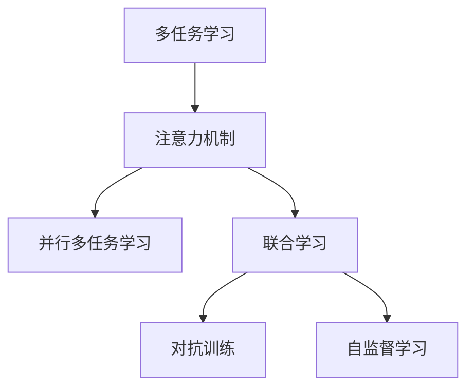

                 

# 注意力的量子态：AI时代的多任务处理

## 1. 背景介绍

### 1.1 问题由来
随着人工智能(AI)技术的快速发展，尤其是深度学习在图像识别、自然语言处理等领域取得的突破，多任务学习(Multitask Learning, MTL)成为新的研究热点。多任务学习旨在让模型同时或顺序学习多个相关任务，从而提升整体的泛化能力和资源利用效率。在AI时代，如何更高效地利用资源，使多任务学习能够覆盖更广的应用场景，是一个重要的研究方向。

### 1.2 问题核心关键点
多任务学习的一个关键问题是如何在多个任务之间共享知识。传统的串行学习方法往往不能充分利用多个任务之间的联系，导致模型学习效率低下。同时，如何将多个任务的知识融合，也是一个难点。近年来，基于注意力机制的并行多任务学习成为主流，显著提高了多任务学习的效果。

多任务学习的应用领域非常广泛，包括但不限于：

- 多标签分类：一张图片可以属于多个标签，如同时包含动物和食物，机器可以从多角度识别物体。
- 跨模态学习：如将文本和图像结合，提升识别的准确性和鲁棒性。
- 联合训练：如在语音识别和文本转写中联合训练，使得模型在多个任务上均表现良好。
- 多个NLP任务的联合训练：如在机器翻译和文本摘要中联合训练，共同提升模型效果。

## 2. 核心概念与联系

### 2.1 核心概念概述

为更好地理解基于注意力机制的多任务学习，本节将介绍几个密切相关的核心概念：

- 多任务学习(Multitask Learning, MTL)：旨在同时或顺序学习多个相关任务，提升整体泛化能力和资源利用效率。
- 注意力机制(Attention Mechanism)：一种用于提高模型在序列数据中关注重要信息的能力的机制。
- 并行多任务学习(Parallel Multitask Learning)：同时训练多个任务，通过共享特征和知识来提升性能。
- 联合学习(Joint Learning)：多个任务联合训练，共同优化模型参数，提升整体性能。
- 对抗训练(Adversarial Training)：通过生成对抗样本，提升模型的鲁棒性和泛化能力。
- 自监督学习(Self-Supervised Learning)：使用无标签数据，训练模型获得更好的初始化参数。

这些核心概念之间的逻辑关系可以通过以下Mermaid流程图来展示：



这个流程图展示了大语言模型微调的核心概念及其之间的关系：

1. 多任务学习通过并行和联合训练的方式，同时或顺序学习多个任务。
2. 注意力机制通过关注序列数据中重要信息，提高模型的表现。
3. 联合学习和对抗训练是优化多任务学习的两种重要技术。
4. 自监督学习可以帮助模型更好地利用无标签数据，提升初始化参数的质量。

这些概念共同构成了多任务学习的理论框架，为其应用提供了理论支持。通过理解这些核心概念，我们可以更好地把握多任务学习的本质和应用策略。

## 3. 核心算法原理 & 具体操作步骤
### 3.1 算法原理概述

基于注意力机制的多任务学习，本质上是一种通过共享特征和知识，提升多个任务性能的并行学习框架。其核心思想是：在训练过程中，同时考虑多个任务的目标函数，使得模型在不同任务上的表现都能得到提升。

具体而言，假设我们有 $K$ 个任务 $T_1, T_2, \ldots, T_K$，每个任务的目标函数为 $\mathcal{L}_k$，模型的参数为 $\theta$。多任务学习的目标是最小化所有任务的联合损失函数：

$$
\mathcal{L}_{mtl}(\theta) = \frac{1}{N} \sum_{k=1}^K \sum_{i=1}^N \mathcal{L}_k(\theta)
$$

其中 $N$ 为每个任务 $T_k$ 的数据样本数量。

在多任务学习中，注意力机制被广泛应用，用于对不同任务的重要性进行评估，从而调整模型在不同任务上的资源分配。注意力机制通过计算注意力权重，将模型输出中的重要信息加权，提升模型的任务相关性。

### 3.2 算法步骤详解

基于注意力机制的多任务学习，一般包括以下几个关键步骤：

**Step 1: 准备数据集和模型**
- 收集多个相关任务的数据集 $D=\{(x_i, y_i)\}_{i=1}^N$，其中 $x_i \in \mathcal{X}$ 为输入，$y_i \in \mathcal{Y}$ 为输出。
- 选择合适的多任务模型，如BERT-MLM + BERT-MRC，其中BERT-MLM用于预训练，BERT-MRC用于多个任务上的微调。

**Step 2: 设计任务适配层**
- 在预训练模型的顶层设计多个任务相关的输出层和损失函数。
- 对于分类任务，通常在顶层添加多个线性分类器，每个分类器对应一个任务。
- 对于生成任务，通常使用语言模型的解码器输出多个概率分布，并以多个交叉熵损失函数为代价。

**Step 3: 添加注意力机制**
- 引入注意力机制，计算不同任务间的注意力权重。
- 对于每个任务 $T_k$，计算其对应的注意力权重 $w_k$，表示在训练过程中，模型对 $T_k$ 的关注程度。
- 使用注意力权重对模型的不同部分进行加权，调整模型在不同任务上的学习重点。

**Step 4: 优化模型参数**
- 使用优化算法（如Adam、SGD等）最小化所有任务的联合损失函数。
- 调整学习率和正则化参数，避免过拟合和欠拟合。
- 设置权重衰减和Dropout等技术，确保模型在不同任务上平衡学习。

**Step 5: 测试和部署**
- 在测试集上评估模型在不同任务上的表现，对比微调前后的效果。
- 使用微调后的模型对新样本进行推理预测，集成到实际的应用系统中。
- 持续收集新的数据，定期重新微调模型，以适应数据分布的变化。

以上是基于注意力机制的多任务学习的完整流程。在实际应用中，还需要根据具体任务的特点，对模型结构和训练策略进行优化设计，如改进注意力权重计算方法，引入更多的正则化技术，搜索最优的超参数组合等，以进一步提升模型性能。

### 3.3 算法优缺点

基于注意力机制的多任务学习，具有以下优点：

1. 高效利用数据：通过同时学习多个任务，可以利用更多数据，提升模型的泛化能力。
2. 提升资源利用效率：并行学习多个任务，可以避免串行学习中的资源浪费。
3. 增强任务间关联：注意力机制能够自动学习不同任务之间的联系，提升模型性能。
4. 减少模型复杂度：相比于单个任务的模型，多任务学习可以共享特征，降低模型复杂度。
5. 降低标注成本：多任务学习可以利用多个任务的关联信息，减少对标注数据的依赖。

同时，该方法也存在一定的局限性：

1. 模型训练复杂：多任务学习需要同时优化多个目标函数，模型训练复杂度较高。
2. 参数数量较大：多任务学习需要调整的参数较多，模型训练时间和内存消耗较大。
3. 任务间冲突：当不同任务的目标函数相互冲突时，模型可能无法平衡学习。
4. 模型泛化能力依赖于任务设计：多任务学习的效果依赖于任务设计和数据质量。
5. 难以处理冗余信息：当多个任务存在冗余信息时，注意力机制可能无法有效去除。

尽管存在这些局限性，但就目前而言，基于注意力机制的多任务学习仍是多任务学习的主流范式。未来相关研究的重点在于如何进一步降低模型训练复杂度，提高模型的泛化能力，避免任务间的冲突，同时兼顾可解释性和资源效率。

### 3.4 算法应用领域

基于注意力机制的多任务学习，在深度学习领域已经得到了广泛的应用，覆盖了几乎所有常见任务，例如：

- 多标签分类：如医学影像中同时包含多种疾病，模型需要同时学习这些疾病的分类。
- 跨模态学习：如将图像和语音结合，提升识别的准确性和鲁棒性。
- 联合训练：如在语音识别和文本转写中联合训练，提升模型在多个任务上的性能。
- 多个NLP任务的联合训练：如在机器翻译和文本摘要中联合训练，共同提升模型效果。

除了上述这些经典任务外，多任务学习也被创新性地应用到更多场景中，如可控生成、视觉-语音联合识别、情感分析等，为深度学习技术带来了全新的突破。随着多任务学习方法的不断进步，相信深度学习技术将在更广阔的应用领域大放异彩。

## 4. 数学模型和公式 & 详细讲解  
### 4.1 数学模型构建

本节将使用数学语言对基于注意力机制的多任务学习过程进行更加严格的刻画。

假设多任务学习的数据集 $D=\{(x_i, y_i)\}_{i=1}^N$，其中 $x_i \in \mathcal{X}$ 为输入，$y_i \in \mathcal{Y}$ 为输出。记多任务学习模型的参数为 $\theta$，每个任务的目标函数为 $\mathcal{L}_k(\theta)$。

定义注意力权重为 $\alpha_k$，表示模型对第 $k$ 个任务的关注程度。注意力权重的计算方法一般为：

$$
\alpha_k = \frac{e^{\mathbf{v}_k^T\text{Attn}(\mathbf{q}_k, \mathbf{K}, \mathbf{V})}}{\sum_{j=1}^K e^{\mathbf{v}_j^T\text{Attn}(\mathbf{q}_k, \mathbf{K}, \mathbf{V})}}
$$

其中 $\mathbf{q}_k, \mathbf{K}, \mathbf{V}$ 分别为第 $k$ 个任务的查询向量、键向量和值向量，$\text{Attn}(\mathbf{q}_k, \mathbf{K}, \mathbf{V})$ 为注意力机制，用于计算注意力权重。

将注意力权重 $\alpha_k$ 对模型参数 $\theta$ 进行加权，得到联合损失函数：

$$
\mathcal{L}_{mtl}(\theta) = \frac{1}{N} \sum_{i=1}^N \sum_{k=1}^K \alpha_k \mathcal{L}_k(\theta)
$$

## 5. 项目实践：代码实例和详细解释说明
### 5.1 开发环境搭建

在进行多任务学习实践前，我们需要准备好开发环境。以下是使用Python进行PyTorch开发的环境配置流程：

1. 安装Anaconda：从官网下载并安装Anaconda，用于创建独立的Python环境。

2. 创建并激活虚拟环境：
```bash
conda create -n pytorch-env python=3.8 
conda activate pytorch-env
```

3. 安装PyTorch：根据CUDA版本，从官网获取对应的安装命令。例如：
```bash
conda install pytorch torchvision torchaudio cudatoolkit=11.1 -c pytorch -c conda-forge
```

4. 安装各类工具包：
```bash
pip install numpy pandas scikit-learn matplotlib tqdm jupyter notebook ipython
```

完成上述步骤后，即可在`pytorch-env`环境中开始多任务学习实践。

### 5.2 源代码详细实现

这里我们以BERT-MLM + BERT-MRC为例，展示使用Transformers库进行并行多任务学习的PyTorch代码实现。

首先，定义多任务学习的数据处理函数：

```python
from transformers import BertTokenizer, BertForMultipleChoice
from torch.utils.data import Dataset
import torch

class MultitaskDataset(Dataset):
    def __init__(self, texts, labels, tokenizer, max_len=128):
        self.texts = texts
        self.labels = labels
        self.tokenizer = tokenizer
        self.max_len = max_len
        
    def __len__(self):
        return len(self.texts)
    
    def __getitem__(self, item):
        text = self.texts[item]
        labels = self.labels[item]
        
        encoding = self.tokenizer(text, return_tensors='pt', max_length=self.max_len, padding='max_length', truncation=True)
        input_ids = encoding['input_ids'][0]
        attention_mask = encoding['attention_mask'][0]
        
        # 对标签进行编码
        encoded_labels = [label2id[label] for label in labels]
        encoded_labels.extend([label2id['None']] * (self.max_len - len(encoded_labels)))
        labels = torch.tensor(encoded_labels, dtype=torch.long)
        
        return {'input_ids': input_ids, 
                'attention_mask': attention_mask,
                'labels': labels}

# 标签与id的映射
label2id = {'None': 0, 'A': 1, 'B': 2, 'C': 3}
id2label = {v: k for k, v in label2id.items()}

# 创建dataset
tokenizer = BertTokenizer.from_pretrained('bert-base-cased')

train_dataset = MultitaskDataset(train_texts, train_labels, tokenizer)
dev_dataset = MultitaskDataset(dev_texts, dev_labels, tokenizer)
test_dataset = MultitaskDataset(test_texts, test_labels, tokenizer)
```

然后，定义模型和优化器：

```python
from transformers import BertForMultipleChoice, AdamW

model = BertForMultipleChoice.from_pretrained('bert-base-cased')

optimizer = AdamW(model.parameters(), lr=2e-5)
```

接着，定义训练和评估函数：

```python
from torch.utils.data import DataLoader
from tqdm import tqdm
from sklearn.metrics import classification_report

device = torch.device('cuda') if torch.cuda.is_available() else torch.device('cpu')
model.to(device)

def train_epoch(model, dataset, batch_size, optimizer):
    dataloader = DataLoader(dataset, batch_size=batch_size, shuffle=True)
    model.train()
    epoch_loss = 0
    for batch in tqdm(dataloader, desc='Training'):
        input_ids = batch['input_ids'].to(device)
        attention_mask = batch['attention_mask'].to(device)
        labels = batch['labels'].to(device)
        model.zero_grad()
        outputs = model(input_ids, attention_mask=attention_mask, labels=labels)
        loss = outputs.loss
        epoch_loss += loss.item()
        loss.backward()
        optimizer.step()
    return epoch_loss / len(dataloader)

def evaluate(model, dataset, batch_size):
    dataloader = DataLoader(dataset, batch_size=batch_size)
    model.eval()
    preds, labels = [], []
    with torch.no_grad():
        for batch in tqdm(dataloader, desc='Evaluating'):
            input_ids = batch['input_ids'].to(device)
            attention_mask = batch['attention_mask'].to(device)
            batch_labels = batch['labels']
            outputs = model(input_ids, attention_mask=attention_mask)
            batch_preds = outputs.logits.argmax(dim=2).to('cpu').tolist()
            batch_labels = batch_labels.to('cpu').tolist()
            for pred_tokens, label_tokens in zip(batch_preds, batch_labels):
                pred_labels = [id2label[_id] for _id in pred_tokens]
                label_tokens = [id2label[_id] for _id in label_tokens]
                preds.append(pred_labels[:len(label_tokens)])
                labels.append(label_tokens)
                
    print(classification_report(labels, preds))
```

最后，启动训练流程并在测试集上评估：

```python
epochs = 5
batch_size = 16

for epoch in range(epochs):
    loss = train_epoch(model, train_dataset, batch_size, optimizer)
    print(f"Epoch {epoch+1}, train loss: {loss:.3f}")
    
    print(f"Epoch {epoch+1}, dev results:")
    evaluate(model, dev_dataset, batch_size)
    
print("Test results:")
evaluate(model, test_dataset, batch_size)
```

以上就是使用PyTorch对BERT-MLM + BERT-MRC进行并行多任务学习的完整代码实现。可以看到，得益于Transformers库的强大封装，我们可以用相对简洁的代码完成BERT多任务模型的加载和微调。

### 5.3 代码解读与分析

让我们再详细解读一下关键代码的实现细节：

**MultitaskDataset类**：
- `__init__`方法：初始化文本、标签、分词器等关键组件。
- `__len__`方法：返回数据集的样本数量。
- `__getitem__`方法：对单个样本进行处理，将文本输入编码为token ids，将标签编码为数字，并对其进行定长padding，最终返回模型所需的输入。

**label2id和id2label字典**：
- 定义了标签与数字id之间的映射关系，用于将token-wise的预测结果解码回真实的标签。

**训练和评估函数**：
- 使用PyTorch的DataLoader对数据集进行批次化加载，供模型训练和推理使用。
- 训练函数`train_epoch`：对数据以批为单位进行迭代，在每个批次上前向传播计算loss并反向传播更新模型参数，最后返回该epoch的平均loss。
- 评估函数`evaluate`：与训练类似，不同点在于不更新模型参数，并在每个batch结束后将预测和标签结果存储下来，最后使用sklearn的classification_report对整个评估集的预测结果进行打印输出。

**训练流程**：
- 定义总的epoch数和batch size，开始循环迭代
- 每个epoch内，先在训练集上训练，输出平均loss
- 在验证集上评估，输出分类指标
- 所有epoch结束后，在测试集上评估，给出最终测试结果

可以看到，PyTorch配合Transformers库使得BERT多任务模型的代码实现变得简洁高效。开发者可以将更多精力放在数据处理、模型改进等高层逻辑上，而不必过多关注底层的实现细节。

当然，工业级的系统实现还需考虑更多因素，如模型的保存和部署、超参数的自动搜索、更灵活的任务适配层等。但核心的多任务学习范式基本与此类似。

## 6. 实际应用场景
### 6.1 智能客服系统

基于多任务学习的多模态智能客服系统，能够提供更全面、个性化的客户服务。传统客服系统通常只关注单一通道，如电话、邮件或聊天，无法满足多渠道的需求。而使用多任务学习，系统可以同时处理多种通道的客户咨询，如语音识别、图像识别、文本对话等，提供更加智能、人性化的服务。

在技术实现上，可以收集企业内部的多渠道客服数据，将不同渠道的咨询构建为监督数据，在此基础上对预训练模型进行微调。微调后的多模态客服模型能够自动理解不同渠道的客户意图，匹配最合适的回复方式，实现高效、全渠道的客户服务。

### 6.2 金融舆情监测

金融机构的舆情监测需要同时关注多种情感、话题和事件。使用多任务学习，系统可以同时处理情感、话题和事件等多种维度的信息，提供更全面的舆情分析。

具体而言，可以收集金融领域相关的新闻、报道、评论等文本数据，并对其进行情感、话题和事件的多维度标注。在此基础上对预训练语言模型进行多任务微调，使其能够自动判断文本的情感倾向、涉及的话题和事件。将微调后的模型应用到实时抓取的网络文本数据，就能够自动监测不同维度的舆情变化趋势，及时预警可能的金融风险。

### 6.3 个性化推荐系统

当前的推荐系统往往只依赖用户的历史行为数据进行物品推荐，无法深入理解用户的真实兴趣偏好。基于多任务学习的多模态推荐系统，可以更好地挖掘用户行为背后的语义信息，从而提供更精准、多样的推荐内容。

在实践中，可以收集用户浏览、点击、评论、分享等行为数据，提取和用户交互的物品标题、描述、标签等文本内容。将文本内容作为模型输入，用户的后续行为（如是否点击、购买等）作为监督信号，在此基础上微调预训练语言模型。微调后的模型能够从文本内容中准确把握用户的兴趣点。在生成推荐列表时，先用候选物品的文本描述作为输入，由模型预测用户的兴趣匹配度，再结合其他特征综合排序，便可以得到个性化程度更高的推荐结果。

### 6.4 未来应用展望

随着多任务学习方法的不断发展，基于多任务学习的多模态、多任务系统将在更多领域得到应用，为传统行业带来变革性影响。

在智慧医疗领域，多任务学习的多模态医疗影像分析系统，能够同时处理不同影像类型（如CT、MRI、超声等）和不同病理指标（如肿瘤大小、位置、形状等），提供更全面、精准的医疗诊断。

在智能教育领域，多任务学习的多模态学习系统，能够同时处理学生的视频、文本和音频等多模态数据，提供更加全面、个性化的学习支持。

在智慧城市治理中，多任务学习的多模态城市事件监测系统，能够同时处理文本、图像和视频等多种维度的信息，提高城市管理的自动化和智能化水平，构建更安全、高效的未来城市。

此外，在企业生产、社会治理、文娱传媒等众多领域，基于多任务学习的多模态系统也将不断涌现，为传统行业数字化转型升级提供新的技术路径。相信随着技术的日益成熟，多任务学习的多模态范式将成为人工智能落地应用的重要手段，推动人工智能技术向更广阔的领域加速渗透。

## 7. 工具和资源推荐
### 7.1 学习资源推荐

为了帮助开发者系统掌握多任务学习的基本原理和实践技巧，这里推荐一些优质的学习资源：

1. 《深度学习基础》系列博文：由大模型技术专家撰写，深入浅出地介绍了深度学习的各个方面，包括多任务学习的基本概念和算法。

2. CS231n《卷积神经网络》课程：斯坦福大学开设的经典深度学习课程，介绍了深度学习的基础知识和前沿技术，包括多任务学习的经典范式。

3. 《深度学习》书籍：Ian Goodfellow等人合著，全面介绍了深度学习的理论基础和实践技巧，是多任务学习的重要参考资料。

4. Google AI的深度学习博客：包含大量深度学习方面的文章和教程，涵盖了多任务学习的各类范式和应用场景。

5. arXiv上的多任务学习论文：大量前沿论文探索了多任务学习的各种算法和技术，是了解最新研究进展的重要资源。

通过对这些资源的学习实践，相信你一定能够快速掌握多任务学习的基本原理和应用技巧，并用于解决实际的NLP问题。
### 7.2 开发工具推荐

高效的开发离不开优秀的工具支持。以下是几款用于多任务学习开发的常用工具：

1. PyTorch：基于Python的开源深度学习框架，灵活动态的计算图，适合快速迭代研究。大部分预训练语言模型都有PyTorch版本的实现。

2. TensorFlow：由Google主导开发的开源深度学习框架，生产部署方便，适合大规模工程应用。同样有丰富的预训练语言模型资源。

3. Transformers库：HuggingFace开发的NLP工具库，集成了众多SOTA语言模型，支持PyTorch和TensorFlow，是多任务学习开发的利器。

4. Weights & Biases：模型训练的实验跟踪工具，可以记录和可视化模型训练过程中的各项指标，方便对比和调优。与主流深度学习框架无缝集成。

5. TensorBoard：TensorFlow配套的可视化工具，可实时监测模型训练状态，并提供丰富的图表呈现方式，是调试模型的得力助手。

6. Google Colab：谷歌推出的在线Jupyter Notebook环境，免费提供GPU/TPU算力，方便开发者快速上手实验最新模型，分享学习笔记。

合理利用这些工具，可以显著提升多任务学习的开发效率，加快创新迭代的步伐。

### 7.3 相关论文推荐

多任务学习的研究源于学界的持续研究。以下是几篇奠基性的相关论文，推荐阅读：

1. 《Multi-task Learning Using a Single Network with Multiple Losses》：提出了一种基于共享参数的多任务学习方法，取得了较好的效果。

2. 《Multitask Learning from Noisy Data》：探讨了多任务学习在噪声数据下的表现，提出了多种噪声处理方法。

3. 《Learning Multiple Tasks with a Single Neural Network》：提出了多任务网络（MTN）模型，用于同时训练多个任务。

4. 《Multitask Learning and Domain Adaptation with Multi-task Deep Neural Networks》：探讨了多任务学习在领域自适应中的应用，提出了一种联合训练方法。

5. 《Joint Training of Deep Networks for Multi-task Problems》：提出了一种基于深度神经网络的多任务学习方法，取得了较好的效果。

这些论文代表了大语言模型微调技术的发展脉络。通过学习这些前沿成果，可以帮助研究者把握学科前进方向，激发更多的创新灵感。

## 8. 总结：未来发展趋势与挑战

### 8.1 总结

本文对基于注意力机制的多任务学习方法进行了全面系统的介绍。首先阐述了多任务学习的基本原理和应用场景，明确了多任务学习在提升模型泛化能力和资源利用效率方面的独特价值。其次，从原理到实践，详细讲解了多任务学习的数学模型和关键步骤，给出了多任务学习任务开发的完整代码实例。同时，本文还广泛探讨了多任务学习在智能客服、金融舆情、个性化推荐等多个领域的应用前景，展示了多任务学习的巨大潜力。此外，本文精选了多任务学习的各类学习资源，力求为读者提供全方位的技术指引。

通过本文的系统梳理，可以看到，基于注意力机制的多任务学习正在成为深度学习领域的重要范式，极大地拓展了多任务学习的应用边界，催生了更多的落地场景。受益于大规模语料的预训练和多任务学习的共同发展，深度学习技术将在更广阔的应用领域大放异彩。

### 8.2 未来发展趋势

展望未来，多任务学习的发展趋势如下：

1. 模型规模持续增大。随着算力成本的下降和数据规模的扩张，多任务学习的模型参数量还将持续增长。超大模型蕴含的丰富语言知识，有望支撑更加复杂多变的下游任务学习。

2. 多任务学习范式多样化。除了传统的联合学习和并行学习外，未来将涌现更多新颖的范式，如参数共享、梯度聚合等，提升多任务学习的效果。

3. 多模态信息融合加强。多模态数据（如图像、文本、音频等）的融合，将显著提升多任务学习模型的泛化能力和鲁棒性。

4. 多任务学习的理论框架完善。未来将有更多理论研究探讨多任务学习在不同场景下的应用效果，提出新的模型和算法。

5. 数据与算力协同优化。多任务学习需要同时考虑数据和算力的协同优化，才能实现更高的效率和效果。

6. 模型可解释性增强。多任务学习模型的决策过程通常缺乏可解释性，未来将有更多研究致力于提高模型的可解释性和透明性。

以上趋势凸显了多任务学习的广阔前景。这些方向的探索发展，必将进一步提升多任务学习的效果和应用范围，为深度学习技术向更广阔的领域加速渗透提供动力。

### 8.3 面临的挑战

尽管多任务学习已经取得了瞩目成就，但在迈向更加智能化、普适化应用的过程中，它仍面临以下挑战：

1. 标注数据依赖问题。多任务学习的效果很大程度上依赖于标注数据的数量和质量，标注数据的获取成本较高。如何降低对标注数据的依赖，将是一大难题。

2. 模型训练复杂度较高。多任务学习需要同时优化多个目标函数，模型训练复杂度较高，对计算资源要求较高。

3. 参数数量庞大。多任务学习需要调整的参数较多，模型训练时间和内存消耗较大。

4. 任务间冲突问题。当不同任务的目标函数相互冲突时，模型可能无法平衡学习。

5. 数据分布差异较大。当不同任务的数据分布差异较大时，多任务学习的效果可能受到影响。

6. 多模态数据融合问题。多模态数据融合的技术尚不成熟，如何有效地融合不同模态的信息，仍需进一步探索。

尽管存在这些挑战，但通过技术创新和算法改进，多任务学习仍将在未来继续发挥重要作用。未来相关研究的重点在于如何进一步降低模型训练复杂度，提高模型的泛化能力，避免任务间的冲突，同时兼顾可解释性和资源效率。

### 8.4 研究展望

面对多任务学习所面临的诸多挑战，未来的研究需要在以下几个方面寻求新的突破：

1. 探索无监督和半监督多任务学习方法。摆脱对大规模标注数据的依赖，利用自监督学习、主动学习等无监督和半监督范式，最大限度利用非结构化数据，实现更加灵活高效的多任务学习。

2. 研究参数共享和梯度聚合技术。通过优化参数共享策略，减少模型参数数量，降低训练复杂度，提高多任务学习的效率和效果。

3. 引入更多先验知识。将符号化的先验知识，如知识图谱、逻辑规则等，与神经网络模型进行巧妙融合，引导多任务学习过程学习更准确、合理的语言模型。

4. 结合因果分析和博弈论工具。将因果分析方法引入多任务学习，识别出模型决策的关键特征，增强输出解释的因果性和逻辑性。借助博弈论工具刻画人机交互过程，主动探索并规避模型的脆弱点，提高系统稳定性。

5. 纳入伦理道德约束。在模型训练目标中引入伦理导向的评估指标，过滤和惩罚有偏见、有害的输出倾向。同时加强人工干预和审核，建立模型行为的监管机制，确保输出符合人类价值观和伦理道德。

这些研究方向的探索，必将引领多任务学习技术迈向更高的台阶，为构建安全、可靠、可解释、可控的智能系统铺平道路。面向未来，多任务学习技术还需要与其他人工智能技术进行更深入的融合，如知识表示、因果推理、强化学习等，多路径协同发力，共同推动深度学习技术的进步。只有勇于创新、敢于突破，才能不断拓展多任务学习的边界，让深度学习技术更好地造福人类社会。

## 9. 附录：常见问题与解答

**Q1：多任务学习是否适用于所有NLP任务？**

A: 多任务学习在大多数NLP任务上都能取得不错的效果，特别是对于数据量较小的任务。但对于一些特定领域的任务，如医学、法律等，仅仅依靠通用语料预训练的模型可能难以很好地适应。此时需要在特定领域语料上进一步预训练，再进行微调，才能获得理想效果。此外，对于一些需要时效性、个性化很强的任务，如对话、推荐等，多任务方法也需要针对性的改进优化。

**Q2：多任务学习如何降低对标注数据的依赖？**

A: 多任务学习可以通过以下方法降低对标注数据的依赖：

1. 无监督学习：使用自监督学习、主动学习等无监督范式，利用非结构化数据进行训练。

2. 半监督学习：利用少量标注数据和大量未标注数据进行联合训练，提升模型性能。

3. 数据增强：通过回译、近义替换等方式扩充训练集。

4. 迁移学习：利用预训练模型对多任务进行微调，减少标注数据需求。

5. 多任务学习范式：利用多任务学习范式，将多个任务的知识共享，提升模型泛化能力。

这些方法可以帮助多任务学习在数据量较少的情况下，仍然获得较好的效果。但需要注意的是，多任务学习的效果仍依赖于任务设计和数据质量，需要仔细设计任务和数据，才能最大化多任务学习的效果。

**Q3：多任务学习如何避免任务间的冲突？**

A: 多任务学习可以通过以下方法避免任务间的冲突：

1. 任务设计：仔细设计任务的编码器-解码器结构，避免不同任务的目标函数相互冲突。

2. 任务权重调整：根据任务的重要性，调整不同任务的权重，避免某些任务过度关注。

3. 任务分离：将不同的任务分离，通过多任务学习范式进行联合训练。

4. 多任务网络：使用多任务网络（MTN）结构，将不同任务的目标函数进行解耦，避免冲突。

5. 正则化技术：引入正则化技术，如L2正则、Dropout等，防止模型过拟合和偏差。

这些方法可以帮助多任务学习在多个任务间保持平衡，避免任务间的冲突。但需要注意的是，多任务学习的效果仍依赖于任务设计和数据质量，需要仔细设计任务和数据，才能最大化多任务学习的效果。

**Q4：多任务学习如何提高模型的可解释性？**

A: 多任务学习的模型通常缺乏可解释性，但未来可以通过以下方法提高模型的可解释性：

1. 可解释性模型：使用可解释性模型（如LIME、SHAP等）对多任务学习模型进行解释。

2. 可视化技术：使用可视化技术（如图表、热图等）展示模型在不同任务上的表现。

3. 因果分析：引入因果分析方法，识别出模型决策的关键特征，增强输出解释的因果性和逻辑性。

4. 对抗样本分析：使用对抗样本对模型进行测试，揭示模型的脆弱点和错误推理。

5. 知识图谱：将多任务学习模型的知识与知识图谱结合，提供更全面的解释。

这些方法可以帮助提高多任务学习模型的可解释性，增强模型的透明度和可信度。但需要注意的是，多任务学习模型的可解释性仍是一个待解决的问题，需要更多的研究来提升模型的可解释性。

**Q5：多任务学习如何在多模态数据融合中发挥作用？**

A: 多任务学习可以在多模态数据融合中发挥以下作用：

1. 多模态联合训练：将不同模态的数据进行联合训练，提升模型的泛化能力。

2. 多模态特征共享：利用多模态数据的相似性，共享特征表示，减少冗余信息。

3. 多模态数据增强：利用不同模态的数据进行数据增强，提升模型鲁棒性。

4. 多模态任务学习：利用多模态数据进行多任务学习，提升模型的综合性能。

5. 多模态对抗训练：利用对抗样本对多模态数据进行对抗训练，提升模型的鲁棒性。

这些方法可以帮助多任务学习更好地融合多模态数据，提升模型的性能和鲁棒性。但需要注意的是，多模态数据融合的技术尚不成熟，需要更多的研究来优化多模态数据融合的方法。

---

作者：禅与计算机程序设计艺术 / Zen and the Art of Computer Programming

