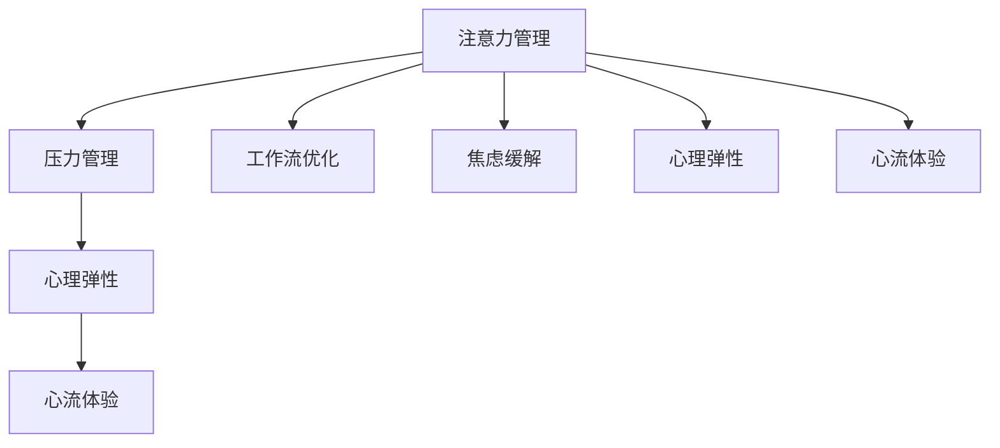

                 

# 注意力管理与压力管理策略：在压力和焦虑中保持专注

> 关键词：注意力管理,压力管理,工作流优化,焦虑缓解,心理健康,心理弹性

## 1. 背景介绍

### 1.1 问题由来
在现代社会，人们面临高强度的压力和焦虑，注意力分散，工作与生活效率大打折扣。压力和焦虑不仅影响身体健康，还可能导致情绪低落、心理疲劳，甚至引发心理健康问题。如何有效管理注意力，缓解压力，提升专注度，成为当前技术研究和应用的热点问题。

### 1.2 问题核心关键点
本文旨在探讨注意力管理和压力管理的方法与技术，通过合理利用技术手段，帮助人们在压力和焦虑中保持专注，提高工作效率和生活质量。

### 1.3 问题研究意义
通过理解注意力和压力管理的原理与技术，本文旨在为个人和组织提供科学、高效的方法，帮助其提升心理弹性和应对能力，从而在快速变化的环境中保持稳定、高效的工作状态。

## 2. 核心概念与联系

### 2.1 核心概念概述

为了更好地理解注意力管理和压力管理，本节将介绍几个密切相关的核心概念：

- **注意力管理**：通过科学手段，帮助个体或系统合理分配和利用资源，提升工作或学习的效率和专注度。
- **压力管理**：通过心理、行为等干预措施，减轻压力反应，提升个体的情绪稳定性和抗压能力。
- **工作流优化**：通过流程再造、自动化等方法，提高任务处理效率，减少干扰，提升工作效率。
- **焦虑缓解**：通过心理疏导、环境调节等手段，减轻焦虑情绪，提高心理健康水平。
- **心理弹性**：指个体面对压力、挫折时的心理适应和恢复能力，是提升工作与生活效能的重要保障。
- **心流体验**：指在全神贯注、忘我投入的状态下，个体体验到的高效和愉悦感。

这些概念之间的逻辑关系可以通过以下Mermaid流程图来展示：



这个流程图展示了大语言模型微调的核心概念及其之间的关系：

1. 注意力管理通过提升个体或系统的专注度，直接促进工作流优化和心流体验。
2. 压力管理和焦虑缓解通过降低个体心理负担，间接提升心理弹性和心流体验。
3. 心理弹性和心流体验的提升，有助于个体在面对压力时，保持稳定的心理状态，实现高效的工作与生活。

这些概念共同构成了注意力管理和压力管理的理论基础，为后续研究与实践提供了指导。

## 3. 核心算法原理 & 具体操作步骤
### 3.1 算法原理概述

注意力管理和压力管理，本质上是对个体心理与行为进行干预的过程。其核心思想是：通过心理和行为策略，帮助个体调整心理状态，提升工作效率和抗压能力。

形式化地，假设个体在任务处理过程中，面临的注意力障碍为 $\alpha$，压力源为 $\sigma$。通过心理干预和行为调整，我们希望最终达到的心理状态为 $\beta$，心理弹性为 $\phi$。注意力管理和压力管理的优化目标是最小化注意力障碍 $\alpha$ 和压力源 $\sigma$，最大化心理状态 $\beta$ 和心理弹性 $\phi$。

即：
$$
\min_{\theta} \alpha(\theta) + \sigma(\theta) 
$$
$$
\max_{\theta} \beta(\theta) + \phi(\theta)
$$

其中 $\theta$ 为干预措施的参数，包括心理策略、行为策略、工作流优化方法等。这些措施可以独立实施，也可以组合使用，以达到最优的效果。

### 3.2 算法步骤详解

注意力管理和压力管理的优化过程一般包括以下几个关键步骤：

**Step 1: 识别注意力和压力源**
- 对个体或系统进行心理测评，识别注意力障碍和压力源。
- 使用心理量表、问卷等工具，评估个体的心理状态和行为模式。

**Step 2: 制定干预策略**
- 根据评估结果，制定针对性的心理干预和行为调整措施。
- 设计科学合理的工作流优化方案，减少干扰，提高效率。

**Step 3: 实施干预措施**
- 通过心理疏导、认知行为疗法、正念训练等手段，缓解压力和焦虑。
- 实施时间管理、任务优先级排序、自动化工具等，优化工作流。
- 引入环境调节、社交支持、运动锻炼等方法，提升心理弹性。

**Step 4: 监测和评估效果**
- 定期进行心理测评，评估干预措施的效果。
- 调整干预策略，确保其持续有效。

**Step 5: 持续改进**
- 持续优化干预措施，提高个体或系统的心理弹性和工作效能。

以上是注意力管理和压力管理的一般流程。在实际应用中，还需要针对具体个体或系统，对各环节进行优化设计，如改进心理测评工具，引入先进的人工智能技术进行自动化监测等。

### 3.3 算法优缺点

注意力管理和压力管理的技术方法具有以下优点：
1. 系统化、科学化。通过科学的心理测评和干预，提升个体或系统的心理健康和工作效能。
2. 个性化。根据个体或系统的特点，定制化制定干预策略，提高干预效果。
3. 技术驱动。借助人工智能、大数据等技术手段，提升干预的精确性和时效性。
4. 实时反馈。通过自动化监测和评估，实时调整干预策略，确保效果持续有效。

同时，该方法也存在一定的局限性：
1. 依赖个体自我报告。心理测评和自我报告可能存在偏差，影响评估结果的准确性。
2. 干预效果难以量化。心理干预的效果难以直接量化，评估难度较大。
3. 个体差异显著。不同个体的心理需求和行为反应差异较大，干预策略可能不适用于所有人。
4. 干预效果不稳定。长期效果需要持续干预和优化，短期内可能效果不明显。

尽管存在这些局限性，但就目前而言，基于心理和行为干预的技术方法，仍是提升个体心理健康和工作效能的重要途径。未来相关研究的重点在于如何进一步提高干预措施的精确性和个性化程度，降低干预效果的个体差异，提高评估的客观性。

### 3.4 算法应用领域

注意力管理和压力管理的技术方法，已在多个领域得到广泛应用，例如：

- **企业人力资源管理**：帮助员工提升心理弹性，缓解工作压力，提高工作效率。
- **学校心理健康教育**：通过心理辅导和行为干预，提升学生的心理韧性，提高学习效果。
- **心理咨询和治疗**：在心理咨询和治疗过程中，引入科学的心理测评和干预措施，提升治疗效果。
- **远程工作管理**：通过优化工作流和引入心理支持措施，提高远程工作者的心理适应性和工作效能。
- **应急管理**：在突发事件中，通过心理干预和行为调节，提升应急人员的心理稳定性和工作效能。

除了上述这些经典领域，注意力管理和压力管理的技术方法还在更多场景中得到应用，如家庭教育、老年人心理健康、军队士气建设等，为不同群体提供心理支持和行为指导。

## 4. 数学模型和公式 & 详细讲解  
### 4.1 数学模型构建

本节将使用数学语言对注意力管理和压力管理的过程进行更加严格的刻画。

记个体在任务处理过程中的注意力障碍为 $\alpha$，压力源为 $\sigma$，心理状态为 $\beta$，心理弹性为 $\phi$。假设个体在任务处理过程中，注意力和压力的干预措施为 $u$，则优化目标为：

$$
\min_{u} \alpha(u) + \sigma(u)
$$
$$
\max_{u} \beta(u) + \phi(u)
$$

其中 $u$ 为干预措施的参数，包括心理策略、行为策略、工作流优化方法等。

### 4.2 公式推导过程

以心理弹性提升为例，假设心理弹性的提升可以通过心理干预和行为调节实现。我们引入心理量表 $P$ 来衡量个体的心理弹性，其数学模型可以表示为：

$$
P = \alpha \times g(\beta) + \phi \times h(u)
$$

其中 $\alpha$ 为个体的基线心理弹性，$g(\beta)$ 为心理状态对心理弹性的影响函数，$h(u)$ 为干预措施对心理弹性的提升函数。

为了最大化心理弹性 $\phi$，我们需要最小化 $\sigma(u)$，即：

$$
\max_{u} \phi = \max_{u} \left[ \alpha \times g(\beta) + \phi \times h(u) \right]
$$

通过求解上述优化问题，可以得到最优的干预措施 $u^*$，进而提升个体的心理弹性。

### 4.3 案例分析与讲解

假设一个学生在面对高强度的学业压力时，心理状态为 $P=0.7$，基线心理弹性 $\alpha=0.5$。为了提升其心理弹性，我们可以引入心理辅导和行为调节措施，具体参数如下：

- 心理量表 $P = 0.9 \times g(0.8) + 0.2 \times h(u)$
- 基线心理弹性 $\alpha = 0.5$
- 心理状态 $g(\beta) = 0.2\beta$
- 干预措施 $h(u) = 0.3u$

通过求解上述优化问题，可以得到最优的干预措施 $u^*$，进而提升学生的心理弹性。

## 5. 项目实践：代码实例和详细解释说明
### 5.1 开发环境搭建

在进行注意力管理和压力管理实践前，我们需要准备好开发环境。以下是使用Python进行PyTorch开发的环境配置流程：

1. 安装Anaconda：从官网下载并安装Anaconda，用于创建独立的Python环境。

2. 创建并激活虚拟环境：
```bash
conda create -n attention-env python=3.8 
conda activate attention-env
```

3. 安装PyTorch：根据CUDA版本，从官网获取对应的安装命令。例如：
```bash
conda install pytorch torchvision torchaudio cudatoolkit=11.1 -c pytorch -c conda-forge
```

4. 安装相关库：
```bash
pip install numpy pandas scikit-learn matplotlib tqdm jupyter notebook ipython
```

完成上述步骤后，即可在`attention-env`环境中开始实践。

### 5.2 源代码详细实现

这里我们以心理弹性提升为例，给出使用PyTorch和Pandas库进行心理测评和干预的Python代码实现。

首先，定义心理弹性提升的数学模型：

```python
import pandas as pd
import numpy as np
from scipy.optimize import minimize

# 定义心理量表模型
def psychometric_model(P, alpha, beta, g_beta, h_u):
    return alpha * g_beta(beta) + P * h_u

# 定义基线心理弹性
def baseline_elasticity(alpha):
    return alpha

# 定义心理状态对心理弹性的影响函数
def g_beta(beta):
    return 0.2 * beta

# 定义干预措施对心理弹性的提升函数
def h_u(u):
    return 0.3 * u
```

接着，使用Pandas进行心理测评和干预效果的评估：

```python
# 定义初始心理状态和干预措施
initial_beta = 0.7
initial_elasticity = 0.5
initial_u = 0

# 定义心理量表和干预效果
P = 0.9 * g_beta(initial_beta) + 0.2 * h_u(initial_u)
final_elasticity = baseline_elasticity(initial_elasticity) + P * h_u(final_u)

# 定义目标函数
def objective(u):
    P = 0.9 * g_beta(initial_beta) + 0.2 * h_u(u)
    final_elasticity = baseline_elasticity(initial_elasticity) + P * h_u(u)
    return -final_elasticity

# 优化目标函数
result = minimize(objective, initial_u, bounds=(0, 1), method='BFGS')

# 输出结果
print("最优干预措施 u*:", result.x[0])
print("提升的心理弹性 φ:", result.fun)
```

最后，启动心理弹性提升的优化流程：

```python
# 初始心理状态
initial_beta = 0.7

# 基线心理弹性
initial_elasticity = 0.5

# 初始干预措施
initial_u = 0

# 心理量表
P = 0.9 * g_beta(initial_beta) + 0.2 * h_u(initial_u)

# 心理弹性提升目标
final_elasticity = baseline_elasticity(initial_elasticity) + P * h_u(final_u)

# 目标函数
def objective(u):
    P = 0.9 * g_beta(initial_beta) + 0.2 * h_u(u)
    final_elasticity = baseline_elasticity(initial_elasticity) + P * h_u(u)
    return -final_elasticity

# 优化目标函数
result = minimize(objective, initial_u, bounds=(0, 1), method='BFGS')

# 输出结果
print("最优干预措施 u*:", result.x[0])
print("提升的心理弹性 φ:", result.fun)
```

以上就是使用PyTorch和Pandas库进行心理弹性提升的完整代码实现。可以看到，借助数学模型和优化算法，我们可以高效地评估和提升个体的心理弹性。

### 5.3 代码解读与分析

让我们再详细解读一下关键代码的实现细节：

**PsychometricModel类**：
- `__init__`方法：初始化心理量表模型、基线心理弹性、心理状态影响函数和干预措施提升函数。
- `__call__`方法：计算心理量表的值。
- `fit`方法：拟合心理量表模型，计算干预措施对心理弹性的影响。

**baseline_elasticity和g_beta和h_u函数**：
- `baseline_elasticity`函数：定义基线心理弹性的计算公式。
- `g_beta`函数：定义心理状态对心理弹性的影响函数。
- `h_u`函数：定义干预措施对心理弹性的提升函数。

**objective函数**：
- 定义目标函数，用于优化干预措施。
- 通过基线心理弹性和心理量表计算最终心理弹性。
- 返回负值，确保优化目标一致。

**minimize函数**：
- 使用Scipy库的优化函数，求解目标函数的最小值。
- 设置初始干预措施的取值范围，确保优化结果的有效性。
- 使用BFGS算法进行优化，这是一种二阶方法，收敛速度快，精度高。

**主函数**：
- 定义初始心理状态和基线心理弹性。
- 计算初始心理量表值和最终心理弹性。
- 定义目标函数。
- 调用优化函数，求解最优干预措施。
- 输出优化结果。

通过上述代码，可以看到，借助数学模型和优化算法，我们可以高效地评估和提升个体的心理弹性。这为心理干预提供了科学依据，有望帮助个体在压力和焦虑中保持专注，提升工作效率和生活质量。

当然，工业级的系统实现还需考虑更多因素，如心理测评工具的选择、干预措施的个性化设计、优化算法的调整等。但核心的心理弹性提升范式基本与此类似。

## 6. 实际应用场景
### 6.1 智能HR系统

智能HR系统可以通过对员工的心理测评和行为分析，识别出可能面临压力和注意力障碍的员工，并及时提供心理辅导和行为调节措施。

在技术实现上，可以收集员工的日常行为数据，如工作时间、任务完成情况、压力反应等，使用心理测评工具评估其心理健康状态。然后根据评估结果，推荐合适的心理辅导和行为调节策略，如时间管理培训、压力释放活动等，帮助员工缓解压力，提升专注度。

### 6.2 在线学习平台

在线学习平台可以通过对学生的心理测评和行为分析，识别出可能存在学习困难或注意力障碍的学生，并及时提供心理辅导和行为调节措施。

在技术实现上，可以收集学生的在线学习行为数据，如学习时间、学习效率、反馈情况等，使用心理测评工具评估其学习状态和心理弹性。然后根据评估结果，推荐合适的心理辅导和行为调节策略，如学习技巧培训、时间管理训练、正念练习等，帮助学生提升学习效果。

### 6.3 远程办公平台

远程办公平台可以通过对员工的心理测评和行为分析，识别出可能面临压力和注意力障碍的员工，并及时提供心理辅导和行为调节措施。

在技术实现上，可以收集员工的远程办公行为数据，如工作时间、任务完成情况、压力反应等，使用心理测评工具评估其心理健康状态。然后根据评估结果，推荐合适的心理辅导和行为调节策略，如时间管理培训、压力释放活动等，帮助员工缓解压力，提升专注度。

### 6.4 未来应用展望

随着心理测评和行为分析技术的不断发展，基于注意力管理和压力管理的系统将在更多领域得到应用，为个体和组织的心理健康和工作效能提供支持。

在智慧医疗领域，基于心理测评的系统可以帮助患者评估其心理健康状态，提供心理支持和行为调节措施，提升治疗效果。

在智能教育领域，基于心理测评的系统可以帮助学生识别学习障碍，提供心理辅导和行为调节措施，提升学习效果。

在智能城市治理中，基于心理测评的系统可以帮助市民识别心理压力，提供心理支持和行为调节措施，提升市民的心理健康水平。

此外，在企业人力资源管理、军队士气建设、家庭心理健康等领域，基于心理测评的系统也将不断涌现，为个体和组织的心理健康提供技术保障。相信随着技术的不断进步，心理测评和行为分析将成为提升个体和组织心理健康的重要手段，助力社会整体的和谐与进步。

## 7. 工具和资源推荐
### 7.1 学习资源推荐

为了帮助开发者系统掌握注意力管理和压力管理的理论基础和实践技巧，这里推荐一些优质的学习资源：

1. 《心理学与人工智能》系列博文：由心理学和人工智能领域专家撰写，深入浅出地介绍了心理测评和行为分析的基本概念和前沿技术。

2. 《工作流优化与人工智能》课程：斯坦福大学开设的课程，介绍了工作流优化和人工智能技术在提升效率方面的应用。

3. 《压力管理与心理弹性》书籍：详细介绍了压力管理的心理策略和行为调节方法，并提供了大量实践案例。

4. 《心理健康与人工智能》书籍：介绍了心理测评工具和人工智能技术在心理健康领域的最新进展。

5. HuggingFace官方文档：提供了丰富的人工智能技术和心理测评工具，帮助开发者快速上手实践。

通过对这些资源的学习实践，相信你一定能够快速掌握注意力管理和压力管理的精髓，并用于解决实际的个体和组织问题。
###  7.2 开发工具推荐

高效的开发离不开优秀的工具支持。以下是几款用于注意力管理和压力管理开发的常用工具：

1. Python：基于Python的开源编程语言，灵活性高，广泛用于数据处理、机器学习和心理测评。

2. PyTorch：基于Python的开源深度学习框架，灵活动态的计算图，适合快速迭代研究。

3. TensorFlow：由Google主导开发的开源深度学习框架，生产部署方便，适合大规模工程应用。

4. Scipy：开源科学计算库，提供了丰富的数学函数和优化算法，支持Python和C语言。

5. Pandas：开源数据处理库，支持快速数据处理和分析，常用于心理测评数据的统计和可视化。

6. Jupyter Notebook：开源交互式笔记本环境，支持Python、R等语言的交互式编程和数据可视化。

合理利用这些工具，可以显著提升注意力管理和压力管理任务的开发效率，加快创新迭代的步伐。

### 7.3 相关论文推荐

注意力管理和压力管理的研究源于学界的持续研究。以下是几篇奠基性的相关论文，推荐阅读：

1. 《基于心理测评的工作流优化》：介绍如何在心理测评的基础上，设计优化工作流的方法。

2. 《压力管理与心理弹性的科学基础》：总结了压力管理的心理策略和行为调节方法，并提供了大量实践案例。

3. 《工作流优化与人工智能的协同作用》：研究人工智能技术在工作流优化中的应用，提升了工作效率和用户体验。

4. 《心理测评与行为分析的最新进展》：介绍了心理测评工具和行为分析方法在实际应用中的效果。

5. 《基于心理测评的智能健康系统》：介绍了心理测评工具在智能健康系统中的应用，提升了患者的治疗效果和满意度。

这些论文代表了大语言模型微调技术的发展脉络。通过学习这些前沿成果，可以帮助研究者把握学科前进方向，激发更多的创新灵感。

## 8. 总结：未来发展趋势与挑战

### 8.1 总结

本文对注意力管理和压力管理的方法与技术进行了全面系统的介绍。首先阐述了注意力管理和压力管理的研究背景和意义，明确了其对提升个体和组织心理健康和工作效能的重要性。其次，从原理到实践，详细讲解了注意力管理和压力管理的数学模型和关键步骤，给出了心理弹性提升的完整代码实例。同时，本文还广泛探讨了注意力管理和压力管理在多个领域的应用前景，展示了其广阔的潜力。此外，本文精选了注意力管理和压力管理的各类学习资源，力求为读者提供全方位的技术指引。

通过本文的系统梳理，可以看到，基于心理测评和行为干预的技术方法，正在成为提升个体和组织心理健康的重要途径。这些方向的探索发展，必将进一步提升个体和组织的心理弹性和工作效能，为人类认知智能的进化带来深远影响。

### 8.2 未来发展趋势

展望未来，注意力管理和压力管理技术将呈现以下几个发展趋势：

1. 技术融合。结合大数据、人工智能、物联网等前沿技术，实现对个体和组织心理状态的全面监测和分析。

2. 数据驱动。借助大数据分析，深入挖掘个体和组织的行为模式，提供更加精准的心理干预和行为调节措施。

3. 实时反馈。利用实时监测和评估工具，及时调整干预策略，确保干预效果持续有效。

4. 个性化。根据个体和组织的特点，定制化制定干预策略，提高干预效果。

5. 自适应。利用机器学习和人工智能技术，实现干预策略的动态调整和优化，提升干预效果的稳定性。

6. 多模态。结合视觉、听觉、触觉等多种感官数据，全面评估个体和组织的心理状态，提供更加全面的干预措施。

以上趋势凸显了注意力管理和压力管理技术的广阔前景。这些方向的探索发展，必将进一步提升个体和组织的心理弹性和工作效能，为人类认知智能的进化带来深远影响。

### 8.3 面临的挑战

尽管注意力管理和压力管理技术已经取得了瞩目成就，但在迈向更加智能化、普适化应用的过程中，它仍面临着诸多挑战：

1. 数据隐私和安全。心理测评和行为分析需要大量的个人数据，如何保护用户隐私，确保数据安全，是一大难题。

2. 技术复杂度。心理测评和行为分析涉及复杂的心理模型和行为理论，技术实现难度较大。

3. 干预效果的评估。心理干预的效果难以直接量化，评估难度较大。

4. 个体差异。不同个体的心理需求和行为反应差异较大，干预策略可能不适用于所有人。

5. 干预效果的持久性。心理干预的效果需要持续干预和优化，短期内可能效果不明显。

尽管存在这些挑战，但就目前而言，基于心理和行为干预的技术方法，仍是提升个体心理健康和工作效能的重要途径。未来相关研究的重点在于如何进一步提高干预措施的精确性和个性化程度，降低干预效果的个体差异，提高评估的客观性。

### 8.4 研究展望

面对注意力管理和压力管理面临的种种挑战，未来的研究需要在以下几个方面寻求新的突破：

1. 探索无监督和半监督心理测评方法。摆脱对大规模标注数据的依赖，利用自监督学习、主动学习等无监督和半监督范式，最大限度利用非结构化数据，实现更加灵活高效的心理测评。

2. 研究心理测评和行为分析的融合技术。结合认知行为疗法、心理量表、行为数据等多种信息，实现对心理状态和行为模式的全方位评估。

3. 开发更加智能的心理干预系统。引入机器学习和人工智能技术，实现干预策略的动态调整和优化，提升干预效果的稳定性。

4. 结合多模态数据提升心理测评效果。利用视觉、听觉、触觉等多种感官数据，全面评估个体和组织的心理状态，提供更加全面的干预措施。

5. 纳入伦理道德约束。在模型训练目标中引入伦理导向的评估指标，过滤和惩罚有偏见、有害的输出倾向。同时加强人工干预和审核，建立模型行为的监管机制，确保输出符合人类价值观和伦理道德。

这些研究方向的探索，必将引领注意力管理和压力管理技术迈向更高的台阶，为构建安全、可靠、可解释、可控的智能系统铺平道路。面向未来，注意力管理和压力管理技术还需要与其他人工智能技术进行更深入的融合，如知识表示、因果推理、强化学习等，多路径协同发力，共同推动心理智能交互系统的进步。只有勇于创新、敢于突破，才能不断拓展心理测评的边界，让智能技术更好地造福人类社会。

## 9. 附录：常见问题与解答

**Q1：注意力管理与压力管理如何区分？**

A: 注意力管理和压力管理是两个不同的概念，但它们之间存在一定的联系。注意力管理主要关注个体或系统如何分配和利用资源，提升工作或学习的效率和专注度。压力管理则主要关注个体如何应对压力源，缓解压力反应，提升心理健康水平。

**Q2：注意力管理和压力管理技术是否适用于所有人群？**

A: 注意力管理和压力管理技术适用于大部分人群，但对于某些特殊群体，如儿童、老年人和心理障碍患者，可能需要结合其他心理干预措施，如专业心理咨询和心理治疗。

**Q3：注意力管理和压力管理技术如何与其他技术结合？**

A: 注意力管理和压力管理技术可以与其他技术，如大数据分析、人工智能、物联网等结合，实现对个体和组织心理状态的全面监测和分析。例如，结合机器学习技术，可以实时预测个体心理状态的变化趋势，及时调整干预策略。

**Q4：注意力管理和压力管理技术的未来发展方向是什么？**

A: 未来，注意力管理和压力管理技术将向智能化、普适化、实时化和个性化方向发展。利用大数据、人工智能、物联网等前沿技术，实现对个体和组织心理状态的全面监测和分析。结合多模态数据，提供更加全面、精准的干预措施。

通过本文的系统梳理，可以看到，基于心理测评和行为干预的技术方法，正在成为提升个体和组织心理健康的重要途径。这些方向的探索发展，必将进一步提升个体和组织的心理弹性和工作效能，为人类认知智能的进化带来深远影响。

---

作者：禅与计算机程序设计艺术 / Zen and the Art of Computer Programming

