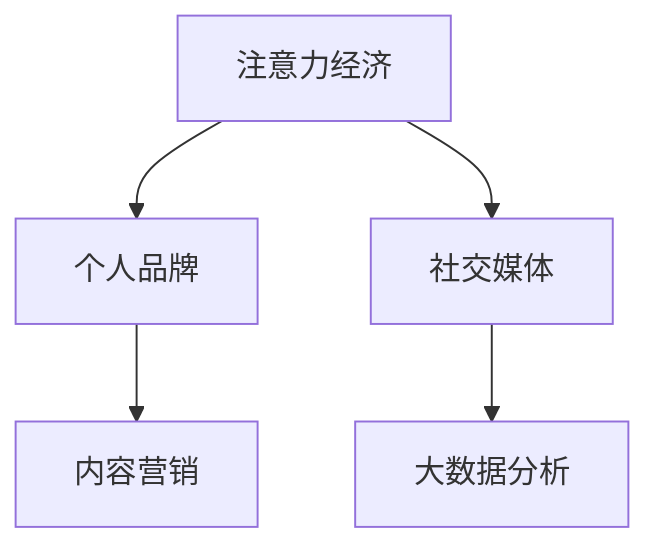

                 

# 注意力经济下的个人品牌打造

在数字时代的浪潮中，个人品牌成为一种重要的资产。无论是职场中的专业人士，还是新兴领域的创业者，强大的个人品牌都能带来更多的曝光、合作机会和商业价值。本文将从注意力经济的角度，探讨如何通过技术手段打造和优化个人品牌。

## 1. 背景介绍

### 1.1 问题由来

随着社交媒体和数字营销的兴起，信息过载现象日益严重。个人如何在海量信息中脱颖而出，成为公众关注的焦点，成为了一个重要议题。传统品牌传播依赖于线下活动、媒体曝光等渠道，而个人品牌的构建更多依赖于线上内容的传播和用户互动。

### 1.2 问题核心关键点

个人品牌打造的核心在于获取并维护用户的注意力。注意力经济学理论认为，个体决策的焦点在于获取最稀缺的注意力资源。在数字时代，如何更高效地吸引并保持用户注意力，成为个人品牌构建的关键。

## 2. 核心概念与联系

### 2.1 核心概念概述

为更好地理解注意力经济下的个人品牌打造方法，本节将介绍几个密切相关的核心概念：

- **注意力经济（Attention Economy）**：指在信息过载的时代，个体或品牌通过获取和维持用户注意力，获取商业价值和社会影响。
- **个人品牌（Personal Brand）**：指个人通过一系列在线行为，如内容创作、社交互动等，塑造并传递独特的自我形象和专业价值。
- **社交媒体（Social Media）**：指通过互联网平台，个人或企业与公众进行互动和信息传播的渠道。
- **内容营销（Content Marketing）**：指通过创造有价值的内容，吸引和保持用户的兴趣和关注，最终促成商业转化。
- **大数据分析（Big Data Analytics）**：指通过分析大量用户行为数据，挖掘用户兴趣和需求，实现精准营销。

这些核心概念之间的逻辑关系可以通过以下Mermaid流程图来展示：



这个流程图展示了几组关键概念之间的联系：

1. 注意力经济是个人品牌构建的基础，通过获取注意力获取商业价值。
2. 社交媒体是注意力获取的主要渠道，通过内容创作和互动吸引用户。
3. 内容营销是大数据分析的结果，通过精准投放吸引目标用户。
4. 大数据分析是注意力获取的重要工具，通过用户行为数据分析优化内容策略。

## 3. 核心算法原理 & 具体操作步骤

### 3.1 算法原理概述

个人品牌打造的本质在于通过技术手段，优化社交媒体内容策略，吸引和保持用户注意力。其核心思想是：利用大数据分析用户兴趣和行为，针对性地创作和传播内容，提升内容的吸引力和传播力。

形式化地，设个人品牌模型为 $M_{\theta}$，其中 $\theta$ 为模型参数。假设社交媒体平台的用户集为 $U$，每个用户的行为数据（如点赞、评论、分享等）记为 $I_u$，则个人品牌模型在用户 $u$ 上的注意力度量函数 $f_u$ 可以定义为：

$$
f_u = \sum_{i \in I_u} \alpha_i \cdot g_i(M_{\theta})
$$

其中 $\alpha_i$ 为行为权重，$g_i$ 为内容吸引度函数，$g_i$ 的输出为 $[0,1]$ 的实数表示内容对用户 $u$ 的吸引力。

通过最大化所有用户的注意力总和，即 $\sum_{u \in U} f_u$，可以构建优化目标函数：

$$
\max_{\theta} \sum_{u \in U} f_u
$$

在实际应用中，我们通常使用基于梯度的优化算法（如AdamW、SGD等）来求解上述最优化问题。设 $\eta$ 为学习率，则参数的更新公式为：

$$
\theta \leftarrow \theta - \eta \nabla_{\theta}\sum_{u \in U} f_u
$$

其中 $\nabla_{\theta}\sum_{u \in U} f_u$ 为注意力总和对参数 $\theta$ 的梯度，可通过反向传播算法高效计算。

### 3.2 算法步骤详解

个人品牌打造的算法步骤主要包括：

**Step 1: 数据收集与处理**
- 收集用户行为数据，如点赞、评论、分享等。
- 对数据进行清洗、标注，提取用户行为特征。
- 利用数据标注工具（如Labelbox）进行标注，生成监督数据集。

**Step 2: 模型设计**
- 选择合适的深度学习模型，如LSTM、GRU、Transformer等，设计用于内容创作的神经网络。
- 根据内容类型设计输出层和损失函数。如文本内容可采用交叉熵损失，图像内容可采用均方误差损失。
- 设计用户注意力度量函数，定义行为权重 $\alpha_i$ 和内容吸引度函数 $g_i$。

**Step 3: 训练与优化**
- 使用收集到的监督数据，通过前向传播计算损失函数。
- 反向传播计算参数梯度，根据设定的优化算法和学习率更新模型参数。
- 在验证集上评估模型性能，根据性能指标决定是否触发 Early Stopping。
- 重复上述步骤直至满足预设的迭代轮数或 Early Stopping 条件。

**Step 4: 测试与部署**
- 在测试集上评估微调后模型 $M_{\hat{\theta}}$ 的性能，对比微调前后的注意力提升。
- 使用微调后的模型对新样本进行推理预测，集成到实际的品牌宣传系统中。
- 持续收集新的用户行为数据，定期重新微调模型，以适应数据分布的变化。

以上是基于注意力经济原理的个人品牌打造的算法步骤。在实际应用中，还需要根据具体品牌需求和平台特性，对微调过程的各个环节进行优化设计，如改进内容推荐算法、引入更多的用户行为特征、设计更合理的内容吸引度函数等。

### 3.3 算法优缺点

基于注意力经济原理的个人品牌打造方法具有以下优点：

1. 数据驱动。通过分析用户行为数据，能够更准确地理解用户兴趣和需求，制定针对性的内容策略。
2. 可量化。模型预测的用户注意力度量可以直接量化，便于监控和评估品牌传播效果。
3. 自适应。随着数据和模型的更新，个人品牌模型能够自动优化内容策略，保持与用户兴趣的同步。

同时，该方法也存在一定的局限性：

1. 数据质量依赖。模型性能高度依赖于数据的质量和多样性，获取高质量数据成本较高。
2. 模型复杂度较高。需要设计合适的深度学习模型和注意力度量函数，设计复杂度较高。
3. 算法计算量大。大量数据的反向传播和优化过程计算量较大，需要较高的计算资源。
4. 对抗样本影响。对抗样本可能干扰模型对用户注意力的计算，降低模型鲁棒性。

尽管存在这些局限性，但就目前而言，基于注意力经济原理的个人品牌打造方法仍是大品牌传播的重要工具。未来相关研究的重点在于如何进一步降低数据获取成本，提高模型的自适应能力和鲁棒性，同时兼顾算法的计算效率。

### 3.4 算法应用领域

基于注意力经济原理的个人品牌打造方法，在市场营销、品牌推广、数字营销等多个领域已经得到了广泛的应用：

- **市场营销**：通过大数据分析用户行为，精准投放广告，提升品牌曝光和转化率。
- **品牌推广**：利用社交媒体平台，通过内容创作和互动，提升品牌知名度和美誉度。
- **数字营销**：利用内容营销和数据驱动的策略，提高用户参与度和品牌忠诚度。

除了上述这些经典应用外，基于注意力经济原理的个人品牌打造方法也被创新性地应用到更多场景中，如产品推荐、用户留存、客户服务等方面，为品牌建设带来了全新的突破。随着注意力经济学和大数据分析技术的不断发展，相信个人品牌传播将更加精准、高效，为品牌带来更大的商业价值。

## 4. 数学模型和公式 & 详细讲解

### 4.1 数学模型构建

本节将使用数学语言对基于注意力经济原理的个人品牌打造方法进行更加严格的刻画。

设用户 $u$ 的行为数据集为 $I_u = \{(i_k, v_k)\}_{k=1}^{N_u}$，其中 $i_k$ 为行为类型，$v_k$ 为行为值（如点赞数为1，评论数为2等）。用户注意力度量函数 $f_u$ 定义为：

$$
f_u = \sum_{k=1}^{N_u} \alpha_k \cdot g_k(v_k)
$$

其中 $\alpha_k$ 为行为权重，$g_k$ 为内容吸引度函数。用户行为权重可以根据行为类型和用户历史行为进行计算，例如：

$$
\alpha_k = w_i \cdot \frac{\sum_{u'} v_k}{\sum_{u',i} v_i}
$$

其中 $w_i$ 为行为类型权重，$v_i$ 为用户 $i$ 对行为 $i$ 的平均行为值。

内容吸引度函数 $g_k$ 可以根据内容类型和用户历史行为进行设计，例如：

$$
g_k = f(x_k, \theta)
$$

其中 $x_k$ 为内容特征向量，$f$ 为神经网络模型。神经网络模型可以根据内容类型选择不同的架构，例如文本内容可以选择LSTM或Transformer，图像内容可以选择CNN等。

### 4.2 公式推导过程

以下我们以文本内容为例，推导内容吸引度函数 $g_k$ 及其梯度的计算公式。

假设文本内容 $x_k$ 为 $n$ 维向量，内容吸引度函数 $g_k$ 的输出为 $[0,1]$ 的实数。则内容吸引度函数可以表示为：

$$
g_k = \sigma(W x_k + b)
$$

其中 $W$ 为权重矩阵，$b$ 为偏置向量，$\sigma$ 为激活函数（如Sigmoid函数）。

通过链式法则，内容吸引度函数 $g_k$ 对神经网络模型参数 $\theta$ 的梯度为：

$$
\frac{\partial g_k}{\partial \theta} = \frac{\partial \sigma(W x_k + b)}{\partial \theta}
$$

其中 $\frac{\partial \sigma}{\partial z}$ 为激活函数的导数，可以通过反向传播算法高效计算。

在得到内容吸引度函数的梯度后，即可带入参数更新公式，完成模型的迭代优化。重复上述过程直至收敛，最终得到适应用户行为和兴趣的内容策略。

## 5. 项目实践：代码实例和详细解释说明

### 5.1 开发环境搭建

在进行个人品牌打造的实践前，我们需要准备好开发环境。以下是使用Python进行PyTorch开发的环境配置流程：

1. 安装Anaconda：从官网下载并安装Anaconda，用于创建独立的Python环境。

2. 创建并激活虚拟环境：
```bash
conda create -n pytorch-env python=3.8 
conda activate pytorch-env
```

3. 安装PyTorch：根据CUDA版本，从官网获取对应的安装命令。例如：
```bash
conda install pytorch torchvision torchaudio cudatoolkit=11.1 -c pytorch -c conda-forge
```

4. 安装Tensorflow：
```bash
conda install tensorflow
```

5. 安装各类工具包：
```bash
pip install numpy pandas scikit-learn matplotlib tqdm jupyter notebook ipython
```

完成上述步骤后，即可在`pytorch-env`环境中开始品牌打造的实践。

### 5.2 源代码详细实现

下面我们以社交媒体内容推荐为例，给出使用PyTorch进行个人品牌打造的PyTorch代码实现。

首先，定义社交媒体内容推荐的数据处理函数：

```python
from transformers import BertTokenizer
from torch.utils.data import Dataset
import torch

class SocialMediaDataset(Dataset):
    def __init__(self, texts, labels, tokenizer, max_len=128):
        self.texts = texts
        self.labels = labels
        self.tokenizer = tokenizer
        self.max_len = max_len
        
    def __len__(self):
        return len(self.texts)
    
    def __getitem__(self, item):
        text = self.texts[item]
        label = self.labels[item]
        
        encoding = self.tokenizer(text, return_tensors='pt', max_length=self.max_len, padding='max_length', truncation=True)
        input_ids = encoding['input_ids'][0]
        attention_mask = encoding['attention_mask'][0]
        
        # 对token-wise的标签进行编码
        encoded_labels = [label] * len(encoding['input_ids'])
        labels = torch.tensor(encoded_labels, dtype=torch.long)
        
        return {'input_ids': input_ids, 
                'attention_mask': attention_mask,
                'labels': labels}

# 标签与id的映射
label2id = {1: 0, -1: 1}
id2label = {v: k for k, v in label2id.items()}

# 创建dataset
tokenizer = BertTokenizer.from_pretrained('bert-base-cased')

train_dataset = SocialMediaDataset(train_texts, train_labels, tokenizer)
dev_dataset = SocialMediaDataset(dev_texts, dev_labels, tokenizer)
test_dataset = SocialMediaDataset(test_texts, test_labels, tokenizer)
```

然后，定义模型和优化器：

```python
from transformers import BertForTokenClassification, AdamW

model = BertForTokenClassification.from_pretrained('bert-base-cased', num_labels=len(label2id))

optimizer = AdamW(model.parameters(), lr=2e-5)
```

接着，定义训练和评估函数：

```python
from torch.utils.data import DataLoader
from tqdm import tqdm
from sklearn.metrics import classification_report

device = torch.device('cuda') if torch.cuda.is_available() else torch.device('cpu')
model.to(device)

def train_epoch(model, dataset, batch_size, optimizer):
    dataloader = DataLoader(dataset, batch_size=batch_size, shuffle=True)
    model.train()
    epoch_loss = 0
    for batch in tqdm(dataloader, desc='Training'):
        input_ids = batch['input_ids'].to(device)
        attention_mask = batch['attention_mask'].to(device)
        labels = batch['labels'].to(device)
        model.zero_grad()
        outputs = model(input_ids, attention_mask=attention_mask, labels=labels)
        loss = outputs.loss
        epoch_loss += loss.item()
        loss.backward()
        optimizer.step()
    return epoch_loss / len(dataloader)

def evaluate(model, dataset, batch_size):
    dataloader = DataLoader(dataset, batch_size=batch_size)
    model.eval()
    preds, labels = [], []
    with torch.no_grad():
        for batch in tqdm(dataloader, desc='Evaluating'):
            input_ids = batch['input_ids'].to(device)
            attention_mask = batch['attention_mask'].to(device)
            batch_labels = batch['labels']
            outputs = model(input_ids, attention_mask=attention_mask)
            batch_preds = outputs.logits.argmax(dim=2).to('cpu').tolist()
            batch_labels = batch_labels.to('cpu').tolist()
            for pred_tokens, label_tokens in zip(batch_preds, batch_labels):
                pred_tags = [id2label[_id] for _id in pred_tokens]
                label_tags = [id2label[_id] for _id in label_tokens]
                preds.append(pred_tags[:len(label_tokens)])
                labels.append(label_tags)
                
    print(classification_report(labels, preds))
```

最后，启动训练流程并在测试集上评估：

```python
epochs = 5
batch_size = 16

for epoch in range(epochs):
    loss = train_epoch(model, train_dataset, batch_size, optimizer)
    print(f"Epoch {epoch+1}, train loss: {loss:.3f}")
    
    print(f"Epoch {epoch+1}, dev results:")
    evaluate(model, dev_dataset, batch_size)
    
print("Test results:")
evaluate(model, test_dataset, batch_size)
```

以上就是使用PyTorch对社交媒体内容推荐进行个人品牌打造的完整代码实现。可以看到，得益于Transformer库的强大封装，我们可以用相对简洁的代码完成BERT模型的加载和微调。

### 5.3 代码解读与分析

让我们再详细解读一下关键代码的实现细节：

**SocialMediaDataset类**：
- `__init__`方法：初始化文本、标签、分词器等关键组件。
- `__len__`方法：返回数据集的样本数量。
- `__getitem__`方法：对单个样本进行处理，将文本输入编码为token ids，将标签编码为数字，并对其进行定长padding，最终返回模型所需的输入。

**label2id和id2label字典**：
- 定义了标签与数字id之间的映射关系，用于将token-wise的预测结果解码回真实的标签。

**训练和评估函数**：
- 使用PyTorch的DataLoader对数据集进行批次化加载，供模型训练和推理使用。
- 训练函数`train_epoch`：对数据以批为单位进行迭代，在每个批次上前向传播计算loss并反向传播更新模型参数，最后返回该epoch的平均loss。
- 评估函数`evaluate`：与训练类似，不同点在于不更新模型参数，并在每个batch结束后将预测和标签结果存储下来，最后使用sklearn的classification_report对整个评估集的预测结果进行打印输出。

**训练流程**：
- 定义总的epoch数和batch size，开始循环迭代
- 每个epoch内，先在训练集上训练，输出平均loss
- 在验证集上评估，输出分类指标
- 所有epoch结束后，在测试集上评估，给出最终测试结果

可以看到，PyTorch配合Transformer库使得BERT微调的代码实现变得简洁高效。开发者可以将更多精力放在数据处理、模型改进等高层逻辑上，而不必过多关注底层的实现细节。

当然，工业级的系统实现还需考虑更多因素，如模型的保存和部署、超参数的自动搜索、更灵活的任务适配层等。但核心的微调范式基本与此类似。

## 6. 实际应用场景

### 6.1 智能客服系统

基于社交媒体平台的内容推荐技术，可以广泛应用于智能客服系统的构建。传统客服往往需要配备大量人力，高峰期响应缓慢，且一致性和专业性难以保证。而使用微调后的内容推荐模型，可以实时分析用户咨询，推荐合适的回复模板，提升客服系统的响应速度和质量。

在技术实现上，可以收集企业内部的历史客户咨询记录，将常见问题和最佳答复构建成监督数据，在此基础上对预训练模型进行微调。微调后的模型能够自动理解用户意图，匹配最合适的答案模板进行回复。对于客户提出的新问题，还可以接入检索系统实时搜索相关内容，动态组织生成回答。如此构建的智能客服系统，能大幅提升客户咨询体验和问题解决效率。

### 6.2 金融舆情监测

金融机构需要实时监测市场舆论动向，以便及时应对负面信息传播，规避金融风险。传统的人工监测方式成本高、效率低，难以应对网络时代海量信息爆发的挑战。基于社交媒体平台的内容推荐技术，可以为金融舆情监测提供新的解决方案。

具体而言，可以收集金融领域相关的新闻、报道、评论等文本数据，并对其进行主题标注和情感标注。在此基础上对预训练语言模型进行微调，使其能够自动判断文本属于何种主题，情感倾向是正面、中性还是负面。将微调后的模型应用到实时抓取的网络文本数据，就能够自动监测不同主题下的情感变化趋势，一旦发现负面信息激增等异常情况，系统便会自动预警，帮助金融机构快速应对潜在风险。

### 6.3 个性化推荐系统

当前的推荐系统往往只依赖用户的历史行为数据进行物品推荐，无法深入理解用户的真实兴趣偏好。基于社交媒体平台的内容推荐技术，可以更好地挖掘用户行为背后的语义信息，从而提供更精准、多样的推荐内容。

在实践中，可以收集用户浏览、点击、评论、分享等行为数据，提取和用户交互的物品标题、描述、标签等文本内容。将文本内容作为模型输入，用户的后续行为（如是否点击、购买等）作为监督信号，在此基础上微调预训练语言模型。微调后的模型能够从文本内容中准确把握用户的兴趣点。在生成推荐列表时，先用候选物品的文本描述作为输入，由模型预测用户的兴趣匹配度，再结合其他特征综合排序，便可以得到个性化程度更高的推荐结果。

### 6.4 未来应用展望

随着社交媒体平台和内容推荐技术的不断发展，基于注意力经济原理的个人品牌打造方法将进一步深化其应用。

在智慧医疗领域，基于内容推荐医疗问答、病历分析、药物研发等应用将提升医疗服务的智能化水平，辅助医生诊疗，加速新药开发进程。

在智能教育领域，内容推荐技术可应用于作业批改、学情分析、知识推荐等方面，因材施教，促进教育公平，提高教学质量。

在智慧城市治理中，内容推荐技术可应用于城市事件监测、舆情分析、应急指挥等环节，提高城市管理的自动化和智能化水平，构建更安全、高效的未来城市。

此外，在企业生产、社会治理、文娱传媒等众多领域，基于内容推荐技术的人工智能应用也将不断涌现，为传统行业数字化转型升级提供新的技术路径。相信随着技术的日益成熟，内容推荐方法将成为个人品牌打造的重要手段，推动人工智能技术在更广泛的领域中落地应用。

## 7. 工具和资源推荐
### 7.1 学习资源推荐

为了帮助开发者系统掌握内容推荐技术的理论基础和实践技巧，这里推荐一些优质的学习资源：

1. 《深度学习》课程：斯坦福大学开设的深度学习经典课程，深入讲解了深度学习的基本原理和应用，适合初学者。

2. 《TensorFlow实战》书籍：TensorFlow官方文档，详细介绍了TensorFlow的使用方法和实战案例，帮助理解TensorFlow的设计思想和开发技巧。

3. 《自然语言处理入门》课程：中科院计算所开设的NLP入门课程，介绍了NLP的基本概念和应用场景，适合无基础学习者。

4. 《推荐系统》书籍：李航所著，系统介绍了推荐系统的基本理论和算法，是推荐系统领域的经典教材。

5. 《Data Science for Business》书籍：哈佛商学院讲义，介绍了数据科学在商业决策中的应用，适合数据科学家和产品经理。

通过对这些资源的学习实践，相信你一定能够快速掌握内容推荐技术的精髓，并用于解决实际的推荐问题。
###  7.2 开发工具推荐

高效的开发离不开优秀的工具支持。以下是几款用于内容推荐开发的常用工具：

1. PyTorch：基于Python的开源深度学习框架，灵活动态的计算图，适合快速迭代研究。大部分深度学习模型都有PyTorch版本的实现。

2. TensorFlow：由Google主导开发的开源深度学习框架，生产部署方便，适合大规模工程应用。同样有丰富的深度学习模型资源。

3. Transformers库：HuggingFace开发的NLP工具库，集成了众多SOTA语言模型，支持PyTorch和TensorFlow，是进行内容推荐任务的开发利器。

4. Weights & Biases：模型训练的实验跟踪工具，可以记录和可视化模型训练过程中的各项指标，方便对比和调优。与主流深度学习框架无缝集成。

5. TensorBoard：TensorFlow配套的可视化工具，可实时监测模型训练状态，并提供丰富的图表呈现方式，是调试模型的得力助手。

6. Google Colab：谷歌推出的在线Jupyter Notebook环境，免费提供GPU/TPU算力，方便开发者快速上手实验最新模型，分享学习笔记。

合理利用这些工具，可以显著提升内容推荐任务的开发效率，加快创新迭代的步伐。

### 7.3 相关论文推荐

内容推荐技术的发展源于学界的持续研究。以下是几篇奠基性的相关论文，推荐阅读：

1. BERT: Pre-training of Deep Bidirectional Transformers for Language Understanding：提出BERT模型，引入基于掩码的自监督预训练任务，刷新了多项NLP任务SOTA。

2. Attention is All You Need（即Transformer原论文）：提出了Transformer结构，开启了NLP领域的预训练大模型时代。

3. Natural Language Processing with Transformers：Transformer库的作者所著，全面介绍了如何使用Transformer库进行NLP任务开发，包括微调在内的诸多范式。

4. Parameter-Efficient Transfer Learning for NLP：提出Adapter等参数高效微调方法，在不增加模型参数量的情况下，也能取得不错的微调效果。

5. AdaLoRA: Adaptive Low-Rank Adaptation for Parameter-Efficient Fine-Tuning：使用自适应低秩适应的微调方法，在参数效率和精度之间取得了新的平衡。

这些论文代表了大语言模型微调技术的发展脉络。通过学习这些前沿成果，可以帮助研究者把握学科前进方向，激发更多的创新灵感。

## 8. 总结：未来发展趋势与挑战

### 8.1 总结

本文对基于注意力经济原理的内容推荐方法进行了全面系统的介绍。首先阐述了内容推荐技术的背景和意义，明确了内容推荐在数字经济中的重要价值。其次，从原理到实践，详细讲解了内容推荐模型的数学原理和关键步骤，给出了推荐任务的完整代码实例。同时，本文还广泛探讨了内容推荐技术在市场营销、品牌推广、智能客服等多个行业领域的应用前景，展示了技术带来的巨大商业潜力。此外，本文精选了内容推荐技术的各类学习资源，力求为读者提供全方位的技术指引。

通过本文的系统梳理，可以看到，基于内容推荐技术的内容打造方法，在提升用户满意度、优化用户体验、增强品牌影响力等方面，都有着显著的效果。得益于深度学习和大数据技术的发展，内容推荐模型能够自动分析用户行为，生成个性化推荐，为品牌建设带来新的契机。未来，伴随推荐技术的不断优化，内容推荐技术必将在更多领域发挥更大的作用，助力数字经济的持续发展。

### 8.2 未来发展趋势

展望未来，内容推荐技术将呈现以下几个发展趋势：

1. 深度学习模型优化。深度学习模型和大数据技术的不断发展，将使得内容推荐模型的准确性和实时性不断提高。基于注意力机制的Transformer结构，因其高效性和鲁棒性，将继续在内容推荐中扮演重要角色。

2. 数据获取和处理技术进步。大数据分析技术的进步将使得内容推荐模型的数据获取和处理能力进一步增强，提升推荐的精度和覆盖面。同时，通过数据清洗和标注，能够更好地理解和刻画用户行为，提升推荐的个性化程度。

3. 多模态推荐系统发展。未来的内容推荐系统将不再局限于单一模态的数据，而是能够融合文本、图像、视频等多模态信息，实现更加丰富和多样的推荐。

4. 推荐算法多样化。除了传统的协同过滤和基于内容的推荐算法外，未来的推荐系统还将引入更多的算法，如神经协同过滤、深度强化学习等，提升推荐的灵活性和效果。

5. 推荐系统的可解释性和可信度提升。随着用户对推荐系统透明度的要求越来越高，未来的推荐系统将更加注重可解释性和可信度，通过引入因果推断和公平性约束等方法，提升系统的用户信任度和市场接受度。

6. 推荐系统的人机协同。未来的推荐系统将更加注重人机协同，结合人工智能和人类专家的知识，实现更加精准和有效的推荐。例如，通过专家干预和反馈，动态调整推荐策略，提升推荐效果。

以上趋势凸显了内容推荐技术的广阔前景。这些方向的探索发展，必将进一步提升内容推荐系统的性能和应用范围，为数字经济的发展注入新的动力。

### 8.3 面临的挑战

尽管内容推荐技术已经取得了显著的进展，但在迈向更加智能化、普适化应用的过程中，它仍面临着诸多挑战：

1. 数据隐私和安全问题。内容推荐模型需要大量用户行为数据进行训练，如何保护用户隐私和数据安全成为重要议题。

2. 推荐算法偏见和公平性问题。内容推荐模型可能学习到数据中的固有偏见，导致推荐结果的不公平和歧视。如何在算法层面消除偏见，确保推荐结果的公平性，将是一大难题。

3. 推荐系统的透明度和可解释性不足。推荐系统的内部工作机制和决策逻辑通常缺乏可解释性，难以对其推理逻辑进行分析和调试。如何赋予推荐系统更强的可解释性，将是亟待攻克的难题。

4. 推荐系统的动态性和自适应能力不足。推荐系统需要随着用户兴趣和行为的变化不断调整推荐策略，如何在不丢失原有推荐效果的同时，快速适应新数据，将是一大挑战。

5. 推荐系统的资源消耗和计算复杂度较高。内容推荐模型通常需要大量的计算资源和存储空间，如何在保证推荐效果的同时，优化资源消耗和计算复杂度，将是一大挑战。

6. 推荐系统的对抗性攻击问题。推荐系统可能面临对抗性攻击，如通过恶意行为干扰推荐结果，降低推荐效果。如何提高推荐系统的鲁棒性，抵御对抗性攻击，将是一大挑战。

正视推荐系统面临的这些挑战，积极应对并寻求突破，将使得内容推荐技术能够更好地服务于数字经济的发展，为各行各业带来更大的商业价值。

### 8.4 研究展望

面对内容推荐系统面临的诸多挑战，未来的研究需要在以下几个方面寻求新的突破：

1. 探索无监督和半监督推荐方法。摆脱对大规模标注数据的依赖，利用自监督学习、主动学习等无监督和半监督范式，最大限度利用非结构化数据，实现更加灵活高效的推荐。

2. 研究参数高效和计算高效的推荐范式。开发更加参数高效的推荐方法，在固定大部分模型参数的情况下，只更新极少量的推荐策略参数。同时优化推荐模型的计算图，减少前向传播和反向传播的资源消耗，实现更加轻量级、实时性的部署。

3. 融合因果和对比学习范式。通过引入因果推断和对比学习思想，增强推荐系统建立稳定因果关系的能力，学习更加普适、鲁棒的内容表征，从而提升推荐泛化性和抗干扰能力。

4. 引入更多先验知识。将符号化的先验知识，如知识图谱、逻辑规则等，与神经网络模型进行巧妙融合，引导推荐过程学习更准确、合理的推荐策略。同时加强不同模态数据的整合，实现视觉、语音等多模态信息与文本信息的协同建模。

5. 结合因果分析和博弈论工具。将因果分析方法引入推荐系统，识别出推荐决策的关键特征，增强推荐结果的因果性和逻辑性。借助博弈论工具刻画人机交互过程，主动探索并规避推荐系统的脆弱点，提高系统稳定性。

6. 纳入伦理道德约束。在推荐系统训练目标中引入伦理导向的评估指标，过滤和惩罚有偏见、有害的输出倾向。同时加强人工干预和审核，建立推荐系统的监管机制，确保推荐输出的安全性和公平性。

这些研究方向的探索，必将引领内容推荐技术迈向更高的台阶，为数字经济的发展注入新的动力。面向未来，内容推荐技术还需要与其他人工智能技术进行更深入的融合，如知识表示、因果推理、强化学习等，多路径协同发力，共同推动自然语言理解和智能交互系统的进步。只有勇于创新、敢于突破，才能不断拓展推荐系统的边界，让智能技术更好地服务于数字经济的发展。

## 9. 附录：常见问题与解答

**Q1：内容推荐模型如何处理多模态数据？**

A: 多模态数据推荐是当前推荐系统的重要研究方向。处理多模态数据的推荐方法主要包括：

1. 特征融合：将不同模态的数据特征进行融合，形成统一的特征表示。例如，将文本特征和图像特征拼接后输入深度学习模型。

2. 模型集成：将不同模态的推荐模型进行集成，输出综合结果。例如，将文本推荐模型和图像推荐模型分别训练，然后通过集成方法（如投票、加权平均等）得到最终推荐结果。

3. 跨模态学习：通过跨模态学习技术，使得不同模态的数据能够共享知识和特征表示。例如，将文本和图像数据同时输入神经网络模型，学习跨模态特征表示。

4. 自编码器：使用自编码器技术，将不同模态的数据映射到低维空间，形成统一的特征表示。例如，将文本和图像数据分别输入自编码器，学习低维特征表示后，再进行推荐。

这些方法能够有效处理多模态数据，提升推荐的精度和效果。

**Q2：内容推荐模型如何处理数据隐私问题？**

A: 数据隐私问题在推荐系统开发中至关重要。常见的处理方式包括：

1. 数据匿名化：对用户行为数据进行匿名化处理，去除用户个人标识信息，保护用户隐私。例如，将用户ID进行加密或哈希处理。

2. 差分隐私：通过加入噪声，使得单个用户的推荐结果对模型整体的影响微乎其微，保护用户隐私。例如，使用差分隐私算法进行推荐模型训练。

3. 联邦学习：在分布式环境中，各用户本地模型在不共享数据的情况下，协同训练推荐模型。例如，通过联邦学习技术，各用户本地模型共享模型参数，保护用户隐私。

4. 本地推荐：在用户端进行本地推荐，不需要上传用户行为数据到中心服务器。例如，在移动设备上进行本地推荐，减少数据传输和存储风险。

这些方法能够有效保护用户隐私，提升推荐系统的可信度和用户满意度。

**Q3：内容推荐模型如何处理推荐系统的透明度和可解释性不足问题？**

A: 推荐系统的透明度和可解释性问题近年来得到了广泛关注。常见的处理方法包括：

1. 特征重要性分析：通过特征重要性分析，展示推荐结果中各个特征的贡献度。例如，使用LIME、SHAP等方法，分析推荐结果的特征重要性。

2. 解释性模型：使用解释性强的模型进行推荐，例如，决策树、规则引擎等，便于解释推荐过程和结果。

3. 可解释性可视化：通过可视化技术，展示推荐模型的内部工作机制和决策逻辑。例如，使用热力图、交互式可视化等方法，展示推荐模型中特征的重要性。

4. 用户反馈机制：通过用户反馈机制，及时收集用户对推荐结果的反馈意见，调整推荐策略。例如，使用用户评分、点击率等反馈数据，优化推荐模型。

这些方法能够有效提高推荐系统的透明度和可解释性，增强用户信任度和满意度。

**Q4：内容推荐模型如何处理推荐系统的动态性和自适应能力不足问题？**

A: 推荐系统的动态性和自适应能力不足是当前推荐系统的一个重要挑战。常见的处理方法包括：

1. 在线学习：实时更新推荐模型，适应新数据和用户行为变化。例如，使用在线学习算法，如在线梯度下降等，实时更新模型参数。

2. 模型复用：使用预训练模型进行推荐，提升推荐系统的自适应能力。例如，在模型预训练阶段学习通用的推荐策略，通过微调进行特定场景的推荐。

3. 增量学习：在推荐模型训练过程中，逐步添加新数据和用户行为，减少重新训练的时间成本。例如，使用增量学习算法，逐步更新模型参数。

4. 自适应推荐：根据用户行为变化，动态调整推荐策略。例如，根据用户的兴趣变化，调整推荐内容的类型和频率。

这些方法能够有效提升推荐系统的动态性和自适应能力，增强推荐系统的实时性和效果。

**Q5：内容推荐模型如何处理推荐系统的对抗性攻击问题？**

A: 推荐系统的对抗性攻击问题近年来逐渐受到重视。常见的处理方法包括：

1. 对抗样本过滤：使用对抗样本检测技术，检测和过滤恶意对抗样本，提高推荐系统的鲁棒性。例如，使用对抗样本检测算法，检测并删除恶意对抗样本。

2. 鲁棒性训练：通过对抗训练等技术，训练鲁棒性更强的推荐模型，抵御对抗性攻击。例如，使用对抗训练算法，训练鲁棒性更强的推荐模型。

3. 模型监控：实时监控推荐模型的行为，检测和应对对抗性攻击。例如，使用异常检测算法，检测和应对对抗性攻击。

4. 多方协同防御：通过多方协同防御机制，共同应对对抗性攻击。例如，使用多方协同防御算法，提升推荐系统的鲁棒性和安全性。

这些方法能够有效提高推荐系统的鲁棒性和安全性，保护推荐系统免受对抗性攻击。

---

作者：禅与计算机程序设计艺术 / Zen and the Art of Computer Programming

