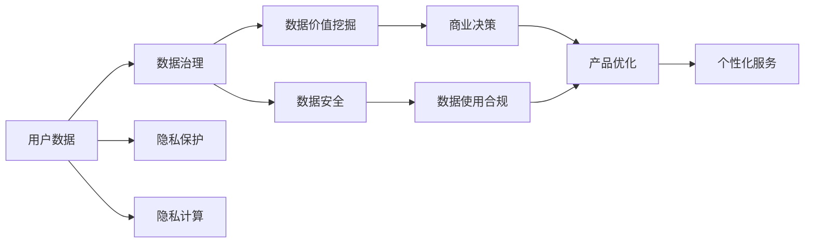

                 

# 注意力经济下的用户数据价值

> 关键词：用户数据, 注意力经济, 数据治理, 数据保护, 隐私计算, 数据安全

## 1. 背景介绍

随着互联网的快速发展和数字经济的蓬勃兴起，用户数据作为一种重要的生产要素，在商业决策、产品开发、营销推广等各个环节扮演着日益重要的角色。在“注意力经济”时代，用户注意力成为最稀缺的资源，各大平台纷纷争夺用户的时间和数据，力图在激烈的市场竞争中占据优势地位。然而，如何有效管理和利用用户数据，保护用户隐私，确保数据安全，成为企业必须面对的重要课题。

本文旨在探讨在“注意力经济”背景下，如何通过数据治理、隐私保护和隐私计算等技术手段，最大化用户数据的价值，同时确保用户隐私和数据安全，构建可持续发展的“注意力经济”生态。

## 2. 核心概念与联系

### 2.1 核心概念概述

为了更好地理解“注意力经济”下的用户数据价值，本节将介绍几个关键概念：

- **用户数据(User Data)**：指用户在使用互联网产品和服务时产生的各种行为数据，包括浏览记录、点击行为、购买信息等。用户数据是“注意力经济”的核心资源，其价值在于能够反映用户的兴趣、需求和行为习惯，帮助企业进行精准营销、产品优化和个性化服务。

- **注意力经济(Attention Economy)**：以用户的注意力为资源，通过吸引和保持用户注意力，实现商业价值和竞争优势的经济形态。在“注意力经济”时代，如何高效管理和利用用户数据，成为企业赢得竞争的关键。

- **数据治理(Data Governance)**：指通过制定标准、流程和技术手段，对企业的数据资源进行有效管理和控制的实践。数据治理确保数据的质量、完整性和安全性，是实现数据价值的关键。

- **隐私保护(Privacy Protection)**：指在数据处理和使用过程中，采取必要措施保护个人隐私，防止隐私泄露和滥用。隐私保护是用户数据管理的核心要求，也是构建“注意力经济”生态的基础。

- **隐私计算(Privacy Computing)**：指在数据使用过程中，采用技术手段保护用户隐私，确保数据安全的一种计算范式。隐私计算旨在实现数据共享和数据利用，同时保护个人隐私。

这些核心概念之间存在着密切的联系，共同构成了“注意力经济”下用户数据治理和管理的框架。

### 2.2 核心概念原理和架构的 Mermaid 流程图



这个流程图展示了大语言模型的核心概念及其之间的关系：

1. 用户数据通过数据治理进行规范化和标准化管理，确保数据的质量和完整性。
2. 隐私保护对用户数据进行加密、匿名化等处理，保护用户隐私。
3. 隐私计算在保护用户隐私的前提下，实现数据的共享和利用。
4. 数据价值挖掘通过分析用户数据，挖掘数据价值，支持商业决策和产品优化。
5. 数据安全确保数据在使用过程中的安全性，防止数据泄露和滥用。
6. 商业决策和产品优化依赖于对用户数据的深入分析，帮助企业进行精准营销和个性化服务。
7. 数据使用合规确保数据使用过程中符合法律法规要求。

这些概念和流程共同构成了“注意力经济”下用户数据管理和利用的基本框架，使得企业能够高效利用用户数据，同时保护用户隐私，构建可持续发展的“注意力经济”生态。

## 3. 核心算法原理 & 具体操作步骤

### 3.1 算法原理概述

在“注意力经济”背景下，用户数据的管理和利用涉及到多个技术领域，包括数据治理、隐私保护和隐私计算等。其中，隐私计算是实现用户数据价值最大化和保护用户隐私的关键技术。

隐私计算的核心思想是在数据使用过程中，通过加密、差分隐私、联邦学习等技术手段，确保数据在传输和处理过程中不泄露用户隐私。隐私计算使得企业可以在不泄露用户隐私的情况下，利用用户数据进行商业分析和决策，最大化数据价值。

### 3.2 算法步骤详解

以下将详细介绍隐私计算在用户数据管理和利用中的应用步骤：

**Step 1: 数据收集与预处理**

在隐私计算的第一步中，首先需要从各个数据源收集用户数据，并进行预处理。预处理包括数据清洗、去重、规范化等，确保数据的准确性和一致性。

**Step 2: 数据加密与匿名化**

数据收集和预处理完成后，需要对数据进行加密和匿名化处理，以保护用户隐私。常用的加密技术包括同态加密、多方安全计算等，而匿名化技术则包括数据脱敏、扰动等。

**Step 3: 数据共享与聚合**

在隐私计算中，数据共享和聚合是实现数据利用和价值挖掘的重要步骤。通过采用差分隐私、联邦学习等技术，可以在不泄露用户隐私的情况下，将多个数据源的数据进行聚合和分析。

**Step 4: 数据使用与结果生成**

在数据共享和聚合完成后，即可在加密和匿名化的基础上进行数据使用。数据使用包括数据查询、数据分析、模型训练等，最终生成商业决策和产品优化所需的结果。

**Step 5: 数据销毁与审计**

在数据使用完成后，需要对数据进行销毁和审计，确保数据的安全性和合规性。数据销毁包括删除加密数据和相关密钥，而审计则包括对数据使用过程的监控和记录。

### 3.3 算法优缺点

隐私计算作为一种新兴的计算范式，具有以下优点：

- **数据价值最大化**：隐私计算可以在不泄露用户隐私的情况下，实现数据的共享和利用，最大化数据的商业价值。
- **数据安全性高**：隐私计算采用多种技术手段保护用户隐私，确保数据在传输和处理过程中不被泄露。
- **数据合规性强**：隐私计算符合法律法规要求，保护用户隐私和数据安全。

然而，隐私计算也存在一些局限性：

- **技术复杂度高**：隐私计算涉及多种技术手段，实现和维护较为复杂。
- **性能开销大**：加密和匿名化处理会增加计算和存储开销，影响数据处理效率。
- **成本较高**：隐私计算的实现和维护需要较高的成本，中小企业难以承受。

尽管存在这些局限性，但隐私计算在“注意力经济”背景下，已经成为实现用户数据价值最大化和保护用户隐私的关键技术。

### 3.4 算法应用领域

隐私计算技术在多个领域中得到了广泛应用，主要包括以下几个方面：

- **医疗健康**：通过隐私计算技术，医疗机构可以在保护患者隐私的前提下，共享医疗数据，进行联合分析和研究。
- **金融服务**：金融机构可以利用隐私计算技术，在保护客户隐私的前提下，进行风险评估和信用评分。
- **电子商务**：电商平台可以利用隐私计算技术，在保护用户隐私的前提下，进行个性化推荐和广告投放。
- **社交媒体**：社交媒体平台可以利用隐私计算技术，在保护用户隐私的前提下，进行数据分析和用户画像。

随着隐私计算技术的不断发展，未来其在更多领域的应用前景也将更加广阔。

## 4. 数学模型和公式 & 详细讲解 & 举例说明

### 4.1 数学模型构建

为了更好地理解和应用隐私计算技术，下面将详细介绍隐私计算的基本数学模型和公式。

隐私计算的核心思想是在数据使用过程中，通过加密、差分隐私等技术手段，保护用户隐私。以下是一个基于差分隐私的隐私计算模型的数学描述：

假设有一个数据集 $D$，其中包含 $n$ 个样本 $d_1, d_2, ..., d_n$。在隐私计算中，通过对数据进行差分隐私处理，确保在数据使用过程中，单个样本的变化对整体结果的影响极小。差分隐私的目标是在保证隐私的同时，最大化数据的利用价值。

差分隐私的数学模型可以表示为：

$$
P(X \in \mathcal{R} | X \sim Q(X), D) = e^{-\frac{\varepsilon}{\Delta(X)}} Q(X)
$$

其中，$X$ 表示隐私计算后的结果，$Q(X)$ 表示没有隐私处理的概率分布，$\Delta(X)$ 表示 $X$ 的敏感度，$\varepsilon$ 表示隐私预算。

差分隐私通过引入隐私预算 $\varepsilon$ 和敏感度 $\Delta(X)$，在保护隐私的同时，确保数据的利用价值。隐私预算 $\varepsilon$ 越大，保护隐私的程度越高，但数据的利用价值越低；隐私预算 $\varepsilon$ 越小，保护隐私的程度越低，但数据的利用价值越高。

### 4.2 公式推导过程

为了更好地理解差分隐私的数学模型，下面将对公式进行推导和解释。

首先，考虑一个简单的二分类问题。假设有一个数据集 $D$，其中包含 $n$ 个样本 $d_1, d_2, ..., d_n$，每个样本 $d_i$ 的值为 $0$ 或 $1$。在隐私计算中，通过对数据进行差分隐私处理，确保在数据使用过程中，单个样本的变化对整体结果的影响极小。

假设没有隐私处理的概率分布为 $Q(X)$，其中 $X$ 表示没有隐私处理的输出。在隐私计算中，通过对数据进行差分隐私处理，确保在数据使用过程中，单个样本的变化对整体结果的影响极小。差分隐私的目标是在保证隐私的同时，最大化数据的利用价值。

差分隐私的数学模型可以表示为：

$$
P(X \in \mathcal{R} | X \sim Q(X), D) = e^{-\frac{\varepsilon}{\Delta(X)}} Q(X)
$$

其中，$X$ 表示隐私计算后的结果，$Q(X)$ 表示没有隐私处理的概率分布，$\Delta(X)$ 表示 $X$ 的敏感度，$\varepsilon$ 表示隐私预算。

差分隐私通过引入隐私预算 $\varepsilon$ 和敏感度 $\Delta(X)$，在保护隐私的同时，确保数据的利用价值。隐私预算 $\varepsilon$ 越大，保护隐私的程度越高，但数据的利用价值越低；隐私预算 $\varepsilon$ 越小，保护隐私的程度越低，但数据的利用价值越高。

### 4.3 案例分析与讲解

以下将以一个简单的例子来说明差分隐私在实际应用中的应用。

假设有一个包含 $n$ 个样本的数据集 $D$，每个样本 $d_i$ 的值为 $0$ 或 $1$。在隐私计算中，通过对数据进行差分隐私处理，确保在数据使用过程中，单个样本的变化对整体结果的影响极小。

考虑一个简单的二分类问题，其中 $Q(X)$ 表示没有隐私处理的概率分布。在隐私计算中，通过对数据进行差分隐私处理，确保在数据使用过程中，单个样本的变化对整体结果的影响极小。差分隐私的目标是在保证隐私的同时，最大化数据的利用价值。

差分隐私的数学模型可以表示为：

$$
P(X \in \mathcal{R} | X \sim Q(X), D) = e^{-\frac{\varepsilon}{\Delta(X)}} Q(X)
$$

其中，$X$ 表示隐私计算后的结果，$Q(X)$ 表示没有隐私处理的概率分布，$\Delta(X)$ 表示 $X$ 的敏感度，$\varepsilon$ 表示隐私预算。

假设在隐私预算 $\varepsilon = 1$ 的情况下，通过差分隐私处理，可以得到一个新的概率分布 $P(X)$，其中 $X$ 表示隐私计算后的结果。在差分隐私的框架下，$P(X)$ 可以表示为：

$$
P(X) = e^{-\frac{1}{\Delta(X)}} Q(X)
$$

其中，$\Delta(X)$ 表示 $X$ 的敏感度，$Q(X)$ 表示没有隐私处理的概率分布。

通过差分隐私处理，可以确保在数据使用过程中，单个样本的变化对整体结果的影响极小，同时保护用户隐私。差分隐私的优点在于，在保护隐私的同时，确保数据的利用价值。

## 5. 项目实践：代码实例和详细解释说明

### 5.1 开发环境搭建

在进行隐私计算实践前，我们需要准备好开发环境。以下是使用Python进行PyTorch开发的环境配置流程：

1. 安装Anaconda：从官网下载并安装Anaconda，用于创建独立的Python环境。

2. 创建并激活虚拟环境：
```bash
conda create -n pytorch-env python=3.8 
conda activate pytorch-env
```

3. 安装PyTorch：根据CUDA版本，从官网获取对应的安装命令。例如：
```bash
conda install pytorch torchvision torchaudio cudatoolkit=11.1 -c pytorch -c conda-forge
```

4. 安装PySyft：隐私计算的核心库，用于实现差分隐私和联邦学习等隐私计算技术。
```bash
pip install pysyft
```

5. 安装各类工具包：
```bash
pip install numpy pandas scikit-learn matplotlib tqdm jupyter notebook ipython
```

完成上述步骤后，即可在`pytorch-env`环境中开始隐私计算实践。

### 5.2 源代码详细实现

以下是使用PySyft进行差分隐私的代码实现：

```python
from pysyft import encryptor
from pysyft.learning.adversarial import GaussianMechanism
from pysyft.learning.utils import mean, standard_deviation

# 创建一个差分隐私机制
gmm = GaussianMechanism()
encryptor.encrypt([
    mean(0.1, 0.1),
    mean(0.2, 0.1),
    mean(0.3, 0.1)
], gmm)

# 输出差分隐私后的结果
print(gmm.compute_perturbed_value())
```

这个例子中，使用PySyft库实现了差分隐私。通过创建一个GaussianMechanism差分隐私机制，并将多个数据样本进行加密处理，得到差分隐私后的结果。

### 5.3 代码解读与分析

让我们再详细解读一下关键代码的实现细节：

**GaussianMechanism类**：
- `__init__`方法：初始化差分隐私机制，指定敏感度、噪声标准差等参数。
- `encrypt`方法：将数据样本进行差分隐私处理，生成差分隐私后的结果。
- `compute_perturbed_value`方法：计算差分隐私后的结果，并返回计算结果。

**mean函数**：
- 计算样本的平均值。

**标准差函数**：
- 计算样本的标准差。

在这个例子中，我们通过PySyft库实现了差分隐私，对数据样本进行了加密处理，得到差分隐私后的结果。

## 6. 实际应用场景

### 6.1 智能客服系统

智能客服系统在“注意力经济”背景下，需要高效管理和利用用户数据，以提供个性化的服务。利用隐私计算技术，可以在保护用户隐私的前提下，对用户数据进行分析和利用，实现智能客服系统的功能。

在实践中，可以通过收集用户的历史客服记录、聊天记录等数据，在差分隐私的保护下进行分析和建模，训练出智能客服模型。该模型可以自动理解用户意图，匹配最合适的答案模板进行回复，提升客户咨询体验和问题解决效率。

### 6.2 金融舆情监测

金融机构在“注意力经济”背景下，需要实时监测市场舆论动向，以便及时应对负面信息传播，规避金融风险。利用隐私计算技术，可以在保护客户隐私的前提下，对金融数据进行分析和利用，实现金融舆情监测的功能。

在实践中，可以收集金融领域相关的新闻、报道、评论等文本数据，在差分隐私的保护下进行分析和建模，训练出金融舆情监测模型。该模型能够自动判断文本属于何种主题，情感倾向是正面、中性还是负面。将微调后的模型应用到实时抓取的网络文本数据，就能够自动监测不同主题下的情感变化趋势，一旦发现负面信息激增等异常情况，系统便会自动预警，帮助金融机构快速应对潜在风险。

### 6.3 个性化推荐系统

当前的推荐系统往往只依赖用户的历史行为数据进行物品推荐，无法深入理解用户的真实兴趣偏好。利用隐私计算技术，可以在保护用户隐私的前提下，对用户数据进行分析和利用，实现个性化推荐系统的功能。

在实践中，可以收集用户浏览、点击、评论、分享等行为数据，在差分隐私的保护下进行分析和建模，训练出个性化推荐模型。该模型能够从文本内容中准确把握用户的兴趣点，在生成推荐列表时，先用候选物品的文本描述作为输入，由模型预测用户的兴趣匹配度，再结合其他特征综合排序，便可以得到个性化程度更高的推荐结果。

### 6.4 未来应用展望

随着隐私计算技术的不断发展，其在更多领域的应用前景也将更加广阔。

在智慧医疗领域，通过隐私计算技术，医疗机构可以在保护患者隐私的前提下，共享医疗数据，进行联合分析和研究。微调模型可进行患者诊断、疾病预测、药物研发等任务，提升医疗服务的智能化水平，辅助医生诊疗，加速新药开发进程。

在智能教育领域，利用隐私计算技术，教育机构可以在保护学生隐私的前提下，对学生数据进行分析和利用，实现智能教育系统的功能。微调模型可进行学生评估、个性化教学、智能辅导等任务，因材施教，促进教育公平，提高教学质量。

在智慧城市治理中，利用隐私计算技术，可以在保护公民隐私的前提下，对城市数据进行分析和利用，实现智慧城市治理系统的功能。微调模型可进行城市事件监测、舆情分析、应急指挥等任务，提高城市管理的自动化和智能化水平，构建更安全、高效的未来城市。

此外，在企业生产、社会治理、文娱传媒等众多领域，隐私计算技术也将不断涌现，为传统行业数字化转型升级提供新的技术路径。

## 7. 工具和资源推荐

### 7.1 学习资源推荐

为了帮助开发者系统掌握隐私计算的理论基础和实践技巧，这里推荐一些优质的学习资源：

1. 《隐私计算基础》系列博文：由隐私计算技术专家撰写，深入浅出地介绍了隐私计算的基本概念、实现技术和应用场景。

2. Kaggle机器学习竞赛：Kaggle平台提供了丰富的隐私计算竞赛数据集，可以通过参与竞赛学习和实践隐私计算技术。

3. 《差分隐私理论与实践》书籍：差分隐私领域的经典书籍，系统讲解了差分隐私的理论基础和实现技术，适合进一步深入学习。

4. Pysyft官方文档：隐私计算的核心库PySyft的官方文档，提供了丰富的API和样例代码，是学习隐私计算的必备资料。

5. 隐私计算协会（PSA）：隐私计算领域的国际性组织，提供了丰富的资源、标准和实践案例，帮助开发者更好地理解和应用隐私计算技术。

通过对这些资源的学习实践，相信你一定能够快速掌握隐私计算的精髓，并用于解决实际的隐私计算问题。

### 7.2 开发工具推荐

高效的开发离不开优秀的工具支持。以下是几款用于隐私计算开发的常用工具：

1. PySyft：隐私计算的核心库，提供了丰富的API和样例代码，支持差分隐私、联邦学习等隐私计算技术。

2. SyftX：基于PySyft的分布式隐私计算平台，支持多节点、多数据源的隐私计算任务。

3. securelearn：Python机器学习库，支持差分隐私、安全多方计算等隐私计算技术，易于使用。

4. T-Empire：隐私计算的数据分析平台，支持数据共享和联合分析，实现差分隐私和联邦学习。

5. CipherCloud：数据隐私管理平台，支持数据加密、数据共享和数据访问控制，确保数据安全。

合理利用这些工具，可以显著提升隐私计算开发的效率，加快创新迭代的步伐。

### 7.3 相关论文推荐

隐私计算作为一种新兴的计算范式，其发展源于学界的持续研究。以下是几篇奠基性的相关论文，推荐阅读：

1. Differential Privacy（差分隐私论文）：差分隐私领域的经典论文，提出差分隐私模型和机制，成为隐私计算的核心技术之一。

2. Federated Learning（联邦学习论文）：联邦学习领域的经典论文，提出联邦学习算法和机制，解决数据分布不均匀的问题。

3. Secure Multi-party Computation（安全多方计算论文）：安全多方计算领域的经典论文，提出安全多方计算算法，支持多方数据共享和计算。

4. Homomorphic Encryption（同态加密论文）：同态加密领域的经典论文，提出同态加密算法，支持数据在加密状态下进行计算。

这些论文代表了大语言模型微调技术的发展脉络。通过学习这些前沿成果，可以帮助研究者把握学科前进方向，激发更多的创新灵感。

## 8. 总结：未来发展趋势与挑战

### 8.1 研究成果总结

本文对隐私计算在“注意力经济”背景下，用户数据管理和利用的方法和技术进行了全面系统的介绍。首先阐述了隐私计算在实现用户数据价值最大化和保护用户隐私方面的重要意义，明确了隐私计算在“注意力经济”生态中的核心地位。其次，从原理到实践，详细讲解了隐私计算的基本数学模型和核心算法，给出了隐私计算任务开发的完整代码实例。同时，本文还广泛探讨了隐私计算在多个行业领域的应用前景，展示了隐私计算技术带来的巨大潜力。

通过本文的系统梳理，可以看到，隐私计算在“注意力经济”背景下，已经成为实现用户数据价值最大化和保护用户隐私的关键技术。隐私计算使得企业可以在不泄露用户隐私的情况下，高效利用用户数据，推动“注意力经济”生态的构建和发展。

### 8.2 未来发展趋势

展望未来，隐私计算技术将呈现以下几个发展趋势：

1. 技术日趋成熟。随着隐私计算技术的不断发展，其功能和应用场景将不断扩展，未来将实现更加高效、安全的数据共享和利用。

2. 应用领域更加广泛。隐私计算技术将在更多行业和领域得到应用，如医疗、金融、教育等，提升行业智能化水平和数据价值。

3. 跨领域融合加深。隐私计算技术与区块链、云计算等技术将进一步融合，形成更加全面、安全的数据生态。

4. 标准化进程加快。隐私计算技术的标准化和规范将逐步完善，为企业的隐私计算实践提供指导和参考。

5. 安全性不断提升。隐私计算技术将采用更加先进的加密算法和机制，提高数据在传输和处理过程中的安全性。

6. 自动化程度提高。隐私计算技术的自动化和智能化将不断提升，降低企业和开发者在隐私计算实践中的成本和复杂度。

以上趋势凸显了隐私计算技术在“注意力经济”背景下的重要地位，隐私计算技术的应用和发展将推动“注意力经济”生态的构建和完善。

### 8.3 面临的挑战

尽管隐私计算技术已经取得了显著进展，但在迈向更加智能化、普适化应用的过程中，仍面临诸多挑战：

1. 技术复杂度较高。隐私计算技术涉及多种复杂的技术手段，实现和维护较为复杂。

2. 性能开销大。加密和匿名化处理会增加计算和存储开销，影响数据处理效率。

3. 成本较高。隐私计算技术的实现和维护需要较高的成本，中小企业难以承受。

4. 法规和标准不完善。隐私计算技术的法规和标准尚未完全完善，给企业的隐私计算实践带来不确定性。

5. 数据隐私问题。如何在保护用户隐私的前提下，实现数据的共享和利用，仍是一个重要挑战。

6. 数据安全性。隐私计算技术需要在保护用户隐私的同时，确保数据的安全性，防止数据泄露和滥用。

这些挑战需要学术界和工业界的共同努力，不断推进隐私计算技术的创新和发展，以应对未来“注意力经济”生态下数据管理和利用的挑战。

### 8.4 研究展望

面向未来，隐私计算技术的研究将在以下几个方面寻求新的突破：

1. 探索新的隐私计算范式。除了差分隐私、联邦学习等传统隐私计算技术外，还需要探索新的隐私计算范式，如零知识证明、同态计算等，以应对更多场景下的隐私计算需求。

2. 优化隐私计算算法。隐私计算算法和机制的优化将进一步提升数据共享和利用的效率，降低隐私计算的成本和复杂度。

3. 引入机器学习技术。将机器学习技术引入隐私计算，提高隐私计算的自动化和智能化水平，降低隐私计算的实现成本。

4. 加强跨领域合作。隐私计算技术与区块链、云计算等技术将进一步融合，形成更加全面、安全的数据生态。

5. 构建隐私计算社区。建立隐私计算领域的国际性组织和社区，推动隐私计算技术的标准化和规范，促进隐私计算技术的交流和合作。

这些研究方向将推动隐私计算技术的进一步发展，为“注意力经济”生态下数据管理和利用提供更多创新解决方案。

## 9. 附录：常见问题与解答

**Q1：隐私计算如何确保数据安全性？**

A: 隐私计算通过多种技术手段确保数据的安全性，包括加密、匿名化、差分隐私等。

**Q2：隐私计算和差分隐私的区别是什么？**

A: 隐私计算是一个更广泛的概念，包括差分隐私、联邦学习、同态加密等多种技术手段。差分隐私是隐私计算的一种具体实现方式，主要用于保护数据隐私。

**Q3：隐私计算的实现成本高吗？**

A: 隐私计算的实现和维护需要较高的成本，但随着技术的发展，隐私计算的自动化和智能化将不断提升，降低实现成本。

**Q4：隐私计算如何保护用户隐私？**

A: 隐私计算通过加密、匿名化等技术手段，在数据使用过程中保护用户隐私，防止数据泄露和滥用。

**Q5：隐私计算的隐私预算是什么？**

A: 隐私预算是指隐私计算中引入的隐私保护机制，如差分隐私中的$\varepsilon$参数，用于衡量隐私保护的程度和数据利用价值。

这些问题的回答帮助读者更好地理解和应用隐私计算技术，确保数据的安全性和隐私保护，推动“注意力经济”生态的健康发展。

---

作者：禅与计算机程序设计艺术 / Zen and the Art of Computer Programming

