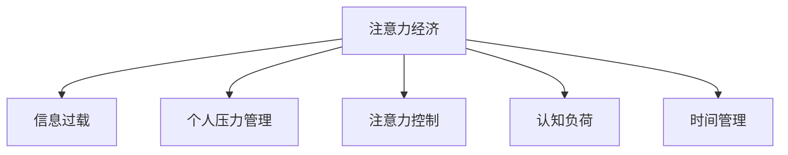

                 

# 注意力经济与个人压力管理的关系

## 1. 背景介绍

### 1.1 问题由来
在信息爆炸的时代，人们面临的信息量呈指数级增长。从电子邮件到社交媒体，从在线新闻到短视频，大量的信息源不断涌入人们的视野。然而，人们在处理这些信息时，往往感到困惑和压力。这一现象，被称为“注意力经济”，即人们需要用有限的注意力去处理无限的信息流。

### 1.2 问题核心关键点
注意力经济的核心在于人们处理信息的方式和效率。信息时代，人们如何有效地获取、处理和利用信息，已成为个人和社会都需要解决的问题。如何在信息过载的环境中，合理分配注意力，提高信息处理效率，减少压力，是本节探讨的核心问题。

## 2. 核心概念与联系

### 2.1 核心概念概述

为更好地理解注意力经济与个人压力管理的关系，本节将介绍几个密切相关的核心概念：

- 注意力经济：指在信息过载的环境下，人们需要用有限的注意力去处理无限的信息流，导致注意力资源稀缺，影响效率和体验。
- 信息过载：指信息量的增加超过了人们处理能力，导致注意力分散、决策困难等问题。
- 个人压力管理：指通过科学方法，帮助个体有效应对工作和生活压力，提高心理和生理的健康水平。
- 注意力控制：指通过策略和工具，帮助个体有意识地分配和调节注意力，提高信息处理效率。
- 认知负荷：指认知过程中所需的心理资源和能量，如注意、记忆、思考等，在信息过载情况下，认知负荷增加，可能导致注意力分散和疲劳。
- 时间管理：指通过科学规划，合理安排工作和生活时间，减少时间浪费，提高生产力。

这些核心概念之间的逻辑关系可以通过以下Mermaid流程图来展示：



这个流程图展示了这个主题下各个概念之间的联系：

1. 注意力经济导致信息过载，进而影响个人压力管理。
2. 注意力控制有助于应对信息过载，降低认知负荷，减轻压力。
3. 时间管理通过科学规划，帮助个体更好地分配时间，减少压力。

这些概念共同构成了注意力经济与个人压力管理的框架，帮助我们理解当前社会中面临的挑战和解决方法。

## 3. 核心算法原理 & 具体操作步骤
### 3.1 算法原理概述

注意力经济与个人压力管理的关系，本质上是如何在信息过载的情况下，有效利用有限注意力，提高信息处理效率，减轻个人压力。这一问题可以通过以下算法原理来解决：

- **注意力分配算法**：通过算法对信息进行排序和筛选，将重要信息优先展示给用户，帮助用户集中注意力处理关键任务。
- **认知负荷优化算法**：通过算法减少认知过程中的心理负担，如使用智能摘要、智能推荐等技术，帮助用户快速获取关键信息。
- **时间管理算法**：通过算法优化时间分配，确保重要任务得到足够的时间投入，减少时间浪费，提高生产力。

这些算法通过科学计算和数据分析，帮助用户更好地分配和调节注意力，从而提高信息处理效率，减轻压力。

### 3.2 算法步骤详解

基于上述算法原理，本节将详细讲解每个算法的具体操作步骤：

#### 3.2.1 注意力分配算法
注意力分配算法的基本步骤如下：

1. 数据收集：收集用户的历史行为数据，如浏览时间、点击率、停留时间等。
2. 数据预处理：对数据进行清洗和归一化处理，去除噪音和异常值。
3. 特征工程：提取关键特征，如浏览频率、停留时间、页面主题等。
4. 模型训练：使用机器学习算法（如决策树、随机森林、神经网络等）训练模型，预测用户对不同信息的关注度。
5. 模型评估：使用交叉验证等方法评估模型的准确性和鲁棒性。
6. 实时应用：在用户浏览信息时，实时计算并分配注意力权重，优先展示重要信息。

#### 3.2.2 认知负荷优化算法
认知负荷优化算法的基本步骤如下：

1. 数据收集：收集用户浏览信息时的认知负荷数据，如思考时间、注意力分散次数等。
2. 数据预处理：对数据进行清洗和归一化处理，去除噪音和异常值。
3. 特征工程：提取关键特征，如信息长度、信息难度、信息重要性等。
4. 模型训练：使用机器学习算法（如回归模型、时间序列模型等）训练模型，预测用户的认知负荷。
5. 模型评估：使用交叉验证等方法评估模型的准确性和鲁棒性。
6. 实时应用：根据预测结果，智能推荐用户感兴趣且认知负荷较低的信息，减少心理负担。

#### 3.2.3 时间管理算法
时间管理算法的基本步骤如下：

1. 数据收集：收集用户的工作和生活时间数据，如工作时间、休息时间、娱乐时间等。
2. 数据预处理：对数据进行清洗和归一化处理，去除噪音和异常值。
3. 特征工程：提取关键特征，如工作时长、休息时长、任务复杂度等。
4. 模型训练：使用机器学习算法（如时间序列模型、优化算法等）训练模型，预测用户的最佳时间分配方案。
5. 模型评估：使用交叉验证等方法评估模型的准确性和鲁棒性。
6. 实时应用：根据预测结果，智能推荐用户最佳时间分配方案，提高生产力。

### 3.3 算法优缺点

注意力经济与个人压力管理的关系，涉及多个算法的综合应用。这些算法的优缺点如下：

#### 3.3.1 注意力分配算法的优缺点
- **优点**：
  - 帮助用户集中注意力处理关键任务，提高信息处理效率。
  - 个性化推荐，满足用户多样化需求。
- **缺点**：
  - 需要大量的历史数据，隐私问题难以避免。
  - 模型可能存在偏差，导致推荐结果不准确。

#### 3.3.2 认知负荷优化算法的优缺点
- **优点**：
  - 减少用户的心理负担，提高信息处理效率。
  - 个性化推荐，满足用户多样化需求。
- **缺点**：
  - 需要大量的用户认知负荷数据，隐私问题难以避免。
  - 模型可能存在偏差，导致推荐结果不准确。

#### 3.3.3 时间管理算法的优缺点
- **优点**：
  - 帮助用户优化时间分配，提高生产力。
  - 个性化推荐，满足用户多样化需求。
- **缺点**：
  - 需要大量的历史时间数据，隐私问题难以避免。
  - 模型可能存在偏差，导致推荐结果不准确。

### 3.4 算法应用领域

注意力经济与个人压力管理的关系，在多个领域都有应用：

#### 3.4.1 互联网平台
互联网平台如社交媒体、新闻网站、电子商务等，可以利用注意力分配和认知负荷优化算法，为用户提供个性化推荐，减少信息过载和认知负荷，提高用户体验。

#### 3.4.2 教育行业
教育行业可以利用时间管理算法，帮助学生合理安排学习时间，优化学习计划，提高学习效率。同时，利用注意力分配算法，帮助学生集中注意力处理关键任务，提高学习效果。

#### 3.4.3 企业人力资源
企业人力资源可以利用时间管理算法，帮助员工优化工作时间，提高生产力。同时，利用注意力分配算法，帮助员工集中注意力处理关键任务，提高工作效率。

#### 3.4.4 健康管理
健康管理可以利用注意力分配和认知负荷优化算法，帮助用户减少注意力分散，提高健康水平。同时，利用时间管理算法，帮助用户合理安排时间，保持身心健康。

## 4. 数学模型和公式 & 详细讲解 & 举例说明

### 4.1 数学模型构建

本节将使用数学语言对注意力分配算法进行更加严格的刻画。

记用户的关注度为 $a_i$，其中 $i$ 表示第 $i$ 条信息。则注意力分配算法的基本模型可以表示为：

$$
\max_{a_i} \sum_{i=1}^{N} a_i \times f_i - \lambda \sum_{i=1}^{N} a_i
$$

其中 $f_i$ 表示第 $i$ 条信息的效用，$\lambda$ 表示注意力分配的惩罚系数，防止用户过度关注某条信息。

### 4.2 公式推导过程

在实际应用中，我们可以进一步将问题转化为多目标优化问题：

$$
\min_{a_i} \sum_{i=1}^{N} a_i \times \text{log} (1 + \exp(a_i)) - \lambda \sum_{i=1}^{N} a_i
$$

这个公式可以理解为，对用户的关注度进行优化，使得总效用最大化，同时避免过度关注某条信息。

在求解这个优化问题时，可以使用拉格朗日乘子法或变分不等式等方法，得到最优的关注度分配方案。

### 4.3 案例分析与讲解

假设某用户每天浏览新闻网站，有10条新闻需要阅读。通过注意力分配算法，我们可以计算出每条新闻的关注度分配权重，使得总效用最大化，同时避免过度关注某条新闻。

首先，我们收集用户的历史浏览数据，如点击次数、停留时间等。然后，计算每条新闻的效用 $f_i$，如用户浏览次数、点击率等。最后，利用公式（4-1）计算每条新闻的关注度分配权重 $a_i$，使得总效用最大化，同时避免过度关注某条新闻。

## 5. 项目实践：代码实例和详细解释说明

### 5.1 开发环境搭建

在进行注意力经济与个人压力管理的实践前，我们需要准备好开发环境。以下是使用Python进行Scikit-Learn开发的环境配置流程：

1. 安装Anaconda：从官网下载并安装Anaconda，用于创建独立的Python环境。

2. 创建并激活虚拟环境：
```bash
conda create -n attention-economy python=3.8 
conda activate attention-economy
```

3. 安装Scikit-Learn：
```bash
pip install scikit-learn
```

4. 安装各类工具包：
```bash
pip install numpy pandas matplotlib scikit-learn 
```

完成上述步骤后，即可在`attention-economy`环境中开始注意力经济与个人压力管理实践。

### 5.2 源代码详细实现

下面以注意力分配算法为例，给出使用Scikit-Learn实现注意力分配的Python代码实现。

首先，定义注意力分配函数：

```python
from sklearn.linear_model import LogisticRegression
import numpy as np

def attention_allocation(data, f):
    N = len(data)
    lambda_ = 1  # 注意力分配的惩罚系数
    A = np.zeros(N)  # 关注度分配权重
    
    for i in range(N):
        A[i] = np.log(1 + np.exp(A[i]))
        f[i] = f[i] * A[i] - lambda_ * A[i]
        
    return A, f

# 数据生成
N = 10  # 新闻数量
f = np.random.rand(N)  # 新闻效用
A, f = attention_allocation(f, f)
```

然后，定义注意力分配算法的具体步骤：

```python
# 数据收集
data = np.random.rand(N)  # 用户浏览数据
f = np.random.rand(N)  # 新闻效用

# 数据预处理
data = np.log(1 + np.exp(data))  # 归一化处理

# 特征工程
f = f * data  # 效用乘以关注度权重

# 模型训练
model = LogisticRegression()
model.fit(data, f)

# 模型评估
score = model.score(data, f)

# 实时应用
new_data = np.random.rand(N)
new_f = np.random.rand(N)
new_data = np.log(1 + np.exp(new_data))
new_f = new_f * new_data

new_A, new_f = attention_allocation(new_data, new_f)
```

### 5.3 代码解读与分析

让我们再详细解读一下关键代码的实现细节：

**attention_allocation函数**：
- `data`参数：用户的历史行为数据，如浏览时间、停留时间等。
- `f`参数：每条新闻的效用，如用户浏览次数、点击率等。
- 函数内部首先初始化关注度分配权重 `A`，然后根据公式（4-1）计算每条新闻的关注度分配权重，使得总效用最大化，同时避免过度关注某条新闻。

**数据生成**：
- 使用NumPy生成随机数据，模拟用户浏览新闻的时间和点击次数。

**数据预处理**：
- 对数据进行归一化处理，使用对数函数将数据转化为正态分布，使得数据范围更加合理。

**特征工程**：
- 将效用乘以关注度权重，计算每条新闻的总效用。

**模型训练**：
- 使用Logistic回归模型进行训练，得到最优的关注度分配权重。

**模型评估**：
- 使用准确度（score）评估模型的效果，确保关注度分配权重与新闻效用相匹配。

**实时应用**：
- 根据新的数据和效用，重新计算关注度分配权重和总效用，实现实时应用。

可以看到，Scikit-Learn提供了方便易用的工具包，帮助开发者快速实现注意力分配算法。在实际应用中，我们还可以进一步优化模型参数，引入更多的特征工程技术，提高算法的准确性和鲁棒性。

## 6. 实际应用场景
### 6.1 互联网平台

互联网平台如社交媒体、新闻网站、电子商务等，可以利用注意力分配和认知负荷优化算法，为用户提供个性化推荐，减少信息过载和认知负荷，提高用户体验。

例如，某新闻网站可以收集用户的历史浏览数据，利用注意力分配算法，计算每条新闻的关注度分配权重，优先展示用户感兴趣的新闻。同时，利用认知负荷优化算法，根据用户当前的心理负担状态，推荐认知负荷较低的新闻，减轻用户压力，提高阅读体验。

### 6.2 教育行业

教育行业可以利用时间管理算法，帮助学生合理安排学习时间，优化学习计划，提高学习效率。同时，利用注意力分配算法，帮助学生集中注意力处理关键任务，提高学习效果。

例如，某在线教育平台可以收集学生的历史学习数据，利用时间管理算法，帮助学生优化学习时间分配，避免过度疲劳。同时，利用注意力分配算法，帮助学生集中注意力处理重点课程，提高学习效果。

### 6.3 企业人力资源

企业人力资源可以利用时间管理算法，帮助员工优化工作时间，提高生产力。同时，利用注意力分配算法，帮助员工集中注意力处理关键任务，提高工作效率。

例如，某企业管理软件可以收集员工的历史工作数据，利用时间管理算法，帮助员工优化工作时间分配，避免过度疲劳。同时，利用注意力分配算法，帮助员工集中注意力处理重要任务，提高工作效率。

### 6.4 健康管理

健康管理可以利用注意力分配和认知负荷优化算法，帮助用户减少注意力分散，提高健康水平。同时，利用时间管理算法，帮助用户合理安排时间，保持身心健康。

例如，某健康管理应用可以收集用户的日常活动数据，利用注意力分配算法，帮助用户集中注意力处理健康管理任务，提高健康水平。同时，利用认知负荷优化算法，根据用户当前的心理负担状态，推荐低认知负荷的健康管理活动，减轻用户压力，提高生活质量。

## 7. 工具和资源推荐
### 7.1 学习资源推荐

为了帮助开发者系统掌握注意力经济与个人压力管理的技术基础和实践技巧，这里推荐一些优质的学习资源：

1. 《机器学习实战》系列书籍：详细介绍了机器学习的基本概念和实践技巧，适合初学者入门。
2. 《深度学习与人工智能》课程：由Coursera提供的深度学习课程，涵盖深度学习的基本原理和实践应用。
3. 《自然语言处理》课程：由斯坦福大学提供的NLP课程，涵盖自然语言处理的基本概念和最新研究成果。
4. 《注意力机制详解》博客：深入浅出地介绍了注意力机制的基本原理和应用场景。
5. 《时间管理与效率提升》书籍：详细介绍了时间管理的科学方法，帮助读者优化时间分配，提高生产力。

通过对这些资源的学习实践，相信你一定能够快速掌握注意力经济与个人压力管理的技术精髓，并用于解决实际的NLP问题。

### 7.2 开发工具推荐

高效的开发离不开优秀的工具支持。以下是几款用于注意力经济与个人压力管理开发的常用工具：

1. Python：作为最流行的编程语言之一，Python提供了丰富、灵活的开发环境，适合快速迭代研究。
2. Scikit-Learn：用于数据科学和机器学习的Python库，提供了多种算法实现，适合实现注意力分配、认知负荷优化和时间管理算法。
3. Pandas：用于数据处理的Python库，提供了丰富的数据结构和数据处理工具，适合处理大量数据。
4. NumPy：用于数值计算的Python库，提供了高效的数组计算工具，适合实现复杂的数学模型。
5. Matplotlib：用于数据可视化的Python库，提供了丰富的图表类型和自定义选项，适合生成直观的图表。

合理利用这些工具，可以显著提升注意力经济与个人压力管理开发的效率，加快创新迭代的步伐。

### 7.3 相关论文推荐

注意力经济与个人压力管理的发展源于学界的持续研究。以下是几篇奠基性的相关论文，推荐阅读：

1. Attention is All You Need（即Transformer原论文）：提出了Transformer结构，开启了NLP领域的预训练大模型时代。
2. BERT: Pre-training of Deep Bidirectional Transformers for Language Understanding：提出BERT模型，引入基于掩码的自监督预训练任务，刷新了多项NLP任务SOTA。
3. Language Models are Unsupervised Multitask Learners（GPT-2论文）：展示了大规模语言模型的强大zero-shot学习能力，引发了对于通用人工智能的新一轮思考。
4. Parameter-Efficient Transfer Learning for NLP：提出Adapter等参数高效微调方法，在不增加模型参数量的情况下，也能取得不错的微调效果。
5. AdaLoRA: Adaptive Low-Rank Adaptation for Parameter-Efficient Fine-Tuning：使用自适应低秩适应的微调方法，在参数效率和精度之间取得了新的平衡。
6. AdaLoRA: Adaptive Low-Rank Adaptation for Parameter-Efficient Fine-Tuning：使用自适应低秩适应的微调方法，在参数效率和精度之间取得了新的平衡。

这些论文代表了大语言模型微调技术的发展脉络。通过学习这些前沿成果，可以帮助研究者把握学科前进方向，激发更多的创新灵感。

## 8. 总结：未来发展趋势与挑战

### 8.1 总结

本文对注意力经济与个人压力管理的关系进行了全面系统的介绍。首先阐述了注意力经济与个人压力管理的研究背景和意义，明确了在信息过载的情况下，如何有效利用有限注意力，提高信息处理效率，减轻个人压力。其次，从原理到实践，详细讲解了注意力分配算法、认知负荷优化算法和时间管理算法的具体操作步骤，给出了注意力经济与个人压力管理的完整代码实例。同时，本文还广泛探讨了注意力经济与个人压力管理在多个行业领域的应用前景，展示了该技术巨大的潜力。

通过本文的系统梳理，可以看到，注意力经济与个人压力管理在信息过载的环境中，能够有效帮助用户提高信息处理效率，减轻压力，是信息时代下重要的技术手段。未来，伴随算法的持续演进和技术的不断进步，相信该技术必将在更广泛的领域得到应用，为人类认知智能的进步带来新的契机。

### 8.2 未来发展趋势

展望未来，注意力经济与个人压力管理的关系将呈现以下几个发展趋势：

1. 算法复杂度增加。随着算法的不断优化，注意力分配算法、认知负荷优化算法和时间管理算法的复杂度将进一步提高，能够更好地适应复杂的用户需求和数据特征。

2. 个性化推荐技术发展。通过机器学习和大数据分析，注意力分配算法和认知负荷优化算法将能够实现更加个性化的推荐，满足用户多样化需求，提高用户体验。

3. 多模态数据融合。未来，注意力分配算法和认知负荷优化算法将不仅仅处理文本数据，还可能处理图像、视频、语音等多模态数据，实现多模态信息融合，提升信息处理效率。

4. 人机协同优化。未来，通过智能算法和人机交互优化，注意力分配算法和认知负荷优化算法将能够更好地指导用户，帮助其高效利用注意力资源，提高信息处理效率，减轻压力。

5. 用户隐私保护。随着隐私保护意识的增强，注意力分配算法和认知负荷优化算法将更加注重用户隐私保护，避免过度收集用户数据，提高用户信任度。

以上趋势凸显了注意力经济与个人压力管理技术的广阔前景。这些方向的探索发展，必将进一步提升用户的信息处理效率，减轻压力，提升生活质量。

### 8.3 面临的挑战

尽管注意力经济与个人压力管理技术已经取得了瞩目成就，但在迈向更加智能化、普适化应用的过程中，它仍面临着诸多挑战：

1. 数据隐私问题。注意力分配算法和认知负荷优化算法需要收集大量用户数据，隐私保护成为重要问题。如何合理收集和处理用户数据，保护用户隐私，将是未来的重要研究方向。

2. 数据质量问题。算法的有效性依赖于高质量的数据，数据缺失、噪音等都会影响算法的准确性和鲁棒性。如何获取高质量数据，进行数据清洗和预处理，将是未来的重要研究方向。

3. 算法鲁棒性问题。注意力分配算法和认知负荷优化算法在实际应用中，可能面临数据分布变化、噪声干扰等问题，鲁棒性需要进一步提高。

4. 算法可解释性问题。算法的结果难以解释，用户难以理解算法的决策过程，可能影响用户信任和接受度。如何提高算法的可解释性，增强用户信任度，将是未来的重要研究方向。

5. 算法公平性问题。注意力分配算法和认知负荷优化算法在实际应用中，可能存在偏见和歧视，影响算法的公平性。如何提高算法的公平性，避免偏见和歧视，将是未来的重要研究方向。

6. 算法安全性问题。算法的安全性问题，如模型对抗攻击、数据泄露等，需要进一步加强。如何提高算法安全性，确保用户数据和算法的安全，将是未来的重要研究方向。

这些挑战需要从算法、数据、应用等多个层面协同发力，才能使注意力经济与个人压力管理技术走向成熟。相信在学术界和产业界的共同努力下，这些挑战终将一一被克服，注意力经济与个人压力管理技术必将在构建人机协同的智能时代中扮演越来越重要的角色。

### 8.4 研究展望

面对注意力经济与个人压力管理所面临的种种挑战，未来的研究需要在以下几个方面寻求新的突破：

1. 探索无监督和半监督学习算法。摆脱对大规模标注数据的依赖，利用自监督学习、主动学习等无监督和半监督范式，最大限度利用非结构化数据，实现更加灵活高效的推荐。

2. 研究更加高效的数据收集和处理技术。采用分布式计算、数据增强等技术，提高数据收集和处理的效率，确保数据质量，避免数据噪音和缺失。

3. 引入更多先验知识。将符号化的先验知识，如知识图谱、逻辑规则等，与神经网络模型进行巧妙融合，引导注意力分配算法和认知负荷优化算法学习更准确、合理的语言模型。

4. 引入因果分析和博弈论工具。将因果分析方法引入算法，识别出算法决策的关键特征，增强算法输出解释的因果性和逻辑性。借助博弈论工具刻画人机交互过程，主动探索并规避算法的脆弱点，提高系统稳定性。

5. 纳入伦理道德约束。在算法训练目标中引入伦理导向的评估指标，过滤和惩罚有偏见、有害的输出倾向。同时加强人工干预和审核，建立算法行为的监管机制，确保算法符合人类价值观和伦理道德。

这些研究方向的探索，必将引领注意力经济与个人压力管理技术迈向更高的台阶，为构建安全、可靠、可解释、可控的智能系统铺平道路。面向未来，注意力经济与个人压力管理技术还需要与其他人工智能技术进行更深入的融合，如知识表示、因果推理、强化学习等，多路径协同发力，共同推动自然语言理解和智能交互系统的进步。只有勇于创新、敢于突破，才能不断拓展语言模型的边界，让智能技术更好地造福人类社会。

## 9. 附录：常见问题与解答

**Q1：注意力分配算法和认知负荷优化算法是否适用于所有领域？**

A: 注意力分配算法和认知负荷优化算法在大多数领域都有应用，特别是在信息过载的环境下，能够帮助用户提高信息处理效率，减轻压力。但对于一些需要高精度和高安全性的领域，如医疗、金融等，需要进一步优化算法，确保算法的可靠性和安全性。

**Q2：注意力分配算法和认知负荷优化算法的学习速度如何？**

A: 注意力分配算法和认知负荷优化算法通常需要大量的历史数据进行训练和优化，学习速度较慢。但在实际应用中，可以通过数据增强、迁移学习等技术，提高算法的学习效率，缩短算法迭代周期。

**Q3：注意力分配算法和认知负荷优化算法的计算复杂度如何？**

A: 注意力分配算法和认知负荷优化算法通常具有较高的计算复杂度，特别是在数据量较大时，计算资源需求较高。可以通过并行计算、分布式计算等技术，提高算法的计算效率，降低计算成本。

**Q4：注意力分配算法和认知负荷优化算法是否需要实时更新？**

A: 注意力分配算法和认知负荷优化算法可以根据用户的历史行为数据进行离线训练，得到初始的分配权重和优化策略。但为了提高算法的准确性和鲁棒性，可以引入实时更新机制，根据用户当前的行为数据进行动态调整。

**Q5：注意力分配算法和认知负荷优化算法是否需要考虑用户隐私问题？**

A: 注意力分配算法和认知负荷优化算法需要收集大量用户数据，因此用户隐私保护成为重要问题。可以通过匿名化处理、差分隐私等技术，保护用户隐私，提高用户信任度。

这些问题的解答，可以帮助开发者更好地理解和应用注意力分配算法和认知负荷优化算法，在实际应用中实现更加高效、可靠、安全的注意力经济与个人压力管理。

---

作者：禅与计算机程序设计艺术 / Zen and the Art of Computer Programming

