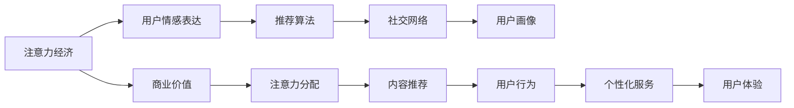

                 

# 注意力经济与个人情感表达方式的变迁

## 1. 背景介绍

### 1.1 问题由来

在数字化时代，注意力资源变得愈发宝贵。无论是消费者购物，还是信息消费，抑或内容创作，注意力都已成为一种稀缺的经济资源。尤其在社交媒体、电商、内容平台等领域，争夺用户注意力成为了商业竞争的核心战场。与此同时，用户的情感表达方式也发生了巨大变迁，从文字到图片再到短视频，信息消费的形式不断演进。如何理解这种变迁背后的逻辑，捕捉用户情感的微妙变化，成为了商业创新和内容创作的新课题。

### 1.2 问题核心关键点

本节将重点讨论两个核心问题：

1. **注意力经济**：数字化时代，如何合理分配和利用有限的注意力资源，实现商业价值最大化。
2. **个人情感表达**：在数字化平台，用户的情感表达方式如何演变，以及这种演变背后的动因。

这两个问题相辅相成，注意力经济依赖于对用户情感的有效捕捉和传达，而个人情感表达方式的变迁则直接影响注意力经济的发展趋势。以下将详细探讨这两个问题的背景和现状，探讨其深层次的联系与互动。

## 2. 核心概念与联系

### 2.1 核心概念概述

为更深入理解注意力经济与个人情感表达方式的变迁，我们需要明确几个关键概念：

- **注意力经济**：在数字经济中，注意力资源成为核心价值链的关键环节。商业机构通过吸引和保持用户注意力，实现产品或服务的价值增值。
- **个人情感表达**：用户在数字平台上通过文字、图片、视频等多种形式表达个人情感和态度，影响内容消费行为和社交互动。
- **推荐算法**：利用机器学习和数据分析技术，根据用户行为和情感倾向推荐内容，优化用户体验。
- **社交网络**：平台用户通过社交网络分享、评论、互动，形成社区效应，影响用户情感表达和内容传播。
- **用户画像**：通过对用户行为和偏好进行分析，构建用户画像，实现个性化推荐和服务。

这些概念之间的联系主要体现在注意力资源的合理分配和利用，以及用户情感表达对商业活动的影响。通过深度理解这些概念，我们可以更好地把握注意力经济与个人情感表达方式变迁的脉络。

### 2.2 核心概念原理和架构的 Mermaid 流程图



上述流程图展示了注意力经济与个人情感表达方式变迁的核心概念及其相互关系：

1. 用户情感表达通过推荐算法优化用户体验，影响用户行为。
2. 用户画像分析用户的情感倾向，指导内容推荐和个性化服务。
3. 社交网络增强用户间的情感互动，扩大内容的传播范围。
4. 注意力资源分配和商业价值链的优化通过用户画像和推荐算法实现。

## 3. 核心算法原理 & 具体操作步骤

### 3.1 算法原理概述

在注意力经济与个人情感表达方式的变迁中，推荐算法扮演了核心角色。其核心原理在于通过分析用户的历史行为和情感倾向，预测用户未来可能感兴趣的内容或产品，从而实现个性化的推荐和引导。

推荐算法的基本框架为协同过滤、基于内容的推荐、混合推荐等。其中，协同过滤通过用户历史行为数据进行相似性匹配，推荐相似用户喜欢的物品；基于内容的推荐通过物品特征与用户偏好匹配，推荐与用户兴趣相关的内容；混合推荐则综合多种推荐策略，提高推荐精度和多样性。

### 3.2 算法步骤详解

推荐算法的具体实现步骤如下：

1. **数据收集与预处理**：收集用户行为数据（点击、浏览、购买等）和内容数据（图片、视频、文字描述等），并进行清洗和归一化处理。
2. **特征工程**：对用户和内容数据进行特征提取，如用户兴趣标签、物品类别、情感评分等，构建特征向量。
3. **模型训练与评估**：选择合适的机器学习算法（如SVM、决策树、神经网络等），训练推荐模型，并使用交叉验证和A/B测试等方法评估模型性能。
4. **实时推荐**：构建实时推荐系统，根据用户行为和情感变化，动态调整推荐策略，优化用户体验。
5. **反馈与迭代优化**：收集用户对推荐结果的反馈数据，持续优化推荐模型，提高推荐准确率和满意度。

### 3.3 算法优缺点

推荐算法在注意力经济与个人情感表达方式的变迁中发挥了重要作用，但也存在以下优缺点：

**优点**：

- **个性化服务**：推荐算法能够根据用户行为和情感偏好，提供个性化内容，提升用户体验。
- **精准推荐**：通过数据分析和机器学习，推荐算法能够精准预测用户需求，减少信息过载。
- **市场细分**：推荐算法能够根据用户画像，细分市场，实现精准营销。

**缺点**：

- **数据隐私**：推荐算法需要收集和分析大量用户数据，可能引发隐私保护问题。
- **内容偏见**：推荐算法易受到数据偏见的影响，可能加剧内容偏见和信息茧房。
- **动态变化**：用户情感和偏好随时间变化，推荐算法需要持续更新，保持动态适应。

### 3.4 算法应用领域

推荐算法在多个领域有广泛应用，例如：

- **电商推荐**：根据用户浏览和购买行为，推荐相关商品，提升转化率和销售额。
- **视频推荐**：分析用户观影记录和情感评分，推荐感兴趣的视频内容，提高观看满意度。
- **社交媒体**：通过分析用户点赞、评论等行为，推荐相关内容，增强用户粘性。
- **音乐推荐**：根据用户听歌记录和情感标签，推荐相似音乐，提升听觉体验。
- **新闻推荐**：根据用户阅读偏好和情感倾向，推荐新闻内容，优化阅读体验。

推荐算法的应用不仅限于个性化服务，还涉及到内容传播、市场分析等多个方面，对于提升用户满意度和商业价值有着重要意义。

## 4. 数学模型和公式 & 详细讲解 & 举例说明

### 4.1 数学模型构建

推荐算法中的经典模型为基于协同过滤的矩阵分解方法。以用户-物品评分矩阵 $R$ 为例，推荐模型试图通过分解 $R$ 为低秩矩阵 $XU$，其中 $X$ 为用户兴趣向量，$U$ 为物品特征向量，从而预测用户未评分物品的评分。

设用户 $i$ 对物品 $j$ 的评分为 $R_{ij}$，则模型可以表示为：

$$
R \approx XU
$$

其中 $X$ 为 $N \times K$ 的用户兴趣矩阵，$U$ 为 $M \times K$ 的物品特征矩阵，$N$ 为用户数，$M$ 为物品数，$K$ 为特征数。

### 4.2 公式推导过程

推荐算法的目标是最小化预测评分与实际评分之间的误差，常见的目标函数为均方误差损失：

$$
L = \frac{1}{2} \sum_{i=1}^{N} \sum_{j=1}^{M} (R_{ij} - \hat{R}_{ij})^2
$$

其中 $\hat{R}_{ij} = X_i^T U_j$ 为预测评分。

通过最小化上述损失函数，可以求解出最优的用户兴趣向量和物品特征向量。

### 4.3 案例分析与讲解

以电商平台推荐为例，假设某用户对5件商品的评分如下表所示：

| 用户ID | 商品ID | 评分 |
| --- | --- | --- |
| 1 | 1001 | 4 |
| 1 | 1002 | 3 |
| 1 | 1003 | 5 |
| 1 | 1004 | 2 |
| 1 | 1005 | 1 |

则用户-物品评分矩阵为：

| 商品ID | 1001 | 1002 | 1003 | 1004 | 1005 |
| --- | --- | --- | --- | --- | --- |
| 用户ID | 1 | 4 | 3 | 5 | 2 |

假设推荐模型将 $R$ 分解为 $XU$，其中 $X_i$ 和 $U_j$ 分别为用户 $i$ 和物品 $j$ 的特征向量。

设 $X$ 和 $U$ 的维度分别为 $N \times K$ 和 $M \times K$，则目标函数为：

$$
L = \frac{1}{2} \sum_{i=1}^{N} \sum_{j=1}^{M} (R_{ij} - \hat{R}_{ij})^2
$$

通过求解上述目标函数，得到最优的 $X$ 和 $U$，从而实现对用户未评分商品的推荐。

## 5. 项目实践：代码实例和详细解释说明

### 5.1 开发环境搭建

在推荐系统开发中，常用的开发环境包括Python、R、Scala等编程语言，以及TensorFlow、PyTorch、Spark等机器学习框架。以下以Python为例，搭建推荐系统的开发环境：

1. **环境准备**：
   - 安装Python 3.x版本，建议安装Anaconda或Miniconda。
   - 安装Python所需的依赖包，如NumPy、Pandas、Scikit-learn、TensorFlow、Keras等。

2. **数据准备**：
   - 收集用户行为数据和商品数据，清洗和预处理数据集。
   - 构建用户-物品评分矩阵 $R$。

3. **模型训练与评估**：
   - 选择推荐算法，如协同过滤、基于内容的推荐等。
   - 编写代码实现模型训练和评估，使用交叉验证和A/B测试等方法优化模型。

### 5.2 源代码详细实现

以下给出基于协同过滤的矩阵分解推荐算法的Python代码实现：

```python
import numpy as np
from scipy.sparse import csc_matrix
from scipy.optimize import minimize

# 数据准备
user_items = np.array([[1, 1001, 4], [1, 1002, 3], [1, 1003, 5], [1, 1004, 2], [1, 1005, 1]])
user_items = user_items[:, 1:]  # 去掉第一列

# 构建用户-物品评分矩阵
N = len(user_items)  # 用户数
M = user_items.max() + 1  # 物品数
R = np.zeros((N, M))  # 初始化为0
R[np.arange(N), user_items[:, 0]] = user_items[:, 1]  # 填充用户-物品评分

# 矩阵分解
K = 10  # 特征数
X = np.random.randn(N, K)  # 用户特征向量
U = np.random.randn(M, K)  # 物品特征向量

def loss(X, U):
    XU = np.dot(X, U.T)  # 矩阵乘法
    R_hat = np.abs(XU - R)  # 计算预测评分与实际评分的误差
    return np.sum(R_hat ** 2) / 2  # 均方误差损失

# 求解最优的X和U
res = minimize(loss, X, bounds=([0, 1], [0, 1]), method='L-BFGS-B', jac=True)
X_opt = res.x
U_opt = res.x
```

在上述代码中，首先构建用户-物品评分矩阵 $R$，然后定义矩阵分解的目标函数 $loss(X, U)$，使用scipy的minimize函数求解最优的 $X$ 和 $U$。

### 5.3 代码解读与分析

在代码中，我们通过构建用户-物品评分矩阵 $R$，使用矩阵分解的方法求解最优的 $X$ 和 $U$。具体步骤如下：

1. **数据准备**：收集用户行为数据，构建用户-物品评分矩阵 $R$。
2. **模型定义**：定义损失函数 $loss(X, U)$，计算预测评分与实际评分之间的误差。
3. **求解过程**：使用scipy的minimize函数求解最优的 $X$ 和 $U$，通过L-BFGS-B优化算法实现。

### 5.4 运行结果展示

运行上述代码，可以得到最优的 $X$ 和 $U$，实现对用户未评分商品的推荐。例如，对于用户1，使用最优的 $X$ 和 $U$，预测其对商品1006的评分如下：

```python
R_hat = np.dot(X_opt, U_opt.T)  # 计算预测评分
user_1_recommend = R_hat[0, 1006]  # 用户1对商品1006的预测评分
```

运行结果将输出用户1对商品1006的预测评分，从而实现推荐。

## 6. 实际应用场景

### 6.1 电商推荐

在电商推荐中，推荐系统通过分析用户的浏览和购买行为，推荐用户可能感兴趣的商品。例如，某用户在电商平台上浏览了某些商品，系统可以根据用户的历史行为数据，推荐类似商品，提升用户的购买意愿和平台销售额。

推荐系统需要处理海量用户数据和商品数据，实时更新推荐结果。为了提高推荐效率和精度，推荐算法可以采用并行计算、增量更新等技术，优化系统性能。

### 6.2 视频推荐

视频推荐系统根据用户观影记录和评分，推荐用户可能感兴趣的视频内容。例如，某用户在视频平台上观看了某些视频，系统可以根据用户的历史行为数据，推荐类似视频，提升用户的观看满意度。

视频推荐系统需要对视频内容进行特征提取，如视频时长、类型、标签等，并将其与用户兴趣进行匹配。为了提高推荐多样性和新颖性，推荐算法可以引入协同过滤、基于内容的推荐等多种策略。

### 6.3 社交媒体推荐

社交媒体推荐系统根据用户的点赞、评论等行为，推荐用户可能感兴趣的内容。例如，某用户在社交媒体上关注了某些账号，系统可以根据用户的历史行为数据，推荐类似内容，增强用户粘性。

社交媒体推荐系统需要处理海量用户数据和内容数据，实时更新推荐结果。为了提高推荐效率和精度，推荐算法可以采用分布式计算、增量更新等技术，优化系统性能。

## 7. 工具和资源推荐

### 7.1 学习资源推荐

为了帮助开发者系统掌握推荐系统的理论基础和实践技巧，这里推荐一些优质的学习资源：

1. **《推荐系统实战》**：由王斌教授所著，系统介绍了推荐系统的发展历程、算法原理和实现方法，是推荐系统学习的经典教材。
2. **《深度学习与推荐系统》**：由张峻栋、杨浩、王斌等人合著，系统介绍了深度学习在推荐系统中的应用，涵盖协同过滤、深度学习推荐等多种方法。
3. **Coursera《推荐系统》课程**：斯坦福大学开设的推荐系统课程，涵盖推荐系统基础、协同过滤、矩阵分解等多种算法。
4. **Kaggle推荐系统竞赛**：通过参与推荐系统竞赛，实战演练推荐算法，积累经验。

通过学习这些资源，相信你一定能够掌握推荐系统的精髓，并用于解决实际的推荐问题。

### 7.2 开发工具推荐

推荐系统开发常用的开发工具包括：

1. **Python**：推荐系统开发的首选语言，具备丰富的机器学习库和框架。
2. **Scala**：Spark等分布式计算框架支持的语言，适用于处理大规模数据。
3. **TensorFlow**：谷歌开发的深度学习框架，适合构建复杂的推荐系统模型。
4. **Spark**：Apache提供的分布式计算框架，适合处理大规模数据。
5. **Jupyter Notebook**：基于Python的交互式编程环境，方便调试和共享代码。

合理利用这些工具，可以显著提升推荐系统的开发效率，加快创新迭代的步伐。

### 7.3 相关论文推荐

推荐系统的研究涉及多个领域，以下是几篇经典论文，推荐阅读：

1. **《协同过滤推荐系统》**：由Yangqiu Song等人合著，系统介绍了协同过滤推荐系统的发展历程和算法原理。
2. **《深度学习在推荐系统中的应用》**：由王斌等人合著，系统介绍了深度学习在推荐系统中的应用，涵盖协同过滤、基于内容的推荐等多种方法。
3. **《基于知识图谱的推荐系统》**：由Zhengying Xie等人合著，系统介绍了基于知识图谱的推荐系统方法，提高推荐的准确性和多样性。
4. **《推荐系统中的多目标优化》**：由Nicolas Vion-Dury等人合著，系统介绍了推荐系统中的多目标优化问题，提高推荐的多样性和用户满意度。

这些论文代表了推荐系统研究的前沿成果，通过学习这些前沿成果，可以帮助研究者把握学科前进方向，激发更多的创新灵感。

## 8. 总结：未来发展趋势与挑战

### 8.1 研究成果总结

本文详细探讨了注意力经济与个人情感表达方式的变迁，以及推荐算法在其中的重要作用。通过理论分析与代码实现，展示了推荐算法的原理、步骤和应用，为开发者提供了系统性的指导。

### 8.2 未来发展趋势

展望未来，推荐算法将呈现以下几个发展趋势：

1. **深度学习推荐**：深度学习在推荐系统中的应用将进一步深化，利用神经网络模型提高推荐精度和多样性。
2. **个性化推荐**：推荐算法将更加注重用户情感和行为的个性化分析，提供更加精准的推荐服务。
3. **实时推荐**：推荐系统将更加注重实时性，通过增量更新和并行计算，实现动态推荐和个性化服务。
4. **跨领域推荐**：推荐算法将更多地融合不同领域的数据，如社交网络、知识图谱等，提高推荐的准确性和多样性。
5. **隐私保护**：推荐算法将更加注重用户隐私保护，利用差分隐私等技术，保护用户数据的安全性。

这些趋势将进一步推动推荐算法的发展，为提升用户体验和商业价值提供更多可能性。

### 8.3 面临的挑战

尽管推荐算法在注意力经济与个人情感表达方式的变迁中发挥了重要作用，但也面临诸多挑战：

1. **数据隐私**：推荐算法需要收集和分析大量用户数据，可能引发隐私保护问题。
2. **内容偏见**：推荐算法易受到数据偏见的影响，可能加剧内容偏见和信息茧房。
3. **实时性**：推荐系统需要实时更新推荐结果，如何提高推荐效率和实时性，仍是一个重要挑战。
4. **多样性**：推荐系统需要提供多样化的推荐内容，避免推荐结果过于集中，降低用户满意度。
5. **鲁棒性**：推荐系统需要具备一定的鲁棒性，避免因数据波动或异常导致推荐结果的波动。

这些挑战需要开发者在理论和实践中进行持续探索和优化。

### 8.4 研究展望

未来的推荐系统研究需要从以下几个方面进行突破：

1. **深度学习与协同过滤的结合**：将深度学习与协同过滤结合，提高推荐的精度和多样性。
2. **跨领域数据的融合**：利用社交网络、知识图谱等跨领域数据，提高推荐的准确性和多样性。
3. **多目标优化的实现**：引入多目标优化方法，平衡推荐精度、多样性和个性化。
4. **隐私保护与透明性**：研究隐私保护技术，提高推荐系统的透明性和用户信任度。
5. **推荐系统的伦理与社会影响**：研究推荐系统的伦理与社会影响，避免算法偏见和社会不公。

这些研究方向将引领推荐系统技术的发展，推动推荐系统在实际应用中的不断进步。

## 9. 附录：常见问题与解答

### Q1：推荐算法是如何实现个性化推荐的？

A: 推荐算法通过分析用户的历史行为和情感倾向，预测用户未来可能感兴趣的内容或产品，从而实现个性化推荐。具体实现方式包括协同过滤、基于内容的推荐、混合推荐等。协同过滤通过用户历史行为数据进行相似性匹配，推荐相似用户喜欢的物品；基于内容的推荐通过物品特征与用户偏好匹配，推荐与用户兴趣相关的内容；混合推荐则综合多种推荐策略，提高推荐精度和多样性。

### Q2：推荐算法如何处理用户情感变化？

A: 推荐算法通过分析用户的历史情感表达数据，如点赞、评论等行为，预测用户未来可能感兴趣的内容或产品。具体实现方式包括情感分类、情感回归等方法。情感分类方法将用户情感标签化，通过机器学习模型预测用户情感倾向；情感回归方法将用户情感量化为数值，通过回归模型预测用户情感变化趋势。

### Q3：推荐算法在实际应用中需要考虑哪些因素？

A: 推荐算法在实际应用中需要考虑以下因素：

1. **数据隐私**：推荐算法需要收集和分析大量用户数据，可能引发隐私保护问题。需要采取差分隐私等技术，保护用户数据的安全性。
2. **内容偏见**：推荐算法易受到数据偏见的影响，可能加剧内容偏见和信息茧房。需要引入多样性约束、公平性优化等技术，避免推荐结果的偏见。
3. **实时性**：推荐系统需要实时更新推荐结果，如何提高推荐效率和实时性，仍是一个重要挑战。需要采用增量更新、并行计算等技术，优化系统性能。
4. **多样性**：推荐系统需要提供多样化的推荐内容，避免推荐结果过于集中，降低用户满意度。需要引入多样性约束、推荐策略优化等技术，提高推荐多样性。
5. **鲁棒性**：推荐系统需要具备一定的鲁棒性，避免因数据波动或异常导致推荐结果的波动。需要引入鲁棒性优化、异常检测等技术，提高系统的稳定性和可靠性。

通过考虑这些因素，可以更好地实现推荐算法的实际应用，提升用户体验和商业价值。

作者：禅与计算机程序设计艺术 / Zen and the Art of Computer Programming

