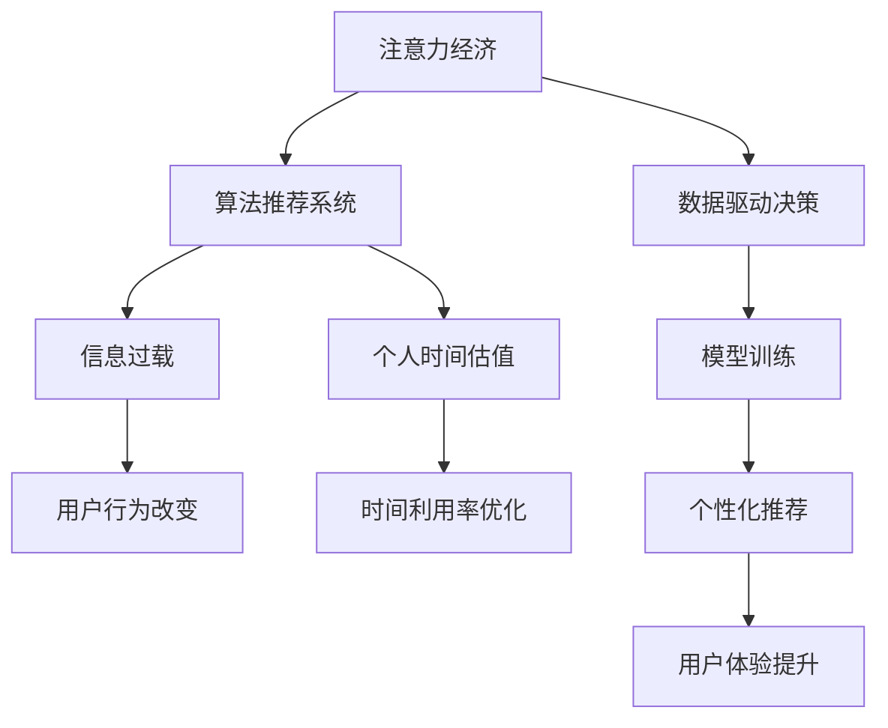

                 

# 注意力经济与个人时间估值的变化

> 关键词：注意力经济,个人时间估值,算法推荐系统,信息过载,深度学习,大数据

## 1. 背景介绍

### 1.1 问题由来
随着信息时代的发展，注意力经济成为日益显著的新型经济模式。通过吸引和转化用户的注意力，企业实现商业价值的增长。然而，大量的信息使得个人在面对繁杂的信息流时，选择变得更加困难。

### 1.2 问题核心关键点
本文聚焦于基于算法推荐系统的注意力经济，以及个人时间估值如何随着算法推荐的影响而发生改变。具体而言，我们将从以下几个维度进行探讨：

- 注意力经济如何通过算法推荐系统实现？
- 算法推荐系统如何影响个人时间估值？
- 如何评估算法推荐系统的影响？

### 1.3 问题研究意义
本研究对于理解信息时代个人时间消费行为，优化算法推荐系统，提升用户信息获取效率具有重要意义。

1. **优化用户信息消费体验**：通过理解个人时间估值的变化，可以更精确地推送个性化信息，优化用户体验。
2. **提升企业运营效率**：算法推荐系统可以有效帮助企业精准营销，提高运营效率。
3. **促进信息公平性**：研究如何通过算法推荐，使得信息消费更加公平、高效，减小信息鸿沟。
4. **促进算法伦理与合规**：研究如何在算法推荐中更好地保护用户隐私，避免“信息茧房”等负面影响。

## 2. 核心概念与联系

### 2.1 核心概念概述

为更好地理解注意力经济与个人时间估值的变化，本节将介绍几个关键概念及其联系：

- **注意力经济**：通过吸引和转化用户注意力而产生经济价值的模式。
- **算法推荐系统**：使用机器学习算法，根据用户的历史行为和兴趣，推荐相关内容的技术系统。
- **个人时间估值**：个体基于时间的机会成本对时间的使用和消耗进行主观评价。
- **信息过载**：用户面临的大量信息超出其处理能力，导致注意力难以集中。
- **深度学习**：一种基于多层神经网络的学习方法，在处理大量数据时表现优异。
- **大数据**：涉及庞大数据集的技术，为深度学习提供了丰富的训练资源。

这些概念之间的关系可以通过以下Mermaid流程图来展示：



这个流程图展示了注意力经济通过算法推荐系统实现，并影响了信息过载和个人时间估值。同时，算法推荐系统也依赖大数据和深度学习技术，通过数据驱动决策来提升个性化推荐，优化用户体验。

## 3. 核心算法原理 & 具体操作步骤
### 3.1 算法原理概述

基于深度学习的算法推荐系统，其核心思想是利用大量用户历史行为数据，通过模型学习用户偏好，预测用户对不同内容的兴趣度。一般分为以下几个步骤：

1. **用户建模**：将用户历史行为数据转化为模型可处理的表示。
2. **物品建模**：将待推荐物品的数据转化为模型可处理的表示。
3. **模型训练**：在用户和物品表示上训练深度学习模型，学习用户对物品的兴趣度。
4. **推荐生成**：将新用户请求输入模型，预测其对不同物品的兴趣度，并返回推荐结果。

### 3.2 算法步骤详解

#### 3.2.1 用户建模

用户建模的目的是将用户的长期行为和短期行为转化为模型可处理的特征表示。一般包括：

- **特征工程**：提取和选择能够反映用户行为和兴趣的特征。
- **嵌入表示**：将提取的特征使用嵌入技术转化为高维向量，便于模型处理。

#### 3.2.2 物品建模

物品建模的目的是将待推荐物品的数据转化为模型可处理的表示。一般包括：

- **特征工程**：提取和选择能够反映物品属性的特征。
- **嵌入表示**：将提取的特征使用嵌入技术转化为高维向量，便于模型处理。

#### 3.2.3 模型训练

模型训练的目的是在用户和物品表示上训练深度学习模型，学习用户对物品的兴趣度。一般包括：

- **损失函数设计**：选择合适的损失函数，如均方误差、交叉熵等，用于衡量预测值与真实值的差异。
- **优化器选择**：选择合适的优化算法，如Adam、SGD等，用于最小化损失函数。
- **超参数调优**：通过交叉验证等方法调整模型的超参数，提高模型的泛化能力。

#### 3.2.4 推荐生成

推荐生成的目的是根据新用户请求，预测其对不同物品的兴趣度，并返回推荐结果。一般包括：

- **输入预处理**：将新用户请求转化为模型可处理的输入。
- **模型预测**：将输入输入模型，预测用户对不同物品的兴趣度。
- **排序输出**：根据兴趣度对推荐结果进行排序，返回给用户。

### 3.3 算法优缺点

基于深度学习的算法推荐系统具有以下优点：

1. **高效性**：能够快速处理大规模数据，生成个性化推荐。
2. **准确性**：通过学习用户行为和物品属性，推荐结果更符合用户兴趣。
3. **可扩展性**：可以处理不断增加的用户和物品数据，具有较强的扩展能力。

同时，该方法也存在一些缺点：

1. **数据依赖性**：推荐结果高度依赖用户和物品的历史数据，缺乏泛化能力。
2. **隐私风险**：用户数据可能被滥用，导致隐私泄露。
3. **推荐偏差**：可能存在数据偏差，导致推荐结果不公正。
4. **信息过载**：推荐过多内容，可能导致用户信息过载。

### 3.4 算法应用领域

基于深度学习的算法推荐系统已经广泛应用于各种领域，包括：

- 电商推荐：根据用户浏览和购买历史，推荐商品。
- 音乐推荐：根据用户听歌历史，推荐歌曲。
- 视频推荐：根据用户观看历史，推荐视频。
- 新闻推荐：根据用户阅读历史，推荐新闻文章。
- 广告推荐：根据用户行为，推荐广告。

除了上述这些经典应用外，算法推荐还逐渐拓展到社交网络、体育赛事、健康医疗等更多领域，为人们提供更为精准和个性化的信息服务。

## 4. 数学模型和公式 & 详细讲解 & 举例说明

### 4.1 数学模型构建

基于深度学习的推荐系统一般使用神经网络模型来表示用户和物品的兴趣度。以下以协同过滤模型为例，进行数学模型的构建。

设用户集为 $U$，物品集为 $I$，用户对物品的评分矩阵为 $R$，其中 $R_{ui}$ 表示用户 $u$ 对物品 $i$ 的评分。协同过滤模型的目标是根据用户和物品的评分数据，预测用户对未评分物品的兴趣度。

设用户嵌入向量为 $u_i$，物品嵌入向量为 $v_i$，用户对物品的兴趣度表示为 $r_{ui}$。则协同过滤模型的目标函数为：

$$
\min_{u_i, v_i} \sum_{u,i} ||R_{ui} - u_i^\top v_i||^2
$$

其中 $u_i$ 和 $v_i$ 分别表示用户和物品的嵌入向量，$||.||$ 表示向量范数。

### 4.2 公式推导过程

协同过滤模型可以进一步扩展为基于矩阵分解的方法，如矩阵分解、SVD等。以矩阵分解为例，模型的目标是将用户和物品的评分矩阵分解为两个低维矩阵 $U$ 和 $V$，使得两者乘积接近原评分矩阵 $R$。

设用户和物品的嵌入矩阵分别为 $U$ 和 $V$，则目标函数为：

$$
\min_{U,V} ||R - UV^\top||^2_F
$$

其中 $||.||^2_F$ 表示矩阵的 Frobenius 范数。

通过梯度下降等优化算法，可以求解上述目标函数，得到用户和物品的嵌入矩阵。模型将用户嵌入和物品嵌入拼接为推荐结果向量，根据向量内积计算预测评分。

### 4.3 案例分析与讲解

以电商推荐为例，假设用户 $u$ 在商品 $i$ 上的评分为 $r_{ui}$，设用户嵌入向量为 $u_i$，物品嵌入向量为 $v_i$。则协同过滤模型的预测评分 $r_{ui}'$ 为：

$$
r_{ui}' = u_i^\top v_i
$$

在模型训练阶段，将用户和物品的评分数据作为输入，通过矩阵分解得到用户和物品的嵌入向量。在推荐生成阶段，将新用户请求 $x$ 转化为用户嵌入向量 $u_x$，在物品集 $I$ 中遍历物品，计算 $u_x^\top v_i$，取最大值即为推荐结果。

## 5. 项目实践：代码实例和详细解释说明
### 5.1 开发环境搭建

在进行推荐系统开发前，我们需要准备好开发环境。以下是使用Python进行TensorFlow开发的环境配置流程：

1. 安装Anaconda：从官网下载并安装Anaconda，用于创建独立的Python环境。

2. 创建并激活虚拟环境：
```bash
conda create -n tf-env python=3.8 
conda activate tf-env
```

3. 安装TensorFlow：根据CUDA版本，从官网获取对应的安装命令。例如：
```bash
conda install tensorflow-gpu=cuda11.1 -c pytorch -c conda-forge
```

4. 安装各类工具包：
```bash
pip install numpy pandas scikit-learn matplotlib tqdm jupyter notebook ipython
```

完成上述步骤后，即可在`tf-env`环境中开始推荐系统开发。

### 5.2 源代码详细实现

下面我们以协同过滤推荐系统为例，给出使用TensorFlow实现电商推荐系统的完整代码。

首先，定义用户和物品的嵌入矩阵：

```python
import tensorflow as tf
import numpy as np

# 假设用户和物品的数量
num_users = 10000
num_items = 10000

# 定义用户和物品的嵌入矩阵
U = tf.Variable(tf.random.normal([num_users, 10]))
V = tf.Variable(tf.random.normal([num_items, 10]))

# 定义评分矩阵
R = tf.constant(np.random.randint(1, 6, size=(num_users, num_items)), dtype=tf.float32)

# 定义损失函数
loss = tf.reduce_mean(tf.reduce_sum((R - tf.matmul(U, tf.transpose(V))) ** 2, axis=1))
```

然后，定义优化器和训练过程：

```python
# 定义优化器
optimizer = tf.optimizers.Adam(learning_rate=0.001)

# 定义训练过程
@tf.function
def train_step(batch):
    with tf.GradientTape() as tape:
        # 前向传播
        predicted_r = tf.matmul(U, tf.transpose(V))
        loss_value = loss(predicted_r, batch)
    # 反向传播
    gradients = tape.gradient(loss_value, [U, V])
    # 更新模型参数
    optimizer.apply_gradients(zip(gradients, [U, V]))

# 训练过程
for epoch in range(100):
    for batch in R:
        train_step(batch)
```

最后，定义推荐生成过程：

```python
# 假设一个新用户请求
new_user_request = tf.random.normal([1, 10])

# 定义预测函数
def predict_item():
    with tf.GradientTape() as tape:
        predicted_r = tf.matmul(U, tf.transpose(V))
        loss_value = loss(predicted_r, R)
    # 计算预测评分
    predicted_score = tf.matmul(U, tf.transpose(V))
    # 返回推荐结果
    top_10 = tf.argsort(predicted_score, axis=1)[:,-10:][0].numpy().tolist()
    top_10_items = [item for item in range(num_items) if tf.math.reduce_sum(predicted_score[:, item]) > 0.5]

# 推荐结果
print(predict_item())
```

以上就是使用TensorFlow对协同过滤推荐系统进行电商推荐任务的完整代码实现。可以看到，通过TensorFlow封装，推荐系统的构建变得简洁高效。

### 5.3 代码解读与分析

让我们再详细解读一下关键代码的实现细节：

**协同过滤模型定义**：
- `U`和`V`：用户和物品的嵌入矩阵，初始化随机矩阵。
- `R`：评分矩阵，作为模型训练的输入。
- `loss`：损失函数，计算预测评分与真实评分之间的差异。

**训练过程**：
- `optimizer`：Adam优化器，用于最小化损失函数。
- `train_step`函数：在每个epoch中，使用batch的评分数据，计算损失，反向传播更新模型参数。
- `for`循环：进行多次epoch迭代训练，逐渐优化模型参数。

**推荐生成过程**：
- `new_user_request`：新用户请求，用于计算预测评分。
- `predict_item`函数：根据新用户请求，计算预测评分，并返回推荐结果。
- `argsort`函数：对预测评分进行排序，取前10个推荐结果。

可以看到，TensorFlow提供了方便的API封装，使得推荐系统的实现变得简单直观。同时，TensorFlow的动态计算图，也支持更灵活的数据流处理和模型优化。

当然，工业级的系统实现还需考虑更多因素，如模型的保存和部署、超参数的自动搜索、更灵活的任务适配层等。但核心的推荐系统构建流程基本与此类似。

## 6. 实际应用场景
### 6.1 智能推荐系统

智能推荐系统已经成为电商、新闻、音乐等诸多领域的标配。通过算法推荐系统，用户可以更快地发现感兴趣的内容，平台也可以更精准地推送广告和产品，实现互利共赢。

在技术实现上，可以收集用户的历史行为数据，构建用户和物品的评分矩阵，在此基础上训练协同过滤模型。推荐系统可以根据新用户请求，预测用户对不同物品的兴趣度，并返回推荐结果。

### 6.2 医疗信息推荐

医疗领域的信息推荐，可以提升医生的工作效率，帮助患者更快地获取相关信息。通过算法推荐系统，可以根据医生的历史查询和患者的问题，推荐相关的医疗文章、药品和疗法。

在技术实现上，可以构建医疗领域的知识图谱，将医生查询和患者问题映射到图谱节点上。然后，在知识图谱上训练推荐模型，根据查询结果，推荐相关的医疗信息。

### 6.3 智能广告投放

智能广告投放系统可以通过算法推荐系统，根据用户的历史行为和兴趣，精准推送广告内容。从而提高广告投放的转化率和效率，降低广告费用。

在技术实现上，可以构建广告投放的数据集，收集用户的历史点击行为。然后，在数据集上训练推荐模型，根据新用户的点击请求，推荐相关的广告内容。

### 6.4 未来应用展望

随着推荐系统的不断发展，基于深度学习的推荐系统将在更多领域得到应用，为人们提供更精准、个性化的信息服务。

在智慧城市治理中，智能推荐系统可以应用于城市事件监测、舆情分析、应急指挥等环节，提高城市管理的自动化和智能化水平，构建更安全、高效的未来城市。

在智慧医疗领域，推荐系统可以用于辅助诊断、药物推荐、健康管理等环节，提升医疗服务的智能化水平，辅助医生诊疗，加速新药开发进程。

在智能教育领域，推荐系统可以应用于作业批改、学情分析、知识推荐等方面，因材施教，促进教育公平，提高教学质量。

此外，在企业生产、社会治理、文娱传媒等众多领域，基于深度学习的推荐系统也将不断涌现，为经济社会发展注入新的动力。

## 7. 工具和资源推荐
### 7.1 学习资源推荐

为了帮助开发者系统掌握算法推荐系统的理论基础和实践技巧，这里推荐一些优质的学习资源：

1. 《推荐系统实战》系列博文：由推荐系统专家撰写，深入浅出地介绍了推荐系统的原理、算法和实践。

2. 《协同过滤》书籍：推荐系统领域的经典著作，详细介绍了协同过滤模型的构建和优化。

3. 《深度学习》课程：斯坦福大学开设的深度学习课程，涵盖深度学习的基本原理和经典模型。

4. 《Python推荐系统》书籍：全面介绍了推荐系统的Python实现，包括协同过滤、矩阵分解等多种方法。

5. 《推荐系统学习笔记》：基于TensorFlow等工具的推荐系统实践教程，结合代码实例详细讲解。

通过对这些资源的学习实践，相信你一定能够快速掌握推荐系统的精髓，并用于解决实际的推荐问题。
###  7.2 开发工具推荐

高效的开发离不开优秀的工具支持。以下是几款用于推荐系统开发的常用工具：

1. TensorFlow：基于Python的开源深度学习框架，灵活动态的计算图，适合快速迭代研究。推荐系统的多种方法都有TensorFlow版本的实现。

2. PyTorch：基于Python的开源深度学习框架，动态计算图，支持GPU加速。推荐系统也可以用PyTorch实现。

3. NumPy：高效的多维数组处理库，推荐系统中的矩阵运算通常使用NumPy实现。

4. Pandas：高效的数据处理库，适合推荐系统中的数据清洗和特征工程。

5. Scikit-learn：机器学习库，适合进行推荐系统的特征选择和模型训练。

6. Jupyter Notebook：交互式开发环境，适合快速迭代和调试推荐模型。

合理利用这些工具，可以显著提升推荐系统的开发效率，加快创新迭代的步伐。

### 7.3 相关论文推荐

推荐系统的发展源于学界的持续研究。以下是几篇奠基性的相关论文，推荐阅读：

1. Collaborative Filtering for Implicit Feedback Datasets（即协同过滤论文）：提出了基于协同过滤的推荐系统，奠定了推荐系统的发展基础。

2. Matrix Factorization Techniques for Recommender Systems（即矩阵分解论文）：提出矩阵分解方法，进一步提升了推荐系统的效果。

3. Deep Learning for Recommender Systems（即深度学习推荐论文）：探讨了深度学习在推荐系统中的应用，展示了深度学习的强大能力。

4. A Bayesian Approach to Modeling Preference Data：探讨了贝叶斯方法在推荐系统中的应用，进一步提升了推荐系统的准确性和鲁棒性。

5. Recommender Systems in e-Commerce：总结了电商领域的推荐系统实践，展示了推荐系统在实际应用中的巨大潜力。

这些论文代表了一代代研究者对推荐系统的探索与贡献，为推荐系统的理论和实践提供了坚实的支撑。

## 8. 总结：未来发展趋势与挑战

### 8.1 总结

本文对基于深度学习的推荐系统进行了全面系统的介绍。首先阐述了深度学习推荐系统的背景和意义，明确了深度学习推荐系统如何实现注意力经济，以及个人时间估值的变化。其次，从原理到实践，详细讲解了推荐系统的数学模型和操作步骤，给出了推荐系统的完整代码实现。同时，本文还探讨了推荐系统在电商、医疗、广告等多个领域的应用前景，展示了推荐系统的强大应用潜力。最后，本文精选了推荐系统的学习资源，力求为读者提供全方位的技术指引。

通过本文的系统梳理，可以看到，基于深度学习的推荐系统已经成为信息时代的重要工具，极大地提升了信息消费的效率和质量。未来，伴随深度学习技术的发展，推荐系统将进一步拓展应用范围，为人们提供更为精准、个性化的信息服务。

### 8.2 未来发展趋势

展望未来，深度学习推荐系统将呈现以下几个发展趋势：

1. 深度学习范式扩展：推荐系统将结合更多深度学习范式，如强化学习、生成对抗网络等，进一步提升推荐效果。

2. 跨领域数据融合：推荐系统将结合不同领域的数据，实现跨领域信息推荐，提升推荐的丰富性和多样性。

3. 用户兴趣动态化：推荐系统将引入更多用户行为数据，实时动态调整推荐策略，提升用户满意度。

4. 公平性优化：推荐系统将引入公平性指标，避免数据偏差，实现更公正的信息推荐。

5. 实时化推荐：推荐系统将采用实时化推荐算法，根据用户实时行为，动态调整推荐结果。

以上趋势凸显了深度学习推荐系统的发展方向。这些方向的探索发展，必将进一步提升推荐系统的性能和应用范围，为人类信息消费带来新的变革。

### 8.3 面临的挑战

尽管深度学习推荐系统已经取得了瞩目成就，但在迈向更加智能化、普适化应用的过程中，它仍面临诸多挑战：

1. 数据隐私保护：用户数据可能被滥用，导致隐私泄露。如何保护用户隐私，避免数据滥用，是推荐系统的重要课题。

2. 模型泛化能力：推荐系统对新用户的推荐效果不佳，如何提升模型的泛化能力，避免冷启动问题，是推荐系统的重要课题。

3. 推荐结果可信度：推荐系统可能存在推荐结果不公正、不准确的问题，如何提升推荐结果的可信度，避免误导用户，是推荐系统的重要课题。

4. 计算资源消耗：推荐系统需要大量计算资源，如何优化计算资源消耗，提升系统的可扩展性，是推荐系统的重要课题。

5. 推荐系统公平性：推荐系统可能存在数据偏差，导致推荐结果不公正。如何引入公平性指标，避免数据偏差，是推荐系统的重要课题。

6. 推荐系统透明性：推荐系统可能存在“信息茧房”问题，如何提升系统的透明性，让用户了解推荐依据，是推荐系统的重要课题。

以上挑战凸显了深度学习推荐系统的发展方向。这些问题的解决，需要学术界和产业界的共同努力，推动推荐系统向更加公正、透明、高效的方向发展。

### 8.4 研究展望

面对深度学习推荐系统所面临的挑战，未来的研究需要在以下几个方面寻求新的突破：

1. 引入更多用户行为数据：引入更多用户行为数据，实时动态调整推荐策略，提升用户满意度。

2. 结合跨领域数据：结合不同领域的数据，实现跨领域信息推荐，提升推荐的丰富性和多样性。

3. 引入更多深度学习范式：结合更多深度学习范式，如强化学习、生成对抗网络等，进一步提升推荐效果。

4. 提升模型的泛化能力：引入公平性指标，避免数据偏差，实现更公正的信息推荐。

5. 优化计算资源消耗：优化计算资源消耗，提升系统的可扩展性，实现实时化推荐。

6. 提升推荐结果可信度：提升推荐结果的可信度，避免误导用户，实现更公正的信息推荐。

这些研究方向的探索，必将引领深度学习推荐系统走向更高的台阶，为信息时代带来更为精准、高效的信息服务。

## 9. 附录：常见问题与解答

**Q1：推荐系统如何影响用户行为？**

A: 推荐系统通过个性化推荐，使用户更快地发现感兴趣的内容。这可以提升用户体验，增加用户黏性。

**Q2：推荐系统如何提升广告投放效果？**

A: 推荐系统可以根据用户历史行为，精准推送广告内容。这可以提升广告的点击率和转化率，降低广告费用。

**Q3：推荐系统如何避免信息过载？**

A: 推荐系统可以通过控制推荐数量，避免信息过载。同时，可以通过引入个性化推荐，减少用户信息干扰。

**Q4：推荐系统如何平衡个性化和多样化？**

A: 推荐系统可以通过引入多种推荐算法，实现个性化和多样化的平衡。同时，可以通过动态调整推荐策略，优化推荐结果。

**Q5：推荐系统如何保障用户隐私？**

A: 推荐系统可以通过差分隐私、联邦学习等技术，保护用户隐私。同时，可以通过用户授权和数据匿名化，减少隐私风险。

这些常见问题的解答，可以帮助你更好地理解推荐系统的应用和挑战，进一步探索其应用前景。

---

作者：禅与计算机程序设计艺术 / Zen and the Art of Computer Programming

