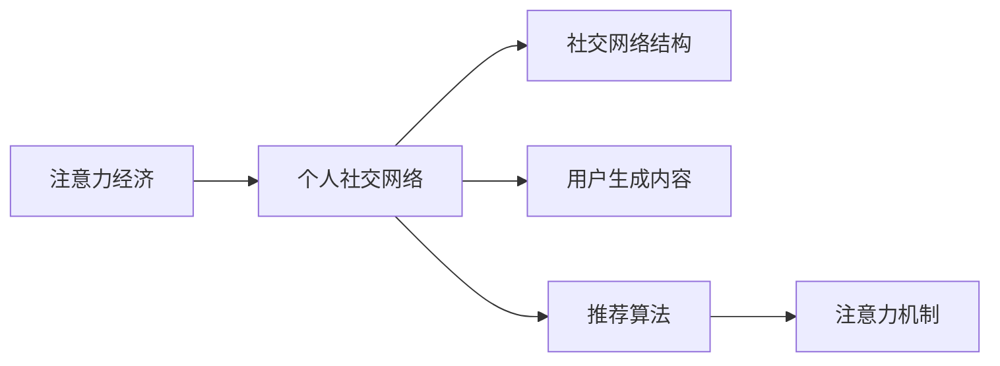

                 

# 注意力经济与个人社交网络的重构

## 1. 背景介绍

在互联网时代，信息的爆炸和传播方式的变迁，催生了“注意力经济”（Attention Economy）这一全新的经济形态。注意力，作为稀缺资源，其价值正在被广泛挖掘。个人社交网络（Personal Social Networks, PSNs）作为注意力经济的主要载体，其重构变得至关重要。

在早期，社交网络主要以信息共享为主，注重内容的广度与传播效率。但随着社交网络的成熟，其商业化倾向逐渐显现，用户生成内容（UGC）成为核心的商业模式。用户生成的内容不仅要有广泛的传播度，还要能够吸引和维持用户的注意力，这便是注意力经济的核心。

本文将深入探讨注意力经济与个人社交网络的互动关系，分析当前个人社交网络结构及存在的问题，并提出基于注意力机制的重构方案，以期为用户、平台和广告商三方创造更多价值。

## 2. 核心概念与联系

### 2.1 核心概念概述

1. **注意力经济（Attention Economy）**：基于注意力资源的分配和获取，通过信息的聚合和分发来创造价值的一种经济形态。

2. **个人社交网络（Personal Social Networks, PSNs）**：以个体为中心构建的网络，用户之间通过互动（如点赞、评论、分享等）进行信息传播与交互，是社交媒体的主要形式。

3. **社交网络结构（Social Network Structure）**：用户之间的连接关系，通常表示为图模型，描述信息的传播路径和扩散趋势。

4. **用户生成内容（User Generated Content, UGC）**：用户主动参与生产的内容，如博客文章、图片、视频等，是社交网络的核心资产。

5. **推荐算法（Recommendation Algorithms）**：利用数据挖掘与机器学习技术，根据用户行为和偏好提供个性化推荐，优化用户体验和平台收益。

6. **注意力机制（Attention Mechanism）**：一种动态计算资源分配的机制，用于识别和优先处理对用户更有价值的信息。

### 2.2 核心概念原理和架构的 Mermaid 流程图



## 3. 核心算法原理 & 具体操作步骤

### 3.1 算法原理概述

注意力经济的核心在于信息的有效传播和用户注意力的高效利用。在个人社交网络中，注意力机制（Attention Mechanism）是实现这一目标的重要手段。

注意力机制通过计算用户对内容的关注程度，动态调整内容的展示顺序和推荐策略。其核心思想是：根据用户的历史行为、当前状态和实时反馈，动态地计算每个内容对用户的“注意力权重”，优先展示高权重的内容。

### 3.2 算法步骤详解

1. **用户行为数据收集**：收集用户与内容的交互数据，如点赞、评论、分享等行为，以及内容的基本属性（如发布时间、作者、话题标签等）。

2. **注意力权重计算**：根据收集到的数据，使用注意力模型计算每个内容对用户的注意力权重。权重值越高，表示内容对用户的吸引力越强。

3. **内容排序和推荐**：将内容按照注意力权重进行排序，并将高权重的内容推荐给用户。排序和推荐的算法可以根据具体场景进行调整。

### 3.3 算法优缺点

**优点**：
- 动态调整，根据用户行为实时更新，提升用户体验。
- 优化内容分发，提高内容的曝光度和转化率。
- 个性化推荐，增加用户粘性，提升平台收益。

**缺点**：
- 计算复杂度较高，需要高效的算法和数据处理能力。
- 用户隐私保护和数据安全需进一步加强。
- 过度个性化可能导致信息茧房，限制用户的认知多样性。

### 3.4 算法应用领域

注意力机制在个人社交网络中具有广泛的应用前景，包括但不限于以下几个方面：

1. **新闻推荐**：根据用户的历史阅读记录，推荐用户可能感兴趣的新闻。
2. **广告投放**：根据用户的关注点，优化广告的展示位置和内容，提高广告点击率和转化率。
3. **内容创作激励**：根据内容的关注度，激励优质内容的创作和传播。
4. **社交网络治理**：识别和剔除虚假信息，维护平台的健康生态。
5. **用户行为分析**：通过分析用户的行为模式，优化用户体验和平台策略。

## 4. 数学模型和公式 & 详细讲解 & 举例说明

### 4.1 数学模型构建

注意力权重计算的核心模型为注意力机制，通常表示为：

$$
Attention(Q, K, V) = \frac{e^{At(Q, K)}}{\Sigma_{i=1}^{n}e^{At(Q, K_i)}}
$$

其中，$Q$ 表示查询向量，$K$ 表示键向量，$V$ 表示值向量，$At$ 为注意力函数，$\Sigma$ 为向量内积。

### 4.2 公式推导过程

以一个简单的注意力计算为例，推导注意力权重公式：

$$
Attention(Q, K, V) = \frac{e^{\text{dot}(Q, K)}}{\Sigma_{i=1}^{n}e^{\text{dot}(Q, K_i)}}
$$

其中，$\text{dot}(Q, K)$ 表示查询向量 $Q$ 与键向量 $K$ 的内积。

### 4.3 案例分析与讲解

以Twitter上的推文推荐为例，分析注意力机制的应用：

1. **数据收集**：收集用户的历史互动数据（点赞、转发、评论）和推文的基本信息（作者、时间、内容等）。

2. **注意力计算**：计算用户对每条推文的注意力权重。

3. **推荐排序**：根据权重排序，将高权重的推文推荐给用户。

## 5. 项目实践：代码实例和详细解释说明

### 5.1 开发环境搭建

1. 安装Python和相关库，如NumPy、Pandas、Scikit-learn等。
2. 搭建数据集和模型训练环境，如使用TensorFlow或PyTorch框架。
3. 搭建Web服务器，实现实时推荐和互动数据的收集。

### 5.2 源代码详细实现

以基于TensorFlow的推荐系统为例，代码实现步骤如下：

1. 数据预处理，将用户和内容数据进行清洗和转换。
2. 模型训练，使用注意力机制进行推文推荐模型的训练。
3. 实时推荐，搭建Web服务器，实现动态推荐和用户互动数据的收集。

```python
import tensorflow as tf
from tensorflow.keras.layers import Input, Dense, Dot
from tensorflow.keras.models import Model

# 定义输入层
user_input = Input(shape=(n_users,), name='user')
content_input = Input(shape=(n_contents,), name='content')

# 计算注意力权重
attention = Dot(axes=[2, 1])([user_input, content_input])

# 定义输出层
output = Dense(n_topics, activation='softmax')(attention)

# 定义模型
model = Model(inputs=[user_input, content_input], outputs=output)
model.compile(optimizer='adam', loss='categorical_crossentropy')
```

### 5.3 代码解读与分析

代码实现中，我们使用TensorFlow搭建了一个简单的注意力推荐模型。该模型包括用户输入、内容输入和注意力计算三个部分，最终输出注意力权重。

1. **用户输入和内容输入**：定义输入层，表示用户和内容的特征向量。
2. **注意力计算**：使用点积计算用户和内容的内积，得到注意力权重。
3. **输出层**：将注意力权重进行softmax操作，得到用户对每个内容的注意力权重。

通过这一简单模型，我们可以看到，注意力机制的基本思想是将用户的注意力动态分配给不同的内容，实现个性化推荐。

### 5.4 运行结果展示

运行模型后，可以得到用户对每个内容的注意力权重。通过这些权重，我们可以实现个性化推荐，提升用户的互动体验和平台的收益。

## 6. 实际应用场景

### 6.1 新闻推荐

在新闻推荐场景中，注意力机制可以根据用户的历史阅读记录和兴趣标签，动态调整内容的展示顺序，推荐用户可能感兴趣的新闻。

### 6.2 广告投放

在广告投放场景中，注意力机制可以根据用户的关注点，优化广告的展示位置和内容，提高广告点击率和转化率。

### 6.3 内容创作激励

在内容创作激励场景中，注意力机制可以识别和推荐高质量的内容，激励优质内容的创作和传播。

### 6.4 社交网络治理

在社交网络治理场景中，注意力机制可以识别和剔除虚假信息，维护平台的健康生态。

### 6.5 用户行为分析

在用户行为分析场景中，注意力机制可以分析用户的行为模式，优化用户体验和平台策略。

## 7. 工具和资源推荐

### 7.1 学习资源推荐

1. **深度学习与NLP课程**：如Coursera上的《深度学习与自然语言处理》课程，帮助理解注意力机制的基本原理和应用。
2. **注意力机制论文**：如《Attention is All You Need》和《Self-Attention with Transformer》，深入了解注意力机制的理论基础和实际应用。
3. **推荐系统资源**：如Kaggle上的推荐系统竞赛，实践注意力机制在推荐系统中的应用。

### 7.2 开发工具推荐

1. **TensorFlow和PyTorch**：主流的深度学习框架，支持高效的模型训练和推理。
2. **Scikit-learn**：用于数据预处理和模型训练的工具库。
3. **NLTK和SpaCy**：自然语言处理工具包，支持分词、词性标注等基础任务。

### 7.3 相关论文推荐

1. **Attention is All You Need**：提出Transformer模型，引入注意力机制，开启深度学习新范式。
2. **The Transformer Architectures for Sequence-to-Sequence Learning**：详细阐述注意力机制在序列到序列学习中的应用。
3. **Neural Machine Translation by Jointly Learning to Align and Translate**：提出基于注意力机制的机器翻译模型，提升翻译质量。

## 8. 总结：未来发展趋势与挑战

### 8.1 研究成果总结

本文系统介绍了注意力经济与个人社交网络的互动关系，分析了当前社交网络结构及存在的问题，并提出了基于注意力机制的重构方案。文章重点探讨了注意力机制的基本原理、操作步骤和实际应用场景，并给出了详细的代码实现和运行结果展示。

### 8.2 未来发展趋势

1. **智能推荐系统的普及**：随着AI技术的发展，智能推荐系统将成为社交网络的核心竞争力。
2. **多模态数据融合**：融合文本、图像、视频等多模态数据，提升推荐的丰富性和多样性。
3. **注意力机制的深化**：引入更多注意力机制，如多头注意力、自注意力等，优化推荐效果。
4. **用户隐私保护**：加强用户隐私保护和数据安全，确保用户信息的安全性。

### 8.3 面临的挑战

1. **计算资源消耗**：注意力机制需要大量的计算资源，如何高效地实现注意力计算是关键。
2. **数据隐私保护**：在推荐过程中如何保护用户隐私，避免数据泄露。
3. **算法公平性**：确保算法的公平性和公正性，避免信息茧房和偏见。

### 8.4 研究展望

1. **多任务学习**：引入多任务学习，优化模型在多个任务上的表现。
2. **联邦学习**：通过联邦学习技术，分散训练和模型更新，保护用户隐私。
3. **可解释性研究**：增强算法的可解释性，让用户理解推荐逻辑。

## 9. 附录：常见问题与解答

**Q1：注意力机制的计算复杂度较高，如何解决？**

A: 可以通过以下方法优化计算复杂度：
- 使用预计算矩阵，减少计算次数。
- 并行计算，利用GPU/TPU等硬件加速。
- 使用分布式系统，分散计算负担。

**Q2：如何防止信息茧房？**

A: 可以采用以下方法：
- 引入多样性约束，限制单一内容的展示次数。
- 引入噪声数据，打破用户的固定认知。
- 定期更换推荐算法，防止算法固化。

**Q3：如何确保推荐系统的公平性？**

A: 可以采用以下方法：
- 引入公平性约束，限制偏见和歧视。
- 定期进行模型评估和调整，确保公平性。
- 增加用户反馈机制，实时调整推荐策略。

通过本文的系统梳理，可以看到，注意力经济与个人社交网络的互动关系日益紧密，基于注意力机制的重构方案具有广阔的应用前景。随着AI技术的不断进步，我们期待注意力经济和社交网络的重构能够为各方创造更多价值，实现人类认知智能的全面提升。

