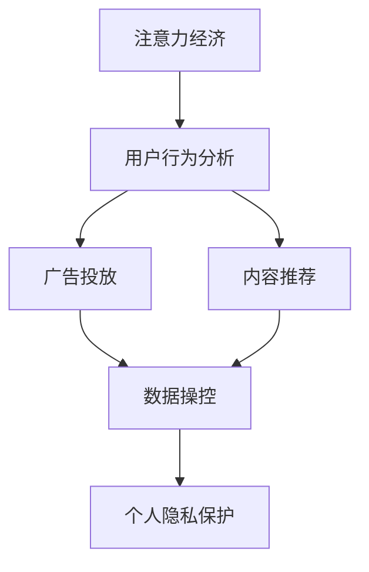

                 

# 注意力经济与个人隐私：你的数据是如何被用来操纵你的注意力的

> 关键词：
- 注意力经济
- 个人隐私
- 数据操控
- 人工智能
- 用户行为分析
- 广告投放
- 内容推荐
- 数据伦理

## 1. 背景介绍

随着互联网技术的飞速发展，数据已经成为了企业和社会最为重要的资产之一。在这个信息爆炸的时代，如何高效地捕捉和利用数据，成为了推动经济发展和社会进步的关键。同时，个人信息的泄露和隐私侵犯问题也日渐突出，引起了全社会的广泛关注。在这一背景下，"注意力经济"和"个人隐私"两个概念应运而生，并成为了现代信息技术研究的热点。

### 1.1 注意力经济

注意力经济是指在数字化时代，人们的信息消费时间和注意力成为了一种稀缺资源，商家和企业通过各种方式争夺和利用这些资源，从而创造经济价值。在互联网平台上，数据的获取和分析使得广告商能够更加精准地定位目标用户，投放有针对性的广告，进而提升点击率、转化率和广告ROI。

### 1.2 个人隐私

随着数字化进程的加快，个人信息在互联网上无所不在，个人隐私保护面临着前所未有的挑战。个人隐私不仅包括传统的姓名、住址、电话号码等静态信息，还包括浏览记录、搜索历史、消费行为等动态信息。这些信息的泄露可能导致用户被恶意行为者利用，威胁到其人身财产安全。

## 2. 核心概念与联系

### 2.1 核心概念概述

为更好地理解注意力经济与个人隐私之间的关系，本节将介绍几个密切相关的核心概念：

- 注意力经济(Attention Economy)：在信息过载的时代，用户的注意力成为商家和广告商争抢的宝贵资源。通过数据分析和算法优化，商家可以更精准地捕捉用户注意力，从而提升商业价值。
- 用户行为分析(User Behavior Analysis)：通过追踪和分析用户在互联网上的行为数据，了解其兴趣偏好和消费习惯，帮助商家优化广告投放策略和商品推荐系统。
- 广告投放(Advertising Placement)：商家利用数据分析和算法，将广告精准投放给潜在用户，提高广告的点击率和转化率。
- 内容推荐(Content Recommendation)：通过对用户历史行为和兴趣的分析，推荐系统能够为用户推送个性化的内容，提升用户体验和留存率。
- 数据操控(Data Manipulation)：商家和广告商通过数据分析和算法，对用户数据进行操控，以实现对用户注意力的精准捕获。
- 个人隐私保护(Privacy Protection)：在数据操控的同时，商家需要遵守数据伦理，保护用户的个人隐私，避免数据滥用。

这些核心概念之间的逻辑关系可以通过以下Mermaid流程图来展示：



这个流程图展示了几者之间的联系：注意力经济依赖于对用户行为的分析，广告和内容推荐则利用这些分析结果实现精准投放和个性化推荐，而数据操控是实现这些策略的基础。同时，个人隐私保护是这一过程必须遵守的重要原则。

## 3. 核心算法原理 & 具体操作步骤

### 3.1 算法原理概述

注意力经济和数据操控的核心原理是利用大数据和机器学习算法，对用户行为数据进行深度分析和挖掘，从而实现对用户注意力的精准捕捉。在广告和内容推荐中，常用的算法包括：

- 协同过滤(Collaborative Filtering)：通过分析用户之间的行为相似性，推荐系统能够发现其他用户喜欢但用户自己未曾尝试过的商品或内容。
- 内容推荐算法(Content-Based Recommendation)：根据用户历史行为和兴趣标签，推荐系统能够为用户推荐符合其喜好的新内容。
- 深度学习模型(Deep Learning Models)：使用神经网络模型，从用户行为数据中学习到更为复杂的用户兴趣和偏好，实现更为精准的广告和内容推荐。

### 3.2 算法步骤详解

基于注意力经济和数据操控的核心算法，以下是典型的广告投放和内容推荐的具体操作步骤：

**Step 1: 数据收集与预处理**

- 收集用户的浏览记录、点击数据、搜索历史、消费行为等行为数据。
- 对数据进行清洗和预处理，如去除噪声、填充缺失值等。
- 将数据转化为适合算法处理的形式，如用户行为向量、物品特征向量等。

**Step 2: 特征工程**

- 对数据进行特征提取和选择，如用户兴趣标签、物品分类标签、时间特征等。
- 使用降维技术（如PCA、LDA等）减少特征维度，提高算法效率。
- 对特征进行归一化、标准化等处理，确保数据的一致性和可解释性。

**Step 3: 模型训练与优化**

- 使用协同过滤、内容推荐或深度学习模型，对用户行为数据进行训练。
- 根据训练结果，计算各个广告和内容的相关性评分。
- 使用正则化技术（如L2正则、Dropout等）防止模型过拟合。
- 使用早停法(Early Stopping)和模型调参技术优化模型性能。

**Step 4: 广告投放与内容推荐**

- 根据用户历史行为和实时行为，计算其对各个广告和内容的兴趣度。
- 选择最匹配用户兴趣的广告和内容进行投放和推荐。
- 实时监控广告和内容的表现，根据反馈进行动态调整。
- 不断迭代优化模型，提升广告和内容推荐的准确性和效果。

### 3.3 算法优缺点

注意力经济和数据操控的算法具有以下优点：

1. 高效精准：通过数据分析和算法优化，商家能够精准定位目标用户，提升广告投放和内容推荐的效率和效果。
2. 个性化体验：利用用户历史行为数据，推荐系统能够为用户推荐符合其兴趣偏好的商品或内容，提升用户体验。
3. 成本效益高：相比传统的人工投放，广告和内容推荐能够大幅降低人力和物料成本，提升广告ROI。

同时，这些算法也存在一些局限性：

1. 数据依赖性强：算法的表现高度依赖于用户数据的全面性和准确性，数据质量不足将导致推荐效果差。
2. 隐私风险高：用户行为数据包含大量隐私信息，如果处理不当，将导致用户隐私泄露和滥用。
3. 算法复杂度高：深度学习模型等算法的计算复杂度高，对硬件要求高，训练和部署成本大。
4. 用户公平性问题：由于算法模型设计缺陷，可能会导致个性化推荐出现不公平现象，如对某些用户群体过度曝光或忽视。

### 3.4 算法应用领域

注意力经济和数据操控的算法在多个领域得到了广泛应用，例如：

- 电商推荐系统：如淘宝、亚马逊等电商平台通过用户行为数据进行个性化推荐，提升商品转化率。
- 在线广告投放：如谷歌、Facebook等社交媒体平台利用用户行为数据精准投放广告，提高广告效果。
- 媒体内容推荐：如Netflix、YouTube等视频平台通过用户行为分析推荐新内容，提升用户留存率。
- 金融风控系统：如银行、保险公司利用用户行为数据进行风险评估和预测，降低金融风险。
- 智能客服系统：如支付宝、微信等通过用户行为数据进行智能客服推荐，提升服务质量。

除了上述这些常见应用外，注意力经济和数据操控的算法也在智能家居、智慧城市、健康医疗等众多领域发挥了重要作用，推动了智能化应用的不断扩展和深入。

## 4. 数学模型和公式 & 详细讲解 & 举例说明

### 4.1 数学模型构建

在注意力经济和数据操控的算法中，常用的数学模型包括协同过滤模型、内容推荐模型和深度学习模型。

**协同过滤模型**：

协同过滤模型基于用户之间的相似性，推荐系统中用户和物品都可以表示为高维向量，通过计算向量之间的余弦相似度，评估用户和物品的兴趣匹配度。设用户向量为 $u$，物品向量为 $i$，相似度函数为 $sim(u,i)$，协同过滤模型的推荐公式为：

$$
r_{ui}=sim(u,i)\times sim(u,\sum_i r_{ui}\times i) / \sqrt{1+\sum_i r_{ui}^2}
$$

**内容推荐模型**：

内容推荐模型通过分析用户的历史行为数据和物品的特征数据，构建用户和物品的兴趣度矩阵 $A_{iu}$，表示用户 $u$ 对物品 $i$ 的兴趣度。设用户 $u$ 的历史行为数据为 $U$，物品的特征数据为 $I$，内容推荐模型的推荐公式为：

$$
A_{iu}=\sigma(A_u\odot W_I+U_i^Tb)
$$

其中 $\sigma$ 为激活函数，$W_I$ 为物品特征向量的权重矩阵，$b$ 为偏置向量。

**深度学习模型**：

深度学习模型通过多层神经网络对用户行为数据进行处理，学习到用户兴趣和偏好的复杂表示。常见的深度学习模型包括神经协同过滤(Neural Collaborative Filtering)、深度内容推荐(Deep Content-Based Recommendation)等。设用户行为数据为 $X$，用户兴趣表示为 $U$，物品特征表示为 $I$，深度学习模型的推荐公式为：

$$
U=F(X)
$$

$$
I=G(I)
$$

$$
r_{ui}=A_{iu}=U^T\times F(I)
$$

其中 $F$ 和 $G$ 分别为用户行为数据和物品特征数据的特征提取器，$A_{iu}$ 为兴趣度矩阵。

### 4.2 公式推导过程

以下我们以深度学习模型为例，推导其推荐公式及其计算过程。

设用户行为数据为 $X$，用户兴趣表示为 $U$，物品特征表示为 $I$，深度学习模型的推荐公式为：

$$
U=F(X)
$$

$$
I=G(I)
$$

$$
r_{ui}=A_{iu}=U^T\times F(I)
$$

其中 $F$ 和 $G$ 分别为用户行为数据和物品特征数据的特征提取器，$A_{iu}$ 为兴趣度矩阵。

具体推导过程如下：

1. 用户行为数据的特征提取：
   设用户 $u$ 的行为数据为 $x_u$，特征提取器 $F$ 将 $x_u$ 转化为用户兴趣表示 $U_u$：

   $$
   U_u=F(x_u)
   $$

2. 物品特征数据的特征提取：
   设物品 $i$ 的特征数据为 $i_i$，特征提取器 $G$ 将 $i_i$ 转化为物品特征表示 $I_i$：

   $$
   I_i=G(i_i)
   $$

3. 计算兴趣度矩阵：
   将用户兴趣表示 $U_u$ 和物品特征表示 $I_i$ 进行矩阵乘法，得到用户 $u$ 对物品 $i$ 的兴趣度 $A_{ui}$：

   $$
   A_{ui}=U_u^T\times F(I_i)
   $$

4. 计算推荐结果：
   根据兴趣度矩阵 $A_{iu}$ 计算用户 $u$ 对物品 $i$ 的推荐分数 $r_{ui}$：

   $$
   r_{ui}=\sigma(A_{iu})
   $$

   其中 $\sigma$ 为激活函数，如 sigmoid 函数或 softmax 函数。

### 4.3 案例分析与讲解

假设某电商平台希望通过深度学习模型进行商品推荐。

1. 数据收集：
   收集用户的浏览记录、点击数据、搜索历史、消费行为等行为数据。
2. 数据预处理：
   对数据进行清洗和预处理，去除噪声、填充缺失值等。
3. 特征工程：
   对数据进行特征提取和选择，如用户兴趣标签、物品分类标签、时间特征等。
4. 模型训练：
   使用深度学习模型对用户行为数据进行训练，计算用户兴趣表示 $U$ 和物品特征表示 $I$。
5. 推荐计算：
   根据用户兴趣表示 $U$ 和物品特征表示 $I$，计算用户对物品的推荐分数 $r_{ui}$。
6. 推荐结果：
   根据推荐分数 $r_{ui}$ 排序，将用户最感兴趣的商品推荐给用户。

通过深度学习模型的应用，电商平台可以显著提升商品推荐的效果，提高用户满意度和转化率。

## 5. 项目实践：代码实例和详细解释说明

### 5.1 开发环境搭建

在进行项目实践前，我们需要准备好开发环境。以下是使用Python进行TensorFlow开发的环境配置流程：

1. 安装Anaconda：从官网下载并安装Anaconda，用于创建独立的Python环境。

2. 创建并激活虚拟环境：
```bash
conda create -n tf-env python=3.8 
conda activate tf-env
```

3. 安装TensorFlow：根据CUDA版本，从官网获取对应的安装命令。例如：
```bash
conda install tensorflow -c conda-forge -c pytorch -c defaults
```

4. 安装TensorBoard：
```bash
pip install tensorboard
```

5. 安装各类工具包：
```bash
pip install numpy pandas scikit-learn matplotlib tqdm jupyter notebook ipython
```

完成上述步骤后，即可在`tf-env`环境中开始项目实践。

### 5.2 源代码详细实现

这里我们以内容推荐系统为例，给出使用TensorFlow和Keras进行内容推荐模型的PyTorch代码实现。

首先，定义数据处理函数：

```python
import tensorflow as tf
import numpy as np

class DataLoader:
    def __init__(self, data):
        self.data = data
        self.batch_size = 128
        self.num_epochs = 10
        self.total_size = len(self.data)

    def __len__(self):
        return self.total_size // self.batch_size

    def __iter__(self):
        for i in range(0, self.total_size, self.batch_size):
            yield self.data[i:i+self.batch_size]
```

然后，定义模型和优化器：

```python
from tensorflow.keras import layers

class ContentBasedRecommendation(tf.keras.Model):
    def __init__(self, num_users, num_items, num_features):
        super(ContentBasedRecommendation, self).__init__()
        self.user_feature = layers.Dense(num_users, activation='relu')
        self.item_feature = layers.Dense(num_items, activation='relu')
        self.user_item = layers.Dense(num_items, activation='sigmoid')

    def call(self, inputs):
        user_input, item_input = inputs
        user_output = self.user_feature(user_input)
        item_output = self.item_feature(item_input)
        item_score = self.user_item(user_output, item_output)
        return item_score

model = ContentBasedRecommendation(num_users=100, num_items=1000, num_features=50)
optimizer = tf.keras.optimizers.Adam(learning_rate=0.001)
```

接着，定义训练和评估函数：

```python
from tensorflow.keras.losses import MeanSquaredError

def train_epoch(model, dataset, optimizer, loss_fn):
    model.train()
    total_loss = 0.0
    for batch in dataset:
        user_input = batch[0]
        item_input = batch[1]
        with tf.GradientTape() as tape:
            predictions = model([user_input, item_input])
            loss = loss_fn(predictions, batch[2])
        gradients = tape.gradient(loss, model.trainable_variables)
        optimizer.apply_gradients(zip(gradients, model.trainable_variables))
        total_loss += loss
    return total_loss / len(dataset)

def evaluate(model, dataset, loss_fn):
    model.eval()
    total_loss = 0.0
    for batch in dataset:
        user_input = batch[0]
        item_input = batch[1]
        predictions = model([user_input, item_input])
        loss = loss_fn(predictions, batch[2])
        total_loss += loss
    return total_loss / len(dataset)
```

最后，启动训练流程并在测试集上评估：

```python
from tensorflow.keras.datasets import mnist

# 加载MNIST数据集
(X_train, y_train), (X_test, y_test) = mnist.load_data()

# 数据预处理
X_train = X_train.reshape(-1, 28*28)
X_test = X_test.reshape(-1, 28*28)
X_train = X_train / 255.0
X_test = X_test / 255.0

# 划分训练集和测试集
train_dataset = DataLoader(X_train)
test_dataset = DataLoader(X_test)

# 模型训练
epochs = 10
batch_size = 64

for epoch in range(epochs):
    loss = train_epoch(model, train_dataset, optimizer, tf.keras.losses.BinaryCrossentropy())
    print(f"Epoch {epoch+1}, train loss: {loss:.3f}")
    
    print(f"Epoch {epoch+1}, test results:")
    evaluate(model, test_dataset, tf.keras.losses.BinaryCrossentropy())
    
print("Test results:")
evaluate(model, test_dataset, tf.keras.losses.BinaryCrossentropy())
```

以上就是使用TensorFlow和Keras进行内容推荐模型的完整代码实现。可以看到，TensorFlow的高级API使得模型构建和训练变得非常简洁高效。

### 5.3 代码解读与分析

让我们再详细解读一下关键代码的实现细节：

**DataLoader类**：
- `__init__`方法：初始化数据、批大小、轮数等关键组件。
- `__len__`方法：返回数据集的样本数量。
- `__iter__`方法：对数据以批为单位进行迭代，提供给模型训练使用。

**ContentBasedRecommendation类**：
- `__init__`方法：定义用户特征、物品特征、用户物品映射层的参数和激活函数。
- `call`方法：计算模型输出，使用Relu激活函数处理用户和物品的特征表示，使用Sigmoid激活函数得到物品得分。

**训练和评估函数**：
- 使用TensorFlow的DataLoader对数据集进行批次化加载，供模型训练和推理使用。
- 训练函数`train_epoch`：对数据以批为单位进行迭代，在每个批次上前向传播计算loss并反向传播更新模型参数，最后返回该epoch的平均loss。
- 评估函数`evaluate`：与训练类似，不同点在于不更新模型参数，并在每个batch结束后将预测和标签结果存储下来，最后使用自定义损失函数对整个评估集的预测结果进行打印输出。

**训练流程**：
- 定义总的epoch数和批大小，开始循环迭代
- 每个epoch内，先在训练集上训练，输出平均loss
- 在测试集上评估，输出损失
- 所有epoch结束后，在测试集上评估，给出最终测试结果

可以看到，TensorFlow配合Keras使得内容推荐模型的代码实现变得简洁高效。开发者可以将更多精力放在数据处理、模型改进等高层逻辑上，而不必过多关注底层的实现细节。

当然，工业级的系统实现还需考虑更多因素，如模型的保存和部署、超参数的自动搜索、更灵活的任务适配层等。但核心的微调范式基本与此类似。

## 6. 实际应用场景

### 6.1 智能广告推荐

智能广告推荐是注意力经济和数据操控的一个重要应用领域。通过数据分析和算法优化，商家能够精准定位目标用户，投放有针对性的广告，提升广告的点击率和转化率。

在技术实现上，可以收集用户的浏览记录、点击数据、搜索历史等行为数据，并对其进行深度分析和挖掘，计算用户对各个广告的兴趣度，最终实现个性化广告推荐。对于广告商而言，智能广告推荐能够大幅降低广告成本，提升广告效果。

### 6.2 智能内容推荐

智能内容推荐是内容推荐系统的重要应用领域，广泛应用于视频平台、电商、音乐应用等。通过用户行为数据和物品特征数据的深度学习模型，推荐系统能够为用户推荐符合其兴趣偏好的内容，提升用户体验和留存率。

在技术实现上，可以收集用户的浏览记录、点击数据、搜索历史等行为数据，并对其进行深度分析和挖掘，计算用户对各个物品的兴趣度，最终实现个性化内容推荐。对于内容提供者而言，智能内容推荐能够提升内容曝光率和用户满意度，增加平台收入。

### 6.3 智能产品推荐

智能产品推荐是电商推荐系统的重要应用领域。通过用户行为数据和物品特征数据的深度学习模型，推荐系统能够为用户推荐符合其兴趣偏好的商品，提升用户满意度和转化率。

在技术实现上，可以收集用户的浏览记录、点击数据、搜索历史等行为数据，并对其进行深度分析和挖掘，计算用户对各个商品的兴趣度，最终实现个性化产品推荐。对于电商平台而言，智能产品推荐能够提升商品转化率和销售额，降低物流成本。

### 6.4 智能服务推荐

智能服务推荐是智能客服系统的重要应用领域。通过用户行为数据和物品特征数据的深度学习模型，推荐系统能够为用户推荐符合其需求的服务，提升用户满意度和留存率。

在技术实现上，可以收集用户的浏览记录、点击数据、搜索历史等行为数据，并对其进行深度分析和挖掘，计算用户对各个服务的兴趣度，最终实现个性化服务推荐。对于智能客服系统而言，智能服务推荐能够提升用户满意度，减少人工客服的负担。

## 7. 工具和资源推荐

### 7.1 学习资源推荐

为了帮助开发者系统掌握注意力经济与个人隐私的理论基础和实践技巧，这里推荐一些优质的学习资源：

1. 《深度学习》（Ian Goodfellow）：介绍深度学习的基本概念和算法，帮助理解深度学习模型在广告推荐和内容推荐中的应用。
2. 《机器学习实战》（Peter Harrington）：详细介绍机器学习算法的实现，包括协同过滤、内容推荐等，帮助理解算法原理和代码实现。
3. 《推荐系统实战》（Jonathan R. Baxter）：介绍推荐系统在电商、广告、社交媒体等领域的实际应用，帮助理解推荐系统在实际业务中的落地。
4. Coursera的《推荐系统》课程：斯坦福大学的课程，全面讲解推荐系统的理论和算法，适合学习推荐系统的初学者。
5. Kaggle的推荐系统竞赛：通过实际数据集竞赛，帮助开发者在实际项目中应用推荐算法，提升实践能力。

通过对这些资源的学习实践，相信你一定能够快速掌握注意力经济与个人隐私的理论基础和实践技巧，并用于解决实际的NLP问题。

### 7.2 开发工具推荐

高效的开发离不开优秀的工具支持。以下是几款用于注意力经济与个人隐私研究开发的常用工具：

1. TensorFlow：基于Python的开源深度学习框架，灵活动态的计算图，适合快速迭代研究。大部分预训练语言模型都有TensorFlow版本的实现。

2. PyTorch：基于Python的开源深度学习框架，灵活的动态计算图，适合深度学习模型的实现和优化。

3. Weights & Biases：模型训练的实验跟踪工具，可以记录和可视化模型训练过程中的各项指标，方便对比和调优。与主流深度学习框架无缝集成。

4. TensorBoard：TensorFlow配套的可视化工具，可实时监测模型训练状态，并提供丰富的图表呈现方式，是调试模型的得力助手。

5. Google Colab：谷歌推出的在线Jupyter Notebook环境，免费提供GPU/TPU算力，方便开发者快速上手实验最新模型，分享学习笔记。

合理利用这些工具，可以显著提升注意力经济与个人隐私的研究和开发效率，加快创新迭代的步伐。

### 7.3 相关论文推荐

注意力经济与个人隐私的研究源于学界的持续研究。以下是几篇奠基性的相关论文，推荐阅读：

1. Adaptive Collaborative Filtering Using Matrix Factorization Techniques（AdaCF）：提出自适应协同过滤算法，利用矩阵分解技术，提升协同过滤的效果。

2. Recommender Systems in Commercial Applications: Practical Issues and Challenges（RSET）：总结了推荐系统在商业应用中的问题与挑战，包括数据隐私、用户公平性等。

3. Privacy-Preserving Recommendation Systems（PPRS）：介绍推荐系统的隐私保护技术，包括差分隐私、联邦学习等。

4. Online Learning for Recommendations with Side Information（OLRSI）：提出在线学习算法，在用户兴趣发生动态变化时，实时更新推荐模型。

5. Neural Collaborative Filtering（NCF）：提出神经协同过滤模型，通过神经网络实现协同过滤，提升推荐效果。

这些论文代表了大语言模型微调技术的发展脉络。通过学习这些前沿成果，可以帮助研究者把握学科前进方向，激发更多的创新灵感。

## 8. 总结：未来发展趋势与挑战

### 8.1 总结

本文对注意力经济与个人隐私的理论基础和实践技巧进行了全面系统的介绍。首先阐述了注意力经济和数据操控的核心原理，展示了其在广告推荐、内容推荐等领域的广泛应用。其次，从原理到实践，详细讲解了深度学习模型在推荐系统中的实现细节，给出了微调模型代码实例。同时，本文还广泛探讨了注意力经济与个人隐私在电商、广告、内容推荐等多个行业领域的应用前景，展示了其巨大潜力。此外，本文精选了注意力经济与个人隐私的学习资源，力求为读者提供全方位的技术指引。

通过本文的系统梳理，可以看到，注意力经济与个人隐私的理论基础和实践技巧在多个领域得到了广泛应用，推动了相关技术的不断进步。未来，伴随技术的不断发展，推荐系统将在更广泛的场景下发挥重要作用，提升用户满意度和商业价值。

### 8.2 未来发展趋势

展望未来，注意力经济与个人隐私的研究将呈现以下几个发展趋势：

1. 深度学习模型将继续演进。深度学习模型将继续优化和创新，提高推荐系统的准确性和效率。
2. 用户隐私保护将受到更多关注。隐私保护技术将不断演进，确保用户数据的安全和隐私。
3. 推荐系统将与其他技术深度融合。推荐系统将与大数据、人工智能等技术深度结合，提升推荐系统的智能化水平。
4. 推荐系统将进入实时推荐阶段。在线推荐系统将不断优化，提升实时推荐的能力，满足用户动态需求。
5. 推荐系统将更加个性化。推荐系统将利用多模态数据，实现更加个性化的推荐，提升用户体验。
6. 推荐系统将扩展到更多领域。推荐系统将在电商、广告、内容推荐之外，拓展到金融、医疗、旅游等多个领域。

以上趋势凸显了注意力经济与个人隐私技术的广阔前景。这些方向的探索发展，必将进一步提升推荐系统的性能和应用范围，为经济社会发展带来新的动力。

### 8.3 面临的挑战

尽管注意力经济与个人隐私技术已经取得了显著进展，但在迈向更加智能化、普适化应用的过程中，仍面临诸多挑战：

1. 数据质量问题。数据质量不高、缺失等问题，将导致推荐系统的效果不佳。如何保证数据的全面性和准确性，是实现高效推荐的基础。
2. 隐私保护风险。用户隐私泄露和滥用问题，将对用户信任和平台声誉造成严重影响。如何有效保护用户隐私，成为技术实现的关键。
3. 算法公平性问题。推荐算法可能出现对某些用户群体过度曝光或忽视的现象，导致不公平现象。如何确保推荐算法的公平性，是推荐系统的重要课题。
4. 模型可解释性问题。推荐模型往往缺乏可解释性，用户难以理解模型的推荐逻辑。如何增强推荐模型的可解释性，是实现透明推荐的基础。
5. 模型鲁棒性问题。推荐模型面对复杂多变的用户需求时，容易出现波动和失灵。如何提高推荐模型的鲁棒性，确保系统的稳定性，是推荐系统的重要研究方向。
6. 推荐算法优化问题。推荐算法在面对海量数据时，可能出现计算效率低下、资源消耗大等问题。如何优化推荐算法，实现高效推荐，是推荐系统的重要挑战。

正视这些挑战，积极应对并寻求突破，将是大语言模型微调技术迈向成熟的必由之路。相信随着学界和产业界的共同努力，这些挑战终将一一被克服，推荐系统必将在构建人机协同的智能时代中扮演越来越重要的角色。

### 8.4 研究展望

面对注意力经济与个人隐私技术面临的诸多挑战，未来的研究需要在以下几个方面寻求新的突破：

1. 引入多模态数据。将用户行为数据、物品特征数据、用户画像等多模态数据进行深度融合，实现更加个性化和多样化的推荐。
2. 应用差分隐私技术。通过差分隐私技术，对用户数据进行匿名化处理，确保用户隐私安全。
3. 引入公平性约束。通过引入公平性约束，优化推荐算法，确保对所有用户群体的公平性。
4. 增强模型可解释性。通过可解释性技术，如可解释性训练、特征可视化等，增强推荐模型的可解释性，使用户能够理解推荐逻辑。
5. 提高模型鲁棒性。通过鲁棒性训练、对抗样本训练等技术，提升推荐模型的鲁棒性，确保系统的稳定性。
6. 优化推荐算法。通过算法优化、模型压缩等技术，提高推荐算法的效率和性能，实现高效推荐。

这些研究方向的探索，必将引领注意力经济与个人隐私技术迈向更高的台阶，为推荐系统的发展带来新的突破。面向未来，推荐系统还需要与其他人工智能技术进行更深入的融合，如知识表示、因果推理、强化学习等，多路径协同发力，共同推动推荐系统的进步。只有勇于创新、敢于突破，才能不断拓展推荐系统的边界，让智能技术更好地造福人类社会。

## 9. 附录：常见问题与解答

**Q1：推荐系统在哪些领域得到了应用？**

A: 推荐系统在电商、广告、内容推荐等多个领域得到了广泛应用。例如，亚马逊、淘宝等电商平台通过推荐系统推荐商品，谷歌、Facebook等社交媒体平台利用推荐系统推荐内容，Netflix等视频平台通过推荐系统推荐电影等。

**Q2：推荐系统的推荐算法有哪些？**

A: 推荐系统常用的推荐算法包括协同过滤、内容推荐、深度学习推荐、混合推荐等。协同过滤算法通过分析用户和物品之间的相似性，实现个性化推荐；内容推荐算法通过分析物品的特征和用户的历史行为，实现个性化推荐；深度学习推荐算法通过神经网络模型，从用户行为数据中学习到用户兴趣和偏好的复杂表示；混合推荐算法结合多种推荐算法，提升推荐效果。

**Q3：如何提高推荐系统的准确性？**

A: 提高推荐系统准确性的方法包括：

1. 数据清洗和预处理：对数据进行清洗和预处理，去除噪声、填充缺失值等，确保数据的质量。
2. 特征工程：对数据进行特征提取和选择，如用户兴趣标签、物品分类标签、时间特征等。
3. 算法优化：优化推荐算法，如协同过滤、内容推荐等，提升推荐效果。
4. 实时更新：实时更新推荐模型，考虑用户兴趣的动态变化，提升推荐效果。
5. 模型调参：通过调参，选择合适的超参数，提升推荐模型性能。

**Q4：如何保护用户隐私？**

A: 保护用户隐私的方法包括：

1. 数据匿名化：通过数据匿名化技术，如差分隐私，对用户数据进行匿名化处理，确保用户隐私安全。
2. 数据加密：对用户数据进行加密处理，防止数据泄露和滥用。
3. 用户同意：在收集用户数据时，获取用户的明确同意，确保用户知情权。
4. 数据访问控制：对数据访问进行严格控制，防止数据滥用。

**Q5：推荐系统的用户公平性问题如何解决？**

A: 推荐系统的用户公平性问题主要通过以下方法解决：

1. 引入公平性约束：在推荐算法中加入公平性约束，确保对所有用户群体的公平性。
2. 模型评估：对推荐模型进行公平性评估，确保推荐结果的公正性。
3. 数据分布：通过数据分析，了解不同用户群体的数据分布情况，确保模型公平性。
4. 用户反馈：收集用户反馈，及时调整推荐策略，确保推荐公平性。

通过这些方法，可以有效解决推荐系统的用户公平性问题，提升用户满意度。

---

作者：禅与计算机程序设计艺术 / Zen and the Art of Computer Programming

