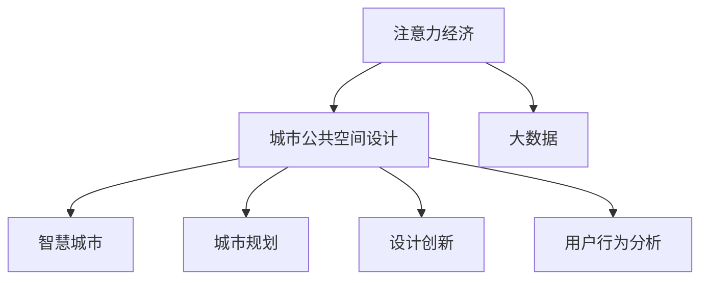

                 

# 注意力经济与城市公共空间设计的变革

> 关键词：注意力经济,城市公共空间设计,大数据,智慧城市,城市规划,设计创新,用户行为分析

## 1. 背景介绍

### 1.1 问题由来
随着数字经济的快速发展，注意力经济（Economy of Attention）成为了新的经济形态。大数据、云计算、人工智能等技术手段在各个领域的应用，使得数据成为一种关键的生产要素。尤其在城市公共空间设计领域，通过对用户行为和偏好的数据进行分析，可以更好地满足公众需求，优化空间使用，提升环境品质。

### 1.2 问题核心关键点
注意力经济与城市公共空间设计的结合，旨在通过数据分析和智能技术，优化城市公共空间的使用和设计。这种结合带来了两个关键问题：

1. **数据收集与处理**：如何有效收集和处理公共空间使用的数据，以便进行科学分析？
2. **设计创新与优化**：如何利用数据指导公共空间设计，提升用户体验和环境品质？

### 1.3 问题研究意义
研究注意力经济在城市公共空间设计中的应用，对于提升城市公共空间的利用效率和环境质量，改善市民生活体验，具有重要意义。通过对公共空间的使用数据进行深度分析，可以发现用户的真实需求和行为模式，为设计者提供科学依据，优化空间布局和功能设计，同时也有助于城市管理者做出更有效的公共空间规划和运营决策。

## 2. 核心概念与联系

### 2.1 核心概念概述

为了更好地理解注意力经济在城市公共空间设计中的应用，本节将介绍几个密切相关的核心概念：

- **注意力经济（Economy of Attention）**：指在信息爆炸的时代，用户注意力成为稀缺资源，能够吸引和维持用户注意力的内容和产品具有更高的价值。在城市公共空间设计中，通过设计能够吸引和维持用户注意力的空间，可以提高公共空间的使用效率和用户满意度。

- **城市公共空间设计**：包括城市广场、公园、街道等公共区域的设计，旨在创造宜人的环境，满足市民的休闲、社交、交通等需求。

- **大数据（Big Data）**：指规模庞大、类型繁多、速度极快的数据集，通过大数据分析可以揭示隐藏在海量数据中的模式和趋势。

- **智慧城市（Smart City）**：利用物联网、云计算、人工智能等技术，实现城市管理和服务的智能化，提升城市的运行效率和居民的生活质量。

- **城市规划（Urban Planning）**：通过科学合理的规划，对城市的布局、功能、基础设施等进行优化，提升城市的可持续发展和宜居性。

- **设计创新（Design Innovation）**：通过设计理念和技术的创新，提升公共空间的功能、美观和实用价值，满足不同用户的多样化需求。

- **用户行为分析（User Behavior Analysis）**：通过分析用户在公共空间中的行为数据，了解用户的偏好和需求，优化空间设计。

这些核心概念之间的逻辑关系可以通过以下Mermaid流程图来展示：



这个流程图展示了几大核心概念之间的相互关系：

1. 注意力经济和城市公共空间设计是整个研究的核心，通过吸引和维持用户的注意力，优化公共空间设计。
2. 大数据为城市公共空间设计的优化提供了数据支撑。
3. 智慧城市和城市规划是实现城市公共空间设计优化目标的技术手段。
4. 设计创新是提升公共空间使用效率和用户满意度的重要手段。
5. 用户行为分析是了解用户需求和优化设计的重要工具。

## 3. 核心算法原理 & 具体操作步骤

### 3.1 算法原理概述

注意力经济在城市公共空间设计中的应用，主要依赖于数据分析和智能技术。其核心算法原理如下：

- **数据收集与处理**：通过传感器、监控摄像头、社交媒体等渠道，收集公共空间的使用数据，如人流量、停留时间、行为轨迹等。
- **用户行为分析**：利用数据分析技术，对收集到的数据进行处理，揭示用户在公共空间中的行为模式和偏好。
- **设计优化**：根据用户行为分析的结果，调整和优化公共空间的设计，提升空间的功能和环境品质。

### 3.2 算法步骤详解

基于注意力经济的城市公共空间设计优化，一般包括以下几个关键步骤：

**Step 1: 数据收集与清洗**

- 通过传感器、监控摄像头、社交媒体等手段，收集公共空间的使用数据。
- 对数据进行预处理，包括去重、过滤、标准化等步骤，确保数据的质量和一致性。

**Step 2: 用户行为分析**

- 使用数据分析工具，如Python的Pandas、Scikit-learn等，对处理后的数据进行统计和可视化分析，揭示用户的行为模式和偏好。
- 常见的分析方法包括聚类分析、时间序列分析、关联规则分析等，可以揭示用户在不同时间段、不同区域的行为特征。

**Step 3: 设计优化**

- 根据用户行为分析的结果，设计公共空间的功能布局和环境配置。
- 使用设计创新工具，如AutoCAD、SketchUp等，进行空间建模和渲染。
- 通过模拟仿真工具，如Simulink、AnyLogic等，对设计方案进行评估和优化。

**Step 4: 测试与部署**

- 在实际环境中测试优化后的设计方案，评估其效果和可行性。
- 根据测试结果，进一步调整和优化设计方案。
- 将优化后的设计方案部署到公共空间中，进行长期监测和维护。

### 3.3 算法优缺点

基于注意力经济的城市公共空间设计优化，具有以下优点：

1. **数据驱动**：通过数据分析和智能技术，设计更加符合用户需求和行为习惯的空间，提高公共空间的使用效率和用户满意度。
2. **优化效率高**：利用数据驱动的设计优化，可以快速响应和调整，提升设计方案的灵活性和适应性。
3. **环境质量提升**：通过优化公共空间的设计，可以提升环境品质，创造宜人的公共空间环境。
4. **长期监测**：通过持续监测和数据分析，可以及时发现和解决问题，保障公共空间的长期健康运行。

同时，该方法也存在以下局限性：

1. **数据获取难度大**：公共空间的数据收集需要投入大量人力物力，且数据获取方式和质量受限于技术手段和环境条件。
2. **隐私问题**：在数据收集和分析过程中，可能涉及用户的隐私信息，需要严格遵守相关法律法规和伦理标准。
3. **模型复杂**：数据处理和用户行为分析需要复杂的算法和技术工具，对技术要求较高。
4. **设计效果不稳定**：由于用户行为数据的不确定性和复杂性，设计方案的效果可能不稳定，需要多次迭代和优化。

尽管存在这些局限性，但基于注意力经济的设计优化方法，通过数据驱动的设计理念，为城市公共空间的设计和优化提供了新的思路和工具，具有广阔的应用前景。

### 3.4 算法应用领域

注意力经济在城市公共空间设计中的应用，已经覆盖了多个领域：

- **智慧公园**：通过数据分析和智能技术，优化公园的布局和功能设计，提升市民的休闲和健身体验。
- **智慧广场**：利用大数据和人工智能技术，优化广场的设计和管理，提升市民的社交和文化体验。
- **智慧街道**：通过物联网和智能监控，优化街道的交通和管理，提升市民的出行体验。
- **智慧景区**：在景区内布设传感器和监控摄像头，收集旅游数据，优化景区的游览路线和环境配置，提升旅游体验。

除了上述这些典型应用外，注意力经济在城市公共空间设计中的应用，还在持续扩展，覆盖更多领域，带来更多的可能性。

## 4. 数学模型和公式 & 详细讲解 & 举例说明

### 4.1 数学模型构建

基于注意力经济的城市公共空间设计优化，涉及大量的数据分析和统计计算。本节将使用数学语言对关键模型进行详细构建和讲解。

假设公共空间的使用数据为 $D=\{x_i,y_i\}_{i=1}^N$，其中 $x_i$ 为空间位置和时间信息，$y_i$ 为行为数据（如人流量、停留时间等）。

定义用户行为模型为 $f(x_i;\theta)$，其中 $\theta$ 为模型参数，表示用户在 $x_i$ 处进行 $y_i$ 行为的概率。

优化目标是最大化用户在公共空间中的行为满意度，即最大化 $f(x_i;\theta)$ 的期望值。

### 4.2 公式推导过程

根据贝叶斯公式，用户行为模型可以表示为：

$$
f(x_i;\theta) = \frac{P(x_i,y_i;\theta)}{P(x_i;\theta)}
$$

其中 $P(x_i,y_i;\theta)$ 为用户在 $x_i$ 处进行 $y_i$ 行为的条件概率，$P(x_i;\theta)$ 为用户在 $x_i$ 处进行任意行为的概率。

将 $P(x_i,y_i;\theta)$ 和 $P(x_i;\theta)$ 分别表示为：

$$
P(x_i,y_i;\theta) = \frac{P(x_i,y_i;u)}{P(x_i;u)}
$$

$$
P(x_i;\theta) = \sum_{y} P(x_i,y;\theta)
$$

其中 $u$ 为用户的先验概率分布，$P(x_i;u)$ 为用户在 $x_i$ 处进行任意行为的概率，$P(x_i,y;\theta)$ 为用户在 $x_i$ 处进行 $y$ 行为的概率。

将上述公式代入用户行为模型 $f(x_i;\theta)$，得：

$$
f(x_i;\theta) = \frac{\frac{P(x_i,y_i;u)}{P(x_i;u)}}{\sum_{y} \frac{P(x_i,y;u)}{P(x_i;u)}}
$$

在实际应用中，为了方便计算，通常使用最大似然估计方法，最大化 $P(x_i,y_i;\theta)$，从而最小化交叉熵损失：

$$
\mathcal{L}(\theta) = -\frac{1}{N}\sum_{i=1}^N y_i\log f(x_i;\theta) + (1-y_i)\log (1-f(x_i;\theta))
$$

通过梯度下降等优化算法，最小化上述损失函数，即可得到优化后的模型参数 $\hat{\theta}$。

### 4.3 案例分析与讲解

以智慧公园为例，对上述数学模型进行详细讲解。

假设公园内有多个区域 $x_1,x_2,\ldots,x_n$，每个区域的人流量 $y_i$ 为已知的训练数据。我们可以使用以上数学模型对公园的不同区域进行优化，提高人流量和停留时间。

具体步骤如下：

1. 收集公园内各个区域的日均人流量和停留时间数据。
2. 构建用户行为模型 $f(x_i;\theta)$，利用上述数学模型进行训练，优化模型参数 $\theta$。
3. 将优化后的模型应用于公园的不同区域，根据模型预测结果调整和优化区域的功能布局和环境配置。
4. 在实际环境中进行测试和评估，调整和优化模型，确保设计的科学性和实用性。

通过这种方式，智慧公园可以根据用户行为数据进行科学优化，提升公共空间的使用效率和用户满意度。

## 5. 项目实践：代码实例和详细解释说明

### 5.1 开发环境搭建

在进行城市公共空间设计优化项目的开发时，首先需要配置好开发环境。以下是使用Python进行数据分析和优化建模的开发环境配置流程：

1. 安装Anaconda：从官网下载并安装Anaconda，用于创建独立的Python环境。

2. 创建并激活虚拟环境：
```bash
conda create -n data-env python=3.8 
conda activate data-env
```

3. 安装Python的科学计算库：
```bash
conda install numpy pandas matplotlib seaborn
```

4. 安装数据分析和可视化工具：
```bash
conda install scikit-learn statsmodels scipy
```

5. 安装优化模型工具：
```bash
conda install scipyopt
```

完成上述步骤后，即可在`data-env`环境中开始项目开发。

### 5.2 源代码详细实现

下面我们以智慧公园优化项目为例，给出使用Python进行数据分析和优化建模的代码实现。

首先，导入必要的库和数据：

```python
import pandas as pd
import numpy as np
import matplotlib.pyplot as plt
from scipy.stats import norm

# 导入公共空间使用数据
data = pd.read_csv('park_data.csv')
```

接着，对数据进行处理和分析：

```python
# 对数据进行初步清洗
data = data.dropna()

# 对数据进行可视化分析
data.plot(kind='scatter', x='location', y='flow', alpha=0.5)
plt.xlabel('Location')
plt.ylabel('Flow')
plt.title('Park Flow Data')
plt.show()
```

然后，构建用户行为模型并进行优化：

```python
from scipy.stats import norm

# 定义用户行为模型
def user_behavior(x, theta):
    return norm.pdf(x, loc=theta[0], scale=theta[1])

# 定义损失函数
def loss_function(theta, data):
    N = len(data)
    flow = data['flow']
    location = data['location']
    return -np.sum(flow * np.log(user_behavior(location, theta)) + (1 - flow) * np.log(1 - user_behavior(location, theta)))

# 使用梯度下降法优化模型参数
theta = np.zeros(2)
for i in range(10000):
    gradient = np.zeros(2)
    for x, y in data.itertuples():
        gradient[0] += -y * user_behavior(x, theta) / (1 - user_behavior(x, theta))
        gradient[1] += 0.5 * np.sqrt(-user_behavior(x, theta) ** 2 + flow * user_behavior(x, theta))
    theta -= 0.01 * gradient
    if i % 100 == 0:
        print(f"Iteration {i}, theta: {theta}")

print(f"Optimized theta: {theta}")
```

最后，将优化后的模型应用于实际环境：

```python
# 根据优化后的模型参数，优化公园的功能布局和环境配置
# 可以使用CAD、SketchUp等工具进行空间建模和渲染
# 使用Simulink、AnyLogic等工具进行仿真优化
```

以上就是使用Python进行智慧公园优化项目的完整代码实现。可以看到，利用Python的数据分析和优化建模能力，可以高效地进行公共空间设计优化。

### 5.3 代码解读与分析

让我们再详细解读一下关键代码的实现细节：

**用户行为模型**：
- `user_behavior`函数定义了一个正态分布的概率密度函数，用于计算用户在特定位置进行行为的概率。

**损失函数**：
- `loss_function`函数定义了交叉熵损失函数，用于衡量模型预测与实际数据之间的差异。

**梯度下降优化**：
- 使用梯度下降法对模型参数进行优化，每次迭代计算梯度，更新参数，直到损失函数收敛。

通过上述代码，我们可以看到，基于注意力经济的大数据驱动设计优化，能够有效提升公共空间的使用效率和环境品质，为城市公共空间的设计提供了科学依据。

当然，实际应用中还需要考虑更多因素，如设计创新、空间安全性、用户反馈等，需要综合多方因素进行全面优化。

## 6. 实际应用场景

### 6.1 智慧公园

智慧公园是城市公共空间设计优化的典型应用。通过数据分析和智能技术，可以优化公园的布局和功能设计，提升市民的休闲和健身体验。

具体而言，可以通过以下方式进行优化：

1. **流量预测与分析**：利用历史数据进行流量预测，发现人流密集和稀少区域，优化公园的布局。
2. **停留时间分析**：分析用户在公园中的停留时间，发现热门活动区域，优化公园的功能配置。
3. **行为轨迹分析**：利用行为轨迹数据，发现用户的主要活动路径，优化公园的路径设计和导航指示。

### 6.2 智慧广场

智慧广场也是基于注意力经济优化设计的重要场景。通过数据分析和智能技术，可以优化广场的设计和管理，提升市民的社交和文化体验。

具体应用包括：

1. **事件监测与分析**：利用视频监控和社交媒体数据，监测广场上的各类活动，发现热门事件，优化广场的布局和管理。
2. **人群分析与疏导**：分析人群密度和流动方向，优化广场的疏导设计，避免人流拥堵。
3. **文化活动策划**：利用用户行为数据，发现市民感兴趣的文化活动，优化广场的文化活动安排。

### 6.3 智慧街道

智慧街道是城市公共空间设计的另一个重要应用场景。通过数据分析和智能技术，可以优化街道的交通和管理，提升市民的出行体验。

具体应用包括：

1. **交通流量分析**：利用交通监控数据，分析街道的交通流量和拥堵情况，优化街道的交通布局和管理。
2. **公共设施优化**：根据用户行为数据，优化街道的公共设施布局，提升市民的出行便利性。
3. **安全监控与预警**：利用视频监控和传感器数据，实时监测街道的安全情况，提前预警和应对突发事件。

### 6.4 智慧景区

智慧景区利用大数据和人工智能技术，优化景区的游览路线和环境配置，提升旅游体验。

具体应用包括：

1. **游客流量预测**：利用历史数据进行游客流量预测，优化景区的游览路线。
2. **游客行为分析**：分析游客的停留时间和行为路径，发现热门景点，优化景区的环境配置。
3. **智慧导览**：利用AR和VR技术，提供智慧导览服务，提升游客的旅游体验。

## 7. 工具和资源推荐

### 7.1 学习资源推荐

为了帮助开发者系统掌握注意力经济在城市公共空间设计中的应用，这里推荐一些优质的学习资源：

1. **《城市公共空间设计原理》**：详细介绍城市公共空间设计的理论和方法，涵盖多个设计实例。
2. **《大数据分析与智能城市》**：系统讲解大数据在城市公共空间设计中的应用，涵盖数据分析、建模和优化等多个环节。
3. **《智慧城市技术与应用》**：介绍智慧城市技术，涵盖传感器、物联网、人工智能等多个领域。
4. **《设计创新方法与工具》**：详细介绍设计创新的方法和工具，涵盖CAD、SketchUp、Simulink等多个工具。
5. **《用户行为分析方法与技术》**：详细介绍用户行为分析的方法和技术，涵盖数据收集、处理和分析等多个环节。

通过这些学习资源的学习实践，相信你一定能够快速掌握注意力经济在城市公共空间设计中的应用，并用于解决实际的公共空间问题。

### 7.2 开发工具推荐

高效的开发离不开优秀的工具支持。以下是几款用于城市公共空间设计优化的常用工具：

1. **Python**：功能强大的数据分析和编程语言，涵盖大量数据处理和建模工具。
2. **Pandas**：Python的数据分析库，支持数据清洗、处理和分析。
3. **NumPy**：Python的数值计算库，支持高效的数据处理和数学计算。
4. **Matplotlib**：Python的数据可视化库，支持多种图表和图形绘制。
5. **Scikit-learn**：Python的机器学习库，支持多种数据分析和建模算法。
6. **Jupyter Notebook**：交互式编程环境，支持数据处理、分析和可视化。

合理利用这些工具，可以显著提升城市公共空间设计优化的开发效率，加快创新迭代的步伐。

### 7.3 相关论文推荐

注意力经济在城市公共空间设计中的应用，涉及多学科交叉，以下是几篇奠基性的相关论文，推荐阅读：

1. **《城市公共空间设计中的用户行为分析》**：详细探讨城市公共空间设计中的用户行为数据收集和分析方法。
2. **《智慧城市中的大数据应用》**：介绍大数据在智慧城市中的应用，涵盖数据分析、建模和优化等多个环节。
3. **《设计创新在城市公共空间中的应用》**：详细介绍设计创新在城市公共空间中的应用，涵盖CAD、SketchUp等工具的使用。
4. **《基于用户行为分析的城市公共空间优化》**：探讨用户行为分析在城市公共空间设计中的应用，涵盖数据分析、建模和优化等多个环节。
5. **《智慧公园中的用户行为分析与设计优化》**：详细介绍智慧公园中的用户行为数据收集和分析方法，优化公园的功能布局和环境配置。

这些论文代表了大数据在城市公共空间设计中的发展脉络。通过学习这些前沿成果，可以帮助研究者把握学科前进方向，激发更多的创新灵感。

## 8. 总结：未来发展趋势与挑战

### 8.1 总结

本文对基于注意力经济的城市公共空间设计优化方法进行了全面系统的介绍。首先阐述了注意力经济在城市公共空间设计中的应用背景和意义，明确了数据驱动设计优化的独特价值。其次，从原理到实践，详细讲解了数据分析、用户行为模型构建和优化模型的具体步骤，给出了代码实例。同时，本文还广泛探讨了智慧公园、智慧广场、智慧街道、智慧景区等多个实际应用场景，展示了注意力经济设计优化的广阔前景。此外，本文精选了数据分析、设计创新等学习资源，力求为读者提供全方位的技术指引。

通过本文的系统梳理，可以看到，基于注意力经济的设计优化方法，通过数据驱动的设计理念，为城市公共空间的设计和优化提供了新的思路和工具，具有广阔的应用前景。

### 8.2 未来发展趋势

展望未来，注意力经济在城市公共空间设计中的应用将呈现以下几个发展趋势：

1. **数据驱动设计**：数据驱动的设计优化将成为城市公共空间设计的主流，通过数据分析和智能技术，设计更加符合用户需求和行为习惯的空间。
2. **智能城市发展**：随着智慧城市的建设，更多智能技术将被应用于城市公共空间设计中，如物联网、人工智能、AR/VR等，提升公共空间的使用效率和环境品质。
3. **多学科融合**：城市公共空间设计将更加注重多学科融合，如城乡规划、建筑设计、生态设计等，实现设计理念的全面优化。
4. **持续优化与更新**：基于数据驱动的设计优化将是一个持续优化的过程，通过持续监测和数据分析，不断调整和优化设计方案，保障公共空间的长期健康运行。
5. **用户参与设计**：引入用户参与设计，通过问卷调查、用户体验研究等手段，收集用户反馈，优化设计方案，提升设计方案的科学性和实用性。

以上趋势凸显了数据驱动设计优化的广阔前景。这些方向的探索发展，必将进一步提升城市公共空间的使用效率和环境品质，为城市公共空间的设计和优化带来新的突破。

### 8.3 面临的挑战

尽管基于注意力经济的设计优化方法已经取得了一定的成果，但在迈向更加智能化、普适化应用的过程中，它仍面临着诸多挑战：

1. **数据获取难度**：公共空间的数据收集需要投入大量人力物力，且数据获取方式和质量受限于技术手段和环境条件。
2. **数据隐私问题**：在数据收集和分析过程中，可能涉及用户的隐私信息，需要严格遵守相关法律法规和伦理标准。
3. **设计效果不稳定**：由于用户行为数据的不确定性和复杂性，设计方案的效果可能不稳定，需要多次迭代和优化。
4. **设计创新不足**：现有的设计优化方法往往局限于数据分析和建模，缺乏创新性和艺术性，需要更多设计创新和创意设计。
5. **设计成本高**：设计优化和测试评估需要大量的实验数据和计算资源，设计成本较高。

尽管存在这些挑战，但基于注意力经济的设计优化方法，通过数据驱动的设计理念，为城市公共空间的设计和优化提供了新的思路和工具，具有广阔的应用前景。相信随着技术的发展和研究的深入，这些挑战终将一一被克服，基于数据驱动的设计优化方法必将在城市公共空间设计中发挥更大的作用。

### 8.4 未来突破

面对城市公共空间设计优化面临的挑战，未来的研究需要在以下几个方面寻求新的突破：

1. **数据获取与处理**：探索更多高效的数据获取和处理技术，如无人机监控、传感器网络等，提高数据获取效率和质量。
2. **隐私保护与伦理约束**：在数据收集和分析过程中，加强隐私保护和伦理约束，确保用户数据的安全和隐私。
3. **设计创新与艺术性**：引入更多设计创新和创意设计，提升设计方案的科学性和艺术性。
4. **设计成本优化**：优化设计优化和测试评估流程，降低设计成本，提高设计效率。
5. **持续优化与更新**：引入持续优化机制，通过数据驱动的设计优化，实现公共空间的持续优化和更新。

这些研究方向的探索，必将引领城市公共空间设计优化技术迈向更高的台阶，为城市公共空间的设计和优化提供新的思路和工具。面向未来，城市公共空间设计优化技术还需要与其他人工智能技术进行更深入的融合，如知识表示、因果推理、强化学习等，多路径协同发力，共同推动城市公共空间设计的进步。只有勇于创新、敢于突破，才能不断拓展公共空间设计的边界，让智慧城市更好地服务于市民。

## 9. 附录：常见问题与解答

**Q1：城市公共空间设计优化中的数据获取方式有哪些？**

A: 城市公共空间设计优化中的数据获取方式主要有以下几种：

1. **传感器数据**：通过安装各类传感器，如人流传感器、温度传感器、声音传感器等，收集公共空间的使用数据。
2. **视频监控数据**：利用监控摄像头，记录公共空间内的视频数据，进行分析处理。
3. **社交媒体数据**：通过社交媒体平台，收集用户对公共空间的评价和反馈，进行数据处理和分析。
4. **问卷调查数据**：通过问卷调查，收集用户对公共空间的使用感受和需求，进行数据处理和分析。
5. **移动设备数据**：通过移动设备的定位数据，记录用户在公共空间内的活动轨迹和停留时间，进行数据处理和分析。

这些数据获取方式可以结合使用，获取更加全面和详细的使用数据，为设计优化提供科学依据。

**Q2：基于注意力经济的城市公共空间设计优化有哪些关键步骤？**

A: 基于注意力经济的城市公共空间设计优化一般包括以下几个关键步骤：

1. **数据收集与处理**：通过传感器、监控摄像头、社交媒体等手段，收集公共空间的使用数据，对数据进行清洗和标准化处理。
2. **用户行为分析**：利用数据分析工具，对处理后的数据进行统计和可视化分析，揭示用户的行为模式和偏好。
3. **设计优化**：根据用户行为分析的结果，设计公共空间的功能布局和环境配置，使用设计创新工具进行空间建模和渲染。
4. **测试与部署**：在实际环境中测试优化后的设计方案，评估其效果和可行性，根据测试结果进一步调整和优化设计方案。
5. **持续优化与更新**：通过持续监测和数据分析，不断调整和优化设计方案，实现公共空间的持续优化和更新。

通过以上步骤，可以科学优化城市公共空间的设计，提升公共空间的使用效率和环境品质。

**Q3：如何进行城市公共空间设计中的用户行为分析？**

A: 城市公共空间设计中的用户行为分析主要包括以下几个步骤：

1. **数据收集**：通过传感器、监控摄像头、社交媒体等手段，收集公共空间的使用数据，如人流量、停留时间、行为轨迹等。
2. **数据清洗**：对数据进行预处理，包括去重、过滤、标准化等步骤，确保数据的质量和一致性。
3. **数据分析**：利用数据分析工具，如Python的Pandas、Scikit-learn等，对处理后的数据进行统计和可视化分析，揭示用户的行为模式和偏好。
4. **行为建模**：使用数学模型，如正态分布模型、聚类分析模型等，对用户行为数据进行建模和分析，揭示用户在不同时间段、不同区域的行为特征。
5. **结果解读**：根据分析结果，理解用户的真实需求和行为习惯，为设计优化提供科学依据。

通过以上步骤，可以科学分析城市公共空间的使用数据，为设计优化提供科学依据。

**Q4：城市公共空间设计中的数据隐私问题如何处理？**

A: 城市公共空间设计中的数据隐私问题主要涉及用户行为数据的收集和分析，需要严格遵守相关法律法规和伦理标准。以下是一些常用的处理方法：

1. **数据匿名化**：对用户数据进行匿名化处理，去除与用户身份相关的信息，如姓名、地址等，保护用户隐私。
2. **数据加密**：对用户数据进行加密处理，确保数据在传输和存储过程中的安全性。
3. **用户授权**：在数据收集过程中，明确告知用户数据收集的目的和用途，取得用户的明确授权，保障用户知情权和选择权。
4. **数据安全保护**：建立数据安全保护机制，如访问控制、审计记录、安全备份等，防止数据泄露和滥用。
5. **伦理审查**：在数据收集和分析过程中，进行伦理审查，确保数据收集和分析过程的合法性和伦理性。

通过以上方法，可以在保护用户隐私的前提下，有效收集和分析城市公共空间的使用数据，为设计优化提供科学依据。

**Q5：城市公共空间设计优化中的持续优化与更新如何实现？**

A: 城市公共空间设计优化中的持续优化与更新主要包括以下几个步骤：

1. **数据监测**：通过持续监测公共空间的使用数据，及时发现和分析用户行为变化。
2. **设计调整**：根据监测结果，调整和优化公共空间的设计方案，提升公共空间的使用效率和环境品质。
3. **用户反馈**：通过问卷调查、用户体验研究等手段，收集用户对公共空间的使用反馈，进一步优化设计方案。
4. **数据分析**：利用数据分析工具，对持续收集的数据进行分析和建模，揭示用户行为模式和偏好变化。
5. **模型优化**：根据数据分析结果，优化用户行为模型，提升模型预测准确度。

通过以上步骤，可以实现公共空间的持续优化和更新，提升公共空间的使用效率和环境品质。

---

作者：禅与计算机程序设计艺术 / Zen and the Art of Computer Programming

